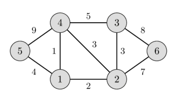
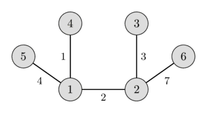

**Tác giả**: 
* Hoàng Việt Cường - Đại học Bách Khoa Hà Nội
* Phan Thành Long - THPT Chuyên Thái Bình (K17-20)

**Reviewer**:
Vương Hoàng Long - Đại học Quốc Gia Singapore 

## Một số kiến thức cần biết
Vì bài viết nói về cây khung nhỏ nhất, các bạn nên đọc một số kiến thức liên quan đến cây trước mà mình liệt kê dưới đây vì đây là những kiến thức rất thường gặp trong những bài tập về cây khung, trong khuôn khổ bài viết mình sẽ không giải thích lại về những kiến thức này nữa:
* [Lowest Common Accessor](https://vnoi.info/wiki/translate/topcoder/Range-Minimum-Query-and-Lowest-Common-Ancestor.md#b%C3%A0i-to%C3%A1n-lowest-common-ancestor-lca)
* [Disjoin Set Union](https://vnoi.info/wiki/algo/data-structures/disjoint-set.md)

**Lưu ý:** Toàn bộ phần code phía dưới sử dụng cho `C++11` trở lên, các bạn lưu ý kiểm tra trình biên dịch của mình.

## Cây khung nhỏ nhất là gì



### Định nghĩa

Theo lý thuyết đồ thị, chúng ta đều biết rằng 1 đồ thị được biểu diễn bằng công thức $G = (V, E)$, trong đó đồ thị $G$ của chúng ta bao gồm tập các đỉnh $V$ và tập các cạnh $E$.

- **Cây khung (*spanning tree*)** của đồ thị là một tập hợp các cạnh của đồ thị thỏa mãn tập cạnh này ***không chứa chu trình*** và ***liên thông*** (từ một đỉnh bất kì có thể đi tới bất kỳ đỉnh nào khác theo mà chỉ dùng các cạnh trên **cây khung**)
- Trong đồ thị **có trọng số**, **cây khung nhỏ nhất (*minimum spanning tree*)** là **cây khung** có tổng trọng số các cạnh trong cây **nhỏ nhất**.

- Một ví dụ về cây khung trong đồ thị vô hướng không trọng số:
<!--

-->


- Một ví dụ về cây khung **nhỏ nhất** trong đồ thị vô hướng có trọng số:



Trong khuôn khổ bài viết, chúng ta sẽ làm việc với **đồ thị vô hướng có trọng số**.

### Tính chất

Một vài tính chất của cây khung nhỏ nhất trong đồ thị vô hướng có trọng số:
* **1. Tính chất chu trình**: Trong một chu trình $C$ bất kỳ, nếu $e$ là cạnh có trọng số lớn nhất **tuyệt đối** (không có cạnh nào có trọng số bằng $e$) thì $e$ không thể nằm trên bất kỳ cây khung nhỏ nhất nào.
    
* **2. Đường đi hẹp nhất**: Xét 2 đỉnh $u$, $v$ bất kỳ trong đồ thị. Nếu $w$ là trọng số của cạnh lớn nhất trên đường đi từ $u$ đến $v$ trên cây khung nhỏ nhất của đồ thị thì ta không thể tìm được đường đi nào từ $u$ đến $v$ trên đồ thị ban đầu chỉ đi qua những cạnh có trọng số nhỏ hơn $w$.
    
* **3. Tính duy nhất**: Nếu tất cả các cạnh đều có trọng số khác nhau thì chỉ có duy một cây khung nhỏ nhất. Ngược lại, nếu một vài cạnh có trọng số giống nhau thì có thể có nhiều hơn một cây khung nhỏ nhất.

* **4. Tính chất cạnh nhỏ nhất**: Nếu $e$ là cạnh có trọng số nhỏ nhất của đồ thị, và không có cạnh nào có trọng số bằng $e$ thì $e$ nằm trong mọi cây khung nhỏ nhất của đồ thị.
   
#### Chứng minh
> **Lưu ý :** các bạn mới học cây khung lần đầu cân nhắc việc đọc chứng minh, tác giả khuyên các bạn nên tạm thời bỏ qua phần này

Xuyên suốt cả bốn tính chất, ta đều sử dụng phép phản chứng để chứng minh
* **1. Tính chất chu trình**:
    Giả sử $e$ thuộc một cây khung $T$ của đồ thị, ta sẽ chứng minh luôn tồn tại một cây khung khác của đồ thị có trọng số nhỏ hơn $T$. 
    - Ta thử xóa cạnh $e$ khỏi cây khung $T$. Lúc này, $T$ sẽ bị chia làm 2 thành phần liên thông và tổng trọng số giảm đi $w_e$.
    - Xét các đỉnh nằm trong chu trình $C$, giả sử sau khi xóa $e$ khỏi cây khung, các đỉnh này vẫn liên thông với nhau. Vì thế, khi thêm $e$ trở lại vào cây khung, $e$ sẽ kết nối 2 đỉnh đã liên thông với nhau $\Rightarrow$ tồn tại chu trình trong cây khung $\Rightarrow$ Trái với giả thiết $T$ là cây khung. 
    ⇒ Vậy nên, khi xóa $e$ khỏi $T$, các đỉnh nằm trong chu trình $C$ sẽ bị tách làm 2 thành phần liên thông. Do đó, ta có thể chọn ra cạnh $e'$ khác $e$ thuộc chu trình $C$ để kết nối 2 thành liên thông này, biến $T$ trở lại thành một cây khung của đồ thị. Mặt khác, $e$ là cạnh có trọng số lớn nhất tuyệt đối trên $C$, nên khi thay $e$ bằng $e'$, trọng số của T sẽ giảm đi $w_e - w_{e'}$
    **Kết luận:** T không phải là cây khung nhỏ nhất của đồ thị.
    
* **2. Đường đi hẹp nhất**: 
    - Xét cây khung nhỏ nhất $T$ bất kỳ của đồ thị $G$ mà tồn tại đường đi $u \rightarrow v$ trên $G$ có cạnh lớn nhất **nhỏ hơn** cạnh lớn nhất của đường đi $u \rightarrow v$ trên $T$. 
    - Gọi đường đi $u \rightarrow v$ trên $G$ là $path$, cạnh lớn nhất của đường đi $u \rightarrow v$ trên $T$ là $e$. 
    ⇒ Như vậy, nếu xóa $e$ khỏi cây khung ban đầu, cây khung sẽ bị chia thành 2 TPLT rời nhau, một TPLT chứa $u$ và TPLT còn lại chứa $v$. 
    - Do $path$ là đường đi $u \rightarrow v$ trên $G$ nên trên $path$ sẽ tồn tại cạnh $e'$ có thể kết nối 2 TPLT này. Mà mọi cạnh trên $path$ đều có trọng số nhỏ hơn $e$ (như giả thiết) 
    ⇒ Khi xoá $e$ và thay bằng $e'$, ta sẽ thu được 1 cây khung $T'$ có trọng số nhỏ hơn cây khung ban đầu 
    **Kết luận:** $T$ không phải cây khung nhỏ nhất của đồ thị.
* **3. Tính duy nhất**: 
    * Giả sử tồn tại 2 cây khung nhỏ nhất $T$ và $T'$. Xét cạnh $u-v$ nằm trong $T$ nhưng không trong $T'$. 
    * Gọi đường đi $u \rightarrow v$ trên $T$ là $path$, trên $T'$ là $path'$. Hiển nhiên, $path'$ không chứa cạnh $u-v$. 
    * Vì trọng số các cạnh của đồ thị đều khác nhau $\Rightarrow$ Cạnh lớn nhất của $path$ sẽ có trọng số lớn hơn trọng số cạnh lớn nhất của $path'$ hoặc ngược lại.
    ⇒ Theo tính chất đường đi hẹp nhất, $T$ hoặc $T'$ sẽ không phải là cây khung nhỏ nhất. 
    
* **4. Tính chất cạnh nhỏ nhất**: 
    > Ta sẽ chứng minh mọi cây khung không chứa $e$ của đồ thị đều không phải là cây khung nhỏ nhất.
    - Giả sử $e$ nối 2 đỉnh $u$, $v$ của đồ thị. Gọi $T$ là 1 cây khung không chứa $e$ của đồ thị. 
    - Xét cạnh $e'$ bất kỳ thuộc đường đi từ $u \rightarrow v$ trên $T$. Khi xóa $e'$ khỏi $T$, $T$ sẽ bị tách làm 2 thành phần liên thông, 1 thành phần liên thông chứa $u$, 1 phần phần liên thông chứa $v$. 
    ⇒ Do đó, ta hoàn toàn có thể thêm cạnh $e$ (nối 2 đỉnh $u- v$) vào $T$ để kết nối 2 thành phần liên thông này, khi đó $T$ sẽ trở lại thành 1 cây khung của đồ thị.
    -  Mặt khác, $e$ là cạnh có trọng số nhỏ nhất tuyệt đối của đồ thị, nên khi thay $e'$ bằng $e$ trên cây khung $T$, trọng số của $T$ sẽ giảm đi 1 lượng dương 
    **Kết luận:** $T$ ban đầu không phải là cây khung nhỏ nhất của đồ thị.
    


## Các thuật toán tìm cây khung nhỏ nhất
### 1. Thuật toán Kruskal
**Ý tưởng thuật toán**: Ban đầu mỗi đỉnh là một cây riêng biệt, ta tìm cây khung nhỏ nhất bằng cách duyệt các cạnh theo trọng số từ nhỏ đến lớn, rồi hợp nhất các cây lại với nhau.

Cụ thể hơn, giả sử cạnh đang xét nối 2 đỉnh $u$ và $v$, nếu 2 đỉnh này nằm ở 2 cây khác nhau thì ta thêm cạnh này vào cây khung, đồng thời hợp nhất 2 cây chứa $u$ và $v$.

Giả sử ta cần tìm cây khung nhỏ nhất của đồ thị $G$. Thuật toán bao gồm các bước sau:
* Khởi tạo rừng $F$ (tập hợp các cây), trong đó mỗi đỉnh của G tạo thành một cây riêng biệt.
* Khởi tạo tập $S$ chứa tất cả các cạnh của $G$.
* Chừng nào $S$ còn **khác rỗng** và $F$ gồm **hơn một cây**
    *  Xóa cạnh nhỏ nhất trong $S$
    *  Nếu cạnh đó nối hai cây khác nhau trong $F$, thì thêm nó vào $F$ và hợp hai cây kề với nó làm một
    *  Nếu không thì loại bỏ cạnh đó.
    
Khi thuật toán kết thúc, rừng chỉ gồm đúng một cây và đó là một cây khung nhỏ nhất của đồ thị $G$

Ví dụ các bước giải bài toán tìm cây khung nhỏ nhất với thuật toán Kruskal :

<!--


-->

Để thực hiện thao tác kiểm tra cạnh và hợp nhất 2 cây một cách nhanh chóng, ta sử dụng cấu trúc **[Disjoint Set](https://vnoi.info/wiki/algo/data-structures/disjoint-set.md)**, dưới đây là đoạn code dùng để cài đặt thuật toán:
```cpp
/*input
4 4
1 2 1
2 3 2
3 4 3
4 1 4
*/
## include <bits/stdc++.h>
using namespace std;

// Cấu trúc để lưu các cạnh đồ thị
// u, v là 2 đỉnh, c là trọng số cạnh
struct Edge {
    int u, v, c;
    Edge(int _u, int _v, int _c): u(_u), v(_v), c(_c) {};
};

struct Dsu {
    vector<int> par;

    void init(int n) {
        par.resize(n + 5, 0);
        for (int i = 1; i <= n; i++) par[i] = i;
    }

    int find(int u) {
        if (par[u] == u) return u;
        return par[u] = find(par[u]);
    }

    bool join(int u, int v) {
        u = find(u); v = find(v);
        if (u == v) return false;
        par[v] = u;
        return true;
    }
} dsu;

// n và m là số đỉnh và số cạnh
// totalWeight là tổng trọng số các cạnh trong cây khung nhỏ nhất
int n, m, totalWeight = 0;
vector < Edge > edges;

int main() {
    // Fast IO
    ios_base::sync_with_stdio(0); cin.tie(0); cout.tie(0);

    cin >> n >> m;

    for (int i = 1; i <= m; i++) {
        int u, v, c;
        cin >> u >> v >> c;
        edges.push_back({u, v, c});
    }

    dsu.init(n);

    // Sắp xếp lại các cạnh theo trọng số tăng dần
    sort(edges.begin(), edges.end(), [](Edge & x, Edge & y) {
        return x.c < y.c;
    });

    // Duyệt qua các cạnh theo thứ tự đã sắp xếp
    for (auto e : edges) {
        // Nếu không hợp nhất được 2 đỉnh u và v thì bỏ qua
        if (!dsu.join(e.u, e.v)) continue;

        // Nếu hợp nhất được u, v ta thêm trọng số cạnh vào kết quả
        totalWeight += e.c;
    }

    // Xuất ra kết quả
    cout << totalWeight << '\n';
}
```
```python
class Dsu:
    def __init__(self, n):
        self.par = list(range(n + 1))

    def find(self, u):
        if self.par[u] == u:
            return u
        self.par[u] = self.find(self.par[u])
        return self.par[u]

    def join(self, u, v):
        u = self.find(u)
        v = self.find(v)
        if u == v:
            return False
        self.par[v] = u
        return True

n, m = map(int, input().split())
edges = []
for _ in range(m):
    u, v, c = map(int, input().split())
    edges.append((c, u, v))

edges.sort()
dsu = Dsu(n)
total_weight = 0

for c, u, v in edges:
    if dsu.join(u, v):
        total_weight += c

print(total_weight)
```
#### Chứng minh tính đúng đắn của thuật toán:
Ta phải chứng minh hai điều: 
1. đầu ra của thuật toán là một cây khung
2. cây đó có trọng số nhỏ nhất trong số tất cả các cây khung của đồ thị.

**Chứng minh (1)**
- Mỗi cạnh $(u, v)$ được xét đến, nó chỉ kết nạp vào câu khung nếu $u, v$ thuộc 2 thành phần liên thông khác nhau $T_u, T_v$ ⇒ Do đó các cạnh được thêm không tạo thành chu trình
- Do $T$ không có chu trình ⇒ số cạnh được thêm $≤ n - 1$. Ta sẽ chứng minh $T$ có đúng $n - 1$ cạnh
    - Giả sử số cạnh được thêm $< n - 1$ ⇒ $T$ gồm hai hay nhiều thành phần liên thông
    - Mặt khác, do $G$ liên thông ⇒ tồn tại các cạnh thuộc $G$ nối các thành phần liên thông đó mà không thuộc $T$. Do đó cạnh đầu tiên nhỏ nhất trong số các cạnh này sẽ được đưa vào do nó không tạo thành chu trình, mâu thuẫn với giả thiết ở trên ⇒ Giả sử sai
    - Vậy số cạnh được thêm vào bằng đúng $n - 1$

**Chứng minh (2)**
> ***Lưu ý*** : Nếu bạn mới học cây khung lần đầu tiên chưa nên đọc ngay chứng minh này, vì chúng có thể khiến bạn hoang mang. Chứng minh có sử dụng một số khái niệm như ***lát cắt***, ***lát cắt hẹp nhất***
 
Trong chứng minh này, mình có quy ước sử dụng một số kí hiệu: 
* $\|A\|$ : số lượng phần tử có trong tập hợp $A$
* $A - B$ : tập hợp các phần tử thuộc $A$ mà không thuộc $B$

Giờ cùng đi vào chi tiết chứng minh nhé (づ◔ ͜ʖ◔)づ
- Gọi $T$ là cây khung đầu ra của thuật toán Kruskal và $T^ \times $ là một cây khung nhỏ nhất, ta sẽ chứng minh tổng trọng số trên $T$ và $T^ \times $ bằng nhau : $c(T)$ = $c(T^ \times )$
- Nếu $c(T)$ = $c(T^ \times )$ ⇒ hiển nhiên đúng
- Nếu $c(T)$ ≠ $c(T^ \times )$ gọi $(u, v)$ là cạnh $\in$ $T$ mà $\notin$ $T^ \times $ hay thuộc $T - T^ \times $. Gọi $S$ là thành phần liên thông chứa u tại thời điểm $(u, v)$ được thêm vào $T$.
    **Nhận xét:** 
    Dễ thấy nếu xóa cạnh $(u, v)$ trên $T$ thì sẽ tách thành 2 **thành phần liên thông** $S$ và $G - S$. 
    Đây là một **lát cắt**, ta có thể thêm bất cứ cạnh nào nối giữa 2 **thành phần liên thông** này để tạo thành một cây mới ⇒ $(u, v)$ $\in$ lát cắt $(S, G - S)$.
    > **Định nghĩa :** Một lát cắt $s$ - $t$ là một tập con của 𝐸 mà khi loại bỏ những cạnh này thì không còn đường đi từ $s$ tới $t$. ([Bài toán lát cắt hẹp nhất](https://vnoi.info//wiki/translate/wcipeg/Flows#bài-toán-lát-cắt-hẹp-nhất-minimun-s-t-cut))
   
    Ta sẽ chứng minh $(u, v)$ thuộc **lát cắt nhỏ nhất** $(S, G - S)$
    - Nếu tồn tại đường đi trọng số $e$ từ $S$ đến $G - S$ có trọng số nhỏ hơn $(u, v)$, thuật toán kruskal sẽ chọn $e$ thay vì $(u, v)$ ⇒ vô lý.
    ⇒ *Ta khẳng định $(u, v)$ có **trọng số nhỏ nhất** trong các cạnh từ $S$ đến $(G - S)$.* **(1)**
    - Mặt khác, bởi vì $T^ \times $ là 1 cây khung nhỏ nhất nên  có một đường từ $S$ tới $G - S$, gọi cạnh thuộc đường này là $(x, y)$. Xét cây khung :
    ${T^ \times }' = T^ \times  \cup (u, v) - (x, y)$ ⇒ $c({T^ \times }') = c(T^ \times ) + c(u, v) - c(x, y)$
    - Do theo **(1)** có:  $c(u, v) ≤ c(x, y)$ nên $c({T^ \times }') ≤ c(T^ \times )$ mà $T^ \times $ là cây khung nhỏ nhất ⇒ $c({T^ \times }')$ = $c(T^ \times )$ và ${T^ \times }'$ cũng là **cây khung nhỏ nhất** ⇒ $|T - {T^ \times }'|$ = $|T - T^ \times | - 1$
    ***Ý nghĩa :** Như vậy ta đã biến đổi được **cây khung nhỏ nhất** ${T^ \times }$ thành cây khung ${T^ \times }'$ cũng là **cây khung nhỏ nhất** mà làm giảm số cạnh khác nhau của $T$ và ${T^ \times }$ đi 1 cạnh*
    - Lặp lại cách chứng minh với mỗi cạnh thuộc $T - {T^ \times }'$, ta sẽ biến đổi được ${T^ \times }'$ thành ${T}$, hay nói cách khác đã đã biến đổi cây khung nhỏ nhất ban đầu về cây khung đầu ra của Kruskal : $c(T) = c(T^ \times )$.

**Đánh giá độ phức tạp thuật toán:** 
Gọi $n$ là số đỉnh, $m$ là số cạnh của đồ thị

Thuật toán gồm 2 phần: 
* Sắp xếp mảng $m$ cạnh theo trọng số tăng dần mất độ phức tạp $O(m \log{m})$.
* Ta duyệt $m$ cạnh, mỗi cạnh dùng Disjoint Set mất độ phức tạp $O(\log{n})$, vậy tổng cộng mất độ phức tạp $O(m\log{n})$.

$\Rightarrow$ độ phức tạp của thuật toán Kruskal là $O(m\log{m} +m\log{n})$


### 2. Thuật toán Prim
**Ý tưởng thuật toán**: Ý tưởng của thuật toán Prim rất giống với ý tưởng của thuật toán Dijkstra (tìm đường đi ngắn nhất trên đồ thị). 
Nếu như thuật toán **Kruskal** xây dựng cây khung nhỏ nhất bằng cách kết nạp từng **cạnh** vào đồ thị thì thuật toán **Prim** lại kết nạp từng **đỉnh** vào đồ thị theo tiêu chí: đỉnh được nạp vào tiếp theo phải **chưa được nạp** và **gần nhất** với các đỉnh đã được nạp vào đồ thị.

Thuật toán bao gồm các bước sau:
* Khởi tạo tập $S$ là cây khung hiện tại, ban đầu **S** chưa có đỉnh nào.
* Khởi tạo mảng $D$ trong đó $D_i$ là khoảng cách ngắn nhất từ đỉnh $i$ đến 1 đỉnh đã được kết nạp vào tập $S$, ban đầu $D[i]$ = $+\infty$
* Lặp lại các thao tác sau $n$ lần($n$ là số cạnh của đồ thị)
    *  Tìm đỉnh $u$ không thuộc $S$ có $D_u$ nhỏ nhất, thêm $u$ vào tập $S$.
    *  Xét tất cả các đỉnh $v$ kề $u$, cập nhật $D_v = min(D_v, w_{u,v})$ với $w_{u,v}$ là trọng số cạnh $u-v$. Nếu $D_v$ được cập nhật theo $w_{u,v}$ thì đánh dấu $trace_v = u$.
    *  Thêm cạnh $u-trace[u]$ vào tập cạnh thuộc cây khung nhỏ nhất.
    
Mặc dù không bắt buộc, các bạn có thể đọc chứng minh tính đúng đắn thuật toán của Wiki tại [đây](https://vi.wikipedia.org/wiki/Thu%E1%BA%ADt_to%C3%A1n_Prim#Ch%E1%BB%A9ng_minh).

Khi hoàn thành xong $n$ bước trên, ta thu được cây khung nhỏ nhất của đồ thị gồm $n$ đỉnh và $n - 1$ cạnh.

Ví dụ các bước giải bài toán tìm cây khung nhỏ nhất với thuật toán Prim:


Đoạn code sử dụng để cài đặt thuật toán Prim:
```cpp
/*input
4 4
1 2 1
2 3 2
3 4 3
4 1 4
*/
## include "bits/stdc++.h"
using namespace std;
## define fi first
## define se second

const int N = 1e5 + 5;
const int INF = 1e9;

// khai báo đồ thị. g[u] chứa các cạnh nối với đỉnh u. Các cạnh sẽ được lưu dưới dạng pair<v,c>
int n, m;
vector <pair<int, int>> g[N];

int dis[N]; // mảng d lưu khoảng cách của toàn bộ đỉnh

int prim(int s) { // thuật toán Prim bắt đầu chạy từ đỉnh nguồn s
    int ret = 0;
    // Sử dụng priority_queue lưu khoảng cách của các đỉnh tăng dần đối với cây khung
    // Vì priority_queue.top luôn là phần tử lớn nhất, ta sẽ phải sử dụng greater<pair<int,int>>
    // để priority_queue.top là phần tử nhỏ nhất
    // các phần tử lưu trong priority queue sẽ có dạng pair<dis[u],u>
    priority_queue<pair<int, int>, vector<pair<int,int>>, greater<pair<int,int>>> q;

    // khởi tạo khoảng cách của các đỉnh là vô cùng lớn
    for (int i = 1; i <= n; i++) dis[i] = INF;

    // khởi tạo đỉnh nguồn có khoảng cách là 0 và push đỉnh này vào
    dis[s] = 0;
    q.push({0, s});

    while (!q.empty()) {
        // lấy đỉnh có khoảng cách nhỏ nhất chưa được kết nạp
        auto top = q.top(); q.pop();
        int curDis = top.fi; int u = top.se;

        if (curDis != dis[u]) continue;

        // kết nạp đỉnh u vào cây khung
        ret += dis[u]; dis[u] = -INF;

        // cập nhất khoảng cách cho các đỉnh kề u
        for (auto &e : g[u]) {
            int v = e.fi; int c = e.se;
            if (dis[v] > c) {
                dis[v] = c;
                q.push({ dis[v], v});
            }
        }
    }
    return ret;
}
int main() {
    ios_base::sync_with_stdio(0); cin.tie(0); cout.tie(0);

    cin >> n >> m;

    for (int i = 1; i <= m; i++) {
        int u, v, c;
        cin >> u >> v >> c;
        g[u].push_back({v, c});
        g[v].push_back({u, c});
    }

    cout << prim(1) << '\n';
}
```
```python
import heapq

def prim(n, g, s):
    INF = 10**9
    dis = [INF] * (n + 1)
    dis[s] = 0
    h = [(0, s)]
    ret = 0

    while h:
        cur_dis, u = heapq.heappop(h)
        if cur_dis != dis[u]:
            continue
        ret += dis[u]
        dis[u] = -INF
        for v, c in g[u]:
            if dis[v] > c:
                dis[v] = c
                heapq.heappush(h, (dis[v], v))
    return ret

n, m = map(int, input().split())
g = [[] for _ in range(n + 1)]
for _ in range(m):
    u, v, c = map(int, input().split())
    g[u].append((v, c))
    g[v].append((u, c))

print(prim(n, g, 1))
```
Đánh giá độ phức tạp thuật toán: 
- Ta duyệt tổng cộng $n$ lần, mỗi lần lấy 1 đỉnh ra khỏi heap mất $O(\log{n})$ và cập nhật trọng số của tất cả các đỉnh kề với đỉnh đó, tổng số lần cập nhật là $m$ lần, mỗi lần cập nhật ta mất độ phức tạp $O(\log{n})$. 
- Như vậy, độ phức tạp của thuật toán Prim là $O((m + n)\log{n})$ với n là số đỉnh và m là số cạnh của đồ thị.

**Fact**: Trong các bài toán tìm cây khung, phần lớn mọi người sẽ sử dụng thuật toán **Kruskal** do tính dễ cài đặt cũng như dễ hiểu của nó. 
> **Bonus :** Các bạn có thể sử dụng [Visualgo](https://visualgo.net/en/mst) để  mô phỏng thuật toán Kruskal và Prim thông qua hoạt ảnh, qua đó hiểu thêm về các thuật toán trên


## Một số bài toán áp dụng
### 1. Bài toán [NKCITY](https://oj.vnoi.info/problem/nkcity)
#### Tóm tắt đề bài
1 thành phố gồm $N$ trọng điểm, $M$ tuyến đường có thể được xây dựng với chi phí xây dựng khác nhau. Yêu cầu chọn ra một số tuyến đường sao cho $N$ trọng điểm phải được liên thông với nhau và chi phí xây dựng tuyến đường lớn nhất là nhỏ nhất có thể.
#### Thuật toán
Dựa vào tính chất **đường đi hẹp nhất** của cây khung mà ta đã trình bày ở trên, đường đi giữa 2 đỉnh $u$, $v$ bất kỳ trên cây khung nhỏ nhất là đường đi có cạnh lớn nhất là nhỏ nhất của đồ thị. 
Như vậy việc chọn ra các tuyến đường để xây dựng chỉ đơn giản là chọn các cạnh trên cây khung nhỏ nhất của đồ thị.
#### Độ phức tạp
Chính là độ phức tạp của thuật toán tìm cây khung nhỏ nhất mà các bạn sẽ cài đặt. 
#### Cài đặt
Ở đây ta sẽ dùng Kruskal để tìm cây khung nhỏ nhất
```cpp
/*input
4 4
1 2 1
2 3 2
3 4 3
4 1 4
*/
## include <bits/stdc++.h>
using namespace std;

struct Edge {
    int u, v, c;
    Edge(int _u, int _v, int _c): u(_u), v(_v), c(_c) {};
};

struct Dsu {
    vector<int> par;

    void init(int n) {
        par.resize(n + 5, 0);
        for (int i = 1; i <= n; i++) par[i] = i;
    }

    int find(int u) {
        if (par[u] == u) return u;
        return par[u] = find(par[u]);
    }

    bool join(int u, int v) {
        u = find(u); v = find(v);
        if (u == v) return false;
        par[v] = u;
        return true;
    }
} dsu;

int n, m, maxWeight = 0;
vector < Edge > edges;

int main() {
    ios_base::sync_with_stdio(0); cin.tie(0); cout.tie(0);

    cin >> n >> m;

    for (int i = 1; i <= m; i++) {
        int u, v, c;
        cin >> u >> v >> c;
        edges.push_back({u, v, c});
    }

    dsu.init(n);

    sort(edges.begin(), edges.end(), [](Edge & x, Edge & y) {
        return x.c < y.c;
    });

    for (auto e : edges) {
        if (!dsu.join(e.u, e.v)) continue;
        maxWeight = max(maxWeight, e.c);
    }

    cout << maxWeight << '\n';
}
```

### 2. Bài toán [tìm cây khung nhỏ nhất cho mỗi cạnh - Codeforces 609E](https://codeforces.com/contest/609/problem/E)
#### Tóm tắt đề bài
Cho đồ thị vô hướng $G$ gồm $n$ đỉnh và $m$ cạnh. Yêu cầu với mỗi cạnh trong đồ thị, tìm cây khung nhỏ nhất **chứa cạnh đó** của đồ thị và in ra trọng số của cây khung đó.

Đây là 1 bài tập khá kinh điển về cây khung nhỏ nhất. Để giải được bài tập này, chúng ta cần giải bài LUBENICA trước. Các bạn có thể đọc thêm về bài ở [đây](lubenica-vnoj)
#### Thuật toán: 
* Đầu tiên, ta dựng cây khung nhỏ nhất $S$ của đồ thị ban đầu:
* Sau đó, ta lần lượt đi tìm cây khung nhỏ nhất chứa mỗi cạnh của đồ thị. Với 1 cạnh i nối 2 đỉnh $u$, $v$ với trọng số $w$, có 2 trường hợp xảy ra:
    * Cạnh $u-v$ đã thuộc cây khung nhỏ nhất $S$ ban đầu, cây khung cần tìm chính là $S$.
    * Cạnh $u-v$ không thuộc cây khung nhỏ nhất $S$. Như vậy nếu thêm cạnh $u-v$ vào cây khung sẽ tạo thành chu trình từ $u\rightarrow v$. Do đó ta phải xóa đi 1 cạnh trên chu trình này để đảm bảo tính chất của cây khung. Và đương nhiên để tối ưu thì ta sẽ chọn xóa đi cạnh có **trọng số lớn nhất** trên đường đi từ $u \rightarrow v$ (đã được trình bày trong bài LUBENICA ở trên) và thêm cạnh $u-v$ vào cây khung sau khi đã xóa cạnh đó.

#### Code mẫu:
```cpp
/*input
8 10
8 7 11
3 5 23
2 1 23
7 2 13
6 4 18
1 4 20
8 4 17
2 8 8
3 2 9
5 6 29
*/
## include <bits/stdc++.h>
using namespace std;
## define fi first
## define se second
## define bit(x, k) (1ll&(x >> k))

using ll = long long;
const int N = 2e5 + 5;
const ll INF = 1e18;

struct Edge {
    int u, v, c, id;
    Edge(int _u, int _v, int _c, int _id): u(_u), v(_v), c(_c), id(_id) {};
};

struct Data {
    int par; ll maxc = -INF;
};

struct Dsu {
    vector<int> par;

    void init(int n) {
        par.resize(n + 5, 0);
        for (int i = 1; i <= n; i++) par[i] = i;
    }

    int find(int u) {
        if (par[u] == u) return u;
        return par[u] = find(par[u]);
    }

    bool join(int u, int v) {
        u = find(u); v = find(v);
        if (u == v) return false;
        par[v] = u;
        return true;
    }
} dsu;

int n, m; ll mstWeight = 0;
int h[N]; ll res[N];
vector <Edge> edges;
vector <pair <int, int>> g[N];
Data up[N][21];

void dfs(int u, int p) {
    up[u][0].par = p;
    for (auto &e : g[u]) {
        int v = e.fi; int c = e.se;
        if (v == p) continue;
        h[v] = h[u] + 1;
        up[v][0].maxc = c;
        dfs(v, u);
    }
}

// tìm cạnh có trọng số lớn nhất trên đường đi u, v như bài LUBENICA
ll lca(int u, int v) {
    ll ret = -INF;
    if (h[u] < h[v]) swap(u, v);
    int depth = h[u] - h[v];
    for (int i = 0; i <= 20; i++) {
        if (bit(depth, i)) {
            ret = max(ret, up[u][i].maxc);
            u = up[u][i].par;
        }
    }

    if (u == v) return ret;

    for (int i = 20; i >= 0; i--) {
        if (up[u][i].par != up[v][i].par) {
            ret = max({ret, up[u][i].maxc, up[v][i].maxc});
            u = up[u][i].par; v = up[v][i].par;
        }
    }
    ret = max({ret, up[u][0].maxc, up[v][0].maxc});
    return ret;
}

void buildMST() {
    dsu.init(n);
    sort(edges.begin(), edges.end(), [](Edge & x, Edge & y) {
        return x.c < y.c;
    });

    for (auto &e : edges) {
        if (!dsu.join(e.u, e.v)) continue;
        g[e.u].push_back({e.v, e.c});
        g[e.v].push_back({e.u, e.c});
        res[e.id] = -1; // đánh dấu là cạnh này thuộc cây khung nhỏ nhất
        mstWeight += e.c;
    }
}

void buildLCA() {
    dfs(1, 1);
    for (int i = 1; i <= 20; i++) {
        for (int u = 1; u <= n; u++) {
            up[u][i].par = up[up[u][i - 1].par][i - 1].par;
            up[u][i].maxc = max(up[u][i - 1].maxc, up[up[u][i - 1].par][i - 1].maxc);
        }
    }
}

int main() {
    ios_base::sync_with_stdio(0); cin.tie(0); cout.tie(0);
    cin >> n >> m;
    for (int i = 1; i <= m; i++) {
        int u, v, c;
        cin >> u >> v >> c;
        edges.push_back({u, v, c, i});
    }

    // dựng cây khung nhỏ nhất
    buildMST();

    // dựng LCA
    buildLCA();

    // tìm cây khung nhỏ nhất cho từng cạnh
    for (auto &e : edges) {
        if (res[e.id] == -1) res[e.id] = mstWeight;
        else res[e.id] = mstWeight - lca(e.u, e.v) + e.c;
    }

    // in ra kết quả
    for (int i = 1; i <= m; i++) cout << res[i] << "\n";
    return 0;
}
```


### 3. Bài toán [160D - Edges in MST](https://codeforces.com/problemset/problem/160/D)
#### Tóm tắt đề bài
Cho đồ thị vô hướng có trọng số $G$ gồm $n$ đỉnh và $m$ cạnh. Yêu cầu với mỗi cạnh trong đồ thị, kiểm tra xem cạnh đó **không thuộc** bất kỳ cây khung nhỏ nhất nào, thuộc **một số** cây khung nhỏ nhất hay nằm trong **mọi** cây khung nhỏ nhất của đồ thị.

#### Thuật toán
- Ban đầu, khởi tạo đồ thị $G'$ rỗng. Ta sẽ xét lần lượt từng nhóm các cạnh có cùng trọng số và thêm chúng vào đồ thị $G'$. Đồng thời, với mỗi cạnh ta không quan tâm nó nối 2 đỉnh nào mà chỉ quan tâm nó nối 2 **TPLT** nào trong đồ thị hiện tại. 
- Nhận xét rằng nếu có cạnh kết nối 2 **TPLT khác nhau**, các cạnh này sẽ xuất hiện trong **ít nhất** 1 cây khung nhỏ nhất. Ngược lại, nếu 1 cạnh nối 2 đỉnh **đã liên thông** từ trước thì cạnh này sẽ **không thuộc** bất kỳ cây khung nhỏ nhất nào.
- Xét các nhóm cạnh có **cùng trọng số** mà thuộc **2 thành phần liên thông khác nhau**, ta dựng đồ thị $G$ mới từ các nhóm cạnh đó với các đỉnh là các thành phần liên thông.
- **Dễ thấy** : Chọn tập cạnh từ $G$ để thêm vào cây khung, tập cạnh đó phải thỏa mãn  không tạo ra chu trình và không làm tăng thành phần liên thông của $G$ bởi vì : 
    -  Nếu tập cạnh chọn chứa chu trình thì đầu ra không còn là cây khung
    -  Nếu tập cạnh làm tăng số lượng thành phần liên thông của $G$ thì cây khung sẽ mất tính **nhỏ nhất** 
- Vậy cạnh nằm trong **mọi cây khung** sẽ phải là cạnh mà nằm trong **mọi tập cạnh** mình chọn ở trên, nếu tập cạnh thiếu nó thì vi phạm tính **nhỏ nhất**. 
⇒ Có nghĩa là nếu thiếu cạnh đó thì sẽ làm tăng **thành phần liên thông** của $G$. Vậy đó chỉ có thể là **cạnh cầu**.
- Kết luận : 
    -  Các **cạnh cầu** sẽ nằm trong **mọi** cây khung nhỏ nhất của đồ thị
    -  Các cạnh còn lại **không phải cạnh cầu** sẽ thuộc **một số** cây khung nhỏ nhất
    - **Xem thêm** : [Tìm cạnh cầu](https://vnoi.info/wiki/algo/graph-theory/Depth-First-Search-Tree.md#tìm-cạnh-cầu)

#### Độ phức tạp
- Đầu tiên, ta phải sắp xếp lại các cạnh theo trọng số tăng dần mất đpt $O(m\log{m})$. Sau đó, ta phải duy trì 1 đồ thị hiện tại trong quá trình lần lượt thêm các nhóm cạnh vào đồ thị, ở đây ta sử dụng **Disjoint Set** để kiểm tra 2 đỉnh nối 2 TPLT nào cũng như thêm các cạnh vào đồ thị hiện tại.
- Thuật toán **Tarjan** để tìm **cầu** có độ phức tạp $O(m + n)$ cho toàn đồ thị 
⇒ Như vậy, độ phức tạp tổng của bài toán là $O(m\log{m} + m\log{n} + n)$.

#### Cài đặt
```cpp
/*input
4 5
1 2 101
1 3 100
2 3 2
2 4 2
3 4 1
*/
## include "bits/stdc++.h"
using namespace std;
## define fi first
## define se second

const int N = 1e5 + 5;

enum EdgeType {
    NONE, // không cây nào chứa
    ANY, // tất cả các cây đều chứa
    ATL // ít nhất 1 cây chứa
};

struct Edge {
    int u, v, c, id;
    Edge(int _u, int _v, int _c, int _id): u(_u), v(_v), c(_c), id(_id) {};
};

struct Dsu {
    vector<int> par;

    void init(int n) {
        par.resize(n + 5, 0);
        for (int i = 1; i <= n; i++) par[i] = i;
    }

    int find(int u) {
        if (par[u] == u) return u;
        return par[u] = find(par[u]);
    }

    bool join(int u, int v) {
        u = find(u); v = find(v);
        if (u == v) return false;
        par[v] = u;
        return true;
    }
} dsu;

vector <pair<int, int>> g[N];
int low[N], num[N], Time = 0;
int n, m;
EdgeType res[N];
vector <Edge> edges;

void dfs(int u, int idx) {
    num[u] = low[u] = ++Time;
    for (auto &e : g[u]) {
        int v = e.fi; int id = e.se;
        if (id == idx) continue;
        if (num[v] == 0) {
            dfs(v, id);
            low[u] = min(low[u], low[v]);
            if (low[v] == num[v]) {
                // nếu cạnh là cầu thì mọi cây đều phải chứa
                res[id] = EdgeType::ANY;
            }
        }
        else {
            low[u] = min(low[u], num[v]);
        }
    }
}
void solve(vector<Edge> &pen) { // xử lý các nhóm cạnh có cùng trọng số
    if (pen.empty()) return;

    // khởi tạo đồ thị nối các thành phần liên thông
    for (int i = 0; i < pen.size(); i++) {

        // sử dụng đỉnh cha trong dsu làm đỉnh đại diện cho thành phần liên thông
        pen[i].u = dsu.find(pen[i].u); pen[i].v = dsu.find(pen[i].v);
        g[pen[i].u].clear(); g[pen[i].v].clear();
        num[pen[i].u] = num[pen[i].v] = 0;
    }

    for (auto e : pen) {
        if (e.u == e.v) {
            // nếu 2 đỉnh cùng thuộc 1 thành phần liên thông
            res[e.id] = EdgeType::NONE;
        }
        else {
            // nếu 2 đỉnh nối 2 thành phần liên thông khác nhau lại với nhau
            res[e.id] = EdgeType::ATL;
            // thêm cạnh vào đồ thị
            g[e.v].push_back({e.u, e.id});
            g[e.u].push_back({e.v, e.id});
        }
    }

    // tìm cạnh cầu
    for (auto &e : pen) if (num[e.u] == 0) dfs(e.u, -1);
    // sau khi hoàn thành, ta thực hiện hợp các cạnh vào cây khung
    for (auto &e : pen) dsu.join(e.u, e.v);
}

int main() {
    ios_base::sync_with_stdio(0); cin.tie(0); cout.tie(0);

    cin >> n >> m;
    for (int i = 1; i <= m; i++) {
        int u, v, c;
        cin >> u >> v >> c;
        edges.push_back({u, v, c, i});
    }

    dsu.init(n);

    sort(edges.begin(), edges.end(), [](Edge x, Edge y) {
        return x.c < y.c;
    });

    vector<Edge> pen;
    for (auto &e : edges) {
        if (!pen.empty() && pen.back().c == e.c) {
            pen.push_back(e);
        }
        else {
            solve(pen);
            pen = {e};
        }
    }
    solve(pen);

    // in ra kết quả
    for (int i = 1; i <= m; i++) {
        if (res[i] == EdgeType::NONE) cout << "none\n";
        else if (res[i] == EdgeType::ANY) cout << "any\n";
        else cout << "at least one\n";
    }
}
```


## Luyện tập
Các bạn có thể thử sức với một số bài tập sau:
* [P186SUMF](https://www.spoj.com/PTIT/problems/P186SUMF/) - [959E](https://codeforces.com/problemset/problem/959/E)
* [VMST](https://vn.spoj.com/problems/VMST/)
* [C11WATER](https://codeforces.com/group/FLVn1Sc504/contest/274809/problem/B)
* [CHEER](https://codeforces.com/group/FLVn1Sc504/contest/274809/problem/M)
---
> :books: **Xem thêm:** [Tổng hợp bài học](../../lessons/index.md) - Phiên bản biên soạn dễ hiểu hơn.
