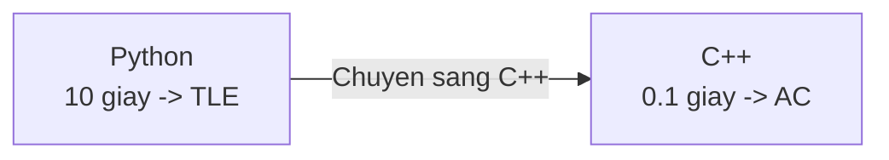
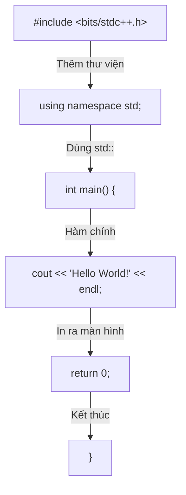
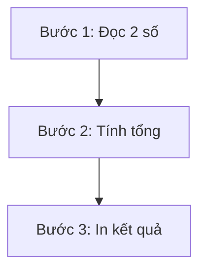
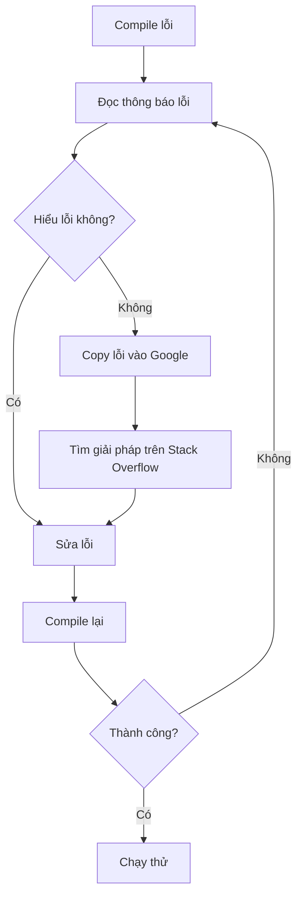

# C01: Cài đặt C++ & Hello World

> **Bạn sẽ học được:** Cài đặt C++, viết chương trình đầu tiên, hiểu tại sao C++ phổ biến trong thi đấu<br>
> **Yêu cầu:** Biết sử dụng máy tính cơ bản<br>
> **Thời gian:** 30 phút

---

## Tại sao phải học C++?

### Câu chuyện: Cuộc thi chạy

Hãy tưởng tượng bạn tham gia một cuộc thi chạy:

- **Python** = Người chạy bộ (dễ bắt đầu, nhưng chậm)
- **C++** = Xe đua (phải học lái, nhưng **nhanh gấp 100 lần**)

Trong thi đấu lập trình, tốc độ **rất quan trọng**. Một bài toán Python chạy 10 giây có thể bị **TLE** (Time Limit Exceeded), nhưng C++ chỉ chạy mất **0.1 giây**.



### Bảng so sánh chi tiết

| Tiêu chí | Python | C++ | Ai thắng? |
|----------|--------|-----|-----------|
| **Tốc độ** | ~10⁶ phép tính/giây | **~10⁸ phép tính/giây** | C++ |
| **Cú pháp** | Đơn giản, dễ đọc | Phức tạp hơn | Python |
| **Compile** | Chạy trực tiếp | Phải compile trước | Python |
| **Thư viện** | Nhiều built-in | **STL rất mạnh** | C++ |
| **Đệ quy** | Giới hạn ~1000 lớp | Giới hạn lớn hơn | C++ |
| **Phổ biến** | Ít người thi đấu | **Hầu hết thí sinh** | C++ |

!!! tip "Kết luận"
    **Python** phù hợp để **học thuật toán** (dễ hiểu, dễ viết).<br>
    **C++** phù hợp để **thi đấu** (nhanh, mạnh, phổ biến).

---

## Cài đặt C++

### Cách 1: MinGW (Windows) — Khuyến nghị

!!! info "MinGW là gì?"
    MinGW là bộ công cụ biên dịch C/C++ trên Windows. Đây là cách **phổ biến nhất** để cài GCC trên Windows.

#### Bước 1: Tải MinGW

Tải bản build chính thức từ GitHub:

**[niXman/mingw-builds-binaries/releases](https://github.com/niXman/mingw-builds-binaries/releases)**

!!! warning "Chọn đúng bản tải về"
    Nếu bạn dùng **Windows 64-bit** (hầu hết máy hiện đại), hãy tải:

    | Phiên bản | Mô tả | Link tải |
    |-----------|-------|----------|
    | **`x86_64-16.1.0-release-seh-ucrt-rt_v14-rev0.7z`** | **Khuyến nghị** — 64-bit, SEH, UCRT | [Tải về](https://github.com/niXman/mingw-builds-binaries/releases/download/16.1.0-rt_v14-rev0/x86_64-16.1.0-release-seh-ucrt-rt_v14-rev0.7z) |

    - **x86_64** = 64-bit (phù hợp hầu hết máy)
    - **seh** = cơ chế exception handling tốt nhất cho 64-bit
    - **ucrt** = Universal C Runtime (hiện đại, đi kèm Windows 10+)
    - **Dung lượng:** ~102 MB

#### Bước 2: Giải nén

1. Tải file `.7z` về (dùng [7-Zip](https://www.7-zip.org/) để giải nén)
2. Giải nén vào ổ `C:\` → được thư mục `C:\mingw64\`

!!! tip "Nên giải nén vào đâu?"
    - **Tốt nhất:** `C:\mingw64\` (đường dẫn ngắn, không có dấu cách)
    - **Tránh:** `C:\Program Files\` (có dấu cách sẽ gây lỗi)

#### Bước 3: Thêm vào PATH

1. Mở **Start** → tìm **"Edit the system environment variables"**
2. Nhấn **"Environment Variables"**
3. Trong phần **System variables**, tìm biến `Path` → nhấn **Edit**
4. Nhấn **New** → thêm: `C:\mingw64\bin`
5. Nhấn **OK** ở tất cả cửa sổ

#### Bước 4: Kiểm tra

Mở **Command Prompt** (hoặc PowerShell), gõ:

```bash
g++ --version
```

Nếu thấy thông tin phiên bản GCC là đã thành công:

```
g++ (x86_64-posix-seh-rev0, Built by MinGW-Builds project) 16.1.0
```

### Cách 2: GCC (Linux/Mac)

```bash
# Ubuntu/Debian
sudo apt install g++

# Mac
brew install gcc
```

### Cách 3: Online (Không cần cài đặt)

- **[Godbolt](https://godbolt.org/)** — Compiler online, xem assembly
- **[Replit](https://replit.com/)** — IDE online miễn phí
- **[OnlineGDB](https://www.onlinegdb.com/)** — Chạy C++ online

---

## Chọn IDE / Text Editor

!!! question "Nên chọn IDE nào?"
    Nếu bạn **chưa biết chọn gì**, hãy dùng **Code::Blocks**. Đây là IDE **phổ biến nhất** trong thi đấu lập trình tại Việt Nam.

### Code::Blocks (Rất khuyến nghị)

1. Tải [Code::Blocks](http://www.codeblocks.org/) — Chọn phiên bản có **MinGW** (ví dụ: `codeblocks-20.03mingw-setup.exe`)
2. Cài đặt, mở Code::Blocks
3. Tạo project mới → Chọn **"Console Application"** → Chọn **"C++"**
4. Đặt tên project → Chọn nơi lưu → Finish
5. Gõ code vào file `main.cpp`, nhấn **F9** để build và chạy

!!! tip "Tại sao Code::Blocks rất khuyến nghị?"
    - **Phổ biến nhất** trong thi đấu lập trình tại Việt Nam
    - **Được phép** dùng trong hầu hết kỳ thi (HSG, VOI, IOI)
    - **Nhẹ**, không tốn tài nguyên máy
    - **Đã có sẵn compiler** MinGW (không cần cài thêm)
    - **Debug** dễ dàng (F8 chạy từng dòng, F4 chạy đến con trỏ)

### Dev-C++ (Cũng rất tốt)

1. Tải [Dev-C++](https://sourceforge.net/projects/orwelldevcpp/)
2. Cài đặt, mở Dev-C++
3. Tạo file mới → Chọn **"C++ Source File"**
4. Gõ code, nhấn **F11** để compile và chạy

---

## Chương trình đầu tiên: Hello World

### Code

```cpp
#include <bits/stdc++.h>
using namespace std;

int main() {
    cout << "Hello World!" << endl;
    return 0;
}
```

### Giải thích từng dòng



| Dòng code | Ý nghĩa | So sánh Python |
|-----------|---------|----------------|
| `#include <bits/stdc++.h>` | Thêm **tất cả** thư viện chuẩn | Không cần trong Python |
| `using namespace std;` | Để không phải viết `std::cout` | Không cần trong Python |
| `int main()` | Hàm chính — chương trình bắt đầu từ đây | Không cần trong Python |
| `cout << "Hello World!" << endl;` | In ra màn hình + xuống dòng | `print("Hello World!")` |
| `return 0;` | Kết thúc chương trình (0 = thành công) | Không cần trong Python |

!!! tip "Hiểu đơn giản"
    - `cout` = **c**haracter **out**put = in ký tự ra màn hình
    - `<<` = mũi tên chỉ hướng: dữ liệu **chảy từ** biến **ra** màn hình
    - `endl` = **end** **l**ine = xuống dòng

### Compile và chạy

```bash
# Bước 1: Compile — chuyển code thành file thực thi
g++ -o hello hello.cpp

# Bước 2: Chạy file thực thi
./hello
```

Output:
```
Hello World!
```

!!! warning "Lưu ý khi compile"
    - File code phải có đuôi `.cpp` (ví dụ: `hello.cpp`)
    - Nếu dùng Code::Blocks/Dev-C++, chỉ cần nhấn **F9** hoặc **F11**
    - Nếu compile lỗi, đọc thông báo lỗi để sửa

---

## Template thi đấu C++

Khi thi đấu, **luôn dùng template này** để code chạy nhanh nhất:

```cpp
#include <bits/stdc++.h>
using namespace std;

int main() {
    ios_base::sync_with_stdio(false);
    cin.tie(NULL);
    return 0;
}
```

### Giải thích template

| Lệnh | Ý nghĩa | Tại sao cần? |
|------|---------|--------------|
| `#include <bits/stdc++.h>` | Include **tất cả** thư viện chuẩn | Tiện hơn include từng cái |
| `ios_base::sync_with_stdio(false)` | **Tắt** đồng bộ C và C++ I/O | **Nhanh hơn** ~2-3 lần |
| `cin.tie(NULL)` | **Tách** cin và cout | **Nhanh hơn** khi nhập/xuất nhiều |

!!! warning "Khi dùng template này"
    - **Không** dùng `scanf`/`printf` (C-style I/O) cùng với `cin`/`cout`
    - **Không** dùng `puts`/`gets` cùng với `cout`/`cin`

!!! tip "Ghi nhớ template"
    Hãy **copy template này vào file template.cpp** trong thư mục thi đấu. Mỗi lần bắt đầu bài mới, chỉ cần copy-paste.

---

## Đọc dữ liệu và in ra — Bài toán đầu tiên

### Bài toán: Đọc 2 số và in tổng

**Input:**
```
3 5
```
**Output:**
```
8
```

### Cách suy nghĩ (Step-by-step)



### Code

```cpp
#include <bits/stdc++.h>
using namespace std;

int main() {
    ios_base::sync_with_stdio(false);
    cin.tie(NULL);
    
    int a, b;           // Khai báo 2 biến nguyên
    cin >> a >> b;      // Đọc 2 số từ bàn phím
    cout << a + b << endl;  // In tổng ra màn hình
    
    return 0;
}
```

### So sánh với Python

=== "Python"

    ```python
    a, b = map(int, input().split())
    print(a + b)
    ```

=== "C++"

    ```cpp
    #include <bits/stdc++.h>
    using namespace std;
    
    int main() {
        ios_base::sync_with_stdio(false);
        cin.tie(NULL);
        
        int a, b;
        cin >> a >> b;
        cout << a + b << endl;
        
        return 0;
    }
    ```

!!! tip "Nhớ"
    | Python | C++ |
    |--------|-----|
    | `input().split()` | `cin >> a >> b` |
    | `print(x)` | `cout << x << endl` |
    | `int(x)` | Không cần (đã khai báo `int`) |

---

## Common Mistakes — Lỗi thường gặp

### Lỗi 1: Quên `#include`

```cpp
// ❌ SAI: Quên include
cout << "Hello";  // Lỗi compile: 'cout' was not declared

// ✅ ĐÚNG
#include <bits/stdc++.h>
using namespace std;
cout << "Hello";
```

### Lỗi 2: Quên `using namespace std`

```cpp
// ❌ SAI: Không có using namespace std
cout << "Hello";  // Lỗi compile: 'cout' was not declared in this scope

// ✅ ĐÚNG: Thêm using namespace std
using namespace std;
cout << "Hello";

// ✅ HOẶC: Dùng std::
std::cout << "Hello";
```

### Lỗi 3: Quên chấm phẩy

```cpp
// ❌ SAI: Quên chấm phẩy
int x = 5  // Lỗi compile: expected ';' before...

// ✅ ĐÚNG
int x = 5;
```

### Lỗi 4: Dùng `=` thay vì `==`

```cpp
// ❌ SAI: Dùng = (gán) thay vì == (so sánh)
if (x = 5) { ... }  // Luôn đúng! (gán x = 5, rồi kiểm tra x)

// ✅ ĐÚNG
if (x == 5) { ... }
```

### Lỗi 5: Quên `return 0`

```cpp
// ❌ SAI: Quên return 0
int main() {
    cout << "Hello";
}  // Chương trình vẫn chạy nhưng không tốt

// ✅ ĐÚNG
int main() {
    cout << "Hello";
    return 0;
}
```

!!! tip "Mẹo tránh lỗi"
    - Luôn dùng **template thi đấu** (đã có sẵn `return 0`)
    - Nếu compile lỗi, đọc **dòng lỗi** (thường chỉ ra đúng dòng bị sai)
    - Nếu không hiểu lỗi, **copy lỗi vào Google** để tìm cách sửa

---

## Debug — Tìm và sửa lỗi

### Khi compile lỗi



### Các lỗi compile phổ biến

| Thông báo lỗi | Nguyên nhân | Cách sửa |
|---------------|-------------|----------|
| `'cout' was not declared` | Quên `#include <bits/stdc++.h>` | Thêm include |
| `expected ';' before` | Quên chấm phẩy | Thêm `;` |
| `expected '}'` | Quên đóng ngoặc | Thêm `}` |
| `lvalue required` | Dùng `=` thay vì `==` | Đổi thành `==` |
| `undefined reference to 'main'` | Không có hàm `main` | Thêm `int main() {}` |

### Khi chạy sai kết quả

1. **In ra các biến trung gian** để kiểm tra
2. **Chạy thử với input nhỏ** trước
3. **Kiểm tra logic** từng bước

---

## Compile với tối ưu

```bash
# Compile bình thường (dùng khi debug)
g++ -o solution solution.cpp

# Compile với tối ưu tốc độ (dùng khi thi đấu)
g++ -O2 -o solution solution.cpp

# Compile với tất cả cảnh báo (dùng khi debug)
g++ -Wall -Wextra -o solution solution.cpp

# Compile với C++17
g++ -std=c++17 -o solution solution.cpp

# Kết hợp: tối ưu + C++17
g++ -O2 -std=c++17 -o solution solution.cpp
```

!!! tip "Trong thi đấu"
    - Luôn compile với `-O2` để tối ưu tốc độ
    - Dùng C++17 hoặc C++20 nếu được phép
    - Code trên Code::Blocks/Dev-C++ đã tự động tối ưu

---

## Bài tập thực hành

### Bài 1: Hello World
Viết chương trình in "Hello World!".

<div class="cp-pg" data-language="cpp" data-starter="#include &lt;bits/stdc++.h&gt;\nusing namespace std;\n\nint main() {\n    // Viết code ở đây\n    return 0;\n}" data-input="" data-expected="Hello World!" data-hint="Dùng cout &lt;&lt; &quot;Hello World!&quot; &lt;&lt; endl;"></div>

??? tip "Lời giải"
    ```cpp
    #include <bits/stdc++.h>
    using namespace std;
    
    int main() {
        cout << "Hello World!" << endl;
        return 0;
    }
    ```

### Bài 2: In tên
Đọc tên từ bàn phím. In ra "Hello {tên}!".

**Input:** `Nam`<br>
**Output:** `Hello Nam!`

<div class="cp-pg" data-language="cpp" data-starter="#include &lt;bits/stdc++.h&gt;\nusing namespace std;\n\nint main() {\n    // Viết code ở đây\n    return 0;\n}" data-input="Nam" data-expected="Hello Nam!" data-hint="Đọc tên bằng cin, in ra bằng cout với &quot;Hello &quot; và &quot;!&quot;"></div>

??? tip "Lời giải"
    ```cpp
    #include <bits/stdc++.h>
    using namespace std;
    
    int main() {
        string name;
        cin >> name;
        cout << "Hello " << name << "!" << endl;
        return 0;
    }
    ```

### Bài 3: Tính tổng 2 số
Đọc 2 số nguyên a, b. In ra tổng a + b.

**Input:** `3 5`<br>
**Output:** `8`

<div class="cp-pg" data-language="cpp" data-starter="#include &lt;bits/stdc++.h&gt;\nusing namespace std;\n\nint main() {\n    // Viết code ở đây\n    return 0;\n}" data-input="3 5" data-expected="8" data-hint="Đọc 2 số bằng cin &gt;&gt; a &gt;&gt; b, in tổng bằng cout"></div>

??? tip "Lời giải"
    ```cpp
    #include <bits/stdc++.h>
    using namespace std;
    
    int main() {
        ios_base::sync_with_stdio(false);
        cin.tie(NULL);
        
        int a, b;
        cin >> a >> b;
        cout << a + b << endl;
        
        return 0;
    }
    ```

### Bài 4: Tính diện tích hình tròn
Đọc bán kính r. Tính diện tích S = π × r². In ra 2 chữ số sau dấu phẩy.

**Input:** `5`<br>
**Output:** `78.54`

<div class="cp-pg" data-language="cpp" data-starter="#include &lt;bits/stdc++.h&gt;\nusing namespace std;\n\nint main() {\n    // Viết code ở đây\n    return 0;\n}" data-input="5" data-expected="78.54" data-hint="Dùng fixed &lt;&lt; setprecision(2) và M_PI để tính diện tích"></div>

??? tip "Lời giải"
    ```cpp
    #include <bits/stdc++.h>
    using namespace std;
    
    int main() {
        double r;
        cin >> r;
        cout << fixed << setprecision(2) << M_PI * r * r << endl;
        return 0;
    }
    ```

---

## Tóm tắt bài học

| Nội dung | Chi tiết |
|----------|----------|
| **Tại sao C++?** | Nhanh hơn Python ~100 lần, STL mạnh mẽ |
| **Cài đặt** | MinGW + Code::Blocks (hoặc Dev-C++) |
| **Hello World** | `cout << "Hello" << endl;` |
| **Template thi đấu** | `#include <bits/stdc++.h>` + `ios_base::sync_with_stdio(false)` + `cin.tie(NULL)` |
| **Nhập/xuất** | `cin >> x` / `cout << x << endl` |

---

## Bài viết liên quan

- [index.md](index.md) — Tổng quan C++ cho Thi Đấu
- [C02: Biến & Kiểu dữ liệu →](C02-cu-phap-co-ban.md)

---

**Bài tiếp theo:** [C02: Biến & Kiểu dữ liệu →](C02-cu-phap-co-ban.md)
