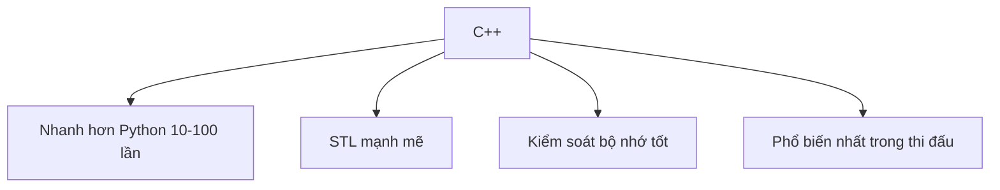

# C01: Tại sao C++?

> **Tác giả:** Hà Trí Kiên<br>
> **Chủ đề:** Lợi ích của C++, so sánh với Python, cài đặt

---

## 1. Tổng quan

C++ là ngôn ngữ **phổ biến nhất** trong competitive programming. Tại sao?



---

## 2. So sánh Python và C++

| | Python | C++ |
|---|--------|-----|
| **Tốc độ** | Chậm (~10^6 phép tính/giây) | Nhanh (~10^8 phép tính/giây) |
| **Cú pháp** | Đơn giản, dễ đọc | Phức tạp hơn |
| **Kiểu dữ liệu** | Tự động, linh hoạt | Phải khai báo, nghiêm ngặt |
| **Compile** | Chạy trực tiếp | Phải compile trước |
| **Bộ nhớ** | Tự quản lý | Chủ động hơn |
| **Thư viện** | Nhiều built-in | STL rất mạnh |
| **Đệ quy** | Giới hạn ~1000 lớp | Giới hạn lớn hơn nhiều |

!!! tip "Khi nào dùng Python, khi nào dùng C++?"
    - **Dùng Python khi:** Học thuật toán mới, viết nhanh prototype, bài không yêu cầu tốc độ
    - **Dùng C++ khi:** Thi đấu chính thức, bài yêu cầu tốc độ, cần STL nâng cao

---

## 3. Cài đặt C++

### Cách 1: MinGW (Windows)

1. Tải [MinGW](https://www.mingw-w64.org/)
2. Cài đặt, chọn architecture: x86_64
3. Thêm `C:\mingw64\bin` vào PATH
4. Kiểm tra:

```bash
g++ --version
```

### Cách 2: MSYS2 (Windows)

1. Tải [MSYS2](https://www.msys2.org/)
2. Cài đặt, chạy:

```bash
pacman -S mingw-w64-x86_64-gcc
```

3. Thêm `C:\msys64\mingw64\bin` vào PATH

### Cách 3: GCC (Linux/Mac)

```bash
# Ubuntu/Debian
sudo apt install g++

# Mac
brew install gcc
```

### Cách 4: Online

- **[Godbolt](https://godbolt.org/)** — Compiler online
- **[Replit](https://replit.com/)** — IDE online
- **[OnlineGDB](https://www.onlinegdb.com/)** — Chạy C++ online

---

## 4. IDE / Text Editor

!!! question "Nên chọn IDE nào?"
    Nếu bạn **chưa biết chọn gì**, hãy dùng **Code::Blocks** hoặc **Dev-C++**. Đây là 2 IDE **phổ biến nhất** trong thi đấu lập trình tại Việt Nam, **được phép** dùng trong hầu hết kỳ thi (HSG, VOI, IOI).

### Code::Blocks (Rất khuyến nghị)

1. Tải [Code::Blocks](http://www.codeblocks.org/) — Chọn phiên bản có **MinGW** (ví dụ: `codeblocks-20.03mingw-setup.exe`)
2. Cài đặt, mở Code::Blocks
3. Tạo project mới → Chọn **"Console Application"** → Chọn **"C++"**
4. Đặt tên project → Chọn nơi lưu → Finish
5. Gõ code vào file `main.cpp`, nhấn **F9** để build và chạy

!!! tip "Tại sao Code::Blocks rất khuyến nghị?"
    - **Phổ biến nhất** trong thi đấu lập trình tại Việt Nam
    - **Được phép** dùng trong hầu hết kỳ thi (HSG, VOI, IOI)
    - **Nhẹ**, không tốn tài nguyên máy
    - **Đã có sẵn compiler** MinGW (không cần cài thêm)
    - **Debug** dễ dàng (F8 chạy từng dòng, F4 chạy đến con trỏ)
    - **Hỗ trợ** code completion, syntax highlighting
    - Phù hợp cho **cả người mới** và **thi đấu chuyên nghiệp**

### Dev-C++ (Cũng rất tốt)

1. Tải [Dev-C++](https://sourceforge.net/projects/orwelldevcpp/)
2. Cài đặt, mở Dev-C++
3. Tạo file mới → Chọn **"C++ Source File"**
4. Gõ code, nhấn **F11** để compile và chạy

!!! tip "Dev-C++"
    - **Nhẹ hơn** Code::Blocks
    - **Đơn giản** hơn Code::Blocks
    - **Được dùng** trong nhiều kỳ thi
    - **Đã có sẵn** compiler MinGW
    - Phù hợp cho **người mới bắt đầu**

### So sánh Code::Blocks và Dev-C++

| | Code::Blocks | Dev-C++ |
|---|--------------|---------|
| **Dung lượng** | ~100MB | ~50MB |
| **Giao diện** | Nhiều tính năng | Đơn giản |
| **Debug** | Mạnh mẽ (F8, F4) | Cơ bản |
| **Code completion** | Có | Có |
| **Phổ biến trong thi đấu** | Rất phổ biến | Phổ biến |
| **Được phép trong thi đấu** | ✅ Hầu hết kỳ thi | ✅ Hầu hết kỳ thi |

!!! tip "Lời khuyên cho các em"
    - **Người mới bắt đầu:** Dùng **Dev-C++** (đơn giản, nhẹ)
    - **Muốn debug tốt hơn:** Dùng **Code::Blocks** (debug mạnh mẽ)
    - **Thi đấu chuyên nghiệp:** Dùng **Code::Blocks** (phổ biến nhất)
    - **Không nên dùng VS Code** cho thi đấu (không được phép trong nhiều kỳ thi)

### VS Code (Không khuyến nghị cho thi đấu)

1. Tải [VS Code](https://code.visualstudio.com/)
2. Cài extension "C/C++" của Microsoft
3. Cài extension "Code Runner" (tùy chọn)
4. Tạo file `.cpp`, nhấn **F5** để chạy

!!! warning "VS Code"
    - **Mạnh mẽ** nhưng **phức tạp** cho người mới
    - Cần **cài thêm compiler** (MinGW/MSYS2)
    - **Không được dùng** trong nhiều kỳ thi
    - Phù hợp cho **dự án lớn**, không phải thi đấu

### Online IDE (Nếu không muốn cài đặt)

- **[Godbolt](https://godbolt.org/)** — Compiler online, xem assembly
- **[Replit](https://replit.com/)** — IDE online miễn phí
- **[OnlineGDB](https://www.onlinegdb.com/)** — Chạy C++ online
- **[Ideone](https://ideone.com/)** — Chạy code online

---

## 5. Chương trình đầu tiên: Hello World

```cpp
#include <iostream>
using namespace std;

int main() {
    cout << "Hello World!" << endl;
    return 0;
}
```

### Giải thích

```cpp
#include <iostream>  // Thư viện nhập/xuất
using namespace std; // Dùng std mà không cần ghi std::

int main() {         // Hàm chính
    cout << "Hello World!" << endl;  // In ra màn hình
    return 0;        // Kết thúc chương trình
}
```

### Compile và chạy

```bash
# Compile
g++ -o hello hello.cpp

# Chạy
./hello
```

---

## 6. Template thi đấu C++

```cpp
#include <bits/stdc++.h>
using namespace std;

int main() {
    ios_base::sync_with_stdio(false);
    cin.tie(NULL);
    
    // Code của bạn ở đây
    
    return 0;
}
```

!!! tip "Tại sao cần template?"
    - `#include <bits/stdc++.h>` — Include TẤT CẢ thư viện chuẩn
    - `ios_base::sync_with_stdio(false)` — Tắt đồng bộ I/O → nhanh hơn
    - `cin.tie(NULL)` — Tách cin và cout → nhanh hơn

---

## 7. Compile với tối ưu

```bash
# Compile bình thường
g++ -o solution solution.cpp

# Compile với tối ưu (thi đấu)
g++ -O2 -o solution solution.cpp

# Compile với tất cả cảnh báo
g++ -Wall -Wextra -o solution solution.cpp

# Compile với C++17
g++ -std=c++17 -o solution solution.cpp
```

!!! tip "Trong thi đấu"
    - Luôn compile với `-O2` để tối ưu tốc độ
    - Dùng C++17 hoặc C++20 nếu được phép

---

## 8. So sánh code Python vs C++

### Hello World

=== "Python"

    ```python
    print("Hello World!")
    ```

=== "C++"

    ```cpp
    #include <iostream>
    using namespace std;
    
    int main() {
        cout << "Hello World!" << endl;
        return 0;
    }
    ```

### Đọc 2 số và in tổng

=== "Python"

    ```python
    a, b = map(int, input().split())
    print(a + b)
    ```

=== "C++"

    ```cpp
    #include <bits/stdc++.h>
    using namespace std;
    
    int main() {
        ios_base::sync_with_stdio(false);
        cin.tie(NULL);
        
        int a, b;
        cin >> a >> b;
        cout << a + b << endl;
        
        return 0;
    }
    ```

### Vòng lặp

=== "Python"

    ```python
    for i in range(10):
        print(i)
    ```

=== "C++"

    ```cpp
    for (int i = 0; i < 10; i++) {
        cout << i << endl;
    }
    ```

---

## 9. Lưu ý / Cạm bẫy hay gặp

### Bẫy 1: Quên include

```cpp
// SAI: Quên include
// cout << "Hello";  // Lỗi compile!

// ĐÚNG
#include <iostream>
using namespace std;
cout << "Hello";
```

### Bẫy 2: Quên using namespace std

```cpp
// SAI: Không có using namespace std
// cout << "Hello";  // Lỗi compile!

// ĐÚNG
using namespace std;
cout << "Hello";

// Hoặc dùng std::
std::cout << "Hello";
```

### Bẫy 3: Quên return 0

```cpp
// C++ cũ: phải có return 0
int main() {
    // ...
    return 0;
}

// C++11+: có thể bỏ return 0
int main() {
    // ...
}
```

### Bẫy 4: Chấm phẩy

```cpp
// SAI: Quên chấm phẩy
// int x = 5  // Lỗi compile!

// ĐÚNG
int x = 5;
```

---

## 10. Bài tập thực hành

### Bài 1: Hello World
Viết chương trình in "Hello World!".

```cpp
// Code của bạn ở đây
```

??? tip "Lời giải"
    ```cpp
    #include <bits/stdc++.h>
    using namespace std;
    
    int main() {
        cout << "Hello World!" << endl;
        return 0;
    }
    ```

### Bài 2: Tổng 2 số
Đọc 2 số nguyên a, b. In ra a + b.

```cpp
// Code của bạn ở đây
```

??? tip "Lời giải"
    ```cpp
    #include <bits/stdc++.h>
    using namespace std;
    
    int main() {
        ios_base::sync_with_stdio(false);
        cin.tie(NULL);
        
        int a, b;
        cin >> a >> b;
        cout << a + b << endl;
        
        return 0;
    }
    ```

### Bài 3: In tên
Đọc tên. In ra "Hello {tên}!".

```cpp
// Code của bạn ở đây
```

??? tip "Lời giải"
    ```cpp
    #include <bits/stdc++.h>
    using namespace std;
    
    int main() {
        string name;
        cin >> name;
        cout << "Hello " << name << "!" << endl;
        
        return 0;
    }
    ```

---

## 11. Bài tập luyện tập

| Bài | Nền tảng | Độ khó | Chủ đề |
|-----|----------|--------|--------|
| [AtCoder - A + B](https://atcoder.jp/contests/abc086/tasks/abc086_a) | AtCoder | ⭐ | Nhập/xuất cơ bản |
| [CSES - Weird Algorithm](https://cses.fi/problemset/task/1068) | CSES | ⭐ | Chương trình đầu tiên |

---

## Bài viết liên quan

- [Chương 2: C++ cho Thi Đấu](index.md)
- [C02: Cú pháp cơ bản →](C02-cu-phap-co-ban.md)

---

**Bài tiếp theo:** [C02: Cú pháp cơ bản →](C02-cu-phap-co-ban.md)
