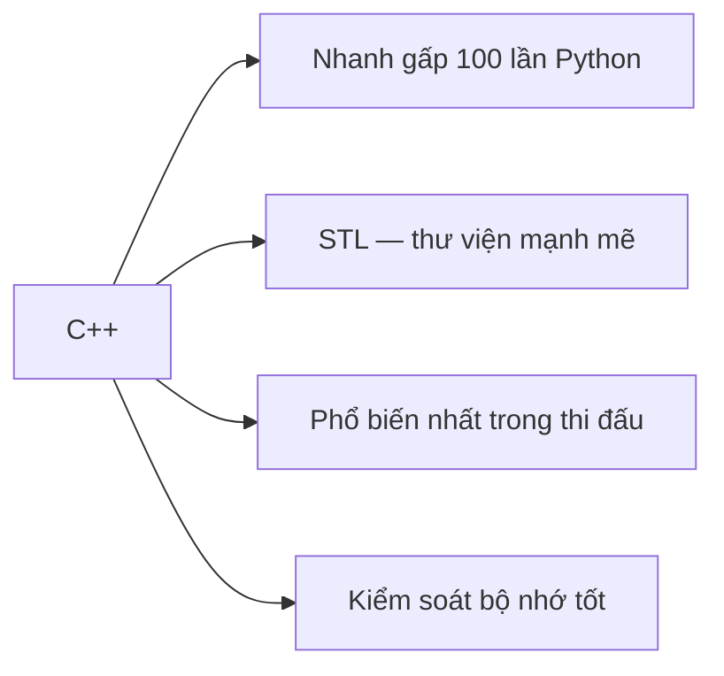

# C01: Tại sao C++? — Cài đặt & Hello World

> **Tác giả:** FPTOJ Wiki<br>
> **Chủ đề:** Giới thiệu C++, so sánh với Python, cài đặt, IDE, chương trình đầu tiên

---

## Bạn sẽ học được gì?

Sau bài này, bạn có thể:

- Hiểu tại sao C++ phổ biến trong thi đấu
- Cài đặt trình biên dịch C++ trên máy tính
- Viết và chạy chương trình C++ đầu tiên
- Chọn IDE phù hợp cho thi đấu

---

## 1. Tại sao chọn C++?



| Tiêu chí | Python | C++ |
|----------|--------|-----|
| **Tốc độ** | Chậm (~10^6 phép tính/giây) | **Nhanh** (~10^8 phép tính/giây) |
| **Cú pháp** | Đơn giản, dễ đọc | Phức tạp hơn |
| **Compile** | Chạy trực tiếp | Phải compile trước |
| **Thư viện** | Nhiều built-in | **STL rất mạnh** |
| **Đệ quy** | Giới hạn ~1000 lớp | Giới hạn lớn hơn nhiều |

!!! tip "Khi nào dùng Python, khi nào dùng C++?"
    - **Dùng Python khi:** Học thuật toán mới, viết nhanh prototype, bài không yêu cầu tốc độ
    - **Dùng C++ khi:** Thi đấu chính thức, bài yêu cầu tốc độ, cần STL nâng cao

---

## 2. Cài đặt C++

### Cách 1: MinGW (Windows) — Khuyến nghị

!!! info "MinGW là gì?"
    MinGW là bộ công cụ biên dịch C/C++ trên Windows. Đây là cách **phổ biến nhất** để cài GCC trên Windows.

#### Bước 1: Tải MinGW

Tải bản build chính thức từ GitHub:

**[niXman/mingw-builds-binaries/releases](https://github.com/niXman/mingw-builds-binaries/releases)**

!!! warning "Chọn đúng bản tải về"
    Nếu bạn dùng **Windows 64-bit** (hầu hết máy hiện đại), hãy tải:

    | Phiên bản | Mô tả | Link tải |
    |-----------|-------|----------|
    | **`x86_64-16.1.0-release-seh-ucrt-rt_v14-rev0.7z`** | **Khuyến nghị** — 64-bit, SEH, UCRT | [Tải về](https://github.com/niXman/mingw-builds-binaries/releases/download/16.1.0-rt_v14-rev0/x86_64-16.1.0-release-seh-ucrt-rt_v14-rev0.7z) |

    - **x86_64** = 64-bit (phù hợp hầu hết máy)
    - **seh** = cơ chế exception handling tốt nhất cho 64-bit
    - **ucrt** = Universal C Runtime (hiện đại, đi kèm Windows 10+)
    - **Dung lượng:** ~102 MB

#### Bước 2: Giải nén

1. Tải file `.7z` về (dùng [7-Zip](https://www.7-zip.org/) để giải nén)
2. Giải nén vào ổ `C:\` → được thư mục `C:\mingw64\`

!!! tip "Nên giải nén vào đâu?"
    - **Tốt nhất:** `C:\mingw64\` (đường dẫn ngắn, không có dấu cách)
    - **Tránh:** `C:\Program Files\` (có dấu cách sẽ gây lỗi)

#### Bước 3: Thêm vào PATH

1. Mở **Start** → tìm **"Edit the system environment variables"**
2. Nhấn **"Environment Variables"**
3. Trong phần **System variables**, tìm biến `Path` → nhấn **Edit**
4. Nhấn **New** → thêm: `C:\mingw64\bin`
5. Nhấn **OK** ở tất cả cửa sổ

#### Bước 4: Kiểm tra

Mở **Command Prompt** (hoặc PowerShell), gõ:

```bash
g++ --version
```

Nếu thấy thông tin phiên bản GCC là đã thành công:

```
g++ (x86_64-posix-seh-rev0, Built by MinGW-Builds project) 16.1.0
```

### Cách 2: GCC (Linux/Mac)

```bash
# Ubuntu/Debian
sudo apt install g++

# Mac
brew install gcc
```

### Cách 3: Online (Không cần cài đặt)

- **[Godbolt](https://godbolt.org/)** — Compiler online, xem assembly
- **[Replit](https://replit.com/)** — IDE online miễn phí
- **[OnlineGDB](https://www.onlinegdb.com/)** — Chạy C++ online

---

## 3. IDE / Text Editor

!!! question "Nên chọn IDE nào?"
    Nếu bạn **chưa biết chọn gì**, hãy dùng **Code::Blocks** hoặc **Dev-C++**. Đây là 2 IDE **phổ biến nhất** trong thi đấu lập trình tại Việt Nam.

### Code::Blocks (Rất khuyến nghị)

1. Tải [Code::Blocks](http://www.codeblocks.org/) — Chọn phiên bản có **MinGW** (ví dụ: `codeblocks-20.03mingw-setup.exe`)
2. Cài đặt, mở Code::Blocks
3. Tạo project mới → Chọn **"Console Application"** → Chọn **"C++"**
4. Đặt tên project → Chọn nơi lưu → Finish
5. Gõ code vào file `main.cpp`, nhấn **F9** để build và chạy

!!! tip "Tại sao Code::Blocks rất khuyến nghị?"
    - **Phổ biến nhất** trong thi đấu lập trình tại Việt Nam
    - **Được phép** dùng trong hầu hết kỳ thi (HSG, VOI, IOI)
    - **Nhẹ**, không tốn tài nguyên máy
    - **Đã có sẵn compiler** MinGW (không cần cài thêm)
    - **Debug** dễ dàng (F8 chạy từng dòng, F4 chạy đến con trỏ)

### Dev-C++ (Cũng rất tốt)

1. Tải [Dev-C++](https://sourceforge.net/projects/orwelldevcpp/)
2. Cài đặt, mở Dev-C++
3. Tạo file mới → Chọn **"C++ Source File"**
4. Gõ code, nhấn **F11** để compile và chạy

---

## 4. Chương trình đầu tiên: Hello World

```cpp
#include <iostream>
using namespace std;

int main() {
    cout << "Hello World!" << endl;
    return 0;
}
```

### Giải thích từng dòng

```cpp
#include <iostream>    // 1. Thêm thư viện nhập/xuất (input/output)
using namespace std;   // 2. Dùng std mà không cần ghi std:: trước mỗi lệnh

int main() {           // 3. Hàm chính — chương trình bắt đầu từ đây
    cout << "Hello World!" << endl;  // 4. In ra màn hình
    return 0;          // 5. Kết thúc chương trình, trả về 0 (thành công)
}
```

| Lệnh | Ý nghĩa |
|------|----------|
| `#include <iostream>` | Thêm thư viện nhập/xuất |
| `using namespace std;` | Để không phải viết `std::cout` mà chỉ cần `cout` |
| `int main()` | Hàm chính, mọi chương trình C++ đều bắt đầu từ đây |
| `cout << "..."` | In ra màn hình |
| `endl` | Xuống dòng |
| `return 0;` | Kết thúc chương trình |

### Compile và chạy

```bash
# Bước 1: Compile — chuyển code thành file thực thi
g++ -o hello hello.cpp

# Bước 2: Chạy file thực thi
./hello
```

Output:
```
Hello World!
```

!!! tip "So sánh với Python"
    | Python | C++ |
    |--------|-----|
    | `print("Hello World!")` | `cout << "Hello World!" << endl;` |
    | Chạy trực tiếp | Phải compile trước |
    | Ngắn gọn | Dài hơn nhưng nhanh hơn |

---

## 5. Template thi đấu C++

Khi thi đấu, hãy dùng template này để code chạy nhanh nhất:

```cpp
#include <bits/stdc++.h>
using namespace std;

int main() {
    ios_base::sync_with_stdio(false);
    cin.tie(NULL);
    
    // Code của bạn ở đây
    
    return 0;
}
```

### Giải thích template

| Lệnh | Ý nghĩa |
|------|----------|
| `#include <bits/stdc++.h>` | Include **tất cả** thư viện chuẩn (tiện hơn include từng cái) |
| `ios_base::sync_with_stdio(false)` | **Tắt** đồng bộ C và C++ I/O → **nhanh hơn** |
| `cin.tie(NULL)` | **Tách** cin và cout → **nhanh hơn** |

!!! warning "Khi dùng template này"
    - **Không** dùng `scanf`/`printf` (C-style I/O) cùng với `cin`/`cout`
    - **Không** dùng `puts`/`gets` cùng với `cout`/`cin`

---

## 6. Compile với tối ưu

```bash
# Compile bình thường (dùng khi debug)
g++ -o solution solution.cpp

# Compile với tối ưu tốc độ (dùng khi thi đấu)
g++ -O2 -o solution solution.cpp

# Compile với tất cả cảnh báo (dùng khi debug)
g++ -Wall -Wextra -o solution solution.cpp

# Compile với C++17
g++ -std=c++17 -o solution solution.cpp

# Kết hợp: tối ưu + C++17
g++ -O2 -std=c++17 -o solution solution.cpp
```

!!! tip "Trong thi đấu"
    - Luôn compile với `-O2` để tối ưu tốc độ
    - Dùng C++17 hoặc C++20 nếu được phép
    - Code trên Code::Blocks/Dev-C++ đã tự động tối ưu

---

## 7. So sánh code Python vs C++

### Hello World

=== "Python"

    ```python
    print("Hello World!")
    ```

=== "C++"

    ```cpp
    #include <bits/stdc++.h>
    using namespace std;
    
    int main() {
        cout << "Hello World!" << endl;
        return 0;
    }
    ```

### Đọc 2 số và in tổng

=== "Python"

    ```python
    a, b = map(int, input().split())
    print(a + b)
    ```

=== "C++"

    ```cpp
    #include <bits/stdc++.h>
    using namespace std;
    
    int main() {
        ios_base::sync_with_stdio(false);
        cin.tie(NULL);
        
        int a, b;
        cin >> a >> b;
        cout << a + b << endl;
        
        return 0;
    }
    ```

---

## 8. Lưu ý / Cạm bẫy hay gặp

### Bẫy 1: Quên include

```cpp
// SAI: Quên include
cout << "Hello";  // Lỗi compile!

// ĐÚNG
#include <iostream>
using namespace std;
cout << "Hello";
```

### Bẫy 2: Quên using namespace std

```cpp
// SAI: Không có using namespace std
cout << "Hello";  // Lỗi compile!

// ĐÚNG: Thêm using namespace std
using namespace std;
cout << "Hello";

// HOẶC: Dùng std::
std::cout << "Hello";
```

### Bẫy 3: Quên chấm phẩy

```cpp
// SAI: Quên chấm phẩy
int x = 5  // Lỗi compile!

// ĐÚNG
int x = 5;
```

### Bẫy 4: Dùng = thay vì ==

```cpp
// SAI: Dùng = (gán) thay vì == (so sánh)
if (x = 5) { ... }  // Luôn đúng!

// ĐÚNG
if (x == 5) { ... }
```

---

## 9. Bài tập thực hành

### Bài 1: Hello World
Viết chương trình in "Hello World!".

```cpp
// Code của bạn ở đây
```

??? tip "Lời giải"
    ```cpp
    #include <bits/stdc++.h>
    using namespace std;
    
    int main() {
        cout << "Hello World!" << endl;
        return 0;
    }
    ```

### Bài 2: In tên
Đọc tên. In ra "Hello {tên}!".

```cpp
// Code của bạn ở đây
```

??? tip "Lời giải"
    ```cpp
    #include <bits/stdc++.h>
    using namespace std;
    
    int main() {
        string name;
        cin >> name;
        cout << "Hello " << name << "!" << endl;
        return 0;
    }
    ```

---

## Bài viết liên quan

- [Chương 2: C++ cho Thi Đấu](index.md)
- [C02: Cú pháp cơ bản →](C02-cu-phap-co-ban.md)

---

**Bài tiếp theo:** [C02: Cú pháp cơ bản →](C02-cu-phap-co-ban.md)
