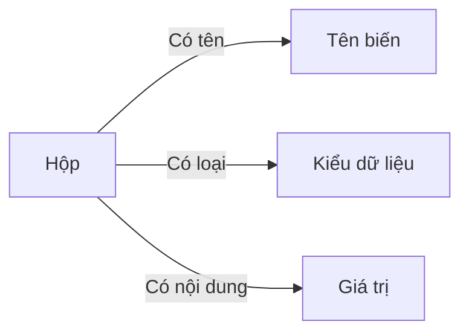

# C02: Biến, Kiểu dữ liệu & Nhập/Xuất

> **Bạn sẽ học được:** Khai báo biến, các kiểu dữ liệu cơ bản, nhập/xuất dữ liệu<br>
> **Yêu cầu:** Đã học C01 (Hello World)<br>
> **Thời gian:** 45 phút

---

## Biến trong C++ — Hộp chứa dữ liệu

### Analogies: Biến = Hộp

Hãy tưởng tượng **biến** là một **hộp đựng đồ**:



| Hộp đựng đồ | Biến trong C++ |
|--------------|----------------|
| Tên hộp | Tên biến (ví dụ: `age`) |
| Loại hộp (nhựa, giấy, sắt) | Kiểu dữ liệu (ví dụ: `int`) |
| Nội dung trong hộp | Giá trị (ví dụ: `15`) |

### Khai báo biến

```cpp
int age = 15;           // Hộp "age" chứa số 15
double pi = 3.14;       // Hộp "pi" chứa số 3.14
char grade = 'A';       // Hộp "grade" chứa ký tự 'A'
string name = "Nam";    // Hộp "name" chứa chuỗi "Nam"
bool isStudent = true;  // Hộp "isStudent" chứa true
```

!!! warning "C++ yêu cầu khai báo kiểu"
    Không như Python, C++ **bắt buộc** khai báo kiểu dữ liệu:
    ```cpp
    // Python: x = 10  (tự động hiểu là int)
    // C++:    int x = 10;  (phải khai báo rõ)
    ```

### Quy tắc đặt tên biến

```cpp
// ✅ ĐÚNG
int myAge = 15;
int student_count = 30;
int MAX_SIZE = 1000;

// ❌ SAI
int 2name = 5;      // Không được bắt đầu bằng số
int my name = 5;    // Không được có dấu cách
int my-name = 5;    // Không được có dấu gạch ngang
```

| Quy tắc | Ví dụ đúng | Ví dụ sai |
|---------|-----------|-----------|
| Bắt đầu bằng chữ hoặc `_` | `_count`, `name` | `2name` |
| Chỉ chứa chữ, số, `_` | `my_var_2` | `my-var` |
| Phân biệt hoa thường | `Name` ≠ `name` | — |
| Không dùng từ khóa C++ | `myInt` | `int` |

!!! tip "Mẹo đặt tên"
    - Dùng **camelCase**: `myAge`, `studentCount`
    - Dùng **snake_case**: `my_age`, `student_count`
    - Hằng số viết HOA: `MAX_SIZE`, `MOD`

---

## Kiểu dữ liệu cơ bản

### Bảng tổng hợp

| Kiểu | Kích thước | Phạm vi | Dùng để | So sánh Python |
|------|-----------|---------|---------|----------------|
| `int` | 4 byte | -2×10⁹ đến 2×10⁹ | Số nguyên nhỏ | `int` |
| `long long` | 8 byte | -9×10¹⁸ đến 9×10¹⁸ | Số nguyên lớn | `int` (Python tự động) |
| `float` | 4 byte | ~7 chữ số thập phân | Số thực (ít dùng) | `float` |
| `double` | 8 byte | ~15 chữ số thập phân | Số thực (phổ biến) | `float` |
| `char` | 1 byte | 256 ký tự | Ký tự đơn | Không có |
| `bool` | 1 byte | `true` / `false` | Đúng/Sai | `bool` |
| `string` | Không cố định | Chuỗi ký tự | Văn bản | `str` |

### int vs long long — Quan trọng!

```cpp
int a = 2000000000;           // ✅ OK
int b = 2000000000 + 2000000000;  // ❌ SAI! Undefined behavior (tràn số signed)

long long c = 2000000000LL + 2000000000LL;  // ✅ ĐÚNG!
```

!!! danger "Tràn số — Lỗi phổ biến nhất!"
    Trong thi đấu, **luôn dùng `long long`** khi tính tổng, tích các số lớn:
    ```cpp
    // ❌ SAI: Có thể tràn
    int sum = 0;
    for (int i = 0; i < n; i++) sum += a[i];  // sum có thể > 2×10⁹
    ```

### Kiểu số thực

```cpp
double pi = 3.14159265358979;
cout << fixed << setprecision(2) << pi << endl;  // 3.14
cout << fixed << setprecision(9) << pi << endl;  // 3.141592654
```

!!! tip "Luôn dùng double, không dùng float"
    `double` chính xác hơn `float` và thường được dùng trong thi đấu.

### Kiểu ký tự

```cpp
char c = 'A';           // Ký tự đơn, dùng nháy đơn
cout << c << endl;      // In ra: A
cout << (int)c << endl; // In ra: 65 (mã ASCII)
```

!!! warning "char vs string"
    - `char` = **1 ký tự**, dùng nháy đơn: `'A'`
    - `string` = **chuỗi ký tự**, dùng nháy kép: `"Hello"`

---

## Hằng số (Constants)

```cpp
const int MAXN = 1e6 + 5;      // Hằng số nguyên
const long long INF = 1e18;    // Vô cực
const long long MOD = 1e9 + 7; // modulo thường dùng
const double PI = acos(-1.0);  // Số Pi chính xác
```

!!! tip "Dùng `const` để bảo vệ giá trị"
    ```cpp
    const int N = 100;
    N = 200;  // Lỗi compile! Không thể thay đổi hằng số
    ```

---

## Nhập/xuất với cin/cout

### cout — In ra màn hình

```cpp
int age = 15;
string name = "Nam";
double score = 9.5;

// In từng giá trị
cout << "Ten: " << name << endl;
cout << "Tuoi: " << age << endl;
cout << "Diem: " << score << endl;

// In nhiều giá trị trên 1 dòng
cout << name << " " << age << " " << score << endl;
```

### Định dạng số thực

```cpp
double pi = 3.14159265358979;

cout << fixed << setprecision(2) << pi << endl;  // 3.14
cout << fixed << setprecision(4) << pi << endl;  // 3.1416
cout << fixed << setprecision(9) << pi << endl;  // 3.141592654
```

### cin — Đọc từ bàn phím

```cpp
int age;
string name;

cin >> name >> age;  // Đọc tên, rồi đọc tuổi
cout << "Hello " << name << ", ban " << age << " tuoi" << endl;
```

!!! tip "Hiểu `>>` và `<<`"
    - `cin >> x` = dữ liệu **chảy từ** bàn phím **vào** biến x
    - `cout << x` = dữ liệu **chảy từ** biến x **ra** màn hình
    - `>>` và `<<` là **mũi tên chỉ hướng** dữ liệu

### Template thi đấu (Luôn dùng)

```cpp
#include <bits/stdc++.h>
using namespace std;

int main() {
    ios_base::sync_with_stdio(false);
    cin.tie(NULL);
    
    int a, b;
    cin >> a >> b;
    cout << a + b << endl;
    
    return 0;
}
```

---

## scanf/printf — Nhập/xuất nhanh (C-style)

### printf — In ra màn hình

```cpp
int age = 15;
double pi = 3.14159;
string name = "Nam";

printf("Tuoi: %d\n", age);           // %d = int
printf("Diem: %.2f\n", pi);          // %.2f = double, 2 chữ số thập phân
printf("Ten: %s\n", name.c_str());   // %s = string (cần .c_str())
printf("Ky tu: %c\n", 'A');          // %c = char
printf("So lon: %lld\n", 1234567890123LL);  // %lld = long long
```

| Format | Ý nghĩa | Ví dụ |
|--------|----------|-------|
| `%d` | Số nguyên `int` | `printf("%d", 42)` |
| `%lld` | Số nguyên `long long` | `printf("%lld", 1234567890123LL)` |
| `%f` | Số thực `double` | `printf("%.2f", 3.14)` |
| `%c` | Ký tự `char` | `printf("%c", 'A')` |
| `%s` | Chuỗi `string` | `printf("%s", "Hello")` |

### scanf — Đọc từ bàn phím

```cpp
int age;
double pi;
char name[100];

scanf("%d", &age);          // Đọc int
scanf("%lf", &pi);          // Đọc double
scanf("%s", name);          // Đọc chuỗi (không có dấu cách)
scanf("%d %d", &a, &b);    // Đọc 2 số nguyên
```

!!! warning "Lưu ý khi dùng scanf/printf"
    - **Không** dùng chung `scanf`/`printf` với `cin`/`cout` khi đã tắt sync
    - `scanf` cần dùng `&` trước biến (trừ mảng char)
    - `printf` với `string` cần dùng `.c_str()`

---

## Toán tử cơ bản

### Toán tử số học

```cpp
int a = 10, b = 3;

cout << a + b << endl;   // 13  — Cộng
cout << a - b << endl;   // 7   — Trừ
cout << a * b << endl;   // 30  — Nhân
cout << a / b << endl;   // 3   — Chia lấy phần nguyên (10/3 = 3)
cout << a % b << endl;   // 1   — Chia lấy dư (10 mod 3 = 1)
```

!!! warning "Chia nguyên trong C++"
    ```cpp
    int a = 10, b = 3;
    cout << a / b << endl;       // 3 (không phải 3.333)
    
    double x = 10.0, y = 3.0;
    cout << x / y << endl;       // 3.33333 (chia thực)
    ```

### Toán tử so sánh

```cpp
int a = 10, b = 20;

cout << (a == b) << endl;  // 0 (false) — Bằng
cout << (a != b) << endl;  // 1 (true)  — Khác
cout << (a < b) << endl;   // 1 (true)  — Nhỏ hơn
cout << (a > b) << endl;   // 0 (false) — Lớn hơn
cout << (a <= b) << endl;  // 1 (true)  — Nhỏ hơn hoặc bằng
cout << (a >= b) << endl;  // 0 (false) — Lớn hơn hoặc bằng
```

### Toán tử logic

```cpp
bool x = true, y = false;

cout << (x && y) << endl;  // 0 (false) — AND (cả hai đều đúng)
cout << (x || y) << endl;  // 1 (true)  — OR (ít nhất một đúng)
cout << (!x) << endl;      // 0 (false) — NOT (đảo ngược)
```

### Toán tử tăng/giảm

```cpp
int a = 5;

a++;    // a = 6 (tăng 1)
a--;    // a = 5 (giảm 1)
a += 3; // a = 8 (tăng 3)
a -= 2; // a = 6 (giảm 2)
a *= 4; // a = 24 (nhân 4)
a /= 3; // a = 8 (chia 3)
a %= 5; // a = 3 (lấy dư 5)
```

### Toán tử 3 ngôi (Ternary)

```cpp
int x = 10;
string result = (x > 0) ở "Duong" : "Am";
// Nếu x > 0 thì result = "Duong", ngược lại result = "Am"
```

---

## Toán tử bitwise (Trên bit)

```cpp
int a = 5;   // 101 trong nhị phân
int b = 3;   // 011 trong nhị phân

cout << (a & b) << endl;   // 1   — AND:  101 & 011 = 001
cout << (a | b) << endl;   // 7   — OR:   101 | 011 = 111
cout << (a ^ b) << endl;   // 6   — XOR:  101 ^ 011 = 110
cout << (~a) << endl;      // -6  — NOT:  ~101 = ...11111010
cout << (a << 1) << endl;  // 10  — Dịch trái:  101 << 1 = 1010
cout << (a >> 1) << endl;  // 2   — Dịch phải:  101 >> 1 = 10
```

| Toán tử | Ý nghĩa | Ví dụ |
|---------|----------|-------|
| `&` | AND trên bit | `5 & 3 = 1` |
| `\|` | OR trên bit | `5 \| 3 = 7` |
| `^` | XOR trên bit | `5 ^ 3 = 6` |
| `~` | NOT trên bit | `~5 = -6` |
| `<<` | Dịch trái | `5 << 1 = 10` |
| `>>` | Dịch phải | `5 >> 1 = 2` |

---

## Ép kiểu (Type Casting)

```cpp
int a = 7, b = 2;

// Chia nguyên
cout << a / b << endl;           // 3

// Ép kiểu sang double
cout << (double)a / b << endl;   // 3.5

// Ép kiểu tự động
double c = a;  // int → double: c = 7.0
int d = 3.7;   // double → int: d = 3 (bỏ phần thập phân)
```

---

## Struct — Gom nhóm dữ liệu

### Khai báo struct

```cpp
struct Point {
    int x, y;
};

// Tạo biến
Point p = {3, 5};
cout << p.x << " " << p.y << endl;  // 3 5

// Gán giá trị
p.x = 10;
p.y = 20;
```

### Struct trong thi đấu

```cpp
// Cạnh đồ thị
struct Edge {
    int u, v, w;
};

vector<Edge> edges;
edges.push_back({1, 2, 5});  // Cạnh từ 1 đến 2, trọng số 5

// Sinh viên
struct Student {
    string name;
    int score;
};

vector<Student> students = {{"Nam", 9}, {"An", 7}, {"Binh", 9}};

// Sắp xếp theo điểm giảm dần
sort(students.begin(), students.end(), [](const Student &a, const Student &b) {
    return a.score > b.score;
});
```

### Struct vs pair

| | pair | struct |
|---|------|--------|
| **Số trường** | 2 | Nhiều |
| **Truy cập** | `.first`, `.second` | Tên rõ ràng |
| **Đọc hiểu** | Khó | **Dễ** |
| **Khi nào dùng** | Nhanh, đơn giản | Cần rõ ràng |

!!! tip "Khi nào dùng struct?"
    - Có **nhiều hơn 2 trường** liên quan → dùng struct
    - Cần **đọc hiểu dễ** → dùng struct
    - Chỉ cần 2 giá trị nhanh → dùng `pair`

---

## So sánh số thực — Epsilon

### Vấn đề: So sánh double không chính xác

```cpp
double a = 0.1 + 0.2;
double b = 0.3;

// ❌ SAI: So sánh trực tiếp
if (a == b) cout << "Bang";  // Có thể không chạy!

// Vì: 0.1 + 0.2 = 0.30000000000000004 (không phải 0.3)
```

### ✅ Đúng: Dùng epsilon

```cpp
const double EPS = 1e-9;

bool isEqual(double a, double b) {
    return abs(a - b) < EPS;
}

bool isLess(double a, double b) {
    return a - b < -EPS;
}

bool isGreater(double a, double b) {
    return a - b > EPS;
}

// Sử dụng
double a = 0.1 + 0.2;
double b = 0.3;
if (isEqual(a, b)) cout << "Bang";  // ✅ Đúng!
```

!!! warning "Luôn dùng epsilon khi so sánh số thực"
    ```cpp
    // ❌ SAI
    if (a == b) { ... }
    if (a < b) { ... }
    
    // ✅ ĐÚNG
    if (abs(a - b) < EPS) { ... }  // a == b
    if (a - b < -EPS) { ... }      // a < b
    ```

---

## Common Mistakes — Lỗi thường gặp

### Lỗi 1: Tràn số

```cpp
// ❌ SAI: int không đủ lớn
int sum = 0;
for (int i = 0; i < 1000000; i++) sum += 1000;  // sum = 10^9, OK

int sum2 = 0;
for (int i = 0; i < 1000000; i++) sum2 += 1000000;  // sum2 = 10^12, TRÀN!

// ✅ ĐÚNG: Dùng long long
long long sum3 = 0;
for (int i = 0; i < 1000000; i++) sum3 += 1000000;  // OK
```

### Lỗi 2: Chia nguyên không mong muốn

```cpp
// ❌ SAI: Chia nguyên
int a = 5, b = 2;
cout << a / b << endl;  // 2 (không phải 2.5)

// ✅ ĐÚNG: Ép kiểu
cout << (double)a / b << endl;  // 2.5
```

### Lỗi 3: Quên `&` khi dùng scanf

```cpp
// ❌ SAI: Quên &
int x;
scanf("%d", x);  // Lỗi runtime!

// ✅ ĐÚNG
int x;
scanf("%d", &x);
```

### Lỗi 4: So sánh double bằng `==`

```cpp
// ❌ SAI
double a = 0.1 + 0.2;
double b = 0.3;
if (a == b) { ... }  // Có thể không chạy!

// ✅ ĐÚNG
if (abs(a - b) < 1e-9) { ... }
```

---

## Bài tập thực hành

### Bài 1: Tính diện tích hình tròn
Đọc bán kính r. Tính diện tích S = π × r². In ra 2 chữ số sau dấu phẩy.

**Input:** `5`<br>
**Output:** `78.54`

<div class="cp-pg" data-language="cpp" data-starter="#include &lt;bits/stdc++.h&gt;\nusing namespace std;\n\nint main() {\n    // Viết code ở đây\n    return 0;\n}" data-input="5" data-expected="78.54" data-hint="Dùng fixed &lt;&lt; setprecision(2) và M_PI"></div>

??? tip "Lời giải"
    ```cpp
    #include <bits/stdc++.h>
    using namespace std;
    
    int main() {
        double r;
        cin >> r;
        cout << fixed << setprecision(2) << M_PI * r * r << endl;
        return 0;
    }
    ```

### Bài 2: Đổi giây
Đọc số giây s. Đổi sang giờ:phút:giây.

**Input:** `3661`<br>
**Output:** `1:1:1`

<div class="cp-pg" data-language="cpp" data-starter="#include &lt;bits/stdc++.h&gt;\nusing namespace std;\n\nint main() {\n    // Viết code ở đây\n    return 0;\n}" data-input="3661" data-expected="1:1:1" data-hint="Chia lấy giờ (3600), phút (60), giây còn lại"></div>

??? tip "Lời giải"
    ```cpp
    #include <bits/stdc++.h>
    using namespace std;
    
    int main() {
        int s;
        cin >> s;
        int h = s / 3600;
        s %= 3600;
        int m = s / 60;
        s %= 60;
        cout << h << ":" << m << ":" << s << endl;
        return 0;
    }
    ```

### Bài 3: Tính BMI
Đọc cân nặng (kg) và chiều cao (m). Tính BMI = cân nặng / (chiều cao × chiều cao). In ra 1 chữ số sau dấu phẩy.

**Input:** `70 1.75`<br>
**Output:** `22.9`

<div class="cp-pg" data-language="cpp" data-starter="#include &lt;bits/stdc++.h&gt;\nusing namespace std;\n\nint main() {\n    // Viết code ở đây\n    return 0;\n}" data-input="70 1.75" data-expected="22.9" data-hint="BMI = weight / (height * height), dùng setprecision(1)"></div>

??? tip "Lời giải"
    ```cpp
    #include <bits/stdc++.h>
    using namespace std;
    
    int main() {
        double weight, height;
        cin >> weight >> height;
        double bmi = weight / (height * height);
        cout << fixed << setprecision(1) << bmi << endl;
        return 0;
    }
    ```

---

## Tóm tắt bài học

| Nội dung | Chi tiết |
|----------|----------|
| **Biến** | Hộp chứa dữ liệu, phải khai báo kiểu |
| **Kiểu dữ liệu** | `int`, `long long`, `double`, `char`, `string`, `bool` |
| **Tràn số** | Dùng `long long` khi tính tổng, tích lớn |
| **Nhập/xuất** | `cin >> x` / `cout << x << endl` |
| **Toán tử** | `+`, `-`, `*`, `/`, `%`, `==`, `!=`, `<`, `>` |
| **So sánh double** | Luôn dùng epsilon: `abs(a - b) < 1e-9` |

---

## Bài viết liên quan

- [C01: Cài đặt & Hello World ←](C01-tai-sao-cpp.md)
- [C03: Điều kiện & Vòng lặp →](C03-dieu-kien-vong-lap.md)

---

**Bài tiếp theo:** [C03: Điều kiện & Vòng lặp →](C03-dieu-kien-vong-lap.md)
