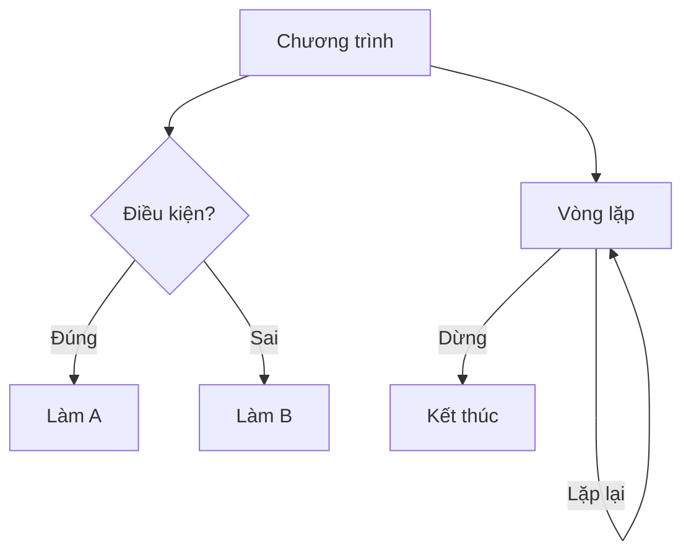

# C03: Điều kiện & Vòng lặp

> **Bạn sẽ học được:** if/else, for, while, switch — kiểm soát luồng chương trình<br>
> **Yêu cầu:** Đã học C02 (Biến, Kiểu dữ liệu)<br>
> **Thời gian:** 60 phút

---

## Tại sao cần điều kiện & vòng lặp?

### Analogies: Điều kiện = Ngã rẽ, Vòng lặp = Vòng xoay



| Khái niệm | Analogies | Ví dụ đời thực |
|-----------|-----------|----------------|
| **Điều kiện** | Ngã rẽ | Nếu trời mưa → mang ô |
| **Vòng lặp** | Vòng xoay | Đếm từ 1 đến 10 |
| **if/else** | Chọn đường | Nếu đúng → rẽ trái, sai → rẽ phải |
| **for** | Đếm số | Lặp 10 lần |
| **while** | Chờ đợi | Lặp cho đến khi đủ điều kiện |

---

## Điều kiện: if / else if / else

### Cú pháp cơ bản

```cpp
if (điều_kiện) {
    // Code chạy khi điều kiện ĐÚNG
} else if (điều_kiện_2) {
    // Code chạy khi điều kiện 2 ĐÚNG
} else {
    // Code chạy khi tất cả điều kiện SAI
}
```

### Ví dụ 1: Kiểm tra số dương/âm

```cpp
int x;
cin >> x;

if (x > 0) {
    cout << "So duong" << endl;
} else if (x < 0) {
    cout << "So am" << endl;
} else {
    cout << "So khong" << endl;
}
```

### Ví dụ 2: Kiểm tra chẵn/lẻ

```cpp
int n;
cin >> n;

if (n % 2 == 0) {
    cout << "Chan" << endl;
} else {
    cout << "Le" << endl;
}
```

!!! tip "Hiểu `==` vs `=`"
    - `==` = **so sánh** (trả về true/false)
    - `=` = **gán giá trị**
    ```cpp
    if (x == 5) { ... }  // ✅ So sánh x với 5
    if (x = 5) { ... }   // ❌ Gán x = 5 (luôn đúng!)
    ```

### Ví dụ 3: Kiểm tra năm nhuận

```cpp
int year;
cin >> year;

if (year % 400 == 0) {
    cout << "Nam nhuan" << endl;
} else if (year % 4 == 0 && year % 100 != 0) {
    cout << "Nam nhuan" << endl;
} else {
    cout << "Khong nhuan" << endl;
}
```

### Toán tử 3 ngôi (Ternary) — Viết ngắn gọn

```cpp
// Thay vì:
string result;
if (x > 0) {
    result = "Duong";
} else {
    result = "Am";
}

// Viết ngắn gọn:
string result = (x > 0) ở "Duong" : "Am";
```

!!! tip "Dùng ternary khi chỉ có 2 trường hợp"
    Ternary giúp code ngắn gọn hơn, nhưng **đừng lạm dụng** khi logic phức tạp.

---

## Vòng lặp: for

### Cú pháp cơ bản

```cpp
for (khởi_tạo; điều_kiện; cập_nhật) {
    // Code lặp lại
}
```

### Ví dụ 1: Đếm từ 1 đến 10

```cpp
for (int i = 1; i <= 10; i++) {
    cout << i << " ";
}
// Output: 1 2 3 4 5 6 7 8 9 10
```

### Ví dụ 2: Tính tổng 1 đến n

```cpp
int n;
cin >> n;

long long sum = 0;
for (int i = 1; i <= n; i++) {
    sum += i;
}
cout << sum << endl;
```

### Ví dụ 3: Đọc n số và tính tổng

```cpp
int n;
cin >> n;

long long sum = 0;
for (int i = 0; i < n; i++) {
    int x;
    cin >> x;
    sum += x;
}
cout << sum << endl;
```

!!! tip "Các biến thể của for"
    ```cpp
    // Đếm từ 0 đến n-1
    for (int i = 0; i < n; i++) { ... }
    
    // Đếm từ n-1 đến 0 (đảo ngược)
    for (int i = n - 1; i >= 0; i--) { ... }
    
    // Đếm từ 1 đến n, bước nhảy 2
    for (int i = 1; i <= n; i += 2) { ... }
    
    // Đếm từ 0 đến n, bước nhảy 3
    for (int i = 0; i <= n; i += 3) { ... }
    ```

### Vòng lặp for với mảng

```cpp
int a[] = {1, 2, 3, 4, 5};
int n = 5;

// Cách 1: Dùng chỉ số
for (int i = 0; i < n; i++) {
    cout << a[i] << " ";
}

// Cách 2: Dùng range-based for (C++11)
for (int x : a) {
    cout << x << " ";
}
```

---

## Vòng lặp: while

### Cú pháp cơ bản

```cpp
while (điều_kiện) {
    // Code lặp lại cho đến khi điều kiện SAI
}
```

### Ví dụ 1: Đếm ngược

```cpp
int n = 10;
while (n > 0) {
    cout << n << " ";
    n--;
}
// Output: 10 9 8 7 6 5 4 3 2 1
```

### Ví dụ 2: Đọc cho đến khi gặp 0

```cpp
int x;
while (cin >> x && x != 0) {
    cout << x << endl;
}
```

### Ví dụ 3: Tính số chữ số

```cpp
int n;
cin >> n;

int count = 0;
while (n > 0) {
    n /= 10;
    count++;
}
cout << count << endl;
```

---

## Vòng lặp: do-while

### Cú pháp cơ bản

```cpp
do {
    // Code lặp lại
} while (điều_kiện);  // Chú ý: có dấu chấm phẩy
```

### Ví dụ: Menu

```cpp
int choice;
do {
    cout << "1. Choi game" << endl;
    cout << "2. Xem diem" << endl;
    cout << "3. Thoat" << endl;
    cout << "Chon: ";
    cin >> choice;
    
    if (choice == 1) cout << "Dang choi..." << endl;
    else if (choice == 2) cout << "Diem: 100" << endl;
} while (choice != 3);
```

!!! tip "while vs do-while"
    - `while`: Kiểm tra điều kiện **trước** khi lặp (có thể không chạy lần nào)
    - `do-while`: Kiểm tra điều kiện **sau** khi lặp (chạy ít nhất 1 lần)

---

## break & continue

### break — Thoát khỏi vòng lặp

```cpp
for (int i = 1; i <= 10; i++) {
    if (i == 5) break;  // Dừng khi i = 5
    cout << i << " ";
}
// Output: 1 2 3 4
```

### continue — Bỏ qua lần lặp hiện tại

```cpp
for (int i = 1; i <= 10; i++) {
    if (i % 2 == 0) continue;  // Bỏ qua số chẵn
    cout << i << " ";
}
// Output: 1 3 5 7 9
```

!!! tip "Khi nào dùng break/continue?"
    - `break`: Khi muốn **thoát sớm** khỏi vòng lặp
    - `continue`: Khi muốn **bỏ qua** một số trường hợp

---

## Vòng lặp lồng nhau

### Ví dụ 1: In bảng cửu chương

```cpp
for (int i = 1; i <= 9; i++) {
    for (int j = 1; j <= 10; j++) {
        cout << i << " x " << j << " = " << i * j << endl;
    }
    cout << endl;
}
```

### Ví dụ 2: Duyệt ma trận

```cpp
int a[3][3] = {{1, 2, 3}, {4, 5, 6}, {7, 8, 9}};

for (int i = 0; i < 3; i++) {
    for (int j = 0; j < 3; j++) {
        cout << a[i][j] << " ";
    }
    cout << endl;
}
```

### Ví dụ 3: Tìm số lớn nhất trong mảng

```cpp
int n;
cin >> n;

vector<int> a(n);
for (int i = 0; i < n; i++) cin >> a[i];

int maxVal = a[0];
for (int i = 1; i < n; i++) {
    if (a[i] > maxVal) maxVal = a[i];
}
cout << maxVal << endl;
```

---

## switch — Chọn theo giá trị

### Cú pháp cơ bản

```cpp
switch (biến) {
    case giá_trị_1:
        // Code khi biến = giá trị 1
        break;
    case giá_trị_2:
        // Code khi biến = giá trị 2
        break;
    default:
        // Code khi không khớp case nào
        break;
}
```

### Ví dụ: Ngày trong tuần

```cpp
int day;
cin >> day;

switch (day) {
    case 1: cout << "Thu hai" << endl; break;
    case 2: cout << "Thu ba" << endl; break;
    case 3: cout << "Thu tu" << endl; break;
    case 4: cout << "Thu nam" << endl; break;
    case 5: cout << "Thu sau" << endl; break;
    case 6: cout << "Thu bay" << endl; break;
    case 7: cout << "Chu nhat" << endl; break;
    default: cout << "Khong hop le" << endl; break;
}
```

!!! warning "Quên break"
    ```cpp
    // ❌ SAI: Quên break
    switch (x) {
        case 1: cout << "Mot";      // Sẽ chạy tiếp case 2!
        case 2: cout << "Hai"; break;
    }
    
    // ✅ ĐÚNG
    switch (x) {
        case 1: cout << "Mot"; break;
        case 2: cout << "Hai"; break;
    }
    ```

---

## Common Mistakes — Lỗi thường gặp

### Lỗi 1: Dùng `=` thay vì `==`

```cpp
// ❌ SAI
if (x = 5) { ... }  // Gán x = 5, luôn đúng!

// ✅ ĐÚNG
if (x == 5) { ... }
```

### Lỗi 2: Quên dấu `{}`

```cpp
// ❌ SAI: Chỉ có 1 dòng trong if
if (x > 0)
    cout << "Duong";
    cout << "So lon";  // Dòng này luôn chạy!

// ✅ ĐÚNG
if (x > 0) {
    cout << "Duong";
    cout << "So lon";
}
```

### Lỗi 3: Vòng lặp vô hạn

```cpp
// ❌ SAI: i không bao giờ thay đổi
int i = 0;
while (i < 10) {
    cout << i << " ";
    // Quên i++ → lặp vô hạn!
}

// ✅ ĐÚNG
int i = 0;
while (i < 10) {
    cout << i << " ";
    i++;
}
```

### Lỗi 4: Tràn số khi tính tổng

```cpp
// ❌ SAI: sum có thể tràn
int sum = 0;
for (int i = 1; i <= 1000000; i++) sum += i;

// ✅ ĐÚNG
long long sum = 0;
for (int i = 1; i <= 1000000; i++) sum += i;
```

---

## Bài tập thực hành

### Bài 1: Kiểm tra số chẵn/lẻ
Đọc số nguyên n. In ra "Chan" nếu n chẵn, "Le" nếu n lẻ.

**Input:** `7`<br>
**Output:** `Le`

<div class="cp-pg" data-language="cpp" data-starter="#include &lt;bits/stdc++.h&gt;\nusing namespace std;\n\nint main() {\n    // Viết code ở đây\n    return 0;\n}" data-input="7" data-expected="Le" data-hint="Dùng n % 2 == 0 để kiểm tra chẵn"></div>

??? tip "Lời giải"
    ```cpp
    #include <bits/stdc++.h>
    using namespace std;
    
    int main() {
        int n;
        cin >> n;
        if (n % 2 == 0) cout << "Chan" << endl;
        else cout << "Le" << endl;
        return 0;
    }
    ```

### Bài 2: Tính tổng 1 đến n
Đọc số nguyên n. Tính tổng 1 + 2 + ... + n.

**Input:** `100`<br>
**Output:** `5050`

<div class="cp-pg" data-language="cpp" data-starter="#include &lt;bits/stdc++.h&gt;\nusing namespace std;\n\nint main() {\n    // Viết code ở đây\n    return 0;\n}" data-input="100" data-expected="5050" data-hint="Dùng vòng lặp for từ 1 đến n, cộng dồn vào sum"></div>

??? tip "Lời giải"
    ```cpp
    #include <bits/stdc++.h>
    using namespace std;
    
    int main() {
        int n;
        cin >> n;
        long long sum = 0;
        for (int i = 1; i <= n; i++) sum += i;
        cout << sum << endl;
        return 0;
    }
    ```

### Bài 3: Đếm số chữ số
Đọc số nguyên n. Đếm số chữ số của n.

**Input:** `12345`<br>
**Output:** `5`

<div class="cp-pg" data-language="cpp" data-starter="#include &lt;bits/stdc++.h&gt;\nusing namespace std;\n\nint main() {\n    // Viết code ở đây\n    return 0;\n}" data-input="12345" data-expected="5" data-hint="Dùng while, mỗi lần chia 10 và tăng count"></div>

??? tip "Lời giải"
    ```cpp
    #include <bits/stdc++.h>
    using namespace std;
    
    int main() {
        int n;
        cin >> n;
        int count = 0;
        while (n > 0) {
            n /= 10;
            count++;
        }
        cout << count << endl;
        return 0;
    }
    ```

### Bài 4: In tam giác sao
Đọc số nguyên n. In tam giác sao có n hàng.

**Input:** `5`<br>
**Output:**
```
*
**
***
****
*****
```

<div class="cp-pg" data-language="cpp" data-starter="#include &lt;bits/stdc++.h&gt;\nusing namespace std;\n\nint main() {\n    // Viết code ở đây\n    return 0;\n}" data-input="5" data-expected="*
**
***
****
*****" data-hint="Vòng lặp ngoài duyệt hàng, vòng lặp trong in sao"></div>

??? tip "Lời giải"
    ```cpp
    #include <bits/stdc++.h>
    using namespace std;
    
    int main() {
        int n;
        cin >> n;
        for (int i = 1; i <= n; i++) {
            for (int j = 1; j <= i; j++) cout << "*";
            cout << endl;
        }
        return 0;
    }
    ```

---

## Tóm tắt bài học

| Nội dung | Chi tiết |
|----------|----------|
| **if/else** | Kiểm tra điều kiện, chọn nhánh |
| **for** | Lặp khi biết trước số lần |
| **while** | Lặp khi không biết trước số lần |
| **do-while** | Lặp ít nhất 1 lần |
| **break** | Thoát khỏi vòng lặp |
| **continue** | Bỏ qua lần lặp hiện tại |
| **switch** | Chọn theo giá trị |

---

## Bài viết liên quan

- [C02: Biến & Kiểu dữ liệu ←](C02-cu-phap-co-ban.md)
- [C04: Mảng & Vector →](C04-mang-vector.md)

---

**Bài tiếp theo:** [C04: Mảng & Vector →](C04-mang-vector.md)
