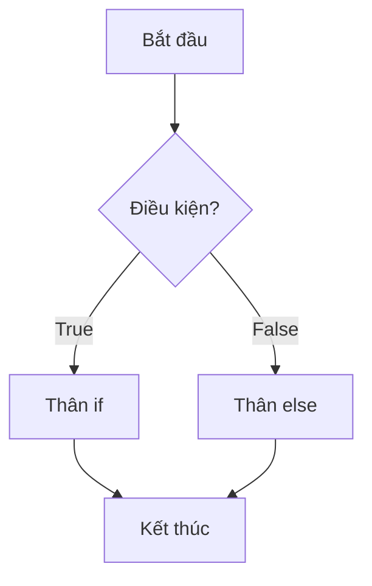
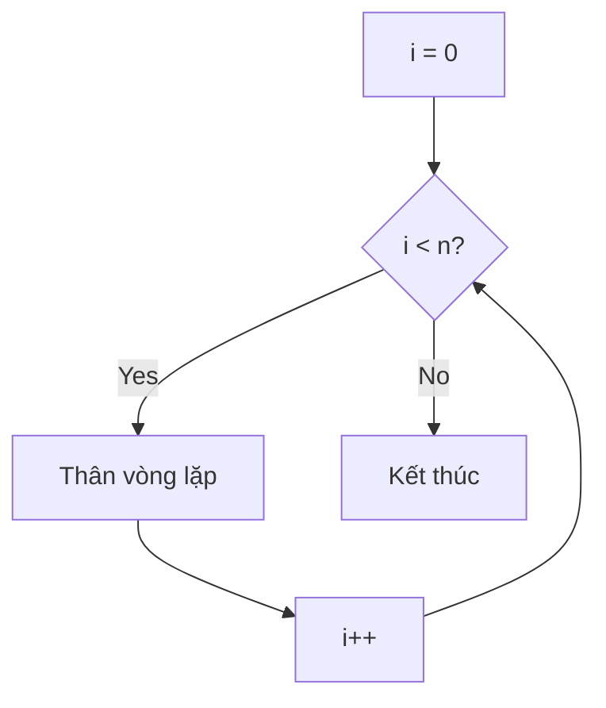
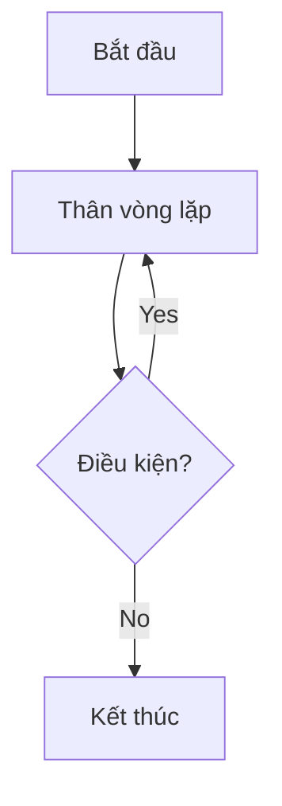
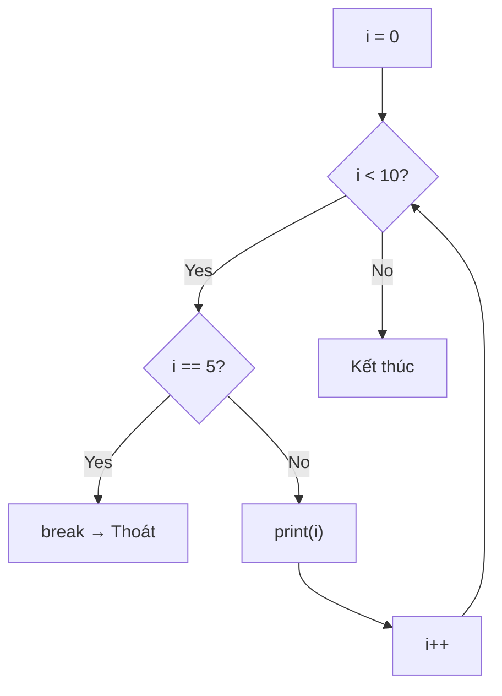
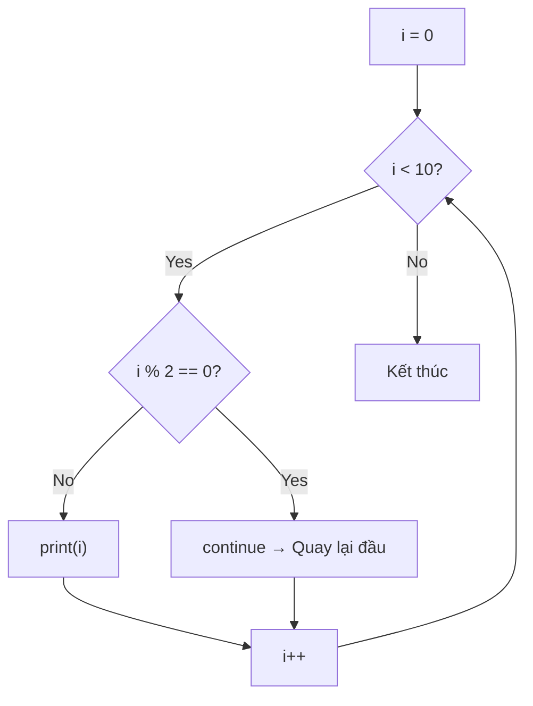

# C03: Điều kiện & Vòng lặp

> **Tác giả:** FPTOJ Wiki<br>
> **Chủ đề:** if/else, for, while, do-while, break, continue

---

## Bạn sẽ học được gì?

Sau bài này, bạn có thể:

- Viết câu lệnh điều kiện `if`/`else if`/`else`
- Dùng vòng lặp `for` với nhiều kiểu khác nhau
- Dùng vòng lặp `while` và `do-while`
- Sử dụng `break` và `continue` thành thạo
- Áp dụng vào bài toán thực tế

---

## 1. Câu lệnh điều kiện

### 1.1. if — else



=== "Python"

    ```python
    n = 10
    if n > 0:
        print("Duong")
    else:
        print("Am")
    ```

=== "C++"

    ```cpp
    int n = 10;
    if (n > 0) {
        cout << "Duong" << endl;
    } else {
        cout << "Am" << endl;
    }
    ```

!!! note "Khác biệt với Python"
    | Python | C++ |
    |--------|-----|
    | `if n > 0:` | `if (n > 0) {` |
    | Thụt lề bằng dấu cách | Dùng `{` `}` |
    | `elif` | `else if` |
    | Không cần `()` | **Phải có `()`** quanh điều kiện |

### 1.2. if — else if — else

=== "Python"

    ```python
    score = 85
    if score >= 90:
        print("Xuat sac")
    elif score >= 80:
        print("Gioi")
    elif score >= 70:
        print("Kha")
    else:
        print("Yeu")
    ```

=== "C++"

    ```cpp
    int score = 85;
    if (score >= 90) {
        cout << "Xuat sac" << endl;
    } else if (score >= 80) {
        cout << "Gioi" << endl;
    } else if (score >= 70) {
        cout << "Kha" << endl;
    } else {
        cout << "Yeu" << endl;
    }
    ```

### 1.3. Toán tử 3 ngôi (Ternary)

```cpp
int n = 10;
string result = (n > 0) ? "Duong" : "Am";
// Tương đương:
// if (n > 0) result = "Duong";
// else result = "Am";
```

### 1.4. if lồng nhau

```cpp
int age = 20;
bool hasID = true;

if (age >= 18) {
    if (hasID) {
        cout << "Duoc phep vao" << endl;
    } else {
        cout << "Can CMND" << endl;
    }
} else {
    cout << "Chua du tuoi" << endl;
}
```

### 1.5. Bài tập điều kiện

**Bài 1: Kiểm tra năm nhuận**
Năm nhuận là năm chia hết cho 4, nhưng không chia hết cho 100, trừ khi chia hết cho 400.

```cpp
int year = 2024;
bool isLeap = (year % 4 == 0 && year % 100 != 0) || (year % 400 == 0);
cout << (isLeap ? "Nam nhuan" : "Khong nhuan") << endl;
```

**Bài 2: Phân loại tam giác**
Cho 3 cạnh a, b, c. Phân loại tam giác (đều, cân, thường, không phải tam giác).

```cpp
int a = 3, b = 3, c = 3;
if (a + b <= c || a + c <= b || b + c <= a) {
    cout << "Khong phai tam giac" << endl;
} else if (a == b && b == c) {
    cout << "Tam giac deu" << endl;
} else if (a == b || b == c || a == c) {
    cout << "Tam giac can" << endl;
} else {
    cout << "Tam giac thuong" << endl;
}
```

---

## 2. Vòng lặp for — Duyệt qua dãy

### 2.1. Cú pháp cơ bản



```cpp
for (int i = 0; i < 10; i++) {
    cout << i << " ";
}
// Output: 0 1 2 3 4 5 6 7 8 9
```

!!! note "Giải thích cú pháp for"
    ```
    for (khởi tạo; điều kiện; tăng) { ... }
    ```
    - `int i = 0` — Khởi tạo biến đếm `i = 0`
    - `i < 10` — Lặp khi `i < 10`
    - `i++` — Mỗi lần lặp tăng `i` lên 1

### 2.2. Các kiểu for thường gặp

```cpp
// Duyệt từ 0 đến n-1 (phổ biến nhất)
for (int i = 0; i < n; i++) { ... }

// Duyệt từ 1 đến n
for (int i = 1; i <= n; i++) { ... }

// Duyệt từ 0 đến n (bao gồm n)
for (int i = 0; i <= n; i++) { ... }

// Duyệt ngược từ n-1 về 0
for (int i = n - 1; i >= 0; i--) { ... }

// Duyệt ngược từ n về 1
for (int i = n; i >= 1; i--) { ... }

// Bước nhảy 2
for (int i = 0; i < n; i += 2) { ... }

// Bước nhảy 3
for (int i = 0; i < n; i += 3) { ... }
```

!!! tip "Tư duy: i < n hay i <= n?"
    - Dùng `i < n` khi index từ 0 (truy cập mảng)
    - Dùng `i <= n` khi đếm từ 1 (in ra kết quả)

### 2.3. So sánh for Python vs C++

| Python | C++ | Ý nghĩa |
|--------|-----|----------|
| `for i in range(n):` | `for (int i = 0; i < n; i++)` | Duyệt 0 đến n-1 |
| `for i in range(1, n+1):` | `for (int i = 1; i <= n; i++)` | Duyệt 1 đến n |
| `for i in range(0, n, 2):` | `for (int i = 0; i < n; i += 2)` | Bước nhảy 2 |
| `for i in range(n-1, -1, -1):` | `for (int i = n-1; i >= 0; i--)` | Đếm ngược |
| `for x in arr:` | `for (int x : a)` | Duyệt phần tử |
| `for i, x in enumerate(arr):` | Không có sẵn | Cần tự viết |

### 2.4. for duyệt mảng

```cpp
vector<int> a = {10, 20, 30, 40, 50};

// Cách 1: Dùng chỉ số (phổ biến nhất trong thi đấu)
for (int i = 0; i < (int)a.size(); i++) {
    cout << a[i] << " ";
}

// Cách 2: Range-based for (C++11) — Giống Python
for (int x : a) {
    cout << x << " ";
}

// Cách 3: Range-based for với auto
for (auto x : a) {
    cout << x << " ";
}

// Cách 4: Range-based for với const reference (nhanh nhất)
for (const auto &x : a) {
    cout << x << " ";
}
```

!!! tip "Chọn cách nào?"
    - **Cần chỉ số** → dùng `for (int i = 0; i < n; i++)`
    - **Chỉ cần giá trị** → dùng `for (int x : a)`
    - **Object lớn** → dùng `for (const auto &x : a)`

### 2.5. for duyệt chuỗi

```cpp
string s = "Hello";

// Cách 1: Dùng chỉ số
for (int i = 0; i < (int)s.length(); i++) {
    cout << s[i] << " ";
}

// Cách 2: Range-based for
for (char c : s) {
    cout << c << " ";
}
```

### 2.6. for duyệt map

```cpp
map<string, int> mp = {{"Nam", 15}, {"An", 12}};

// C++17: structured bindings
for (auto [key, value] : mp) {
    cout << key << " -> " << value << endl;
}

// C++11
for (auto &p : mp) {
    cout << p.first << " -> " << p.second << endl;
}
```

### 2.7. Ứng dụng: Tìm max/min

```cpp
vector<int> a = {3, 1, 4, 1, 5, 9, 2, 6};

// Tìm max
int maxVal = a[0];
for (int i = 1; i < (int)a.size(); i++) {
    if (a[i] > maxVal) {
        maxVal = a[i];
    }
}
cout << "Max: " << maxVal << endl;  // 9

// Tìm min
int minVal = a[0];
for (int i = 1; i < (int)a.size(); i++) {
    if (a[i] < minVal) {
        minVal = a[i];
    }
}
cout << "Min: " << minVal << endl;  // 1
```

### 2.8. Ứng dụng: Đếm tần suất

```cpp
vector<int> a = {1, 3, 2, 3, 3, 2, 1};
map<int, int> freq;

for (int x : a) {
    freq[x]++;
}

for (auto [val, cnt] : freq) {
    cout << val << ": " << cnt << endl;
}
// Output:
// 1: 2
// 2: 2
// 3: 3
```

### 2.9. Ứng dụng: Tính tổng, tích

```cpp
vector<int> a = {1, 2, 3, 4, 5};

// Tính tổng
long long sum = 0;
for (int x : a) {
    sum += x;
}
cout << "Tong: " << sum << endl;  // 15

// Tính tích
long long product = 1;
for (int x : a) {
    product *= x;
}
cout << "Tich: " << product << endl;  // 120
```

### 2.10. Ứng dụng: Tạo mảng mới

```cpp
vector<int> a = {1, 2, 3, 4, 5};

// Tạo mảng bình phương
vector<int> squares;
for (int x : a) {
    squares.push_back(x * x);
}
// squares = {1, 4, 9, 16, 25}

// Lọc số chẵn
vector<int> evens;
for (int x : a) {
    if (x % 2 == 0) {
        evens.push_back(x);
    }
}
// evens = {2, 4}
```

---

## 3. Vòng lặp while — Lặp khi còn điều kiện

### 3.1. while cơ bản

```cpp
int n = 5;
while (n > 0) {
    cout << n << " ";
    n--;
}
// Output: 5 4 3 2 1
```

### 3.2. while True + break

```cpp
// Lặp vô hạn + break
while (true) {
    int x;
    cin >> x;
    if (x == -1) break;  // Thoát khi nhập -1
    cout << "Ban vua nhap: " << x << endl;
}
```

### 3.3. while đọc input đến hết

```cpp
// Đọc cho đến khi hết input
int x;
while (cin >> x) {
    cout << "Doc duoc: " << x << endl;
}
```

### 3.4. while vs for

| for | while |
|-----|-------|
| Biết trước số lần lặp | Không biết trước số lần lặp |
| Duyệt qua dãy | Lặp khi còn điều kiện |
| `for (int i = 0; i < n; i++)` | `while (n > 0)` |

```cpp
// Dùng for khi biết số lần lặp
for (int i = 0; i < 10; i++) {
    cout << i << " ";
}

// Dùng while khi không biết số lần lặp
int n = 10;
while (n != 1) {
    if (n % 2 == 0) n /= 2;
    else n = 3 * n + 1;
    cout << n << " ";
}
```

!!! warning "Cẩn thận vòng lặp vô hạn"
    ```cpp
    // SAI: Quên cập nhật biến đếm → vòng lặp vô hạn
    int n = 5;
    while (n > 0) {
        cout << n << endl;  // In 5 mãi mãi!
        // Quên: n--;
    }
    ```

---

## 4. Vòng lặp do-while — Chạy ít nhất 1 lần

```cpp
int n = 5;
do {
    cout << n << " ";
    n--;
} while (n > 0);
// Output: 5 4 3 2 1
```



### do-while vs while

| while | do-while |
|-------|----------|
| Kiểm tra điều kiện **trước** | Kiểm tra điều kiện **sau** |
| Có thể không chạy lần nào | **Luôn chạy ít nhất 1 lần** |

### Ứng dụng: Menu

```cpp
int choice;
do {
    cout << "1. Choi" << endl;
    cout << "2. Huong dan" << endl;
    cout << "3. Thoat" << endl;
    cout << "Chon: ";
    cin >> choice;
    
    if (choice == 1) cout << "Bat dau choi!" << endl;
    else if (choice == 2) cout << "Huong dan..." << endl;
} while (choice != 3);
```

---

## 5. break — Thoát vòng lặp



```cpp
for (int i = 0; i < 10; i++) {
    if (i == 5) break;  // Thoát khi i = 5
    cout << i << " ";
}
// Output: 0 1 2 3 4
```

### Ứng dụng: Tìm kiếm

```cpp
vector<int> a = {3, 7, 2, 9, 5};
int target = 9;
bool found = false;

for (int i = 0; i < (int)a.size(); i++) {
    if (a[i] == target) {
        cout << "Tim thay tai vi tri " << i << endl;
        found = true;
        break;
    }
}

if (!found) {
    cout << "Khong tim thay" << endl;
}
```

### Ứng dụng: Kiểm tra số nguyên tố

```cpp
int n = 17;
bool isPrime = true;

if (n < 2) {
    isPrime = false;
} else {
    for (int i = 2; i * i <= n; i++) {
        if (n % i == 0) {
            isPrime = false;
            break;  // Thoát ngay khi tìm thấy ước
        }
    }
}

cout << (isPrime ? "Nguyen to" : "Khong nguyen to") << endl;
```

---

## 6. continue — Bỏ qua lần lặp hiện tại



```cpp
for (int i = 0; i < 10; i++) {
    if (i % 2 == 0) continue;  // Bỏ qua số chẵn
    cout << i << " ";
}
// Output: 1 3 5 7 9
```

### break vs continue

```cpp
// break: THOÁT vòng lặp
for (int i = 0; i < 10; i++) {
    if (i == 5) break;
    cout << i << " ";  // 0 1 2 3 4
}

// continue: BỎ QUA iteration, tiếp tục lặp
for (int i = 0; i < 10; i++) {
    if (i == 5) continue;
    cout << i << " ";  // 0 1 2 3 4 6 7 8 9
}
```

### Ứng dụng: Bỏ qua giá trị không hợp lệ

```cpp
vector<int> a = {3, -1, 7, 0, 5, -2, 8};

// Chỉ in số dương
for (int x : a) {
    if (x <= 0) continue;  // Bỏ qua số không dương
    cout << x << " ";
}
// Output: 3 7 5 8
```

---

## 7. Vòng lặp lồng nhau

### 7.1. In hình chữ nhật

```cpp
int n = 3, m = 4;
for (int i = 0; i < n; i++) {
    for (int j = 0; j < m; j++) {
        cout << "* ";
    }
    cout << endl;
}
// Output:
// * * * *
// * * * *
// * * * *
```

### 7.2. In tam giác vuông

```cpp
int n = 5;
for (int i = 1; i <= n; i++) {
    for (int j = 1; j <= i; j++) {
        cout << "* ";
    }
    cout << endl;
}
// Output:
// *
// * *
// * * *
// * * * *
// * * * * *
```

### 7.3. In tam giác ngược

```cpp
int n = 5;
for (int i = n; i >= 1; i--) {
    for (int j = 1; j <= i; j++) {
        cout << "* ";
    }
    cout << endl;
}
// Output:
// * * * * *
// * * * *
// * * *
// * *
// *
```

### 7.4. In hình vuông rỗng

```cpp
int n = 5;
for (int i = 1; i <= n; i++) {
    for (int j = 1; j <= n; j++) {
        if (i == 1 || i == n || j == 1 || j == n) {
            cout << "* ";
        } else {
            cout << "  ";
        }
    }
    cout << endl;
}
// Output:
// * * * * *
// *       *
// *       *
// *       *
// * * * * *
```

### 7.5. Duyệt ma trận

```cpp
int n = 3, m = 4;
vector<vector<int>> a = {
    {1, 2, 3, 4},
    {5, 6, 7, 8},
    {9, 10, 11, 12}
};

// Duyệt theo hàng
for (int i = 0; i < n; i++) {
    for (int j = 0; j < m; j++) {
        cout << a[i][j] << " ";
    }
    cout << endl;
}
```

### 7.6. 4 hướng di chuyển trên lưới

```cpp
int dx[] = {0, 0, 1, -1};
int dy[] = {1, -1, 0, 0};

for (int d = 0; d < 4; d++) {
    int nx = x + dx[d];
    int ny = y + dy[d];
    // Kiểm tra (nx, ny) có hợp lệ không
    if (nx >= 0 && nx < n && ny >= 0 && ny < m) {
        // Xử lý ô (nx, ny)
    }
}
```

### 7.7. 8 hướng di chuyển trên lưới

```cpp
int dx[] = {0, 0, 1, -1, 1, 1, -1, -1};
int dy[] = {1, -1, 0, 0, 1, -1, 1, -1};

for (int d = 0; d < 8; d++) {
    int nx = x + dx[d];
    int ny = y + dy[d];
    // Xử lý ô (nx, ny)
}
```

### 7.8. Duyệt đường chéo

```cpp
// Đường chéo chính
for (int i = 0; i < n; i++) {
    cout << a[i][i] << " ";  // (0,0), (1,1), (2,2), ...
}

// Đường chéo phụ
for (int i = 0; i < n; i++) {
    cout << a[i][n - 1 - i] << " ";  // (0,n-1), (1,n-2), ...
}
```

---

## 8. Bài tập thực hành

### Bài 1: Kiểm tra chẵn lẻ
Đọc số nguyên $n$. In ra "Chan" nếu chẵn, "Le" nếu lẻ.

```cpp
// Code của bạn ở đây
```

??? tip "Lời giải"
    ```cpp
    #include <bits/stdc++.h>
    using namespace std;
    
    int main() {
        int n;
        cin >> n;
        cout << (n % 2 == 0 ? "Chan" : "Le") << endl;
        return 0;
    }
    ```

### Bài 2: Tổng dãy số
Đọc số nguyên $n$, sau đó đọc $n$ số nguyên. In ra tổng.

```cpp
// Code của bạn ở đây
```

??? tip "Lời giải"
    ```cpp
    #include <bits/stdc++.h>
    using namespace std;
    
    int main() {
        int n;
        cin >> n;
        long long sum = 0;
        for (int i = 0; i < n; i++) {
            int x;
            cin >> x;
            sum += x;
        }
        cout << sum << endl;
        return 0;
    }
    ```

### Bài 3: In bảng cửu chương
In bảng cửu chương từ 1 đến 10.

```cpp
// Code của bạn ở đây
```

??? tip "Lời giải"
    ```cpp
    #include <bits/stdc++.h>
    using namespace std;
    
    int main() {
        for (int i = 1; i <= 10; i++) {
            for (int j = 1; j <= 10; j++) {
                cout << i << " x " << j << " = " << i * j;
                if (j < 10) cout << "  |  ";
            }
            cout << endl;
        }
        return 0;
    }
    ```

### Bài 4: Tìm số lớn nhất
Đọc $n$ số nguyên. In ra số lớn nhất và vị trí của nó.

```cpp
// Code của bạn ở đây
```

??? tip "Lời giải"
    ```cpp
    #include <bits/stdc++.h>
    using namespace std;
    
    int main() {
        int n;
        cin >> n;
        vector<int> a(n);
        for (int i = 0; i < n; i++) cin >> a[i];
        
        int maxVal = a[0], maxPos = 0;
        for (int i = 1; i < n; i++) {
            if (a[i] > maxVal) {
                maxVal = a[i];
                maxPos = i;
            }
        }
        cout << maxVal << " tai vi tri " << maxPos << endl;
        return 0;
    }
    ```

### Bài 5: Đếm số nguyên tố
Đọc $n$ số nguyên. Đếm có bao nhiêu số nguyên tố.

```cpp
// Code của bạn ở đây
```

??? tip "Lời giải"
    ```cpp
    #include <bits/stdc++.h>
    using namespace std;
    
    bool isPrime(int n) {
        if (n < 2) return false;
        for (int i = 2; i * i <= n; i++) {
            if (n % i == 0) return false;
        }
        return true;
    }
    
    int main() {
        int n;
        cin >> n;
        int cnt = 0;
        for (int i = 0; i < n; i++) {
            int x;
            cin >> x;
            if (isPrime(x)) cnt++;
        }
        cout << cnt << endl;
        return 0;
    }
    ```

### Bài 6: In hình tam giác số
In tam giác với $n$ hàng:
```
1
1 2
1 2 3
1 2 3 4
1 2 3 4 5
```

```cpp
// Code của bạn ở đây
```

??? tip "Lời giải"
    ```cpp
    #include <bits/stdc++.h>
    using namespace std;
    
    int main() {
        int n;
        cin >> n;
        for (int i = 1; i <= n; i++) {
            for (int j = 1; j <= i; j++) {
                cout << j << " ";
            }
            cout << endl;
        }
        return 0;
    }
    ```

### Bài 7: Fibonacci
In $n$ số đầu tiên của dãy Fibonacci: 0, 1, 1, 2, 3, 5, 8, 13, ...

```cpp
// Code của bạn ở đây
```

??? tip "Lời giải"
    ```cpp
    #include <bits/stdc++.h>
    using namespace std;
    
    int main() {
        int n;
        cin >> n;
        
        long long a = 0, b = 1;
        for (int i = 0; i < n; i++) {
            cout << a << " ";
            long long c = a + b;
            a = b;
            b = c;
        }
        cout << endl;
        return 0;
    }
    ```

### Bài 8: Kiểm tra palindrome
Đọc số nguyên $n$. Kiểm tra $n$ có phải số palindrome (đọc xuôi đọc ngược giống nhau) không.

**Input:** `12321` → **Output:** `Palindrome`

```cpp
// Code của bạn ở đây
```

??? tip "Lời giải"
    ```cpp
    #include <bits/stdc++.h>
    using namespace std;
    
    int main() {
        string s;
        cin >> s;
        string rev = s;
        reverse(rev.begin(), rev.end());
        cout << (s == rev ? "Palindrome" : "Khong phai") << endl;
        return 0;
    }
    ```

---

## Bài viết liên quan

- [C02: Cú pháp cơ bản →](C02-cu-phap-co-ban.md)
- [C04: Mảng & Vector →](C04-mang-vector.md)

---

**Bài tiếp theo:** [C04: Mảng & Vector →](C04-mang-vector.md)
