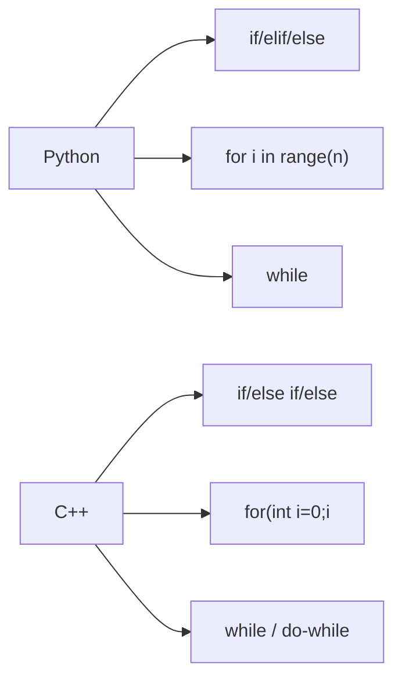

# C03: Điều kiện & Vòng lặp

> **Tác giả:** Hà Trí Kiên<br>
> **Chủ đề:** if/else, for, while, do-while trong C++

---

## 1. Tổng quan

Cấu trúc điều kiện và vòng lặp trong C++ giống Python nhưng cú pháp khác.



---

## 2. Câu lệnh điều kiện

### 2.1. if — else

=== "Python"

    ```python
    n = 10
    if n > 0:
        print("Duong")
    else:
        print("Am")
    ```

=== "C++"

    ```cpp
    int n = 10;
    if (n > 0) {
        cout << "Duong" << endl;
    } else {
        cout << "Am" << endl;
    }
    ```

### 2.2. if — else if — else

=== "Python"

    ```python
    score = 85
    if score >= 90:
        print("Xuat sac")
    elif score >= 80:
        print("Gioi")
    elif score >= 70:
        print("Kha")
    else:
        print("Yeu")
    ```

=== "C++"

    ```cpp
    int score = 85;
    if (score >= 90) {
        cout << "Xuat sac" << endl;
    } else if (score >= 80) {
        cout << "Gioi" << endl;
    } else if (score >= 70) {
        cout << "Kha" << endl;
    } else {
        cout << "Yeu" << endl;
    }
    ```

### 2.3. Ternary

```cpp
int n = 10;
string result = (n > 0) ? "Duong" : "Am";
```

---

## 3. Vòng lặp for

### 3.1. for cổ điển

=== "Python"

    ```python
    for i in range(n):
        print(i)
    ```

=== "C++"

    ```cpp
    for (int i = 0; i < n; i++) {
        cout << i << endl;
    }
    ```

### 3.2. for với step

=== "Python"

    ```python
    for i in range(0, n, 2):
        print(i)
    ```

=== "C++"

    ```cpp
    for (int i = 0; i < n; i += 2) {
        cout << i << endl;
    }
    ```

### 3.3. for đếm ngược

=== "Python"

    ```python
    for i in range(n - 1, -1, -1):
        print(i)
    ```

=== "C++"

    ```cpp
    for (int i = n - 1; i >= 0; i--) {
        cout << i << endl;
    }
    ```

### 3.4. for duyệt mảng

=== "Python"

    ```python
    arr = [1, 2, 3, 4, 5]
    for x in arr:
        print(x)
    ```

=== "C++"

    ```cpp
    vector<int> arr = {1, 2, 3, 4, 5};
    
    // Cách 1: Index
    for (int i = 0; i < arr.size(); i++) {
        cout << arr[i] << endl;
    }
    
    // Cách 2: Range-based for (C++11)
    for (int x : arr) {
        cout << x << endl;
    }
    
    // Cách 3: Auto
    for (auto x : arr) {
        cout << x << endl;
    }
    ```

---

## 4. Vòng lặp while

=== "Python"

    ```python
    n = 10
    while n > 0:
        print(n)
        n -= 1
    ```

=== "C++"

    ```cpp
    int n = 10;
    while (n > 0) {
        cout << n << endl;
        n--;
    }
    ```

---

## 5. Vòng lặp do-while

```cpp
// do-while: chạy ít nhất 1 lần, kiểm tra điều kiện sau
int n = 10;
do {
    cout << n << endl;
    n--;
} while (n > 0);
```

!!! tip "do-while trong thi đấu"
    Ít dùng trong thi đấu, nhưng hữu ích khi cần chạy ít nhất 1 lần.

---

## 6. break và continue

=== "Python"

    ```python
    for i in range(10):
        if i == 5:
            break
        print(i)
    ```

=== "C++"

    ```cpp
    for (int i = 0; i < 10; i++) {
        if (i == 5) break;
        cout << i << endl;
    }
    ```

=== "Python"

    ```python
    for i in range(10):
        if i % 2 == 0:
            continue
        print(i)
    ```

=== "C++"

    ```cpp
    for (int i = 0; i < 10; i++) {
        if (i % 2 == 0) continue;
        cout << i << endl;
    }
    ```

---

## 7. Vòng lặp lồng nhau

```cpp
// Duyệt matrix
for (int i = 0; i < n; i++) {
    for (int j = 0; j < m; j++) {
        cout << matrix[i][j] << " ";
    }
    cout << endl;
}

// Duyệt tất cả cặp (i, j) với i < j
for (int i = 0; i < n; i++) {
    for (int j = i + 1; j < n; j++) {
        cout << "(" << i << ", " << j << ")" << endl;
    }
}
```

---

## 8. So sánh với Python

| Python | C++ | Ghi chú |
|--------|-----|---------|
| `if x > 0:` | `if (x > 0) {` | Cần ngoặc tròn |
| `elif` | `else if` | |
| `for i in range(n):` | `for (int i = 0; i < n; i++) {` | |
| `while x > 0:` | `while (x > 0) {` | |
| `break` | `break` | Giống nhau |
| `continue` | `continue` | Giống nhau |
| Không có | `do { ... } while (cond);` | C++ có thêm do-while |

---

## 9. Pattern thường gặp trong thi đấu

### 9.1. Đọc n phần tử

```cpp
int n;
cin >> n;
vector<int> arr(n);
for (int i = 0; i < n; i++) {
    cin >> arr[i];
}
```

### 9.2. Đọc n testcase

```cpp
int t;
cin >> t;
while (t--) {
    int n;
    cin >> n;
    // Xử lý...
    cout << result << "\n";
}
```

### 9.3. Duyệt mảng

```cpp
vector<int> arr = {1, 2, 3, 4, 5};

// Dùng index
for (int i = 0; i < arr.size(); i++) {
    cout << arr[i] << " ";
}

// Dùng range-based for
for (int x : arr) {
    cout << x << " ";
}
```

### 9.4. Duyệt 4 hướng

```cpp
int dx[] = {0, 0, 1, -1};
int dy[] = {1, -1, 0, 0};

for (int k = 0; k < 4; k++) {
    int nx = x + dx[k];
    int ny = y + dy[k];
    if (nx >= 0 && nx < n && ny >= 0 && ny < m) {
        // Xử lý ô (nx, ny)
    }
}
```

---

## 10. Lưu ý / Cạm bẫy hay gặp

### Bẫy 1: Quên ngoặc tròn

```cpp
// SAI
// if x > 0 {  // Lỗi compile!

// ĐÚNG
if (x > 0) {
    // ...
}
```

### Bẫy 2: Quên ngoặc nhọn

```cpp
// SAI: Chỉ có 1 câu lệnh trong if
if (x > 0)
    cout << "Duong" << endl;
    cout << "OK" << endl;  // Câu này LUÔN chạy!

// ĐÚNG
if (x > 0) {
    cout << "Duong" << endl;
    cout << "OK" << endl;
}
```

### Bẫy 3: Sai điều kiện dừng

```cpp
// SAI: Vòng lặp vô hạn
for (int i = 0; i < 10; i--) {  // i giảm mãi!
    // ...
}

// ĐÚNG
for (int i = 10; i > 0; i--) {
    // ...
}
```

### Bẫy 4: Tràn số trong vòng lặp

```cpp
// SAI: i * i có thể tràn int
for (int i = 0; i * i < n; i++) {
    // ...
}

// ĐÚNG
for (long long i = 0; i * i < n; i++) {
    // ...
}
```

---

## 11. Bài tập thực hành

### Bài 1: Kiểm tra chẵn lẻ
Đọc số nguyên n. In ra "Chan" nếu chẵn, "Le" nếu lẻ.

```cpp
// Code của bạn ở đây
```

??? tip "Lời giải"
    ```cpp
    #include <bits/stdc++.h>
    using namespace std;
    
    int main() {
        int n;
        cin >> n;
        if (n % 2 == 0) {
            cout << "Chan" << endl;
        } else {
            cout << "Le" << endl;
        }
        return 0;
    }
    ```

### Bài 2: In số từ 1 đến n
Đọc n. In ra các số từ 1 đến n.

```cpp
// Code của bạn ở đây
```

??? tip "Lời giải"
    ```cpp
    #include <bits/stdc++.h>
    using namespace std;
    
    int main() {
        int n;
        cin >> n;
        for (int i = 1; i <= n; i++) {
            cout << i << " ";
        }
        cout << endl;
        return 0;
    }
    ```

### Bài 3: Tính tổng 1 + 2 + ... + n
Đọc n. Tính tổng S = 1 + 2 + ... + n.

```cpp
// Code của bạn ở đây
```

??? tip "Lời giải"
    ```cpp
    #include <bits/stdc++.h>
    using namespace std;
    
    int main() {
        long long n;
        cin >> n;
        cout << n * (n + 1) / 2 << endl;
        return 0;
    }
    ```

---

## 12. Bài tập luyện tập

| Bài | Nền tảng | Độ khó | Chủ đề |
|-----|----------|--------|--------|
| [CSES - Weird Algorithm](https://cses.fi/problemset/task/1068) | CSES | ⭐ | while loop |
| [CSES - Repetitions](https://cses.fi/problemset/task/1069) | CSES | ⭐ | for loop |
| [CSES - Increasing Array](https://cses.fi/problemset/task/1094) | CSES | ⭐ | for loop, so sánh |

---

## Bài viết liên quan

- [← C02: Cú pháp cơ bản](C02-cu-phap-co-ban.md)
- [C04: Mảng & Vector →](C04-mang-vector.md)

---

**Bài trước:** [C02: Cú pháp cơ bản](C02-cu-phap-co-ban.md)<br>
**Bài tiếp theo:** [C04: Mảng & Vector →](C04-mang-vector.md)
