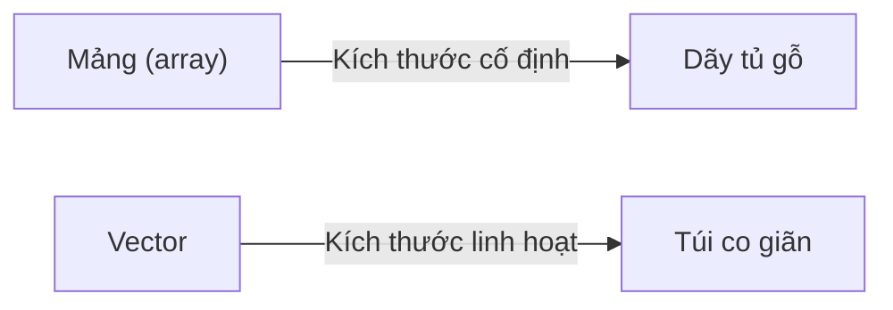

# C04: Mảng & Vector — Lưu trữ nhiều dữ liệu

> **Bạn sẽ học được:** Mảng tĩnh, vector, duyệt, thao tác cơ bản<br>
> **Yêu cầu:** Đã học C03 (Điều kiện & Vòng lặp)<br>
> **Thời gian:** 60 phút

---

## Tại sao cần mảng & vector?

### Analogies: Mảng = Dãy tủ, Vector = Túi co giãn



| Khái niệm | Analogies | Ví dụ |
|-----------|-----------|-------|
| **Mảng** | Dãy tủ gỗ (kích thước cố định) | `int a[5]` — 5 ngăn tủ |
| **Vector** | Túi co giãn (có thể thêm/bớt) | `vector<int> a(n)` — túi có n ngăn |
| **Phần tử** | Đồ trong tủ | `a[0]` — ngăn đầu tiên |
| **Chỉ số** | Số thứ tự ngăn | `a[0]`, `a[1]`, `a[2]`... |

!!! tip "Khi nào dùng mảng, khi nào dùng vector?"
    - **Mảng**: Khi biết **chắc chắn** số phần tử, cần tốc độ tối đa
    - **Vector**: Khi không biết trước số phần tử, hoặc cần thêm/bớt phần tử

---

## Mảng (Array)

### Khai báo mảng

```cpp
// Khai báo mảng 5 phần tử
int a[5];           // Chưa khởi tạo (giá trị rác)

// Khai báo và khởi tạo
int b[5] = {1, 2, 3, 4, 5};  // Khởi tạo sẵn

// Khai báo mảng toàn số 0
int c[5] = {0};     // {0, 0, 0, 0, 0}

// Khai báo mảng toàn số -1
int d[5];
memset(d, -1, sizeof(d));  // {-1, -1, -1, -1, -1}
```

### Truy cập phần tử

```cpp
int a[5] = {10, 20, 30, 40, 50};

cout << a[0] << endl;  // 10 (phần tử đầu tiên)
cout << a[2] << endl;  // 30 (phần tử thứ 3)
cout << a[4] << endl;  // 50 (phần tử cuối cùng)

// Sửa giá trị
a[0] = 100;
cout << a[0] << endl;  // 100
```

!!! warning "Chỉ số bắt đầu từ 0"
    ```cpp
    int a[5] = {10, 20, 30, 40, 50};
    // a[0] = 10, a[1] = 20, a[2] = 30, a[3] = 40, a[4] = 50
    // KHÔNG CÓ a[5]! (truy cập ngoài mảng → lỗi)
    ```

### Duyệt mảng

```cpp
int a[5] = {10, 20, 30, 40, 50};

// Cách 1: Dùng for với chỉ số
for (int i = 0; i < 5; i++) {
    cout << a[i] << " ";
}
// Output: 10 20 30 40 50

// Cách 2: Dùng range-based for (C++11)
for (int x : a) {
    cout << x << " ";
}
// Output: 10 20 30 40 50
```

### Mảng 2 chiều (Ma trận)

```cpp
// Khai báo ma trận 3x3
int a[3][3] = {
    {1, 2, 3},
    {4, 5, 6},
    {7, 8, 9}
};

// Duyệt ma trận
for (int i = 0; i < 3; i++) {
    for (int j = 0; j < 3; j++) {
        cout << a[i][j] << " ";
    }
    cout << endl;
}
```

---

## Vector — Mảng động

### Tại sao dùng vector?

```cpp
// ❌ Mảng: Phải biết trước kích thước
int n;
cin >> n;
int a[n];  // Không chuẩn C++, một số compiler cho phép

// ✅ Vector: Linh hoạt
int n;
cin >> n;
vector<int> a(n);  // Tạo vector n phần tử
```

### Khai báo vector

```cpp
// Vector rỗng
vector<int> a;

// Vector n phần tử (khởi tạo 0)
vector<int> b(n);

// Vector n phần tử, tất cả là giá trị x
vector<int> c(n, x);

// Khởi tạo sẵn
vector<int> d = {1, 2, 3, 4, 5};
```

### Thao tác cơ bản

```cpp
vector<int> a = {1, 2, 3, 4, 5};

// Truy cập
cout << a[0] << endl;      // 1
cout << a.size() << endl;  // 5

// Thêm phần tử vào cuối
a.push_back(6);            // {1, 2, 3, 4, 5, 6}

// Xóa phần tử cuối
a.pop_back();              // {1, 2, 3, 4, 5}

// Kiểm tra rỗng
if (a.empty()) cout << "Rong";

// Xóa tất cả
a.clear();
```

### Duyệt vector

```cpp
vector<int> a = {10, 20, 30, 40, 50};

// Cách 1: Dùng chỉ số
for (int i = 0; i < a.size(); i++) {
    cout << a[i] << " ";
}

// Cách 2: Dùng range-based for
for (int x : a) {
    cout << x << " ";
}

// Cách 3: Dùng iterator
for (auto it = a.begin(); it != a.end(); it++) {
    cout << *it << " ";
}
```

### Vector 2 chiều (Ma trận động)

```cpp
int rows, cols;
cin >> rows >> cols;

// Tạo ma trận rows x cols, khởi tạo 0
vector<vector<int>> a(rows, vector<int>(cols, 0));

// Duyệt
for (int i = 0; i < rows; i++) {
    for (int j = 0; j < cols; j++) {
        cin >> a[i][j];
    }
}
```

---

## Các hàm thường dùng

### Với mảng

```cpp
int a[] = {5, 2, 8, 1, 9, 3};
int n = 6;

// Sắp xếp
sort(a, a + n);  // {1, 2, 3, 5, 8, 9}

// Tìm min/max
int minVal = *min_element(a, a + n);  // 1
int maxVal = *max_element(a, a + n);  // 9

// Đảo ngược
reverse(a, a + n);  // {9, 8, 5, 3, 2, 1}

// Tìm kiếm
bool found = binary_search(a, a + n, 5);  // true (phải sắp xếp trước)
```

### Với vector

```cpp
vector<int> a = {5, 2, 8, 1, 9, 3};

// Sắp xếp
sort(a.begin(), a.end());  // {1, 2, 3, 5, 8, 9}

// Tìm min/max
int minVal = *min_element(a.begin(), a.end());  // 1
int maxVal = *max_element(a.begin(), a.end());  // 9

// Đảo ngược
reverse(a.begin(), a.end());  // {9, 8, 5, 3, 2, 1}

// Xóa phần tử tại vị trí i
a.erase(a.begin() + i);

// Chèn phần tử tại vị trí i
a.insert(a.begin() + i, x);

// Tìm kiếm
auto it = find(a.begin(), a.end(), 5);
if (it != a.end()) cout << "Tim thay";
```

---

## Bài toán kinh điển

### Bài toán 1: Tìm số lớn nhất

```cpp
int n;
cin >> n;

vector<int> a(n);
for (int i = 0; i < n; i++) cin >> a[i];

int maxVal = a[0];
for (int i = 1; i < n; i++) {
    if (a[i] > maxVal) maxVal = a[i];
}
cout << maxVal << endl;
```

### Bài toán 2: Đếm số dương

```cpp
int n;
cin >> n;

vector<int> a(n);
for (int i = 0; i < n; i++) cin >> a[i];

int count = 0;
for (int x : a) {
    if (x > 0) count++;
}
cout << count << endl;
```

### Bài toán 3: Tính tổng mảng

```cpp
int n;
cin >> n;

vector<int> a(n);
for (int i = 0; i < n; i++) cin >> a[i];

long long sum = 0;
for (int x : a) sum += x;
cout << sum << endl;
```

---

## Common Mistakes — Lỗi thường gặp

### Lỗi 1: Truy cập ngoài mảng

```cpp
int a[5] = {1, 2, 3, 4, 5};

// ❌ SAI: Truy cập a[5] (ngoài mảng)
cout << a[5] << endl;  // Lỗi runtime hoặc giá trị rác!

// ✅ ĐÚNG: Chỉ truy cập a[0] đến a[4]
for (int i = 0; i < 5; i++) cout << a[i] << " ";
```

### Lỗi 2: Quên khởi tạo mảng

```cpp
// ❌ SAI: Mảng chưa khởi tạo
int a[5];
cout << a[0] << endl;  // Giá trị rác!

// ✅ ĐÚNG: Khởi tạo mảng
int a[5] = {0};  // Tất cả bằng 0
```

### Lỗi 3: Dùng size() kiểu int

```cpp
vector<int> a = {1, 2, 3, 4, 5};

// ❌ SAI: So sánh int với size_t (unsigned)
for (int i = 0; i < a.size(); i++) { ... }  // Cảnh báo

// ✅ ĐÚNG: Dùng size_t hoặc int cast
for (int i = 0; i < (int)a.size(); i++) { ... }
// hoặc
for (size_t i = 0; i < a.size(); i++) { ... }
```

### Lỗi 4: Xóa phần tử trong vòng lặp

```cpp
// ❌ SAI: Xóa phần tử trong vòng lặp for thường
vector<int> a = {1, 2, 3, 4, 5};
for (int i = 0; i < a.size(); i++) {
    if (a[i] % 2 == 0) a.erase(a.begin() + i);  // Bỏ qua phần tử!
}

// ✅ ĐÚNG: Dùng iterator hoặc vòng lặp ngược
for (auto it = a.begin(); it != a.end(); ) {
    if (*it % 2 == 0) it = a.erase(it);
    else it++;
}
```

---

## Bài tập thực hành

### Bài 1: Tìm số lớn nhất
Đọc n số nguyên. Tìm số lớn nhất.

**Input:** `5 3 7 2 9 1`<br>
**Output:** `9`

<div class="cp-pg" data-language="cpp" data-starter="#include &lt;bits/stdc++.h&gt;\nusing namespace std;\n\nint main() {\n    // Viết code ở đây\n    return 0;\n}" data-input="5 3 7 2 9 1" data-expected="9" data-hint="Duyệt mảng, cập nhật maxVal nếu tìm thấy số lớn hơn"></div>

??? tip "Lời giải"
    ```cpp
    #include <bits/stdc++.h>
    using namespace std;
    
    int main() {
        int n;
        cin >> n;
        vector<int> a(n);
        for (int i = 0; i < n; i++) cin >> a[i];
        
        int maxVal = a[0];
        for (int i = 1; i < n; i++) {
            if (a[i] > maxVal) maxVal = a[i];
        }
        cout << maxVal << endl;
        return 0;
    }
    ```

### Bài 2: Đảo ngược mảng
Đọc n số nguyên. In mảng đảo ngược.

**Input:** `5 1 2 3 4 5`<br>
**Output:** `5 4 3 2 1`

<div class="cp-pg" data-language="cpp" data-starter="#include &lt;bits/stdc++.h&gt;\nusing namespace std;\n\nint main() {\n    // Viết code ở đây\n    return 0;\n}" data-input="5 1 2 3 4 5" data-expected="5 4 3 2 1" data-hint="Dùng reverse(a.begin(), a.end()) để đảo ngược"></div>

??? tip "Lời giải"
    ```cpp
    #include <bits/stdc++.h>
    using namespace std;
    
    int main() {
        int n;
        cin >> n;
        vector<int> a(n);
        for (int i = 0; i < n; i++) cin >> a[i];
        
        reverse(a.begin(), a.end());
        for (int x : a) cout << x << " ";
        return 0;
    }
    ```

### Bài 3: Đếm số chẵn
Đọc n số nguyên. Đếm số lượng số chẵn.

**Input:** `5 1 2 3 4 5`<br>
**Output:** `2`

<div class="cp-pg" data-language="cpp" data-starter="#include &lt;bits/stdc++.h&gt;\nusing namespace std;\n\nint main() {\n    // Viết code ở đây\n    return 0;\n}" data-input="5 1 2 3 4 5" data-expected="2" data-hint="Dùng x % 2 == 0 để kiểm tra số chẵn"></div>

??? tip "Lời giải"
    ```cpp
    #include <bits/stdc++.h>
    using namespace std;
    
    int main() {
        int n;
        cin >> n;
        vector<int> a(n);
        for (int i = 0; i < n; i++) cin >> a[i];
        
        int count = 0;
        for (int x : a) {
            if (x % 2 == 0) count++;
        }
        cout << count << endl;
        return 0;
    }
    ```

---

## Tóm tắt bài học

| Nội dung | Chi tiết |
|----------|----------|
| **Mảng** | `int a[n]` — kích thước cố định |
| **Vector** | `vector<int> a(n)` — kích thước linh hoạt |
| **Truy cập** | `a[i]` — chỉ số bắt đầu từ 0 |
| **Duyệt** | `for (int i = 0; i < n; i++)` hoặc `for (int x : a)` |
| **Thao tác** | `push_back()`, `pop_back()`, `size()`, `empty()` |
| **Sắp xếp** | `sort(a.begin(), a.end())` |

---

## Bài viết liên quan

- [C03: Điều kiện & Vòng lặp ←](C03-dieu-kien-vong-lap.md)
- [C05: String →](C05-string.md)

---

**Bài tiếp theo:** [C05: String →](C05-string.md)
