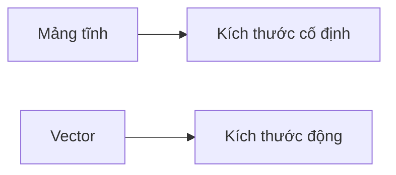

# C04: Mảng & Vector

> **Tác giả:** Hà Trí Kiên<br>
> **Chủ đề:** Mảng tĩnh, vector, các thao tác cơ bản

---

## 1. Tổng quan

Mảng và vector là cấu trúc dữ liệu **cơ bản nhất** trong C++. Vector linh hoạt hơn mảng tĩnh.



---

## 2. Mảng tĩnh (Array)

### 2.1. Khai báo

```cpp
int arr[5];              // Mảng 5 phần tử, chưa khởi tạo
int arr[5] = {1, 2, 3, 4, 5};  // Khởi tạo sẵn
int arr[5] = {1, 2};    // {1, 2, 0, 0, 0} — phần còn lại = 0
int arr[] = {1, 2, 3};  // Tự động xác định kích thước = 3
```

### 2.2. Truy cập

```cpp
int arr[5] = {10, 20, 30, 40, 50};

cout << arr[0] << endl;  // 10
cout << arr[2] << endl;  // 30
cout << arr[4] << endl;  // 50

// Sửa phần tử
arr[2] = 300;
```

!!! warning "Truy cập ngoài phạm vi"
    ```cpp
    int arr[5] = {1, 2, 3, 4, 5};
    // cout << arr[10];  // Undefined behavior! Có thể crash hoặc trả về rác
    ```

### 2.3. Duyệt

```cpp
int arr[5] = {1, 2, 3, 4, 5};
int n = 5;

// Cách 1: Dùng index
for (int i = 0; i < n; i++) {
    cout << arr[i] << " ";
}

// Cách 2: Range-based for (C++11)
for (int x : arr) {
    cout << x << " ";
}
```

### 2.4. Mảng 2D

```cpp
int matrix[3][4];  // 3 hàng, 4 cột

// Khởi tạo
int matrix[3][4] = {
    {1, 2, 3, 4},
    {5, 6, 7, 8},
    {9, 10, 11, 12}
};

// Truy cập
cout << matrix[1][2] << endl;  // 7

// Duyệt
for (int i = 0; i < 3; i++) {
    for (int j = 0; j < 4; j++) {
        cout << matrix[i][j] << " ";
    }
    cout << endl;
}
```

---

## 3. Vector — Mảng động

### 3.1. Khai báo

```cpp
#include <vector>

vector<int> v;                // Vector rỗng
vector<int> v(5);             // 5 phần tử, giá trị 0
vector<int> v(5, 10);         // 5 phần tử, giá trị 10
vector<int> v = {1, 2, 3, 4, 5};  // Khởi tạo sẵn

// Vector 2D
vector<vector<int>> matrix(n, vector<int>(m));  // n hàng, m cột
vector<vector<int>> matrix(n, vector<int>(m, 0));  // n hàng, m cột, giá trị 0
```

### 3.2. Các phương thức thường dùng

```cpp
vector<int> v = {1, 2, 3};

// Thêm phần tử
v.push_back(4);       // {1, 2, 3, 4}
v.emplace_back(5);    // {1, 2, 3, 4, 5} — nhanh hơn push_back

// Xóa phần tử
v.pop_back();         // {1, 2, 3, 4}
v.erase(v.begin() + 1);  // {1, 3, 4} — xóa tại vị trí 1
v.clear();            // Xóa tất cả

// Truy cập
cout << v[0] << endl;     // 1 — không kiểm tra biên
cout << v.at(0) << endl;  // 1 — kiểm tra biên (chậm hơn)
cout << v.front() << endl; // Phần tử đầu
cout << v.back() << endl;  // Phần tử cuối

// Kích thước
cout << v.size() << endl;  // Số phần tử
cout << v.empty() << endl; // true nếu rỗng

// Resize
v.resize(10);         // Thay đổi kích thước thành 10
v.resize(10, 5);      // Thay đổi kích thước thành 10, phần mới = 5
```

### 3.3. Duyệt

```cpp
vector<int> v = {1, 2, 3, 4, 5};

// Cách 1: Index
for (int i = 0; i < v.size(); i++) {
    cout << v[i] << " ";
}

// Cách 2: Range-based for
for (int x : v) {
    cout << x << " ";
}

// Cách 3: Iterator
for (auto it = v.begin(); it != v.end(); it++) {
    cout << *it << " ";
}

// Cách 4: Reverse
for (auto it = v.rbegin(); it != v.rend(); it++) {
    cout << *it << " ";
}
```

### 3.4. Sắp xếp

```cpp
vector<int> v = {3, 1, 4, 1, 5, 9};

// Sắp xếp tăng dần
sort(v.begin(), v.end());  // {1, 1, 3, 4, 5, 9}

// Sắp xếp giảm dần
sort(v.begin(), v.end(), greater<int>());  // {9, 5, 4, 3, 1, 1}

// Sắp xếp với comparator
sort(v.begin(), v.end(), [](int a, int b) {
    return a > b;  // Giảm dần
});
```

---

## 4. So sánh với Python

| Python | C++ | Ghi chú |
|--------|-----|---------|
| `arr = [0] * n` | `vector<int> arr(n);` | |
| `arr = []` | `vector<int> arr;` | |
| `arr.append(x)` | `arr.push_back(x);` | |
| `arr.pop()` | `arr.pop_back();` | |
| `len(arr)` | `arr.size()` | |
| `arr[i]` | `arr[i]` | Giống nhau |
| `arr.sort()` | `sort(arr.begin(), arr.end());` | |
| `arr[::-1]` | `reverse(arr.begin(), arr.end());` | |

---

## 5. Pattern thường gặp trong thi đấu

### 5.1. Đọc mảng

```cpp
int n;
cin >> n;
vector<int> arr(n);
for (int i = 0; i < n; i++) {
    cin >> arr[i];
}
```

### 5.2. Đọc matrix

```cpp
int n, m;
cin >> n >> m;
vector<vector<int>> matrix(n, vector<int>(m));
for (int i = 0; i < n; i++) {
    for (int j = 0; j < m; j++) {
        cin >> matrix[i][j];
    }
}
```

### 5.3. Tạo vector từ input

```cpp
// Đọc n phần tử vào vector
int n;
cin >> n;
vector<int> arr(n);
for (int& x : arr) {
    cin >> x;
}
```

### 5.4. Sắp xếp và tìm kiếm

```cpp
vector<int> arr = {3, 1, 4, 1, 5, 9};

// Sắp xếp
sort(arr.begin(), arr.end());

// Tìm kiếm nhị phân
bool found = binary_search(arr.begin(), arr.end(), 4);

// Tìm vị trí
auto it = lower_bound(arr.begin(), arr.end(), 4);
int pos = it - arr.begin();
```

---

## 6. Lưu ý / Cạm bẫy hay gặp

### Bẫy 1: Vector 2D khởi tạo sai

```cpp
// SAI: Không khởi tạo kích thước
// vector<vector<int>> matrix;
// matrix[0][0] = 1;  // Lỗi!

// ĐÚNG
vector<vector<int>> matrix(n, vector<int>(m));
```

### Bẫy 2: Truy cập ngoài phạm vi

```cpp
vector<int> v = {1, 2, 3};
// cout << v[10];  // Undefined behavior!
```

### Bẫy 3: push_back vs emplace_back

```cpp
// push_back: tạo đối tượng trước, rồi copy vào vector
v.push_back(10);

// emplace_back: tạo đối tượng trực tiếp trong vector (nhanh hơn)
v.emplace_back(10);
```

### Bẫy 4: size() trả về unsigned

```cpp
vector<int> v = {1, 2, 3};

// SAI: So sánh int với size()
// for (int i = 0; i < v.size() - 1; i++) { ... }
// v.size() - 1 có thể là số rất lớn nếu v rỗng!

// ĐÚNG
for (int i = 0; i < (int)v.size() - 1; i++) { ... }
```

---

## 7. Bài tập thực hành

### Bài 1: Đọc và in mảng
Đọc n số nguyên. In ra mảng.

```cpp
// Code của bạn ở đây
```

??? tip "Lời giải"
    ```cpp
    #include <bits/stdc++.h>
    using namespace std;
    
    int main() {
        int n;
        cin >> n;
        vector<int> arr(n);
        for (int i = 0; i < n; i++) {
            cin >> arr[i];
        }
        for (int x : arr) {
            cout << x << " ";
        }
        cout << endl;
        return 0;
    }
    ```

### Bài 2: Tìm số lớn nhất
Đọc n số nguyên. Tìm số lớn nhất.

```cpp
// Code của bạn ở đây
```

??? tip "Lời giải"
    ```cpp
    #include <bits/stdc++.h>
    using namespace std;
    
    int main() {
        int n;
        cin >> n;
        vector<int> arr(n);
        for (int i = 0; i < n; i++) {
            cin >> arr[i];
        }
        cout << *max_element(arr.begin(), arr.end()) << endl;
        return 0;
    }
    ```

### Bài 3: Sắp xếp mảng
Đọc n số nguyên. Sắp xếp tăng dần và in ra.

```cpp
// Code của bạn ở đây
```

??? tip "Lời giải"
    ```cpp
    #include <bits/stdc++.h>
    using namespace std;
    
    int main() {
        int n;
        cin >> n;
        vector<int> arr(n);
        for (int i = 0; i < n; i++) {
            cin >> arr[i];
        }
        sort(arr.begin(), arr.end());
        for (int x : arr) {
            cout << x << " ";
        }
        cout << endl;
        return 0;
    }
    ```

---

## 8. Bài tập luyện tập

### Bài 4: Đếm số dương
Cho mảng arr gồm n số nguyên. Đếm số phần tử dương.

```
Input:
5
-1 2 -3 4 -5

Output:
2
```

```cpp
// Code của bạn ở đây
```

??? tip "Lời giải"
    ```cpp
    #include <bits/stdc++.h>
    using namespace std;
    
    int main() {
        int n;
        cin >> n;
        vector<int> arr(n);
        for (int i = 0; i < n; i++) cin >> arr[i];
        
        int count = 0;
        for (int x : arr) {
            if (x > 0) count++;
        }
        cout << count << endl;
        return 0;
    }
    ```

### Bài 5: Tìm vị trí phần tử lớn nhất
Cho mảng arr gồm n số nguyên. Tìm vị trí (index) của phần tử lớn nhất.

```
Input:
5
3 1 4 1 5

Output:
4
```

```cpp
// Code của bạn ở đây
```

??? tip "Lời giải"
    ```cpp
    #include <bits/stdc++.h>
    using namespace std;
    
    int main() {
        int n;
        cin >> n;
        vector<int> arr(n);
        for (int i = 0; i < n; i++) cin >> arr[i];
        
        int maxIdx = 0;
        for (int i = 1; i < n; i++) {
            if (arr[i] > arr[maxIdx]) {
                maxIdx = i;
            }
        }
        cout << maxIdx << endl;
        return 0;
    }
    ```

### Bài 6: Xoay mảng sang phải
Cho mảng arr gồm n phần tử và số k. Xoay mảng sang phải k vị trí.

```
Input:
5 2
1 2 3 4 5

Output:
4 5 1 2 3
```

```cpp
// Code của bạn ở đây
```

??? tip "Lời giải"
    ```cpp
    #include <bits/stdc++.h>
    using namespace std;
    
    int main() {
        int n, k;
        cin >> n >> k;
        vector<int> arr(n);
        for (int i = 0; i < n; i++) cin >> arr[i];
        
        k = k % n;
        reverse(arr.begin(), arr.end());
        reverse(arr.begin(), arr.begin() + k);
        reverse(arr.begin() + k, arr.end());
        
        for (int x : arr) cout << x << " ";
        cout << endl;
        return 0;
    }
    ```

### Bài 7: Trộn 2 mảng đã sắp xếp
Cho 2 mảng đã sắp xếp. Trộn thành 1 mảng đã sắp xếp.

```
Input:
3 4
1 3 5
2 4 6 8

Output:
1 2 3 4 5 6 8
```

```cpp
// Code của bạn ở đây
```

??? tip "Lời giải"
    ```cpp
    #include <bits/stdc++.h>
    using namespace std;
    
    int main() {
        int n, m;
        cin >> n >> m;
        vector<int> a(n), b(m);
        for (int i = 0; i < n; i++) cin >> a[i];
        for (int i = 0; i < m; i++) cin >> b[i];
        
        vector<int> result;
        merge(a.begin(), a.end(), b.begin(), b.end(), back_inserter(result));
        
        for (int x : result) cout << x << " ";
        cout << endl;
        return 0;
    }
    ```

---

## Bài viết liên quan

- [← C03: Điều kiện & Vòng lặp](C03-dieu-kien-vong-lap.md)
- [C05: String →](C05-string.md)

---

**Bài trước:** [C03: Điều kiện & Vòng lặp](C03-dieu-kien-vong-lap.md)<br>
**Bài tiếp theo:** [C05: String →](C05-string.md)
