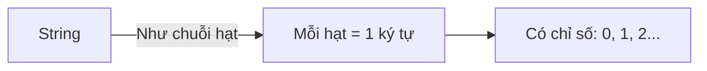

# C05: String — Xử lý chuỗi ký tự

> **Bạn sẽ học được:** Khai báo string, các phương thức, xử lý chuỗi trong thi đấu<br>
> **Yêu cầu:** Đã học C04 (Mảng & Vector)<br>
> **Thời gian:** 45 phút

---

## String là gì?

### Analogies: String = Chuỗi hạt



| Khái niệm | Analogies | Ví dụ |
|-----------|-----------|-------|
| **String** | Chuỗi hạt | `"Hello"` |
| **Ký tự** | Mỗi hạt | `'H'`, `'e'`, `'l'`, `'l'`, `'o'` |
| **Chỉ số** | Vị trí hạt | `s[0]='H'`, `s[1]='e'` |
| **Độ dài** | Số hạt | `s.length() = 5` |

---

## Khai báo String

```cpp
// Cách 1: Khai báo rỗng
string s;

// Cách 2: Khai báo và khởi tạo
string s = "Hello";

// Cách 3: Khai báo n ký tự giống nhau
string s(5, 'a');  // "aaaaa"

// Cách 4: Copy từ string khác
string s2 = s;
```

!!! tip "String vs char[]"
    ```cpp
    // char[] — kiểu C cũ (ít dùng)
    char s[] = "Hello";
    
    // string — kiểu C++ (nên dùng)
    string s = "Hello";
    ```
    **Ưu tiên dùng `string`** vì dễ sử dụng hơn nhiều!

---

## Truy cập ký tự

```cpp
string s = "Hello";

cout << s[0] << endl;  // 'H' (ký tự đầu tiên)
cout << s[1] << endl;  // 'e'
cout << s[4] << endl;  // 'o' (ký tự cuối cùng)

// Sửa ký tự
s[0] = 'h';
cout << s << endl;  // "hello"
```

!!! warning "Chỉ số bắt đầu từ 0"
    ```cpp
    string s = "Hello";
    // s[0]='H', s[1]='e', s[2]='l', s[3]='l', s[4]='o'
    // KHÔNG CÓ s[5]! (truy cập ngoài chuỗi → lỗi)
    ```

---

## Các phương thức cơ bản

### Độ dài chuỗi

```cpp
string s = "Hello";

cout << s.length() << endl;   // 5 (cách 1)
cout << s.size() << endl;     // 5 (cách 2)
```

### Nối chuỗi

```cpp
string s1 = "Hello";
string s2 = " World";

// Cách 1: Dùng +
string s3 = s1 + s2;  // "Hello World"

// Cách 2: Dùng +=
s1 += s2;  // s1 = "Hello World"
```

### Cắt chuỗi

```cpp
string s = "Hello World";

// Cắt từ vị trí pos, độ dài len
string sub = s.substr(6, 5);  // "World"

// Cắt từ vị trí pos đến hết
string sub2 = s.substr(6);  // "World"
```

### Tìm kiếm

```cpp
string s = "Hello World";

// Tìm chuỗi con (trả về vị trí, hoặc string::npos nếu không tìm thấy)
int pos = s.find("World");  // 6
if (pos != string::npos) cout << "Tim thay tai vi tri " << pos;

// Tìm từ vị trí nào
int pos2 = s.find("l", 4);  // Tìm 'l' từ vị trí 4 → 9
```

### So sánh

```cpp
string s1 = "Hello";
string s2 = "Hello";
string s3 = "World";

if (s1 == s2) cout << "Bang nhau";  // true
if (s1 != s3) cout << "Khac nhau";  // true
if (s1 < s3) cout << "Hello truoc World";  // true (theo từ điển)
```

### Các hàm khác

```cpp
string s = "Hello World";

// Chuyển hoa
string upper = s;
transform(upper.begin(), upper.end(), upper.begin(), ::toupper);
// "HELLO WORLD"

// Chuyển thường
string lower = s;
transform(lower.begin(), lower.end(), lower.begin(), ::tolower);
// "hello world"

// Kiểm tra rỗng
if (s.empty()) cout << "Rong";

// Xóa tất cả
s.clear();
```

---

## Nhập chuỗi

### Nhập 1 từ (không có dấu cách)

```cpp
string s;
cin >> s;  // Chỉ đọc đến dấu cách
cout << s << endl;
```

### Nhập cả dòng

```cpp
string s;
getline(cin, s);  // Đọc cả dòng (bao gồm dấu cách)
cout << s << endl;
```

!!! warning "Lỗi khi dùng getline sau cin"
    ```cpp
    int n;
    cin >> n;          // Đọc số, để lại '\n' trong buffer
    
    string s;
    getline(cin, s);   // Đọc '\n' còn sót → s rỗng!
    
    // ✅ ĐÚNG: Xóa buffer trước
    cin.ignore();
    getline(cin, s);
    ```

---

## Duyệt chuỗi

```cpp
string s = "Hello";

// Cách 1: Dùng chỉ số
for (int i = 0; i < s.length(); i++) {
    cout << s[i] << " ";
}

// Cách 2: Dùng range-based for
for (char c : s) {
    cout << c << " ";
}
```

---

## Bài toán kinh điển

### Bài toán 1: Đếm ký tự

```cpp
string s;
cin >> s;

int count = 0;
for (char c : s) {
    if (c == 'a') count++;
}
cout << count << endl;
```

### Bài toán 2: Kiểm tra palindrome

```cpp
string s;
cin >> s;

bool isPalindrome = true;
int n = s.length();
for (int i = 0; i < n / 2; i++) {
    if (s[i] != s[n - 1 - i]) {
        isPalindrome = false;
        break;
    }
}

if (isPalindrome) cout << "Palindrome";
else cout << "Khong phai";
```

### Bài toán 3: Đảo ngược chuỗi

```cpp
string s;
cin >> s;

reverse(s.begin(), s.end());
cout << s << endl;
```

### Bài toán 4: Kiểm tra chuỗi con

```cpp
string s, sub;
cin >> s >> sub;

if (s.find(sub) != string::npos) {
    cout << "Tim thay";
} else {
    cout << "Khong tim thay";
}
```

---

## Common Mistakes — Lỗi thường gặp

### Lỗi 1: Truy cập ngoài chuỗi

```cpp
string s = "Hello";

// ❌ SAI: Truy cập s[5] (ngoài chuỗi)
cout << s[5] << endl;  // Lỗi runtime hoặc giá trị rác!

// ✅ ĐÚNG: Chỉ truy cập s[0] đến s[4]
for (int i = 0; i < s.length(); i++) cout << s[i];
```

### Lỗi 2: Quên getline

```cpp
// ❌ SAI: Chỉ đọc 1 từ
string s;
cin >> s;  // "Hello World" → chỉ đọc "Hello"

// ✅ ĐÚNG: Đọc cả dòng
string s;
getline(cin, s);  // "Hello World"
```

### Lỗi 3: So sánh string bằng `==`

```cpp
// ✅ C++ cho phép so sánh string bằng ==
string s1 = "Hello";
string s2 = "Hello";
if (s1 == s2) cout << "Bang nhau";  // OK!

// ❌ Nhưng với char[] thì không được!
char s3[] = "Hello";
char s4[] = "Hello";
if (s3 == s4) cout << "Sai!";  // So sánh địa chỉ, không phải nội dung!
```

---

## Bài tập thực hành

### Bài 1: Đếm chữ hoa
Đọc chuỗi s. Đếm số ký tự viết hoa.

**Input:** `HelloWorld`<br>
**Output:** `2`

<div class="cp-pg" data-language="cpp" data-starter="#include &lt;bits/stdc++.h&gt;\nusing namespace std;\n\nint main() {\n    // Viết code ở đây\n    return 0;\n}" data-input="HelloWorld" data-expected="2" data-hint="Dùng isupper(c) để kiểm tra ký tự hoa"></div>

??? tip "Lời giải"
    ```cpp
    #include <bits/stdc++.h>
    using namespace std;
    
    int main() {
        string s;
        cin >> s;
        int count = 0;
        for (char c : s) {
            if (isupper(c)) count++;
        }
        cout << count << endl;
        return 0;
    }
    ```

### Bài 2: Kiểm tra palindrome
Đọc chuỗi s. Kiểm tra s có phải palindrome không.

**Input:** `abcba`<br>
**Output:** `YES`

<div class="cp-pg" data-language="cpp" data-starter="#include &lt;bits/stdc++.h&gt;\nusing namespace std;\n\nint main() {\n    // Viết code ở đây\n    return 0;\n}" data-input="abcba" data-expected="YES" data-hint="Đảo ngược chuỗi và so sánh với chuỗi gốc"></div>

??? tip "Lời giải"
    ```cpp
    #include <bits/stdc++.h>
    using namespace std;
    
    int main() {
        string s;
        cin >> s;
        
        string rev = s;
        reverse(rev.begin(), rev.end());
        
        if (s == rev) cout << "YES" << endl;
        else cout << "NO" << endl;
        return 0;
    }
    ```

### Bài 3: Đếm từ
Đọc 1 dòng. Đếm số từ trong dòng.

**Input:** `Hello World`<br>
**Output:** `2`

<div class="cp-pg" data-language="cpp" data-starter="#include &lt;bits/stdc++.h&gt;\nusing namespace std;\n\nint main() {\n    // Viết code ở đây\n    return 0;\n}" data-input="Hello World" data-expected="2" data-hint="Dùng getline để đọc cả dòng, stringstream để tách từ"></div>

??? tip "Lời giải"
    ```cpp
    #include <bits/stdc++.h>
    using namespace std;
    
    int main() {
        string s;
        getline(cin, s);
        
        int count = 0;
        stringstream ss(s);
        string word;
        while (ss >> word) count++;
        
        cout << count << endl;
        return 0;
    }
    ```

---

## Tóm tắt bài học

| Nội dung | Chi tiết |
|----------|----------|
| **Khai báo** | `string s = "Hello";` |
| **Độ dài** | `s.length()` hoặc `s.size()` |
| **Truy cập** | `s[i]` — chỉ số bắt đầu từ 0 |
| **Nối chuỗi** | `s1 + s2` hoặc `s1 += s2` |
| **Cắt chuỗi** | `s.substr(pos, len)` |
| **Tìm kiếm** | `s.find(sub)` |
| **Nhập dòng** | `getline(cin, s)` |
| **Duyệt** | `for (char c : s)` |

---

## Bài viết liên quan

- [C04: Mảng & Vector ←](C04-mang-vector.md)
- [C06: Hàm trong C++ →](C06-ham.md)

---

**Bài tiếp theo:** [C06: Hàm trong C++ →](C06-ham.md)
