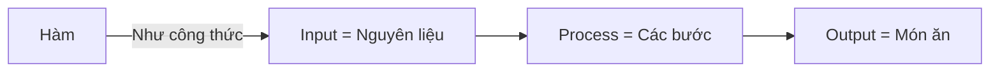
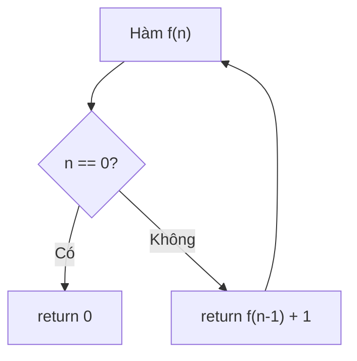

# C06: Hàm trong C++ — Tái sử dụng code

> **Bạn sẽ học được:** Định nghĩa hàm, overload, template, đệ quy<br>
> **Yêu cầu:** Đã học C05 (String)<br>
> **Thời gian:** 45 phút

---

## Tại sao cần hàm?

### Analogies: Hàm = Công thức nấu ăn



| Khái niệm | Analogies | Ví dụ |
|-----------|-----------|-------|
| **Hàm** | Công thức nấu ăn | `int tong(int a, int b)` |
| **Tham số** | Nguyên liệu | `a`, `b` |
| **Giá trị trả về** | Món ăn | `return a + b` |
| **Gọi hàm** | Nấu theo công thức | `int kq = tong(3, 5)` |

!!! tip "Tại sao dùng hàm?"
    - **Tái sử dụng code**: Viết 1 lần, dùng nhiều lần
    - **Dễ đọc**: Chia code thành các phần nhỏ
    - **Dễ debug**: Chỉ cần sửa 1 chỗ

---

## Định nghĩa hàm

### Cú pháp cơ bản

```cpp
kiểu_trả_về tên_hàm(tham_số) {
    // Code
    return giá_trị;
}
```

### Ví dụ 1: Hàm tính tổng

```cpp
int tong(int a, int b) {
    return a + b;
}

int main() {
    int kq = tong(3, 5);
    cout << kq << endl;  // 8
    return 0;
}
```

### Ví dụ 2: Hàm không trả về giá trị

```cpp
void inHello(string name) {
    cout << "Hello " << name << "!" << endl;
}

int main() {
    inHello("Nam");  // Hello Nam!
    return 0;
}
```

### Ví dụ 3: Hàm không có tham số

```cpp
int random100() {
    return rand() % 100;
}

int main() {
    cout << random100() << endl;
    return 0;
}
```

---

## Truyền tham số

### Truyền giá trị (Pass by Value)

```cpp
void tangMot(int x) {
    x++;  // Chỉ thay đổi bản sao
}

int main() {
    int a = 5;
    tangMot(a);
    cout << a << endl;  // Vẫn là 5!
    return 0;
}
```

### Truyền tham chiếu (Pass by Reference)

```cpp
void tangMot(int &x) {
    x++;  // Thay đổi biến gốc
}

int main() {
    int a = 5;
    tangMot(a);
    cout << a << endl;  // Là 6!
    return 0;
}
```

!!! tip "Khi nào dùng &?"
    - **Không cần &**: Chỉ đọc giá trị (không thay đổi)
    - **Cần &**: Muốn thay đổi giá trị
    - **Cần &**: Truyền mảng, string lớn (tránh copy)

---

## Overload — Nhiều hàm cùng tên

```cpp
// Hàm tính tổng 2 số
int tong(int a, int b) {
    return a + b;
}

// Hàm tính tổng 3 số (cùng tên, khác tham số)
int tong(int a, int b, int c) {
    return a + b + c;
}

// Hàm tính tổng 2 số thực
double tong(double a, double b) {
    return a + b;
}

int main() {
    cout << tong(3, 5) << endl;      // 8 (gọi hàm 2 int)
    cout << tong(3, 5, 7) << endl;   // 15 (gọi hàm 3 int)
    cout << tong(3.5, 5.5) << endl;  // 9.0 (gọi hàm 2 double)
    return 0;
}
```

---

## Hàm với mảng/vector

### Truyền mảng

```cpp
int timMax(int a[], int n) {
    int maxVal = a[0];
    for (int i = 1; i < n; i++) {
        if (a[i] > maxVal) maxVal = a[i];
    }
    return maxVal;
}

int main() {
    int a[] = {3, 1, 4, 1, 5, 9};
    cout << timMax(a, 6) << endl;  // 9
    return 0;
}
```

### Truyền vector

```cpp
int timMax(const vector<int>& a) {
    int maxVal = a[0];
    for (int x : a) {
        if (x > maxVal) maxVal = x;
    }
    return maxVal;
}

int main() {
    vector<int> a = {3, 1, 4, 1, 5, 9};
    cout << timMax(a) << endl;  // 9
    return 0;
}
```

---

## Đệ quy (Recursion)

### Analogies: Đệ quy = Gương chiếu gương



### Ví dụ 1: Tính giai thừa

```cpp
int giaiThua(int n) {
    if (n <= 1) return 1;      // Base case
    return n * giaiThua(n - 1); // Recursive case
}

int main() {
    cout << giaiThua(5) << endl;  // 120 (5! = 5*4*3*2*1)
    return 0;
}
```

### Ví dụ 2: Fibonacci

```cpp
int fib(int n) {
    if (n <= 1) return n;           // Base case
    return fib(n - 1) + fib(n - 2); // Recursive case
}

int main() {
    cout << fib(10) << endl;  // 55
    return 0;
}
```

!!! warning "Đệ quy có thể chậm"
    ```cpp
    // ❌ Chậm: Tính lại nhiều lần
    int fib(int n) {
        if (n <= 1) return n;
        return fib(n-1) + fib(n-2);  // O(2^n)
    }
    
    // ✅ Nhanh: Dùng memoization
    int memo[100];
    int fib(int n) {
        if (n <= 1) return n;
        if (memo[n] != -1) return memo[n];
        return memo[n] = fib(n-1) + fib(n-2);  // O(n)
    }
    ```

---

## Hàm Lambda (C++11)

### Cú pháp cơ bản

```cpp
auto ten_hàm = [](tham_số) -> kiểu_trả_về {
    // Code
    return giá_trị;
};
```

### Ví dụ

```cpp
// Lambda tính tổng
auto tong = [](int a, int b) -> int {
    return a + b;
};

cout << tong(3, 5) << endl;  // 8

// Lambda không có tham số
auto inHello = []() {
    cout << "Hello!" << endl;
};

inHello();  // Hello!
```

### Lambda trong sort

```cpp
vector<int> a = {5, 2, 8, 1, 9};

// Sắp xếp tăng dần
sort(a.begin(), a.end(), [](int x, int y) {
    return x < y;
});

// Sắp xếp giảm dần
sort(a.begin(), a.end(), [](int x, int y) {
    return x > y;
});
```

---

## Common Mistakes — Lỗi thường gặp

### Lỗi 1: Quên return

```cpp
// ❌ SAI: Không có return
int tong(int a, int b) {
    int c = a + b;
}  // Lỗi compile!

// ✅ ĐÚNG
int tong(int a, int b) {
    return a + b;
}
```

### Lỗi 2: Truyền mảng không đúng

```cpp
// ❌ SAI: Không biết kích thước mảng
void inMang(int a[]) {
    // Không biết a có bao nhiêu phần tử!
}

// ✅ ĐÚNG: Truyền thêm kích thước
void inMang(int a[], int n) {
    for (int i = 0; i < n; i++) cout << a[i] << " ";
}
```

### Lỗi 3: Đệ quy không có base case

```cpp
// ❌ SAI: Không có base case → đệ quy vô hạn
int f(int n) {
    return f(n - 1);  // Stack overflow!
}

// ✅ ĐÚNG
int f(int n) {
    if (n <= 0) return 0;  // Base case
    return f(n - 1);
}
```

---

## Bài tập thực hành

### Bài 1: Hàm kiểm tra số nguyên tố
Viết hàm `isPrime(int n)` trả về true nếu n là số nguyên tố.

<div class="cp-pg" data-language="cpp" data-starter="#include &lt;bits/stdc++.h&gt;\nusing namespace std;\n\nint main() {\n    // Viết code ở đây\n    return 0;\n}" data-input="7" data-expected="Nguyen to" data-hint="Số nguyên tố: chia hết cho 1 và chính nó, kiểm tra đến căn bậc 2"></div>

??? tip "Lời giải"
    ```cpp
    #include <bits/stdc++.h>
    using namespace std;
    
    bool isPrime(int n) {
        if (n < 2) return false;
        for (int i = 2; i * i <= n; i++) {
            if (n % i == 0) return false;
        }
        return true;
    }
    
    int main() {
        int n;
        cin >> n;
        if (isPrime(n)) cout << "Nguyen to";
        else cout << "Khong phai";
        return 0;
    }
    ```

### Bài 2: Hàm tính GCD
Viết hàm `gcd(int a, int b)` trả về ước chung lớn nhất.

<div class="cp-pg" data-language="cpp" data-starter="#include &lt;bits/stdc++.h&gt;\nusing namespace std;\n\nint main() {\n    // Viết code ở đây\n    return 0;\n}" data-input="12 8" data-expected="4" data-hint="Dùng thuật toán Euclid: gcd(a,b) = gcd(b, a%b)"></div>

??? tip "Lời giải"
    ```cpp
    #include <bits/stdc++.h>
    using namespace std;
    
    int gcd(int a, int b) {
        while (b != 0) {
            int r = a % b;
            a = b;
            b = r;
        }
        return a;
    }
    
    int main() {
        int a, b;
        cin >> a >> b;
        cout << gcd(a, b) << endl;
        return 0;
    }
    ```

### Bài 3: Hàm đảo ngược mảng
Viết hàm `daoMang(vector<int> &a)` đảo ngược mảng tại chỗ.

<div class="cp-pg" data-language="cpp" data-starter="#include &lt;bits/stdc++.h&gt;\nusing namespace std;\n\nint main() {\n    // Viết code ở đây\n    return 0;\n}" data-input="5
1 2 3 4 5" data-expected="5 4 3 2 1" data-hint="Viết hàm daoMang(vector&lt;int&gt; &amp;a), dùng swap(a[i], a[n-1-i])"></div>

??? tip "Lời giải"
    ```cpp
    #include <bits/stdc++.h>
    using namespace std;
    
    void daoMang(vector<int> &a) {
        int n = a.size();
        for (int i = 0; i < n / 2; i++) {
            swap(a[i], a[n - 1 - i]);
        }
    }
    
    int main() {
        int n;
        cin >> n;
        vector<int> a(n);
        for (int i = 0; i < n; i++) cin >> a[i];
        daoMang(a);
        for (int x : a) cout << x << " ";
        return 0;
    }
    ```

---

## Tóm tắt bài học

| Nội dung | Chi tiết |
|----------|----------|
| **Định nghĩa** | `kiểu_trả_về tên_hàm(tham_số) { ... }` |
| **Truyền giá trị** | `void f(int x)` — không thay đổi biến gốc |
| **Truyền tham chiếu** | `void f(int &x)` — thay đổi biến gốc |
| **Overload** | Nhiều hàm cùng tên, khác tham số |
| **Đệ quy** | Hàm gọi chính mình |
| **Lambda** | `auto f = [](int x) { return x * 2; };` |

---

## Bài viết liên quan

- [C05: String ←](C05-string.md)
- [C07: Template & Fast I/O →](C07-template-fast-io.md)

---

**Bài tiếp theo:** [C07: Template & Fast I/O →](C07-template-fast-io.md)
