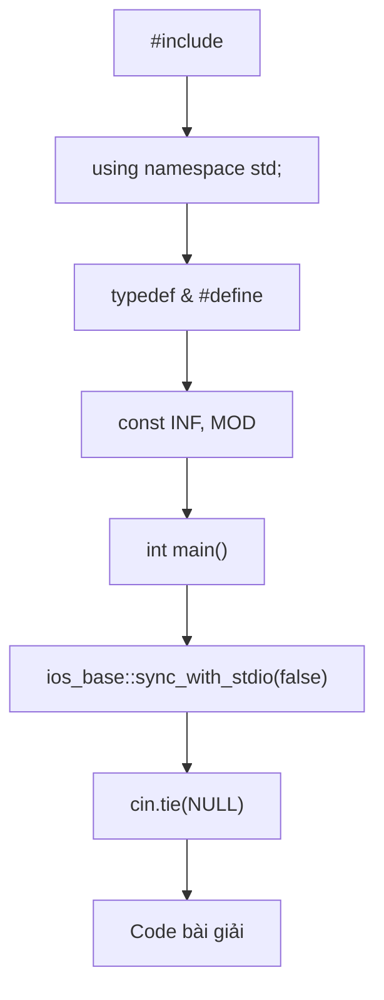
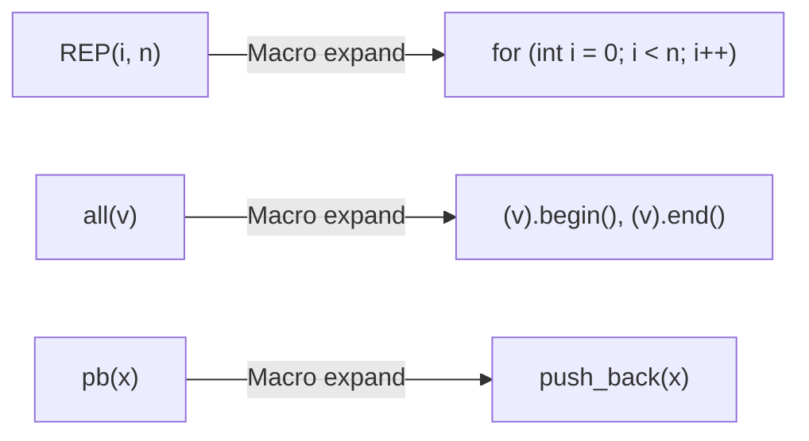

# C07: Template & Fast I/O

> **Tác giả:** FPTOJ Wiki<br>
> **Chủ đề:** Template thi đấu, typedef, macro, tối ưu nhập/xuất

---

## Bạn sẽ học được gì?

Sau bài này, bạn có thể:

- Viết template thi đấu chuyên nghiệp
- Dùng `typedef` và `#define` để code nhanh hơn
- Tối ưu tốc độ nhập/xuất

---

## 1. Template thi đấu



```cpp
#include <bits/stdc++.h>
using namespace std;

// ===== TEMPLATE =====
typedef long long ll;
typedef pair<int,int> pii;
typedef pair<ll,ll> pll;

#define FOR(i, a, b) for (int i = (a); i <= (b); i++)
#define REP(i, n) FOR(i, 0, (n) - 1)
#define all(v) (v).begin(), (v).end()
#define sz(v) (int)(v).size()
#define pb push_back
#define fi first
#define se second

const int INF = 2e9;
const ll LINF = 1e18;
const int MOD = 1e9 + 7;
// ===== END TEMPLATE =====

int main() {
    ios_base::sync_with_stdio(false);
    cin.tie(NULL);
    return 0;
}
```

---

## 2. typedef — Đặt tên kiểu ngắn

```cpp
typedef long long ll;
typedef pair<int,int> pii;
typedef vector<int> vi;
typedef vector<vector<int>> vvi;

// Bây giờ có thể viết ngắn hơn:
ll n = 1e18;           // Thay vì long long n = 1e18;
pii p = {1, 2};        // Thay vì pair<int,int> p = {1, 2};
vi a = {1, 2, 3};      // Thay vì vector<int> a = {1, 2, 3};
```

| typedef | Kiểu gốc | Ý nghĩa |
|---------|----------|---------|
| `ll` | `long long` | Số nguyên 64-bit |
| `pii` | `pair<int,int>` | Cặp số nguyên |
| `pll` | `pair<ll,ll>` | Cặp số nguyên lớn |
| `vi` | `vector<int>` | Mảng động số nguyên |
| `vvi` | `vector<vector<int>>` | Ma trận động |

---

## 3. Macro — Tự động thay thế



### Macro viết tắt

```cpp
#define FOR(i, a, b) for (int i = (a); i <= (b); i++)
#define REP(i, n) FOR(i, 0, (n) - 1)
#define all(v) (v).begin(), (v).end()
#define sz(v) (int)(v).size()
#define pb push_back
#define fi first
#define se second
```

### Sử dụng macro

```cpp
// Thay vì:
for (int i = 0; i < n; i++) { ... }

// Viết:
REP(i, n) { ... }

// Thay vì:
sort(a.begin(), a.end());

// Viết:
sort(all(a));

// Thay vì:
a.push_back(10);

// Viết:
a.pb(10);
```

---

## 4. Fast I/O — Tối ưu nhập/xuất

### Tại sao cần Fast I/O?

| Phương thức | Tốc độ | Dùng khi |
|-------------|--------|----------|
| `cin`/`cout` (bật sync) | Chậm | Debug |
| `cin`/`cout` (tắt sync) | **Nhanh** | Thi đấu |
| `scanf`/`printf` | **Nhanh** | Thi đấu |
| `getchar`/`putchar` | **Rất nhanh** | Cần tốc độ tối đa |

### Tắt sync (Luôn dùng trong thi đấu)

```cpp
ios_base::sync_with_stdio(false);
cin.tie(NULL);
// cout.tie(NULL);  // Không cần thiết — cout không tied đến input stream nào
```

!!! warning "Lưu ý khi tắt sync"
    - **Không** dùng chung `cin`/`cout` với `scanf`/`printf`
    - **Không** dùng `puts`/`gets` với `cout`/`cin`

### Fast Input với getchar

Đọc số nguyên nhanh — độ phức tạp $O(\log_{10} n)$ vì xử lý từng chữ số một (số $n$ có $\lfloor \log_{10} n \rfloor + 1$ chữ số).

```cpp
// Đọc số nguyên nhanh
int readInt() {
    int x = 0, sign = 1;
    char c = getchar();
    while (c < '0' || c > '9') {
        if (c == '-') sign = -1;
        c = getchar();
    }
    while (c >= '0' && c <= '9') {
        x = x * 10 + (c - '0');
        c = getchar();
    }
    return x * sign;
}
```

### Fast Output với putchar

In số nguyên nhanh — cùng độ phức tạp $O(\log_{10} n)$ vì in từng chữ số.

```cpp
// In số nguyên nhanh
void writeInt(long long x) {
    if (x < 0) { putchar('-'); x = -x; }
    if (x > 9) writeInt(x / 10);
    putchar(x % 10 + '0');
}
```

### So sánh Python

=== "Python"

    ```python
    import sys
    input = sys.stdin.readline  # Tương tự tắt sync trong C++
    
    n = int(input())
    arr = list(map(int, input().split()))
    ```

=== "C++"

    ```cpp
    #include <bits/stdc++.h>
    using namespace std;
    
    int main() {
        ios_base::sync_with_stdio(false);
        cin.tie(NULL);
        
        int n;
        cin >> n;
        vector<int> arr(n);
        for (int i = 0; i < n; i++) cin >> arr[i];
        return 0;
    }
    ```

---

## 5. Khi nào dùng gì?

| Tình huống | Nên dùng |
|------------|----------|
| Thi đấu bình thường | `cin`/`cout` + tắt sync |
| Input rất lớn ($>10^6$ số) | `scanf`/`printf` hoặc `getchar` |
| Output rất lớn | `printf` hoặc `putchar` |
| Debug | `cin`/`cout` (bật sync) |

---

## 6. Bài tập thực hành

### Bài 1: Template hoàn chỉnh
Viết chương trình đọc $n$ số nguyên và in tổng của chúng. Dùng template thi đấu.

<div class="cp-pg" data-language="cpp" data-starter="#include &lt;bits/stdc++.h&gt;\nusing namespace std;\n\ntypedef long long ll;\n\nint main() {\n    ios_base::sync_with_stdio(false);\n    cin.tie(NULL);\n    \n    // Viết code ở đây\n    \n    return 0;\n}" data-input="5
1 2 3 4 5" data-expected="15" data-hint="Đọc n, dùng vòng lặp cộng dồn vào sum (kiểu ll)"></div>

???? tip "Lời giải"
    ```cpp
    #include <bits/stdc++.h>
    using namespace std;
    
    typedef long long ll;
    
    int main() {
        ios_base::sync_with_stdio(false);
        cin.tie(NULL);
        
        int n;
        cin >> n;
        ll sum = 0;
        for (int i = 0; i < n; i++) {
            int x;
            cin >> x;
            sum += x;
        }
        cout << sum << endl;
        return 0;
    }
    ```

### Bài 2: Fast I/O vs Normal
So sánh tốc độ: đọc $10^6$ số nguyên bằng `cin` (có sync) và `cin` (tắt sync).

<div class="cp-pg" data-language="cpp" data-starter="#include &lt;bits/stdc++.h&gt;\nusing namespace std;\n\ntypedef long long ll;\n\nint main() {\n    ios_base::sync_with_stdio(false);\n    cin.tie(NULL);\n    \n    // Viết code ở đây\n    \n    return 0;\n}" data-input="5
1000000 2000000 3000000 4000000 5000000" data-expected="15000000" data-hint="Dùng ll cho sum, đọc n rồi cộng dồn"></div>

???? tip "Lời giải"
    ```cpp
    #include <bits/stdc++.h>
    using namespace std;
    
    typedef long long ll;
    
    int main() {
        ios_base::sync_with_stdio(false);
        cin.tie(NULL);
        
        int n;
        cin >> n;
        ll sum = 0;
        for (int i = 0; i < n; i++) {
            int x;
            cin >> x;
            sum += x;
        }
        cout << sum << endl;
        return 0;
    }
    ```

---

## Tóm tắt bài học

| Nội dung | Chi tiết |
|----------|----------|
| **Template** | `#include <bits/stdc++.h>` + tắt sync |
| **typedef** | `ll`, `pii`, `vi` — viết ngắn hơn |
| **Macro** | `REP`, `FOR`, `all`, `pb` — code nhanh |
| **Fast I/O** | `sync_with_stdio(false)` + `cin.tie(NULL)` |
| **Khi nào dùng** | Thi đấu: tắt sync. Debug: bật sync |

---

## Bài viết liên quan

- [C06: Hàm trong C++ ←](C06-ham.md)
- [C08: Reference & Pointer →](C08-reference-pointer.md)

---

**Bài trước:** [C06: Hàm trong C++](C06-ham.md)<br>
**Bài tiếp theo:** [C08: Reference & Pointer →](C08-reference-pointer.md)
