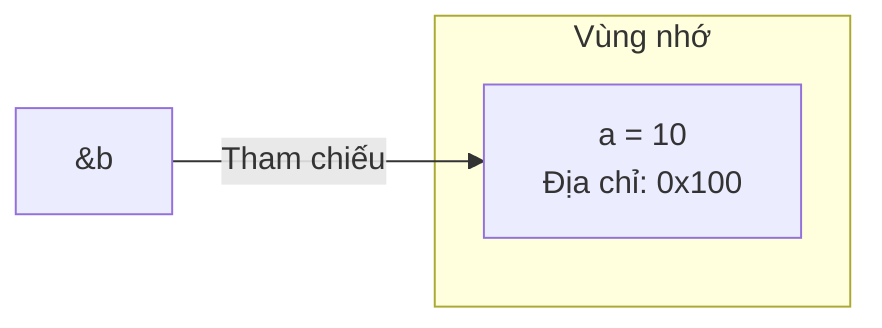
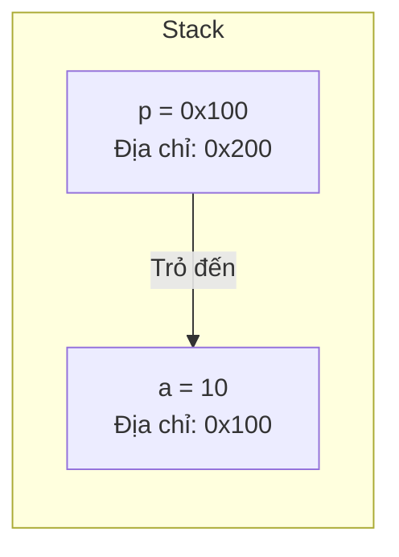
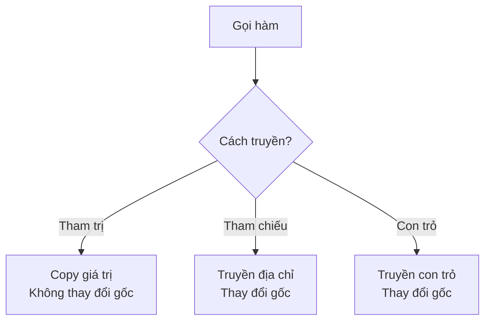

# C08: Reference & Pointer

> **Tác giả:** FPTOJ Wiki<br>
> **Chủ đề:** Tham chiếu, con trỏ, truyền tham số

---

## Bạn sẽ học được gì?

Sau bài này, bạn có thể:

- Hiểu Reference và Pointer trong C++
- Truyền tham trị, tham chiếu, con trỏ
- Trả về nhiều giá trị từ hàm

---

## 1. Reference — Tham chiếu

### Reference là gì?

Reference là **biệt danh** (alias) cho một biến khác. Chúng trỏ cùng một vùng nhớ.



```cpp
int a = 10;
int &b = a;  // b là biệt danh của a

b = 20;
cout << a << endl;  // 20 — a cũng thay đổi!
```

### Reference trong hàm

```cpp
void tang(int &x) {
    x++;  // Thay đổi trực tiếp biến gốc
}

int main() {
    int a = 5;
    tang(a);
    cout << a << endl;  // 6
    return 0;
}
```

### const Reference — Chỉ đọc

```cpp
void print(const string &s) {
    // s là reference nhưng không thể sửa
    cout << s << endl;
    // s += "!";  // Lỗi compile!
}
```

!!! tip "Luôn dùng `const &` cho object lớn"
    ```cpp
    // SAI: Sao chép toàn bộ vector (chậm) — $O(n)$
    void process(vector<int> a) { ... }
    
    // ĐÚNG: Truyền const reference (nhanh, không sao chép) — $O(1)$
    void process(const vector<int> &a) { ... }
    ```

---

## 2. Pointer — Con trỏ

### Con trỏ là gì?

Con trỏ là biến **lưu địa chỉ** của biến khác.



```cpp
int a = 10;
int *p = &a;  // p lưu địa chỉ của a

cout << p << endl;    // Địa chỉ của a (ví dụ: 0x7fff5fbff8ac)
cout << *p << endl;   // 10 — Giá trị tại địa chỉ đó
cout << &a << endl;   // Địa chỉ của a
```

| Toán tử | Ý nghĩa |
|---------|----------|
| `&a` | Lấy địa chỉ của `a` |
| `*p` | Lấy giá trị tại địa chỉ `p` (dereference) |

### Con trỏ NULL

```cpp
int *p = nullptr;   // Con trỏ không trỏ đến đâu (C++11, khuyến nghị)

if (p != nullptr) {
    cout << *p << endl;  // Không chạy vì p là nullptr
}
```

---

## 3. So sánh Reference vs Pointer

| | Reference | Pointer |
|---|-----------|---------|
| **Ký hiệu** | `int &r = a;` | `int *p = &a;` |
| **NULL** | Không được NULL | Có thể NULL |
| **Thay đổi** | Không thể đổi biến tham chiếu | Có thể đổi biến trỏ |
| **Syntax** | Dùng như biến thường | Cần `*` để dereference |
| **Khuyến nghị** | **Ưu tiên dùng** | Dùng khi cần |

---

## 4. Truyền tham số — 3 cách



### Truyền tham trị (Pass by Value)

```cpp
void func(int x) {
    x = 100;  // Chỉ thay đổi bản sao
}
// a không thay đổi — $O(1)$ copy
```

### Truyền tham chiếu (Pass by Reference)

```cpp
void func(int &x) {
    x = 100;  // Thay đổi biến gốc
}
// a bị thay đổi — $O(1)$ không copy
```

### Truyền con trỏ (Pass by Pointer)

```cpp
void func(int *x) {
    *x = 100;  // Thay đổi biến gốc qua con trỏ
}
// a bị thay đổi — $O(1)$ truyền địa chỉ
```

!!! tip "Chọn cách nào?"
    - **Tham trị:** Khi không cần thay đổi giá trị
    - **Tham chiếu:** **Ưu tiên** khi cần thay đổi giá trị
    - **Con trỏ:** Khi cần có thể NULL hoặc cần quản lý bộ nhớ

### So sánh Python

=== "Python"

    ```python
    # Python truyền "tham chiếu đối tượng" (object reference)
    def tang(x):
        x += 1  # Không thay đổi biến gốc (int là immutable)
    
    a = 5
    tang(a)
    print(a)  # 5 — không thay đổi!
    
    def them(lst, val):
        lst.append(val)  # Thay đổi biến gốc (list là mutable)
    
    arr = [1, 2, 3]
    them(arr, 4)
    print(arr)  # [1, 2, 3, 4] — thay đổi!
    ```

=== "C++"

    ```cpp
    // C++ truyền tham trị (copy)
    void tang(int x) {
        x++;  // Không thay đổi biến gốc
    }
    
    // C++ truyền tham chiếu
    void tangRef(int &x) {
        x++;  // Thay đổi biến gốc
    }
    
    int main() {
        int a = 5;
        tang(a);       // a vẫn = 5
        tangRef(a);    // a = 6
        cout << a << endl;  // 6
        return 0;
    }
    ```

---

## 5. Trả về nhiều giá trị

### Cách 1: Dùng reference

```cpp
void minMax(const vector<int> &a, int &mn, int &mx) {
    mn = *min_element(a.begin(), a.end());
    mx = *max_element(a.begin(), a.end());
}

int main() {
    vector<int> a = {3, 1, 4, 1, 5, 9};
    int mn, mx;
    minMax(a, mn, mx);
    cout << mn << " " << mx << endl;  // 1 9
    return 0;
}
```

### Cách 2: Dùng pair/tuple

```cpp
pair<int,int> minMax(const vector<int> &a) {
    return {*min_element(a.begin(), a.end()),
            *max_element(a.begin(), a.end())};
}

int main() {
    vector<int> a = {3, 1, 4, 1, 5, 9};
    auto [mn, mx] = minMax(a);  // C++17 structured bindings
    cout << mn << " " << mx << endl;  // 1 9
    return 0;
}
```

---

## 6. Bài tập thực hành

### Bài 1: Hoán đổi 2 số
Viết hàm `swap2` nhận 2 số nguyên và hoán đổi giá trị của chúng.

<div class="cp-pg" data-language="cpp" data-starter="#include &lt;bits/stdc++.h&gt;\nusing namespace std;\n\nint main() {\n    // Viết code ở đây\n    return 0;\n}" data-input="5 10" data-expected="10 5" data-hint="Viết hàm swap2(int &amp;a, int &amp;b), dùng biến temp"></div>

???? tip "Lời giải"
    ```cpp
    #include <bits/stdc++.h>
    using namespace std;
    
    void swap2(int &a, int &b) {
        int temp = a;
        a = b;
        b = temp;
    }
    
    int main() {
        int a, b;
        cin >> a >> b;
        swap2(a, b);
        cout << a << ' ' << b << endl;
        return 0;
    }
    ```

### Bài 2: Tìm min và max
Viết hàm `minMax` nhận mảng và trả về min, max qua tham chiếu.

<div class="cp-pg" data-language="cpp" data-starter="#include &lt;bits/stdc++.h&gt;\nusing namespace std;\n\nint main() {\n    // Viết code ở đây\n    return 0;\n}" data-input="5
3 1 4 1 5" data-expected="1 5" data-hint="Viết hàm minMax(const vector&lt;int&gt; &amp;a, int &amp;mn, int &amp;mx)"></div>

???? tip "Lời giải"
    ```cpp
    #include <bits/stdc++.h>
    using namespace std;
    
    void minMax(const vector<int> &a, int &mn, int &mx) {
        mn = a[0];
        mx = a[0];
        for (int x : a) {
            if (x < mn) mn = x;
            if (x > mx) mx = x;
        }
    }
    
    int main() {
        int n;
        cin >> n;
        vector<int> a(n);
        for (int i = 0; i < n; i++) cin >> a[i];
        int mn, mx;
        minMax(a, mn, mx);
        cout << mn << ' ' << mx << endl;
        return 0;
    }
    ```

### Bài 3: Pointer cơ bản
Đọc 2 số nguyên $a$, $b$. Dùng con trỏ để in giá trị lớn hơn.

<div class="cp-pg" data-language="cpp" data-starter="#include &lt;bits/stdc++.h&gt;\nusing namespace std;\n\nint main() {\n    // Viết code ở đây\n    return 0;\n}" data-input="7 3" data-expected="7" data-hint="Tạo int *p = (a &gt; b) ? &amp;a : &amp;b; rồi cout &lt;&lt; *p"></div>

???? tip "Lời giải"
    ```cpp
    #include <bits/stdc++.h>
    using namespace std;
    
    int main() {
        int a, b;
        cin >> a >> b;
        int *p = (a > b) ? &a : &b;
        cout << *p << endl;
        return 0;
    }
    ```

---

## Tóm tắt bài học

| Nội dung | Chi tiết |
|----------|----------|
| **Reference** | Biệt danh cho biến, `int &r = a;` |
| **Pointer** | Lưu địa chỉ, `int *p = &a;` |
| **Tham trị** | Copy giá trị, không thay đổi gốc |
| **Tham chiếu** | Truyền địa chỉ, thay đổi gốc |
| **Con trỏ** | Có thể NULL, cần `*` để dereference |

---

## Bài viết liên quan

- [C07: Template & Fast I/O ←](C07-template-fast-io.md)
- [C09: pair & tuple →](C09-pair-tuple.md)

---

**Bài trước:** [C07: Template & Fast I/O](C07-template-fast-io.md)<br>
**Bài tiếp theo:** [C09: pair & tuple →](C09-pair-tuple.md)
