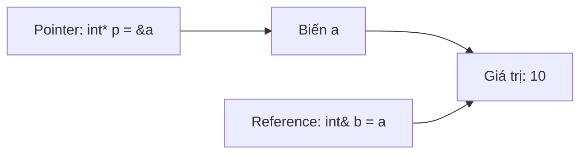

# C08: Reference & Pointer

> **Tác giả:** Hà Trí Kiên<br>
> **Chủ đề:** Tham chiếu, con trỏ, truyền tham số

---

## 1. Tổng quan

Reference và Pointer là hai cách **truy cập bộ nhớ** trong C++. Rất quan trọng để hiểu cách truyền tham số.



---

## 2. Reference (Tham chiếu)

### 2.1. Khai báo reference

```cpp
int a = 10;
int& b = a;  // b là reference của a

cout << a << endl;  // 10
cout << b << endl;  // 10

b = 20;
cout << a << endl;  // 20 — a cũng bị thay đổi!
```

!!! info "Reference"
    - Reference là **biệt danh** của biến khác
    - Không thể thay đổi tham chiếu sang biến khác
    - Không thể có reference NULL

### 2.2. Reference trong hàm

```cpp
void increment(int& x) {
    x++;  // Thay đổi biến gốc
}

int main() {
    int a = 5;
    increment(a);
    cout << a;  // 6
    return 0;
}
```

### 2.3. Const Reference

```cpp
void print(const int& x) {
    cout << x;  // Chỉ đọc, không sửa được
    // x++;  // Lỗi!
}

void printVector(const vector<int>& v) {
    for (int x : v) {
        cout << x << " ";
    }
}
```

!!! tip "Trong thi đấu"
    Luôn dùng `const &` khi truyền dữ liệu lớn (vector, string) mà chỉ cần đọc:
    ```cpp
    void solve(const vector<int>& arr) {
        // Chỉ đọc arr, không sửa
    }
    ```

---

## 3. Pointer (Con trỏ)

### 3.1. Khai báo pointer

```cpp
int a = 10;
int* p = &a;  // p lưu địa chỉ của a

cout << a << endl;   // 10 — Giá trị của a
cout << &a << endl;  // Địa chỉ của a
cout << p << endl;   // Địa chỉ của a
cout << *p << endl;  // 10 — Giá trị tại địa chỉ p
```

### 3.2. Toán tử & và *

```cpp
int a = 10;

// & — Lấy địa chỉ
int* p = &a;  // p = địa chỉ của a

// * — Lấy giá trị tại địa chỉ
cout << *p;   // 10
```

### 3.3. Sửa giá trị qua pointer

```cpp
int a = 10;
int* p = &a;

*p = 20;  // Sửa giá trị tại địa chỉ p
cout << a;  // 20
```

### 3.4. Pointer NULL

```cpp
int* p = nullptr;  // Pointer không trỏ đến đâu

if (p == nullptr) {
    cout << "p la NULL" << endl;
}

// Dereference NULL → crash!
// cout << *p;  // Undefined behavior!
```

---

## 4. So sánh Reference và Pointer

| | Reference | Pointer |
|---|-----------|---------|
| Khai báo | `int& b = a;` | `int* p = &a;` |
| Truy cập giá trị | `b` | `*p` |
| Có thể NULL | ❌ Không | ✅ Có |
| Có thể thay đổi target | ❌ Không | ✅ Có |
| Cần dereference | ❌ Không | ✅ Có (`*p`) |

---

## 5. Truyền tham số trong C++

### 5.1. Pass by Value

```cpp
void func(int x) {
    x = 20;  // Chỉ sửa bản copy
}

int main() {
    int a = 10;
    func(a);
    cout << a;  // 10 — Không bị thay đổi
    return 0;
}
```

### 5.2. Pass by Reference

```cpp
void func(int& x) {
    x = 20;  // Sửa biến gốc
}

int main() {
    int a = 10;
    func(a);
    cout << a;  // 20 — Bị thay đổi
    return 0;
}
```

### 5.3. Pass by Pointer

```cpp
void func(int* x) {
    *x = 20;  // Sửa biến gốc qua con trỏ
}

int main() {
    int a = 10;
    func(&a);
    cout << a;  // 20 — Bị thay đổi
    return 0;
}
```

### 5.4. Pass by Const Reference

```cpp
void func(const int& x) {
    // x = 20;  // Lỗi! Không sửa được
    cout << x;  // Chỉ đọc
}

int main() {
    int a = 10;
    func(a);   // OK
    func(10);  // OK — truyền hằng số cũng được
    return 0;
}
```

---

## 6. Ứng dụng trong thi đấu

### 6.1. Truyền vector lớn

```cpp
// SAI: Copy vector → chậm
void solve(vector<int> arr) {
    // ...
}

// ĐÚNG: Truyền const reference → nhanh
void solve(const vector<int>& arr) {
    // ...
}

// ĐÚNG: Truyền reference nếu cần sửa
void modify(vector<int>& arr) {
    arr.push_back(1);
}
```

### 6.2. Trả về nhiều giá trị

```cpp
// Cách 1: Dùng reference
void minMax(const vector<int>& arr, int& minVal, int& maxVal) {
    minVal = *min_element(arr.begin(), arr.end());
    maxVal = *max_element(arr.begin(), arr.end());
}

int main() {
    vector<int> arr = {3, 1, 4, 1, 5, 9};
    int minVal, maxVal;
    minMax(arr, minVal, maxVal);
    cout << minVal << " " << maxVal;  // 1 9
    return 0;
}

// Cách 2: Dùng pair
pair<int, int> minMax(const vector<int>& arr) {
    return {*min_element(arr.begin(), arr.end()),
            *max_element(arr.begin(), arr.end())};
}
```

### 6.3. Swap

```cpp
void swap(int& a, int& b) {
    int temp = a;
    a = b;
    b = temp;
}

// Hoặc dùng std::swap
swap(a, b);
```

---

## 7. So sánh với Python

| Python | C++ | Ghi chú |
|--------|-----|---------|
| Truyền giá trị | Pass by Value | Giống nhau |
| Không có reference | Pass by Reference | C++ có thêm |
| Không có pointer | Pass by Pointer | C++ có thêm |
| `a, b = b, a` | `swap(a, b)` | |

!!! info "Python truyền tham chiếu"
    Thực tế Python truyền **tham chiếu đến object**, nhưng khác với C++ reference:
    ```python
    def func(x):
        x = 20  # Tạo object mới, không sửa object cũ
    
    a = 10
    func(a)
    print(a)  # 10 — Không bị thay đổi
    ```

---

## 8. Lưu ý / Cạm bẫy hay gặp

### Bẫy 1: Dereference NULL

```cpp
int* p = nullptr;
// cout << *p;  // Crash!
```

### Bẫy 2: Reference không thể thay đổi target

```cpp
int a = 10, b = 20;
int& ref = a;
ref = b;  // Đây là gán giá trị! ref vẫn là a, a = 20
```

### Bẫy 3: Dangling reference/pointer

```cpp
int& func() {
    int x = 10;
    return x;  // SAI! x bị hủy khi hàm kết thúc
}
```

---

## 9. Bài tập thực hành

### Bài 1: Swap 2 biến
Viết hàm swap 2 biến dùng reference.

```cpp
// Code của bạn ở đây
```

??? tip "Lời giải"
    ```cpp
    #include <bits/stdc++.h>
    using namespace std;
    
    void swap(int& a, int& b) {
        int temp = a;
        a = b;
        b = temp;
    }
    
    int main() {
        int a = 5, b = 10;
        swap(a, b);
        cout << a << " " << b;  // 10 5
        return 0;
    }
    ```

---

## 10. Bài tập luyện tập

| Bài | Nền tảng | Độ khó | Chủ đề |
|-----|----------|--------|--------|
| [CSES - Weird Algorithm](https://cses.fi/problemset/task/1068) | CSES | ⭐ | Truyền tham số |

---

## Bài viết liên quan

- [← C07: Template & Fast I/O](C07-template-fast-io.md)
- [C09: pair & tuple →](C09-pair-tuple.md)

---

**Bài trước:** [C07: Template & Fast I/O](C07-template-fast-io.md)<br>
**Bài tiếp theo:** [C09: pair & tuple →](C09-pair-tuple.md)
