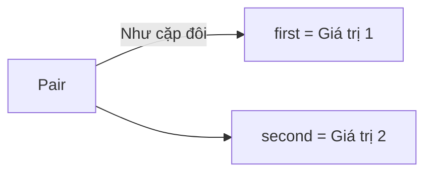
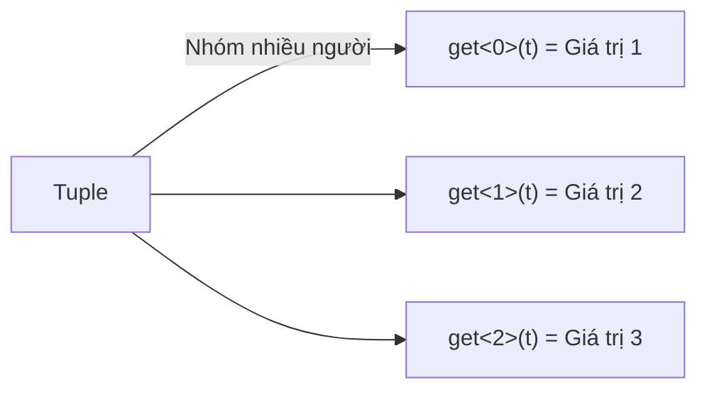

# C09: Pair & Tuple — Gom nhóm dữ liệu

> **Bạn sẽ học được:** pair, tuple, structured bindings — gom nhóm nhiều giá trị<br>
> **Yêu cầu:** Đã học C06 (Hàm)<br>
> **Thời gian:** 30 phút

---

## Pair — Gom 2 giá trị

### Analogies: Pair = Cặp đôi



### Khai báo và sử dụng

```cpp
// Khai báo pair
pair<int, int> p = {3, 5};

// Truy cập
cout << p.first << endl;   // 3
cout << p.second << endl;  // 5

// Sửa giá trị
p.first = 10;
p.second = 20;
```

### Pair trong thi đấu

```cpp
// Lưu tọa độ điểm
pair<int, int> diem = {3, 5};

// Lưu tên và điểm
pair<string, int> sv = {"Nam", 9};

// Lưu kết quả bài toán
pair<int, int> ketQua = {soLonNhat, soNhoNhat};
```

### So sánh pair

```cpp
pair<int, int> a = {1, 5};
pair<int, int> b = {1, 3};
pair<int, int> c = {2, 1};

// So sánh theo first trước, nếu bằng thì so sánh second
if (a < b) cout << "a < b";  // false (1==1, 5>3)
if (b < a) cout << "b < a";  // true
if (a < c) cout << "a < c";  // true (1<2)
```

!!! tip "Sắp xếp vector pair"
    ```cpp
    vector<pair<int, int>> v = {{3, 1}, {1, 5}, {2, 3}};
    
    // Sắp xếp theo first tăng dần
    sort(v.begin(), v.end());
    // Kết quả: {{1,5}, {2,3}, {3,1}}
    
    // Sắp xếp theo second tăng dần
    sort(v.begin(), v.end(), [](pair<int,int> a, pair<int,int> b) {
        return a.second < b.second;
    });
    // Kết quả: {{3,1}, {2,3}, {1,5}}
    ```

### make_pair — Tạo pair nhanh

```cpp
// Cách 1: Dùng {}
pair<int, int> p1 = {3, 5};

// Cách 2: Dùng make_pair
pair<int, int> p2 = make_pair(3, 5);

// Cả hai đều giống nhau
```

---

## Tuple — Gom nhiều giá trị

### Analogies: Tuple = Nhóm bạn



### Khai báo và sử dụng

```cpp
// Khai báo tuple 3 giá trị
tuple<int, string, double> t = {1, "Nam", 9.5};

// Truy cập (dùng get)
cout << get<0>(t) << endl;  // 1
cout << get<1>(t) << endl;  // "Nam"
cout << get<2>(t) << endl;  // 9.5

// Sửa giá trị
get<0>(t) = 2;
get<1>(t) = "An";
```

### Tuple trong thi đấu

```cpp
// Lưu cạnh đồ thị: (u, v, trọng số)
tuple<int, int, int> canh = {1, 2, 5};

// Lưu kết quả: (điểm, tên, tuổi)
tuple<int, string, int> ketQua = {9, "Nam", 15};
```

### Sắp xếp tuple

```cpp
vector<tuple<int, int, int>> edges = {{1, 2, 5}, {2, 3, 3}, {1, 3, 7}};

// Sắp xếp theo trọng số (phần tử thứ 3)
sort(edges.begin(), edges.end(), [](tuple<int,int,int> a, tuple<int,int,int> b) {
    return get<2>(a) < get<2>(b);
});
```

---

## Structured Bindings (C++17)

### Giải nhanh pair/tuple

```cpp
// Với pair
pair<int, int> p = {3, 5};

// Cách cũ
int a = p.first, b = p.second;

// Cách mới (C++17)
auto [a, b] = p;  // a = 3, b = 5
```

```cpp
// Với tuple
tuple<int, string, double> t = {1, "Nam", 9.5};

// Cách cũ
int id = get<0>(t);
string name = get<1>(t);
double score = get<2>(t);

// Cách mới (C++17)
auto [id, name, score] = t;
```

### Dùng trong vòng lặp

```cpp
vector<pair<int, int>> v = {{1, 5}, {2, 3}, {3, 1}};

// Cách cũ
for (auto &p : v) {
    cout << p.first << " " << p.second << endl;
}

// Cách mới (C++17)
for (auto &[x, y] : v) {
    cout << x << " " << y << endl;
}
```

---

## Common Mistakes — Lỗi thường gặp

### Lỗi 1: Quên first/second

```cpp
pair<int, int> p = {3, 5};

// ❌ SAI
cout << p[0] << endl;  // Không có []

// ✅ ĐÚNG
cout << p.first << endl;
```

### Lỗi 2: Tuple quá nhiều phần tử

```cpp
// ❌ Khó đọc: Tuple 5 phần tử
tuple<int, int, int, int, int> t = {1, 2, 3, 4, 5};

// ✅ Nên dùng struct
struct Data {
    int a, b, c, d, e;
};
```

---

## Bài tập thực hành

### Bài 1: Sắp xếp cặp số
Đọc n cặp số (a, b). Sắp xếp theo a tăng dần, nếu a bằng thì theo b giảm dần.

**Input:**
```
3
1 5
2 3
1 2
```
**Output:**
```
1 5
1 2
2 3
```

<div class="cp-pg" data-language="cpp" data-starter="#include &lt;bits/stdc++.h&gt;\nusing namespace std;\n\nint main() {\n    // Viết code ở đây\n    return 0;\n}" data-input="3
1 5
2 3
1 2" data-expected="1 5
1 2
2 3" data-hint="Sắp xếp theo first tăng dần, nếu first bằng thì second giảm dần"></div>

??? tip "Lời giải"
    ```cpp
    #include <bits/stdc++.h>
    using namespace std;
    
    int main() {
        int n;
        cin >> n;
        vector<pair<int, int>> v(n);
        for (int i = 0; i < n; i++) cin >> v[i].first >> v[i].second;
        
        sort(v.begin(), v.end(), [](pair<int,int> a, pair<int,int> b) {
            if (a.first != b.first) return a.first < b.first;
            return a.second > b.second;
        });
        
        for (auto &[x, y] : v) cout << x << " " << y << endl;
        return 0;
    }
    ```

---

## Tóm tắt bài học

| Nội dung | Chi tiết |
|----------|----------|
| **Pair** | `pair<int, int> p = {3, 5};` |
| **Truy cập** | `p.first`, `p.second` |
| **Tuple** | `tuple<int, string, double> t = {1, "Nam", 9.5};` |
| **Structured Bindings** | `auto [a, b] = p;` (C++17) |
| **So sánh** | So sánh first trước, nếu bằng thì second |

---

## Bài viết liên quan

- [C07: Template & Fast I/O ←](C07-template-fast-io.md)
- [C10: Vector nâng cao →](C10-vector-nang-cao.md)

---

**Bài trước:** [C07: Template & Fast I/O](C07-template-fast-io.md)<br>
**Bài tiếp theo:** [C10: Vector nâng cao →](C10-vector-nang-cao.md)
