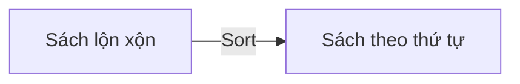

# C11: Sort & Algorithm — Sắp xếp và thuật toán

> **Bạn sẽ học được:** sort, reverse, unique, next_permutation — các thuật toán cơ bản<br>
> **Yêu cầu:** Đã học C09 (Pair & Tuple)<br>
> **Thời gian:** 45 phút

---

## Sort — Sắp xếp

### Analogies: Sort = Sắp xếp sách



### Sắp xếp mảng

```cpp
int a[] = {5, 2, 8, 1, 9, 3};
int n = 6;

// Sắp xếp tăng dần
sort(a, a + n);
// Kết quả: {1, 2, 3, 5, 8, 9}
```

### Sắp xếp vector

```cpp
vector<int> a = {5, 2, 8, 1, 9, 3};

// Sắp xếp tăng dần
sort(a.begin(), a.end());
// Kết quả: {1, 2, 3, 5, 8, 9}
```

### Sắp xếp giảm dần

```cpp
vector<int> a = {5, 2, 8, 1, 9, 3};

// Cách 1: Dùng greater<>
sort(a.begin(), a.end(), greater<int>());
// Kết quả: {9, 8, 5, 3, 2, 1}

// Cách 2: Dùng lambda
sort(a.begin(), a.end(), [](int x, int y) {
    return x > y;
});
```

### Sắp xếp với custom comparator

```cpp
// Sắp xếp theo tổng chữ số
int tongChuSo(int n) {
    int sum = 0;
    while (n > 0) {
        sum += n % 10;
        n /= 10;
    }
    return sum;
}

vector<int> a = {123, 45, 67, 89};
sort(a.begin(), a.end(), [](int x, int y) {
    return tongChuSo(x) < tongChuSo(y);
});
```

### Sắp xếp struct

```cpp
struct Student {
    string name;
    int score;
};

vector<Student> students = {{"Nam", 9}, {"An", 7}, {"Binh", 9}};

// Sắp xếp theo điểm giảm dần
sort(students.begin(), students.end(), [](const Student &a, const Student &b) {
    return a.score > b.score;
});
```

---

## Reverse — Đảo ngược

```cpp
vector<int> a = {1, 2, 3, 4, 5};

// Đảo ngược mảng
reverse(a.begin(), a.end());
// Kết quả: {5, 4, 3, 2, 1}
```

```cpp
string s = "Hello";

// Đảo ngược chuỗi
reverse(s.begin(), s.end());
// Kết quả: "olleH"
```

---

## Unique — Loại bỏ trùng liên tiếp

```cpp
vector<int> a = {1, 1, 2, 2, 3, 3, 4, 4};

// Loại bỏ trùng liên tiếp (PHẢI SẮP XẾP TRƯỚC!)
sort(a.begin(), a.end());
auto it = unique(a.begin(), a.end());
a.erase(it, a.end());
// Kết quả: {1, 2, 3, 4}
```

!!! warning "Phải sắp xếp trước"
    `unique` chỉ loại bỏ các phần tử **trùng liên tiếp**. Nếu không sắp xếp trước, nó sẽ không loại bỏ hết trùng.

---

## Next_permutation — Sinh hoán vị

```cpp
vector<int> a = {1, 2, 3};

// Sinh tất cả hoán vị
do {
    for (int x : a) cout << x << " ";
    cout << endl;
} while (next_permutation(a.begin(), a.end()));
```

Output:
```
1 2 3
1 3 2
2 1 3
2 3 1
3 1 2
3 2 1
```

!!! tip "Phải sắp xếp trước"
    Nếu muốn sinh **tất cả** hoán vị, phải sắp xếp mảng tăng dần trước.

---

## Binary Search — Tìm kiếm nhị phân

### lower_bound — Tìm vị trí đầu tiên >= x

```cpp
vector<int> a = {1, 2, 3, 3, 3, 4, 5};

auto it = lower_bound(a.begin(), a.end(), 3);
int pos = it - a.begin();
cout << pos << endl;  // 2 (vị trí đầu tiên >= 3)
```

### upper_bound — Tìm vị trí đầu tiên > x

```cpp
vector<int> a = {1, 2, 3, 3, 3, 4, 5};

auto it = upper_bound(a.begin(), a.end(), 3);
int pos = it - a.begin();
cout << pos << endl;  // 5 (vị trí đầu tiên > 3)
```

### Đếm số phần tử trong đoạn [l, r]

```cpp
vector<int> a = {1, 2, 3, 3, 3, 4, 5};

int l = 3, r = 4;
int count = upper_bound(a.begin(), a.end(), r) - lower_bound(a.begin(), a.end(), l);
cout << count << endl;  // 4 (3 phần tử 3 + 1 phần tử 4)
```

---

## Min/Max Element

```cpp
vector<int> a = {5, 2, 8, 1, 9, 3};

// Tìm phần tử nhỏ nhất
int minVal = *min_element(a.begin(), a.end());
cout << minVal << endl;  // 1

// Tìm phần tử lớn nhất
int maxVal = *max_element(a.begin(), a.end());
cout << maxVal << endl;  // 9

// Tìm vị trí phần tử nhỏ nhất
int minPos = min_element(a.begin(), a.end()) - a.begin();
cout << minPos << endl;  // 3
```

---

## Accumulate — Tổng mảng

```cpp
vector<int> a = {1, 2, 3, 4, 5};

// Tổng các phần tử
int sum = accumulate(a.begin(), a.end(), 0);
cout << sum << endl;  // 15
```

!!! warning "Phải dùng 0LL với long long"
    ```cpp
    vector<int> a = {1000000000, 1000000000, 1000000000};
    
    // ❌ SAI: Tràn int
    int sum = accumulate(a.begin(), a.end(), 0);
    
    // ✅ ĐÚNG
    long long sum = accumulate(a.begin(), a.end(), 0LL);
    ```

---

## Count — Đếm phần tử

```cpp
vector<int> a = {1, 2, 3, 2, 2, 4};

// Đếm số lần xuất hiện của 2
int cnt = count(a.begin(), a.end(), 2);
cout << cnt << endl;  // 3
```

---

## Find — Tìm phần tử

```cpp
vector<int> a = {1, 2, 3, 4, 5};

// Tìm phần tử 3
auto it = find(a.begin(), a.end(), 3);
if (it != a.end()) {
    cout << "Tim thay tai vi tri " << it - a.begin() << endl;
} else {
    cout << "Khong tim thay" << endl;
}
```

---

## Common Mistakes — Lỗi thường gặp

### Lỗi 1: Quên sắp xếp trước khi dùng unique

```cpp
vector<int> a = {3, 1, 2, 1, 3};

// ❌ SAI: Không sắp xếp trước
auto it1 = unique(a.begin(), a.end());
// Kết quả: {3, 1, 2, 3} — không loại hết trùng!

// ✅ ĐÚNG
sort(a.begin(), a.end());
auto it2 = unique(a.begin(), a.end());
a.erase(it2, a.end());
// Kết quả: {1, 2, 3}
```

### Lỗi 2: Quên dereference min/max_element

```cpp
vector<int> a = {5, 2, 8, 1, 9};

// ❌ SAI: min_element trả iterator, không phải int
int minVal = min_element(a.begin(), a.end());  // Lỗi compile: type mismatch

// ✅ ĐÚNG
int minVal = *min_element(a.begin(), a.end());
```

### Lỗi 3: Tràn số với accumulate

```cpp
vector<int> a = {1000000000, 1000000000};

// ❌ SAI
int sum = accumulate(a.begin(), a.end(), 0);  // Tràn!

// ✅ ĐÚNG
long long sum = accumulate(a.begin(), a.end(), 0LL);
```

---

## Bài tập thực hành

### Bài 1: Sắp xếp giảm dần
Đọc n số nguyên. Sắp xếp giảm dần và in ra.

**Input:** `5 3 1 4 1 5`<br>
**Output:** `5 4 3 1 1`

<div class="cp-pg" data-language="cpp" data-starter="#include &lt;bits/stdc++.h&gt;\nusing namespace std;\n\nint main() {\n    // Viết code ở đây\n    return 0;\n}" data-input="5 3 1 4 1 5" data-expected="5 4 3 1 1" data-hint="Dùng sort với greater&lt;int&gt;() để sắp xếp giảm dần"></div>

??? tip "Lời giải"
    ```cpp
    #include <bits/stdc++.h>
    using namespace std;
    
    int main() {
        int n;
        cin >> n;
        vector<int> a(n);
        for (int i = 0; i < n; i++) cin >> a[i];
        
        sort(a.begin(), a.end(), greater<int>());
        for (int x : a) cout << x << " ";
        return 0;
    }
    ```

### Bài 2: Đếm phần tử khác nhau
Đọc n số nguyên. Đếm số phần tử khác nhau.

**Input:** `5 1 2 3 2 1`<br>
**Output:** `3`

<div class="cp-pg" data-language="cpp" data-starter="#include &lt;bits/stdc++.h&gt;\nusing namespace std;\n\nint main() {\n    // Viết code ở đây\n    return 0;\n}" data-input="5 1 2 3 2 1" data-expected="3" data-hint="Sort trước, rồi dùng unique + erase để loại trùng"></div>

??? tip "Lời giải"
    ```cpp
    #include <bits/stdc++.h>
    using namespace std;
    
    int main() {
        int n;
        cin >> n;
        vector<int> a(n);
        for (int i = 0; i < n; i++) cin >> a[i];
        
        sort(a.begin(), a.end());
        a.erase(unique(a.begin(), a.end()), a.end());
        cout << a.size() << endl;
        return 0;
    }
    ```

---

## Tóm tắt bài học

| Nội dung | Chi tiết |
|----------|----------|
| **sort** | `sort(a.begin(), a.end())` — tăng dần |
| **reverse** | `reverse(a.begin(), a.end())` — đảo ngược |
| **unique** | Loại bỏ trùng liên tiếp (phải sort trước) |
| **next_permutation** | Sinh hoán vị tiếp theo |
| **lower_bound** | Tìm vị trí đầu tiên >= x |
| **upper_bound** | Tìm vị trí đầu tiên > x |
| **min/max_element** | Tìm phần tử nhỏ/lớn nhất |
| **accumulate** | Tổng mảng |

---

## Bài viết liên quan

- [C09: Pair & Tuple ←](C09-pair-tuple.md)
- [C13: Queue, Stack, Deque →](C13-queue-stack-deque.md)

---

**Bài tiếp theo:** [C13: Queue, Stack, Deque →](C13-queue-stack-deque.md)
