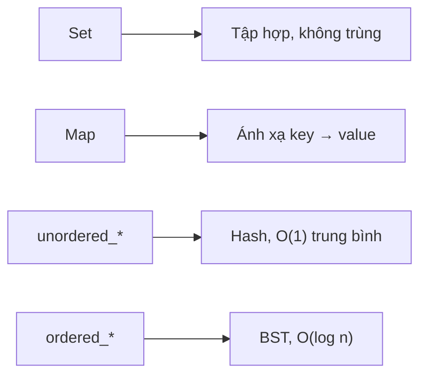

# C12: set & map

> **Tác giả:** Hà Trí Kiên<br>
> **Chủ đề:** set, multiset, map, unordered_set, unordered_map

---

## 1. Tổng quan

Set và Map là hai cấu trúc dữ liệu **rất quan trọng** trong thi đấu C++.



---

## 2. set — Tập hợp

### 2.1. Khai báo

```cpp
#include <set>

set<int> s;           // Set rỗng
set<int> s = {1, 2, 3, 4, 5};  // Khởi tạo sẵn
```

### 2.2. Các thao tác

```cpp
set<int> s = {1, 2, 3};

// Thêm — O(log n)
s.insert(4);       // {1, 2, 3, 4}
s.insert(2);       // {1, 2, 3, 4} — Không thêm trùng

// Xóa — O(log n)
s.erase(3);        // {1, 2, 4}
s.erase(s.begin()); // Xóa phần tử đầu

// Kiểm tra tồn tại — O(log n)
if (s.count(2)) { ... }   // count trả về 0 hoặc 1
if (s.find(2) != s.end()) { ... }

// Tìm kiếm — O(log n)
auto it = s.find(2);
if (it != s.end()) {
    cout << "Tim thay: " << *it << endl;
}

// Kích thước
cout << s.size() << endl;
cout << s.empty() << endl;
```

### 2.3. Duyệt

```cpp
set<int> s = {1, 2, 3, 4, 5};

// Duyệt tăng dần
for (int x : s) {
    cout << x << " ";
}

// Duyệt bằng iterator
for (auto it = s.begin(); it != s.end(); it++) {
    cout << *it << " ";
}

// Duyệt giảm dần
for (auto it = s.rbegin(); it != s.rend(); it++) {
    cout << *it << " ";
}
```

### 2.4. Tìm kiếm nâng cao

```cpp
set<int> s = {1, 3, 5, 7, 9};

// lower_bound: phần tử đầu tiên >= x
auto it = s.lower_bound(4);  // Trỏ đến 5
if (it != s.end()) cout << *it << endl;  // 5

// upper_bound: phần tử đầu tiên > x
auto it = s.upper_bound(5);  // Trỏ đến 7
if (it != s.end()) cout << *it << endl;  // 7
```

---

## 3. multiset — Cho phép trùng

```cpp
#include <set>

multiset<int> ms = {1, 2, 2, 3, 3, 3};

// Thêm
ms.insert(2);  // {1, 2, 2, 2, 3, 3, 3}

// Đếm — O(log n)
cout << ms.count(2) << endl;  // 3

// Xóa TẤT CẢ phần tử có giá trị 2
ms.erase(2);  // {1, 3, 3, 3}

// Xóa 1 phần tử có giá trị 2
ms.erase(ms.find(2));  // Xóa 1 cái
```

!!! tip "multiset trong thi đấu"
    multiset thường dùng để:
    - Lưu trữ và tìm kiếm phần tử có trùng lặp
    - Tìm min/max trong tập hợp thay đổi
    - Hàng đợi ưu tiên có thể xóa phần tử任意

---

## 4. map — Dictionary

### 4.1. Khai báo

```cpp
#include <map>

map<string, int> m;           // Map rỗng
map<string, int> m = {{"a", 1}, {"b", 2}};  // Khởi tạo sẵn
```

### 4.2. Các thao tác

```cpp
map<string, int> m;

// Thêm/Sửa — O(log n)
m["Alice"] = 90;
m["Bob"] = 85;
m["Alice"] = 95;  // Sửa

// Truy cập — O(log n)
cout << m["Alice"] << endl;  // 95

// Kiểm tra tồn tại — O(log n)
if (m.count("Alice")) { ... }
if (m.find("Alice") != m.end()) { ... }

// Xóa — O(log n)
m.erase("Bob");

// Kích thước
cout << m.size() << endl;
```

!!! warning "map tự tạo key mới"
    ```cpp
    map<string, int> m;
    cout << m["Alice"];  // Tự tạo key "Alice" với giá trị 0!
    
    // Dùng find/count để kiểm tra trước
    if (m.find("Alice") != m.end()) {
        cout << m["Alice"];
    }
    ```

### 4.3. Duyệt

```cpp
map<string, int> m = {{"Alice", 90}, {"Bob", 85}, {"Charlie", 95}};

// Duyệt theo key
for (auto& [name, score] : m) {
    cout << name << ": " << score << endl;
}

// Duyệt bằng iterator
for (auto it = m.begin(); it != m.end(); it++) {
    cout << it->first << ": " << it->second << endl;
}
```

---

## 5. unordered_set & unordered_map — Hash

```cpp
#include <unordered_set>
#include <unordered_map>

unordered_set<int> us = {1, 2, 3};
unordered_map<string, int> um = {{"Alice", 90}, {"Bob", 85}};

// Các thao tác giống set/map
us.insert(4);
us.erase(1);
us.count(2);

um["Charlie"] = 95;
um.erase("Alice");
um.count("Bob");
```

### So sánh ordered và unordered

| | ordered (set/map) | unordered (set/map) |
|---|-------------------|---------------------|
| Cấu trúc | BST (Red-Black Tree) | Hash Table |
| Độ phức tạp | O(log n) | O(1) trung bình |
| Thứ tự | Có thứ tự | Không có thứ tự |
| Key | Có thể so sánh | Cần hash function |

!!! tip "Trong thi đấu"
    - Dùng `set/map` khi cần **thứ tự** hoặc **lower_bound/upper_bound**
    - Dùng `unordered_set/unordered_map` khi cần **tốc độ** và không cần thứ tự

---

## 6. So sánh với Python

| Python | C++ | Ghi chú |
|--------|-----|---------|
| `set()` | `unordered_set<int>` | |
| `{1, 2, 3}` | `set<int>{1, 2, 3}` | |
| `dict()` | `unordered_map<string, int>` | |
| `{"a": 1}` | `map<string, int>{{"a", 1}}` | |
| `s.add(x)` | `us.insert(x)` | |
| `s.remove(x)` | `us.erase(x)` | |
| `x in s` | `us.count(x)` | |
| `d["key"]` | `um["key"]` | |
| `d.get("key", 0)` | Phải kiểm tra trước | |

---

## 7. Pattern thường gặp trong thi đấu

### 7.1. Đếm tần suất

```cpp
map<int, int> freq;
for (int x : arr) {
    freq[x]++;
}
```

### 7.2. Kiểm tra trùng lặp

```cpp
unordered_set<int> seen;
for (int x : arr) {
    if (seen.count(x)) {
        cout << "Trung: " << x << endl;
        break;
    }
    seen.insert(x);
}
```

### 7.3. Two Sum

```cpp
unordered_map<int, int> seen;
for (int i = 0; i < n; i++) {
    int complement = target - arr[i];
    if (seen.count(complement)) {
        cout << seen[complement] << " " << i << endl;
        break;
    }
    seen[arr[i]] = i;
}
```

---

## 8. Lưu ý / Cạm bẫy hay gặp

### Bẫy 1: map tự tạo key mới

```cpp
map<string, int> m;
// m["Alice"] sẽ tạo key "Alice" với giá trị 0!
```

### Bẫy 2: unordered_* cần hash function

```cpp
// set<pair<int, int>> s;  // OK — pair có operator<
// unordered_set<pair<int, int>> s;  // Lỗi! pair không có hash

// Phải tự cài hash function
struct PairHash {
    size_t operator()(const pair<int, int>& p) const {
        return hash<int>()(p.first) ^ hash<int>()(p.second);
    }
};
unordered_set<pair<int, int>, PairHash> s;
```

### Bẫy 3: Iterator invalidated khi erase

```cpp
set<int> s = {1, 2, 3, 4, 5};
for (auto it = s.begin(); it != s.end(); ) {
    if (*it % 2 == 0) {
        it = s.erase(it);  // erase trả về iterator tiếp theo
    } else {
        it++;
    }
}
```

---

## 9. Bài tập thực hành

### Bài 1: Đếm tần suất
Cho mảng arr. Đếm tần suất xuất hiện của mỗi phần tử.

```cpp
// Code của bạn ở đây
```

??? tip "Lời giải"
    ```cpp
    #include <bits/stdc++.h>
    using namespace std;
    
    int main() {
        int n;
        cin >> n;
        map<int, int> freq;
        for (int i = 0; i < n; i++) {
            int x;
            cin >> x;
            freq[x]++;
        }
        for (auto& [key, val] : freq) {
            cout << key << ": " << val << "\n";
        }
        return 0;
    }
    ```

---

## 10. Bài tập luyện tập

### Bài 2: Tìm phần tử xuất hiện nhiều nhất
Cho mảng arr gồm n số nguyên. Tìm phần tử xuất hiện nhiều nhất.

```
Input:
6
1 2 2 3 3 3

Output:
3
```

```
Input:
5
1 1 2 2 3

Output:
1
```

```cpp
// Code của bạn ở đây
```

??? tip "Lời giải"
    ```cpp
    #include <bits/stdc++.h>
    using namespace std;
    
    int main() {
        int n;
        cin >> n;
        map<int, int> freq;
        for (int i = 0; i < n; i++) {
            int x;
            cin >> x;
            freq[x]++;
        }
        
        int maxVal = 0, maxCount = 0;
        for (auto& [key, val] : freq) {
            if (val > maxCount) {
                maxCount = val;
                maxVal = key;
            }
        }
        cout << maxVal << endl;
        return 0;
    }
    ```

### Bài 3: Kiểm tra trùng lặp
Cho mảng arr gồm n số nguyên. Kiểm tra có phần tử trùng không.

```
Input:
5
1 2 3 4 5

Output:
Khong co phan tu trung
```

```
Input:
5
1 2 3 2 1

Output:
Co phan tu trung
```

```cpp
// Code của bạn ở đây
```

??? tip "Lời giải"
    ```cpp
    #include <bits/stdc++.h>
    using namespace std;
    
    int main() {
        int n;
        cin >> n;
        set<int> seen;
        bool found = false;
        for (int i = 0; i < n; i++) {
            int x;
            cin >> x;
            if (seen.count(x)) {
                found = true;
                break;
            }
            seen.insert(x);
        }
        if (found) {
            cout << "Co phan tu trung" << endl;
        } else {
            cout << "Khong co phan tu trung" << endl;
        }
        return 0;
    }
    ```

### Bài 4: Two Sum
Cho mảng arr gồm n số nguyên và target. Tìm 2 số có tổng bằng target.

```
Input:
5
2 7 11 15 1
9

Output:
0 1
```

```
Input:
4
1 2 3 4
5

Output:
0 3
```

```cpp
// Code của bạn ở đây
```

??? tip "Lời giải"
    ```cpp
    #include <bits/stdc++.h>
    using namespace std;
    
    int main() {
        int n, target;
        cin >> n;
        vector<int> arr(n);
        for (int i = 0; i < n; i++) cin >> arr[i];
        cin >> target;
        
        unordered_map<int, int> seen;
        for (int i = 0; i < n; i++) {
            int complement = target - arr[i];
            if (seen.count(complement)) {
                cout << seen[complement] << " " << i << endl;
                break;
            }
            seen[arr[i]] = i;
        }
        return 0;
    }
    ```

### Bài 5: Đếm số phần tử khác nhau
Cho mảng arr gồm n số nguyên. Đếm số phần tử khác nhau.

```
Input:
6
1 2 2 3 3 3

Output:
3
```

```
Input:
5
1 1 1 1 1

Output:
1
```

```cpp
// Code của bạn ở đây
```

??? tip "Lời giải"
    ```cpp
    #include <bits/stdc++.h>
    using namespace std;
    
    int main() {
        int n;
        cin >> n;
        set<int> s;
        for (int i = 0; i < n; i++) {
            int x;
            cin >> x;
            s.insert(x);
        }
        cout << s.size() << endl;
        return 0;
    }
    ```

---

## Bài viết liên quan

- [← C11: sort & algorithm](C11-sort-algorithm.md)
- [C13: queue, stack, deque →](C13-queue-stack-deque.md)

---

**Bài trước:** [C11: sort & algorithm](C11-sort-algorithm.md)<br>
**Bài tiếp theo:** [C13: queue, stack, deque →](C13-queue-stack-deque.md)
