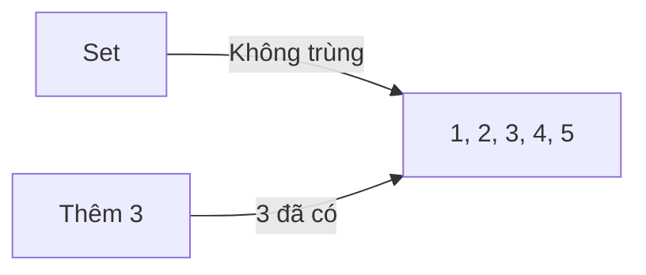
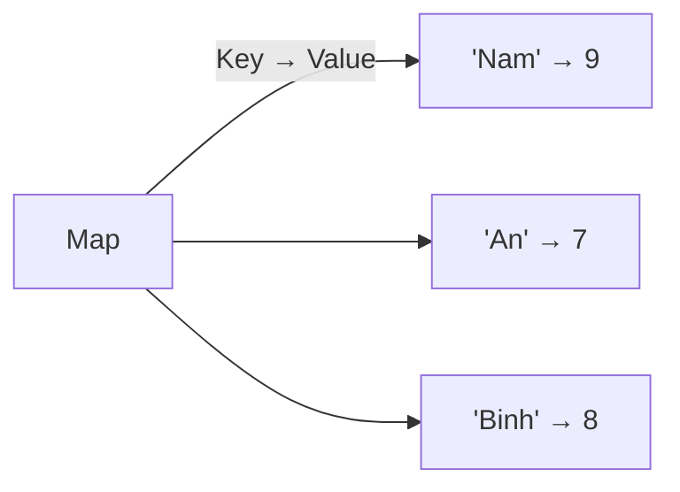

# C12: Set & Map — Tập hợp và Bản đồ

> **Bạn sẽ học được:** set, multiset, map, unordered_set, unordered_map<br>
> **Yêu cầu:** Đã học C10 (Vector nâng cao)<br>
> **Thời gian:** 60 phút

---

## Set — Tập hợp

### Analogies: Set = Túi không trùng



### Sử dụng Set

```cpp
set<int> s;

// Thêm phần tử
s.insert(1);
s.insert(2);
s.insert(3);
s.insert(2);  // Không thêm vì 2 đã có

// Kiểm tra phần tử
if (s.count(2)) cout << "2 co trong set";
if (s.find(2) != s.end()) cout << "2 co trong set";

// Xóa phần tử
s.erase(2);

// Kích thước
cout << s.size() << endl;

// Kiểm tra rỗng
if (s.empty()) cout << "Rong";
```

### Duyệt Set

```cpp
set<int> s = {5, 2, 8, 1, 9, 3};

// Duyệt (tự động sắp xếp tăng dần)
for (int x : s) {
    cout << x << " ";
}
// Output: 1 2 3 5 8 9
```

### Set trong thi đấu

```cpp
// Loại bỏ trùng trong mảng
vector<int> a = {1, 2, 3, 2, 1, 4, 5, 4};
set<int> s(a.begin(), a.end());
// s = {1, 2, 3, 4, 5}

// Kiểm tra phần tử tồn tại
if (s.count(3)) cout << "3 ton tai";
```

---

## Multiset — Tập hợp có trùng

### Analogies: Multiset = Túi có thể trùng

```cpp
multiset<int> ms;

// Thêm phần tử (có thể trùng)
ms.insert(1);
ms.insert(2);
ms.insert(2);
ms.insert(3);
// ms = {1, 2, 2, 3}

// Đếm số lần xuất hiện
cout << ms.count(2) << endl;  // 2

// Xóa tất cả phần tử có giá trị 2
ms.erase(2);
// ms = {1, 3}

// Xóa chỉ 1 phần tử có giá trị 2 (cẩn thận: UB nếu phần tử không tồn tại!)
auto it = ms.find(2);
if (it != ms.end()) ms.erase(it);
```

### Multiset trong thi đấu

```cpp
// Tìm K phần tử nhỏ nhất
multiset<int> ms = {5, 2, 8, 1, 9, 3};

int k = 3;
int count = 0;
for (int x : ms) {
    cout << x << " ";
    count++;
    if (count == k) break;
}
// Output: 1 2 3
```

---

## Map — Bản đồ

### Analogies: Map = Từ điển



### Sử dụng Map

```cpp
map<string, int> m;

// Thêm phần tử
m["Nam"] = 9;
m["An"] = 7;
m["Binh"] = 8;

// Truy cập
cout << m["Nam"] << endl;  // 9

// Kiểm tra key tồn tại
if (m.count("Nam")) cout << "Nam ton tai";
if (m.find("Nam") != m.end()) cout << "Nam ton tai";

// Xóa phần tử
m.erase("Nam");

// Kích thước
cout << m.size() << endl;
```

### Duyệt Map

```cpp
map<string, int> m = {{"Nam", 9}, {"An", 7}, {"Binh", 8}};

// Duyệt (tự động sắp xếp theo key)
for (auto &[key, value] : m) {
    cout << key << ": " << value << endl;
}
// Output:
// An: 7
// Binh: 8
// Nam: 9
```

### Map trong thi đấu

```cpp
// Đếm tần suất xuất hiện
vector<int> a = {1, 2, 3, 2, 1, 4, 5, 4};
map<int, int> freq;

for (int x : a) {
    freq[x]++;
}

for (auto &[key, value] : freq) {
    cout << key << " xuat hien " << value << " lan" << endl;
}
```

---

## Unordered Set/Map — Không sắp xếp

### So sánh

| Cấu trúc | Sắp xếp | Thời gian | Dùng khi |
|----------|---------|-----------|----------|
| **set** | Có | O(log n) | Cần duyệt theo thứ tự |
| **unordered_set** | Không | O(1) trung bình | Chỉ cần kiểm tra tồn tại |
| **map** | Có | O(log n) | Cần duyệt theo key |
| **unordered_map** | Không | O(1) trung bình | Chỉ cần truy cập nhanh |

### Sử dụng Unordered

```cpp
unordered_set<int> us;
us.insert(1);
us.insert(2);
us.insert(3);

if (us.count(2)) cout << "2 ton tai";

unordered_map<string, int> um;
um["Nam"] = 9;
um["An"] = 7;

cout << um["Nam"] << endl;
```

!!! tip "Khi nào dùng unordered?"
    - Dùng `unordered_*` khi **không cần sắp xếp** và cần **tốc độ nhanh**
    - Dùng `set/map` khi **cần duyệt theo thứ tự**

---

## Common Mistakes — Lỗi thường gặp

### Lỗi 1: Map tự tạo key mới

```cpp
map<string, int> m;

// ❌ SAI: Tự tạo key "Nam" với giá trị 0
cout << m["Nam"] << endl;  // 0 (tự tạo!)

// ✅ ĐÚNG: Kiểm tra trước
if (m.count("Nam")) cout << m["Nam"];
```

### Lỗi 2: Xóa trong vòng lặp

```cpp
set<int> s = {1, 2, 3, 4, 5};

// ❌ SAI: Iterator invalidated
for (auto it = s.begin(); it != s.end(); it++) {
    if (*it % 2 == 0) s.erase(it);  // Lỗi!
}

// ✅ ĐÚNG
for (auto it = s.begin(); it != s.end(); ) {
    if (*it % 2 == 0) it = s.erase(it);
    else it++;
}
```

---

## Bài tập thực hành

### Bài 1: Đếm tần suất
Đọc $n$ số nguyên. Đếm số lần xuất hiện của mỗi số.

<div class="cp-pg" data-language="cpp" data-starter="#include &lt;bits/stdc++.h&gt;\nusing namespace std;\n\nint main() {\n    // Viết code ở đây\n    return 0;\n}" data-input="5
1 2 3 2 1" data-expected="1: 2
2: 2
3: 1" data-hint="Dùng map&lt;int,int&gt;, mỗi lần đọc x thì freq[x]++"></div>

???? tip "Lời giải"
    ```cpp
    #include <bits/stdc++.h>
    using namespace std;
    
    int main() {
        int n;
        cin >> n;
        map<int, int> freq;
        for (int i = 0; i < n; i++) {
            int x;
            cin >> x;
            freq[x]++;
        }
        for (auto &[key, value] : freq) {
            cout << key << ": " << value << endl;
        }
        return 0;
    }
    ```

### Bài 2: Tìm phần tử xuất hiện 1 lần
Đọc $n$ số nguyên. Tìm phần tử xuất hiện đúng 1 lần.

<div class="cp-pg" data-language="cpp" data-starter="#include &lt;bits/stdc++.h&gt;\nusing namespace std;\n\nint main() {\n    // Viết code ở đây\n    return 0;\n}" data-input="5
1 2 3 2 1" data-expected="3" data-hint="Dùng map đếm tần suất, duyệt map in phần tử có value == 1"></div>

???? tip "Lời giải"
    ```cpp
    #include <bits/stdc++.h>
    using namespace std;
    
    int main() {
        int n;
        cin >> n;
        map<int, int> freq;
        for (int i = 0; i < n; i++) {
            int x;
            cin >> x;
            freq[x]++;
        }
        for (auto &[key, value] : freq) {
            if (value == 1) cout << key << endl;
        }
        return 0;
    }
    ```

---

## Tóm tắt bài học

| Nội dung | Chi tiết |
|----------|----------|
| **Set** | Tập hợp không trùng, tự sắp xếp |
| **Multiset** | Tập hợp có trùng |
| **Map** | Bản đồ key → value |
| **Unordered** | Không sắp xếp, nhanh hơn |

---

## Bài viết liên quan

- [C10: Vector nâng cao ←](C10-vector-nang-cao.md)
- [C14: Algorithm nâng cao →](C14-algorithm-nang-cao.md)

---

**Bài tiếp theo:** [C14: Algorithm nâng cao →](C14-algorithm-nang-cao.md)
