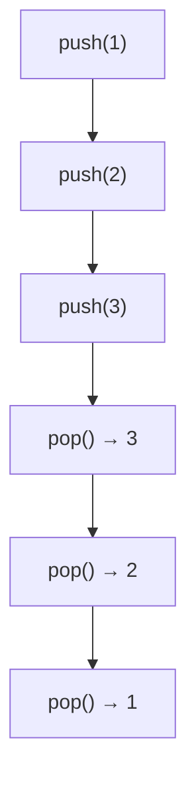
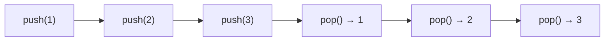
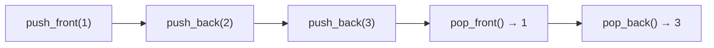
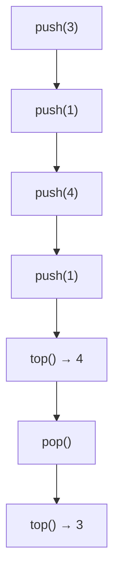

# C13: Queue, Stack, Deque — Hàng đợi, Ngăn xếp

> **Bạn sẽ học được:** queue, stack, deque, priority_queue — các cấu trúc dữ liệu cơ bản<br>
> **Yêu cầu:** Đã học C11 (Sort & Algorithm)<br>
> **Thời gian:** 45 phút

---

## Stack — Ngăn xếp

### Analogies: Stack = Chồng đĩa



| Khái niệm | Analogies | Ví dụ |
|-----------|-----------|-------|
| **Stack** | Chồng đĩa | `stack<int> st` |
| **push** | Đặt đĩa lên | `st.push(5)` |
| **pop** | Lấy đĩa trên cùng | `st.pop()` |
| **top** | Xem đĩa trên cùng | `st.top()` |

### Sử dụng Stack

```cpp
stack<int> st;

// Thêm phần tử
st.push(1);
st.push(2);
st.push(3);

// Xem phần tử trên cùng
cout << st.top() << endl;  // 3

// Xóa phần tử trên cùng
st.pop();

// Kiểm tra rỗng
if (st.empty()) cout << "Rong";

// Kích thước
cout << st.size() << endl;
```

### Ứng dụng: Kiểm tra ngoặc đúng

```cpp
bool isValid(string s) {
    stack<char> st;
    for (char c : s) {
        if (c == '(' || c == '[' || c == '{') {
            st.push(c);
        } else {
            if (st.empty()) return false;
            char top = st.top();
            st.pop();
            if (c == ')' && top != '(') return false;
            if (c == ']' && top != '[') return false;
            if (c == '}' && top != '{') return false;
        }
    }
    return st.empty();
}
```

---

## Queue — Hàng đợi

### Analogies: Queue = Hàng người xếp hàng



| Khái niệm | Analogies | Ví dụ |
|-----------|-----------|-------|
| **Queue** | Hàng người xếp hàng | `queue<int> q` |
| **push** | Người vào cuối hàng | `q.push(5)` |
| **pop** | Người đầu hàng ra | `q.pop()` |
| **front** | Xem người đầu hàng | `q.front()` |

### Sử dụng Queue

```cpp
queue<int> q;

// Thêm phần tử
q.push(1);
q.push(2);
q.push(3);

// Xem phần tử đầu
cout << q.front() << endl;  // 1

// Xóa phần tử đầu
q.pop();

// Kiểm tra rỗng
if (q.empty()) cout << "Rong";

// Kích thước
cout << q.size() << endl;
```

### Ứng dụng: BFS (Breadth-First Search)

```cpp
// BFS trên đồ thị
vector<int> adj[100];
bool visited[100];

void bfs(int start) {
    queue<int> q;
    q.push(start);
    visited[start] = true;
    
    while (!q.empty()) {
        int u = q.front();
        q.pop();
        cout << u << " ";
        
        for (int v : adj[u]) {
            if (!visited[v]) {
                visited[v] = true;
                q.push(v);
            }
        }
    }
}
```

---

## Deque — Hàng đợi hai đầu

### Analogies: Deque = Hàng người có thể ra/vào 2 đầu



### Sử dụng Deque

```cpp
deque<int> dq;

// Thêm vào cuối
dq.push_back(1);
dq.push_back(2);

// Thêm vào đầu
dq.push_front(0);

// Xem đầu và cuối
cout << dq.front() << endl;  // 0
cout << dq.back() << endl;   // 2

// Xóa đầu
dq.pop_front();

// Xóa cuối
dq.pop_back();

// Truy cập theo chỉ số
cout << dq[0] << endl;
```

### Ứng dụng: Sliding Window Maximum

```cpp
vector<int> maxSlidingWindow(vector<int>& nums, int k) {
    deque<int> dq;
    vector<int> result;
    
    for (int i = 0; i < nums.size(); i++) {
        // Loại bỏ phần tử ngoài cửa sổ
        while (!dq.empty() && dq.front() < i - k + 1) {
            dq.pop_front();
        }
        
        // Loại bỏ phần tử nhỏ hơn nums[i]
        while (!dq.empty() && nums[dq.back()] < nums[i]) {
            dq.pop_back();
        }
        
        dq.push_back(i);
        
        if (i >= k - 1) {
            result.push_back(nums[dq.front()]);
        }
    }
    return result;
}
```

---

## Priority Queue — Hàng đợi ưu tiên

### Analogies: Priority Queue = Bệnh viện (ai nặng nhất được ưu tiên)



### Sử dụng Priority Queue

```cpp
// Max-heap (mặc định)
priority_queue<int> pq;

pq.push(3);
pq.push(1);
pq.push(4);
pq.push(1);

cout << pq.top() << endl;  // 4 (phần tử lớn nhất)
pq.pop();
cout << pq.top() << endl;  // 3
```

### Min-heap

```cpp
// Min-heap
priority_queue<int, vector<int>, greater<int>> pq;

pq.push(3);
pq.push(1);
pq.push(4);
pq.push(1);

cout << pq.top() << endl;  // 1 (phần tử nhỏ nhất)
```

### Ứng dụng: Tìm K phần tử lớn nhất

```cpp
vector<int> topK(vector<int>& nums, int k) {
    priority_queue<int, vector<int>, greater<int>> pq;
    
    for (int x : nums) {
        pq.push(x);
        if (pq.size() > k) {
            pq.pop();
        }
    }
    
    vector<int> result;
    while (!pq.empty()) {
        result.push_back(pq.top());
        pq.pop();
    }
    return result;
}
```

---

## So sánh các cấu trúc dữ liệu

| Cấu trúc | Thêm | Xóa | Xem | Ứng dụng |
|----------|------|-----|-----|----------|
| **Stack** | O(1) | O(1) | O(1) | Đệ quy, backtrack, DFS |
| **Queue** | O(1) | O(1) | O(1) | BFS, hàng đợi |
| **Deque** | O(1) | O(1) | O(1) | Sliding window |
| **Priority Queue** | O(log n) | O(log n) | O(1) | Top-K, Dijkstra |

---

## Common Mistakes — Lỗi thường gặp

### Lỗi 1: Quên kiểm tra rỗng

```cpp
stack<int> st;

// ❌ SAI: Không kiểm tra rỗng
cout << st.top() << endl;  // Lỗi runtime!

// ✅ ĐÚNG
if (!st.empty()) cout << st.top() << endl;
```

### Lỗi 2: Nhầm stack và queue

```cpp
// Stack: LIFO (vào sau ra trước)
stack<int> st;
st.push(1); st.push(2); st.push(3);
cout << st.top() << endl;  // 3

// Queue: FIFO (vào trước ra trước)
queue<int> q;
q.push(1); q.push(2); q.push(3);
cout << q.front() << endl;  // 1
```

### Lỗi 3: Nhầm max-heap và min-heap

```cpp
// Max-heap (mặc định)
priority_queue<int> maxPQ;
maxPQ.push(1); maxPQ.push(3); maxPQ.push(2);
cout << maxPQ.top() << endl;  // 3

// Min-heap
priority_queue<int, vector<int>, greater<int>> minPQ;
minPQ.push(1); minPQ.push(3); minPQ.push(2);
cout << minPQ.top() << endl;  // 1
```

---

## Bài tập thực hành

### Bài 1: Kiểm tra palindrome bằng stack
Đọc chuỗi s. Kiểm tra s có phải palindrome không (dùng stack).

<div class="cp-pg" data-language="cpp" data-starter="#include &lt;bits/stdc++.h&gt;\nusing namespace std;\n\nint main() {\n    // Viết code ở đây\n    return 0;\n}" data-input="abcba" data-expected="YES" data-hint="Đẩy từng ký tự vào stack, rồi pop ra để tạo chuỗi đảo"></div>

??? tip "Lời giải"
    ```cpp
    #include <bits/stdc++.h>
    using namespace std;
    
    int main() {
        string s;
        cin >> s;
        
        stack<char> st;
        for (char c : s) st.push(c);
        
        string rev = "";
        while (!st.empty()) {
            rev += st.top();
            st.pop();
        }
        
        if (s == rev) cout << "YES";
        else cout << "NO";
        return 0;
    }
    ```

### Bài 2: Tìm K phần tử lớn nhất
Đọc n số nguyên và số k. Tìm k phần tử lớn nhất.

<div class="cp-pg" data-language="cpp" data-starter="#include &lt;bits/stdc++.h&gt;\nusing namespace std;\n\nint main() {\n    // Viết code ở đây\n    return 0;\n}" data-input="5 3
5 2 8 1 9" data-expected="9 8 5" data-hint="Dùng min-heap (priority_queue&lt;int, vector&lt;int&gt;, greater&lt;int&gt;&gt;), giữ size k"></div>

??? tip "Lời giải"
    ```cpp
    #include <bits/stdc++.h>
    using namespace std;
    
    int main() {
        int n, k;
        cin >> n >> k;
        vector<int> a(n);
        for (int i = 0; i < n; i++) cin >> a[i];
        
        priority_queue<int, vector<int>, greater<int>> pq;
        for (int x : a) {
            pq.push(x);
            if (pq.size() > k) pq.pop();
        }
        
        vector<int> result;
        while (!pq.empty()) {
            result.push_back(pq.top());
            pq.pop();
        }
        reverse(result.begin(), result.end());
        for (int x : result) cout << x << " ";
        return 0;
    }
    ```

---

## Tóm tắt bài học

| Nội dung | Chi tiết |
|----------|----------|
| **Stack** | LIFO — vào sau ra trước |
| **Queue** | FIFO — vào trước ra trước |
| **Deque** | Hai đầu — có thể thêm/xóa 2 đầu |
| **Priority Queue** | Hàng đợi ưu tiên — phần tử lớn nhất ra trước |

---

## Bài viết liên quan

- [C12: Set & Map ←](C12-set-map.md)
- [C14: Algorithm nâng cao →](C14-algorithm-nang-cao.md)

---

**Bài trước:** [C12: Set & Map](C12-set-map.md)<br>
**Bài tiếp theo:** [C14: Algorithm nâng cao →](C14-algorithm-nang-cao.md)
