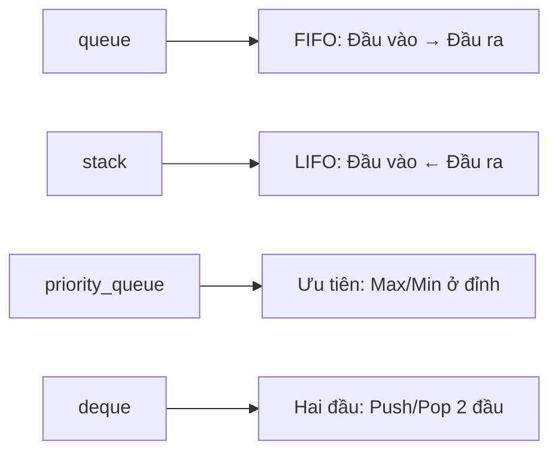

# C13: queue, stack, deque

> **Tác giả:** Hà Trí Kiên<br>
> **Chủ đề:** queue, priority_queue, stack, deque

---

## 1. Tổng quan

Các cấu trúc dữ liệu hàng đợi, ngăn xếp trong C++.



---

## 2. queue — Hàng đợi FIFO

```cpp
#include <queue>

queue<int> q;

// Thêm — O(1)
q.push(1);
q.push(2);
q.push(3);

// Xóa — O(1)
q.pop();  // Xóa phần tử đầu

// Truy cập — O(1)
cout << q.front() << endl;  // Phần tử đầu
cout << q.back() << endl;   // Phần tử cuối

// Kích thước
cout << q.size() << endl;
cout << q.empty() << endl;
```

### Ứng dụng: BFS

```cpp
queue<int> q;
q.push(start);
visited[start] = true;

while (!q.empty()) {
    int u = q.front();
    q.pop();
    for (int v : graph[u]) {
        if (!visited[v]) {
            visited[v] = true;
            q.push(v);
        }
    }
}
```

---

## 3. priority_queue — Hàng đợi ưu tiên

### 3.1. Max-heap (mặc định)

```cpp
#include <queue>

priority_queue<int> pq;

// Thêm — O(log n)
pq.push(3);
pq.push(1);
pq.push(4);
pq.push(1);
pq.push(5);

// Lấy phần tử lớn nhất — O(log n)
cout << pq.top() << endl;  // 5
pq.pop();  // Xóa phần tử lớn nhất

// Kích thước
cout << pq.size() << endl;
```

### 3.2. Min-heap

```cpp
// Cách 1: greater<int>
priority_queue<int, vector<int>, greater<int>> pq;
pq.push(3);
pq.push(1);
pq.push(4);
cout << pq.top() << endl;  // 1

// Cách 2: Đảo dấu
priority_queue<int> pq;
pq.push(-3);
pq.push(-1);
pq.push(-4);
cout << -pq.top() << endl;  // 1
```

### 3.3. Priority Queue với pair

```cpp
// Max-heap theo first, nếu first bằng thì second
priority_queue<pair<int, int>> pq;
pq.push({1, 2});
pq.push({1, 3});
pq.push({2, 1});
// Top: {2, 1}
```

### 3.4. Dijkstra

```cpp
priority_queue<pair<int, int>, vector<pair<int, int>>, greater<pair<int, int>>> pq;
pq.push({0, start});  // {distance, node}

while (!pq.empty()) {
    auto [d, u] = pq.top();
    pq.pop();
    if (d > dist[u]) continue;
    for (auto [v, w] : graph[u]) {
        if (dist[u] + w < dist[v]) {
            dist[v] = dist[u] + w;
            pq.push({dist[v], v});
        }
    }
}
```

---

## 4. stack — Ngăn xếp LIFO

```cpp
#include <stack>

stack<int> st;

// Thêm — O(1)
st.push(1);
st.push(2);
st.push(3);

// Xóa — O(1)
st.pop();  // Xóa phần tử trên cùng

// Truy cập — O(1)
cout << st.top() << endl;  // Phần tử trên cùng

// Kích thước
cout << st.size() << endl;
cout << st.empty() << endl;
```

### Ứng dụng: DFS

```cpp
stack<int> st;
st.push(start);
visited[start] = true;

while (!st.empty()) {
    int u = st.top();
    st.pop();
    for (int v : graph[u]) {
        if (!visited[v]) {
            visited[v] = true;
            st.push(v);
        }
    }
}
```

---

## 5. deque — Hàng đợi hai đầu

```cpp
#include <deque>

deque<int> dq;

// Thêm hai đầu — O(1)
dq.push_back(1);   // {1}
dq.push_back(2);   // {1, 2}
dq.push_front(0);  // {0, 1, 2}

// Xóa hai đầu — O(1)
dq.pop_back();     // {0, 1}
dq.pop_front();    // {1}

// Truy cập — O(1)
cout << dq.front() << endl;  // Phần tử đầu
cout << dq.back() << endl;   // Phần tử cuối
cout << dq[0] << endl;       // Phần tử đầu

// Kích thước
cout << dq.size() << endl;
```

### Ứng dụng: Sliding Window Maximum

```cpp
deque<int> dq;  // Lưu index
vector<int> result;

for (int i = 0; i < n; i++) {
    // Loại bỏ index ngoài cửa sổ
    while (!dq.empty() && dq.front() < i - k + 1) {
        dq.pop_front();
    }
    
    // Loại bỏ phần tử nhỏ hơn arr[i]
    while (!dq.empty() && arr[dq.back()] < arr[i]) {
        dq.pop_back();
    }
    
    dq.push_back(i);
    
    if (i >= k - 1) {
        result.push_back(arr[dq.front()]);
    }
}
```

---

## 6. So sánh với Python

| Python | C++ | Ghi chú |
|--------|-----|---------|
| `deque()` | `deque<int>` | |
| `queue.Queue()` | `queue<int>` | |
| `heapq` | `priority_queue` | C++ là max-heap mặc định |
| Không có | `stack<int>` | Dùng list cũng được |
| `q.append(x)` | `q.push(x)` | |
| `q.popleft()` | `q.pop()` | |
| `q[0]` | `q.front()` | |

---

## 7. Bài tập thực hành

### Bài 1: BFS
Cho đồ thị. Duyệt BFS từ đỉnh start.

```cpp
// Code của bạn ở đây
```

??? tip "Lời giải"
    ```cpp
    #include <bits/stdc++.h>
    using namespace std;
    
    int main() {
        int n, m;
        cin >> n >> m;
        vector<vector<int>> graph(n);
        for (int i = 0; i < m; i++) {
            int u, v;
            cin >> u >> v;
            graph[u].push_back(v);
            graph[v].push_back(u);
        }
        
        int start;
        cin >> start;
        
        vector<bool> visited(n, false);
        queue<int> q;
        q.push(start);
        visited[start] = true;
        
        while (!q.empty()) {
            int u = q.front();
            q.pop();
            cout << u << " ";
            for (int v : graph[u]) {
                if (!visited[v]) {
                    visited[v] = true;
                    q.push(v);
                }
            }
        }
        cout << endl;
        return 0;
    }
    ```

---

## 8. Bài tập luyện tập

| Bài | Nền tảng | Độ khó | Chủ đề |
|-----|----------|--------|--------|
| [CSES - Building Roads](https://cses.fi/problemset/task/1666) | CSES | ⭐⭐ | BFS/DFS |
| [CSES - Message Route](https://cses.fi/problemset/task/1667) | CSES | ⭐⭐ | BFS |

---

## Bài viết liên quan

- [← C12: set & map](C12-set-map.md)
- [C14: algorithm nâng cao →](C14-algorithm-nang-cao.md)

---

**Bài trước:** [C12: set & map](C12-set-map.md)<br>
**Bài tiếp theo:** [C14: algorithm nâng cao →](C14-algorithm-nang-cao.md)
