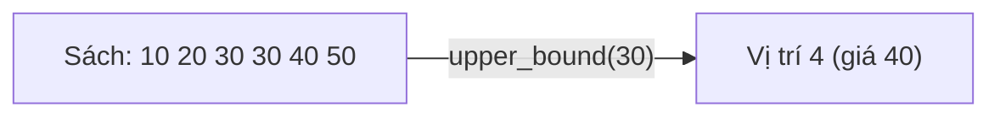

# C14: Algorithm nâng cao — lower_bound, upper_bound, next_permutation

> **Bạn sẽ học được:** lower_bound, upper_bound, next_permutation, binary_search<br>
> **Yêu cầu:** Đã học C11 (Sort & Algorithm)<br>
> **Thời gian:** 45 phút

!!! note "Mở rộng từ C11"
    Các hàm `lower_bound`, `upper_bound`, `next_permutation`, `binary_search` đã được giới thiệu ở [C11](C11-sort-algorithm.md). Bài này đi sâu hơn với ví dụ thực tế, common mistakes, và bài tập.

---

## Lower_bound — Tìm vị trí đầu tiên >= x

### Analogies: Lower_bound = Tìm sách đầu tiên >= giá


### Sử dụng

```cpp
vector<int> a = {10, 20, 30, 40, 50};

// Tìm vị trí đầu tiên >= 25
auto it = lower_bound(a.begin(), a.end(), 25);
int pos = it - a.begin();
cout << pos << endl;  // 2 (vì a[2] = 30 >= 25)

// Tìm trong mảng đã sắp xếp
int a[] = {10, 20, 30, 40, 50};
int pos2 = lower_bound(a, a + 5, 25) - a;
cout << pos2 << endl;  // 2
```

### Ứng dụng: Tìm kiếm nhị phân

```cpp
vector<int> a = {10, 20, 30, 40, 50};

// Kiểm tra 30 có trong mảng không
if (binary_search(a.begin(), a.end(), 30)) {
    cout << "30 ton tai";
}

// Tìm vị trí của 30
int pos = lower_bound(a.begin(), a.end(), 30) - a.begin();
if (pos < a.size() && a[pos] == 30) {
    cout << "30 tai vi tri " << pos;
}
```

---

## Upper_bound — Tìm vị trí đầu tiên > x

### Analogies: Upper_bound = Tìm sách đầu tiên > giá



### Sử dụng

```cpp
vector<int> a = {10, 20, 30, 30, 40, 50};

// Tìm vị trí đầu tiên > 30
auto it = upper_bound(a.begin(), a.end(), 30);
int pos = it - a.begin();
cout << pos << endl;  // 4 (vì a[4] = 40 > 30)
```

### Ứng dụng: Đếm số phần tử trong đoạn [l, r]

```cpp
vector<int> a = {10, 20, 30, 30, 40, 50};

int l = 20, r = 40;
int count = upper_bound(a.begin(), a.end(), r) - lower_bound(a.begin(), a.end(), l);
cout << count << endl;  // 4 (20, 30, 30, 40)
```

---

## Next_permutation — Sinh hoán vị

### Sử dụng

```cpp
vector<int> a = {1, 2, 3};

// Sinh tất cả hoán vị
do {
    for (int x : a) cout << x << " ";
    cout << endl;
} while (next_permutation(a.begin(), a.end()));
```

Output:
```
1 2 3
1 3 2
2 1 3
2 3 1
3 1 2
3 2 1
```

!!! warning "Phải sắp xếp trước"
    Nếu muốn sinh **tất cả** hoán vị, phải sắp xếp mảng tăng dần trước.

### Ứng dụng: Kiểm tra hoán vị

```cpp
vector<int> a = {3, 1, 2};

// Kiểm tra có phải hoán vị của 1,2,3 không
sort(a.begin(), a.end());
if (a == vector<int>{1, 2, 3}) {
    cout << "La hoan vi";
}
```

---

## Binary_search — Tìm kiếm nhị phân

```cpp
vector<int> a = {10, 20, 30, 40, 50};

// Kiểm tra 30 có trong mảng không
if (binary_search(a.begin(), a.end(), 30)) {
    cout << "30 ton tai";
}

// Kiểm tra 25 có trong mảng không
if (!binary_search(a.begin(), a.end(), 25)) {
    cout << "25 khong ton tai";
}
```

---

## So sánh các hàm

| Hàm | Ý nghĩa | Thời gian |
|-----|---------|-----------|
| `binary_search` | Kiểm tra tồn tại | O(log n) |
| `lower_bound` | Vị trí đầu tiên >= x | O(log n) |
| `upper_bound` | Vị trí đầu tiên > x | O(log n) |
| `next_permutation` | Hoán vị tiếp theo | O(n) |

---

## Common Mistakes — Lỗi thường gặp

### Lỗi 1: Quên mảng phải sắp xếp

```cpp
vector<int> a = {5, 2, 8, 1, 9};

// ❌ SAI: Mảng chưa sắp xếp
int pos = lower_bound(a.begin(), a.end(), 5) - a.begin();
// Kết quả không chính xác!

// ✅ ĐÚNG
sort(a.begin(), a.end());
int pos = lower_bound(a.begin(), a.end(), 5) - a.begin();
```

### Lỗi 2: Quên kiểm tra bounds

```cpp
vector<int> a = {10, 20, 30, 40, 50};

// ❌ SAI: Không kiểm tra bounds
int pos = lower_bound(a.begin(), a.end(), 60) - a.begin();
cout << a[pos] << endl;  // Truy cập ngoài mảng!

// ✅ ĐÚNG
int pos = lower_bound(a.begin(), a.end(), 60) - a.begin();
if (pos < a.size()) cout << a[pos];
else cout << "Khong tim thay";
```

---

## Bài tập thực hành

### Bài 1: Tìm kiếm nhị phân
Đọc mảng đã sắp xếp và số x. Tìm vị trí của x trong mảng.

**Input:**
```
5
10 20 30 40 50
30
```
**Output:** `2`

???? tip "Lời giải"
    ```cpp
    #include <bits/stdc++.h>
    using namespace std;
    
    int main() {
        int n;
        cin >> n;
        vector<int> a(n);
        for (int i = 0; i < n; i++) cin >> a[i];
        int x;
        cin >> x;
        
        int pos = lower_bound(a.begin(), a.end(), x) - a.begin();
        if (pos < n && a[pos] == x) cout << pos;
        else cout << -1;
        return 0;
    }
    ```

### Bài 2: Đếm số phần tử trong đoạn
Đọc mảng đã sắp xếp và 2 số l, r. Đếm số phần tử trong đoạn [l, r].

**Input:**
```
5
10 20 30 40 50
20 40
```
**Output:** `3`

???? tip "Lời giải"
    ```cpp
    #include <bits/stdc++.h>
    using namespace std;
    
    int main() {
        int n;
        cin >> n;
        vector<int> a(n);
        for (int i = 0; i < n; i++) cin >> a[i];
        int l, r;
        cin >> l >> r;
        
        int count = upper_bound(a.begin(), a.end(), r) - lower_bound(a.begin(), a.end(), l);
        cout << count << endl;
        return 0;
    }
    ```

---

## Tóm tắt bài học

| Nội dung | Chi tiết |
|----------|----------|
| **lower_bound** | Vị trí đầu tiên >= x |
| **upper_bound** | Vị trí đầu tiên > x |
| **binary_search** | Kiểm tra tồn tại |
| **next_permutation** | Hoán vị tiếp theo |

---

## Bài viết liên quan

- [C12: Set & Map ←](C12-set-map.md)
- [C15: Mẹo thi đấu C++ →](C15-meo-thi-dau-cpp.md)

---

**Bài tiếp theo:** [C15: Mẹo thi đấu C++ →](C15-meo-thi-dau-cpp.md)
