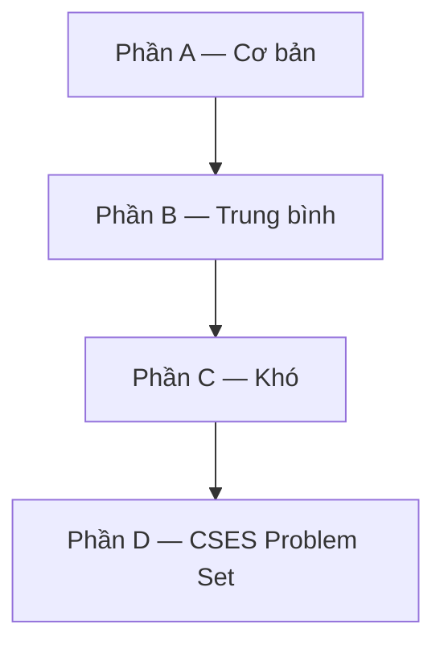

# C16: Bài tập tổng hợp

> **Tác giả:** Hà Trí Kiên<br>
> **Chủ đề:** Luyện tập tổng hợp C++ từ cơ bản đến nâng cao

---

## 1. Tổng quan

Bài này tổng hợp các bài tập **từ dễ đến khó** để luyện kỹ năng C++. Mỗi bài đều có **đề bài, gợi ý, lời giải chi tiết**.



---

## 2. Phần A — Cơ bản

### Bài 1: Hello World

Viết chương trình in "Hello World!".

<div class="cp-pg" data-language="cpp" data-starter="#include &lt;bits/stdc++.h&gt;\nusing namespace std;\n\nint main() {\n    // Viết code ở đây\n    return 0;\n}" data-input="" data-expected="Hello World!" data-hint="Dùng cout"></div>

??? tip "Lời giải"
    ```cpp
    #include <bits/stdc++.h>
    using namespace std;
    
    int main() {
        cout << "Hello World!" << endl;
        return 0;
    }
    ```

### Bài 2: Tổng 2 số

Đọc 2 số nguyên $a$, $b$. In ra $a + b$.

<div class="cp-pg" data-language="cpp" data-starter="#include &lt;bits/stdc++.h&gt;\nusing namespace std;\n\nint main() {\n    // Viết code ở đây\n    return 0;\n}" data-input="3 5" data-expected="8" data-hint="Đọc a, b bằng cin, in a + b"></div>

??? tip "Lời giải"
    ```cpp
    #include <bits/stdc++.h>
    using namespace std;
    
    int main() {
        ios_base::sync_with_stdio(false);
        cin.tie(NULL);
        
        int a, b;
        cin >> a >> b;
        cout << a + b << endl;
        
        return 0;
    }
    ```

### Bài 3: Tính diện tích hình tròn

Đọc bán kính $r$. Tính diện tích $S = \pi \times r^2$. In ra 2 chữ số sau dấu phẩy.

<div class="cp-pg" data-language="cpp" data-starter="#include &lt;bits/stdc++.h&gt;\nusing namespace std;\n\nint main() {\n    // Viết code ở đây\n    return 0;\n}" data-input="5" data-expected="78.54" data-hint="Dùng fixed &lt;&lt; setprecision(2) và M_PI"></div>

??? tip "Lời giải"
    ```cpp
    #include <bits/stdc++.h>
    using namespace std;
    
    int main() {
        double r;
        cin >> r;
        cout << fixed << setprecision(2) << M_PI * r * r << endl;
        return 0;
    }
    ```

### Bài 4: Tìm số lớn nhất

Đọc 3 số nguyên $a$, $b$, $c$. In ra số lớn nhất.

<div class="cp-pg" data-language="cpp" data-starter="#include &lt;bits/stdc++.h&gt;\nusing namespace std;\n\nint main() {\n    // Viết code ở đây\n    return 0;\n}" data-input="3 7 5" data-expected="7" data-hint="Dùng max({a, b, c})"></div>

??? tip "Lời giải"
    ```cpp
    #include <bits/stdc++.h>
    using namespace std;
    
    int main() {
        int a, b, c;
        cin >> a >> b >> c;
        cout << max({a, b, c}) << endl;
        return 0;
    }
    ```

### Bài 5: Kiểm tra số chẵn lẻ

Đọc số nguyên $n$. In ra "Chan" nếu $n$ chẵn, "Le" nếu $n$ lẻ.

<div class="cp-pg" data-language="cpp" data-starter="#include &lt;bits/stdc++.h&gt;\nusing namespace std;\n\nint main() {\n    // Viết code ở đây\n    return 0;\n}" data-input="4" data-expected="Chan" data-hint="Dùng n % 2 == 0"></div>

??? tip "Lời giải"
    ```cpp
    #include <bits/stdc++.h>
    using namespace std;
    
    int main() {
        int n;
        cin >> n;
        cout << (n % 2 == 0 ? "Chan" : "Le") << endl;
        return 0;
    }
    ```

### Bài 6: Tổng dãy số

Đọc số nguyên $n$, sau đó đọc $n$ số nguyên. In ra tổng.

<div class="cp-pg" data-language="cpp" data-starter="#include &lt;bits/stdc++.h&gt;\nusing namespace std;\n\nint main() {\n    // Viết code ở đây\n    return 0;\n}" data-input="5
1 2 3 4 5" data-expected="15" data-hint="Dùng long long sum, cộng dồn trong vòng lặp"></div>

??? tip "Lời giải"
    ```cpp
    #include <bits/stdc++.h>
    using namespace std;
    
    int main() {
        ios_base::sync_with_stdio(false);
        cin.tie(NULL);
        
        int n;
        cin >> n;
        
        long long sum = 0;
        for (int i = 0; i < n; i++) {
            int x;
            cin >> x;
            sum += x;
        }
        cout << sum << endl;
        
        return 0;
    }
    ```

### Bài 7: Đếm chữ số

Đọc số nguyên $n$. In ra số chữ số của $n$.

<div class="cp-pg" data-language="cpp" data-starter="#include &lt;bits/stdc++.h&gt;\nusing namespace std;\n\nint main() {\n    // Viết code ở đây\n    return 0;\n}" data-input="12345" data-expected="5" data-hint="Đọc dạng string, in s.length()"></div>

??? tip "Lời giải"
    ```cpp
    #include <bits/stdc++.h>
    using namespace std;
    
    int main() {
        string s;
        cin >> s;
        cout << s.length() << endl;
        return 0;
    }
    ```

### Bài 8: In bảng cửu chương

Đọc số $n$. In bảng cửu chương của $n$ (từ 1 đến 10).

<div class="cp-pg" data-language="cpp" data-starter="#include &lt;bits/stdc++.h&gt;\nusing namespace std;\n\nint main() {\n    // Viết code ở đây\n    return 0;\n}" data-input="5" data-expected="5 x 1 = 5
5 x 2 = 10
5 x 3 = 15
5 x 4 = 20
5 x 5 = 25
5 x 6 = 30
5 x 7 = 35
5 x 8 = 40
5 x 9 = 45
5 x 10 = 50" data-hint="Vòng for từ 1 đến 10, in n x i = n*i"></div>

??? tip "Lời giải"
    ```cpp
    #include <bits/stdc++.h>
    using namespace std;
    
    int main() {
        int n;
        cin >> n;
        for (int i = 1; i <= 10; i++) {
            cout << n << " x " << i << " = " << n * i << endl;
        }
        return 0;
    }
    ```

---

## 3. Phần B — Trung bình

### Bài 9: Đảo ngược số

Đọc số nguyên $n$. In ra số đảo ngược.

<div class="cp-pg" data-language="cpp" data-starter="#include &lt;bits/stdc++.h&gt;\nusing namespace std;\n\nint main() {\n    // Viết code ở đây\n    return 0;\n}" data-input="12345" data-expected="54321" data-hint="Đọc dạng string, dùng reverse"></div>

??? tip "Lời giải"
    ```cpp
    #include <bits/stdc++.h>
    using namespace std;
    
    int main() {
        string s;
        cin >> s;
        reverse(s.begin(), s.end());
        cout << s << endl;
        return 0;
    }
    ```

### Bài 10: Kiểm tra số nguyên tố

Đọc số nguyên $n$. In ra "Yes" nếu $n$ là số nguyên tố, "No" nếu không.

<div class="cp-pg" data-language="cpp" data-starter="#include &lt;bits/stdc++.h&gt;\nusing namespace std;\n\nint main() {\n    // Viết code ở đây\n    return 0;\n}" data-input="7" data-expected="Yes" data-hint="Số nguyên tố: chia hết cho 1 và chính nó, kiểm tra đến sqrt(n)"></div>

??? tip "Lời giải"
    ```cpp
    #include <bits/stdc++.h>
    using namespace std;
    
    bool isPrime(int n) {
        if (n < 2) return false;
        for (int i = 2; i * i <= n; i++) {
            if (n % i == 0) return false;
        }
        return true;
    }
    
    int main() {
        int n;
        cin >> n;
        cout << (isPrime(n) ? "Yes" : "No") << endl;
        return 0;
    }
    ```

### Bài 11: Tìm UCLN

Đọc 2 số nguyên $a$, $b$. In ra ước chung lớn nhất.

<div class="cp-pg" data-language="cpp" data-starter="#include &lt;bits/stdc++.h&gt;\nusing namespace std;\n\nint main() {\n    // Viết code ở đây\n    return 0;\n}" data-input="12 18" data-expected="6" data-hint="Dùng __gcd(a, b) trong &lt;algorithm&gt;"></div>

??? tip "Lời giải"
    ```cpp
    #include <bits/stdc++.h>
    using namespace std;
    
    int main() {
        int a, b;
        cin >> a >> b;
        cout << __gcd(a, b) << endl;
        return 0;
    }
    ```

### Bài 12: Sắp xếp mảng

Đọc $n$ số nguyên. In ra mảng đã sắp xếp tăng dần.

<div class="cp-pg" data-language="cpp" data-starter="#include &lt;bits/stdc++.h&gt;\nusing namespace std;\n\nint main() {\n    // Viết code ở đây\n    return 0;\n}" data-input="5
3 1 4 1 5" data-expected="1 1 3 4 5" data-hint="Dùng sort(a.begin(), a.end())"></div>

??? tip "Lời giải"
    ```cpp
    #include <bits/stdc++.h>
    using namespace std;
    
    int main() {
        ios_base::sync_with_stdio(false);
        cin.tie(NULL);
        
        int n;
        cin >> n;
        
        vector<int> a(n);
        for (int i = 0; i < n; i++) cin >> a[i];
        
        sort(a.begin(), a.end());
        
        for (int i = 0; i < n; i++) {
            if (i > 0) cout << " ";
            cout << a[i];
        }
        cout << endl;
        
        return 0;
    }
    ```

### Bài 13: Đếm tần suất

Đọc $n$ số nguyên (mỗi số từ 1 đến 100). In ra số xuất hiện nhiều nhất.

<div class="cp-pg" data-language="cpp" data-starter="#include &lt;bits/stdc++.h&gt;\nusing namespace std;\n\nint main() {\n    // Viết code ở đây\n    return 0;\n}" data-input="7
1 3 2 3 3 2 1" data-expected="3" data-hint="Dùng map&lt;int,int&gt; đếm tần suất, tìm max"></div>

??? tip "Lời giải"
    ```cpp
    #include <bits/stdc++.h>
    using namespace std;
    
    int main() {
        int n;
        cin >> n;
        
        map<int, int> freq;
        for (int i = 0; i < n; i++) {
            int x;
            cin >> x;
            freq[x]++;
        }
        
        int best = -1, bestCnt = 0;
        for (auto [val, cnt] : freq) {
            if (cnt > bestCnt) {
                bestCnt = cnt;
                best = val;
            }
        }
        cout << best << endl;
        
        return 0;
    }
    ```

### Bài 14: Kiểm tra palindrome

Đọc chuỗi $s$. In ra "Yes" nếu $s$ là palindrome, "No" nếu không.

<div class="cp-pg" data-language="cpp" data-starter="#include &lt;bits/stdc++.h&gt;\nusing namespace std;\n\nint main() {\n    // Viết code ở đây\n    return 0;\n}" data-input="abcba" data-expected="Yes" data-hint="So sánh s với reverse(s)"></div>

??? tip "Lời giải"
    ```cpp
    #include <bits/stdc++.h>
    using namespace std;
    
    int main() {
        string s;
        cin >> s;
        
        string t = s;
        reverse(t.begin(), t.end());
        
        cout << (s == t ? "Yes" : "No") << endl;
        return 0;
    }
    ```

---

## 4. Phần C — Khó

### Bài 15: Two Sum

Đọc $n$ số nguyên và số $target$. Tìm 2 vị trí $i$, $j$ sao cho $a[i] + a[j] = target$.

<div class="cp-pg" data-language="cpp" data-starter="#include &lt;bits/stdc++.h&gt;\nusing namespace std;\n\nint main() {\n    // Viết code ở đây\n    return 0;\n}" data-input="4 9
2 7 11 15" data-expected="0 1" data-hint="Dùng map lưu vị trí, tìm need = target - a[i]"></div>

??? tip "Lời giải"
    ```cpp
    #include <bits/stdc++.h>
    using namespace std;
    
    int main() {
        ios_base::sync_with_stdio(false);
        cin.tie(NULL);
        
        int n, target;
        cin >> n >> target;
        
        vector<int> a(n);
        for (int i = 0; i < n; i++) cin >> a[i];
        
        map<int, int> pos;
        for (int i = 0; i < n; i++) {
            int need = target - a[i];
            if (pos.count(need)) {
                cout << pos[need] << " " << i << endl;
                return 0;
            }
            pos[a[i]] = i;
        }
        
        cout << -1 << endl;
        return 0;
    }
    ```

### Bài 16: LIS (Dãy con tăng dài nhất)

Đọc $n$ số nguyên. Tìm độ dài dãy con tăng dài nhất.

<div class="cp-pg" data-language="cpp" data-starter="#include &lt;bits/stdc++.h&gt;\nusing namespace std;\n\nint main() {\n    // Viết code ở đây\n    return 0;\n}" data-input="7
10 9 2 5 3 7 101" data-expected="4" data-hint="Dùng lower_bound trên mảng lis, thay thế hoặc push_back"></div>

??? tip "Lời giải"
    ```cpp
    #include <bits/stdc++.h>
    using namespace std;
    
    int main() {
        ios_base::sync_with_stdio(false);
        cin.tie(NULL);
        
        int n;
        cin >> n;
        
        vector<int> a(n);
        for (int i = 0; i < n; i++) cin >> a[i];
        
        vector<int> lis;
        for (int x : a) {
            auto it = lower_bound(lis.begin(), lis.end(), x);
            if (it == lis.end()) lis.push_back(x);
            else *it = x;
        }
        
        cout << lis.size() << endl;
        return 0;
    }
    ```

### Bài 17: BFS trên lưới

Cho lưới $n \times m$, tìm đường đi ngắn nhất từ $(0,0)$ đến $(n-1,m-1)$. `0` = đi được, `1` = tường.

<div class="cp-pg" data-language="cpp" data-starter="#include &lt;bits/stdc++.h&gt;\nusing namespace std;\n\nint main() {\n    // Viết code ở đây\n    return 0;\n}" data-input="3 3
0 0 0
0 1 0
0 0 0" data-expected="4" data-hint="BFS 4 hướng, dùng dist[][] đánh dấu khoảng cách"></div>

??? tip "Lời giải"
    ```cpp
    #include <bits/stdc++.h>
    using namespace std;
    
    int dx[] = {0, 0, 1, -1};
    int dy[] = {1, -1, 0, 0};
    
    int main() {
        ios_base::sync_with_stdio(false);
        cin.tie(NULL);
        
        int n, m;
        cin >> n >> m;
        
        vector<vector<int>> a(n, vector<int>(m));
        for (int i = 0; i < n; i++)
            for (int j = 0; j < m; j++)
                cin >> a[i][j];
        
        vector<vector<int>> dist(n, vector<int>(m, -1));
        queue<pair<int,int>> q;
        
        dist[0][0] = 0;
        q.push({0, 0});
        
        while (!q.empty()) {
            auto [x, y] = q.front(); q.pop();
            for (int d = 0; d < 4; d++) {
                int nx = x + dx[d], ny = y + dy[d];
                if (nx >= 0 && nx < n && ny >= 0 && ny < m 
                    && a[nx][ny] == 0 && dist[nx][ny] == -1) {
                    dist[nx][ny] = dist[x][y] + 1;
                    q.push({nx, ny});
                }
            }
        }
        
        cout << dist[n-1][m-1] << endl;
        return 0;
    }
    ```

---

## 5. Phần D — CSES Problem Set

Danh sách 20 bài trên [CSES](https://cses.fi/problemset/) phù hợp cho luyện tập C++:

| # | Bài | Độ khó | Chủ đề |
|---|-----|--------|--------|
| 1 | [Weird Algorithm](https://cses.fi/problemset/task/1068) | ⭐ | Vòng lặp cơ bản |
| 2 | [Missing Number](https://cses.fi/problemset/task/1083) | ⭐ | Mảng, tìm kiếm |
| 3 | [Repetitions](https://cses.fi/problemset/task/1069) | ⭐ | Xử lý xâu |
| 4 | [Increasing Array](https://cses.fi/problemset/task/1094) | ⭐ | Mảng |
| 5 | [Permutations](https://cses.fi/problemset/task/1070) | ⭐ | Hoán vị |
| 6 | [Number Spiral](https://cses.fi/problemset/task/1071) | ⭐⭐ | Toán học |
| 7 | [Two Knights](https://cses.fi/problemset/task/1072) | ⭐⭐ | Tổ hợp |
| 8 | [Bit Strings](https://cses.fi/problemset/task/1617) | ⭐ | Lũy thừa |
| 9 | [Trailing Zeros](https://cses.fi/problemset/task/1618) | ⭐ | Giai thừa |
| 10 | [Coin Piles](https://cses.fi/problemset/task/1754) | ⭐ | Toán học |
| 11 | [Palindrome Reorder](https://cses.fi/problemset/task/1755) | ⭐ | Xâu |
| 12 | [Gray Code](https://cses.fi/problemset/task/2205) | ⭐⭐ | Bitmask |
| 13 | [Tower of Hanoi](https://cses.fi/problemset/task/2165) | ⭐⭐ | Đệ quy |
| 14 | [Creating Strings](https://cses.fi/problemset/task/1622) | ⭐ | Hoán vị |
| 15 | [Apple Division](https://cses.fi/problemset/task/1623) | ⭐⭐ | Bitmask |
| 16 | [Chessboard and Queens](https://cses.fi/problemset/task/1624) | ⭐⭐ | Backtracking |
| 17 | [Digit Queries](https://cses.fi/problemset/task/2431) | ⭐⭐ | Toán học |
| 18 | [Grid Paths](https://cses.fi/problemset/task/1625) | ⭐⭐⭐ | Backtracking |
| 19 | [Josephus Problem I](https://cses.fi/problemset/task/2162) | ⭐⭐ | Hàng đợi |
| 20 | [Josephus Problem II](https://cses.fi/problemset/task/2163) | ⭐⭐⭐ | Set |

---

## 6. Lộ trình luyện tập đề xuất

```mermaid
gantt
    title Lộ trình 8 tuần
    dateFormat  X
    axisFormat %s
    section Tuần 1-2
    Phần A — Cơ bản       :a1, 0, 2
    section Tuần 3-4
    Phần B — Trung bình    :a2, 2, 4
    section Tuần 5-6
    Phần C — Khó           :a3, 4, 6
    section Tuần 7-8
    Phần D — CSES          :a4, 6, 8
```



---

## Bài viết liên quan

- [C15: Mẹo thi đấu C++ →](C15-meo-thi-dau-cpp.md)
- [Chương 2: C++ cho Thi Đấu](index.md)

---

**Quay lại:** [Chương 2: C++ cho Thi Đấu](index.md)
