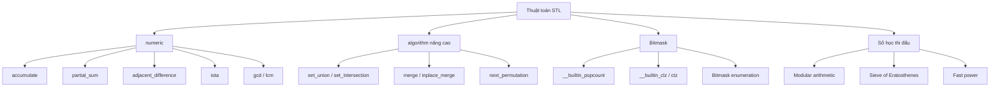

# C17: Thuật toán STL & Số học

> **Tác giả:** Hà Trí Kiên<br>
> **Chủ đề:** `<numeric>`, `<algorithm>` nâng cao, bitmask, số học thi đấu

---

## 1. Tổng quan

Bài này tổng hợp các thuật toán STL **thường dùng trong thi đấu** mà chưa được đề cập đầy đủ ở các bài trước.



---

## 2. Thư viện `<numeric>`

### 2.1. accumulate — Tổng mảng

```cpp
#include <bits/stdc++.h>
using namespace std;

int main() {
    vector<int> a = {1, 2, 3, 4, 5};
    
    // Tổng từ đầu đến cuối, giá trị khởi tạo = 0
    int sum = accumulate(a.begin(), a.end(), 0);
    cout << sum << endl;  // 15
    
    // Tích
    int product = accumulate(a.begin(), a.end(), 1, multiplies<int>());
    cout << product << endl;  // 120
    
    // Tổng với điều kiện (chỉ số chẵn)
    int sum_even = accumulate(a.begin(), a.end(), 0,
        [](int acc, int x) { return acc + (x % 2 == 0 ? x : 0); });
    cout << sum_even << endl;  // 6
    
    return 0;
}
```

!!! warning "Tránh tràn số"
    Khi tính tổng nhiều số lớn, dùng `long long`:
    ```cpp
    long long sum = accumulate(a.begin(), a.end(), 0LL);
    //                                     khởi tạo ^^ 0LL
    ```

### 2.2. partial_sum — Tổng tiền tố (Prefix Sum)

```cpp
#include <bits/stdc++.h>
using namespace std;

int main() {
    vector<int> a = {1, 2, 3, 4, 5};
    vector<int> pref(5);
    
    // pref[i] = a[0] + a[1] + ... + a[i]
    partial_sum(a.begin(), a.end(), pref.begin());
    // pref = {1, 3, 6, 10, 15}
    
    // Tính tổng đoạn [l, r] bằng prefix sum
    int l = 1, r = 3;
    int sumLR = pref[r] - (l > 0 ? pref[l - 1] : 0);
    cout << sumLR << endl;  // 2 + 3 + 4 = 9
    
    return 0;
}
```

### 2.3. adjacent_difference — Hiệu kề nhau

```cpp
#include <bits/stdc++.h>
using namespace std;

int main() {
    vector<int> a = {1, 3, 6, 10, 15};
    vector<int> diff(5);
    
    // diff[0] = a[0], diff[i] = a[i] - a[i-1]
    adjacent_difference(a.begin(), a.end(), diff.begin());
    // diff = {1, 2, 3, 4, 5}
    
    // Hữu ích để kiểm tra dãy tăng đều
    return 0;
}
```

### 2.4. iota — Tạo dãy liên tiếp

```cpp
#include <bits/stdc++.h>
using namespace std;

int main() {
    vector<int> a(10);
    
    // a = {0, 1, 2, 3, 4, 5, 6, 7, 8, 9}
    iota(a.begin(), a.end(), 0);
    
    // a = {5, 6, 7, 8, 9, 10, 11, 12, 13, 14}
    iota(a.begin(), a.end(), 5);
    
    // Hữu ích khi cần mảng chỉ số
    vector<int> idx(n);
    iota(idx.begin(), idx.end(), 0);
    sort(idx.begin(), idx.end(), [&](int i, int j) {
        return a[i] < a[j];  // Sắp xếp chỉ số theo giá trị
    });
    
    return 0;
}
```

### 2.5. gcd / lcm (C++17)

```cpp
#include <bits/stdc++.h>
using namespace std;

int main() {
    // __gcd hoạt động trên mọi trình biên dịch
    cout << __gcd(12, 18) << endl;  // 6
    
    // C++17: std::gcd, std::lcm
    cout << gcd(12, 18) << endl;    // 6
    cout << lcm(4, 6) << endl;      // 12
    
    // GCD nhiều số
    vector<int> a = {12, 18, 24};
    int g = 0;
    for (int x : a) g = __gcd(g, x);
    cout << g << endl;  // 6
    
    return 0;
}
```

---

## 3. `<algorithm>` nâng cao

### 3.1. set_union / set_intersection / set_difference

```cpp
#include <bits/stdc++.h>
using namespace std;

int main() {
    vector<int> a = {1, 2, 3, 4, 5};
    vector<int> b = {3, 4, 5, 6, 7};
    vector<int> res(10);
    
    // Hợp (union)
    auto it = set_union(a.begin(), a.end(), b.begin(), b.end(), res.begin());
    // res = {1, 2, 3, 4, 5, 6, 7, ...}
    
    // Giao (intersection)
    it = set_intersection(a.begin(), a.end(), b.begin(), b.end(), res.begin());
    // res = {3, 4, 5, ...}
    
    // Hiệu (difference) — phần tử trong a mà không trong b
    it = set_difference(a.begin(), a.end(), b.begin(), b.end(), res.begin());
    // res = {1, 2, ...}
    
    return 0;
}
```

!!! warning "Yêu cầu mảng đã sắp xếp"
    Hai mảng `a` và `b` phải được **sắp xếp tăng dần** trước khi dùng các hàm này.

### 3.2. merge / inplace_merge

```cpp
#include <bits/stdc++.h>
using namespace std;

int main() {
    // merge: trộn 2 mảng đã sắp xếp
    vector<int> a = {1, 3, 5};
    vector<int> b = {2, 4, 6};
    vector<int> res(6);
    merge(a.begin(), a.end(), b.begin(), b.end(), res.begin());
    // res = {1, 2, 3, 4, 5, 6}
    
    // inplace_merge: trộn 2 phần của cùng 1 mảng
    vector<int> c = {1, 3, 5, 2, 4, 6};
    inplace_merge(c.begin(), c.begin() + 3, c.end());
    // c = {1, 2, 3, 4, 5, 6}
    
    return 0;
}
```

### 3.3. next_permutation / prev_permutation

```cpp
#include <bits/stdc++.h>
using namespace std;

int main() {
    vector<int> a = {1, 2, 3};
    
    // In tất cả hoán vị
    do {
        for (int x : a) cout << x << " ";
        cout << endl;
    } while (next_permutation(a.begin(), a.end()));
    // Output:
    // 1 2 3
    // 1 3 2
    // 2 1 3
    // 2 3 1
    // 3 1 2
    // 3 2 1
    
    // Lưu ý: mảng phải được sắp xếp tăng dần trước!
    
    return 0;
}
```

---

## 4. Bitmask

### 4.1. Các hàm built-in

```cpp
#include <bits/stdc++.h>
using namespace std;

int main() {
    int x = 0b10110;  // = 22
    
    // __builtin_popcount: đếm số bit 1
    cout << __builtin_popcount(x) << endl;      // 3
    
    // __builtin_clz: đếm số bit 0 ở đầu (count leading zeros)
    cout << __builtin_clz(x) << endl;           // 27 (32-bit)
    
    // __builtin_ctz: đếm số bit 0 ở cuối (count trailing zeros)
    cout << __builtin_ctz(x) << endl;           // 1
    
    // __builtin_parity: parity (số bit 1 chẵn/lẻ)
    cout << __builtin_parity(x) << endl;        // 1 (3 bit 1 → lẻ)
    
    // Với long long
    long long y = (1LL << 50);
    cout << __builtin_popcountll(y) << endl;    // 1
    cout << __builtin_clzll(y) << endl;         // 13 (64-bit)
    
    return 0;
}
```

### 4.2. Bitmask enumeration — Duyệt tất cả tập con

```cpp
#include <bits/stdc++.h>
using namespace std;

int main() {
    int n = 4;
    
    // Duyệt tất cả tập con của {0, 1, 2, ..., n-1}
    for (int mask = 0; mask < (1 << n); mask++) {
        cout << "{ ";
        for (int i = 0; i < n; i++) {
            if (mask & (1 << i)) cout << i << " ";
        }
        cout << "}" << endl;
    }
    // Output:
    // { }
    // { 0 }
    // { 1 }
    // { 0 1 }
    // { 2 }
    // { 0 2 }
    // { 1 2 }
    // { 0 1 2 }
    // { 3 }
    // ...
    
    return 0;
}
```

### 4.3. Bitmask trong thi đấu

```cpp
#include <bits/stdc++.h>
using namespace std;

int main() {
    // Bài toán: Cho n đồ vật, mỗi đồ vật có trọng lượng w[i].
    // Tìm tất cả cách chọn đồ vật sao cho tổng trọng lượng = S.
    
    int n = 4, S = 10;
    vector<int> w = {3, 5, 2, 7};
    
    for (int mask = 0; mask < (1 << n); mask++) {
        int sum = 0;
        for (int i = 0; i < n; i++) {
            if (mask & (1 << i)) sum += w[i];
        }
        if (sum == S) {
            cout << "Found: { ";
            for (int i = 0; i < n; i++) {
                if (mask & (1 << i)) cout << w[i] << " ";
            }
            cout << "}" << endl;
        }
    }
    // Output: Found: { 3 5 2 }
    
    return 0;
}
```

### 4.4. Bit tricks thường dùng

```cpp
// Kiểm tra bit thứ i
bool getBit(int x, int i) { return (x >> i) & 1; }

// Bật bit thứ i
int setBit(int x, int i) { return x | (1 << i); }

// Tắt bit thứ i
int clearBit(int x, int i) { return x & ~(1 << i); }

// Đảo bit thứ i
int toggleBit(int x, int i) { return x ^ (1 << i); }

// Lấy bit 1 cuối cùng (lowest set bit)
int lowBit(int x) { return x & (-x); }

// Tắt bit 1 cuối cùng
int clearLowest(int x) { return x & (x - 1); }

// Kiểm tra x có phải lũy thừa của 2
bool isPowerOf2(int x) { return x > 0 && (x & (x - 1)) == 0; }
```

---

## 5. Số học thi đấu

### 5.1. Modular arithmetic

```cpp
const int MOD = 1e9 + 7;

// Cộng modulo
int add(int a, int b) { return (a + b) % MOD; }

// Trừ modulo
int sub(int a, int b) { return (a - b + MOD) % MOD; }

// Nhân modulo
int mul(int a, int b) { return (1LL * a * b) % MOD; }

// Lũy thừa nhanh modulo
int power(int base, int exp, int mod = MOD) {
    int result = 1;
    base %= mod;
    while (exp > 0) {
        if (exp & 1) result = (1LL * result * base) % mod;
        base = (1LL * base * base) % mod;
        exp >>= 1;
    }
    return result;
}

// Nghịch đảo modulo (Fermat's little theorem)
int inverse(int a, int mod = MOD) {
    return power(a, mod - 2, mod);
}

// Chia modulo
int div(int a, int b) { return mul(a, inverse(b)); }
```

### 5.2. Sieve of Eratosthenes

```cpp
#include <bits/stdc++.h>
using namespace std;

const int MAXN = 1e7 + 5;
bool isPrime[MAXN];
vector<int> primes;

void sieve() {
    fill(isPrime, isPrime + MAXN, true);
    isPrime[0] = isPrime[1] = false;
    
    for (int i = 2; i < MAXN; i++) {
        if (isPrime[i]) {
            primes.push_back(i);
            for (long long j = 1LL * i * i; j < MAXN; j += i) {
                isPrime[j] = false;
            }
        }
    }
}

int main() {
    sieve();
    
    // Kiểm tra số nguyên tố
    cout << isPrime[7] << endl;   // 1 (true)
    cout << isPrime[10] << endl;  // 0 (false)
    
    // In 100 số nguyên tố đầu tiên
    for (int i = 0; i < 100; i++) cout << primes[i] << " ";
    cout << endl;
    
    return 0;
}
```

### 5.3. Phân tích thừa số nguyên tố

```cpp
#include <bits/stdc++.h>
using namespace std;

vector<pair<long long, int>> factorize(long long n) {
    vector<pair<long long, int>> factors;
    for (long long i = 2; i * i <= n; i++) {
        if (n % i == 0) {
            int cnt = 0;
            while (n % i == 0) {
                n /= i;
                cnt++;
            }
            factors.push_back({i, cnt});
        }
    }
    if (n > 1) factors.push_back({n, 1});
    return factors;
}

int main() {
    long long n = 360;  // 360 = 2^3 * 3^2 * 5
    auto factors = factorize(n);
    
    for (auto [p, e] : factors) {
        cout << p << "^" << e << " ";
    }
    cout << endl;
    // Output: 2^3 3^2 5^1
    
    return 0;
}
```

### 5.4. Đếm ước số

```cpp
#include <bits/stdc++.h>
using namespace std;

// Đếm số ước số của n
int countDivisors(long long n) {
    int cnt = 0;
    for (long long i = 1; i * i <= n; i++) {
        if (n % i == 0) {
            cnt++;
            if (i != n / i) cnt++;
        }
    }
    return cnt;
}

// Tổng ước số của n
long long sumDivisors(long long n) {
    long long sum = 0;
    for (long long i = 1; i * i <= n; i++) {
        if (n % i == 0) {
            sum += i;
            if (i != n / i) sum += n / i;
        }
    }
    return sum;
}
```

### 5.5. __int128 cho số rất lớn

```cpp
#include <bits/stdc++.h>
using namespace std;

// __int128: 128-bit integer (GCC only)
// Phạm vi: ~10^38

void print128(__int128 x) {
    if (x == 0) { cout << 0; return; }
    if (x < 0) { cout << "-"; x = -x; }
    string s;
    while (x > 0) {
        s += (char)('0' + x % 10);
        x /= 10;
    }
    reverse(s.begin(), s.end());
    cout << s;
}

int main() {
    __int128 a = 1;
    for (int i = 1; i <= 40; i++) a *= i;
    
    cout << "40! = ";
    print128(a);
    cout << endl;
    // Output: 40! = 815915283247897734345611269596115894272000000000
    
    return 0;
}
```

---

## 6. Bảng tổng hợp hàm

| Hàm | Thư viện | Mô tả | Độ phức tạp |
|-----|----------|-------|-------------|
| `accumulate` | `<numeric>` | Tổng mảng | $O(n)$ |
| `partial_sum` | `<numeric>` | Prefix sum | $O(n)$ |
| `adjacent_difference` | `<numeric>` | Hiệu kề nhau | $O(n)$ |
| `iota` | `<numeric>` | Tạo dãy liên tiếp | $O(n)$ |
| `gcd` / `__gcd` | `<numeric>` | Ước chung lớn nhất | $O(\log n)$ |
| `lcm` | `<numeric>` | Bội chung nhỏ nhất | $O(\log n)$ |
| `set_union` | `<algorithm>` | Hợp 2 tập | $O(n)$ |
| `set_intersection` | `<algorithm>` | Giao 2 tập | $O(n)$ |
| `set_difference` | `<algorithm>` | Hiệu 2 tập | $O(n)$ |
| `merge` | `<algorithm>` | Trộn 2 mảng | $O(n)$ |
| `inplace_merge` | `<algorithm>` | Trộn tại chỗ | $O(n)$ |
| `next_permutation` | `<algorithm>` | Hoán vị kế tiếp | $O(n)$ |

---

## Bài viết liên quan

- [C14: algorithm nâng cao →](C14-algorithm-nang-cao.md)
- [C15: Mẹo thi đấu C++ →](C15-meo-thi-dau-cpp.md)
- [C16: Bài tập tổng hợp →](C16-bai-tap-tong-hop.md)

---

**Bài tiếp theo:** [C18: Xử lý xâu nâng cao →](C18-xu-ly-xau-nang-cao.md)
