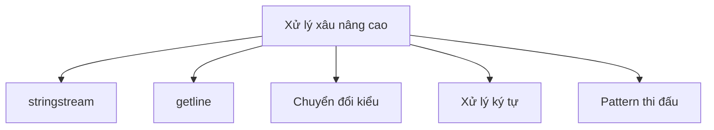

# C18: Xử lý xâu nâng cao

> **Tác giả:** Hà Trí Kiên<br>
> **Chủ đề:** stringstream, getline, chuyển đổi kiểu, pattern thi đấu

---

## 1. Tổng quan

Bài này tổng hợp các kỹ thuật **xử lý xâu nâng cao** trong C++, thường dùng trong thi đấu.



---

## 2. stringstream — Phân tích xâu

### 2.1. Tách từ trong xâu

```cpp
#include <bits/stdc++.h>
using namespace std;

int main() {
    string s = "Hello World C++ Programming";
    
    stringstream ss(s);
    string word;
    
    while (ss >> word) {
        cout << word << endl;
    }
    // Output:
    // Hello
    // World
    // C++
    // Programming
    
    return 0;
}
```

### 2.2. Đọc số từ xâu

```cpp
#include <bits/stdc++.h>
using namespace std;

int main() {
    string s = "10 20 30 40 50";
    
    stringstream ss(s);
    int x;
    
    while (ss >> x) {
        cout << x * 2 << " ";
    }
    cout << endl;
    // Output: 20 40 60 80 100
    
    return 0;
}
```

### 2.3. Tách xâu theo delimiter

```cpp
#include <bits/stdc++.h>
using namespace std;

// Tách xâu theo delimiter (không dùng getline)
vector<string> split(const string &s, char delimiter) {
    vector<string> tokens;
    stringstream ss(s);
    string token;
    
    while (getline(ss, token, delimiter)) {
        tokens.push_back(token);
    }
    return tokens;
}

int main() {
    string s = "one,two,three,four";
    
    vector<string> parts = split(s, ',');
    for (const string &p : parts) {
        cout << "[" << p << "] ";
    }
    cout << endl;
    // Output: [one] [two] [three] [four]
    
    return 0;
}
```

### 2.4. Định dạng đầu ra với stringstream

```cpp
#include <bits/stdc++.h>
using namespace std;

int main() {
    stringstream ss;
    
    // Nối xâu
    ss << "Hello" << " " << "World" << " " << 42;
    cout << ss.str() << endl;  // Hello World 42
    
    // Định dạng số
    stringstream ss2;
    ss2 << fixed << setprecision(2) << 3.14159;
    cout << ss2.str() << endl;  // 3.14
    
    // Đệm số 0
    stringstream ss3;
    ss3 << setw(5) << setfill('0') << 42;
    cout << ss3.str() << endl;  // 00042
    
    return 0;
}
```

### 2.5. Làm sạch stringstream

```cpp
#include <bits/stdc++.h>
using namespace std;

int main() {
    stringstream ss;
    
    ss << "Hello";
    cout << ss.str() << endl;  // Hello
    
    // Làm sạch để dùng lại
    ss.str("");      // Xóa nội dung
    ss.clear();      // Xóa trạng thái lỗi
    
    ss << "World";
    cout << ss.str() << endl;  // World
    
    return 0;
}
```

---

## 3. getline — Đọc cả dòng

### 3.1. Đọc dòng cơ bản

```cpp
#include <bits/stdc++.h>
using namespace std;

int main() {
    string line;
    
    cout << "Nhap dong: ";
    getline(cin, line);
    cout << "Ban vua nhap: " << line << endl;
    
    return 0;
}
```

### 3.2. Đọc nhiều dòng

```cpp
#include <bits/stdc++.h>
using namespace std;

int main() {
    int n;
    cin >> n;
    cin.ignore();  // Quan trọng: bỏ qua '\n' còn lại sau cin >> n
    
    vector<string> lines(n);
    for (int i = 0; i < n; i++) {
        getline(cin, lines[i]);
    }
    
    for (const string &line : lines) {
        cout << "[" << line << "]" << endl;
    }
    
    return 0;
}
```

### 3.3. getline với delimiter

```cpp
#include <bits/stdc++.h>
using namespace std;

int main() {
    string s = "apple;banana;cherry;date";
    stringstream ss(s);
    string token;
    
    // Tách theo ';'
    while (getline(ss, token, ';')) {
        cout << token << endl;
    }
    // Output:
    // apple
    // banana
    // cherry
    // date
    
    return 0;
}
```

!!! warning "Lưu ý khi dùng getline sau cin"
    ```cpp
    int n;
    cin >> n;
    cin.ignore();  // BẮT BUỘC: bỏ qua '\n' còn lại
    string line;
    getline(cin, line);
    ```
    Nếu quên `cin.ignore()`, `getline` sẽ đọc dòng trống.

---

## 4. Chuyển đổi kiểu

### 4.1. String → Số

```cpp
#include <bits/stdc++.h>
using namespace std;

int main() {
    // stoi: string → int
    int a = stoi("123");
    cout << a << endl;  // 123
    
    // stoll: string → long long
    long long b = stoll("1234567890123");
    cout << b << endl;
    
    // stod: string → double
    double c = stod("3.14");
    cout << c << endl;  // 3.14
    
    // stoi với base
    int d = stoi("FF", nullptr, 16);  // Hex → int
    cout << d << endl;  // 255
    
    int e = stoi("1010", nullptr, 2);  // Binary → int
    cout << e << endl;  // 10
    
    return 0;
}
```

### 4.2. Số → String

```cpp
#include <bits/stdc++.h>
using namespace std;

int main() {
    // to_string
    string s1 = to_string(123);
    string s2 = to_string(3.14);
    string s3 = to_string(true);
    
    cout << s1 << endl;  // "123"
    cout << s2 << endl;  // "3.140000"
    cout << s3 << endl;  // "1"
    
    // Định dạng tốt hơn với stringstream
    stringstream ss;
    ss << fixed << setprecision(2) << 3.14159;
    string s4 = ss.str();  // "3.14"
    
    return 0;
}
```

### 4.3. Chuyển đổi ký tự

```cpp
#include <bits/stdc++.h>
using namespace std;

int main() {
    // char → int
    char c = '7';
    int digit = c - '0';  // 7
    
    // int → char
    int n = 7;
    char ch = n + '0';    // '7'
    
    // Chữ thường → chữ hoa
    string s = "Hello";
    transform(s.begin(), s.end(), s.begin(), ::toupper);
    cout << s << endl;  // HELLO
    
    // Chữ hoa → chữ thường
    transform(s.begin(), s.end(), s.begin(), ::tolower);
    cout << s << endl;  // hello
    
    // Kiểm tra ký tự
    cout << isdigit('7') << endl;   // 1
    cout << isalpha('A') << endl;   // 1
    cout << isalnum('A') << endl;   // 1
    cout << isspace(' ') << endl;   // 1
    
    return 0;
}
```

---

## 5. Xử lý ký tự

### 5.1. Các hàm kiểm tra ký tự

```cpp
#include <bits/stdc++.h>
using namespace std;

int main() {
    string s = "Hello, World! 123";
    
    int letters = 0, digits = 0, spaces = 0, others = 0;
    
    for (char c : s) {
        if (isalpha(c)) letters++;
        else if (isdigit(c)) digits++;
        else if (isspace(c)) spaces++;
        else others++;
    }
    
    cout << "Letters: " << letters << endl;  // 10
    cout << "Digits: " << digits << endl;    // 3
    cout << "Spaces: " << spaces << endl;    // 3
    cout << "Others: " << others << endl;    // 2
    
    return 0;
}
```

### 5.2. Xóa khoảng trắng

```cpp
#include <bits/stdc++.h>
using namespace std;

// Xóa khoảng trắng đầu
string ltrim(const string &s) {
    size_t start = s.find_first_not_of(" \t\n\r");
    return (start == string::npos) ? "" : s.substr(start);
}

// Xóa khoảng trắng cuối
string rtrim(const string &s) {
    size_t end = s.find_last_not_of(" \t\n\r");
    return (end == string::npos) ? "" : s.substr(0, end + 1);
}

// Xóa khoảng trắng đầu và cuối
string trim(const string &s) {
    return ltrim(rtrim(s));
}

// Xóa tất cả khoảng trắng
string removeSpaces(const string &s) {
    string result;
    for (char c : s) {
        if (!isspace(c)) result += c;
    }
    return result;
}
```

---

## 6. Pattern thi đấu

### 6.1. Đếm tần suất ký tự

```cpp
#include <bits/stdc++.h>
using namespace std;

int main() {
    string s = "abracadabra";
    
    // Cách 1: map
    map<char, int> freq;
    for (char c : s) freq[c]++;
    
    for (auto [ch, cnt] : freq) {
        cout << ch << ": " << cnt << endl;
    }
    
    // Cách 2: mảng (nhanh hơn cho ASCII)
    int cnt[256] = {0};
    for (char c : s) cnt[(unsigned char)c]++;
    
    return 0;
}
```

### 6.2. Kiểm tra đảo chữ (Anagram)

```cpp
#include <bits/stdc++.h>
using namespace std;

bool isAnagram(string a, string b) {
    if (a.length() != b.length()) return false;
    sort(a.begin(), a.end());
    sort(b.begin(), b.end());
    return a == b;
}

// Cách nhanh hơn: dùng mảng đếm
bool isAnagramFast(const string &a, const string &b) {
    if (a.length() != b.length()) return false;
    int cnt[26] = {0};
    for (char c : a) cnt[c - 'a']++;
    for (char c : b) cnt[c - 'a']--;
    for (int i = 0; i < 26; i++) {
        if (cnt[i] != 0) return false;
    }
    return true;
}
```

### 6.3. Tìm xâu con dài nhất không lặp ký tự

```cpp
#include <bits/stdc++.h>
using namespace std;

int lengthOfLongestSubstring(const string &s) {
    int n = s.length();
    int ans = 0;
    int last[256];
    fill(last, last + 256, -1);
    
    int left = 0;
    for (int right = 0; right < n; right++) {
        left = max(left, last[(unsigned char)s[right]] + 1);
        ans = max(ans, right - left + 1);
        last[(unsigned char)s[right]] = right;
    }
    
    return ans;
}

int main() {
    cout << lengthOfLongestSubstring("abcabcbb") << endl;  // 3
    cout << lengthOfLongestSubstring("bbbbb") << endl;     // 1
    return 0;
}
```

### 6.4. So sánh xâu với wildcard

```cpp
#include <bits/stdc++.h>
using namespace std;

// So sánh xâu với '?' ( khớp 1 ký tự bất kỳ)
bool match(const string &s, const string &pattern) {
    int n = s.length(), m = pattern.length();
    vector<vector<bool>> dp(n + 1, vector<bool>(m + 1, false));
    
    dp[0][0] = true;
    for (int j = 1; j <= m; j++) {
        if (pattern[j - 1] == '*') dp[0][j] = dp[0][j - 1];
    }
    
    for (int i = 1; i <= n; i++) {
        for (int j = 1; j <= m; j++) {
            if (pattern[j - 1] == '*') {
                dp[i][j] = dp[i - 1][j] || dp[i][j - 1];
            } else if (pattern[j - 1] == '?' || s[i - 1] == pattern[j - 1]) {
                dp[i][j] = dp[i - 1][j - 1];
            }
        }
    }
    
    return dp[n][m];
}
```

---

## 7. Bài tập thực hành

### Bài 1: Đếm từ
Đọc một dòng văn bản. In ra số từ trong dòng.

```cpp
// Code của bạn ở đây
```

??? tip "Lời giải"
    ```cpp
    #include <bits/stdc++.h>
    using namespace std;
    
    int main() {
        string line;
        getline(cin, line);
        
        stringstream ss(line);
        string word;
        int count = 0;
        while (ss >> word) count++;
        
        cout << count << endl;
        return 0;
    }
    ```

### Bài 2: Chuyển đổi số
Đọc một dòng chứa các số nguyên cách nhau bởi dấu phẩy. In ra tổng.

**Input:** `10,20,30,40` → **Output:** `100`

```cpp
// Code của bạn ở đây
```

??? tip "Lời giải"
    ```cpp
    #include <bits/stdc++.h>
    using namespace std;
    
    int main() {
        string line;
        getline(cin, line);
        
        stringstream ss(line);
        string token;
        int sum = 0;
        
        while (getline(ss, token, ',')) {
            sum += stoi(token);
        }
        
        cout << sum << endl;
        return 0;
    }
    ```

### Bài 3: Kiểm tra palindrome
Đọc chuỗi, bỏ qua khoảng trắng và ký tự đặc biệt. Kiểm tra palindrome.

**Input:** `A man, a plan, a canal: Panama` → **Output:** `Yes`

```cpp
// Code của bạn ở đây
```

??? tip "Lời giải"
    ```cpp
    #include <bits/stdc++.h>
    using namespace std;
    
    int main() {
        string line;
        getline(cin, line);
        
        string clean;
        for (char c : line) {
            if (isalnum(c)) clean += tolower(c);
        }
        
        string rev = clean;
        reverse(rev.begin(), rev.end());
        
        cout << (clean == rev ? "Yes" : "No") << endl;
        return 0;
    }
    ```

---

## Bài viết liên quan

- [C05: String trong C++ →](C05-string.md)
- [C17: Thuật toán STL & Số học →](C17-thuat-toan-stl.md)

---

**Bài tiếp theo:** [C19: Matrix & Grid Pattern →](C19-matrix-pattern.md)
