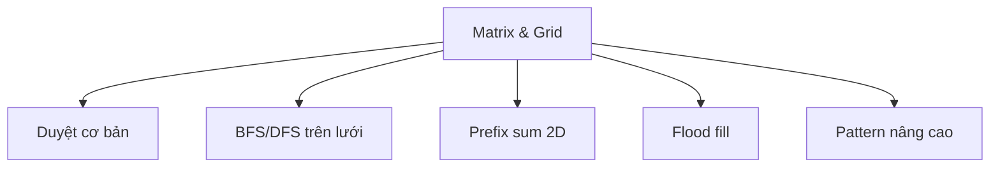

# C19: Matrix & Grid Pattern

> **Tác giả:** Hà Trí Kiên<br>
> **Chủ đề:** BFS/DFS trên lưới, prefix sum 2D, flood fill, pattern thi đấu

---

## 1. Tổng quan

Bài này tổng hợp các **pattern xử lý ma trận / lưới 2D** thường gặp trong thi đấu.



---

## 2. Duyệt cơ bản

### 2.1. Duyệt theo hàng, cột

```cpp
#include <bits/stdc++.h>
using namespace std;

int main() {
    int n = 3, m = 4;
    vector<vector<int>> a = {
        {1, 2, 3, 4},
        {5, 6, 7, 8},
        {9, 10, 11, 12}
    };
    
    // Duyệt theo hàng
    cout << "Theo hang:" << endl;
    for (int i = 0; i < n; i++) {
        for (int j = 0; j < m; j++) {
            cout << a[i][j] << " ";
        }
        cout << endl;
    }
    
    // Duyệt theo cột
    cout << "Theo cot:" << endl;
    for (int j = 0; j < m; j++) {
        for (int i = 0; i < n; i++) {
            cout << a[i][j] << " ";
        }
        cout << endl;
    }
    
    return 0;
}
```

### 2.2. Duyệt đường chéo chính

```cpp
// Đường chéo chính (từ trái trên sang phải dưới)
for (int i = 0; i < n; i++) {
    cout << a[i][i] << " ";  // (0,0), (1,1), (2,2), ...
}

// Đường chéo phụ (từ phải trên sang trái dưới)
for (int i = 0; i < n; i++) {
    cout << a[i][n - 1 - i] << " ";  // (0,n-1), (1,n-2), ...
}
```

### 2.3. Duyệt tất cả đường chéo

```cpp
// Tất cả đường chéo từ trái sang phải
for (int d = 0; d < n + m - 1; d++) {
    int start_i = max(0, d - m + 1);
    int end_i = min(n - 1, d);
    
    for (int i = start_i; i <= end_i; i++) {
        int j = d - i;
        cout << a[i][j] << " ";
    }
    cout << endl;
}
```

### 2.4. Duyệt hình xoắn ốc

```cpp
#include <bits/stdc++.h>
using namespace std;

vector<int> spiralOrder(vector<vector<int>>& matrix) {
    vector<int> result;
    if (matrix.empty()) return result;
    
    int n = matrix.size(), m = matrix[0].size();
    int top = 0, bottom = n - 1, left = 0, right = m - 1;
    
    while (top <= bottom && left <= right) {
        // Duyệt từ trái sang phải
        for (int j = left; j <= right; j++)
            result.push_back(matrix[top][j]);
        top++;
        
        // Duyệt từ trên xuống dưới
        for (int i = top; i <= bottom; i++)
            result.push_back(matrix[i][right]);
        right--;
        
        // Duyệt từ phải sang trái
        if (top <= bottom) {
            for (int j = right; j >= left; j--)
                result.push_back(matrix[bottom][j]);
            bottom--;
        }
        
        // Duyệt từ dưới lên trên
        if (left <= right) {
            for (int i = bottom; i >= top; i--)
                result.push_back(matrix[i][left]);
            left++;
        }
    }
    
    return result;
}
```

---

## 3. BFS/DFS trên lưới

### 3.1. Mảng hướng di chuyển

```cpp
// 4 hướng: lên, xuống, trái, phải
int dx4[] = {0, 0, 1, -1};
int dy4[] = {1, -1, 0, 0};

// 8 hướng: bao gồm cả đường chéo
int dx8[] = {0, 0, 1, -1, 1, 1, -1, -1};
int dy8[] = {1, -1, 0, 0, 1, -1, 1, -1};
```

### 3.2. BFS trên lưới — Đường đi ngắn nhất

```cpp
#include <bits/stdc++.h>
using namespace std;

int dx[] = {0, 0, 1, -1};
int dy[] = {1, -1, 0, 0};

int main() {
    ios_base::sync_with_stdio(false);
    cin.tie(NULL);
    
    int n, m;
    cin >> n >> m;
    
    vector<vector<int>> a(n, vector<int>(m));
    for (int i = 0; i < n; i++)
        for (int j = 0; j < m; j++)
            cin >> a[i][j];
    
    // BFS từ (0,0) đến (n-1,m-1)
    vector<vector<int>> dist(n, vector<int>(m, -1));
    queue<pair<int,int>> q;
    
    dist[0][0] = 0;
    q.push({0, 0});
    
    while (!q.empty()) {
        auto [x, y] = q.front(); q.pop();
        
        for (int d = 0; d < 4; d++) {
            int nx = x + dx[d], ny = y + dy[d];
            if (nx >= 0 && nx < n && ny >= 0 && ny < m 
                && a[nx][ny] == 0 && dist[nx][ny] == -1) {
                dist[nx][ny] = dist[x][y] + 1;
                q.push({nx, ny});
            }
        }
    }
    
    cout << dist[n-1][m-1] << endl;
    return 0;
}
```

### 3.3. DFS trên lưới — Đếm thành phần liên thông

```cpp
#include <bits/stdc++.h>
using namespace std;

int dx[] = {0, 0, 1, -1};
int dy[] = {1, -1, 0, 0};

int n, m;
vector<vector<int>> a;
vector<vector<bool>> visited;

void dfs(int x, int y) {
    visited[x][y] = true;
    for (int d = 0; d < 4; d++) {
        int nx = x + dx[d], ny = y + dy[d];
        if (nx >= 0 && nx < n && ny >= 0 && ny < m 
            && !visited[nx][ny] && a[nx][ny] == a[x][y]) {
            dfs(nx, ny);
        }
    }
}

int main() {
    cin >> n >> m;
    a.assign(n, vector<int>(m));
    visited.assign(n, vector<bool>(m, false));
    
    for (int i = 0; i < n; i++)
        for (int j = 0; j < m; j++)
            cin >> a[i][j];
    
    int components = 0;
    for (int i = 0; i < n; i++) {
        for (int j = 0; j < m; j++) {
            if (!visited[i][j]) {
                dfs(i, j);
                components++;
            }
        }
    }
    
    cout << "So thanh phan lien thong: " << components << endl;
    return 0;
}
```

### 3.4. BFS nhiều nguồn

```cpp
#include <bits/stdc++.h>
using namespace std;

int dx[] = {0, 0, 1, -1};
int dy[] = {1, -1, 0, 0};

int main() {
    ios_base::sync_with_stdio(false);
    cin.tie(NULL);
    
    int n, m;
    cin >> n >> m;
    
    vector<vector<int>> dist(n, vector<int>(m, -1));
    queue<pair<int,int>> q;
    
    // Đọc lưới, tất cả ô có giá trị 1 là nguồn
    for (int i = 0; i < n; i++) {
        for (int j = 0; j < m; j++) {
            int x;
            cin >> x;
            if (x == 1) {
                dist[i][j] = 0;
                q.push({i, j});
            }
        }
    }
    
    // BFS từ tất cả nguồn cùng lúc
    while (!q.empty()) {
        auto [x, y] = q.front(); q.pop();
        for (int d = 0; d < 4; d++) {
            int nx = x + dx[d], ny = y + dy[d];
            if (nx >= 0 && nx < n && ny >= 0 && ny < m && dist[nx][ny] == -1) {
                dist[nx][ny] = dist[x][y] + 1;
                q.push({nx, ny});
            }
        }
    }
    
    // In khoảng cách ngắn nhất từ mỗi ô đến nguồn gần nhất
    for (int i = 0; i < n; i++) {
        for (int j = 0; j < m; j++) {
            cout << dist[i][j] << " ";
        }
        cout << endl;
    }
    
    return 0;
}
```

---

## 4. Prefix Sum 2D

### 4.1. Xây dựng prefix sum 2D

```cpp
#include <bits/stdc++.h>
using namespace std;

int main() {
    int n = 4, m = 5;
    vector<vector<int>> a = {
        {1, 2, 3, 4, 5},
        {6, 7, 8, 9, 10},
        {11, 12, 13, 14, 15},
        {16, 17, 18, 19, 20}
    };
    
    // Xây dựng prefix sum 2D
    // pref[i][j] = tổng các phần tử từ (0,0) đến (i,j)
    vector<vector<int>> pref(n + 1, vector<int>(m + 1, 0));
    for (int i = 1; i <= n; i++) {
        for (int j = 1; j <= m; j++) {
            pref[i][j] = a[i-1][j-1] 
                        + pref[i-1][j] 
                        + pref[i][j-1] 
                        - pref[i-1][j-1];
        }
    }
    
    // Tính tổng hình chữ nhật từ (r1,c1) đến (r2,c2)
    auto getSum = [&](int r1, int c1, int r2, int c2) {
        return pref[r2+1][c2+1] 
             - pref[r1][c2+1] 
             - pref[r2+1][c1] 
             + pref[r1][c1];
    };
    
    // Ví dụ: Tổng từ (1,1) đến (2,3)
    cout << getSum(1, 1, 2, 3) << endl;
    // 7 + 8 + 9 + 12 + 13 + 14 = 63
    
    return 0;
}
```

### 4.2. Công thức prefix sum 2D

```
Tổng hình chữ nhật (r1,c1) → (r2,c2):

S = pref[r2+1][c2+1] - pref[r1][c2+1] - pref[r2+1][c1] + pref[r1][c1]
```

```
Minh họa:

pref[r2+1][c2+1]  = tổng toàn bộ vùng xanh
  - pref[r1][c2+1] = trừ vùng đỏ (phía trên)
  - pref[r2+1][c1]  = trừ vùng vàng (bên trái)
  + pref[r1][c1]    = cộng lại vùng bị trừ 2 lần
```

### 4.3. Bài toán tìm hình chữ nhật có tổng lớn nhất

```cpp
#include <bits/stdc++.h>
using namespace std;

int main() {
    ios_base::sync_with_stdio(false);
    cin.tie(NULL);
    
    int n, m;
    cin >> n >> m;
    
    vector<vector<int>> a(n, vector<int>(m));
    for (int i = 0; i < n; i++)
        for (int j = 0; j < m; j++)
            cin >> a[i][j];
    
    // Prefix sum 2D
    vector<vector<int>> pref(n + 1, vector<int>(m + 1, 0));
    for (int i = 1; i <= n; i++)
        for (int j = 1; j <= m; j++)
            pref[i][j] = a[i-1][j-1] + pref[i-1][j] + pref[i][j-1] - pref[i-1][j-1];
    
    auto getSum = [&](int r1, int c1, int r2, int c2) {
        return pref[r2+1][c2+1] - pref[r1][c2+1] - pref[r2+1][c1] + pref[r1][c1];
    };
    
    // Duyệt tất cả hình chữ nhật
    int maxSum = INT_MIN;
    for (int r1 = 0; r1 < n; r1++) {
        for (int r2 = r1; r2 < n; r2++) {
            for (int c1 = 0; c1 < m; c1++) {
                for (int c2 = c1; c2 < m; c2++) {
                    maxSum = max(maxSum, getSum(r1, c1, r2, c2));
                }
            }
        }
    }
    
    cout << maxSum << endl;
    return 0;
}
```

---

## 5. Flood Fill

### 5.1. BFS Flood Fill

```cpp
#include <bits/stdc++.h>
using namespace std;

int dx[] = {0, 0, 1, -1};
int dy[] = {1, -1, 0, 0};

int main() {
    int n, m, startX, startY, newColor;
    cin >> n >> m >> startX >> startY >> newColor;
    
    vector<vector<int>> a(n, vector<int>(m));
    for (int i = 0; i < n; i++)
        for (int j = 0; j < m; j++)
            cin >> a[i][j];
    
    int oldColor = a[startX][startY];
    if (oldColor == newColor) {
        // In mảng nguyên
        for (int i = 0; i < n; i++) {
            for (int j = 0; j < m; j++) cout << a[i][j] << " ";
            cout << endl;
        }
        return 0;
    }
    
    // BFS flood fill
    queue<pair<int,int>> q;
    q.push({startX, startY});
    a[startX][startY] = newColor;
    
    while (!q.empty()) {
        auto [x, y] = q.front(); q.pop();
        for (int d = 0; d < 4; d++) {
            int nx = x + dx[d], ny = y + dy[d];
            if (nx >= 0 && nx < n && ny >= 0 && ny < m && a[nx][ny] == oldColor) {
                a[nx][ny] = newColor;
                q.push({nx, ny});
            }
        }
    }
    
    // In kết quả
    for (int i = 0; i < n; i++) {
        for (int j = 0; j < m; j++) cout << a[i][j] << " ";
        cout << endl;
    }
    
    return 0;
}
```

### 5.2. DFS Flood Fill (đệ quy)

```cpp
#include <bits/stdc++.h>
using namespace std;

int dx[] = {0, 0, 1, -1};
int dy[] = {1, -1, 0, 0};

int n, m;
vector<vector<int>> a;

void dfs(int x, int y, int oldColor, int newColor) {
    if (x < 0 || x >= n || y < 0 || y >= m) return;
    if (a[x][y] != oldColor) return;
    
    a[x][y] = newColor;
    for (int d = 0; d < 4; d++) {
        dfs(x + dx[d], y + dy[d], oldColor, newColor);
    }
}
```

!!! warning "Stack overflow với DFS đệ quy"
    Với lưới lớn ($n, m > 1000$), nên dùng **BFS** thay vì DFS đệ quy để tránh tràn stack.

---

## 6. Pattern nâng cao

### 6.1. Đếm số vùng liên thông

```cpp
#include <bits/stdc++.h>
using namespace std;

int dx[] = {0, 0, 1, -1};
int dy[] = {1, -1, 0, 0};

int main() {
    int n, m;
    cin >> n >> m;
    
    vector<string> grid(n);
    for (int i = 0; i < n; i++) cin >> grid[i];
    
    vector<vector<bool>> visited(n, vector<bool>(m, false));
    int regions = 0;
    
    for (int i = 0; i < n; i++) {
        for (int j = 0; j < m; j++) {
            if (!visited[i][j] && grid[i][j] == '#') {
                // BFS flood fill
                queue<pair<int,int>> q;
                q.push({i, j});
                visited[i][j] = true;
                
                while (!q.empty()) {
                    auto [x, y] = q.front(); q.pop();
                    for (int d = 0; d < 4; d++) {
                        int nx = x + dx[d], ny = y + dy[d];
                        if (nx >= 0 && nx < n && ny >= 0 && ny < m 
                            && !visited[nx][ny] && grid[nx][ny] == '#') {
                            visited[nx][ny] = true;
                            q.push({nx, ny});
                        }
                    }
                }
                
                regions++;
            }
        }
    }
    
    cout << "So vung: " << regions << endl;
    return 0;
}
```

### 6.2. Tìm đường đi trong mê cung

```cpp
#include <bits/stdc++.h>
using namespace std;

int dx[] = {0, 0, 1, -1};
int dy[] = {1, -1, 0, 0};

int main() {
    ios_base::sync_with_stdio(false);
    cin.tie(NULL);
    
    int n, m;
    cin >> n >> m;
    
    vector<string> grid(n);
    for (int i = 0; i < n; i++) cin >> grid[i];
    
    pair<int,int> start, finish;
    for (int i = 0; i < n; i++) {
        for (int j = 0; j < m; j++) {
            if (grid[i][j] == 'S') start = {i, j};
            if (grid[i][j] == 'F') finish = {i, j};
        }
    }
    
    // BFS tìm đường đi ngắn nhất
    vector<vector<int>> dist(n, vector<int>(m, -1));
    vector<vector<pair<int,int>>> parent(n, vector<pair<int,int>>(m, {-1, -1}));
    queue<pair<int,int>> q;
    
    dist[start.first][start.second] = 0;
    q.push(start);
    
    while (!q.empty()) {
        auto [x, y] = q.front(); q.pop();
        for (int d = 0; d < 4; d++) {
            int nx = x + dx[d], ny = y + dy[d];
            if (nx >= 0 && nx < n && ny >= 0 && ny < m 
                && grid[nx][ny] != '#' && dist[nx][ny] == -1) {
                dist[nx][ny] = dist[x][y] + 1;
                parent[nx][ny] = {x, y};
                q.push({nx, ny});
            }
        }
    }
    
    if (dist[finish.first][finish.second] == -1) {
        cout << "Khong tim thay duong" << endl;
    } else {
        cout << "Do dai duong di: " << dist[finish.first][finish.second] << endl;
        
        // Truy vết đường đi
        vector<pair<int,int>> path;
        for (auto p = finish; p != make_pair(-1, -1); p = parent[p.first][p.second]) {
            path.push_back(p);
        }
        reverse(path.begin(), path.end());
        
        for (auto [x, y] : path) {
            cout << "(" << x << "," << y << ") ";
        }
        cout << endl;
    }
    
    return 0;
}
```

---

## 7. Bài tập thực hành

### Bài 1: Đếm đảo
Cho lưới $n \times m$ gồm `0` và `1`. Đếm số đảo (vùng `1` liên thông).

<div class="cp-pg" data-language="cpp" data-starter="#include &lt;bits/stdc++.h&gt;\nusing namespace std;\n\nint main() {\n    // Viết code ở đây\n    return 0;\n}" data-input="4 5
1 1 0 0 0
1 1 0 0 0
0 0 1 0 0
0 0 0 1 1" data-expected="3" data-hint="Dùng BFS/DFS, gặp 1 thì quét hết vùng liên thông"></div>

??? tip "Lời giải"
    ```cpp
    #include <bits/stdc++.h>
    using namespace std;
    
    int dx[] = {0, 0, 1, -1};
    int dy[] = {1, -1, 0, 0};
    
    int main() {
        int n, m;
        cin >> n >> m;
        
        vector<vector<int>> a(n, vector<int>(m));
        for (int i = 0; i < n; i++)
            for (int j = 0; j < m; j++)
                cin >> a[i][j];
        
        int islands = 0;
        for (int i = 0; i < n; i++) {
            for (int j = 0; j < m; j++) {
                if (a[i][j] == 1) {
                    islands++;
                    queue<pair<int,int>> q;
                    q.push({i, j});
                    a[i][j] = 0;
                    while (!q.empty()) {
                        auto [x, y] = q.front(); q.pop();
                        for (int d = 0; d < 4; d++) {
                            int nx = x + dx[d], ny = y + dy[d];
                            if (nx >= 0 && nx < n && ny >= 0 && ny < m && a[nx][ny] == 1) {
                                a[nx][ny] = 0;
                                q.push({nx, ny});
                            }
                        }
                    }
                }
            }
        }
        
        cout << islands << endl;
        return 0;
    }
    ```

### Bài 2: Khoảng cách Manhattan
Cho $n$ điểm trên lưới. Tìm cặp điểm có khoảng cách Manhattan nhỏ nhất.

<div class="cp-pg" data-language="cpp" data-starter="#include &lt;bits/stdc++.h&gt;\nusing namespace std;\n\nint main() {\n    // Viết code ở đây\n    return 0;\n}" data-input="4
0 0
1 1
3 3
1 0" data-expected="1" data-hint="Duyệt tất cả cặp (i,j), tính |x1-x2| + |y1-y2|"></div>

??? tip "Lời giải"
    ```cpp
    #include <bits/stdc++.h>
    using namespace std;
    
    int main() {
        int n;
        cin >> n;
        
        vector<pair<int,int>> points(n);
        for (int i = 0; i < n; i++) cin >> points[i].first >> points[i].second;
        
        int minDist = INT_MAX;
        for (int i = 0; i < n; i++) {
            for (int j = i + 1; j < n; j++) {
                int dist = abs(points[i].first - points[j].first) 
                         + abs(points[i].second - points[j].second);
                minDist = min(minDist, dist);
            }
        }
        
        cout << minDist << endl;
        return 0;
    }
    ```

---

## Bài viết liên quan

- [C04: Mảng & Vector →](C04-mang-vector.md)
- [C10: Vector nâng cao →](C10-vector-nang-cao.md)
- [C13: queue, stack, deque →](C13-queue-stack-deque.md)

---

**Bài tiếp theo:** [C20: Lambda & Iterator Pattern →](C20-lambda-iterator.md)
