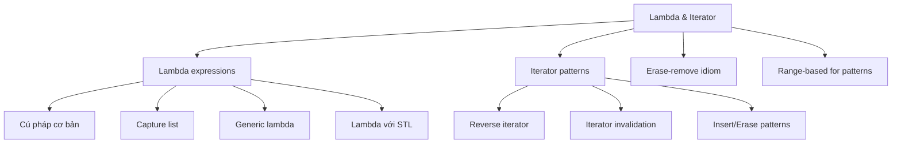

# C20: Lambda & Iterator Pattern

> **Tác giả:** Hà Trí Kiên<br>
> **Chủ đề:** Lambda expressions, iterator patterns, erase-remove idiom, range-based for

---

## 1. Tổng quan

Bài này tổng hợp các **pattern nâng cao** với lambda và iterator — thường gặp trong thi đấu và lập trình hiện đại.



---

## 2. Lambda Expressions

### 2.1. Cú pháp cơ bản

```cpp
// Cú pháp: [capture](parameters) -> return_type { body }

// Lambda không tham số, không trả về
auto hello = []() { cout << "Hello!" << endl; };
hello();  // Hello!

// Lambda có tham số
auto add = [](int a, int b) { return a + b; };
cout << add(3, 5) << endl;  // 8

// Lambda với return type rõ ràng
auto divide = [](double a, double b) -> double {
    if (b == 0) return 0;
    return a / b;
};
```

### 2.2. Capture list — Biến bên ngoài

```cpp
#include <bits/stdc++.h>
using namespace std;

int main() {
    int x = 10;
    int y = 20;
    
    // Capture by value (sao chép)
    auto f1 = [x, y]() { return x + y; };
    cout << f1() << endl;  // 30
    
    // Capture by reference (tham chiếu)
    auto f2 = [&x, &y]() { x++; y++; };
    f2();
    cout << x << " " << y << endl;  // 11 21
    
    // Capture tất cả by value
    auto f3 = [=]() { return x + y; };
    
    // Capture tất cả by reference
    auto f4 = [&]() { x++; y++; };
    
    // Mixed: x by value, y by reference
    auto f5 = [x, &y]() { y += x; };
    
    return 0;
}
```

### 2.3. Generic Lambda (C++14)

```cpp
#include <bits/stdc++.h>
using namespace std;

int main() {
    // Lambda với auto parameter (generic)
    auto print = [](const auto &v) {
        for (const auto &x : v) cout << x << " ";
        cout << endl;
    };
    
    vector<int> a = {1, 2, 3};
    vector<string> b = {"hello", "world"};
    
    print(a);  // 1 2 3
    print(b);  // hello world
    
    // Generic lambda với nhiều tham số
    auto max_val = [](const auto &a, const auto &b) {
        return a > b ? a : b;
    };
    
    cout << max_val(3, 5) << endl;       // 5
    cout << max_val(3.14, 2.71) << endl;  // 3.14
    
    return 0;
}
```

### 2.4. Lambda với STL

```cpp
#include <bits/stdc++.h>
using namespace std;

int main() {
    vector<int> a = {5, 2, 8, 1, 9, 3};
    
    // sort với lambda
    sort(a.begin(), a.end(), [](int x, int y) {
        return x > y;  // Giảm dần
    });
    
    // find_if với lambda
    auto it = find_if(a.begin(), a.end(), [](int x) {
        return x % 2 == 0;  // Tìm số chẵn đầu tiên
    });
    
    // count_if với lambda
    int cnt = count_if(a.begin(), a.end(), [](int x) {
        return x > 5;
    });
    
    // for_each với lambda
    for_each(a.begin(), a.end(), [](int &x) {
        x *= 2;
    });
    
    // transform với lambda
    vector<int> b(a.size());
    transform(a.begin(), a.end(), b.begin(), [](int x) {
        return x * x;
    });
    
    return 0;
}
```

### 2.5. Lambda đệ quy

```cpp
#include <bits/stdc++.h>
using namespace std;

int main() {
    // Lambda đệ quy với std::function
    function<int(int)> fib = [&](int n) -> int {
        if (n <= 1) return n;
        return fib(n - 1) + fib(n - 2);
    };
    
    for (int i = 0; i < 10; i++) {
        cout << fib(i) << " ";
    }
    cout << endl;
    // Output: 0 1 1 2 3 5 8 13 21 34
    
    // Lambda đệ quy với Y-combinator (C++23 hoặc custom)
    // Không khuyến nghị cho thi đấu, dùng function<> cho đơn giản
    
    return 0;
}
```

---

## 3. Iterator Patterns

### 3.1. Reverse Iterator

```cpp
#include <bits/stdc++.h>
using namespace std;

int main() {
    vector<int> a = {1, 2, 3, 4, 5};
    
    // Duyệt ngược
    for (auto it = a.rbegin(); it != a.rend(); ++it) {
        cout << *it << " ";
    }
    cout << endl;
    // Output: 5 4 3 2 1
    
    // Tìm phần tử cuối cùng thỏa mãn điều kiện
    auto it = find_if(a.rbegin(), a.rend(), [](int x) {
        return x % 2 == 0;
    });
    if (it != a.rend()) {
        cout << "So chan cuoi cung: " << *it << endl;  // 4
    }
    
    return 0;
}
```

### 3.2. Iterator Invalidation — Lỗi thường gặp

```cpp
#include <bits/stdc++.h>
using namespace std;

int main() {
    vector<int> a = {1, 2, 3, 4, 5, 6, 7, 8, 9, 10};
    
    // SAI: Xóa phần tử trong vòng for duyệt iterator
    // for (auto it = a.begin(); it != a.end(); ++it) {
    //     if (*it % 2 == 0) a.erase(it);  // LỖI: iterator bị invalidate
    // }
    
    // ĐÚNG: erase trả về iterator mới
    for (auto it = a.begin(); it != a.end(); ) {
        if (*it % 2 == 0) {
            it = a.erase(it);  // erase trả về iterator sau phần tử bị xóa
        } else {
            ++it;
        }
    }
    
    for (int x : a) cout << x << " ";
    cout << endl;
    // Output: 1 3 5 7 9
    
    return 0;
}
```

### 3.3. Insert với Iterator

```cpp
#include <bits/stdc++.h>
using namespace std;

int main() {
    vector<int> a = {1, 2, 5, 6};
    
    // Chèn 3, 4 trước vị trí 5
    auto it = find(a.begin(), a.end(), 5);
    a.insert(it, {3, 4});  // Chèn danh sách
    
    for (int x : a) cout << x << " ";
    cout << endl;
    // Output: 1 2 3 4 5 6
    
    // Chèn từ vector khác
    vector<int> b = {10, 20};
    a.insert(a.end(), b.begin(), b.end());
    
    for (int x : a) cout << x << " ";
    cout << endl;
    // Output: 1 2 3 4 5 6 10 20
    
    return 0;
}
```

### 3.4. advance / next / prev / distance

```cpp
#include <bits/stdc++.h>
using namespace std;

int main() {
    vector<int> a = {10, 20, 30, 40, 50};
    
    // next: iterator cách k vị trí (không thay đổi iterator gốc)
    auto it = next(a.begin(), 2);
    cout << *it << endl;  // 30
    
    // prev: iterator lùi k vị trí
    auto it2 = prev(a.end(), 1);
    cout << *it2 << endl;  // 50
    
    // advance: di chuyển iterator (thay đổi iterator gốc)
    auto it3 = a.begin();
    advance(it3, 3);
    cout << *it3 << endl;  // 40
    
    // distance: khoảng cách giữa 2 iterator
    int d = distance(a.begin(), a.end());
    cout << d << endl;  // 5
    
    return 0;
}
```

---

## 4. Erase-Remove Idiom

### 4.1. Xóa phần tử thỏa mãn điều kiện

```cpp
#include <bits/stdc++.h>
using namespace std;

int main() {
    vector<int> a = {1, 2, 3, 4, 5, 6, 7, 8, 9, 10};
    
    // Xóa tất cả số chẵn
    // Bước 1: remove_if di chuyển phần tử không bị xóa lên đầu
    // Bước 2: erase xóa phần tử thừa ở cuối
    a.erase(remove_if(a.begin(), a.end(), [](int x) {
        return x % 2 == 0;
    }), a.end());
    
    for (int x : a) cout << x << " ";
    cout << endl;
    // Output: 1 3 5 7 9
    
    return 0;
}
```

### 4.2. Xóa phần tử trùng lặp

```cpp
#include <bits/stdc++.h>
using namespace std;

int main() {
    vector<int> a = {1, 2, 2, 3, 3, 3, 4, 4, 4, 4};
    
    // unique chỉ hoạt động trên mảng đã sắp xếp
    a.erase(unique(a.begin(), a.end()), a.end());
    
    for (int x : a) cout << x << " ";
    cout << endl;
    // Output: 1 2 3 4
    
    return 0;
}
```

### 4.3. Xóa phần tử trong map/set

```cpp
#include <bits/stdc++.h>
using namespace std;

int main() {
    map<string, int> mp = {{"a", 1}, {"b", 2}, {"c", 3}, {"d", 4}};
    
    // Xóa phần tử có giá trị <= 2
    for (auto it = mp.begin(); it != mp.end(); ) {
        if (it->second <= 2) {
            it = mp.erase(it);
        } else {
            ++it;
        }
    }
    
    for (auto [k, v] : mp) {
        cout << k << ": " << v << endl;
    }
    // Output:
    // c: 3
    // d: 4
    
    return 0;
}
```

---

## 5. Range-based For Patterns

### 5.1. Duyệt với auto& vs const auto&

```cpp
#include <bits/stdc++.h>
using namespace std;

int main() {
    vector<int> a = {1, 2, 3, 4, 5};
    
    // const auto&: chỉ đọc, không sửa
    for (const auto &x : a) {
        cout << x << " ";
    }
    cout << endl;
    
    // auto&: sửa được
    for (auto &x : a) {
        x *= 2;
    }
    
    // auto: sao chép (không nên dùng với object lớn)
    for (auto x : a) {
        cout << x << " ";
    }
    cout << endl;
    
    return 0;
}
```

### 5.2. Duyệt map

```cpp
#include <bits/stdc++.h>
using namespace std;

int main() {
    map<string, int> mp = {{"apple", 3}, {"banana", 1}, {"cherry", 2}};
    
    // C++17: structured bindings
    for (const auto &[key, value] : mp) {
        cout << key << " -> " << value << endl;
    }
    
    // C++11/14
    for (const auto &p : mp) {
        cout << p.first << " -> " << p.second << endl;
    }
    
    return 0;
}
```

### 5.3. Duyệt với index

```cpp
#include <bits/stdc++.h>
using namespace std;

int main() {
    vector<int> a = {10, 20, 30, 40, 50};
    
    // Cách 1: traditional for (khuyến nghị cho thi đấu)
    for (int i = 0; i < (int)a.size(); i++) {
        cout << i << ": " << a[i] << endl;
    }
    
    // Cách 2: enumerate pattern
    int idx = 0;
    for (const auto &x : a) {
        cout << idx++ << ": " << x << endl;
    }
    
    return 0;
}
```

### 5.4. Duyệt nhiều container cùng lúc

```cpp
#include <bits/stdc++.h>
using namespace std;

int main() {
    vector<int> keys = {1, 2, 3, 4, 5};
    vector<string> values = {"one", "two", "three", "four", "five"};
    
    // Duyệt song song (giả sử cùng kích thước)
    for (int i = 0; i < (int)keys.size(); i++) {
        cout << keys[i] << " -> " << values[i] << endl;
    }
    
    // Hoặc dùng zip pattern (C++ không có zip, tự implement)
    auto zip = [](const auto &a, const auto &b) {
        vector<pair<
            typename decltype(a)::value_type,
            typename decltype(b)::value_type
        >> result;
        size_t n = min(a.size(), b.size());
        for (size_t i = 0; i < n; i++) {
            result.emplace_back(a[i], b[i]);
        }
        return result;
    };
    
    for (const auto &[k, v] : zip(keys, values)) {
        cout << k << " -> " << v << endl;
    }
    
    return 0;
}
```

---

## 6. Pattern thường gặp trong thi đấu

### 6.1. Custom comparator với lambda

```cpp
#include <bits/stdc++.h>
using namespace std;

int main() {
    // Sắp xếp pair theo second giảm dần, nếu bằng thì theo first tăng dần
    vector<pair<int,int>> a = {{1, 3}, {2, 1}, {3, 3}, {4, 2}};
    
    sort(a.begin(), a.end(), [](const auto &x, const auto &y) {
        if (x.second != y.second) return x.second > y.second;
        return x.first < y.first;
    });
    
    for (auto [x, y] : a) {
        cout << "(" << x << "," << y << ") ";
    }
    cout << endl;
    // Output: (1,3) (3,3) (4,2) (2,1)
    
    return 0;
}
```

### 6.2. Priority queue với lambda

```cpp
#include <bits/stdc++.h>
using namespace std;

int main() {
    // Min-heap với lambda
    auto cmp = [](const pair<int,int> &a, const pair<int,int> &b) {
        return a.first > b.first;  // Min-heap
    };
    
    priority_queue<pair<int,int>, vector<pair<int,int>>, decltype(cmp)> pq(cmp);
    
    pq.push({3, 100});
    pq.push({1, 200});
    pq.push({2, 300});
    
    while (!pq.empty()) {
        auto [val, id] = pq.top(); pq.pop();
        cout << val << " ";
    }
    cout << endl;
    // Output: 1 2 3
    
    return 0;
}
```

### 6.3. Accumulate với lambda

```cpp
#include <bits/stdc++.h>
using namespace std;

int main() {
    vector<int> a = {1, 2, 3, 4, 5};
    
    // Tổng bình phương
    int sumSq = accumulate(a.begin(), a.end(), 0,
        [](int acc, int x) { return acc + x * x; });
    cout << sumSq << endl;  // 55
    
    // Tìm max bằng accumulate
    int maxVal = accumulate(a.begin(), a.end(), INT_MIN,
        [](int acc, int x) { return max(acc, x); });
    cout << maxVal << endl;  // 5
    
    return 0;
}
```

---

## 7. Bài tập thực hành

### Bài 1: Sắp xếp theo tần suất
Cho mảng $n$ số nguyên. Sắp xếp các phần tử theo tần suất xuất hiện giảm dần. Nếu bằng tần suất, sắp xếp theo giá trị tăng dần.

<div class="cp-pg" data-language="cpp" data-starter="#include &lt;bits/stdc++.h&gt;\nusing namespace std;\n\nint main() {\n    // Viết code ở đây\n    return 0;\n}" data-input="6
2 3 2 1 3 3" data-expected="3 3 3 2 2 1" data-hint="Dùng map đếm freq, sort với lambda so sánh freq[x] và giá trị"></div>

??? tip "Lời giải"
    ```cpp
    #include <bits/stdc++.h>
    using namespace std;
    
    int main() {
        int n;
        cin >> n;
        
        vector<int> a(n);
        for (int i = 0; i < n; i++) cin >> a[i];
        
        map<int, int> freq;
        for (int x : a) freq[x]++;
        
        sort(a.begin(), a.end(), [&](int x, int y) {
            if (freq[x] != freq[y]) return freq[x] > freq[y];
            return x < y;
        });
        
        // Xóa trùng (giữ thứ tự)
        a.erase(unique(a.begin(), a.end()), a.end());
        
        for (int x : a) {
            for (int i = 0; i < freq[x]; i++) cout << x << " ";
        }
        cout << endl;
        
        return 0;
    }
    ```

### Bài 2: Top-K frequent elements
Cho mảng $n$ số nguyên và số $k$. Tìm $k$ phần tử xuất hiện nhiều nhất.

<div class="cp-pg" data-language="cpp" data-starter="#include &lt;bits/stdc++.h&gt;\nusing namespace std;\n\nint main() {\n    // Viết code ở đây\n    return 0;\n}" data-input="6 2
1 1 2 2 2 3" data-expected="2 1" data-hint="Dùng map đếm freq, sort vector pair theo second giảm dần"></div>

??? tip "Lời giải"
    ```cpp
    #include <bits/stdc++.h>
    using namespace std;
    
    int main() {
        int n, k;
        cin >> n >> k;
        
        vector<int> a(n);
        for (int i = 0; i < n; i++) cin >> a[i];
        
        map<int, int> freq;
        for (int x : a) freq[x]++;
        
        vector<pair<int,int>> items(freq.begin(), freq.end());
        sort(items.begin(), items.end(), [](const auto &x, const auto &y) {
            return x.second > y.second;
        });
        
        for (int i = 0; i < k && i < (int)items.size(); i++) {
            cout << items[i].first << " ";
        }
        cout << endl;
        
        return 0;
    }
    ```

---

## Bài viết liên quan

- [C06: Hàm trong C++ →](C06-ham.md)
- [C10: Vector nâng cao →](C10-vector-nang-cao.md)
- [C11: sort & algorithm →](C11-sort-algorithm.md)

---

**Quay lại:** [Chương 2: C++ cho Thi Đấu](index.md)
