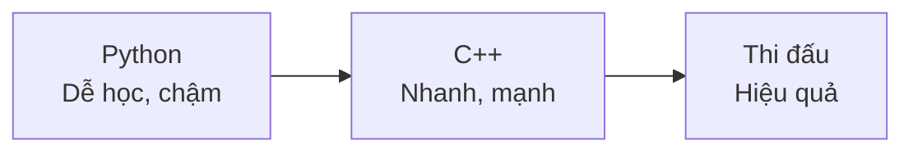
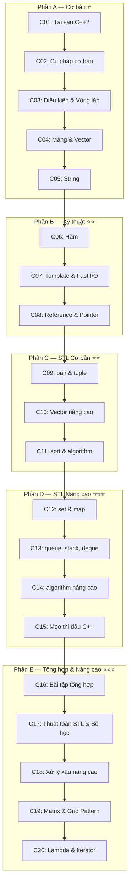

# Chương 2: C++ cho Thi Đấu

> **Dành cho:** Người đã vững Python 
> **Mục tiêu:** Nắm vững C++ và STL để thi đấu competitive programming

---

## Tại sao chuyển sang C++?

- **Nhanh hơn Python** ~10-100 lần về tốc độ chạy
- **STL mạnh mẽ**: Nhiều cấu trúc dữ liệu và thuật toán sẵn có
- **Phổ biến**: Hầu hết thí sinh thi đấu dùng C++
- **Kiểm soát bộ nhớ**: Chủ động hơn so với Python

!!! warning "Lưu ý khi chuyển từ Python sang C++"
    - C++ **khó hơn** Python về cú pháp
    - Phải **khai báo kiểu dữ liệu**
    - Phải **quản lý bộ nhớ** (ít nhất với vector, string)
    - Phải **compile** trước khi chạy
    - Nhưng **nhanh hơn rất nhiều**!

---

## Tổng quan nội dung

---

## Danh sách bài học

### Phần A — Cơ bản ⭐

| # | Bài học | Mô tả | So sánh Python |
|---|---------|-------|----------------|
| C01 | [Tại sao C++?](C01-tai-sao-cpp.md) | Tốc độ, STL, compile, IDE | Python vs C++ |
| C02 | [Cú pháp cơ bản](C02-cu-phap-co-ban.md) | Biến, kiểu dữ liệu, nhập/xuất | `int x = 5;` vs `x = 5` |
| C03 | [Điều kiện & Vòng lặp](C03-dieu-kien-vong-lap.md) | if/else, for, while | `for(int i=0;i<n;i++)` vs `for i in range(n)` |
| C04 | [Mảng & Vector](C04-mang-vector.md) | Mảng tĩnh, vector | `vector<int> a(n)` vs `a = [0]*n` |
| C05 | [String](C05-string.md) | Chuỗi C++ | `string s` vs `s = ""` |

### Phần B — Kỹ thuật ⭐⭐

| # | Bài học | Mô tả | So sánh Python |
|---|---------|-------|----------------|
| C06 | [Hàm](C06-ham.md) | Định nghĩa, overload, template | Kiểu dữ liệu rõ ràng |
| C07 | [Template & Fast I/O](C07-template-fast-io.md) | Template thi đấu, tối ưu I/O | `ios_base::sync_with_stdio(false)` |
| C08 | [Reference & Pointer](C08-reference-pointer.md) | Tham chiếu, con trỏ | Truyền giá trị vs tham chiếu |

### Phần C — STL Cơ bản ⭐⭐

| # | Bài học | Mô tả | So sánh Python |
|---|---------|-------|----------------|
| C09 | [pair & tuple](C09-pair-tuple.md) | `pair`, `tuple` | Tuple Python |
| C10 | [Vector nâng cao](C10-vector-nang-cao.md) | `vector`, iterator, resize | List Python |
| C11 | [sort & algorithm](C11-sort-algorithm.md) | `sort`, `reverse`, `unique` | `sorted()` Python |

### Phần D — STL Nâng cao ⭐⭐⭐

| # | Bài học | Mô tả | So sánh Python |
|---|---------|-------|----------------|
| C12 | [set & map](C12-set-map.md) | `set`, `multiset`, `map`, `unordered_*` | Dict/Set Python |
| C13 | [queue, stack, deque](C13-queue-stack-deque.md) | `queue`, `stack`, `deque`, `priority_queue` | deque, heapq Python |
| C14 | [algorithm nâng cao](C14-algorithm-nang-cao.md) | `lower_bound`, `upper_bound`, `next_permutation` | bisect, itertools |
| C15 | [Mẹo thi đấu C++](C15-meo-thi-dau-cpp.md) | Trick, macro, cheat sheet | Bảng so sánh |

### Phần E — Tổng hợp & Nâng cao ⭐⭐⭐

| # | Bài học | Mô tả | So sánh Python |
|---|---------|-------|----------------|
| C16 | [Bài tập tổng hợp](C16-bai-tap-tong-hop.md) | 18 bài tập từ dễ đến khó, 20 bài CSES | [P20](../python/P20-bai-tap-tong-hop.md) |
| C17 | [Thuật toán STL & Số học](C17-thuat-toan-stl.md) | `<numeric>`, bitmask, modular, sieve | [P16](../python/P16-itertools.md), [P18](../python/P18-math-builtins.md) |
| C18 | [Xử lý xâu nâng cao](C18-xu-ly-xau-nang-cao.md) | stringstream, getline, regex, pattern | [P08](../python/P08-string.md) |
| C19 | [Matrix & Grid Pattern](C19-matrix-pattern.md) | BFS/DFS lưới, prefix sum 2D, flood fill | [P10](../python/P10-array-2d.md) |
| C20 | [Lambda & Iterator](C20-lambda-iterator.md) | Lambda, iterator pattern, erase-remove | [P13](../python/P13-ham.md) |

### Phần F — Tham chiếu nhanh

| # | Bài học | Mô tả | So sánh Python |
|---|---------|-------|----------------|
| C21 | [Tham chiếu nhanh](C21-tham-chieu-nhanh.md) | memset, memcpy, scanf/printf nâng cao, auto, freopen, bitset, tips | — |

---

## So sánh nhanh Python vs C++

| | Python | C++ |
|---|--------|-----|
| Tốc độ | Chậm | Nhanh |
| Cú pháp | Đơn giản | Phức tạp hơn |
| Kiểu dữ liệu | Tự động | Phải khai báo |
| Compile | Không cần | Phải compile |
| Bộ nhớ | Tự quản lý | Chủ động hơn |
| Thư viện | Nhiều built-in | STL mạnh mẽ |

---

## Bài tập luyện tập

- **[CSES Problem Set](https://cses.fi/problemset/)** — Bộ bài tập cơ bản
- **[VNOJ](https://oj.vnoi.info/)** — OJ Việt Nam
- **[Codeforces](https://codeforces.com/)** — Contest online

---

## Bài viết liên quan

- [Chương 1: Python cho Thi Đấu](../python/index.md)
- [Tổng quan Lập trình Cơ Bản](../index.md)
