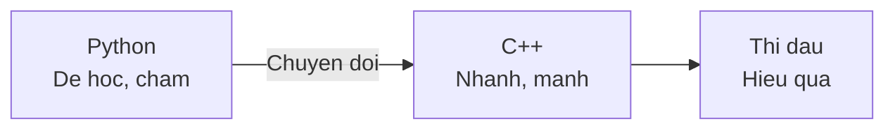

# Chương 2: C++ cho Thi Đấu — Từ Zero đến Hero

> **Dành cho:** Người đã biết Python cơ bản (hoặc ngôn ngữ bất kỳ)<br>
> **Mục tiêu:** Viết được code C++, sử dụng STL, thi đấu competitive programming hiệu quả

---

## Tại sao học C++?

Nếu Python là **xe đạp** (dễ lái, chậm) thì C++ là **xe máy** (khó hơn một chút, nhưng **nhanh gấp 100 lần**).



| Tiêu chí | Python | C++ |
|----------|--------|-----|
| **Tốc độ** | ~10⁶ phép tính/giây | **~10⁸ phép tính/giây** |
| **Cú pháp** | Đơn giản | Phức tạp hơn một chút |
| **Compile** | Chạy trực tiếp | Phải compile trước |
| **Thư viện** | Nhiều built-in | **STL rất mạnh** |
| **Đệ quy** | Giới hạn ~1000 lớp | Giới hạn lớn hơn nhiều |

!!! tip "Khi nào dùng Python, khi nào dùng C++?"
    - **Dùng Python khi:** Học thuật toán mới, viết nhanh prototype, bài không yêu cầu tốc độ
    - **Dùng C++ khi:** Thi đấu chính thức, bài yêu cầu tốc độ, cần STL nâng cao

---

## Lộ trình học C++ cho người mới

!!! info "Học theo thứ tự từ trên xuống"
    Mỗi nhóm xây dựng trên kiến thức nhóm trước. **Đừng nhảy cóc!**

```mermaid
flowchart TD
    subgraph G1["Nhom 1 - Bat dau (Tuan 1-2)"]
        C01["C01: Cai dat & Hello World"]
        C02["C02: Bien, Kieu du lieu, Nhap/Xuat"]
        C03["C03: Dieu kien & Vong lap"]
    end
    subgraph G2["Nhom 2 - Xu ly du lieu (Tuan 3-4)"]
        C04["C04: Mang & Vector"]
        C05["C05: String (Xau ky tu)"]
    end
    subgraph G3["Nhom 3 - To chuc code (Tuan 5)"]
        C06["C06: Ham trong C++"]
        C07["C07: Template & Fast I/O"]
    end
    subgraph G4["Nhom 4 - STL co ban (Tuan 6-7)"]
        C09["C09: Pair & Tuple"]
        C11["C11: Sort & Algorithm"]
        C13["C13: Queue, Stack, Deque"]
    end
    subgraph G5["Nhom 5 - STL nang cao (Tuan 8-9)"]
        C10["C10: Vector nang cao"]
        C12["C12: Set & Map"]
        C14["C14: Algorithm nang cao"]
    end
    subgraph G6["Nhom 6 - Thi dau (Tuan 10)"]
        C15["C15: Meo thi dau C++"]
        C08["C08: Reference & Pointer"]
    end
    subgraph G7["Nhom 7 - Nang cao (Tuan 11+)"]
        C16["C16: Bai tap tong hop"]
        C17["C17: STL & So hoc"]
        C18["C18: Xu ly xau nang cao"]
        C19["C19: Matrix & Grid"]
        C20["C20: Lambda & Iterator"]
        C21["C21: Tham chieu nhanh"]
        C22["C22: Struct & Operator Overloading"]
    end
    G1 --> G2 --> G3 --> G4 --> G5 --> G6 --> G7
```



---

## Danh sách bài học chi tiết

### Nhóm 1 — Bắt đầu (Tuần 1-2)

> **Mục tiêu:** Viết được chương trình C++ đơn giản, hiểu cú pháp cơ bản

| # | Bài học | Bạn sẽ học được | So sánh Python |
|---|---------|-----------------|----------------|
| C01 | [Cài đặt & Hello World](C01-tai-sao-cpp.md) | Cài compiler, IDE, chương trình đầu tiên | `print("Hello")` → `cout << "Hello"` |
| C02 | [Biến & Kiểu dữ liệu](C02-cu-phap-co-ban.md) | Khai báo biến, nhập/xuất, toán tử | `x = 10` → `int x = 10;` |
| C03 | [Điều kiện & Vòng lặp](C03-dieu-kien-vong-lap.md) | if/else, for, while | `for i in range(n)` → `for(int i=0;i<n;i++)` |

### Nhóm 2 — Xử lý dữ liệu (Tuần 3-4)

> **Mục tiêu:** Làm việc được với mảng và chuỗi — 2 kiểu dữ liệu phổ biến nhất

| # | Bài học | Bạn sẽ học được | So sánh Python |
|---|---------|-----------------|----------------|
| C04 | [Mảng & Vector](C04-mang-vector.md) | Mảng tĩnh, vector, duyệt, thao tác | `a = [0]*n` → `vector<int> a(n)` |
| C05 | [String](C05-string.md) | Chuỗi C++, các phương thức | `s = "hello"` → `string s = "hello";` |

### Nhóm 3 — Tổ chức code (Tuần 5)

> **Mục tiêu:** Viết code sạch, tái sử dụng được, chạy nhanh

| # | Bài học | Bạn sẽ học được | So sánh Python |
|---|---------|-----------------|----------------|
| C06 | [Hàm trong C++](C06-ham.md) | Định nghĩa hàm, overload, template | `def f(x):` → `int f(int x)` |
| C07 | [Template & Fast I/O](C07-template-fast-io.md) | Template thi đấu, tối ưu I/O | Tăng tốc nhập/xuất gấp 10 lần |

### Nhóm 4 — STL cơ bản (Tuần 6-7)

> **Mục tiêu:** Sử dụng được các cấu trúc dữ liệu cơ bản trong thi đấu

| # | Bài học | Bạn sẽ học được | So sánh Python |
|---|---------|-----------------|----------------|
| C09 | [Pair & Tuple](C09-pair-tuple.md) | Gom nhóm 2-3 giá trị | Tuple Python |
| C11 | [Sort & Algorithm](C11-sort-algorithm.md) | Sắp xếp, reverse, unique | `sorted()` Python |
| C13 | [Queue, Stack, Deque](C13-queue-stack-deque.md) | Hàng đợi, ngăn xếp, deque | deque, heapq Python |

### Nhóm 5 — STL nâng cao (Tuần 8-9)

> **Mục tiêu:** Sử dụng thành thạo các cấu trúc dữ liệu mạnh mẽ

| # | Bài học | Bạn sẽ học được | So sánh Python |
|---|---------|-----------------|----------------|
| C10 | [Vector nâng cao](C10-vector-nang-cao.md) | Iterator, resize, 2D vector | List nâng cao |
| C12 | [Set & Map](C12-set-map.md) | set, multiset, map, unordered_* | Dict/Set Python |
| C14 | [Algorithm nâng cao](C14-algorithm-nang-cao.md) | lower_bound, upper_bound, next_permutation | bisect, itertools |

### Nhóm 6 — Thi đấu (Tuần 10)

> **Mục tiêu:** Sẵn sàng thi đấu, biết các trick quan trọng

| # | Bài học | Bạn sẽ học được |
|---|---------|-----------------|
| C15 | [Mẹo thi đấu C++](C15-meo-thi-dau-cpp.md) | Macro, template, cheat sheet, trick hay |
| C08 | [Reference & Pointer](C08-reference-pointer.md) | Tham chiếu, con trỏ (nâng cao hơn) |

### Nhóm 7 — Nâng cao (Tuần 11+)

> **Mục tiêu:** Nắm vững các kỹ thuật nâng cao cho bài khó

| # | Bài học | Bạn sẽ học được |
|---|---------|-----------------|
| C16 | [Bài tập tổng hợp](C16-bai-tap-tong-hop.md) | 18 bài tập + 20 bài CSES |
| C17 | [STL & Số học](C17-thuat-toan-stl.md) | numeric, bitmask, modular, sieve |
| C18 | [Xử lý xâu nâng cao](C18-xu-ly-xau-nang-cao.md) | stringstream, getline, pattern |
| C19 | [Matrix & Grid](C19-matrix-pattern.md) | BFS/DFS lưới, prefix sum 2D |
| C20 | [Lambda & Iterator](C20-lambda-iterator.md) | Lambda, iterator, erase-remove |
| C21 | [Tham chiếu nhanh](C21-tham-chieu-nhanh.md) | memset, memcpy, bitset, tips |
| C22 | [Struct & Operator Overloading](C22-struct-operator-overloading.md) | Struct, custom comparator |

---

## So sánh nhanh Python vs C++

### Hello World

=== "Python"

    ```python
    print("Hello World!")
    ```

=== "C++"

    ```cpp
    #include <bits/stdc++.h>
    using namespace std;
    
    int main() {
        cout << "Hello World!" << endl;
        return 0;
    }
    ```

### Đọc 2 số và in tổng

=== "Python"

    ```python
    a, b = map(int, input().split())
    print(a + b)
    ```

=== "C++"

    ```cpp
    #include <bits/stdc++.h>
    using namespace std;
    
    int main() {
        ios_base::sync_with_stdio(false);
        cin.tie(NULL);
        
        int a, b;
        cin >> a >> b;
        cout << a + b << endl;
        
        return 0;
    }
    ```

### Duyệt mảng

=== "Python"

    ```python
    a = [1, 2, 3, 4, 5]
    for x in a:
        print(x)
    ```

=== "C++"

    ```cpp
    vector<int> a = {1, 2, 3, 4, 5};
    for (int x : a) {
        cout << x << endl;
    }
    ```

---

## Câu hỏi thường gặp

??? question "C++ khó hơn Python nhiều không?"
    **Không nhiều!** Nếu bạn đã biết Python, bạn chỉ cần học cách khai báo kiểu dữ liệu và một số cú pháp khác. Logic giải thuật vẫn giống nhau.

??? question "Mất bao lâu để học C++?"
    Nếu bạn đã biết Python, chỉ cần **2-3 tuần** là có thể viết C++ cơ bản. Sau **1-2 tháng** là có thể thi đấu.

??? question "Có cần học hết C++ không?"
    **Không!** Trong thi đấu, bạn chỉ cần biết khoảng **30% C++** — phần còn lại là thư viện STL. Bài học này tập trung vào phần đó.

??? question "Nên dùng IDE nào?"
    **Code::Blocks** hoặc **Dev-C++** — cả hai đều miễn phí, đã có sẵn compiler, và được phép dùng trong thi đấu.

---

## Bài tập luyện tập

- **[CSES Problem Set](https://cses.fi/problemset/)** — Bộ bài tập cơ bản
- **[VNOJ](https://oj.vnoi.info/)** — OJ Việt Nam
- **[Codeforces](https://codeforces.com/)** — Contest online

---

## Bài viết liên quan

- [Chương 1: Python cho Thi Đấu](../python/index.md)
- [Tổng quan Lập trình Cơ Bản](../index.md)
- [Tổng hợp bài học Lập trình thi đấu](../../lessons/index.md)
