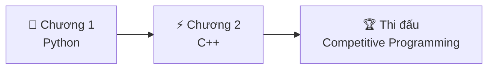
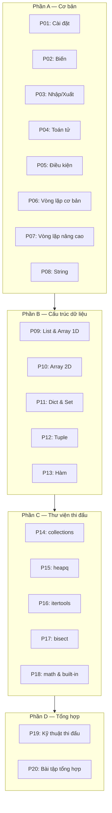
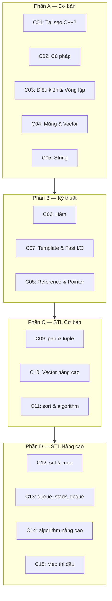

# Lập Trình Cơ Bản — Từ Zero đến Thi Đấu

> **Dành cho:** Người chưa biết gì về lập trình, học sinh cấp 2–3
> **Mục tiêu:** Nắm vững Python & C++ để thi đấu competitive programming

---

## Bạn sẽ học được gì?

Bộ bài học này được thiết kế để đưa bạn **từ con số 0** đến mức có thể **thi đấu lập trình** một cách tự tin. Không lý thuyết suông, không "dâu ria" — chỉ những gì **cần thiết để giải bài**.



---

## Chương 1: Python cho Thi Đấu (20 bài)

> **Phù hợp cho:** Người chưa biết gì về lập trình
> **Sau khi học xong:** Viết được code Python, giải bài thi đấu cơ bản



| Phần | Số bài | Nội dung |
|------|--------|----------|
| A — Cơ bản | 8 bài | Cài đặt, biến, nhập/xuất, toán tử, điều kiện, vòng lặp, string |
| B — Cấu trúc dữ liệu | 5 bài | List, array 2D, dict, set, tuple, hàm |
| C — Thư viện thi đấu | 5 bài | collections, heapq, itertools, bisect, math |
| D — Tổng hợp | 2 bài | Kỹ thuật thi đấu, bài tập tổng hợp |

---

## Chương 2: C++ cho Thi Đấu (15 bài)

> **Phù hợp cho:** Người đã vững Python
> **Sau khi học xong:** Viết được code C++, sử dụng STL, thi đấu hiệu quả



| Phần | Số bài | Nội dung |
|------|--------|----------|
| A — Cơ bản | 5 bài | Cú pháp, điều kiện, vòng lặp, mảng, string |
| B — Kỹ thuật | 3 bài | Hàm, template, fast I/O, reference, pointer |
| C — STL Cơ bản | 3 bài | pair, tuple, vector, sort, algorithm |
| D — STL Nâng cao | 4 bài | set, map, queue, stack, deque, algorithm nâng cao |

---

## Lộ trình học đề xuất

### Tuần 1–3: Python cơ bản
```
P01 → P08
```

### Tuần 4–6: Cấu trúc dữ liệu Python
```
P09 → P13
```

### Tuần 7–9: Thư viện thi đấu Python
```
P14 → P18
```

### Tuần 10: Tổng hợp & Luyện tập
```
P19 → P20
```

### Tuần 11–15: Chuyển sang C++
```
C01 → C15
```

---

## Bài tập luyện tập

- **[CSES Problem Set](https://cses.fi/problemset/)** — Bộ bài tập cơ bản, phù hợp cho người mới
- **[VNOJ](https://oj.vnoi.info/)** — OJ Việt Nam, nhiều bài thi HSG, VOI
- **[Codeforces](https://codeforces.com/)** — Contest online, phân loại theo độ khó
- **[AtCoder](https://atcoder.jp/)** — Contest chất lượng cao

---

## Bài viết liên quan

- [Bài học Lập trình Thi đấu](../lessons/index.md) — Bộ bài học thuật toán & cấu trúc dữ liệu
- [VNOI Wiki](https://wiki.vnoi.info/) — Wiki thuật toán tiếng Việt
