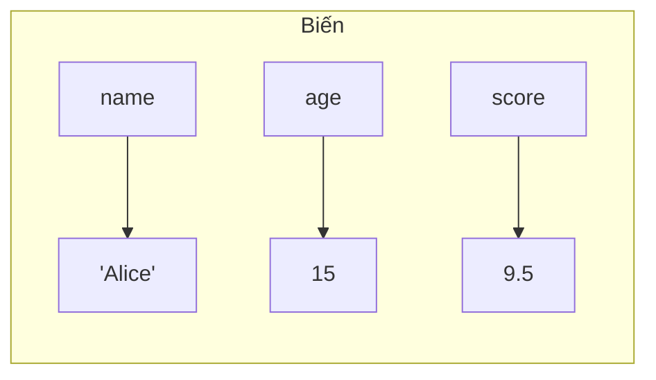
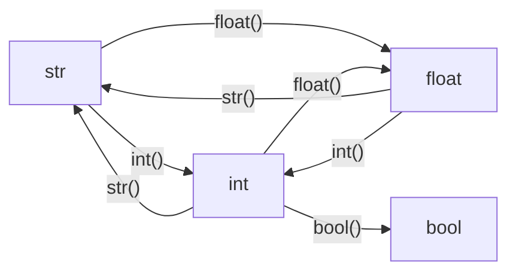

# P02: Biến & Kiểu dữ liệu

> **Tác giả:** Hà Trí Kiên<br>
> **Chủ đề:** Biến, kiểu dữ liệu, chuyển đổi kiểu, toán tử gán

---

## 1. Biến là gì?

Biến là **chiếc hộp** để lưu trữ dữ liệu. Bạn đặt tên cho hộp, rồi cho dữ liệu vào.



```python
name = "Alice"    # Biến name lưu chuỗi "Alice"
age = 15          # Biến age lưu số nguyên 15
score = 9.5       # Biến score lưu số thực 9.5
is_student = True # Biến is_student lưu giá trị True
```

!!! info "Đặc điểm biến Python"
    - **Không cần khai báo kiểu** — Python tự nhận diện
    - **Có thể gán lại** kiểu khác: `x = 5` rồi `x = "hello"` — OK!
    - **Phân biệt chữ hoa**: `name` và `Name` là 2 biến khác nhau

---

## 2. Quy tắc đặt tên biến

```python
# ĐÚNG
ten = "Alice"
ten_hoc_sinh = "Bob"       # snake_case (khuyến nghị trong Python)
tenHocSinh = "Charlie"     # camelCase (ít dùng trong Python)
TenHocSinh2 = "David"      # Có số
_private = "Bí mật"        # Bắt đầu bằng _

# SAI
2ten = "Eve"               # Không bắt đầu bằng số
ten-hoc-sinh = "Frank"     # Không dùng dấu gạch ngang
ten hoc sinh = "Grace"     # Không có khoảng trắng
class = "10A1"             # Không dùng từ khóa Python
```

!!! tip "Quy tắc đặt tên trong thi đấu"
    - Dùng **ngắn gọn**: `n`, `m`, `a`, `b`, `x`, `y`
    - Dùng **snake_case** cho biến dài: `max_value`, `is_prime`
    - Tránh tên trùng từ khóa: `if`, `else`, `for`, `while`, `class`, `return`, `import`, `True`, `False`, `None`

### Từ khóa Python (không được dùng làm tên biến)

```python
import keyword
print(keyword.kwlist)
# ['False', 'None', 'True', 'and', 'as', 'assert', 'async', 'await',
#  'break', 'class', 'continue', 'def', 'del', 'elif', 'else', 'except',
#  'finally', 'for', 'from', 'global', 'if', 'import', 'in', 'is',
#  'lambda', 'nonlocal', 'not', 'or', 'pass', 'raise', 'return',
#  'try', 'while', 'with', 'yield']
```

---

## 3. Các kiểu dữ liệu cơ bản

### 3.1. Số nguyên (int)

```python
x = 42
y = -10
z = 0
big = 1000000000000000000  # Python xử lý số nguyên BẤT KỲ kích thước!
```

!!! tip "Python không tràn số!"
    Khác với C++, Python có thể lưu số nguyên **lớn bất kỳ**. Đây là ưu điểm lớn khi thi đấu.

```python
# Tính giai thừa 100 — không vấn đề!
result = 1
for i in range(1, 101):
    result *= i
print(result)  # Số rất lớn, Python xử lý OK
```

### 3.2. Số thực (float)

```python
pi = 3.14159
temperature = -5.5
speed = 1.0
```

!!! warning "Lưu ý số thực"
    - Số thực trong máy tính **không chính xác tuyệt đối**
    - `0.1 + 0.2 = 0.30000000000000004` (không phải 0.3!)
    - Khi so sánh: dùng `abs(a - b) < 1e-9` thay vì `a == b`

```python
# SAI
if 0.1 + 0.2 == 0.3:
    print("Bằng")  # Không in ra!

# ĐÚNG
if abs(0.1 + 0.2 - 0.3) < 1e-9:
    print("Bằng")  # In ra!
```

### 3.3. Chuỗi (str)

```python
name = "Alice"
greeting = 'Hello'        # Dùng nháy đơn hoặc nháy kép đều được
message = """Đây là
chuỗi nhiều dòng"""
```

### 3.4. Boolean (bool)

```python
is_student = True
is_passed = False
```

Boolean thường là kết quả của phép so sánh:

```python
x = 10
print(x > 5)     # True
print(x < 5)     # False
print(x == 10)   # True
print(x != 10)   # False
```

### 3.5. Giá trị None

```python
result = None  # Biến chưa có giá trị
print(result)  # None
print(type(result))  # <class 'NoneType'>
```

---

## 4. Hàm type() — Kiểm tra kiểu dữ liệu

```python
x = 42
print(type(x))        # <class 'int'>

y = 3.14
print(type(y))        # <class 'float'>

s = "Hello"
print(type(s))        # <class 'str'>

b = True
print(type(b))        # <class 'bool'>
```

---

## 5. Chuyển đổi kiểu (Type Casting)



### String → Số

```python
s = "42"
n = int(s)        # 42 (số nguyên)

s = "3.14"
x = float(s)      # 3.14 (số thực)

# LƯU Ý: Không thể int("3.14") → ValueError
# Phải int(float("3.14")) = int(3.14) = 3
```

### Số → String

```python
n = 42
s = str(n)        # "42"

x = 3.14
s = str(x)        # "3.14"
```

### Boolean

```python
bool(0)        # False
bool("")       # False
bool([])       # False
bool(None)     # False
bool(1)        # True (mọi thứ khác 0, "", [], None đều True)
bool("hello")  # True
bool([1,2,3])  # True
```

### Kiểm tra isinstance()

```python
x = 42
print(isinstance(x, int))          # True
print(isinstance(x, float))        # False
print(isinstance(x, (int, float))) # True (x là int hoặc float)
```

---

## 6. Toán tử gán

```python
# Gán cơ bản
x = 10

# Gán nhiều biến cùng lúc
a, b, c = 1, 2, 3
x, y = y, x  # Hoán đổi giá trị!

# Gán cùng giá trị
a = b = c = 0

# Gán tăng cường
x += 5    # x = x + 5 → 15
x -= 3    # x = x - 3 → 12
x *= 2    # x = x * 2 → 24
x /= 4    # x = x / 4 → 6.0
x //= 2   # x = x // 2 → 3.0
x %= 2    # x = x % 2 → 1.0
x **= 3   # x = x ** 3 → 1.0
```

### Unpacking — Gán nhiều biến

```python
# Unpack list/tuple
a, b, c = [1, 2, 3]
a, b, c = (1, 2, 3)

# Unpack với *
a, *b = [1, 2, 3, 4, 5]  # a=1, b=[2,3,4,5]
*a, b = [1, 2, 3, 4, 5]  # a=[1,2,3,4], b=5
a, *b, c = [1, 2, 3, 4, 5]  # a=1, b=[2,3,4], c=5

# Swap (hoán đổi)
a, b = 10, 20
a, b = b, a  # a=20, b=10
```

---

## 7. Hằng số trong Python

Python **không có hằng số thực sự** (không thể ngăn gán lại). Theo quy ước:

```python
PI = 3.14159          # Viết HOA để biểu thị hằng số
MAX_N = 1000000       # Giới hạn tối đa
INF = float('inf')    # Vô cực
NEG_INF = float('-inf')  # Âm vô cực
MOD = 10**9 + 7       # Modulo trong thi đấu
```

!!! tip "Các hằng số thường dùng trong thi đấu"
    ```python
    INF = float('inf')      # Vô cực
    NEG_INF = float('-inf') # Âm vô cực
    MOD = 10**9 + 7         # 10^9 + 7
    MOD2 = 998244353        # 998244353
    EPS = 1e-9              # Sai số cho số thực
    ```

---

## 8. Biến toàn cục và cục bộ

```python
x = 10  # Biến toàn cục (global)

def my_func():
    y = 20  # Biến cục bộ (local)
    print(x)  # OK — đọc được biến toàn cục
    print(y)  # OK

my_func()
print(x)  # OK
# print(y)  # Lỗi! y không tồn tại ngoài hàm
```

---

## 9. Lưu ý / Cạm bẫy hay gặp

### Bẫy 1: Chia lấy nguyên vs chia thường

```python
# Chia thường: trả về float
7 / 2     # 3.5

# Chia lấy nguyên: trả về int
7 // 2    # 3

# Lấy dư
7 % 2     # 1
```

### Bẫy 2: Gán tham chiếu vs copy

```python
# SAI: Cùng tham chiếu
a = [1, 2, 3]
b = a          # b trỏ cùng vùng nhớ
b.append(4)
print(a)       # [1, 2, 3, 4] — a cũng bị thay đổi!

# ĐÚNG: Copy
a = [1, 2, 3]
b = a.copy()   # hoặc b = a[:]
b.append(4)
print(a)       # [1, 2, 3] — a không bị thay đổi
```

### Bẫy 3: float("inf") so sánh được

```python
INF = float('inf')
print(INF > 10**18)  # True — vô cực lớn hơn mọi số
print(INF == INF)     # True
print(INF + 1)        # inf — vô cực + 1 vẫn vô cực
```

### Bẫy 4: Boolean là subclass của int

```python
print(True + True)   # 2
print(True * 10)     # 10
print(False + 5)     # 5
```

---

## 10. Bài tập thực hành

### Bài 1: Hoán đổi 2 biến
Cho `a = 5, b = 10`. Hoán đổi giá trị và in ra.

```python
a = 5
b = 10
# Code của bạn ở đây
print(a, b)  # Phải in ra: 10 5
```

??? tip "Lời giải"
    ```python
    a, b = b, a
    ```

### Bài 2: Tính diện tích hình tròn
Cho bán kính `r`. Tính diện tích hình tròn (S = π × r²).

```python
import math
r = 5
# Code của bạn ở đây
```

??? tip "Lời giải"
    ```python
    s = math.pi * r ** 2
    print(f"{s:.2f}")
    ```

### Bài 3: Chuyển đổi nhiệt độ
Cho nhiệt độ `C` độ C. Chuyển sang độ F (F = C × 9/5 + 32).

```python
C = 37.5
# Code của bạn ở đây
```

??? tip "Lời giải"
    ```python
    F = C * 9 / 5 + 32
    print(f"{F:.1f}")
    ```

### Bài 4: Kiểm tra kiểu dữ liệu
Cho biến `x`. In ra kiểu dữ liệu của `x`.

```python
x = 42
# Code của bạn ở đây
```

??? tip "Lời giải"
    ```python
    print(type(x).__name__)  # int
    ```

---

## 11. Bài tập luyện tập

| Bài | Nền tảng | Độ khó | Chủ đề |
|-----|----------|--------|--------|
| [AtCoder - A × B + C](https://atcoder.jp/contests/abc086/tasks/abc086_a) | AtCoder | ⭐ | Biến, phép tính |
| [CSES - Weird Algorithm](https://cses.fi/problemset/task/1068) | CSES | ⭐ | Biến, gán giá trị |

---

## Bài viết liên quan

- [← P01: Cài đặt & Hello World](P01-cai-dat.md)
- [P03: Nhập/Xuất dữ liệu →](P03-nhap-xuat.md)

---

**Bài trước:** [P01: Cài đặt & Hello World](P01-cai-dat.md)<br>
**Bài tiếp theo:** [P03: Nhập/Xuất dữ liệu →](P03-nhap-xuat.md)
