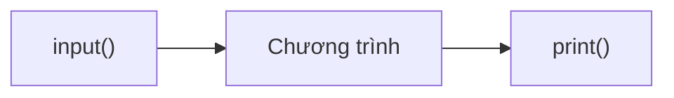

# P03: Nhập/Xuất dữ liệu

> **Tác giả:** Hà Trí Kiên<br>
> **Chủ đề:** input(), print(), f-string, định dạng output

---

## 1. Tổng quan

Trong thi đấu, **nhập/xuất dữ liệu** là kỹ năng bắt buộc. Bạn phải đọc đúng format input và in đúng format output.



---

## 2. Hàm print() — In dữ liệu ra màn hình

### 2.1. In cơ bản

```python
# In chuỗi
print("Hello World!")

# In số
print(42)
print(3.14)

# In nhiều giá trị
print("Tuoi:", 15)
# Kết quả: Tuoi: 15

# In kết quả phép tính
print(2 + 3)  # 5
```

### 2.2. Tham số sep — Phân cách giữa các giá trị

```python
# Mặc định: sep = " " (khoảng trắng)
print(1, 2, 3)           # 1 2 3

# Tùy chỉnh sep
print(1, 2, 3, sep=", ") # 1, 2, 3
print(1, 2, 3, sep="")   # 123
print(1, 2, 3, sep="-")  # 1-2-3
print(1, 2, 3, sep="\n") # Mỗi số trên 1 dòng
```

!!! tip "Ứng dụng trong thi đấu"
    Khi cần in nhiều số trên 1 dòng, cách nhau bởi khoảng trắng:
    ```python
    print(*arr)                   # In mảng, cách nhau bởi space
    print(*arr, sep=" ")          # Tương tự
    print(*arr, sep="\n")         # Mỗi phần tử trên 1 dòng
    ```

### 2.3. Tham số end — Kết thúc dòng

```python
# Mặc định: end = "\n" (xuống dòng)
print("Hello")
print("World")
# Kết quả:
# Hello
# World

# Không xuống dòng
print("Hello", end=" ")
print("World")
# Kết quả: Hello World

# Tùy chỉnh end
print("Hello", end="")
print("World")
# Kết quả: HelloWorld

print("Hello", end=" --- ")
print("World")
# Kết quả: Hello --- World
```

!!! tip "Ứng dụng trong thi đấu"
    Khi cần in kết quả trên cùng 1 dòng trong vòng lặp:
    ```python
    for i in range(n):
        print(arr[i], end=" ")
    print()  # Xuống dòng cuối
    ```

### 2.4. In nhiều dòng

```python
# Cách 1: Nhiều print()
print("Dòng 1")
print("Dòng 2")
print("Dòng 3")

# Cách 2: Dùng \n
print("Dòng 1\nDòng 2\nDòng 3")

# Cách 3: Triple quotes
print("""Dòng 1
Dòng 2
Dòng 3""")
```

---

## 3. f-string — Định dạng chuỗi (Quan trọng!)

f-string là cách **nhanh nhất** và **tiện nhất** để định dạng chuỗi trong Python.

### 3.1. Cơ bản

```python
name = "Alice"
age = 15
score = 9.5

# f-string
print(f"Ten: {name}, Tuoi: {age}, Diem: {score}")
# Kết quả: Ten: Alice, Tuoi: 15, Diem: 9.5

# Biểu thức trong {}
print(f"2 + 3 = {2 + 3}")
print(f"Can bac 2 cua 2 = {2 ** 0.5}")
```

### 3.2. Định dạng số

```python
x = 3.14159

# Số chữ số thập phân
print(f"{x:.2f}")     # 3.14  (2 chữ số)
print(f"{x:.4f}")     # 3.1416 (4 chữ số)
print(f"{x:.0f}")     # 3 (làm tròn)

# Padding số 0
print(f"{42:05d}")    # 00042 (5 chữ số, padding số 0)
print(f"{7:03d}")     # 007

# Phân cách hàng nghìn
print(f"{1000000:,}") # 1,000,000

# Phần trăm
print(f"{0.85:.0%}")  # 85%
print(f"{0.123:.1%}") # 12.3%
```

### 3.3. Căn chỉnh chuỗi

```python
name = "Alice"

# Căn trái (mặc định)
print(f"{name:<10}|")  # Alice     |

# Căn phải
print(f"{name:>10}|")  #      Alice|

# Căn giữa
print(f"{name:^10}|")  #   Alice   |

# Điền ký tự
print(f"{name:*^10}")  # **Alice***
print(f"{name:->10}")  # -----Alice
```

### 3.4. Định dạng số hệ khác

```python
n = 255

# Hệ thập phân (mặc định)
print(f"{n}")       # 255

# Hệ nhị phân (binary)
print(f"{n:b}")     # 11111111
print(f"{n:#b}")    # 0b11111111

# Hệ bát phân (octal)
print(f"{n:o}")     # 377
print(f"{n:#o}")    # 0o377

# Hệ thập lục phân (hex)
print(f"{n:x}")     # ff
print(f"{n:#x}")    # 0xff
print(f"{n:X}")     # FF
print(f"{n:#X}")    # 0xFF
```

### 3.5. format() method (cũ hơn nhưng vẫn gặp)

```python
name = "Alice"
age = 15

# Theo vị trí
print("{} is {}".format(name, age))
print("{1} is {0}".format(age, name))  # Theo index

# Theo tên
print("{n} is {a}".format(n=name, a=age))

# Định dạng
print("{:.2f}".format(3.14159))  # 3.14
```

### 3.6. % formatting (cũ, ít dùng trong thi đấu)

```python
name = "Alice"
age = 15

print("%s is %d" % (name, age))
print("%.2f" % 3.14159)  # 3.14
```

---

## 4. Hàm input() — Đọc dữ liệu từ bàn phím

### 4.1. Đọc 1 dòng

```python
# Đọc chuỗi
s = input()          # Nhập: Hello → s = "Hello"

# Đọc số nguyên
n = int(input())     # Nhập: 42 → n = 42

# Đọc số thực
x = float(input())   # Nhập: 3.14 → x = 3.14
```

### 4.2. Đọc nhiều giá trị trên 1 dòng

```python
# Đọc 2 số nguyên
a, b = map(int, input().split())
# Nhập: 3 5 → a=3, b=5

# Đọc 3 số nguyên
a, b, c = map(int, input().split())
# Nhập: 1 2 3 → a=1, b=2, c=3

# Đọc n số nguyên thành list
arr = list(map(int, input().split()))
# Nhập: 1 2 3 4 5 → arr=[1, 2, 3, 4, 5]

# Đọc n số thực
arr = list(map(float, input().split()))
```

!!! tip "Tư duy: map() + input().split()"
    Đây là **pattern phổ biến nhất** trong thi đấu:
    ```python
    # input().split()  → Chia chuỗi thành list các chuỗi
    # map(int, ...)    → Chuyển mỗi chuỗi thành số nguyên
    # list(...)        → Chuyển thành list
    ```

### 4.3. Đọc nhiều dòng

```python
# Đọc n dòng, mỗi dòng 1 số
for _ in range(n):
    x = int(input())
    # Xử lý...

# Đọc n dòng, mỗi dòng 2 số
for _ in range(n):
    a, b = map(int, input().split())
    # Xử lý...

# Đọc n dòng vào list
arr = []
for _ in range(n):
    arr.append(int(input()))
```

### 4.4. Đọc matrix n × m

```python
# Cách 1: Dùng vòng lặp
matrix = []
for _ in range(n):
    row = list(map(int, input().split()))
    matrix.append(row)

# Cách 2: List comprehension (ngắn hơn)
matrix = [list(map(int, input().split())) for _ in range(n)]

# Truy cập phần tử
print(matrix[i][j])  # Hàng i, cột j
```

### 4.5. Đọc input nhanh — Quan trọng trong thi đấu!

```python
import sys
input = sys.stdin.readline  # Ghi đè input → đọc nhanh hơn RẤT NHIỀU

# Sử dụng bình thường
n = int(input())
arr = list(map(int, input().split()))
```

!!! warning "Lưu ý với sys.stdin.readline"
    - `sys.stdin.readline()` giữ lại ký tự `\n` ở cuối
    - Khi dùng `int(input())`, Python tự loại `\n` → OK
    - Khi dùng `input().split()`, Python tự loại `\n` → OK
    - **Nhớ ghi đè input ở đầu chương trình!**

---

## 5. Pattern thường gặp trong thi đấu

### Pattern 1: Đọc n và m

```python
n, m = map(int, input().split())
```

### Pattern 2: Đọc mảng n phần tử

```python
n = int(input())
arr = list(map(int, input().split()))
```

### Pattern 3: Đọc n cặp (u, v) — danh sách cạnh

```python
n = int(input())
edges = []
for _ in range(n):
    u, v = map(int, input().split())
    edges.append((u, v))

# Hoặc ngắn gọn
edges = [tuple(map(int, input().split())) for _ in range(n)]
```

### Pattern 4: Đọc matrix n × m

```python
n, m = map(int, input().split())
matrix = [list(map(int, input().split())) for _ in range(n)]
```

### Pattern 5: Đọc đến hết input (EOF)

```python
import sys
for line in sys.stdin:
    a, b = map(int, line.split())
    print(a + b)
```

### Pattern 6: Đọc số lượng testcase

```python
t = int(input())
for _ in range(t):
    n = int(input())
    arr = list(map(int, input().split()))
    # Xử lý...
    print(result)
```

---

## 6. In output nâng cao

### In mảng trên 1 dòng

```python
arr = [1, 2, 3, 4, 5]

# Cách 1: join
print(" ".join(map(str, arr)))

# Cách 2: unpack
print(*arr)

# Cách 3: vòng lặp
for x in arr:
    print(x, end=" ")
print()  # Xuống dòng cuối
```

### In matrix

```python
matrix = [[1, 2, 3], [4, 5, 6], [7, 8, 9]]

# In từng hàng
for row in matrix:
    print(*row)

# In trên cùng 1 dòng (ít gặp)
for row in matrix:
    print(*row, sep=" ", end="\n")
```

### In với độ rộng cố định

```python
arr = [1, 23, 456, 7890]

# Căn phải, độ rộng 5
for x in arr:
    print(f"{x:>5}", end=" ")
# Kết quả:     1    23   456  7890

# Padding số 0
for x in arr:
    print(f"{x:05}", end=" ")
# Kết quả: 00001 00023 00456 07890
```

---

## 7. Lưu ý / Cạm bẫy hay gặp

### Bẫy 1: Quên chuyển kiểu

```python
# SAI
a, b = input().split()  # a, b là chuỗi!
print(a + b)            # "35" (nối chuỗi) thay vì 8

# ĐÚNG
a, b = map(int, input().split())
print(a + b)            # 8
```

### Bẫy 2: Thừa khoảng trắng

```python
# SAI — Thừa khoảng trắng
print("Ket qua: ", ans)  # "Ket qua:  5" (thừa 1 space)

# ĐÚNG — Dùng f-string
print(f"Ket qua: {ans}") # "Ket qua: 5"
```

### Bẫy 3: Sai format output

```python
# Đề yêu cầu: In ra 3.14 (2 chữ số thập phân)
# SAI
print(3.14159)      # 3.14159 — sai format

# ĐÚNG
print(f"{3.14159:.2f}")  # 3.14
```

### Bẫy 4: Không đọc hết input

```python
# SAI — Đọc thiếu
n, m = map(int, input().split())
arr = list(map(int, input().split()))  # Chỉ đọc 1 dòng
# Nhưng đề cho n dòng, mỗi dòng 1 số → SAI!

# ĐÚNG
n = int(input())
arr = [int(input()) for _ in range(n)]
```

### Bẫy 5: print() tự xuống dòng

```python
# print() luôn tự xuống dòng cuối
# Nếu muốn in trên cùng 1 dòng → dùng end=""

for i in range(5):
    print(i, end=" ")
print()  # Xuống dòng cuối cùng
```

---

## 8. Bài tập thực hành

### Bài 1: Hello + Tên
Đọc tên từ bàn phím, in ra "Hello {tên}!"

```python
name = input()
# Code của bạn ở đây
```

??? tip "Lời giải"
    ```python
    name = input()
    print(f"Hello {name}!")
    ```

### Bài 2: Tổng 2 số
Đọc 2 số nguyên a, b. In ra tổng a + b.

```python
# Code của bạn ở đây
```

??? tip "Lời giải"
    ```python
    a, b = map(int, input().split())
    print(a + b)
    ```

### Bài 3: Tổng mảng
Đọc n số nguyên. In ra tổng của chúng.

```python
n = int(input())
arr = list(map(int, input().split()))
# Code của bạn ở đây
```

??? tip "Lời giải"
    ```python
    print(sum(arr))
    ```

### Bài 4: In matrix
Đọc matrix n × m. In ra matrix (mỗi hàng trên 1 dòng).

```python
n, m = map(int, input().split())
matrix = [list(map(int, input().split())) for _ in range(n)]
# Code của bạn ở đây
```

??? tip "Lời giải"
    ```python
    for row in matrix:
        print(*row)
    ```

### Bài 5: Tính tổng nhiều testcase
Cho số lượng testcase T. Mỗi testcase đọc 2 số a, b. In ra a + b.

```
Input:
3
1 2
3 4
5 6

Output:
3
7
11
```

```python
# Code của bạn ở đây
```

??? tip "Lời giải"
    ```python
    t = int(input())
    for _ in range(t):
        a, b = map(int, input().split())
        print(a + b)
    ```

---

## 9. Bài tập luyện tập

| Bài | Nền tảng | Độ khó | Chủ đề |
|-----|----------|--------|--------|
| [AtCoder - A + B](https://atcoder.jp/contests/abc086/tasks/abc086_a) | AtCoder | ⭐ | Nhập/xuất cơ bản |
| [CSES - Weird Algorithm](https://cses.fi/problemset/task/1068) | CSES | ⭐ | Đọc 1 số |
| [CSES - Missing Number](https://cses.fi/problemset/task/1083) | CSES | ⭐ | Đọc mảng |

---

## Bài viết liên quan

- [← P02: Biến & Kiểu dữ liệu](P02-bien-kieu-du-lieu.md)
- [P04: Toán tử & Biểu thức →](P04-toan-tu.md)

---

**Bài trước:** [P02: Biến & Kiểu dữ liệu](P02-bien-kieu-du-lieu.md)<br>
**Bài tiếp theo:** [P04: Toán tử & Biểu thức →](P04-toan-tu.md)
