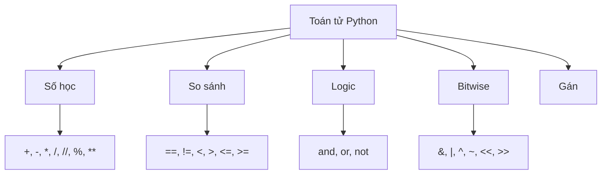

# P04: Toán tử & Biểu thức

> **Tác giả:** Hà Trí Kiên<br>
> **Chủ đề:** Toán tử số học, so sánh, logic, bitwise, ưu tiên toán tử

---

## 1. Tổng quan

Toán tử là các phép toán thực hiện trên dữ liệu. Python có các loại toán tử chính:



---

## 2. Toán tử số học

```python
a, b = 17, 5

print(a + b)    # 22   — Cộng
print(a - b)    # 12   — Trừ
print(a * b)    # 85   — Nhân
print(a / b)    # 3.4  — Chia (luôn trả về float)
print(a // b)   # 3    — Chia lấy nguyên (floor division)
print(a % b)    # 2    — Lấy dư (modulo)
print(a ** b)   # 1419857  — Lũy thừa (17^5)
```

### Bảng tổng hợp

| Toán tử | Tên | Ví dụ | Kết quả | Ghi chú |
|---------|-----|-------|---------|---------|
| `+` | Cộng | `17 + 5` | `22` | |
| `-` | Trừ | `17 - 5` | `12` | |
| `*` | Nhân | `17 * 5` | `85` | |
| `/` | Chia | `17 / 5` | `3.4` | Trả về float |
| `//` | Chia nguyên | `17 // 5` | `3` | Làm tròn xuống |
| `%` | Modulo | `17 % 5` | `2` | Lấy dư |
| `**` | Lũy thừa | `2 ** 10` | `1024` | |

### 2.1. Phép chia — Quan trọng!

```python
# Chia thường: trả về float
print(17 / 5)    # 3.4
print(6 / 3)     # 2.0 (vẫn là float!)

# Chia lấy nguyên: trả về int
print(17 // 5)   # 3
print(6 // 3)    # 2

# Chia lấy nguyên với số âm: LÀM TRÒN XUỐNG (không phải về 0!)
print(-17 // 5)  # -4 (không phải -3!)
print(17 // -5)  # -4 (không phải -3!)
```

!!! warning "Chia lấy nguyên với số âm"
    Python làm tròn **xuống** (floor), không phải về 0 như C++.
    - `-17 // 5 = -4` (vì -3.4 làm tròn xuống → -4)
    - C++: `-17 / 5 = -3` (làm tròn về 0)

### 2.2. Modulo — Ứng dụng trong thi đấu

```python
# Modulo cơ bản
print(17 % 5)    # 2
print(10 % 3)    # 1

# Kiểm tra chia hết
if n % 2 == 0:
    print("Chan")
else:
    print("Le")

# Kiểm tra chữ số cuối
last_digit = n % 10

# Kiểm tra chia hết cho k
if n % k == 0:
    print(f"{n} chia het cho {k}")

# Modulo với số âm
print(-17 % 5)   # 3 (không phải -2!)
print(17 % -5)   # -2 (không phải 2!)
```

!!! warning "Modulo với số âm"
    Python: `a % b` luôn có **cùng dấu với b**.
    - `-17 % 5 = 3` (vì -17 = (-4) × 5 + 3)
    - C++: `-17 % 5 = -2`

### 2.3. Lũy thừa

```python
print(2 ** 10)      # 1024
print(3 ** 5)       # 243
print(2 ** 0.5)     # 1.4142135... (căn bậc 2)

# Lũy thừa modulo — rất quan trọng trong thi đấu
print(pow(2, 10, 1000))  # 24 (2^10 % 1000)
```

!!! tip "pow() với 3 tham số"
    `pow(a, b, m)` tính `(a ** b) % m` một cách **hiệu quả** — rất quan trọng trong thi đấu số học.

---

## 3. Toán tử so sánh

```python
a, b = 10, 20

print(a == b)   # False  — Bằng
print(a != b)   # True   — Khác
print(a < b)    # True   — Nhỏ hơn
print(a > b)   # False  — Lớn hơn
print(a <= b)   # True   — Nhỏ hơn hoặc bằng
print(a >= b)   # False  — Lớn hơn hoặc bằng
```

### So sánh chuỗi

```python
print("abc" < "abd")   # True (so sánh theo thứ tự từ điển)
print("abc" < "ab")    # False
print("a" < "b")       # True
print("Alice" < "Bob") # True
```

### So sánh nhiều điều kiện (Chaining)

```python
x = 15

# Cách 1: Dùng and
if x >= 10 and x <= 20:
    print("Trong khoang [10, 20]")

# Cách 2: Chaining (Python hỗ trợ!)
if 10 <= x <= 20:
    print("Trong khoang [10, 20]")

# So sánh 3 biến
a, b, c = 1, 2, 3
if a < b < c:
    print("Tang dan")
```

---

## 4. Toán tử logic

```python
a, b = True, False

print(a and b)   # False — Cả hai đều True → True
print(a or b)    # True  — Ít nhất 1 True → True
print(not a)     # False — Đảo ngược
```

### Bảng chân trị

| a | b | a and b | a or b | not a |
|---|---|---------|--------|-------|
| T | T | T | T | F |
| T | F | F | T | F |
| F | T | F | T | T |
| F | F | F | F | T |

### Short-circuit evaluation

Python **không đánh giá** vế phải nếu đã biết kết quả:

```python
# and: Nếu vế trái là False → không đánh giá vế phải
if x != 0 and 10 / x > 2:
    print("OK")  # Tránh chia cho 0!

# or: Nếu vế trái là True → không đánh giá vế phải
if x == 0 or arr[x] > 10:
    print("OK")  # Tránh truy cập index ngoài!
```

### Toán tử logic với giá trị

```python
# Python trả về giá trị, không chỉ True/False
print(0 and 5)     # 0 (vế trái là falsy → trả về vế trái)
print(3 and 5)     # 5 (vế trái là truthy → trả về vế phải)
print(0 or 5)      # 5 (vế trái là falsy → trả về vế phải)
print(3 or 5)      # 3 (vế trái là truthy → trả về vế trái)

# Ứng dụng: Gán giá trị mặc định
name = user_input or "Guest"  # Nếu user_input rỗng → "Guest"
```

### Truthy và Falsy

```python
# Falsy (coi là False):
bool(0)        # False
bool(0.0)      # False
bool("")       # False
bool([])       # False
bool({})       # False
bool(None)     # False

# Truthy (coi là True):
bool(1)        # True
bool(-5)       # True
bool("hello")  # True
bool([1,2])    # True
```

---

## 5. Toán tử bitwise (Phép toán trên bit)

```python
a, b = 12, 10  # a = 1100, b = 1010 (binary)

print(a & b)    # 8    — AND  (1100 & 1010 = 1000)
print(a | b)    # 14   — OR   (1100 | 1010 = 1110)
print(a ^ b)    # 6    — XOR  (1100 ^ 1010 = 0110)
print(~a)       # -13  — NOT  (~1100 = -1101)
print(a << 2)   # 48   — Shift trái (1100 << 2 = 110000)
print(a >> 2)   # 3    — Shift phải (1100 >> 2 = 11)
```

### Bảng tổng hợp

| Toán tử | Tên | Ví dụ | Kết quả | Giải thích |
|---------|-----|-------|---------|------------|
| `&` | AND | `12 & 10` | `8` | Cả 2 bit đều 1 → 1 |
| `\|` | OR | `12 \| 10` | `14` | Ít nhất 1 bit là 1 → 1 |
| `^` | XOR | `12 ^ 10` | `6` | Bit khác nhau → 1 |
| `~` | NOT | `~12` | `-13` | Đảo tất cả bit |
| `<<` | Shift trái | `12 << 2` | `48` | Dịch trái 2 bit (×4) |
| `>>` | Shift phải | `12 >> 2` | `3` | Dịch phải 2 bit (÷4) |

### Ứng dụng trong thi đấu

```python
# Kiểm tra bit thứ k
def get_bit(n, k):
    return (n >> k) & 1

# Bật bit thứ k
def set_bit(n, k):
    return n | (1 << k)

# Tắt bit thứ k
def clear_bit(n, k):
    return n & ~(1 << k)

# Đảo bit thứ k
def toggle_bit(n, k):
    return n ^ (1 << k)

# Kiểm tra số lẻ/chẵn
if n & 1:    # Lẻ
    ...
else:        # Chẵn
    ...

# Nhân/chia cho 2^n
print(n << 1)  # n × 2
print(n >> 1)  # n ÷ 2
print(n << k)  # n × 2^k
print(n >> k)  # n ÷ 2^k
```

---

## 6. Toán tử gán

```python
x = 10

x += 5    # x = x + 5  → 15
x -= 3    # x = x - 3  → 12
x *= 2    # x = x * 2  → 24
x /= 4    # x = x / 4  → 6.0
x //= 2   # x = x // 2 → 3.0
x %= 2    # x = x % 2  → 1.0
x **= 3   # x = x ** 3 → 1.0
x &= 3    # x = x & 3
x |= 3    # x = x | 3
x ^= 3    # x = x ^ 3
x <<= 1   # x = x << 1
x >>= 1   # x = x >> 1
```

---

## 7. Ưu tiên toán tử

| Ưu tiên | Toán tử | Mô tả |
|---------|---------|-------|
| 1 (cao nhất) | `**` | Lũy thừa |
| 2 | `~`, `+x`, `-x` | Unary |
| 3 | `*`, `/`, `//`, `%` | Nhân, chia |
| 4 | `+`, `-` | Cộng, trừ |
| 5 | `<<`, `>>` | Shift |
| 6 | `&` | AND |
| 7 | `^` | XOR |
| 8 | `\|` | OR |
| 9 | `==`, `!=`, `<`, `>`, `<=`, `>=` | So sánh |
| 10 | `not` | Logic NOT |
| 11 | `and` | Logic AND |
| 12 (thấp nhất) | `or` | Logic OR |

!!! tip "Mẹo nhớ"
    - **Dùng ngoặc** khi không chắc chắn về ưu tiên
    - Thứ tự: `**` → `*/` → `+-` → `so sánh` → `logic`

```python
# Ưu tiên
print(2 + 3 * 4)      # 14 (nhân trước cộng sau)
print((2 + 3) * 4)    # 20 (ngoặc trước)
print(2 ** 3 ** 2)     # 512 (2^9, không phải 8^2!)
print((2 ** 3) ** 2)   # 64 (8^2)
```

---

## 8. Các toán tử đặc biệt

### Toán tử `in` — Kiểm tra tồn tại

```python
# Kiểm tra phần tử trong list
arr = [1, 2, 3, 4, 5]
print(3 in arr)      # True
print(6 in arr)      # False
print(6 not in arr)  # True

# Kiểm tra ký tự trong chuỗi
s = "Hello"
print("H" in s)      # True
print("h" in s)      # False (phân biệt hoa/thường)

# Kiểm tra key trong dict
d = {"a": 1, "b": 2}
print("a" in d)      # True
print("c" in d)      # False
```

### Toán tử `is` — Kiểm tra đồng nhất

```python
a = [1, 2, 3]
b = [1, 2, 3]
c = a

print(a == b)    # True  (giá trị bằng nhau)
print(a is b)    # False (không cùng tham chiếu)
print(a is c)    # True  (cùng tham chiếu)

# Kiểm tra None
x = None
if x is None:
    print("x la None")

if x is not None:
    print("x khong phai None")
```

!!! warning "== vs is"
    - `==` so sánh **giá trị**
    - `is` so sánh **tham chiếu** (cùng object trong bộ nhớ)
    - Luôn dùng `is None` thay vì `== None`

### Toán tử Walrus `:=` (Python 3.8+)

```python
# Gán giá trị trong biểu thức
if (n := len(arr)) > 10:
    print(f"Array co {n} phan tu, qua nhieu!")

# Dùng trong while
while (line := input()) != "quit":
    print(line)
```

---

## 9. Lưu ý / Cạm bẫy hay gặp

### Bẫy 1: Chia lấy nguyên với số âm

```python
# Python: làm tròn XUỐNG
print(-17 // 5)   # -4 (không phải -3!)

# C++: làm tròn VỀ 0
# -17 / 5 = -3
```

### Bẫy 2: Modulo với số âm

```python
# Python: cùng dấu với mẫu số
print(-17 % 5)    # 3 (không phải -2!)

# C++: cùng dấu với tử số
# -17 % 5 = -2
```

### Bẫy 3: Ưu tiên toán tử

```python
# SAI
if n & 1 == 1:    # == có ưu tiên cao hơn &!
    print("Le")

# ĐÚNG
if (n & 1) == 1:
    print("Le")

# Hoặc
if n & 1:
    print("Le")
```

### Bẫy 4: Lũy thừa phải-associative

```python
# ** là right-associative (tính từ phải sang trái)
print(2 ** 3 ** 2)   # 512 = 2^9, không phải 8^2 = 64!
# Giải thích: 3 ** 2 = 9 trước, rồi 2 ** 9 = 512
```

### Bẫy 5: So sánh float

```python
# SAI
if 0.1 + 0.2 == 0.3:
    print("Bang")  # Không in ra!

# ĐÚNG
if abs(0.1 + 0.2 - 0.3) < 1e-9:
    print("Bang")
```

---

## 10. Bài tập thực hành

### Bài 1: Kiểm tra chẵn lẻ
Đọc số nguyên n. In ra "Chan" nếu chẵn, "Le" nếu lẻ.

```python
n = int(input())
# Code của bạn ở đây
```

??? tip "Lời giải"
    ```python
    n = int(input())
    if n % 2 == 0:
        print("Chan")
    else:
        print("Le")
    ```

### Bài 2: Tính lũy thừa modulo
Đọc a, b, m. Tính (a^b) % m.

```python
a, b, m = map(int, input().split())
# Code của bạn ở đây
```

??? tip "Lời giải"
    ```python
    a, b, m = map(int, input().split())
    print(pow(a, b, m))
    ```

### Bài 3: Kiểm tra số nguyên tố
Đọc số nguyên n. Kiểm tra n có phải số nguyên tố không.

```python
n = int(input())
# Code của bạn ở đây
```

??? tip "Lời giải"
    ```python
    n = int(input())
    if n < 2:
        print("Khong phai SNT")
    else:
        is_prime = True
        for i in range(2, int(n**0.5) + 1):
            if n % i == 0:
                is_prime = False
                break
        if is_prime:
            print("SNT")
        else:
            print("Khong phai SNT")
    ```

### Bài 4: Lấy chữ số
Đọc số nguyên n. In ra chữ số đầu tiên và chữ số cuối cùng.

```python
n = int(input())
# Code của bạn ở đây
```

??? tip "Lời giải"
    ```python
    n = int(input())
    last = n % 10
    first = n
    while first >= 10:
        first //= 10
    print(f"Chu so dau: {first}, Chu so cuoi: {last}")
    ```

### Bài 5: Đếm bit 1
Đọc số nguyên n. Đếm số bit 1 trong biểu diễn nhị phân.

```python
n = int(input())
# Code của bạn ở đây
```

??? tip "Lời giải"
    ```python
    n = int(input())
    count = 0
    while n > 0:
        count += n & 1
        n >>= 1
    print(count)
    ```

---

## 11. Bài tập luyện tập

| Bài | Nền tảng | Độ khó | Chủ đề |
|-----|----------|--------|--------|
| [CSES - Weird Algorithm](https://cses.fi/problemset/task/1068) | CSES | ⭐ | Phép tính cơ bản |
| [CSES - Repetitions](https://cses.fi/problemset/task/1069) | CSES | ⭐ | So sánh, đếm |
| [CSES - Increasing Array](https://cses.fi/problemset/task/1094) | CSES | ⭐ | So sánh, tính toán |

---

## Bài viết liên quan

- [← P03: Nhập/Xuất dữ liệu](P03-nhap-xuat.md)
- [P05: Câu lệnh điều kiện →](P05-dieu-kien.md)

---

**Bài trước:** [P03: Nhập/Xuất dữ liệu](P03-nhap-xuat.md)<br>
**Bài tiếp theo:** [P05: Câu lệnh điều kiện →](P05-dieu-kien.md)
