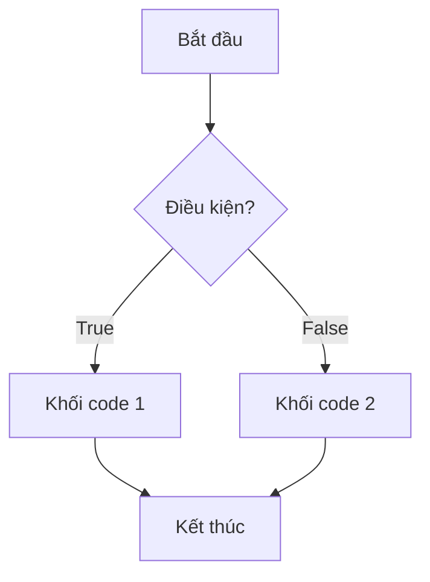
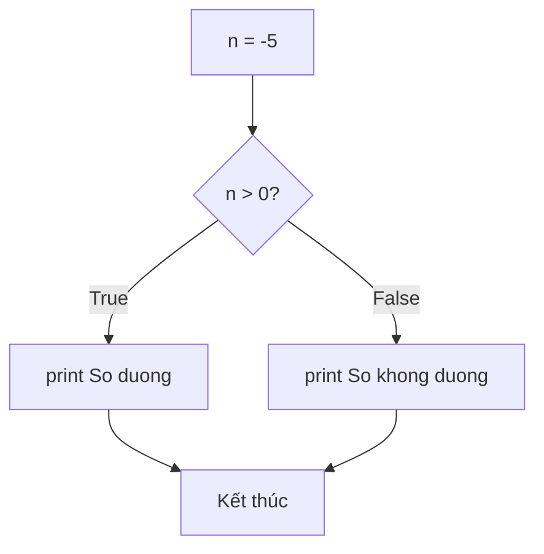

# P05: Câu lệnh điều kiện

> **Tác giả:** Hà Trí Kiên<br>
> **Chủ đề:** if/elif/else, lồng nhau, ternary, match-case

---

## 1. Tổng quan

Câu lệnh điều kiện cho phép chương trình **chọn cách xử lý** tùy theo điều kiện.



---

## 2. Câu lệnh if — Cơ bản

```python
n = 10

if n > 0:
    print("So duong")  # Chỉ chạy khi n > 0

print("Ket thuc")  # Luôn chạy
```

!!! info "Cấu trúc"
    ```
    if <điều kiện>:
        <khối code>  # Thụt lề 4 spaces
    ```

---

## 3. Câu lệnh if — else

```python
n = -5

if n > 0:
    print("So duong")
else:
    print("So khong duong")
```



---

## 4. Câu lệnh if — elif — else

```python
score = 85

if score >= 90:
    print("Xuat sac")
elif score >= 80:
    print("Gioi")
elif score >= 70:
    print("Kha")
elif score >= 50:
    print("Trung binh")
else:
    print("Yeu")
```

!!! tip "Thứ tự quan trọng"
    Python đánh giá **từ trên xuống**. Ngay khi gặp điều kiện đúng → chạy khối đó → **bỏ qua tất cả** elif/else còn lại.
    ```python
    # SAI: Điều kiện không đúng thứ tự
    if score >= 50:        # score=85 → True ở đây!
        print("Trung binh")  # In ra "Trung binh" — SAI!
    elif score >= 80:
        print("Gioi")
    
    # ĐÚNG: Từ cao xuống thấp
    if score >= 80:
        print("Gioi")      # score=85 → True ở đây
    elif score >= 50:
        print("Trung binh")
    ```

---

## 5. Câu lệnh if lồng nhau

```python
n = 15

if n > 0:
    if n % 2 == 0:
        print("So duong chan")
    else:
        print("So duong le")
else:
    if n == 0:
        print("So khong")
    else:
        print("So am")
```

!!! warning "Tránh lồng quá sâu"
    Code lồng quá sâu khó đọc. Hãy dùng `and`, `or`, hoặc `elif` để thay thế:
    ```python
    # Thay vì lồng nhau:
    if n > 0:
        if n % 2 == 0:
            print("So duong chan")
    
    # Dùng and:
    if n > 0 and n % 2 == 0:
        print("So duong chan")
    ```

---

## 6. Toán tử ternary — Viết ngắn gọn

```python
# Cấu trúc: <giá trị nếu True> if <điều kiện> else <giá trị nếu False>

n = 10

# Cách 1: if-else đầy đủ
if n > 0:
    result = "Duong"
else:
    result = "Khong duong"

# Cách 2: Ternary (ngắn hơn)
result = "Duong" if n > 0 else "Khong duong"

# Ứng dụng
max_val = a if a > b else b
min_val = a if a < b else b
abs_val = n if n >= 0 else -n
```

### Ternary lồng nhau (ít khuyến nghị)

```python
# Có thể lồng nhưng khó đọc
result = "Xuat sac" if score >= 90 else ("Gioi" if score >= 80 else "Kha")
```

---

## 7. So sánh với C++

=== "Python"

    ```python
    # if-elif-else
    if n > 0:
        print("Duong")
    elif n == 0:
        print("Khong")
    else:
        print("Am")
    
    # Ternary
    result = "Duong" if n > 0 else "Am"
    
    # Không có switch-case (Python 3.10 có match-case)
    ```

=== "C++"

    ```cpp
    // if-else if-else
    if (n > 0) {
        cout << "Duong";
    } else if (n == 0) {
        cout << "Khong";
    } else {
        cout << "Am";
    }
    
    // Ternary
    string result = (n > 0) ? "Duong" : "Am";
    
    // switch-case
    switch (n) {
        case 1: cout << "Mot"; break;
        case 2: cout << "Hai"; break;
        default: cout << "Khac";
    }
    ```

---

## 8. match-case (Python 3.10+)

```python
# match-case tương tự switch-case trong C++
command = "start"

match command:
    case "start":
        print("Bat dau")
    case "stop":
        print("Dung lai")
    case "pause":
        print("Tam dung")
    case _:  # _ là wildcard (tương tự default)
        print("Lenh khong xac dinh")
```

### match-case với pattern matching

```python
# Match với giá trị
point = (1, 0)

match point:
    case (0, 0):
        print("Goc toa do")
    case (x, 0):
        print(f"Truc Ox, x={x}")
    case (0, y):
        print(f"Truc Oy, y={y}")
    case (x, y):
        print(f"Diem ({x}, {y})")
```

!!! info "Lưu ý"
    match-case chỉ có trong Python 3.10+. Trong thi đấu, dùng if-elif-else cho an toàn.

---

## 9. Pattern thường gặp trong thi đấu

### 9.1. Kiểm tra số dương/âm/0

```python
n = int(input())
if n > 0:
    print("Duong")
elif n < 0:
    print("Am")
else:
    print("Khong")
```

### 9.2. Kiểm tra chẵn/lẻ

```python
n = int(input())
if n % 2 == 0:
    print("Chan")
else:
    print("Le")
```

### 9.3. Kiểm tra năm nhuận

```python
year = int(input())
if (year % 4 == 0 and year % 100 != 0) or (year % 400 == 0):
    print("Nam nhuan")
else:
    print("Khong nhuan")
```

### 9.4. Tìm giá trị lớn nhất / nhỏ nhất

```python
a, b, c = map(int, input().split())

# Tìm max
if a >= b and a >= c:
    print(a)
elif b >= a and b >= c:
    print(b)
else:
    print(c)

# Hoặc dùng hàm
print(max(a, b, c))
```

### 9.5. Kiểm tra khoảng

```python
x = int(input())
if 0 <= x <= 100:
    print("Hop le")
else:
    print("Khong hop le")
```

### 9.6. Xếp loại học lực

```python
score = float(input())
if score >= 9.0:
    print("Xuat sac")
elif score >= 8.0:
    print("Gioi")
elif score >= 7.0:
    print("Kha")
elif score >= 5.0:
    print("Trung binh")
else:
    print("Yeu")
```

### 9.7. Kiểm tra tam giác

```python
a, b, c = map(int, input().split())
if a + b > c and a + c > b and b + c > a:
    if a == b == c:
        print("Tam giac deu")
    elif a == b or b == c or a == c:
        print("Tam giac can")
    elif a*a + b*b == c*c or a*a + c*c == b*b or b*b + c*c == a*a:
        print("Tam giac vuong")
    else:
        print("Tam giac thuong")
else:
    print("Khong phai tam giac")
```

---

## 10. Lưu ý / Cạm bẫy hay gặp

### Bẫy 1: Quên dấu hai chấm

```python
# SAI
if n > 0
    print("Duong")

# ĐÚNG
if n > 0:
    print("Duong")
```

### Bẫy 2: Sai thụt lề

```python
# SAI
if n > 0:
print("Duong")  # IndentationError!

# ĐÚNG
if n > 0:
    print("Duong")  # Thụt lề 4 spaces
```

### Bẫy 3: Dùng = thay vì ==

```python
# SAI
if n = 5:    # SyntaxError!
    print("OK")

# ĐÚNG
if n == 5:   # So sánh
    print("OK")
```

### Bẫy 4: So sánh float chính xác

```python
# SAI
if x == 0.3:  # Có thể sai do lỗi số thực

# ĐÚNG
if abs(x - 0.3) < 1e-9:
    print("Bang 0.3")
```

### Bẫy 5: Điều kiện always True/False

```python
# SAI: luôn True
if True:
    print("Luon chay")

# Cẩn thận với điều kiện luôn đúng/sai
if n or not n:  # Luôn True với MỌI giá trị của n (tautology)
    print("Luon chay")
```

---

## 11. Bài tập thực hành

### Bài 1: Giá trị tuyệt đối
Đọc số nguyên n. In ra giá trị tuyệt đối của n.

<div class="cp-pg" data-language="python" data-starter="# Viết code ở đây" data-input="-5" data-expected="5" data-hint="Dùng if/else hoặc abs(n)"></div>

??? tip "Lời giải"
    ```python
    n = int(input())
    if n >= 0:
        print(n)
    else:
        print(-n)
    # Hoặc: print(abs(n))
    ```

### Bài 2: Ngày trong tháng
Đọc tháng (1-12). In ra số ngày trong tháng (giả sử không nhuận).

<div class="cp-pg" data-language="python" data-starter="# Viết code ở đây" data-input="2" data-expected="28" data-hint="Dùng if/elif/else cho các nhóm tháng"></div>

??? tip "Lời giải"
    ```python
    month = int(input())
    if month in [1, 3, 5, 7, 8, 10, 12]:
        print(31)
    elif month in [4, 6, 9, 11]:
        print(30)
    else:
        print(28)
    ```

### Bài 3: Xếp loại điểm
Đọc điểm số (0-100). In ra xếp loại:
- >= 90: A
- >= 80: B
- >= 70: C
- >= 60: D
- < 60: F

<div class="cp-pg" data-language="python" data-starter="# Viết code ở đây" data-input="85" data-expected="B" data-hint="Dùng if/elif/else từ cao xuống thấp"></div>

??? tip "Lời giải"
    ```python
    score = int(input())
    if score >= 90:
        print("A")
    elif score >= 80:
        print("B")
    elif score >= 70:
        print("C")
    elif score >= 60:
        print("D")
    else:
        print("F")
    ```

### Bài 4: Năm nhuận
Đọc năm. Kiểm tra năm nhuận.

<div class="cp-pg" data-language="python" data-starter="# Viết code ở đây" data-input="2024" data-expected="Nam nhuan" data-hint="Chia hết cho 4 và không chia hết cho 100, hoặc chia hết cho 400"></div>

??? tip "Lời giải"
    ```python
    year = int(input())
    if (year % 4 == 0 and year % 100 != 0) or (year % 400 == 0):
        print("Nam nhuan")
    else:
        print("Khong nhuan")
    ```

### Bài 5: Tìm số lớn nhất
Đọc 3 số nguyên a, b, c. In ra số lớn nhất.

<div class="cp-pg" data-language="python" data-starter="# Viết code ở đây" data-input="3 7 5" data-expected="7" data-hint="Dùng max(a, b, c) hoặc if/else"></div>

??? tip "Lời giải"
    ```python
    a, b, c = map(int, input().split())
    print(max(a, b, c))
    ```

---

## 12. Bài tập luyện tập

| Bài | Nền tảng | Độ khó | Chủ đề |
|-----|----------|--------|--------|
| [CSES - Increasing Array](https://cses.fi/problemset/task/1094) | CSES | ⭐ | So sánh, điều kiện |
| [CSES - Permutations](https://cses.fi/problemset/task/1070) | CSES | ⭐ | Điều kiện, logic |
| [CSES - Number Spiral](https://cses.fi/problemset/task/1071) | CSES | ⭐⭐ | Điều kiện phức tạp |

---

## Bài viết liên quan

- [← P04: Toán tử & Biểu thức](P04-toan-tu.md)
- [P06: Vòng lặp — Cơ bản →](P06-vong-lap-co-ban.md)

---

**Bài trước:** [P04: Toán tử & Biểu thức](P04-toan-tu.md)<br>
**Bài tiếp theo:** [P06: Vòng lặp — Cơ bản →](P06-vong-lap-co-ban.md)
