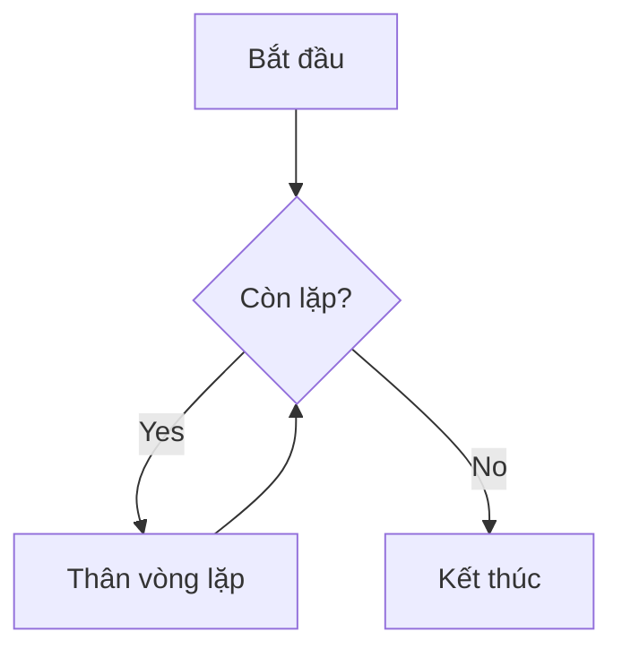
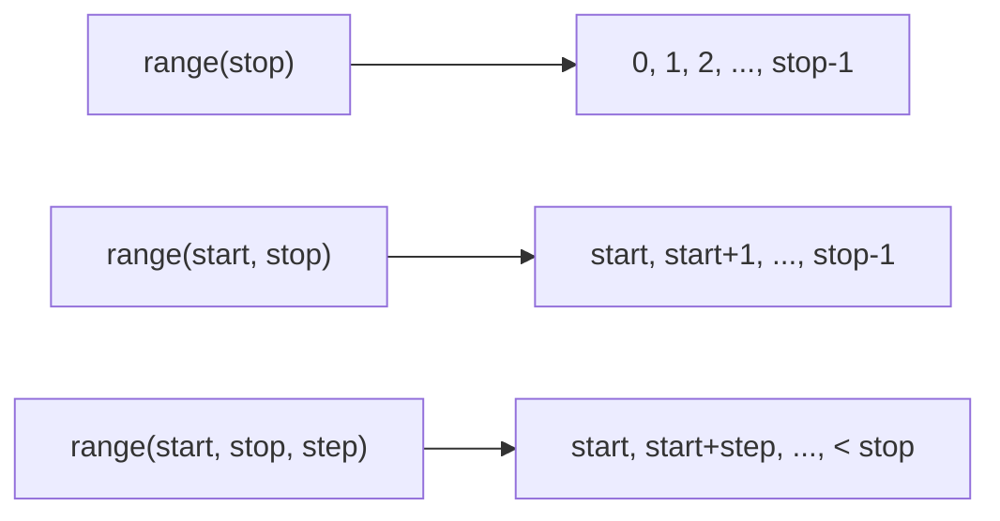
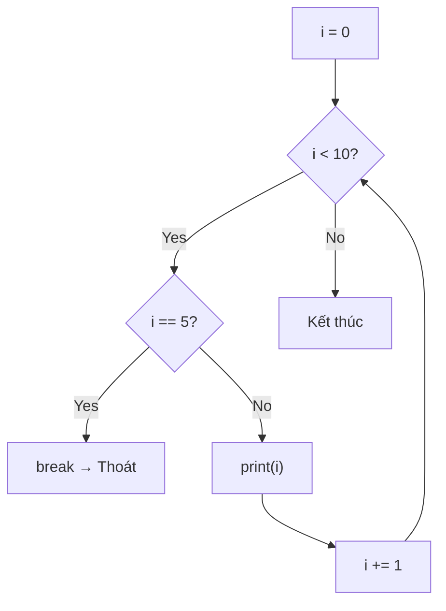
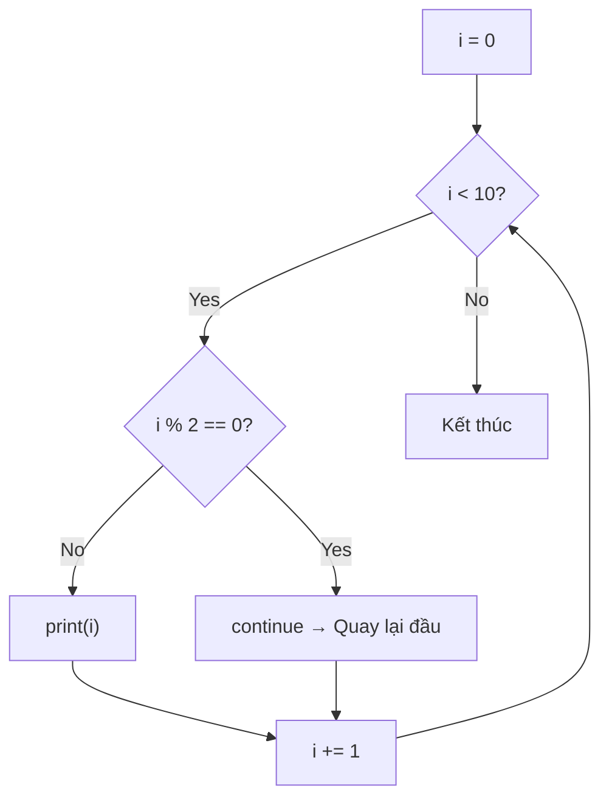

# P06: Vòng lặp — Cơ bản

> **Tác giả:** Hà Trí Kiên<br>
> **Chủ đề:** for, while, range(), break, continue, else trong loop

---

## 1. Tổng quan

Vòng lặp cho phép **lặp lại** một đoạn code nhiều lần. Đây là **linh hồn** của lập trình — hầu hết bài toán đều cần vòng lặp.



---

## 2. Vòng lặp for — Duyệt qua dãy

### 2.1. Cú pháp cơ bản

```python
# Duyệt qua list
arr = [10, 20, 30, 40, 50]
for x in arr:
    print(x)
# Kết quả:
# 10
# 20
# 30
# 40
# 50

# Duyệt qua chuỗi
for c in "Hello":
    print(c)
# Kết quả:
# H
# e
# l
# l
# o
```

### 2.2. Hàm range() — Quan trọng!



```python
# range(stop): từ 0 đến stop-1
for i in range(5):
    print(i, end=" ")  # 0 1 2 3 4

# range(start, stop): từ start đến stop-1
for i in range(1, 6):
    print(i, end=" ")  # 1 2 3 4 5

# range(start, stop, step): bước nhảy step
for i in range(0, 10, 2):
    print(i, end=" ")  # 0 2 4 6 8

# Đếm ngược
for i in range(10, 0, -1):
    print(i, end=" ")  # 10 9 8 7 6 5 4 3 2 1

# Đếm ngược với step
for i in range(10, 0, -2):
    print(i, end=" ")  # 10 8 6 4 2
```

### 2.3. Các cách dùng range() thường gặp

```python
# Duyệt từ 0 đến n-1 (phổ biến nhất)
for i in range(n):
    ...

# Duyệt từ 1 đến n
for i in range(1, n + 1):
    ...

# Duyệt từ 0 đến n (bao gồm n)
for i in range(n + 1):
    ...

# Duyệt ngược từ n-1 về 0
for i in range(n - 1, -1, -1):
    ...

# Duyệt ngược từ n về 1
for i in range(n, 0, -1):
    ...
```

!!! tip "Tư duy: range(n) hay range(1, n+1)?"
    - Dùng `range(n)` khi index từ 0 (truy cập mảng)
    - Dùng `range(1, n+1)` khi đếm từ 1 (in ra kết quả)

---

## 3. Vòng lặp while — Lặp khi còn điều kiện

### 3.1. Cú pháp cơ bản

```python
# while: lặp khi điều kiện còn đúng
n = 5
while n > 0:
    print(n, end=" ")  # 5 4 3 2 1
    n -= 1
```

### 3.2. while True — Lặp vô hạn

```python
# while True + break: lặp cho đến khi gặp break
while True:
    s = input()
    if s == "quit":
        break
    print(f"Ban vua nhap: {s}")
```

!!! warning "Cẩn thận vòng lặp vô hạn"
    ```python
    # SAI: Quên cập nhật biến đếm → vòng lặp vô hạn
    n = 5
    while n > 0:
        print(n)  # In 5 mãi mãi!
        # Quên: n -= 1
    ```

### 3.3. while vs for

| for | while |
|-----|-------|
| Biết trước số lần lặp | Không biết trước số lần lặp |
| Duyệt qua dãy | Lặp khi còn điều kiện |
| `for i in range(n):` | `while n > 0:` |

```python
# Dùng for khi biết số lần lặp
for i in range(10):
    print(i)

# Dùng while khi không biết số lần lặp
n = int(input())
while n != 1:
    if n % 2 == 0:
        n //= 2
    else:
        n = 3 * n + 1
    print(n, end=" ")
```

---

## 4. break — Thoát vòng lặp

```python
# break: thoát ngay lập tức khỏi vòng lặp
for i in range(10):
    if i == 5:
        break  # Thoát khi i = 5
    print(i, end=" ")  # 0 1 2 3 4
```



### Ứng dụng: Tìm kiếm

```python
arr = [3, 7, 2, 9, 5]
target = 9

found = False
for i, x in enumerate(arr):
    if x == target:
        print(f"Tim thay tai vi tri {i}")
        found = True
        break

if not found:
    print("Khong tim thay")
```

---

## 5. continue — Bỏ qua iteration hiện tại

```python
# continue: bỏ qua phần còn lại của vòng lặp, quay lại đầu
for i in range(10):
    if i % 2 == 0:
        continue  # Bỏ qua số chẵn
    print(i, end=" ")  # 1 3 5 7 9
```



### break vs continue

```python
# break: THOÁT vòng lặp
for i in range(10):
    if i == 5:
        break
    print(i, end=" ")  # 0 1 2 3 4

# continue: BỎ QUA iteration, tiếp tục lặp
for i in range(10):
    if i == 5:
        continue
    print(i, end=" ")  # 0 1 2 3 4 6 7 8 9
```

---

## 6. else trong loop — Chạy khi không break

```python
# else: chạy khi vòng lặp kết thúc BÌNH THƯỜNG (không break)
for i in range(10):
    if i == 5:
        break
else:
    print("Khong break")  # Không in ra (vì đã break)

# else: chạy khi không break
for i in range(10):
    if i == 100:
        break
else:
    print("Khong break")  # In ra (vì không break)
```

### Ứng dụng: Tìm kiếm với else

```python
arr = [3, 7, 2, 9, 5]
target = 9

for i, x in enumerate(arr):
    if x == target:
        print(f"Tim thay tai vi tri {i}")
        break
else:
    print("Khong tim thay")
```

!!! tip "Tư duy: for-else"
    - `else` chạy khi vòng lặp **kết thúc bình thường** (không break)
    - Hữu ích khi cần xác định "không tìm thấy" sau khi duyệt hết

---

## 7. Vòng lặp lồng nhau

```python
# Lồng 2 vòng lặp
for i in range(3):
    for j in range(4):
        print(f"({i},{j})", end=" ")
    print()  # Xuống dòng sau mỗi hàng
# Kết quả:
# (0,0) (0,1) (0,2) (0,3)
# (1,0) (1,1) (1,2) (1,3)
# (2,0) (2,1) (2,2) (2,3)
```

### Ứng dụng: In bảng cửu chương

```python
for i in range(1, 10):
    for j in range(1, 10):
        print(f"{i*j:4}", end="")
    print()
```

### Ứng dụng: Duyệt tất cả cặp (i, j)

```python
n = 5
for i in range(n):
    for j in range(i + 1, n):  # j > i (tránh trùng)
        print(f"({i}, {j})", end=" ")
# Kết quả: (0,1) (0,2) (0,3) (0,4) (1,2) (1,3) (1,4) (2,3) (2,4) (3,4)
```

!!! warning "Độ phức tạp vòng lặp lồng"
    2 vòng lặp lồng nhau: O(n²)
    3 vòng lặp lồng nhau: O(n³)
    → Cẩn thận khi n lớn!

---

## 8. enumerate() — Duyệt với index

```python
arr = [10, 20, 30, 40, 50]

# Cách 1: Dùng index
for i in range(len(arr)):
    print(f"arr[{i}] = {arr[i]}")

# Cách 2: enumerate (ngắn hơn, rõ hơn)
for i, x in enumerate(arr):
    print(f"arr[{i}] = {x}")

# enumerate với start khác
for i, x in enumerate(arr, start=1):
    print(f"Phan tu thu {i}: {x}")
```

---

## 9. So sánh với C++

=== "Python"

    ```python
    # for với range
    for i in range(n):
        print(i)
    
    # for với list
    for x in arr:
        print(x)
    
    # while
    while n > 0:
        n -= 1
    ```

=== "C++"

    ```cpp
    // for cổ điển
    for (int i = 0; i < n; i++) {
        cout << i;
    }
    
    // range-based for (C++11)
    for (int x : arr) {
        cout << x;
    }
    
    // while
    while (n > 0) {
        n--;
    }
    ```

---

## 10. Pattern thường gặp trong thi đấu

### 10.1. Đọc n phần tử

```python
n = int(input())
arr = list(map(int, input().split()))
# Hoặc:
arr = []
for _ in range(n):
    arr.append(int(input()))
```

### 10.2. Duyệt mảng và xử lý

```python
# Tìm max
max_val = arr[0]
for x in arr:
    if x > max_val:
        max_val = x

# Đếm phần tử thỏa mãn điều kiện
count = 0
for x in arr:
    if x > 0:
        count += 1

# Tính tổng
total = 0
for x in arr:
    total += x
```

### 10.3. Duyệt matrix

```python
n, m = map(int, input().split())
matrix = [list(map(int, input().split())) for _ in range(n)]

# Duyệt từng phần tử
for i in range(n):
    for j in range(m):
        print(matrix[i][j], end=" ")
    print()
```

### 10.4. Duyệt 4 hướng (đồ thị, BFS)

```python
dx = [0, 0, 1, -1]
dy = [1, -1, 0, 0]

for k in range(4):
    nx, ny = x + dx[k], y + dy[k]
    if 0 <= nx < n and 0 <= ny < m:
        # Xử lý ô (nx, ny)
        pass
```

### 10.5. Sinh tất cả hoán vị

```python
def permutations(arr, l, r):
    if l == r:
        print(arr)
    else:
        for i in range(l, r + 1):
            arr[l], arr[i] = arr[i], arr[l]
            permutations(arr, l + 1, r)
            arr[l], arr[i] = arr[i], arr[l]  # Backtrack

permutations([1, 2, 3], 0, 2)
```

### 10.6. Duyệt đến khi gặp điều kiện dừng

```python
n = int(input())
while n != 1:
    if n % 2 == 0:
        n //= 2
    else:
        n = 3 * n + 1
    print(n, end=" ")
```

---

## 11. Lưu ý / Cạm bẫy hay gặp

### Bẫy 1: Vòng lặp vô hạn

```python
# SAI: Quên cập nhật biến đếm
n = 10
while n > 0:
    print(n)  # In 10 mãi mãi!
    # Quên: n -= 1

# SAI: Điều kiện luôn đúng
while True:
    print("Loop")  # Không có break → vô hạn!
```

### Bẫy 2: range() không bao gồm stop

```python
# range(5) = 0, 1, 2, 3, 4 (KHÔNG có 5!)
for i in range(5):
    print(i)  # 0 1 2 3 4

# Nếu muốn bao gồm 5:
for i in range(6):  # 0 1 2 3 4 5
    print(i)
```

### Bẫy 3: Chỉnh sửa list khi đang duyệt

```python
# SAI: Xóa phần tử khi đang duyệt
arr = [1, 2, 3, 4, 5]
for x in arr:
    if x % 2 == 0:
        arr.remove(x)  # Có thể bỏ sót phần tử!

# ĐÚNG: Duyệt bản copy
arr = [1, 2, 3, 4, 5]
for x in arr[:]:  # arr[:] là bản copy
    if x % 2 == 0:
        arr.remove(x)
```

### Bẫy 4: break chỉ thoát vòng lặp gần nhất

```python
# break chỉ thoát vòng lặp TRONG CÙNG mà nó nằm trong
for i in range(3):
    for j in range(3):
        if j == 1:
            break  # Chỉ thoát vòng j, không thoát vòng i!
        print(f"({i},{j})", end=" ")
# Kết quả: (0,0) (1,0) (2,0)
```

### Bẫy 5: for-else dễ hiểu nhầm

```python
# else chạy khi KHÔNG break (không phải khi break!)
for i in range(10):
    if i == 5:
        break
else:
    print("Khong break")  # Không in ra (vì đã break)
```

---

## 12. Bài tập thực hành

### Bài 1: In số từ 1 đến n
Đọc số nguyên n. In ra các số từ 1 đến n.

<div class="cp-pg" data-language="python" data-starter="# Viết code ở đây" data-input="5" data-expected="1 2 3 4 5" data-hint="Dùng for i in range(1, n+1) với end=' '"></div>

```python
n = int(input())
```

??? tip "Lời giải"
    ```python
    n = int(input())
    for i in range(1, n + 1):
        print(i, end=" ")
    ```

### Bài 2: Tính tổng 1 + 2 + ... + n
Đọc số nguyên n. Tính tổng S = 1 + 2 + ... + n.

<div class="cp-pg" data-language="python" data-starter="# Viết code ở đây" data-input="5" data-expected="15" data-hint="Dùng công thức n*(n+1)//2 hoặc vòng for"></div>

```python
n = int(input())
```

??? tip "Lời giải"
    ```python
    n = int(input())
    print(n * (n + 1) // 2)
    # Hoặc:
    # total = 0
    # for i in range(1, n + 1):
    #     total += i
    # print(total)
    ```

### Bài 3: In bảng cửu chương
In bảng cửu chương từ 1 đến 9.

??? tip "Lời giải"
    ```python
    for i in range(1, 10):
        for j in range(1, 10):
            print(f"{i*j:4}", end="")
        print()
    ```

### Bài 4: Tìm số lớn nhất trong mảng
Đọc n số nguyên. Tìm số lớn nhất.

<div class="cp-pg" data-language="python" data-starter="# Viết code ở đây" data-input="5\n3 1 4 1 5" data-expected="5" data-hint="Dùng max(arr)"></div>

```python
n = int(input())
arr = list(map(int, input().split()))
```

??? tip "Lời giải"
    ```python
    print(max(arr))
    # Hoặc:
    # max_val = arr[0]
    # for x in arr:
    #     if x > max_val:
    #         max_val = x
    # print(max_val)
    ```

### Bài 5: Collatz Conjecture
Cho số nguyên n. Nếu n chẵn, chia đôi. Nếu n lẻ, nhân 3 cộng 1. Lặp cho đến khi n = 1.

<div class="cp-pg" data-language="python" data-starter="# Viết code ở đây" data-input="6" data-expected="6 3 10 5 16 8 4 2 1" data-hint="Dùng while n != 1, in n với end=' '"></div>

```python
n = int(input())
```

??? tip "Lời giải"
    ```python
    n = int(input())
    while n != 1:
        print(n, end=" ")
        if n % 2 == 0:
            n //= 2
        else:
            n = 3 * n + 1
    print(n)
    ```

---

## 13. Bài tập luyện tập

### Bài 6: Đếm chữ số
Cho số nguyên dương n. Đếm n có bao nhiêu chữ số.

```
Input: 12345
Output: 5
```

```
Input: 100
Output: 3
```

<div class="cp-pg" data-language="python" data-starter="# Viết code ở đây" data-input="12345" data-expected="5" data-hint="Dùng while n > 0: count += 1; n //= 10"></div>

```python
n = int(input())
```

??? tip "Lời giải"
    ```python
    n = int(input())
    count = 0
    while n > 0:
        count += 1
        n //= 10
    print(count)
    ```

### Bài 7: Đảo ngược số
Cho số nguyên dương n. In ra số đảo ngược.

```
Input: 12345
Output: 54321
```

```
Input: 1000
Output: 1
```

<div class="cp-pg" data-language="python" data-starter="# Viết code ở đây" data-input="12345" data-expected="54321" data-hint="result = result * 10 + n % 10; n //= 10"></div>

```python
n = int(input())
```

??? tip "Lời giải"
    ```python
    n = int(input())
    result = 0
    while n > 0:
        result = result * 10 + n % 10
        n //= 10
    print(result)
    ```

### Bài 8: Kiểm tra số hoàn hảo
Cho số nguyên dương n. Kiểm tra n có phải số hoàn hảo không (tổng các ước thực sự bằng chính nó).

```
Input: 6
Output: So hoan hao
```

```
Input: 12
Output: Khong phai so hoan hao
```

<div class="cp-pg" data-language="python" data-starter="# Viết code ở đây" data-input="6" data-expected="So hoan hao" data-hint="Tổng các ước từ 1 đến n-1, kiểm tra bằng n"></div>

```python
n = int(input())
```

??? tip "Lời giải"
    ```python
    n = int(input())
    total = 0
    for i in range(1, n):
        if n % i == 0:
            total += i
    if total == n:
        print("So hoan hao")
    else:
        print("Khong phai so hoan hao")
    ```

### Bài 9: In tam giác số
Cho số nguyên dương n. In tam giác số như ví dụ.

```
Input: 5
Output:
1
1 2
1 2 3
1 2 3 4
1 2 3 4 5
```

<div class="cp-pg" data-language="python" data-starter="# Viết code ở đây" data-input="5" data-expected="1\n1 2\n1 2 3\n1 2 3 4\n1 2 3 4 5" data-hint="2 vòng for lồng nhau"></div>

```python
n = int(input())
```

??? tip "Lời giải"
    ```python
    n = int(input())
    for i in range(1, n + 1):
        for j in range(1, i + 1):
            print(j, end=" ")
        print()
    ```

### Bài 10: Tìm ước số
Cho số nguyên dương n. In ra tất cả các ước của n theo thứ tự tăng dần.

```
Input: 12
Output: 1 2 3 4 6 12
```

```
Input: 7
Output: 1 7
```

<div class="cp-pg" data-language="python" data-starter="# Viết code ở đây" data-input="12" data-expected="1 2 3 4 6 12" data-hint="Dùng for i in range(1, n+1), nếu n % i == 0 thì in"></div>

```python
n = int(input())
```

??? tip "Lời giải"
    ```python
    n = int(input())
    for i in range(1, n + 1):
        if n % i == 0:
            print(i, end=" ")
    ```

---

## Bài viết liên quan

- [← P05: Câu lệnh điều kiện](P05-dieu-kien.md)
- [P07: Vòng lặp — Nâng cao →](P07-vong-lap-nang-cao.md)

---

**Bài trước:** [P05: Câu lệnh điều kiện](P05-dieu-kien.md)<br>
**Bài tiếp theo:** [P07: Vòng lặp — Nâng cao →](P07-vong-lap-nang-cao.md)
