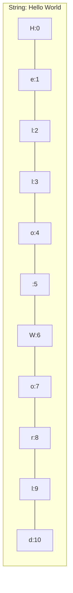

# P08: String (Xâu ký tự)

> **Tác giả:** Hà Trí Kiên<br>
> **Chủ đề:** Xâu ký tự, các phương thức, xử lý xâu trong thi đấu

---

## 1. Tổng quan

String (xâu ký tự) là chuỗi các ký tự. Trong thi đấu, xử lý xâu là **lĩnh vực quan trọng** với nhiều bài toán.

```python
s = "Hello World"
```

!!! info "String trong Python"
    - String là **immutable** (không thể thay đổi sau khi tạo)
    - Hỗ trợ **indexing** và **slicing** như list
    - Có rất nhiều phương thức sẵn có

---

## 2. Tạo String

```python
# Dùng nháy kép
s1 = "Hello"

# Dùng nháy đơn
s2 = 'Hello'

# String nhiều dòng
s3 = """Dòng 1
Dòng 2
Dòng 3"""

# String nhiều dòng với nháy đơn
s4 = '''Dòng 1
Dòng 2
Dòng 3'''

# Escape characters
s5 = "Hello\nWorld"     # Xuống dòng
s6 = "Hello\tWorld"     # Tab
s7 = "Hello\"World"     # Nháy kép
s8 = "Hello\\World"     # Backslash
```

---

## 3. Truy cập ký tự (Indexing)

```python
s = "Hello World"

# Index từ trái
print(s[0])    # H
print(s[1])    # e
print(s[4])    # o

# Index từ phải (âm)
print(s[-1])   # d
print(s[-2])   # l
print(s[-5])   # W

# IndexError nếu index ngoài phạm vi
# print(s[100])  # IndexError!
```



---

## 4. Slicing — Cắt xâu

```python
s = "Hello World"

# s[start:stop] — từ start đến stop-1
print(s[0:5])    # Hello
print(s[6:11])   # World
print(s[:5])     # Hello (từ đầu)
print(s[6:])     # World (đến cuối)

# Với step
print(s[::2])    # HloWr (mỗi 2 ký tự)
print(s[::-1])   # dlroW olleH (đảo ngược)

# Copy
s2 = s[:]        # Tạo bản copy
```

---

## 5. Các phương thức thường dùng

### 5.1. Chuyển đổi hoa/thường

```python
s = "Hello World"

print(s.upper())       # HELLO WORLD
print(s.lower())       # hello world
print(s.title())       # Hello World
print(s.capitalize())  # Hello world (chỉ hoa chữ cái đầu)
print(s.swapcase())    # hELLO wORLD
```

### 5.2. Tìm kiếm

```python
s = "Hello World"

# find: trả về vị trí đầu tiên, -1 nếu không tìm thấy
print(s.find("World"))    # 6
print(s.find("Python"))   # -1
print(s.find("o"))        # 4
print(s.find("o", 5))     # 7 (tìm từ vị trí 5)

# index: tương tự find nhưng RAISE exception nếu không tìm thấy
print(s.index("World"))   # 6
# print(s.index("Python")) # ValueError!

# rfind, rindex: tìm từ phải sang trái
print(s.rfind("o"))       # 7

# count: đếm số lần xuất hiện
print(s.count("l"))       # 3
print(s.count("lo"))      # 1

# startswith, endswith
print(s.startswith("Hello"))  # True
print(s.startswith("World"))  # False
print(s.endswith("World"))    # True
print(s.endswith("Hello"))    # False
```

### 5.3. Thay thế

```python
s = "Hello World"

# replace: thay thế TẤT CẢ
print(s.replace("World", "Python"))  # Hello Python
print(s.replace("l", "L"))           # HeLLo WorLd
print(s.replace("l", "L", 1))       # HeLlo World (chỉ thay 1 lần)
```

### 5.4. Tách và nối

```python
# split: tách chuỗi thành list
s = "Hello World Python"
print(s.split())           # ['Hello', 'World', 'Python']
print(s.split("o"))        # ['Hell', ' W', 'rld Pyth', 'n']

# split với maxsplit
print(s.split(" ", 1))    # ['Hello', 'World Python']

# join: nối list thành chuỗi
words = ["Hello", "World", "Python"]
print(" ".join(words))     # "Hello World Python"
print("-".join(words))     # "Hello-World-Python"
print("".join(words))      # "HelloWorldPython"
```

### 5.5. Loại bỏ khoảng trắng

```python
s = "  Hello World  "

print(s.strip())      # "Hello World" (2 đầu)
print(s.lstrip())     # "Hello World  " (trái)
print(s.rstrip())     # "  Hello World" (phải)

# Strip ký tự cụ thể
print("***Hello***".strip("*"))   # "Hello"
print("xxxHellolloxxx".strip("x")) # "Hellollo"
```

### 5.6. Kiểm tra

```python
s = "Hello123"

print(s.isalpha())    # False (chỉ chứa chữ cái?)
print(s.isdigit())    # False (chỉ chứa chữ số?)
print(s.isalnum())    # True (chữ cái hoặc chữ số?)
print(s.isspace())    # False (chỉ chứa khoảng trắng?)
print(s.isupper())    # False (tất cả hoa?)
print(s.islower())    # False (tất cả thường?)

# Kiểm tra cụ thể
print("123".isdigit())      # True
print("abc".isalpha())      # True
print("abc123".isalnum())   # True
```

### 5.7. Căn chỉnh

```python
s = "Hello"

print(s.center(20))       # "       Hello        "
print(s.center(20, "*"))  # "*******Hello********"
print(s.ljust(20))        # "Hello               "
print(s.ljust(20, "-"))   # "Hello---------------"
print(s.rjust(20))        # "               Hello"
print(s.rjust(20, "0"))   # "000000000000000Hello"
print(s.zfill(10))        # "00000Hello"
```

---

## 6. Format String

### 6.1. f-string (Khuyến nghị)

```python
name = "Alice"
age = 15
score = 9.5

print(f"Ten: {name}, Tuoi: {age}")
print(f"Diem: {score:.2f}")
print(f"{name:>10}")    # Căn phải 10 ký tự
print(f"{name:<10}")    # Căn trái 10 ký tự
print(f"{name:^10}")    # Căn giữa 10 ký tự
print(f"{1000000:,}")   # 1,000,000
```

### 6.2. format() method

```python
print("{} is {}".format(name, age))
print("{1} is {0}".format(age, name))
print("{n} is {a}".format(n=name, a=age))
```

---

## 7. So sánh String

```python
# So sánh theo thứ tự từ điển (ASCII)
print("abc" < "abd")   # True
print("abc" < "ab")    # False
print("a" < "b")       # True
print("A" < "a")       # True (A=65, a=97)

# So sánh bằng
print("abc" == "abc")   # True
print("abc" == "ABC")   # False

# So sánh không phân biệt hoa thường
print("abc".lower() == "ABC".lower())  # True
```

---

## 8. String là Immutable

```python
s = "Hello"

# SAI: Không thể thay đổi ký tự
# s[0] = "h"  # TypeError!

# ĐÚNG: Tạo string mới
s = "h" + s[1:]    # "hello"
s = s.replace("H", "h")  # "hello"
```

---

## 9. Pattern thường gặp trong thi đấu

### 9.1. Đọc input nhiều từ

```python
# Đọc 1 dòng, tách thành list
words = input().split()

# Đọc và chuyển thành số
arr = list(map(int, input().split()))
```

### 9.2. Đếm tần suất ký tự

```python
s = input()

# Cách 1: Dict
freq = {}
for c in s:
    freq[c] = freq.get(c, 0) + 1

# Cách 2: Counter
from collections import Counter
freq = Counter(s)
```

### 9.3. Kiểm tra palindrome

```python
s = input()
if s == s[::-1]:
    print("Palindrome")
else:
    print("Not palindrome")
```

### 9.4. Tìm xâu con

```python
s = "Hello World"

# Kiểm tra xâu con
if "World" in s:
    print("Tim thay!")

# Tìm vị trí
pos = s.find("World")
if pos != -1:
    print(f"Tim thay tai vi tri {pos}")
```

### 9.5. Tách số từ xâu

```python
s = "abc123def456"

# Tách tất cả số
numbers = []
current = ""
for c in s:
    if c.isdigit():
        current += c
    else:
        if current:
            numbers.append(int(current))
            current = ""
if current:
    numbers.append(int(current))

print(numbers)  # [123, 456]
```

### 9.6. Xử lý từng ký tự

```python
s = input()

# Duyệt từng ký tự
for c in s:
    print(c, end=" ")

# Đảo ngược
reversed_s = s[::-1]

# Đếm chữ hoa
upper_count = sum(1 for c in s if c.isupper())

# Chuyển chữ hoa/thường xen kẽ
result = ""
for i, c in enumerate(s):
    if i % 2 == 0:
        result += c.upper()
    else:
        result += c.lower()
```

### 9.7. Tạo alphabet

```python
import string

print(string.ascii_lowercase)  # "abcdefghijklmnopqrstuvwxyz"
print(string.ascii_uppercase)  # "ABCDEFGHIJKLMNOPQRSTUVWXYZ"
print(string.ascii_letters)    # ascii_lowercase + ascii_uppercase
print(string.digits)           # "0123456789"
```

---

## 10. So sánh với C++

=== "Python"

    ```python
    s = "Hello"
    
    # Độ dài
    len(s)
    
    # Truy cập
    s[0]
    
    # Slicing
    s[1:3]
    
    # Tìm kiếm
    s.find("ll")
    
    # Thay thế
    s.replace("H", "h")
    
    # Tách
    s.split(" ")
    
    # Nói
    " ".join(words)
    ```

=== "C++"

    ```cpp
    string s = "Hello";
    
    // Độ dài
    s.length();
    
    // Truy cập
    s[0];
    
    // Substring
    s.substr(1, 2);
    
    // Tìm kiếm
    s.find("ll");
    
    // Thay thế
    // Không có replace trực tiếp
    
    // Tách (phải tự cài)
    // Dùng stringstream
    
    // Nối
    // Dùng stringstream hoặc +=
    ```

---

## 11. Lưu ý / Cạm bẫy hay gặp

### Bẫy 1: String là Immutable

```python
s = "Hello"
# s[0] = "h"  # TypeError! Không thể thay đổi

# Phải tạo string mới
s = "h" + s[1:]
```

### Bẫy 2: Phân biệt hoa/thường

```python
# So sánh phân biệt hoa thường
print("Hello" == "hello")  # False

# So sánh không phân biệt
print("Hello".lower() == "hello".lower())  # True
```

### Bẫy 3: find vs index

```python
s = "Hello"

# find: trả về -1 nếu không tìm thấy
print(s.find("x"))  # -1

# index: RAISE exception nếu không tìm thấy
# print(s.index("x"))  # ValueError!
```

### Bẫy 4: split() mặc định tách theo khoảng trắng

```python
s = "  Hello   World  "
print(s.split())      # ['Hello', 'World'] — tách tất cả khoảng trắng
print(s.split(" "))   # ['', '', 'Hello', '', '', 'World', '', ''] — tách theo đúng 1 space
```

### Bẫy 5: join() yêu cầu list of strings

```python
# SAI
# " ".join([1, 2, 3])  # TypeError!

# ĐÚNG
" ".join(map(str, [1, 2, 3]))  # "1 2 3"
" ".join([str(x) for x in [1, 2, 3]])  # "1 2 3"
```

---

## 12. Bài tập thực hành

### Bài 1: Đếm ký tự
Cho xâu s. Đếm số chữ hoa, chữ thường, chữ số.

```python
s = input()
# Code của bạn ở đây
```

??? tip "Lời giải"
    ```python
    s = input()
    upper = sum(1 for c in s if c.isupper())
    lower = sum(1 for c in s if c.islower())
    digit = sum(1 for c in s if c.isdigit())
    print(f"Hoa: {upper}, Thuong: {lower}, So: {digit}")
    ```

### Bài 2: Kiểm tra palindrome
Cho xâu s. Kiểm tra s có phải palindrome không.

```python
s = input()
# Code của bạn ở đây
```

??? tip "Lời giải"
    ```python
    s = input()
    if s == s[::-1]:
        print("Palindrome")
    else:
        print("Not palindrome")
    ```

### Bài 3: Đảo ngược từ
Cho xâu s gồm nhiều từ. Đảo ngược thứ tự các từ.

```python
s = input()
# Code của bạn ở đây
```

??? tip "Lời giải"
    ```python
    s = input()
    words = s.split()
    print(" ".join(reversed(words)))
    # Hoặc: print(" ".join(words[::-1]))
    ```

### Bài 4: Mã Caesar
Cho xâu s và số k. Dịch mỗi ký tự sang phải k vị trí (chữ hoa/thường).

```python
s = input()
k = int(input())
# Code của bạn ở đây
```

??? tip "Lời giải"
    ```python
    s = input()
    k = int(input())
    result = ""
    for c in s:
        if c.isupper():
            result += chr((ord(c) - ord('A') + k) % 26 + ord('A'))
        elif c.islower():
            result += chr((ord(c) - ord('a') + k) % 26 + ord('a'))
        else:
            result += c
    print(result)
    ```

### Bài 5: Tìm xâu con dài nhất không lặp
Cho xâu s. Tìm độ dài xâu con dài nhất mà không có ký tự lặp lại.

```python
s = input()
# Code của bạn ở đây
```

??? tip "Lời giải"
    ```python
    s = input()
    max_len = 0
    current = ""
    for c in s:
        while c in current:
            current = current[1:]
        current += c
        max_len = max(max_len, len(current))
    print(max_len)
    ```

---

## 13. Bài tập luyện tập

| Bài | Nền tảng | Độ khó | Chủ đề |
|-----|----------|--------|--------|
| [CSES - Weird String](https://cses.fi/problemset/task/1068) | CSES | ⭐ | String cơ bản |
| [CSES - Palindrome Reorder](https://cses.fi/problemset/task/1755) | CSES | ⭐⭐ | Đếm tần suất, palindrome |
| [CSES - Creating Strings](https://cses.fi/problemset/task/1622) | CSES | ⭐⭐ | Hoán vị xâu |

---

## Bài viết liên quan

- [← P07: Vòng lặp — Nâng cao](P07-vong-lap-nang-cao.md)
- [P09: List & Array 1D →](P09-list-array-1d.md)

---

**Bài trước:** [P07: Vòng lặp — Nâng cao](P07-vong-lap-nang-cao.md)<br>
**Bài tiếp theo:** [P09: List & Array 1D →](P09-list-array-1d.md)
