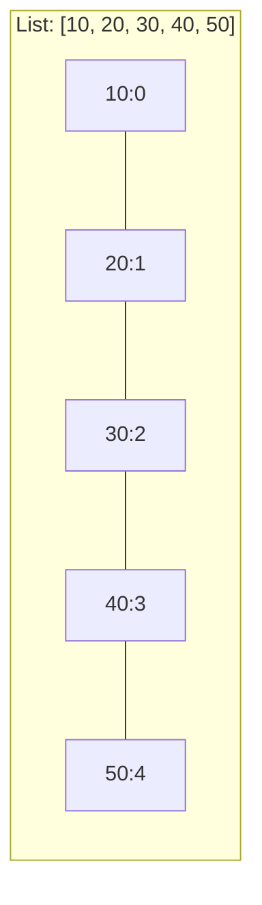

# P09: List & Array 1D

> **Tác giả:** Hà Trí Kiên<br>
> **Chủ đề:** Mảng 1 chiều, các thao tác, slicing, sort, copy

---

## 1. Tổng quan

List là cấu trúc dữ liệu **quan trọng nhất** trong Python. Hầu hết bài toán đều cần list.

```python
arr = [1, 2, 3, 4, 5]
```

!!! info "List trong Python"
    - **Ordered**: Giữ nguyên thứ tự
    - **Mutable**: Có thể thay đổi
    - **Hỗn hợp**: Chứa được nhiều kiểu dữ liệu
    - **Index từ 0**

---

## 2. Tạo List

```python
# Cách 1: Dùng []
arr = [1, 2, 3, 4, 5]

# Cách 2: Dùng list()
arr = list(range(5))  # [0, 1, 2, 3, 4]

# Cách 3: List comprehension
arr = [i * 2 for i in range(5)]  # [0, 2, 4, 6, 8]

# Cách 4: Tạo list n phần tử cùng giá trị
arr = [0] * 5  # [0, 0, 0, 0, 0]

# Cách 5: Đọc từ input
arr = list(map(int, input().split()))

# List rỗng
arr = []
arr = list()
```

!!! warning "Tạo 2D array — CẨN THẬN"
    ```python
    # SAI: Tất cả hàng cùng tham chiếu
    matrix = [[0] * 3] * 3
    matrix[0][0] = 1
    print(matrix)  # [[1, 0, 0], [1, 0, 0], [1, 0, 0]] — SAI!
    
    # ĐÚNG: Mỗi hàng riêng biệt
    matrix = [[0] * 3 for _ in range(3)]
    matrix[0][0] = 1
    print(matrix)  # [[1, 0, 0], [0, 0, 0], [0, 0, 0]]
    ```

---

## 3. Truy cập phần tử (Indexing)

```python
arr = [10, 20, 30, 40, 50]

# Index từ trái
print(arr[0])    # 10
print(arr[1])    # 20
print(arr[4])    # 50

# Index từ phải (âm)
print(arr[-1])   # 50
print(arr[-2])   # 40

# IndexError nếu index ngoài phạm vi
# print(arr[10])  # IndexError!
```



---

## 4. Slicing — Cắt list

```python
arr = [10, 20, 30, 40, 50, 60, 70]

# arr[start:stop] — từ start đến stop-1
print(arr[1:4])     # [20, 30, 40]
print(arr[:3])      # [10, 20, 30] (từ đầu)
print(arr[4:])      # [50, 60, 70] (đến cuối)

# Với step
print(arr[::2])     # [10, 30, 50, 70] (mỗi 2 phần tử)
print(arr[1::2])    # [20, 40, 60] (bắt đầu từ index 1)

# Đảo ngược
print(arr[::-1])    # [70, 60, 50, 40, 30, 20, 10]

# Copy
arr2 = arr[:]       # Bản copy (không phải tham chiếu!)

# Gán slice
arr[2:5] = [300, 400, 500]  # Thay đổi phần tử 2, 3, 4

# Xóa slice
del arr[2:5]        # Xóa phần tử 2, 3, 4
```

---

## 5. Các phương thức thường dùng

### 5.1. Thêm phần tử

```python
arr = [1, 2, 3]

# append: thêm cuối — O(1)
arr.append(4)       # [1, 2, 3, 4]
arr.append([5, 6])  # [1, 2, 3, 4, [5, 6]] — thêm list như 1 phần tử!

# extend: thêm nhiều phần tử — O(k)
arr = [1, 2, 3]
arr.extend([4, 5])  # [1, 2, 3, 4, 5]

# insert: thêm tại vị trí — O(n)
arr = [1, 2, 3]
arr.insert(1, 10)   # [1, 10, 2, 3]
arr.insert(0, 0)    # [0, 1, 10, 2, 3]
```

### 5.2. Xóa phần tử

```python
arr = [1, 2, 3, 4, 5]

# pop: xóa cuối — O(1)
x = arr.pop()       # x = 5, arr = [1, 2, 3, 4]

# pop(index): xóa tại vị trí — O(n)
x = arr.pop(1)      # x = 2, arr = [1, 3, 4]

# remove: xóa phần tử đầu tiên có giá trị — O(n)
arr = [1, 2, 3, 2, 1]
arr.remove(2)       # arr = [1, 3, 2, 1]

# del: xóa tại vị trí hoặc slice
arr = [1, 2, 3, 4, 5]
del arr[1]          # arr = [1, 3, 4, 5]
del arr[1:3]        # arr = [1, 5]

# clear: xóa tất cả
arr.clear()         # arr = []
```

### 5.3. Tìm kiếm

```python
arr = [3, 7, 2, 9, 5, 7]

# index: vị trí đầu tiên — O(n)
print(arr.index(7))     # 1
print(arr.index(7, 2))  # 5 (tìm từ vị trí 2)

# count: đếm số lần xuất hiện — O(n)
print(arr.count(7))     # 2
print(arr.count(1))     # 0

# in: kiểm tra tồn tại — O(n)
print(7 in arr)         # True
print(1 in arr)         # False
print(1 not in arr)     # True
```

### 5.4. Sắp xếp

```python
arr = [3, 1, 4, 1, 5, 9, 2, 6]

# sort: sắp xếp tại chỗ — O(n log n)
arr.sort()              # arr = [1, 1, 2, 3, 4, 5, 6, 9]
arr.sort(reverse=True)  # arr = [9, 6, 5, 4, 3, 2, 1, 1]

# sort với key
arr = ["banana", "apple", "cherry"]
arr.sort(key=len)       # Sắp xếp theo độ dài
arr.sort(key=lambda x: x[1])  # Sắp xếp theo ký tự thứ 2

# sorted: trả về list mới, không thay đổi arr gốc
arr = [3, 1, 4, 1, 5]
sorted_arr = sorted(arr)           # [1, 1, 3, 4, 5]
sorted_arr = sorted(arr, reverse=True)  # [5, 4, 3, 1, 1]
```

### 5.5. Đảo ngược

```python
arr = [1, 2, 3, 4, 5]

# reverse: đảo tại chỗ — O(n)
arr.reverse()       # arr = [5, 4, 3, 2, 1]

# Slicing: tạo list mới
arr2 = arr[::-1]    # arr2 = [1, 2, 3, 4, 5]

# reversed: iterator
arr3 = list(reversed(arr))  # [1, 2, 3, 4, 5]
```

### 5.6. Copy

```python
arr = [1, 2, 3, 4, 5]

# Gán tham chiếu (không phải copy!)
arr2 = arr           # arr2 trỏ cùng vùng nhớ!
arr2.append(6)
print(arr)           # [1, 2, 3, 4, 5, 6] — arr cũng bị thay đổi!

# SHALLOW COPY (riêng biệt)
arr = [1, 2, 3, 4, 5]
arr2 = arr.copy()    # hoặc arr2 = arr[:] hoặc arr2 = list(arr)
arr2.append(6)
print(arr)           # [1, 2, 3, 4, 5] — arr không bị thay đổi

# DEEP COPY (cho list 2D)
import copy
matrix = [[1, 2], [3, 4]]
matrix2 = copy.deepcopy(matrix)
matrix2[0][0] = 100
print(matrix)        # [[1, 2], [3, 4]] — matrix không bị thay đổi
```

---

## 6. Các hàm tích hợp với List

```python
arr = [3, 1, 4, 1, 5, 9, 2, 6]

# len: độ dài
print(len(arr))     # 8

# min, max
print(min(arr))     # 1
print(max(arr))     # 9

# sum
print(sum(arr))     # 31

# any, all
print(any(x > 5 for x in arr))  # True
print(all(x > 0 for x in arr))  # True

# sorted
print(sorted(arr))  # [1, 1, 2, 3, 4, 5, 6, 9]

# reversed
print(list(reversed(arr)))  # [6, 2, 9, 5, 1, 4, 1, 3]

# enumerate
for i, x in enumerate(arr):
    print(f"arr[{i}] = {x}")

# zip
arr2 = [10, 20, 30, 40, 50, 60, 70, 80]
for x, y in zip(arr, arr2):
    print(x, y)

# map, filter
squares = list(map(lambda x: x**2, arr))
evens = list(filter(lambda x: x % 2 == 0, arr))

# join (yêu cầu list of strings)
words = ["Hello", "World"]
print(" ".join(words))  # "Hello World"
```

---

## 7. List Comprehension

```python
# Cơ bản
arr = [i for i in range(10)]           # [0, 1, ..., 9]
arr = [i * 2 for i in range(10)]       # [0, 2, 4, ..., 18]
arr = [i ** 2 for i in range(10)]      # [0, 1, 4, 9, ...]

# Với điều kiện
arr = [i for i in range(20) if i % 2 == 0]  # Số chẵn
arr = [x for x in arr if x > 0]             # Số dương

# if-else
arr = ["Chan" if x % 2 == 0 else "Le" for x in range(5)]

# Lồng nhau
matrix = [[i * j for j in range(1, 10)] for i in range(1, 10)]
flat = [x for row in matrix for x in row]
```

---

## 8. Pattern thường gặp trong thi đấu

### 8.1. Đọc mảng

```python
n = int(input())
arr = list(map(int, input().split()))
```

### 8.2. Prefix sum

```python
n = int(input())
arr = list(map(int, input().split()))

prefix = [0] * (n + 1)
for i in range(n):
    prefix[i + 1] = prefix[i] + arr[i]

# Tổng đoạn [l, r]
def range_sum(l, r):
    return prefix[r + 1] - prefix[l]
```

### 8.3. Đếm tần suất

```python
arr = list(map(int, input().split()))

# Cách 1: Dict
freq = {}
for x in arr:
    freq[x] = freq.get(x, 0) + 1

# Cách 2: Counter
from collections import Counter
freq = Counter(arr)
```

### 8.4. Tìm max/min với index

```python
arr = list(map(int, input().split()))

# max, min
max_val = max(arr)
min_val = min(arr)

# index
max_idx = arr.index(max_val)
min_idx = arr.index(min_val)
```

### 8.5. Sắp xếp với nhiều tiêu chí

```python
# Sắp xếp theo tổng chữ số
def digit_sum(n):
    return sum(int(d) for d in str(abs(n)))

arr = list(map(int, input().split()))
arr.sort(key=lambda x: (digit_sum(x), x))
```

### 8.6. Two pointers

```python
arr = sorted(list(map(int, input().split())))
target = int(input())

left, right = 0, len(arr) - 1
while left < right:
    s = arr[left] + arr[right]
    if s == target:
        print(f"Tim thay: {arr[left]} + {arr[right]}")
        break
    elif s < target:
        left += 1
    else:
        right -= 1
```

---

## 9. So sánh với C++

=== "Python"

    ```python
    arr = [1, 2, 3, 4, 5]
    
    # Độ dài
    len(arr)
    
    # Thêm cuối
    arr.append(6)
    
    # Sắp xếp
    arr.sort()
    
    # Tìm kiếm
    x in arr
    
    # Xóa cuối
    arr.pop()
    ```

=== "C++"

    ```cpp
    vector<int> arr = {1, 2, 3, 4, 5};
    
    // Độ dài
    arr.size();
    
    // Thêm cuối
    arr.push_back(6);
    
    // Sắp xếp
    sort(arr.begin(), arr.end());
    
    // Tìm kiếm
    find(arr.begin(), arr.end(), x) != arr.end();
    
    // Xóa cuối
    arr.pop_back();
    ```

---

## 10. Lưu ý / Cạm bẫy hay gặp

### Bẫy 1: Gán tham chiếu vs copy

```python
# SAI: Cùng tham chiếu
a = [1, 2, 3]
b = a
b.append(4)
print(a)  # [1, 2, 3, 4] — a cũng bị thay đổi!

# ĐÚNG: Copy
a = [1, 2, 3]
b = a.copy()
b.append(4)
print(a)  # [1, 2, 3] — a không bị thay đổi
```

### Bẫy 2: Tạo 2D array sai

```python
# SAI
matrix = [[0] * 3] * 3
matrix[0][0] = 1
print(matrix)  # [[1, 0, 0], [1, 0, 0], [1, 0, 0]]

# ĐÚNG
matrix = [[0] * 3 for _ in range(3)]
```

### Bẫy 3: Chỉnh sửa list khi đang duyệt

```python
# SAI
arr = [1, 2, 3, 4, 5]
for x in arr:
    if x % 2 == 0:
        arr.remove(x)  # Có thể bỏ sót!

# ĐÚNG
arr = [x for x in arr if x % 2 != 0]
# Hoặc
arr = [1, 2, 3, 4, 5]
for x in arr[:]:  # Duyệt bản copy
    if x % 2 == 0:
        arr.remove(x)
```

### Bẫy 4: index() chỉ trả về lần đầu tiên

```python
arr = [1, 2, 3, 2, 1]
print(arr.index(2))  # 1 (không phải 3!)

# Tìm tất cả vị trí
positions = [i for i, x in enumerate(arr) if x == 2]
print(positions)  # [1, 3]
```

### Bẫy 5: pop() với index rỗng

```python
arr = []
# arr.pop()  # IndexError! List rỗng
```

---

## 11. Bài tập thực hành

### Bài 1: Đảo ngược mảng
Đọc mảng. In ra mảng đảo ngược.

<div class="cp-pg" data-language="python" data-starter="# Viết code ở đây" data-input="5
1 2 3 4 5" data-expected="5 4 3 2 1" data-hint="Dùng arr[::-1] hoặc reversed()"></div>

??? tip "Lời giải"
    ```python
    n = int(input())
    arr = list(map(int, input().split()))
    print(*arr[::-1])
    ```

### Bài 2: Tìm số lớn thứ 2
Đọc mảng. Tìm số lớn thứ 2 (khác số lớn nhất).

<div class="cp-pg" data-language="python" data-starter="# Viết code ở đây" data-input="5
3 1 4 1 5" data-expected="4" data-hint="Dùng set() để loại trùng, sort giảm dần, lấy phần tử thứ 2"></div>

??? tip "Lời giải"
    ```python
    n = int(input())
    arr = list(map(int, input().split()))
    unique_arr = list(set(arr))
    unique_arr.sort(reverse=True)
    print(unique_arr[1])
    ```

### Bài 3: Xóa phần tử trùng
Đọc mảng. Xóa các phần tử trùng, giữ thứ tự xuất hiện.

<div class="cp-pg" data-language="python" data-starter="# Viết code ở đây" data-input="6
1 2 2 3 3 3" data-expected="1 2 3" data-hint="Dùng set để theo dõi đã thấy, duyệt mảng và chỉ thêm phần tử chưa thấy"></div>

??? tip "Lời giải"
    ```python
    n = int(input())
    arr = list(map(int, input().split()))
    seen = set()
    result = []
    for x in arr:
        if x not in seen:
            seen.add(x)
            result.append(x)
    print(*result)
    ```

### Bài 4: Sắp xếp theo tổng chữ số
Đọc mảng. Sắp xếp theo tổng chữ số tăng dần.

<div class="cp-pg" data-language="python" data-starter="# Viết code ở đây" data-input="5
13 4 21 100 7" data-expected="100 21 4 13 7" data-hint="Viết hàm tính tổng chữ số, dùng arr.sort(key=...)"></div>

??? tip "Lời giải"
    ```python
    n = int(input())
    arr = list(map(int, input().split()))
    
    def digit_sum(n):
        return sum(int(d) for d in str(abs(n)))
    
    arr.sort(key=lambda x: (digit_sum(x), x))
    print(*arr)
    ```

### Bài 5: Two Sum
Đọc mảng và target. Tìm 2 số có tổng bằng target.

<div class="cp-pg" data-language="python" data-starter="# Viết code ở đây" data-input="5
2 7 11 15 3
9" data-expected="0 1" data-hint="Dùng dict để lưu index đã thấy, kiểm tra complement = target - x"></div>

??? tip "Lời giải"
    ```python
    n = int(input())
    arr = list(map(int, input().split()))
    target = int(input())
    seen = {}
    for i, x in enumerate(arr):
        complement = target - x
        if complement in seen:
            print(seen[complement], i)
            break
        seen[x] = i
    ```

---

## 12. Bài tập luyện tập

### Bài 6: Đếm số dương
Cho mảng arr gồm n số nguyên. Đếm số phần tử dương.

<div class="cp-pg" data-language="python" data-starter="# Viết code ở đây" data-input="5
-1 2 -3 4 -5" data-expected="2" data-hint="Dùng sum(1 for x in arr if x &gt; 0)"></div>

??? tip "Lời giải"
    ```python
    n = int(input())
    arr = list(map(int, input().split()))
    count = sum(1 for x in arr if x > 0)
    print(count)
    ```

### Bài 7: Tìm vị trí phần tử lớn nhất
Cho mảng arr gồm n số nguyên. Tìm vị trí (index) của phần tử lớn nhất.

<div class="cp-pg" data-language="python" data-starter="# Viết code ở đây" data-input="5
3 1 4 1 5" data-expected="4" data-hint="Dùng arr.index(max(arr))"></div>

??? tip "Lời giải"
    ```python
    n = int(input())
    arr = list(map(int, input().split()))
    print(arr.index(max(arr)))
    ```

### Bài 8: Xoay mảng sang phải
Cho mảng arr gồm n phần tử và số k. Xoay mảng sang phải k vị trí.

<div class="cp-pg" data-language="python" data-starter="# Viết code ở đây" data-input="5 2
1 2 3 4 5" data-expected="4 5 1 2 3" data-hint="Dùng arr[-k:] + arr[:-k], nhớ k = k % n"></div>

??? tip "Lời giải"
    ```python
    n, k = map(int, input().split())
    arr = list(map(int, input().split()))
    k = k % n  # Xử lý k > n
    arr = arr[-k:] + arr[:-k]
    print(*arr)
    ```

### Bài 9: Đếm số lần xuất hiện
Cho mảng arr gồm n số nguyên. Đếm số lần xuất hiện của mỗi phần tử theo thứ tự xuất hiện.

<div class="cp-pg" data-language="python" data-starter="# Viết code ở đây" data-input="6
1 2 2 3 3 3" data-expected="1: 1
2: 2
3: 3" data-hint="Dùng dict để đếm, duyệt arr và tăng count cho mỗi phần tử"></div>

??? tip "Lời giải"
    ```python
    n = int(input())
    arr = list(map(int, input().split()))
    
    seen = {}
    for x in arr:
        if x not in seen:
            seen[x] = 0
        seen[x] += 1
    
    for key, val in seen.items():
        print(f"{key}: {val}")
    ```

### Bài 10: Trộn 2 mảng đã sắp xếp
Cho 2 mảng đã sắp xếp. Trộn thành 1 mảng đã sắp xếp.

<div class="cp-pg" data-language="python" data-starter="# Viết code ở đây" data-input="3 4
1 3 5
2 4 6 8" data-expected="1 2 3 4 5 6 8" data-hint="Dùng sorted(a + b) hoặc merge hai mảng đã sắp xếp"></div>

??? tip "Lời giải"
    ```python
    n, m = map(int, input().split())
    a = list(map(int, input().split()))
    b = list(map(int, input().split()))
    
    result = sorted(a + b)
    print(*result)
    ```

---

## Bài viết liên quan

- [← P08: String](P08-string.md)
- [P10: Array 2D & Matrix →](P10-array-2d.md)

---

**Bài trước:** [P08: String](P08-string.md)<br>
**Bài tiếp theo:** [P10: Array 2D & Matrix →](P10-array-2d.md)
