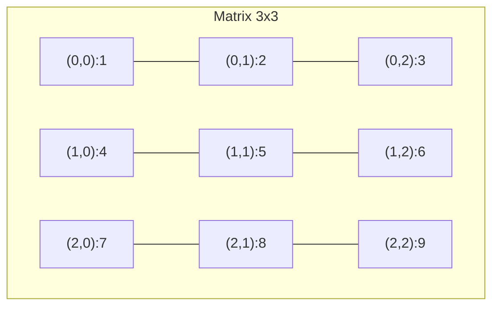

# P10: Array 2D & Matrix

> **Tác giả:** Hà Trí Kiên<br>
> **Chủ đề:** Ma trận, duyệt, thao tác, xoay, transpose

---

## 1. Tổng quan

Array 2D (ma trận) là cấu trúc dữ liệu **rất quan trọng** trong thi đấu. Nhiều bài toán liên quan đến lưới, đồ thị 2D, hình học.

```python
matrix = [
    [1, 2, 3],
    [4, 5, 6],
    [7, 8, 9]
]
```



---

## 2. Tạo Matrix

```python
# Cách 1: Tạo từ input
n, m = map(int, input().split())
matrix = [list(map(int, input().split())) for _ in range(n)]

# Cách 2: Tạo matrix toàn 0
matrix = [[0] * m for _ in range(n)]

# Cách 3: Tạo matrix toàn giá trị
matrix = [[1] * m for _ in range(n)]

# Cách 4: Tạo matrix từ công thức
matrix = [[i * j for j in range(m)] for i in range(n)]

# Cách 5: Tạo ma trận đơn vị
n = 5
identity = [[1 if i == j else 0 for j in range(n)] for i in range(n)]
```

!!! warning "Tạo 2D array — LƯU Ý"
    ```python
    # SAI: Tất cả hàng cùng tham chiếu
    matrix = [[0] * m] * n
    matrix[0][0] = 1
    # → Tất cả hàng đều thay đổi!
    
    # ĐÚNG: Mỗi hàng riêng biệt
    matrix = [[0] * m for _ in range(n)]
    ```

---

## 3. Truy cập phần tử

```python
matrix = [
    [1, 2, 3],
    [4, 5, 6],
    [7, 8, 9]
]

# Truy cập hàng i, cột j
print(matrix[0][0])  # 1
print(matrix[1][2])  # 6
print(matrix[2][1])  # 8

# Hàng i
print(matrix[1])     # [4, 5, 6]

# Cột j
col = [matrix[i][1] for i in range(3)]  # [2, 5, 8]
```

---

## 4. Duyệt Matrix

### 4.1. Duyệt từng phần tử

```python
n, m = len(matrix), len(matrix[0])

# Cách 1: Dùng range
for i in range(n):
    for j in range(m):
        print(matrix[i][j], end=" ")
    print()

# Cách 2: Duyệt hàng
for row in matrix:
    for x in row:
        print(x, end=" ")
    print()

# Cách 3: Duyệt hàng + in
for row in matrix:
    print(*row)
```

### 4.2. Duyệt hàng

```python
# Duyệt hàng i
i = 1
for j in range(m):
    print(matrix[i][j], end=" ")

# Hoặc
print(*matrix[i])
```

### 4.3. Duyệt cột

```python
# Duyệt cột j
j = 1
for i in range(n):
    print(matrix[i][j], end=" ")
```

### 4.4. Duyệt đường chéo chính

```python
# Đường chéo chính: i == j
for i in range(min(n, m)):
    print(matrix[i][i], end=" ")
```

### 4.5. Duyệt đường chéo phụ

```python
# Đường chéo phụ: i + j == n - 1
for i in range(min(n, m)):
    print(matrix[i][m - 1 - i], end=" ")
```

### 4.6. Duyệt 4 hướng

```python
dx = [0, 0, 1, -1]
dy = [1, -1, 0, 0]

x, y = 1, 2  # Vị trí hiện tại
for k in range(4):
    nx, ny = x + dx[k], y + dy[k]
    if 0 <= nx < n and 0 <= ny < m:
        print(f"({nx}, {ny}): {matrix[nx][ny]}")
```

### 4.7. Duyệt 8 hướng

```python
dx = [-1, -1, -1, 0, 0, 1, 1, 1]
dy = [-1, 0, 1, -1, 1, -1, 0, 1]

x, y = 1, 2
for k in range(8):
    nx, ny = x + dx[k], y + dy[k]
    if 0 <= nx < n and 0 <= ny < m:
        print(f"({nx}, {ny}): {matrix[nx][ny]}")
```

### 4.8. Duyệt theo đường xoắn ốc

```python
def spiral_order(matrix):
    if not matrix:
        return []
    
    result = []
    top, bottom = 0, len(matrix) - 1
    left, right = 0, len(matrix[0]) - 1
    
    while top <= bottom and left <= right:
        # Duyệt hàng trên
        for j in range(left, right + 1):
            result.append(matrix[top][j])
        top += 1
        
        # Duyệt cột phải
        for i in range(top, bottom + 1):
            result.append(matrix[i][right])
        right -= 1
        
        # Duyệt hàng dưới
        if top <= bottom:
            for j in range(right, left - 1, -1):
                result.append(matrix[bottom][j])
            bottom -= 1
        
        # Duyệt cột trái
        if left <= right:
            for i in range(bottom, top - 1, -1):
                result.append(matrix[i][left])
            left += 1
    
    return result
```

---

## 5. Thao tác với Matrix

### 5.1. Transpose (Chuyển vị)

```python
matrix = [
    [1, 2, 3],
    [4, 5, 6]
]

# Cách 1: List comprehension
transposed = [[matrix[j][i] for j in range(len(matrix))] for i in range(len(matrix[0]))]
# [[1, 4], [2, 5], [3, 6]]

# Cách 2: zip
transposed = list(map(list, zip(*matrix)))
# [[1, 4], [2, 5], [3, 6]]
```

### 5.2. Xoay 90 độ clockwise

```python
matrix = [
    [1, 2, 3],
    [4, 5, 6],
    [7, 8, 9]
]

# Xoay 90 độ clockwise
# Cách 1: Transpose + Reverse mỗi hàng
rotated = list(map(list, zip(*matrix[::-1])))
# [[7, 4, 1], [8, 5, 2], [9, 6, 3]]

# Cách 2: List comprehension
n, m = len(matrix), len(matrix[0])
rotated = [[matrix[n-1-j][i] for j in range(n)] for i in range(m)]
```

### 5.3. Xoay 90 độ counter-clockwise

```python
# Xoay 90 độ counter-clockwise
rotated = list(map(list, zip(*matrix)))[::-1]
# [[3, 6, 9], [2, 5, 8], [1, 4, 7]]
```

### 5.4. Xoay 180 độ

```python
# Xoay 180 độ
rotated = [row[::-1] for row in matrix[::-1]]
```

### 5.5. Flip ngang

```python
# Flip ngang (đảo ngược mỗi hàng)
flipped = [row[::-1] for row in matrix]
```

### 5.6. Flip dọc

```python
# Flip dọc (đảo ngược thứ tự hàng)
flipped = matrix[::-1]
```

---

## 6. Flatten 2D → 1D

```python
matrix = [
    [1, 2, 3],
    [4, 5, 6],
    [7, 8, 9]
]

# Cách 1: List comprehension
flat = [x for row in matrix for x in row]
# [1, 2, 3, 4, 5, 6, 7, 8, 9]

# Cách 2: itertools.chain
import itertools
flat = list(itertools.chain.from_iterable(matrix))

# Cách 3: sum
flat = sum(matrix, [])
```

---

## 7. Tạo Matrix từ 1D

```python
arr = [1, 2, 3, 4, 5, 6, 7, 8, 9]
n, m = 3, 3

# Tạo matrix n x m từ mảng 1D
matrix = [arr[i * m:(i + 1) * m] for i in range(n)]
# [[1, 2, 3], [4, 5, 6], [7, 8, 9]]

# Chuyển index 1D → 2D
def to_2d(idx, m):
    return idx // m, idx % m

# Chuyển index 2D → 1D
def to_1d(i, j, m):
    return i * m + j
```

---

## 8. Pattern thường gặp trong thi đấu

### 8.1. Đọc matrix từ input

```python
n, m = map(int, input().split())
matrix = [list(map(int, input().split())) for _ in range(n)]
```

### 8.2. BFS trên grid

```python
from collections import deque

n, m = map(int, input().split())
matrix = [list(map(int, input().split())) for _ in range(n)]

dx = [0, 0, 1, -1]
dy = [1, -1, 0, 0]

def bfs(start_x, start_y):
    visited = [[False] * m for _ in range(n)]
    queue = deque([(start_x, start_y)])
    visited[start_x][start_y] = True
    
    while queue:
        x, y = queue.popleft()
        for k in range(4):
            nx, ny = x + dx[k], y + dy[k]
            if 0 <= nx < n and 0 <= ny < m and not visited[nx][ny]:
                visited[nx][ny] = True
                queue.append((nx, ny))
```

### 8.3. DFS trên grid

```python
n, m = map(int, input().split())
matrix = [list(map(int, input().split())) for _ in range(n)]

dx = [0, 0, 1, -1]
dy = [1, -1, 0, 0]

def dfs(x, y, visited):
    visited[x][y] = True
    for k in range(4):
        nx, ny = x + dx[k], y + dy[k]
        if 0 <= nx < n and 0 <= ny < m and not visited[nx][ny]:
            dfs(nx, ny, visited)
```

### 8.4. Prefix sum 2D

```python
n, m = map(int, input().split())
matrix = [list(map(int, input().split())) for _ in range(n)]

# Tạo prefix sum 2D
prefix = [[0] * (m + 1) for _ in range(n + 1)]
for i in range(n):
    for j in range(m):
        prefix[i + 1][j + 1] = matrix[i][j] + prefix[i][j + 1] + prefix[i + 1][j] - prefix[i][j]

# Tổng hình chữ nhật (r1, c1) → (r2, c2)
def rect_sum(r1, c1, r2, c2):
    return prefix[r2 + 1][c2 + 1] - prefix[r1][c2 + 1] - prefix[r2 + 1][c1] + prefix[r1][c1]
```

### 8.5. Flood fill

```python
n, m = map(int, input().split())
matrix = [list(map(int, input().split())) for _ in range(n)]

dx = [0, 0, 1, -1]
dy = [1, -1, 0, 0]

def flood_fill(x, y, old_val, new_val):
    if x < 0 or x >= n or y < 0 or y >= m:
        return
    if matrix[x][y] != old_val:
        return
    matrix[x][y] = new_val
    for k in range(4):
        flood_fill(x + dx[k], y + dy[k], old_val, new_val)
```

---

## 9. So sánh với C++

=== "Python"

    ```python
    # Tạo matrix
    matrix = [[0] * m for _ in range(n)]
    
    # Truy cập
    matrix[i][j]
    
    # Duyệt
    for row in matrix:
        for x in row:
            print(x)
    ```

=== "C++"

    ```cpp
    // Tạo matrix
    vector<vector<int>> matrix(n, vector<int>(m, 0));
    
    // Truy cập
    matrix[i][j];
    
    // Duyệt
    for (int i = 0; i < n; i++) {
        for (int j = 0; j < m; j++) {
            cout << matrix[i][j];
        }
    }
    ```

---

## 10. Lưu ý / Cạm bẫy hay gặp

### Bẫy 1: Tạo 2D array sai

```python
# SAI
matrix = [[0] * m] * n
matrix[0][0] = 1
# → Tất cả hàng đều thay đổi!

# ĐÚNG
matrix = [[0] * m for _ in range(n)]
```

### Bẫy 2: Truy cập ngoài phạm vi

```python
matrix = [[1, 2], [3, 4]]
# matrix[2][0]  # IndexError!
```

### Bẫy 3: Transpose matrix không vuông

```python
matrix = [[1, 2, 3], [4, 5, 6]]  # 2x3

# Transpose → 3x2
transposed = list(map(list, zip(*matrix)))
# [[1, 4], [2, 5], [3, 6]]
```

### Bẫy 4: Duyệt 4 hướng quên kiểm tra biên

```python
# SAI
nx, ny = x + dx[k], y + dy[k]
print(matrix[nx][ny])  # Có thể IndexError!

# ĐÚNG
nx, ny = x + dx[k], y + dy[k]
if 0 <= nx < n and 0 <= ny < m:
    print(matrix[nx][ny])
```

---

## 11. Bài tập thực hành

### Bài 1: In matrix
Đọc matrix n × m. In ra matrix.

```python
n, m = map(int, input().split())
matrix = [list(map(int, input().split())) for _ in range(n)]
# Code của bạn ở đây
```

??? tip "Lời giải"
    ```python
    for row in matrix:
        print(*row)
    ```

### Bài 2: Transpose
Đọc matrix n × m. In ra matrix chuyển vị.

```python
n, m = map(int, input().split())
matrix = [list(map(int, input().split())) for _ in range(n)]
# Code của bạn ở đây
```

??? tip "Lời giải"
    ```python
    transposed = list(map(list, zip(*matrix)))
    for row in transposed:
        print(*row)
    ```

### Bài 3: Tổng đường chéo
Đọc matrix vuông n × n. Tính tổng đường chéo chính.

```python
n = int(input())
matrix = [list(map(int, input().split())) for _ in range(n)]
# Code của bạn ở đây
```

??? tip "Lời giải"
    ```python
    print(sum(matrix[i][i] for i in range(n)))
    ```

### Bài 4: Đếm ô trống
Cho grid n × m gồm '#' (tường) và '.' (trống). Đếm số ô trống.

```python
n, m = map(int, input().split())
grid = [input() for _ in range(n)]
# Code của bạn ở đây
```

??? tip "Lời giải"
    ```python
    count = sum(row.count('.') for row in grid)
    print(count)
    ```

### Bài 5: Tìm đường đi ngắn nhất
Cho grid n × m. Tìm đường đi ngắn nhất từ (0,0) đến (n-1,m-1). '#' là tường, '.' là đường đi.

```python
from collections import deque

n, m = map(int, input().split())
grid = [input() for _ in range(n)]
# Code của bạn ở đây
```

??? tip "Lời giải"
    ```python
    dx = [0, 0, 1, -1]
    dy = [1, -1, 0, 0]
    
    visited = [[False] * m for _ in range(n)]
    dist = [[0] * m for _ in range(n)]
    
    queue = deque([(0, 0)])
    visited[0][0] = True
    
    while queue:
        x, y = queue.popleft()
        for k in range(4):
            nx, ny = x + dx[k], y + dy[k]
            if 0 <= nx < n and 0 <= ny < m and not visited[nx][ny] and grid[nx][ny] == '.':
                visited[nx][ny] = True
                dist[nx][ny] = dist[x][y] + 1
                queue.append((nx, ny))
    
    print(dist[n-1][m-1])
    ```

---

## 12. Bài tập luyện tập

| Bài | Nền tảng | Độ khó | Chủ đề |
|-----|----------|--------|--------|
| [CSES - Building Roads](https://cses.fi/problemset/task/1666) | CSES | ⭐⭐ | BFS/DFS trên grid |
| [CSES - Labyrinth](https://cses.fi/problemset/task/1193) | CSES | ⭐⭐ | BFS trên grid |
| [CSES - Message Route](https://cses.fi/problemset/task/1667) | CSES | ⭐⭐ | BFS, tìm đường |

---

## Bài viết liên quan

- [← P09: List & Array 1D](P09-list-array-1d.md)
- [P11: Dict & Set →](P11-dict-set.md)

---

**Bài trước:** [P09: List & Array 1D](P09-list-array-1d.md)<br>
**Bài tiếp theo:** [P11: Dict & Set →](P11-dict-set.md)
