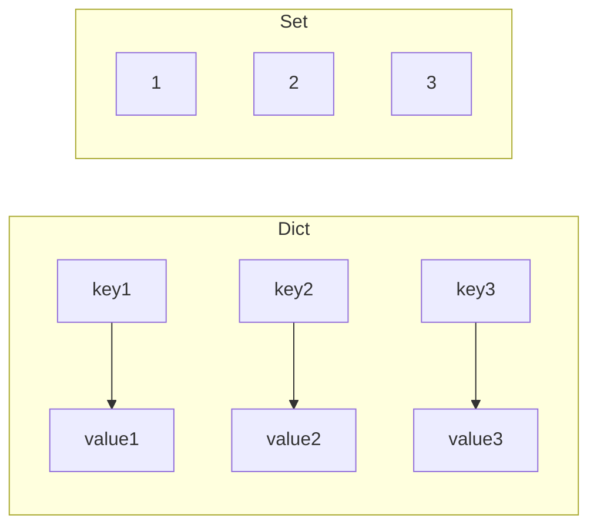

# P11: Dict & Set

> **Tác giả:** Hà Trí Kiên<br>
> **Chủ đề:** Dictionary, Set, defaultdict, Counter

---

## 1. Tổng quan

Dict và Set là hai cấu trúc dữ liệu **rất quan trọng** trong thi đấu. Dict ánh xạ key → value, Set lưu trữ các phần tử duy nhất.



---

## 2. Dictionary — Ánh xạ key → value

### 2.1. Tạo Dict

```python
# Cách 1: Dùng {}
d = {"name": "Alice", "age": 15, "score": 9.5}

# Cách 2: Dùng dict()
d = dict(name="Alice", age=15, score=9.5)

# Cách 3: Từ list tuple
d = dict([("name", "Alice"), ("age", 15)])

# Cách 4: Dict comprehension
d = {i: i**2 for i in range(5)}  # {0:0, 1:1, 2:4, 3:9, 4:16}

# Dict rỗng
d = {}
d = dict()
```

### 2.2. Truy cập giá trị

```python
d = {"name": "Alice", "age": 15, "score": 9.5}

# Cách 1: Dùng []
print(d["name"])     # "Alice"
# print(d["email"])  # KeyError! (nếu key không tồn tại)

# Cách 2: Dùng get() — an toàn hơn
print(d.get("name"))        # "Alice"
print(d.get("email"))       # None (không lỗi)
print(d.get("email", "N/A"))  # "N/A" (giá trị mặc định)
```

### 2.3. Thêm / Sửa / Xóa

```python
d = {"name": "Alice", "age": 15}

# Thêm / Sửa
d["score"] = 9.5       # Thêm key mới
d["age"] = 16          # Sửa key đã có

# Xóa
del d["age"]            # Xóa key "age"
# del d["email"]        # KeyError! (nếu key không tồn tại)

# pop: xóa và trả về giá trị
score = d.pop("score")  # score = 9.5, xóa key "score"
score = d.pop("email", None)  # score = None (không lỗi)

# popitem: xóa cặp cuối cùng
d.popitem()

# clear: xóa tất cả
d.clear()
```

### 2.4. Kiểm tra key tồn tại

```python
d = {"name": "Alice", "age": 15}

print("name" in d)     # True
print("email" in d)    # False
print("email" not in d)  # True
```

### 2.5. Duyệt Dict

```python
d = {"name": "Alice", "age": 15, "score": 9.5}

# Duyệt key
for key in d:
    print(key)

# Duyệt value
for value in d.values():
    print(value)

# Duyệt key-value
for key, value in d.items():
    print(f"{key}: {value}")
```

### 2.6. Các phương thức khác

```python
d = {"name": "Alice", "age": 15}

# keys: tất cả key
print(d.keys())     # dict_keys(["name", "age"])

# values: tất cả value
print(d.values())   # dict_values(["Alice", 15])

# items: tất cả cặp (key, value)
print(d.items())    # dict_items([("name", "Alice"), ("age", 15)])

# update: cập nhật nhiều key
d.update({"score": 9.5, "grade": "A"})

# setdefault: thêm key nếu chưa có
d.setdefault("email", "N/A")  # Thêm "email" nếu chưa có
```

---

## 3. Set — Tập hợp các phần tử duy nhất

### 3.1. Tạo Set

```python
# Cách 1: Dùng {}
s = {1, 2, 3, 4, 5}

# Cách 2: Dùng set()
s = set([1, 2, 2, 3, 3, 3])  # {1, 2, 3}
s = set("Hello")              # {'H', 'e', 'l', 'o'}

# Set rỗng (PHẢI dùng set(), KHÔNG dùng {})
s = set()  # ĐÚNG
# s = {}   # SAI! Đây là dict rỗng!

# Set comprehension
s = {x ** 2 for x in range(5)}  # {0, 1, 4, 9, 16}
```

### 3.2. Thêm / Xóa

```python
s = {1, 2, 3}

# Thêm
s.add(4)         # {1, 2, 3, 4}
s.add(2)         # {1, 2, 3, 4} (không thêm trùng)

# Xóa
s.remove(3)      # {1, 2, 4} — KeyError nếu không có!
s.discard(3)     # {1, 2, 4} — Không lỗi nếu không có
s.pop()          # Xóa và trả về 1 phần tử
s.clear()        # Xóa tất cả
```

### 3.3. Các phép toán trên Set

```python
a = {1, 2, 3, 4, 5}
b = {4, 5, 6, 7, 8}

# Hợp (Union)
print(a | b)     # {1, 2, 3, 4, 5, 6, 7, 8}
print(a.union(b))

# Giao (Intersection)
print(a & b)     # {4, 5}
print(a.intersection(b))

# Hiệu (Difference)
print(a - b)     # {1, 2, 3}
print(a.difference(b))

# Hiệu đối xứng (Symmetric Difference)
print(a ^ b)     # {1, 2, 3, 6, 7, 8}
print(a.symmetric_difference(b))
```

### 3.4. Kiểm tra

```python
a = {1, 2, 3, 4, 5}
b = {1, 2, 3}

# Subset (tập con)
print(b <= a)    # True
print(b.issubset(a))

# Superset (tập cha)
print(a >= b)    # True
print(a.issuperset(b))

# Kiểm tra phần tử
print(3 in a)    # True
print(6 in a)    # False
```

---

## 4. defaultdict — Dict với giá trị mặc định

```python
from collections import defaultdict

# defaultdict(int): mặc định là 0
dd = defaultdict(int)
dd["a"] += 1      # dd = {"a": 1}
dd["b"] += 1      # dd = {"a": 1, "b": 1}

# defaultdict(list): mặc định là []
dd = defaultdict(list)
dd["a"].append(1)  # dd = {"a": [1]}
dd["a"].append(2)  # dd = {"a": [1, 2]}
dd["b"].append(3)  # dd = {"a": [1, 2], "b": [3]}

# defaultdict(set): mặc định là set()
dd = defaultdict(set)
dd["a"].add(1)     # dd = {"a": {1}}
dd["a"].add(2)     # dd = {"a": {1, 2}}
```

### Ứng dụng: Đếm tần suất

```python
arr = [1, 2, 2, 3, 3, 3]

# Cách 1: defaultdict(int)
freq = defaultdict(int)
for x in arr:
    freq[x] += 1

# Cách 2: Counter
from collections import Counter
freq = Counter(arr)
```

### Ứng dụng: Nhóm phần tử

```python
words = ["apple", "banana", "avocado", "blueberry", "cherry", "apricot"]

# Nhóm theo chữ cái đầu
groups = defaultdict(list)
for word in words:
    groups[word[0]].append(word)

# {"a": ["apple", "avocado", "apricot"],
#  "b": ["banana", "blueberry"],
#  "c": ["cherry"]}
```

---

## 5. Counter — Đếm tần suất

```python
from collections import Counter

# Tạo Counter
cnt = Counter([1, 2, 2, 3, 3, 3])  # Counter({3:3, 2:2, 1:1})
cnt = Counter("abracadabra")        # Counter({'a':5, 'b':2, 'r':2, 'c':1, 'd':1})

# Truy cập
print(cnt["a"])     # 5
print(cnt["x"])     # 0 (không lỗi)

# most_common: phần tử xuất hiện nhiều nhất
print(cnt.most_common(2))     # [('a', 5), ('b', 2)]
print(cnt.most_common(1)[0])  # ('a', 5)

# Cập nhật
cnt["a"] += 1
cnt.update([1, 2, 3])  # Thêm tần suất

# elements: iterator các phần tử
print(list(cnt.elements()))

# Tổng số phần tử
print(sum(cnt.values()))
```

### Ứng dụng: Tìm phần tử xuất hiện nhiều nhất

```python
arr = [1, 2, 2, 3, 3, 3]
cnt = Counter(arr)
most_common = cnt.most_common(1)[0]  # (3, 3)
print(f"Phan tu {most_common[0]} xuat hien {most_common[1]} lan")
```

### Ứng dụng: So sánh 2 Counter

```python
cnt1 = Counter("aabbcc")
cnt2 = Counter("abbc")

# Phép toán trên Counter
print(cnt1 + cnt2)   # Counter({'a':3, 'b':3, 'c':3})
print(cnt1 - cnt2)   # Counter({'a':1, 'c':1})
print(cnt1 & cnt2)   # Counter({'a':1, 'b':2, 'c':1}) — min
print(cnt1 | cnt2)   # Counter({'a':2, 'b':2, 'c':2}) — max
```

---

## 6. Pattern thường gặp trong thi đấu

### 6.1. Đếm tần suất

```python
arr = list(map(int, input().split()))

# Cách 1: defaultdict(int)
freq = defaultdict(int)
for x in arr:
    freq[x] += 1

# Cách 2: Counter
freq = Counter(arr)
```

### 6.2. Nhóm phần tử theo key

```python
arr = list(map(int, input().split()))

# Nhóm theo parity
groups = defaultdict(list)
for x in arr:
    groups[x % 2].append(x)
# {0: [số chẵn], 1: [số lẻ]}
```

### 6.3. Kiểm tra trùng lặp

```python
arr = list(map(int, input().split()))

# Cách 1: Set
if len(arr) != len(set(arr)):
    print("Co phan tu trung")

# Cách 2: defaultdict
seen = defaultdict(int)
for x in arr:
    seen[x] += 1
    if seen[x] > 1:
        print(f"Phan tu {x} trung")
        break
```

### 6.4. Two Sum

```python
arr = list(map(int, input().split()))
target = int(input())

seen = {}
for i, x in enumerate(arr):
    complement = target - x
    if complement in seen:
        print(seen[complement], i)
        break
    seen[x] = i
```

### 6.5. Tìm phần tử xuất hiện nhiều nhất

```python
arr = list(map(int, input().split()))
cnt = Counter(arr)
most_common = cnt.most_common(1)[0]
print(most_common[0])
```

### 6.6. Kiểm tra 2 xâu là hoán vị của nhau

```python
s1 = input()
s2 = input()

if Counter(s1) == Counter(s2):
    print("La hoan vi")
else:
    print("Khong phai hoan vi")
```

---

## 7. So sánh với C++

=== "Python"

    ```python
    # Dict
    d = {"a": 1, "b": 2}
    d["c"] = 3
    print(d.get("a", 0))
    
    # Set
    s = {1, 2, 3}
    s.add(4)
    print(3 in s)
    
    # defaultdict
    from collections import defaultdict
    dd = defaultdict(int)
    dd["a"] += 1
    
    # Counter
    from collections import Counter
    cnt = Counter([1, 2, 2, 3])
    ```

=== "C++"

    ```cpp
    // Map
    map<string, int> d;
    d["a"] = 1;
    d["b"] = 2;
    d["c"] = 3;
    cout << d["a"]; // 1
    
    // Set
    set<int> s = {1, 2, 3};
    s.insert(4);
    cout << s.count(3); // 1
    
    // Không có defaultdict, Counter
    // Phải tự cài đặt
    ```

---

## 8. Lưu ý / Cạm bẫy hay gặp

### Bẫy 1: Set rỗng phải dùng set()

```python
# SAI
s = {}  # Đây là dict rỗng, không phải set!

# ĐÚNG
s = set()
```

### Bẫy 2: Dict key phải là hashable

```python
# SAI: List không thể làm key
# d = {[1, 2]: "value"}  # TypeError!

# ĐÚNG: Tuple có thể làm key
d = {(1, 2): "value"}
```

### Bẫy 3: defaultdict tự tạo key mới

```python
dd = defaultdict(int)
dd["a"] += 1  # Tự tạo key "a" với giá trị 0

# Kiểm tra key tồn tại
if "a" in dd:
    print("Ton tai")
```

### Bẫy 4: Counter.most_common() trả về list tuple

```python
cnt = Counter([1, 2, 2, 3, 3, 3])
most = cnt.most_common(1)[0]  # (3, 3) — tuple!
print(most[0])  # 3 — key
print(most[1])  # 3 — count
```

---

## 9. Bài tập thực hành

### Bài 1: Đếm tần suất
Cho mảng arr. Đếm tần suất xuất hiện của mỗi phần tử.

<div class="cp-pg" data-language="python" data-starter="# Viết code ở đây" data-input="1 2 2 3 3 3" data-expected="1: 1
2: 2
3: 3" data-hint="Dùng dict hoặc collections.Counter để đếm"></div>

??? tip "Lời giải"
    ```python
    from collections import Counter
    cnt = Counter(arr)
    for key, value in sorted(cnt.items()):
        print(f"{key}: {value}")
    ```

### Bài 2: Tìm phần tử xuất hiện nhiều nhất
Cho mảng arr. Tìm phần tử xuất hiện nhiều nhất.

<div class="cp-pg" data-language="python" data-starter="# Viết code ở đây" data-input="1 3 2 3 3 2 2 2" data-expected="2" data-hint="Dùng Counter(arr).most_common(1)[0][0]"></div>

??? tip "Lời giải"
    ```python
    from collections import Counter
    cnt = Counter(arr)
    print(cnt.most_common(1)[0][0])
    ```

### Bài 3: Kiểm tra trùng lặp
Cho mảng arr. Kiểm tra có phần tử trùng không.

<div class="cp-pg" data-language="python" data-starter="# Viết code ở đây" data-input="1 2 3 2" data-expected="Co phan tu trung" data-hint="So sánh len(arr) với len(set(arr))"></div>

??? tip "Lời giải"
    ```python
    if len(arr) != len(set(arr)):
        print("Co phan tu trung")
    else:
        print("Khong co phan tu trung")
    ```

### Bài 4: Two Sum
Cho mảng arr và target. Tìm 2 số có tổng bằng target.

<div class="cp-pg" data-language="python" data-starter="# Viết code ở đây" data-input="2 7 11 15
9" data-expected="0 1" data-hint="Dùng dict để lưu index, kiểm tra complement = target - x"></div>

??? tip "Lời giải"
    ```python
    seen = {}
    for i, x in enumerate(arr):
        complement = target - x
        if complement in seen:
            print(seen[complement], i)
            break
        seen[x] = i
    ```

### Bài 5: Nhóm từ theo chữ cái đầu
Cho list từ. Nhóm các từ theo chữ cái đầu.

<div class="cp-pg" data-language="python" data-starter="# Viết code ở đây" data-input="apple banana cherry avocado blueberry" data-expected="a: ['apple', 'avocado']
b: ['banana', 'blueberry']
c: ['cherry']" data-hint="Dùng defaultdict(list), thêm từ vào groups[word[0]]"></div>

??? tip "Lời giải"
    ```python
    from collections import defaultdict
    groups = defaultdict(list)
    for word in words:
        groups[word[0]].append(word)
    for key in sorted(groups):
        print(f"{key}: {groups[key]}")
    ```

---

## 10. Bài tập luyện tập

| Bài | Nền tảng | Độ khó | Chủ đề |
|-----|----------|--------|--------|
| [CSES - Distinct Numbers](https://cses.fi/problemset/task/1621) | CSES | ⭐ | Set |
| [CSES - Concert Tickets](https://cses.fi/problemset/task/1091) | CSES | ⭐⭐ | Multiset |
| [CSES - Sum of Two Values](https://cses.fi/problemset/task/1640) | CSES | ⭐⭐ | Dict, Two Sum |

---

## Bài viết liên quan

- [← P10: Array 2D & Matrix](P10-array-2d.md)
- [P12: Tuple →](P12-tuple.md)

---

**Bài trước:** [P10: Array 2D & Matrix](P10-array-2d.md)<br>
**Bài tiếp theo:** [P12: Tuple →](P12-tuple.md)
