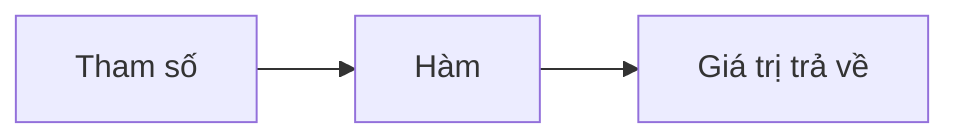
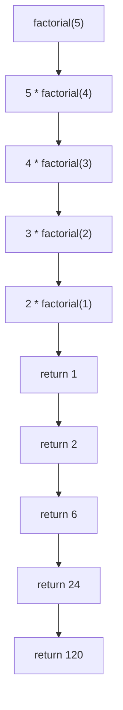

# P13: Hàm (Function)

> **Tác giả:** Hà Trí Kiên<br>
> **Chủ đề:** Function, lambda, map, filter, reduce

---

## 1. Tổng quan

Hàm là **khối code có tên** để thực hiện một nhiệm vụ cụ thể. Giúp code **tái sử dụng**, **dễ đọc**, **dễ bảo trì**.



---

## 2. Định nghĩa hàm cơ bản

```python
# Định nghĩa hàm
def greet(name):
    print(f"Hello, {name}!")

# Gọi hàm
greet("Alice")  # Hello, Alice!
greet("Bob")    # Hello, Bob!
```

---

## 3. Hàm với return

```python
# Hàm trả về giá trị
def add(a, b):
    return a + b

result = add(3, 5)
print(result)  # 8

# Hàm trả về nhiều giá trị
def min_max(arr):
    return min(arr), max(arr)

lo, hi = min_max([3, 1, 4, 1, 5, 9])
print(lo, hi)  # 1 9
```

!!! info "return vs print"
    - `print()` chỉ in ra màn hình, không trả về giá trị
    - `return` trả về giá trị cho người gọi hàm

```python
# SAI: Dùng print thay vì return
def add(a, b):
    print(a + b)  # Chỉ in ra, không trả về!

result = add(3, 5)  # result = None!

# ĐÚNG: Dùng return
def add(a, b):
    return a + b

result = add(3, 5)  # result = 8
```

---

## 4. Tham số mặc định

```python
# Tham số mặc định
def greet(name, greeting="Hello"):
    print(f"{greeting}, {name}!")

greet("Alice")           # Hello, Alice!
greet("Alice", "Hi")    # Hi, Alice!

# Nhiều tham số mặc định
def power(base, exp=2):
    return base ** exp

print(power(3))      # 9 (3^2)
print(power(3, 3))   # 27 (3^3)
```

!!! warning "Tham số mặc định phải ở cuối"
    ```python
    # SAI
    # def func(a=1, b): pass  # SyntaxError!
    
    # ĐÚNG
    def func(a, b=1): pass
    ```

---

## 5. Tham số keyword

```python
def student_info(name, age, score):
    print(f"{name}, {age} tuổi, điểm {score}")

# Gọi theo thứ tự
student_info("Alice", 15, 9.5)

# Gọi theo keyword (thứ tự tùy ý)
student_info(score=9.5, name="Alice", age=15)

# Kết hợp positional và keyword
student_info("Alice", age=15, score=9.5)
```

---

## 6. *args và **kwargs

### *args — Tham số vị trí tùy ý

```python
def total(*args):
    print(args)  # Tuple
    return sum(args)

print(total(1, 2, 3))       # 6
print(total(1, 2, 3, 4, 5)) # 15
```

### **kwargs — Tham số keyword tùy ý

```python
def info(**kwargs):
    print(kwargs)  # Dict
    for key, value in kwargs.items():
        print(f"{key}: {value}")

info(name="Alice", age=15, score=9.5)
# name: Alice
# age: 15
# score: 9.5
```

### Kết hợp

```python
def func(a, b, *args, **kwargs):
    print(f"a={a}, b={b}")
    print(f"args={args}")
    print(f"kwargs={kwargs}")

func(1, 2, 3, 4, x=5, y=6)
# a=1, b=2
# args=(3, 4)
# kwargs={'x': 5, 'y': 6}
```

---

## 7. Lambda — Hàm ẩn danh

```python
# Hàm thường
def square(x):
    return x ** 2

# Lambda (tương đương)
square = lambda x: x ** 2
print(square(5))  # 25

# Lambda nhiều tham số
add = lambda a, b: a + b
print(add(3, 5))  # 8

# Lambda với điều kiện
abs_val = lambda x: x if x >= 0 else -x
print(abs_val(-5))  # 5
```

!!! tip "Khi nào dùng lambda?"
    - Dùng lambda khi hàm **ngắn** và **chỉ dùng 1 lần**
    - Thường dùng với `sorted()`, `map()`, `filter()`

```python
# Lambda với sorted
arr = [(1, "b"), (3, "a"), (2, "c")]
arr.sort(key=lambda x: x[1])  # Sắp xếp theo chữ cái
```

---

## 8. map(), filter(), reduce()

### 8.1. map() — Áp dụng hàm cho mỗi phần tử

```python
arr = [1, 2, 3, 4, 5]

# Cách 1: List comprehension (Pythonic hơn)
squares = [x ** 2 for x in arr]

# Cách 2: map + lambda
squares = list(map(lambda x: x ** 2, arr))

# map với nhiều list
a = [1, 2, 3]
b = [4, 5, 6]
sums = list(map(lambda x, y: x + y, a, b))  # [5, 7, 9]

# map với hàm sẵn có
arr = list(map(int, input().split()))  # Đọc mảng số nguyên
```

### 8.2. filter() — Lọc phần tử

```python
arr = [1, 2, 3, 4, 5, 6, 7, 8, 9, 10]

# Cách 1: List comprehension
evens = [x for x in arr if x % 2 == 0]

# Cách 2: filter + lambda
evens = list(filter(lambda x: x % 2 == 0, arr))  # [2, 4, 6, 8, 10]
```

### 8.3. reduce() — Gộp phần tử

```python
from functools import reduce

arr = [1, 2, 3, 4, 5]

# Tổng
total = reduce(lambda a, b: a + b, arr)  # 15

# Tích
product = reduce(lambda a, b: a * b, arr)  # 120

# Tìm max
max_val = reduce(lambda a, b: a if a > b else b, arr)  # 5
```

---

## 9. Scope — Phạm vi biến

```python
x = 10  # Biến toàn cục (global)

def my_func():
    y = 20  # Biến cục bộ (local)
    print(x)  # OK — đọc được biến toàn cục
    print(y)  # OK

my_func()
print(x)  # OK
# print(y)  # Lỗi! y không tồn tại ngoài hàm
```

### global keyword

```python
x = 10

def my_func():
    global x  # Khai báo x là biến toàn cục
    x = 20    # Thay đổi biến toàn cục

my_func()
print(x)  # 20
```

!!! warning "Tránh dùng global"
    Sử dụng `global` làm code khó hiểu. Nên truyền tham số và trả về giá trị.

---

## 10. Đệ quy (Recursion)

```python
# Hàm gọi chính nó
def factorial(n):
    if n <= 1:
        return 1
    return n * factorial(n - 1)

print(factorial(5))  # 120
```



### Fibonacci

```python
def fib(n):
    if n <= 1:
        return n
    return fib(n - 1) + fib(n - 2)

print(fib(10))  # 55
```

!!! warning "Giới hạn đệ quy"
    Python mặc định giới hạn đệ quy 1000 lớp. Có thể tăng:
    ```python
    import sys
    sys.setrecursionlimit(10**6)
    ```

---

## 11. Pattern thường gặp trong thi đấu

### 11.1. Template thi đấu

```python
import sys
input = sys.stdin.readline
sys.setrecursionlimit(10**6)

def solve():
    n = int(input())
    arr = list(map(int, input().split()))
    # Xử lý...
    print(result)

t = int(input())
for _ in range(t):
    solve()
```

### 11.2. Hàm tính GCD

```python
def gcd(a, b):
    while b:
        a, b = b, a % b
    return a

# Hoặc dùng math
import math
print(math.gcd(12, 8))  # 4
```

### 11.3. Hàm kiểm tra số nguyên tố

```python
def is_prime(n):
    if n < 2:
        return False
    for i in range(2, int(n**0.5) + 1):
        if n % i == 0:
            return False
    return True
```

### 11.4. Hàm phân tích thừa số nguyên tố

```python
def prime_factors(n):
    factors = []
    d = 2
    while d * d <= n:
        while n % d == 0:
            factors.append(d)
            n //= d
        d += 1
    if n > 1:
        factors.append(n)
    return factors
```

### 11.5. Hàm tính lũy thừa modulo

```python
def power_mod(base, exp, mod):
    result = 1
    base %= mod
    while exp > 0:
        if exp % 2 == 1:
            result = result * base % mod
        exp //= 2
        base = base * base % mod
    return result

# Hoặc dùng pow()
print(pow(2, 10, 1000))  # 24
```

---

## 12. So sánh với C++

=== "Python"

    ```python
    # Định nghĩa hàm
    def add(a, b):
        return a + b
    
    # Lambda
    square = lambda x: x ** 2
    
    # Tham số mặc định
    def greet(name, greeting="Hello"):
        print(f"{greeting}, {name}!")
    
    # Không có overload
    ```

=== "C++"

    ```cpp
    // Định nghĩa hàm
    int add(int a, int b) {
        return a + b;
    }
    
    // Lambda
    auto square = [](int x) { return x * x; };
    
    // Tham số mặc định
    void greet(string name, string greeting = "Hello") {
        cout << greeting << ", " << name << "!";
    }
    
    // Overload
    int add(int a, int b) { return a + b; }
    double add(double a, double b) { return a + b; }
    ```

---

## 13. Lưu ý / Cạm bẫy hay gặp

### Bẫy 1: Quên return

```python
# SAI: Không return
def add(a, b):
    a + b  # Không trả về gì!

result = add(3, 5)  # result = None

# ĐÚNG
def add(a, b):
    return a + b
```

### Bẫy 2: Tham số mặc định là mutable

```python
# SAI: List mặc định được chia sẻ
def append_to(element, target=[]):
    target.append(element)
    return target

print(append_to(1))  # [1]
print(append_to(2))  # [1, 2] — Không phải [2]!

# ĐÚNG
def append_to(element, target=None):
    if target is None:
        target = []
    target.append(element)
    return target
```

### Bẫy 3: return dừng hàm ngay

```python
def find_first(arr, target):
    for x in arr:
        if x == target:
            return x  # Dừng ngay khi tìm thấy
    return None  # Không tìm thấy
```

### Bẫy 4: Đệ quy quá sâu

```python
# SAI: Stack overflow
def infinite():
    return infinite()

# ĐÚNG: Giới hạn đệ quy
import sys
sys.setrecursionlimit(10**6)
```

---

## 14. Bài tập thực hành

### Bài 1: Hàm tính giai thừa
Viết hàm tính n!

<div class="cp-pg" data-language="python" data-starter="# Viết code ở đây" data-input="5" data-expected="120" data-hint="Đệ quy: if n &lt;= 1 return 1, else return n * factorial(n-1)"></div>

```python
def factorial(n):
    pass

n = int(input())
print(factorial(n))
```

??? tip "Lời giải"
    ```python
    def factorial(n):
        if n <= 1:
            return 1
        return n * factorial(n - 1)
    
    n = int(input())
    print(factorial(n))
    ```

### Bài 2: Hàm kiểm tra palindrome
Viết hàm kiểm tra xâu có phải palindrome không.

<div class="cp-pg" data-language="python" data-starter="# Viết code ở đây" data-input="racecar" data-expected="True" data-hint="So sánh s với s[::-1]"></div>

```python
def is_palindrome(s):
    pass

s = input()
print(is_palindrome(s))
```

??? tip "Lời giải"
    ```python
    def is_palindrome(s):
        return s == s[::-1]
    
    s = input()
    print(is_palindrome(s))
    ```

### Bài 3: Hàm tìm ước chung lớn nhất
Viết hàm tính GCD của 2 số.

<div class="cp-pg" data-language="python" data-starter="# Viết code ở đây" data-input="12 8" data-expected="4" data-hint="Dùng thuật toán Euclid: while b: a, b = b, a % b"></div>

```python
def gcd(a, b):
    pass

a, b = map(int, input().split())
print(gcd(a, b))
```

??? tip "Lời giải"
    ```python
    def gcd(a, b):
        while b:
            a, b = b, a % b
        return a
    
    a, b = map(int, input().split())
    print(gcd(a, b))
    ```

### Bài 4: Hàm phân tích thừa số
Viết hàm phân tích thừa số nguyên tố.

<div class="cp-pg" data-language="python" data-starter="# Viết code ở đây" data-input="60" data-expected="[2, 2, 3, 5]" data-hint="Duyệt d từ 2, chia n cho d khi chia hết, tăng d lên"></div>

```python
def prime_factors(n):
    pass

n = int(input())
print(prime_factors(n))
```

??? tip "Lời giải"
    ```python
    def prime_factors(n):
        factors = []
        d = 2
        while d * d <= n:
            while n % d == 0:
                factors.append(d)
                n //= d
            d += 1
        if n > 1:
            factors.append(n)
        return factors
    
    n = int(input())
    print(prime_factors(n))
    ```

### Bài 5: Hàm tính tổ hợp
Viết hàm tính C(n, k).

<div class="cp-pg" data-language="python" data-starter="# Viết code ở đây" data-input="5 2" data-expected="10" data-hint="Đệ quy: C(n,k) = C(n-1,k-1) + C(n-1,k), base case k==0 hoặc k==n trả 1"></div>

```python
def comb(n, k):
    pass

n, k = map(int, input().split())
print(comb(n, k))
```

??? tip "Lời giải"
    ```python
    def comb(n, k):
        if k > n or k < 0:
            return 0
        if k == 0 or k == n:
            return 1
        return comb(n - 1, k - 1) + comb(n - 1, k)
    
    # Lưu ý: Hàm đệ quy này có độ phức tạp O(2^n), chỉ dùng cho n nhỏ.
    # Với n lớn, dùng math.comb(n, k) hoặc DP.
    n, k = map(int, input().split())
    print(comb(n, k))
    ```

---

## 15. Bài tập luyện tập

| Bài | Nền tảng | Độ khó | Chủ đề |
|-----|----------|--------|--------|
| [CSES - Weird Algorithm](https://cses.fi/problemset/task/1068) | CSES | ⭐ | Hàm đệ quy |
| [CSES - Two Sets](https://cses.fi/problemset/task/1092) | CSES | ⭐⭐ | Hàm, logic |

---

## Bài viết liên quan

- [← P12: Tuple](P12-tuple.md)
- [P14: collections →](P14-collections.md)

---

**Bài trước:** [P12: Tuple](P12-tuple.md)<br>
**Bài tiếp theo:** [P14: collections →](P14-collections.md)
