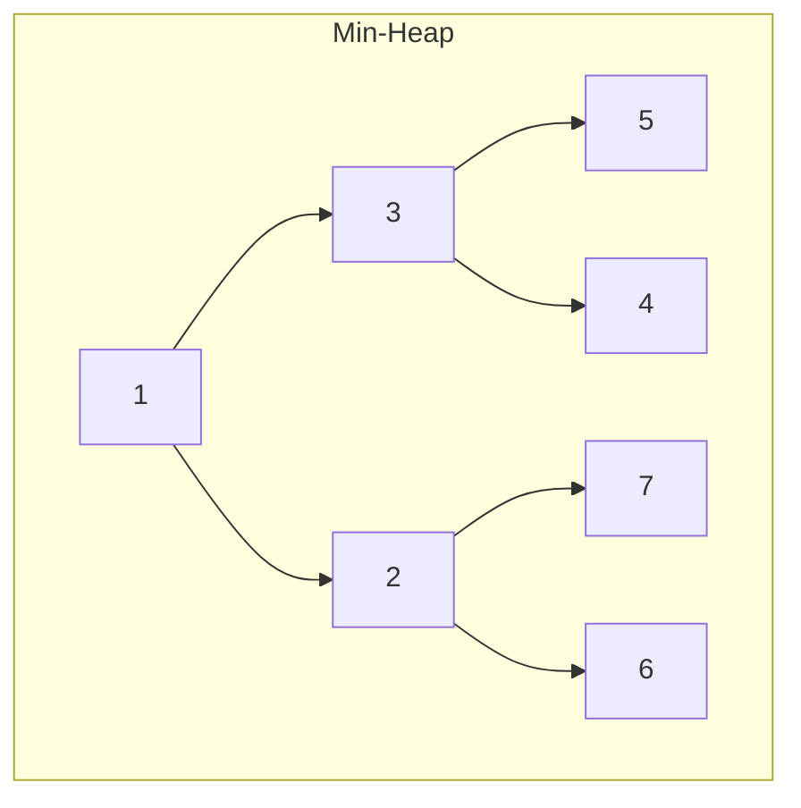

# P15: heapq — Hàng đợi ưu tiên

> **Tác giả:** Hà Trí Kiên<br>
> **Chủ đề:** Heap, priority queue, Top-K, Dijkstra

---

## 1. Tổng quan

Heap là cấu trúc dữ liệu cho phép lấy phần tử **nhỏ nhất** (hoặc lớn nhất) trong **O(log n)**. Rất quan trọng trong thi đấu.



!!! info "Heap trong Python"
    - Python hỗ trợ **min-heap** (phần tử nhỏ nhất ở đỉnh)
    - Không có max-heap trực tiếp → dùng mẹo đảo dấu
    - Dùng module `heapq`

---

## 2. Các thao tác cơ bản

```python
import heapq

# Tạo heap
heap = []
heapq.heapify(heap)  # Chuyển list thành heap — O(n)

# Thêm phần tử — O(log n)
heapq.heappush(heap, 3)
heapq.heappush(heap, 1)
heapq.heappush(heap, 4)
heapq.heappush(heap, 1)
heapq.heappush(heap, 5)

# Lấy phần tử nhỏ nhất — O(log n)
min_val = heapq.heappop(heap)  # 1
min_val = heapq.heappop(heap)  # 1

# Xem phần tử nhỏ nhất (không xóa) — O(1)
print(heap[0])  # 3

# Thêm và lấy cùng lúc — O(log n)
val = heapq.heappushpop(heap, 2)  # Thêm 2, lấy nhỏ nhất
val = heapq.heapreplace(heap, 0)  # Lấy nhỏ nhất, thêm 0
```

---

## 3. Top-K lớn nhất / nhỏ nhất

```python
import heapq

arr = [3, 1, 4, 1, 5, 9, 2, 6, 5, 3, 5]

# K phần tử nhỏ nhất
top3_min = heapq.nsmallest(3, arr)  # [1, 1, 2]

# K phần tử lớn nhất
top3_max = heapq.nlargest(3, arr)   # [9, 6, 5]

# Với key
students = [("Alice", 90), ("Bob", 85), ("Charlie", 95), ("David", 80)]
top2 = heapq.nlargest(2, students, key=lambda x: x[1])
# [("Charlie", 95), ("Alice", 90)]
```

---

## 4. Max-heap — Mẹo đảo dấu

Python chỉ có min-heap. Để dùng max-heap, **đảo dấu** giá trị:

```python
import heapq

# Max-heap
max_heap = []
heapq.heappush(max_heap, -3)  # Thêm 3
heapq.heappush(max_heap, -1)  # Thêm 1
heapq.heappush(max_heap, -4)  # Thêm 4

# Lấy phần tử lớn nhất
max_val = -heapq.heappop(max_heap)  # 4
```

---

## 5. Merge K sorted lists

```python
import heapq

def merge_k_sorted(lists):
    return list(heapq.merge(*lists))

lists = [[1, 4, 7], [2, 5, 8], [3, 6, 9]]
print(merge_k_sorted(lists))
# [1, 2, 3, 4, 5, 6, 7, 8, 9]
```

---

## 6. Ứng dụng trong thi đấu

### 6.1. Dijkstra — Đường đi ngắn nhất

```python
import heapq

def dijkstra(graph, start, n):
    dist = [float('inf')] * n
    dist[start] = 0
    pq = [(0, start)]  # (distance, node)
    
    while pq:
        d, u = heapq.heappop(pq)
        if d > dist[u]:
            continue
        for v, w in graph[u]:
            if dist[u] + w < dist[v]:
                dist[v] = dist[u] + w
                heapq.heappush(pq, (dist[v], v))
    
    return dist
```

### 6.2. Tìm median

```python
import heapq

class MedianFinder:
    def __init__(self):
        self.small = []  # max-heap (đảo dấu)
        self.large = []  # min-heap
    
    def add_num(self, num):
        heapq.heappush(self.small, -num)
        heapq.heappush(self.large, -heapq.heappop(self.small))
        if len(self.large) > len(self.small):
            heapq.heappush(self.small, -heapq.heappop(self.large))
    
    def find_median(self):
        if len(self.small) > len(self.large):
            return -self.small[0]
        return (-self.small[0] + self.large[0]) / 2
```

### 6.3. Task Scheduler

```python
import heapq
from collections import Counter

def least_interval(tasks, n):
    cnt = Counter(tasks)
    max_heap = [-c for c in cnt.values()]
    heapq.heapify(max_heap)
    
    time = 0
    while max_heap:
        temp = []
        for _ in range(n + 1):
            if max_heap:
                c = heapq.heappop(max_heap)
                if c + 1 < 0:
                    temp.append(c + 1)
        
        for item in temp:
            heapq.heappush(max_heap, item)
        
        time += n + 1 if max_heap else len(temp)
    
    return time
```

---

## 7. So sánh với C++

| Python | C++ | Ghi chú |
|--------|-----|---------|
| `heapq` | `priority_queue` | Cùng chức năng |
| Min-heap mặc định | Max-heap mặc định | Khác nhau! |
| `heappush` | `push` | |
| `heappop` | `pop` | |
| `nlargest`, `nsmallest` | Không có | Phải tự cài |

---

## 8. Lưu ý / Cạm bẫy hay gặp

### Bẫy 1: Python là min-heap, C++ là max-heap

```python
# Python: min-heap
import heapq
heap = [3, 1, 4]
heapq.heapify(heap)
print(heapq.heappop(heap))  # 1 (nhỏ nhất)

# C++: max-heap mặc định
# priority_queue<int> pq;
# pq.push(3); pq.push(1); pq.push(4);
# cout << pq.top(); // 4 (lớn nhất)
```

### Bẫy 2: Heap không tự cập nhật khi sửa phần tử

```python
# Nếu sửa phần tử trong heap, phải heapify lại
heap = [3, 1, 4, 1, 5]
heapq.heapify(heap)
heap[2] = 0  # Sửa phần tử
# Heap chưa cập nhật!
# Phải: heapq.heapify(heap)
```

### Bẫy 3: heappushpop vs heapreplace

```python
# heappushpop: thêm TRƯỚC, lấy SAU
# heapreplace: lấy TRƯỚC, thêm SAOU
```

---

## 9. Bài tập thực hành

### Bài 1: Tìm K phần tử lớn nhất
Cho mảng arr và số K. Tìm K phần tử lớn nhất.

```python
import heapq

arr = list(map(int, input().split()))
k = int(input())
# Code của bạn ở đây
```

??? tip "Lời giải"
    ```python
    import heapq
    print(heapq.nlargest(k, arr))
    ```

### Bài 2: Merge K sorted lists
Cho K mảng đã sắp xếp. Trộn thành 1 mảng đã sắp xếp.

```python
import heapq

k = int(input())
lists = [list(map(int, input().split())) for _ in range(k)]
# Code của bạn ở đây
```

??? tip "Lời giải"
    ```python
    import heapq
    result = list(heapq.merge(*lists))
    print(result)
    ```

### Bài 3: Dijkstra
Cho đồ thị có trọng số. Tìm đường đi ngắn nhất từ đỉnh start.

```python
import heapq

n, m = map(int, input().split())
graph = [[] for _ in range(n)]
for _ in range(m):
    u, v, w = map(int, input().split())
    graph[u].append((v, w))
    graph[v].append((u, w))

start = int(input())
# Code của bạn ở đây
```

??? tip "Lời giải"
    ```python
    import heapq
    
    dist = [float('inf')] * n
    dist[start] = 0
    pq = [(0, start)]
    
    while pq:
        d, u = heapq.heappop(pq)
        if d > dist[u]:
            continue
        for v, w in graph[u]:
            if dist[u] + w < dist[v]:
                dist[v] = dist[u] + w
                heapq.heappush(pq, (dist[v], v))
    
    print(dist)
    ```

---

## 10. Bài tập luyện tập

| Bài | Nền tảng | Độ khó | Chủ đề |
|-----|----------|--------|--------|
| [CSES - Shortest Routes I](https://cses.fi/problemset/task/1671) | CSES | ⭐⭐ | Dijkstra |
| [CSES - Flight Discount](https://cses.fi/problemset/task/1195) | CSES | ⭐⭐⭐ | Dijkstra nâng cao |

---

## Bài viết liên quan

- [← P14: collections](P14-collections.md)
- [P16: itertools →](P16-itertools.md)

---

**Bài trước:** [P14: collections](P14-collections.md)<br>
**Bài tiếp theo:** [P16: itertools →](P16-itertools.md)
