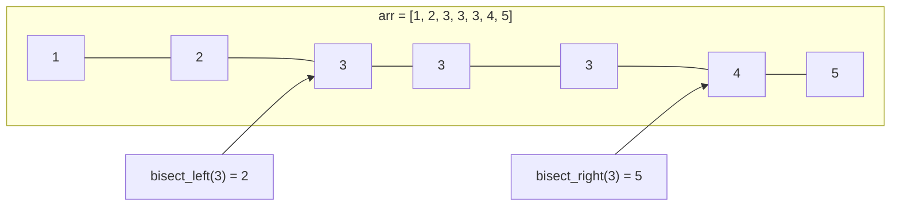

# P17: bisect — Tìm kiếm nhị phân

> **Tác giả:** Hà Trí Kiên<br>
> **Chủ đề:** bisect_left, bisect_right, insort, lower_bound, upper_bound

---

## 1. Tổng quan

`bisect` cung cấp các hàm **tìm kiếm nhị phân** trên mảng đã sắp xếp. Rất quan trọng trong thi đấu.

```python
import bisect
```

!!! info "bisect vs lower_bound/upper_bound trong C++"
    - `bisect_left` tương đương `lower_bound` trong C++
    - `bisect_right` tương đương `upper_bound` trong C++

---

## 2. bisect_left — Tìm vị trí đầu tiên >= x

```python
import bisect

arr = [1, 2, 3, 3, 3, 4, 5]

# Tìm vị trí đầu tiên >= 3
pos = bisect.bisect_left(arr, 3)
print(pos)  # 2

# Tìm vị trí đầu tiên >= 6 (không có → trả về len(arr))
pos = bisect.bisect_left(arr, 6)
print(pos)  # 7
```

---

## 3. bisect_right — Tìm vị trí đầu tiên > x

```python
import bisect

arr = [1, 2, 3, 3, 3, 4, 5]

# Tìm vị trí đầu tiên > 3
pos = bisect.bisect_right(arr, 3)
print(pos)  # 5

# Tìm vị trí đầu tiên > 0
pos = bisect.bisect_right(arr, 0)
print(pos)  # 0
```

---

## 4. So sánh bisect_left và bisect_right

```python
import bisect

arr = [1, 2, 3, 3, 3, 4, 5]

# bisect_left: vị trí đầu tiên >= x
print(bisect.bisect_left(arr, 3))   # 2
print(bisect.bisect_left(arr, 3.5)) # 5

# bisect_right: vị trí đầu tiên > x
print(bisect.bisect_right(arr, 3))  # 5
print(bisect.bisect_right(arr, 3.5)) # 5
```



---

## 5. insort — Chèn giữ thứ tự

```python
import bisect

arr = [1, 2, 4, 5]

# Chèn 3 giữ thứ tự
bisect.insort(arr, 3)
print(arr)  # [1, 2, 3, 4, 5]

# insort_left: chèn bên trái (trước các phần tử bằng)
arr = [1, 2, 3, 3, 4]
bisect.insort_left(arr, 3)
print(arr)  # [1, 2, 3, 3, 3, 4]

# insort_right: chèn bên phải (sau các phần tử bằng)
arr = [1, 2, 3, 3, 4]
bisect.insort_right(arr, 3)
print(arr)  # [1, 2, 3, 3, 3, 4]
```

---

## 6. Ứng dụng trong thi đấu

### 6.1. Tìm kiếm nhị phân

```python
import bisect

arr = [1, 2, 3, 4, 5, 6, 7, 8, 9, 10]
target = 7

# Kiểm tra target có trong arr không
pos = bisect.bisect_left(arr, target)
if pos < len(arr) and arr[pos] == target:
    print(f"Tim thay tai vi tri {pos}")
else:
    print("Khong tim thay")
```

### 6.2. Đếm số phần tử trong khoảng [l, r]

```python
import bisect

arr = [1, 2, 3, 3, 3, 4, 5, 6, 7, 8, 9, 10]
l, r = 3, 7

# Số phần tử trong [l, r]
count = bisect.bisect_right(arr, r) - bisect.bisect_left(arr, l)
print(count)  # 7 (3, 3, 3, 4, 5, 6, 7)
```

### 6.3. Tìm phần tử nhỏ nhất >= x

```python
import bisect

arr = [1, 3, 5, 7, 9]
x = 4

pos = bisect.bisect_left(arr, x)
if pos < len(arr):
    print(f"Phan tu nho nhat >= {x} la {arr[pos]}")  # 5
else:
    print("Khong co")
```

### 6.4. Tìm phần tử lớn nhất <= x

```python
import bisect

arr = [1, 3, 5, 7, 9]
x = 4

pos = bisect.bisect_right(arr, x)
if pos > 0:
    print(f"Phan tu lon nhat <= {x} la {arr[pos - 1]}")  # 3
else:
    print("Khong co")
```

### 6.5. Longest Increasing Subsequence (LIS)

```python
import bisect

def lis(arr):
    tails = []
    for x in arr:
        pos = bisect.bisect_left(tails, x)
        if pos == len(tails):
            tails.append(x)
        else:
            tails[pos] = x
    return len(tails)

arr = [10, 9, 2, 5, 3, 7, 101, 18]
print(lis(arr))  # 4 (2, 3, 7, 101)
```

---

## 7. So sánh với C++

| Python | C++ | Ghi chú |
|--------|-----|---------|
| `bisect_left(arr, x)` | `lower_bound(arr.begin(), arr.end(), x) - arr.begin()` | Cùng kết quả |
| `bisect_right(arr, x)` | `upper_bound(arr.begin(), arr.end(), x) - arr.begin()` | Cùng kết quả |
| `insort(arr, x)` | Không có | Phải tự cài |

---

## 8. Lưu ý / Cạm bẫy hay gặp

### Bẫy 1: Mảng phải sắp xếp

```python
import bisect

arr = [3, 1, 4, 1, 5]
# bisect.bisect_left(arr, 3)  # Kết quả sai!

# Phải sắp xếp trước
arr.sort()
print(bisect.bisect_left(arr, 3))  # 2
```

### Bẫy 2: bisect_left vs bisect_right

```python
import bisect

arr = [1, 2, 3, 3, 3, 4, 5]

# bisect_left: vị trí đầu tiên >= x
print(bisect.bisect_left(arr, 3))   # 2

# bisect_right: vị trí đầu tiên > x
print(bisect.bisect_right(arr, 3))  # 5
```

### Bẫy 3: Kiểm tra tồn tại

```python
import bisect

arr = [1, 2, 3, 4, 5]
target = 3

# SAI
# if bisect.bisect_left(arr, target):  # Sai logic!

# ĐÚNG
pos = bisect.bisect_left(arr, target)
if pos < len(arr) and arr[pos] == target:
    print("Tim thay")
```

---

## 9. Bài tập thực hành

### Bài 1: Tìm kiếm nhị phân
Cho mảng đã sắp xếp và target. Kiểm tra target có trong mảng không.

<div class="cp-pg" data-language="python" data-starter="import bisect

arr = list(map(int, input().split()))
target = int(input())" data-input="1 2 3 4 5
3" data-expected="Tim thay" data-hint="Dùng bisect_left, kiểm tra arr[pos] == target"></div>

???? tip "Lời giải"
    ```python
    import bisect
    
    arr = list(map(int, input().split()))
    target = int(input())
    
    pos = bisect.bisect_left(arr, target)
    if pos < len(arr) and arr[pos] == target:
        print("Tim thay")
    else:
        print("Khong tim thay")
    ```

### Bài 2: Đếm phần tử trong khoảng
Cho mảng đã sắp xếp và khoảng [l, r]. Đếm số phần tử trong khoảng.

<div class="cp-pg" data-language="python" data-starter="import bisect

arr = list(map(int, input().split()))
l, r = map(int, input().split())" data-input="1 2 3 4 5 6 7
2 5" data-expected="4" data-hint="Dùng bisect_right(arr, r) - bisect_left(arr, l)"></div>

???? tip "Lời giải"
    ```python
    import bisect
    
    arr = list(map(int, input().split()))
    l, r = map(int, input().split())
    
    count = bisect.bisect_right(arr, r) - bisect.bisect_left(arr, l)
    print(count)
    ```

### Bài 3: LIS
Cho mảng arr. Tìm độ dài dãy con tăng dài nhất.

<div class="cp-pg" data-language="python" data-starter="import bisect

arr = list(map(int, input().split()))" data-input="10 9 2 5 3 7 101 18" data-expected="4" data-hint="Dùng bisect_left trên tails array"></div>

???? tip "Lời giải"
    ```python
    import bisect
    
    arr = list(map(int, input().split()))
    tails = []
    for x in arr:
        pos = bisect.bisect_left(tails, x)
        if pos == len(tails):
            tails.append(x)
        else:
            tails[pos] = x
    print(len(tails))
    ```

---

## 10. Bài tập luyện tập

| Bài | Nền tảng | Độ khó | Chủ đề |
|-----|----------|--------|--------|
| [CSES - Concert Tickets](https://cses.fi/problemset/task/1091) | CSES | ⭐⭐ | Tìm kiếm nhị phân |
| [CSES - Josephus Problem](https://cses.fi/problemset/task/2162) | CSES | ⭐⭐ | Tìm kiếm nhị phân |

---

## Bài viết liên quan

- [← P16: itertools](P16-itertools.md)
- [P18: math & Built-in →](P18-math-builtins.md)

---

**Bài trước:** [P16: itertools](P16-itertools.md)<br>
**Bài tiếp theo:** [P18: math & Built-in →](P18-math-builtins.md)
