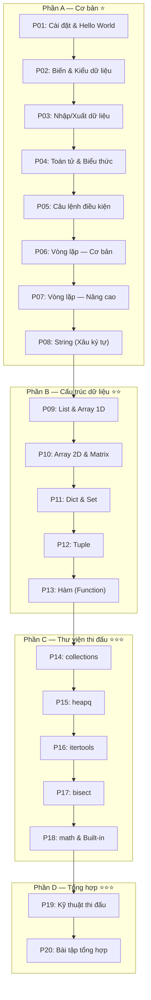

# Chương 1: Python cho Thi Đấu

> **Dành cho:** Người chưa biết gì về lập trình
> **Mục tiêu:** Nắm vững Python để thi đấu competitive programming

---

## Tại sao học Python trước?

- **Dễ học:** Cú pháp đơn giản, gần với ngôn ngữ tự nhiên
- **Nhanh viết:** Ít dòng code hơn so với C++
- **Mạnh mẽ:** Có nhiều thư viện sẵn cho thi đấu
- **Tư duy:** Tập trung vào thuật toán, không lo cú pháp phức tạp

!!! warning "Lưu ý quan trọng"
    Python **chậm hơn C++** về tốc độ chạy. Khi cần tối ưu thời gian, hãy chuyển sang C++ (Chương 2).

---

## Tổng quan nội dung

---

## Danh sách bài học

### Phần A — Cơ bản ⭐

| # | Bài học | Mô tả | Độ khó |
|---|---------|-------|--------|
| P01 | [Cài đặt & Hello World](P01-cai-dat.md) | Cài Python, IDE, chạy chương trình đầu tiên | ⭐ |
| P02 | [Biến & Kiểu dữ liệu](P02-bien-kieu-du-lieu.md) | int, float, str, bool, chuyển đổi kiểu | ⭐ |
| P03 | [Nhập/Xuất dữ liệu](P03-nhap-xuat.md) | input(), print(), f-string, sep, end | ⭐ |
| P04 | [Toán tử & Biểu thức](P04-toan-tu.md) | Số học, so sánh, logic, bitwise, ưu tiên | ⭐ |
| P05 | [Câu lệnh điều kiện](P05-dieu-kien.md) | if/elif/else, lồng nhau, ternary | ⭐ |
| P06 | [Vòng lặp — Cơ bản](P06-vong-lap-co-ban.md) | for, while, range(), break, continue | ⭐⭐ |
| P07 | [Vòng lặp — Nâng cao](P07-vong-lap-nang-cao.md) | Lồng vòng lặp, enumerate, zip, comprehension | ⭐⭐ |
| P08 | [String](P08-string.md) | Xâu ký tự, các phương thức, xử lý xâu | ⭐⭐ |

### Phần B — Cấu trúc dữ liệu ⭐⭐

| # | Bài học | Mô tả | Độ khó |
|---|---------|-------|--------|
| P09 | [List & Array 1D](P09-list-array-1d.md) | Mảng, thao tác, slicing, sort, copy | ⭐⭐ |
| P10 | [Array 2D & Matrix](P10-array-2d.md) | Ma trận, duyệt, xoay, transpose | ⭐⭐ |
| P11 | [Dict & Set](P11-dict-set.md) | Dictionary, Set, defaultdict, Counter | ⭐⭐ |
| P12 | [Tuple](P12-tuple.md) | Tuple, namedtuple, immutable | ⭐ |
| P13 | [Hàm](P13-ham.md) | Function, lambda, map, filter, reduce | ⭐⭐ |

### Phần C — Thư viện thi đấu ⭐⭐⭐

| # | Bài học | Mô tả | Độ khó |
|---|---------|-------|--------|
| P14 | [collections](P14-collections.md) | deque, Counter, defaultdict, OrderedDict | ⭐⭐⭐ |
| P15 | [heapq](P15-heapq.md) | Hàng đợi ưu tiên, Top-K, Dijkstra | ⭐⭐⭐ |
| P16 | [itertools](P16-itertools.md) | permutations, combinations, product, accumulate | ⭐⭐⭐ |
| P17 | [bisect](P17-bisect.md) | Tìm kiếm nhị phân, lower/upper bound | ⭐⭐⭐ |
| P18 | [math & Built-in](P18-math-builtins.md) | gcd, lcm, factorial, comb, các hàm built-in | ⭐⭐ |

### Phần D — Tổng hợp ⭐⭐⭐

| # | Bài học | Mô tả | Độ khó |
|---|---------|-------|--------|
| P19 | [Kỹ thuật thi đấu Python](P19-ky-thuat-thi-dau.md) | Trick, pattern, tối ưu code | ⭐⭐⭐ |
| P20 | [Bài tập tổng hợp](P20-bai-tap-tong-hop.md) | Luyện tập tất cả kiến thức | ⭐⭐⭐ |

---

## Bài tập luyện tập

Sau khi học xong mỗi bài, hãy luyện tập:

- **[CSES Problem Set](https://cses.fi/problemset/)** — Bộ bài tập cơ bản
- **[VNOJ](https://oj.vnoi.info/)** — OJ Việt Nam
- **[Codeforces](https://codeforces.com/)** — Contest online

---

## Bài viết liên quan

- [Tổng quan Lập trình Cơ bản](../index.md)
- [Chương 2: C++ cho Thi Đấu](../cpp/index.md)
- [Bài học Lập trình Thi đấu](../../lessons/index.md)
