# Hướng dẫn Lập trình Thi đấu

**Tác giả:** Antti Laaksonen — Đại học Helsinki, Phần Lan

**Dịch từ:** *Guide to Competitive Programming: Learning and Improving Algorithms Through Contests* (Springer, 2017)

---

## Lời nói đầu

Mục đích của cuốn sách này là mang đến cho bạn một giới thiệu toàn diện về lập trình thi đấu hiện đại. Giả định rằng bạn đã biết những kiến thức cơ bản về lập trình, nhưng không cần có nền tảng trước đó về thiết kế thuật toán hay các cuộc thi lập trình. Vì cuốn sách bao gồm nhiều chủ đề với độ khó khác nhau, nó phù hợp cho cả người mới bắt đầu và những đọc giả có kinh nghiệm hơn.

Các cuộc thi lập trình đã có lịch sử khá lâu dài. *International Collegiate Programming Contest* (ICPC) dành cho sinh viên đại học được bắt đầu vào những năm 1970, và *International Olympiad in Informatics* (IOI) đầu tiên dành cho học sinh trung học được tổ chức vào năm 1989. Cả hai cuộc thi hiện nay là những sự kiện được thiết lập với số lượng lớn thí sinh từ khắp nơi trên thế giới.

Ngày nay, lập trình thi đấu phổ biến hơn bao giờ hết. Internet đã đóng một vai trò quan trọng trong sự tiến bộ này. Hiện tại có một cộng đồng trực tuyến năng động của các lập trình viên thi đấu, và nhiều cuộc thi được tổ chức hàng tuần. Đồng thời, độ khó của các cuộc thi đang tăng lên. Những kỹ thuật mà chỉ những thí sinh giỏi nhất mới nắm vững vài năm trước giờ đây là những công cụ tiêu chuẩn được nhiều người biết đến.

Lập trình thi đấu có nguồn gốc từ nghiên cứu khoa học về thuật toán. Tuy nhiên, trong khi một nhà khoa học máy tính viết chứng minh để cho thấy thuật toán của họ hoạt động, thì một lập trình viên thi đấu *cài đặt* thuật toán của họ và nộp nó vào hệ thống thi. Sau đó, thuật toán được kiểm tra bằng một tập các trường hợp kiểm tra, và nếu nó vượt qua tất cả, nó được chấp nhận. Đây là một yếu tố thiết yếu trong lập trình thi đấu, vì nó cung cấp một cách để *tự động* có được bằng chứng mạnh mẽ rằng thuật toán hoạt động. Trên thực tế, lập trình thi đấu đã chứng minh là một cách tuyệt vời để học thuật toán, vì nó khuyến khích thiết kế những thuật toán thực sự hoạt động, thay vì phác thảo những ý tưởng có thể hoạt động hoặc không.

Một lợi ích khác của lập trình thi đấu là các bài toán thi đòi hỏi *suy nghĩ*. Đặc biệt, không có gợi ý trong đề bài. Đây thực sự là một vấn đề nghiêm trọng trong nhiều khóa học thuật toán. Bạn được cho một bài toán hay để giải, nhưng câu cuối cùng nói, ví dụ: "*Gợi ý*: sửa đổi thuật toán Dijkstra để giải bài toán." Sau khi đọc điều này, không cần nhiều suy nghĩ nữa, vì bạn đã biết cách giải bài toán. Điều này không bao giờ xảy ra trong lập trình thi đấu. Thay vào đó, bạn có một bộ công cụ đầy đủ, và bạn phải tự tìm ra *chính mình* sử dụng công cụ nào.

Giải các bài toán lập trình thi đấu cũng cải thiện kỹ năng lập trình và gỡ lỗi của một người. Thông thường, một giải pháp chỉ được cho điểm nếu nó giải đúng tất cả các trường hợp kiểm tra, do đó một lập trình viên thi đấu thành công phải có thể cài đặt các chương trình không có lỗi. Đây là một kỹ năng có giá trị trong kỹ thuật phần mềm, và không phải ngẫu nhiên mà các công ty IT quan tâm đến những người có nền tảng trong lập trình thi đấu.

Cần nhiều thời gian để trở thành một lập trình viên thi đấu giỏi, nhưng đó cũng là một cơ hội để học hỏi nhiều điều. Bạn có thể chắc chắn rằng bạn sẽ có được hiểu biết tổng quát tốt về thuật toán nếu bạn dành thời gian đọc cuốn sách, giải bài toán, và tham gia các cuộc thi.

Nếu bạn có bất kỳ phản hồi nào, tôi muốn nghe! Bạn có thể gửi tin nhắn cho tôi tại ahslaaks@cs.helsinki.fi.

Tôi rất biết ơn nhiều người đã gửi phản hồi cho các bản nháp của cuốn sách này. Những phản hồi này đã cải thiện đáng kể chất lượng của cuốn sách. Tôi đặc biệt cảm ơn Mikko Ervasti, Janne Junnila, Janne Kokkala, Tuukka Korhonen, Patric Östergård, và Roope Salmi vì đã cho phản hồi chi tiết về bản thảo. Tôi cũng cảm ơn Simon Rees và Wayne Wheeler vì sự hợp tác tuyệt vời khi xuất bản cuốn sách này với Springer.

Helsinki, Phần Lan, tháng 10 năm 2017
Antti Laaksonen

---

## Chương 1: Giới thiệu

Chương này trình bày về lập trình thi đấu, phác thảo nội dung của cuốn sách, và thảo luận các tài liệu học tập bổ sung.

Phần 1.1 đi qua các yếu tố của lập trình thi đấu, giới thiệu một số cuộc thi lập trình phổ biến, và đưa ra lời khuyên về cách luyện tập lập trình thi đấu.

Phần 1.2 thảo luận các mục tiêu và chủ đề của cuốn sách này, và mô tả ngắn gọn nội dung của mỗi chương.

Phần 1.3 giới thiệu Tập bài toán CSES, chứa một bộ sưu tập các bài toán luyện tập. Giải các bài toán trong khi đọc cuốn sách là một cách tốt để học lập trình thi đấu.

Phần 1.4 thảo luận các cuốn sách khác liên quan đến lập trình thi đấu và thiết kế thuật toán.

### 1.1 Lập trình Thi đấu là gì?

Lập trình thi đấu kết hợp hai chủ đề: thiết kế thuật toán và cài đặt thuật toán.

**Thiết kế Thuật toán** Lõi của lập trình thi đấu là về việc phát minh ra các thuật toán hiệu quả giải quyết các bài toán tính toán được xác định rõ ràng. Thiết kế thuật toán đòi hỏi kỹ năng giải quyết vấn đề và kỹ năng toán học. Thường thì giải pháp cho một bài toán là sự kết hợp của các phương pháp nổi tiếng và những hiểu biết mới.

Toán học đóng vai trò quan trọng trong lập trình thi đấu. Thực tế, không có ranh giới rõ ràng giữa thiết kế thuật toán và toán học. Cuốn sách này được viết sao cho không cần nhiều nền tảng toán học. Phụ lục của cuốn sách ôn tập một số khái niệm toán học được sử dụng xuyên suốt cuốn sách, chẳng hạn như tập hợp, logic, và hàm số, và phụ lục có thể được sử dụng như một tài liệu tham khảo khi đọc cuốn sách.

**Cài đặt Thuật toán** Trong lập trình thi đấu, các giải pháp cho bài toán được đánh giá bằng cách kiểm thử một thuật toán đã được cài đặt sử dụng một tập các trường hợp kiểm tra. Do đó, sau khi nghĩ ra một thuật toán giải quyết bài toán, bước tiếp theo là cài đặt nó một cách chính xác, điều này đòi hỏi kỹ năng lập trình tốt. Lập trình thi đấu khác biệt rất nhiều so với kỹ thuật phần mềm truyền thống: các chương trình ngắn (thường chỉ vài trăm dòng), chúng nên được viết nhanh, và không cần bảo trì chúng sau cuộc thi.

Hiện tại, các ngôn ngữ lập trình phổ biến nhất được sử dụng trong các cuộc thi là C++, Python, và Java. Ví dụ, trong Google Code Jam 2017, trong số 3.000 thí sinh giỏi nhất, 79% sử dụng C++, 16% sử dụng Python, và 8% sử dụng Java. Nhiều người coi C++ là lựa chọn tốt nhất cho một lập trình viên thi đấu. Lợi ích của việc sử dụng C++ là nó là một ngôn ngữ rất hiệu quả và thư viện chuẩn của nó chứa một bộ sưu tập lớn các cấu trúc dữ liệu và thuật toán.

Tất cả các chương trình mẫu trong cuốn sách này được viết bằng C++, và các cấu trúc dữ liệu và thuật toán của thư viện chuẩn thường được sử dụng. Các chương trình tuân theo chuẩn C++11, có thể được sử dụng trong hầu hết các cuộc thi ngày nay. Nếu bạn chưa thể lập trình bằng C++, bây giờ là thời điểm tốt để bắt đầu học.

#### 1.1.1 Các cuộc thi Lập trình

**IOI** *International Olympiad in Informatics* (Olympiad Tin học Quốc tế) là một cuộc thi lập trình hàng năm dành cho học sinh trung học. Mỗi quốc gia được phép gửi một đội gồm bốn học sinh đến cuộc thi. Thường có khoảng 300 thí sinh từ 80 quốc gia.

IOI bao gồm hai cuộc thi năm giờ. Trong cả hai cuộc thi, các thí sinh được yêu cầu giải ba bài toán lập trình khó. Các bài toán được chia thành các phần con, mỗi phần có một số điểm được giao. Mặc dù các thí sinh được chia thành đội, họ thi đấu với tư cách cá nhân.

Các thí sinh cho IOI được chọn thông qua các cuộc thi quốc gia. Trước IOI, nhiều cuộc thi khu vực được tổ chức, chẳng hạn như Baltic Olympiad in Informatics (BOI), Central European Olympiad in Informatics (CEOI), và Asia-Pacific Informatics Olympiad (APIO).

**ICPC** *International Collegiate Programming Contest* (Cuộc thi Lập trình Sinh viên Quốc tế) là một cuộc thi lập trình hàng năm dành cho sinh viên đại học. Mỗi đội trong cuộc thi bao gồm ba sinh viên, và không giống như IOI, các sinh viên làm việc cùng nhau; chỉ có một máy tính cho mỗi đội.

ICPC bao gồm nhiều giai đoạn, và cuối cùng các đội giỏi nhất được mời đến World Finals. Trong khi có hàng chục nghìn thí sinh trong cuộc thi, chỉ có một số lượng nhỏ<sup>1</sup> vị trí cuối cùng, nên việc tiến vào vòng chung kết đã là một thành tựu lớn.

<sup>1</sup>Số lượng vị trí cuối cùng thay đổi từ năm này sang năm khác; năm 2017, có 133 vị trí cuối cùng.

Trong mỗi cuộc thi ICPC, các đội có năm giờ để giải khoảng mười bài toán thuật toán. Một giải pháp cho bài toán chỉ được chấp nhận nếu nó giải tất cả các trường hợp kiểm tra một cách hiệu quả. Trong cuộc thi, các thí sinh có thể xem kết quả của các đội khác, nhưng trong giờ cuối cùng bảng điểm bị đóng băng và không thể xem kết quả của các lần nộp cuối.

**Các cuộc thi Trực tuyến** Cũng có nhiều cuộc thi trực tuyến mở cho tất cả mọi người. Hiện tại, trang web cuộc thi năng động nhất là Codeforces, tổ chức các cuộc thi khoảng hàng tuần. Các trang web cuộc thi phổ biến khác bao gồm AtCoder, CodeChef, CS Academy, HackerRank, và Topcoder.

Một số công ty tổ chức các cuộc thi trực tuyến với vòng chung kết trực tiếp. Ví dụ về các cuộc thi như vậy là Facebook Hacker Cup, Google Code Jam, và Yandex.Algorithm. Tất nhiên, các công ty cũng sử dụng các cuộc thi đó để tuyển dụng: thi đấu tốt trong một cuộc thi là một cách tốt để chứng minh kỹ năng lập trình của mình.

#### 1.1.2 Mẹo Luyện tập

Học lập trình thi đấu đòi hỏi một lượng công việc lớn. Tuy nhiên, có nhiều cách để luyện tập, và một số cách tốt hơn những cách khác.

Khi giải bài toán, nên nhớ rằng *số lượng* bài toán đã giải không quan trọng bằng *chất lượng* của các bài toán. Thật hấp dẫn để chọn những bài toán trông dễ và giải chúng, và bỏ qua những bài toán trông khó và nhàm chán. Tuy nhiên, cách thực sự cải thiện kỹ năng là tập trung vào loại bài toán sau.

Một quan sát quan trọng khác là hầu hết các bài toán thi lập trình có thể được giải bằng các thuật toán đơn giản và ngắn, nhưng phần khó là phát minh ra thuật toán. Lập trình thi đấu không phải là học thuộc lòng các thuật toán phức tạp và khó hiểu, mà là học cách giải quyết vấn đề và cách tiếp cận các bài toán khó bằng các công cụ đơn giản.

Cuối cùng, một số người coi nhẹ việc cài đặt thuật toán: thật thú vị khi thiết kế thuật toán nhưng nhàm chán khi cài đặt chúng. Tuy nhiên, khả năng cài đặt thuật toán nhanh chóng và chính xác là một tài sản quan trọng, và kỹ năng này có thể được luyện tập. Thật không tốt khi dành phần lớn thời gian thi để viết code và tìm lỗi, thay vì suy nghĩ cách giải bài toán.

### 1.2 Về Cuốn sách này

*Chương trình IOI* [15] quy định các chủ đề có thể xuất hiện tại Olympiad Tin học Quốc tế, và chương trình đã là điểm khởi đầu khi chọn chủ đề cho cuốn sách này. Tuy nhiên, cuốn sách cũng thảo luận một số chủ đề nâng cao bị loại khỏi IOI (tính đến năm 2017) nhưng có thể xuất hiện trong các cuộc thi khác. Ví dụ về các chủ đề như vậy là luồng cực đại, lý thuyết nim, và mảng hậu tố.

Trong khi nhiều chủ đề lập trình thi đấu được thảo luận trong các giáo trình thuật toán tiêu chuẩn, cũng có những điểm khác biệt. Ví dụ, nhiều giáo trình tập trung vào việc cài đặt các thuật toán sắp xếp và cấu trúc dữ liệu cơ bản từ đầu, nhưng kiến thức này không liên quan lắm trong lập trình thi đấu, vì chức năng thư viện chuẩn có thể được sử dụng. Bên cạnh đó, có những chủ đề được biết đến rộng rãi trong cộng đồng lập trình thi đấu nhưng hiếm khi được thảo luận trong giáo trình. Một ví dụ về chủ đề như vậy là cấu trúc dữ liệu cây phân đoạn có thể được sử dụng để giải quyết một số lượng lớn các bài toán mà nếu không sẽ đòi hỏi các thuật toán phức tạp.

Một trong những mục đích của cuốn sách là *tài liệu hóa* các kỹ thuật lập trình thi đấu mà thường chỉ được thảo luận trên các diễn đàn trực tuyến và bài đăng blog. Khi có thể, các tài liệu tham khảo khoa học đã được đưa ra cho các phương pháp đặc thù cho lập trình thi đấu. Tuy nhiên, điều này thường không thể, vì nhiều kỹ thuật giờ đây là một phần của *văn hóa dân gian* lập trình thi đấu và không ai biết ai đã phát hiện ra chúng ban đầu.

Cấu trúc của cuốn sách như sau:

- Chương 2 ôn tập các tính năng của ngôn ngữ lập trình C++, và sau đó thảo luận các thuật toán đệ quy và thao tác bit.
- Chương 3 tập trung vào hiệu suất: làm thế nào để tạo ra các thuật toán có thể xử lý nhanh các tập dữ liệu lớn.
- Chương 4 thảo luận các thuật toán sắp xếp và tìm kiếm nhị phân, tập trung vào các ứng dụng của chúng trong thiết kế thuật toán.
- Chương 5 đi qua một lựa chọn các cấu trúc dữ liệu của thư viện chuẩn C++, chẳng hạn như vector, set, và map.
- Chương 6 giới thiệu một kỹ thuật thiết kế thuật toán gọi là quy hoạch động, và trình bày các ví dụ về bài toán có thể được giải bằng kỹ thuật này.
- Chương 7 thảo luận các thuật toán đồ thị cơ bản, chẳng hạn như tìm đường đi ngắn nhất và cây khung nhỏ nhất.
- Chương 8 đề cập đến một số chủ đề thiết kế thuật toán nâng cao, chẳng hạn như song song bit và phân tích amortized.
- Chương 9 tập trung vào xử lý hiệu quả các truy vấn đoạn mảng, chẳng hạn như tính tổng giá trị và xác định giá trị nhỏ nhất.
- Chương 10 trình bày các thuật toán chuyên biệt cho cây, bao gồm các phương pháp xử lý truy vấn trên cây.
- Chương 11 thảo luận các chủ đề toán học liên quan trong lập trình thi đấu.
- Chương 12 trình bày các kỹ thuật đồ thị nâng cao, chẳng hạn như các thành phần liên thông mạnh và luồng cực đại.
- Chương 13 tập trung vào các thuật toán hình học và trình bày các kỹ thuật giải quyết các bài toán hình học một cách tiện lợi.
- Chương 14 đề cập đến các kỹ thuật xâu, chẳng hạn như băm xâu, thuật toán Z, và sử dụng mảng hậu tố.
- Chương 15 thảo luận một lựa chọn các chủ đề nâng cao hơn, chẳng hạn như thuật toán căn bậc hai và tối ưu quy hoạch động.

### 1.3 Tập bài toán CSES

Tập bài toán CSES cung cấp một bộ sưu tập bài toán có thể được sử dụng để luyện tập lập trình thi đấu. Các bài toán được sắp xếp theo thứ tự độ khó, và tất cả các kỹ thuật cần thiết để giải bài toán đều được thảo luận trong cuốn sách này. Tập bài toán có sẵn tại địa chỉ sau:

https://cses.fi/problemset/

Hãy xem cách giải bài toán đầu tiên trong tập bài toán, có tên *Weird Algorithm*. Đề bài như sau:

Xem xét một thuật toán nhận đầu vào là một số nguyên dương n. Nếu n chia hết cho 2, thuật toán chia nó cho 2, và nếu n lẻ, thuật toán nhân nó với 3 và cộng 1. Thuật toán lặp lại điều này cho đến khi n bằng 1. Ví dụ, dãy cho n = 3 như sau:

$$3 \rightarrow 10 \rightarrow 5 \rightarrow 16 \rightarrow 8 \rightarrow 4 \rightarrow 2 \rightarrow 1$$

Nhiệm vụ của bạn là mô phỏng việc thực thi thuật toán cho một giá trị n cho trước.

**Input**

Dòng input duy nhất chứa một số nguyên n.

**Output**

In một dòng chứa tất cả các giá trị của n trong quá trình thuật toán.

**Ràng buộc**

```
1 ≤ n ≤ 10^6
```

Ví dụ: Input: 3, Output: 3 10 5 16 8 4 2 1

Bài toán này liên quan đến giả thuyết Collatz nổi tiếng, phát biểu rằng thuật toán trên kết thúc cho mọi giá trị của n. Tuy nhiên, không ai có thể chứng minh được. Trong bài toán này, chúng ta biết rằng giá trị ban đầu của n sẽ nhiều nhất là một triệu, điều này làm cho bài toán dễ giải hơn nhiều.

Bài toán này là một bài toán mô phỏng đơn giản, không đòi hỏi nhiều suy nghĩ. Đây là một cách có thể giải bài toán bằng C++:

```cpp
#include <iostream>
using namespace std;
int main() {
 int n;
 cin >> n;
 while (true) {
 cout << n << " ";
 if (n == 1) break;
 if (n%2 == 0) n /= 2;
 else n = n*3+1;
 }
 cout << "\n";
}
```

Code đầu tiên đọc vào số n, sau đó mô phỏng thuật toán và in giá trị của n sau mỗi bước. Dễ dàng kiểm tra rằng thuật toán xử lý đúng trường hợp mẫu n=3 được cho trong đề bài.

Bây giờ là lúc *nộp* code lên CSES. Sau đó code sẽ được biên dịch và kiểm tra bằng một tập các trường hợp kiểm tra. Đối với mỗi trường hợp kiểm tra, CSES sẽ cho chúng ta biết code của chúng ta có vượt qua hay không, và chúng ta cũng có thể kiểm tra đầu vào, đầu ra mong đợi, và đầu ra được tạo ra bởi code của chúng ta.

Sau khi kiểm tra code, CSES đưa ra báo cáo sau:

| test | verdict | time (s) |
|------|---------|----------|
| #1 | ACCEPTED | 0.06 / 1.00 |
| #2 | ACCEPTED | 0.06 / 1.00 |
| #3 | ACCEPTED | 0.07 / 1.00 |
| #4 | ACCEPTED | 0.06 / 1.00 |
| #5 | ACCEPTED | 0.06 / 1.00 |
| #6 | TIME LIMIT EXCEEDED | -/1.00 |
| #7 | TIME LIMIT EXCEEDED | -/1.00 |
| #8 | WRONG ANSWER | 0.07 / 1.00 |
| #9 | TIME LIMIT EXCEEDED | -/1.00 |
| #10 | ACCEPTED | 0.06 / 1.00 |

Điều này có nghĩa là code của chúng ta đã vượt qua một số trường hợp kiểm tra (ACCEPTED), đôi khi quá chậm (TIME LIMIT EXCEEDED), và cũng tạo ra đầu ra không chính xác (WRONG ANSWER). Điều này khá bất ngờ!

Trường hợp kiểm tra đầu tiên thất bại có n = 138367. Nếu chúng ta kiểm tra code cục bộ bằng đầu vào này, hóa ra code thực sự chậm. Trên thực tế, nó không bao giờ kết thúc.

Lý do code của chúng ta thất bại là n có thể trở nên khá lớn trong quá trình mô phỏng. Đặc biệt, nó có thể trở nên lớn hơn giới hạn trên của biến int. Để sửa vấn đề, chỉ cần thay đổi code sao cho kiểu của n là long long. Sau đó chúng ta sẽ có được kết quả mong muốn:

| test | verdict | time (s) |
|------|---------|----------|
| #1 | ACCEPTED | 0.05 / 1.00 |
| #2 | ACCEPTED | 0.06 / 1.00 |
| #3 | ACCEPTED | 0.07 / 1.00 |
| #4 | ACCEPTED | 0.06 / 1.00 |
| #5 | ACCEPTED | 0.06 / 1.00 |
| #6 | ACCEPTED | 0.05 / 1.00 |
| #7 | ACCEPTED | 0.06 / 1.00 |
| #8 | ACCEPTED | 0.05 / 1.00 |
| #9 | ACCEPTED | 0.07 / 1.00 |
| #10 | ACCEPTED | 0.06 / 1.00 |

Như ví dụ này cho thấy, ngay cả những thuật toán rất đơn giản cũng có thể chứa những lỗi tinh vi. Lập trình thi đấu dạy cách viết các thuật toán thực sự hoạt động.

### 1.4 Tài liệu khác

Ngoài cuốn sách này, đã có một số cuốn sách khác về lập trình thi đấu. *Programming Challenges* của Skiena và Revilla [28] là cuốn sách tiên phong trong lĩnh vực được xuất bản năm 2003. Một cuốn sách gần đây hơn là *Competitive Programming 3* [14] của Halim và Halim. Cả hai cuốn sách trên dành cho đọc giả không có nền tảng về lập trình thi đấu.

*Looking for a Challenge?* [7] là một cuốn sách nâng cao, trình bày một bộ sưu tập các bài toán khó từ các cuộc thi lập trình Ba Lan. Đặc điểm thú vị nhất của cuốn sách là nó cung cấp các phân tích chi tiết về cách giải bài toán. Cuốn sách dành cho các lập trình viên thi đấu có kinh nghiệm.

Tất nhiên, các cuốn sách thuật toán nói chung cũng là những bài đọc tốt cho các lập trình viên thi đấu. Toàn diện nhất trong số đó là *Introduction to Algorithms* [6] được viết bởi Cormen, Leiserson, Rivest, và Stein, còn được gọi là *CLRS*. Cuốn sách này là một tài liệu tốt nếu bạn muốn kiểm tra tất cả chi tiết liên quan đến thuật toán và cách chứng minh nghiêm ngặt rằng nó đúng.

*Algorithm Design* của Kleinberg và Tardos [19] tập trung vào các kỹ thuật thiết kế thuật toán, và thảo luận kỹ lưỡng phương pháp chia để trị, thuật toán tham lam, quy hoạch động, và thuật toán luồng cực đại. *The Algorithm Design Manual* của Skiena [27] là một cuốn sách thực tế hơn bao gồm một danh mục lớn các bài toán tính toán và mô tả cách giải chúng.


## Chương 2: Kỹ thuật Lập trình

Chương này trình bày một số tính năng của ngôn ngữ lập trình C++ hữu ích trong lập trình thi đấu, và đưa ra các ví dụ về cách sử dụng đệ quy và thao tác bit trong lập trình.

Phần 2.1 thảo luận một số chủ đề liên quan đến C++, bao gồm phương pháp nhập và xuất, làm việc với số, và cách rút gọn code.

Phần 2.2 tập trung vào các thuật toán đệ quy. Đầu tiên chúng ta sẽ học một cách thanh lịch để sinh tất cả tập con và hoán vị của một tập hợp sử dụng đệ quy. Sau đó, chúng ta sẽ sử dụng quay lui để đếm số cách đặt n quân hậu không tấn công nhau trên bàn cờ $n \times n$.

Phần 2.3 thảo luận những kiến thức cơ bản về thao tác bit và cho thấy cách sử dụng chúng để biểu diễn tập con của tập hợp.

### 2.1 Các tính năng Ngôn ngữ

Một mẫu code C++ điển hình cho lập trình thi đấu trông như thế này:

```cpp
#include <bits/stdc++.h>
using namespace std;
int main() {
 // giải pháp ở đây
}
```

Dòng `#include` ở đầu code là một tính năng của trình biên dịch g++ cho phép chúng ta include toàn bộ thư viện chuẩn. Do đó, không cần phải include riêng lẻ các thư viện như iostream, vector, và algorithm, mà chúng tự động có sẵn.

Dòng `using` khai báo rằng các lớp và hàm của thư viện chuẩn có thể được sử dụng trực tiếp trong code. Nếu không có dòng `using` chúng ta sẽ phải viết, ví dụ, `std::cout`, nhưng bây giờ chỉ cần viết `cout`.

Code có thể được biên dịch bằng lệnh sau:

```bash
g++ -std=c++11 -O2 -Wall test.cpp -o test
```

Lệnh này tạo ra một file nhị phân `test` từ mã nguồn `test.cpp`. Trình biên dịch tuân theo chuẩn C++11 (`-std=c++11`), tối ưu hóa code (`-O2`), và hiển thị cảnh báo về các lỗi có thể (`-Wall`).

#### 2.1.1 Nhập và Xuất

Trong hầu hết các cuộc thi, các luồng tiêu chuẩn được sử dụng để đọc đầu vào và ghi đầu ra. Trong C++, các luồng tiêu chuẩn là `cin` cho đầu vào và `cout` cho đầu ra. Cũng có thể sử dụng các hàm C, chẳng hạn như `scanf` và `printf`.

Đầu vào cho chương trình thường bao gồm các số và xâu ký tự được phân tách bằng khoảng trắng và dòng mới. Chúng có thể được đọc từ luồng `cin` như sau:

```cpp
int a, b;
string x;
cin >> a >> b >> x;
```

Loại code này luôn hoạt động, giả sử rằng có ít nhất một khoảng trắng hoặc dòng mới giữa mỗi phần tử trong đầu vào. Ví dụ, code trên có thể đọc cả hai đầu vào sau:

```
123 456 monkey
```

```
123 456
monkey
```

Luồng `cout` được sử dụng cho đầu ra như sau:

```cpp
int a = 123, b = 456;
string x = "monkey";
cout << a << " " << b << " " << x << "\n";
```

Nhập và xuất đôi khi là nút thắt cổ chai trong chương trình. Các dòng sau ở đầu code làm cho nhập và xuất hiệu quả hơn:

```cpp
ios::sync_with_stdio(0);
cin.tie(0);
```

Lưu ý rằng ký tự newline `"\n"` hoạt động nhanh hơn `endl`, vì `endl` luôn gây ra thao tác flush.

Các hàm C `scanf` và `printf` là một lựa chọn thay thế cho các luồng tiêu chuẩn C++. Chúng thường nhanh hơn một chút, nhưng cũng khó sử dụng hơn. Code sau đọc hai số nguyên từ đầu vào:

```cpp
int a, b;
scanf("%d %d", &a, &b);
```

Code sau in hai số nguyên:

```cpp
int a = 123, b = 456;
printf("%d %d\n", a, b);
```

Đôi khi chương trình cần đọc một dòng đầu vào hoàn chỉnh, có thể chứa khoảng trắng. Điều này có thể thực hiện bằng cách sử dụng hàm `getline`:

```cpp
string s;
getline(cin, s);
```

Nếu lượng dữ liệu không biết trước, vòng lặp sau hữu ích:

```cpp
while (cin >> x) {
 // code
}
```

Vòng lặp này đọc các phần tử từ đầu vào lần lượt cho đến khi không còn dữ liệu trong đầu vào.

Trong một số hệ thống thi, file được sử dụng cho đầu vào và đầu ra. Một giải pháp dễ dàng cho điều này là viết code như bình thường sử dụng các luồng tiêu chuẩn, nhưng thêm các dòng sau vào đầu code:

```cpp
freopen("input.txt", "r", stdin);
freopen("output.txt", "w", stdout);
```

Sau đó, chương trình đọc đầu vào từ file "input.txt" và ghi đầu ra ra file "output.txt".

#### 2.1.2 Làm việc với Số

**Số nguyên** Kiểu số nguyên được sử dụng nhiều nhất trong lập trình thi đấu là `int`, là kiểu 32-bit<sup>1</sup> với phạm vi giá trị $-2^{31} \dots 2^{31} - 1$ (khoảng $-2 \cdot 10^9 \dots 2 \cdot 10^9$). Nếu kiểu `int` không đủ, có thể sử dụng kiểu 64-bit `long long`. Nó có phạm vi giá trị $-2^{63} \dots 2^{63} - 1$ (khoảng $-9 \cdot 10^{18} \dots 9 \cdot 10^{18}$).

Code sau định nghĩa một biến `long long`:

```cpp
long long x = 123456789123456789LL;
```

Hậu tố `LL` có nghĩa là kiểu của số là `long long`.

Một lỗi phổ biến khi sử dụng kiểu `long long` là kiểu `int` vẫn được sử dụng ở đâu đó trong code. Ví dụ, code sau chứa một lỗi tinh vi:

```cpp
int a = 123456789;
long long b = a*a;
cout << b << "\n"; // -1757895751
```

Mặc dù biến `b` là kiểu `long long`, cả hai số trong biểu thức `a*a` đều là kiểu `int`, và kết quả cũng là kiểu `int`. Do đó, biến `b` sẽ có kết quả sai. Vấn đề có thể được giải quyết bằng cách đổi kiểu của `a` thành `long long` hoặc đổi biểu thức thành `(long long)a*a`.

Thường thì các bài thi được thiết lập sao cho kiểu `long long` là đủ. Tuy nhiên, thật tốt khi biết rằng trình biên dịch g++ cũng cung cấp kiểu 128-bit `__int128_t` với phạm vi giá trị $-2^{127} \dots 2^{127} - 1$ (khoảng $-10^{38} \dots 10^{38}$). Tuy nhiên, kiểu này không có sẵn trong tất cả các hệ thống thi.

<sup>1</sup>Thực tế, chuẩn C++ không quy định chính xác kích thước của các kiểu số, và các giới hạn phụ thuộc vào trình biên dịch và nền tảng. Các kích thước được đưa ra trong phần này là những gì bạn rất có thể thấy khi sử dụng các hệ thống hiện đại.

**Số học Modular** Đôi khi, câu trả lời cho một bài toán là một số rất lớn, nhưng chỉ cần xuất nó "modulo m", tức là số dư khi câu trả lời được chia cho m (ví dụ, "modulo $10^9 + 7$"). Ý tưởng là ngay cả khi câu trả lời thực tế rất lớn, chỉ cần sử dụng các kiểu `int` và `long long`.

Chúng ta ký hiệu $x \mod m$ là số dư khi x được chia cho m. Ví dụ, 17 mod 5 = 2, vì $17 = 3 \cdot 5 + 2$. Một tính chất quan trọng của số dư là các công thức sau đúng:

$$(a+b) \mod m = (a \mod m + b \mod m) \mod m$$

$$(a-b) \mod m = (a \mod m - b \mod m) \mod m$$

$$(a \cdot b) \mod m = (a \mod m \cdot b \mod m) \mod m$$

Do đó, chúng ta có thể lấy số dư sau mỗi phép toán, và các số sẽ không bao giờ trở nên quá lớn.

Ví dụ, code sau tính n!, giai thừa của n, modulo m:

```cpp
long long x = 1;
for (int i = 1; i <= n; i++) {
 x = (x*i)%m;
}
cout << x << "\n";
```

Thường chúng ta muốn số dư luôn nằm trong khoảng $0 \dots m-1$. Tuy nhiên, trong C++ và các ngôn ngữ khác, số dư của số âm hoặc bằng không hoặc âm. Một cách dễ dàng để đảm bảo không có số dư âm là đầu tiên tính số dư như bình thường và sau đó cộng m nếu kết quả âm:

```cpp
x = x%m;
if (x < 0) x += m;
```

Tuy nhiên, điều này chỉ cần thiết khi có phép trừ trong code, và số dư có thể trở nên âm.

**Số dấu phẩy động** Trong hầu hết các bài toán lập trình thi đấu, chỉ cần sử dụng số nguyên, nhưng đôi khi cần số dấu phẩy động. Các kiểu dấu phẩy động hữu ích nhất trong C++ là `double` 64-bit và, như một phần mở rộng trong trình biên dịch g++, `long double` 80-bit. Trong hầu hết các trường hợp, `double` là đủ, nhưng `long double` chính xác hơn.

Độ chính xác yêu cầu của câu trả lời thường được cho trong đề bài. Một cách dễ dàng để xuất câu trả lời là sử dụng hàm `printf` và đưa ra số chữ số thập phân trong chuỗi định dạng. Ví dụ, code sau in giá trị của x với 9 chữ số thập phân:

```cpp
printf("%.9f\n", x);
```

Một khó khăn khi sử dụng số dấu phẩy động là một số số không thể được biểu diễn chính xác dưới dạng số dấu phẩy động, và sẽ có lỗi làm tròn. Ví dụ, trong code sau, giá trị của x hơi nhỏ hơn 1, trong khi giá trị đúng sẽ là 1.

```cpp
double x = 0.3*3+0.1;
printf("%.20f\n", x); // 0.9999999999999988898
```

Thật rủi ro khi so sánh số dấu phẩy động bằng toán tử `==`, vì có thể các giá trị nên bằng nhau nhưng chúng không bằng vì lỗi chính xác. Một cách tốt hơn để so sánh số dấu phẩy động là giả sử rằng hai số bằng nhau nếu hiệu giữa chúng nhỏ hơn $\varepsilon$, trong đó $\varepsilon$ là một số nhỏ. Ví dụ, trong code sau $\varepsilon = 10^{-9}$:

```cpp
if (abs(a-b) < 1e-9) {
 // a và b bằng nhau
}
```

Lưu ý rằng trong khi số dấu phẩy động không chính xác, các số nguyên đến một giới hạn nhất định vẫn có thể được biểu diễn chính xác. Ví dụ, sử dụng `double`, có thể biểu diễn chính xác tất cả các số nguyên có giá trị tuyệt đối nhiều nhất $2^{53}$.

#### 2.1.3 Rút gọn Code

**Tên kiểu** Lệnh `typedef` có thể được sử dụng để đặt tên ngắn cho một kiểu dữ liệu. Ví dụ, tên `long long` dài, nên chúng ta có thể định nghĩa tên ngắn `ll` như sau:

```cpp
typedef long long ll;
```

Sau đó, code

```cpp
long long a = 123456789;
long long b = 987654321;
cout << a*b << "\n";
```

có thể được rút gọn như sau:

```cpp
ll a = 123456789;
ll b = 987654321;
cout << a*b << "\n";
```

Lệnh `typedef` cũng có thể được sử dụng với các kiểu phức tạp hơn. Ví dụ, code sau đặt tên `vi` cho một vector số nguyên, và tên `pi` cho một cặp chứa hai số nguyên.

```cpp
typedef vector<int> vi;
typedef pair<int,int> pi;
```

**Macro** Một cách khác để rút gọn code là định nghĩa *macro*. Macro chỉ định rằngmột số chuỗi trong code sẽ được thay đổi trước khi biên dịch. Trong C++, macro được định nghĩa bằng từ khóa `#define`.

Ví dụ, chúng ta có thể định nghĩa các macro sau:

```cpp
#define F first
#define S second
#define PB push_back
#define MP make_pair
```

Sau đó, code

```cpp
v.push_back(make_pair(y1,x1));
v.push_back(make_pair(y2,x2));
int d = v[i].first+v[i].second;
```

có thể được rút gọn như sau:

```cpp
v.PB(MP(y1,x1));
v.PB(MP(y2,x2));
int d = v[i].F+v[i].S;
```

Macro cũng có thể có tham số, điều này làm cho có thể rút gọn các vòng lặp và các cấu trúc khác. Ví dụ, chúng ta có thể định nghĩa macro sau:

```cpp
#define REP(i,a,b) for (int i = a; i <= b; i++)
```

Sau đó, code

```cpp
for (int i = 1; i <= n; i++) {
 search(i);
}
```

có thể được rút gọn như sau:

```cpp
REP(i,1,n) {
 search(i);
}
```

### 2.2 Thuật toán Đệ quy

*Đệ quy* thường cung cấp một cách thanh lịch để cài đặt thuật toán. Trong phần này, chúng ta thảo luận các thuật toán đệ quy có hệ thống đi qua các nghiệm_candidate của bài toán. Đầu tiên, chúng ta tập trung vào việc sinh tập con và hoán vị, sau đó thảo luận kỹ thuật quay lui tổng quát hơn.

#### 2.2.1 Sinh Tập con

Ứng dụng đầu tiên của đệ quy là sinh tất cả tập con của một tập hợp gồm n phần tử. Ví dụ, các tập con của $\{1, 2, 3\}$ là $\emptyset$, $\{1\}$, $\{2\}$, $\{3\}$, $\{1, 2\}$, $\{1, 3\}$, $\{2, 3\}$, và $\{1, 2, 3\}$. Hàm đệ quy `search` sau có thể được sử dụng để sinh các tập con. Hàm duy trì một vector

```cpp
vector<int> subset;
```

sẽ chứa các phần tử của mỗi tập con. Tìm kiếm bắt đầu khi hàm được gọi với tham số 1.

```cpp
void search(int k) {
 if (k == n+1) {
 // xử lý tập con
 } else {
 // bao gồm k trong tập con
 subset.push_back(k);
 search(k+1);
 subset.pop_back();
 // không bao gồm k trong tập con
 search(k+1);
 }
}
```

Khi hàm `search` được gọi với tham số k, nó quyết định có bao gồm phần tử k trong tập con hay không, và trong cả hai trường hợp, sau đó gọi chính nó với tham số k+1. Sau đó, nếu k=n+1, hàm nhận ra rằng tất cả các phần tử đã được xử lý và một tập con đã được sinh ra.

Hình 2.1 minh họa việc sinh tập con khi n=3. Tại mỗi lần gọi hàm, hoặc nhánh trên (k được bao gồm trong tập con) hoặc nhánh dưới (k không được bao gồm trong tập con) được chọn.

**Hình 2.1** Cây đệ quy khi sinh tập con của tập hợp $\{1, 2, 3\}$

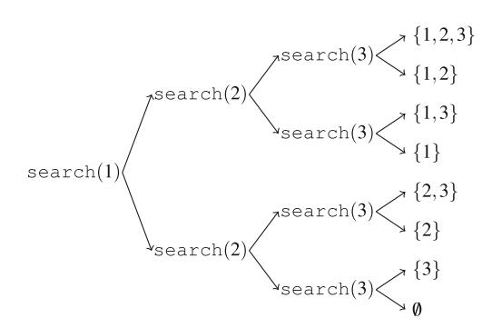

#### 2.2.2 Sinh Hoán vị

Tiếp theo chúng ta xem xét bài toán sinh tất cả hoán vị của một tập hợp gồm n phần tử. Ví dụ, các hoán vị của $\{1, 2, 3\}$ là (1, 2, 3), (1, 3, 2), (2, 1, 3), (2, 3, 1), (3, 1, 2), và (3, 2, 1). Một lần nữa, chúng ta có thể sử dụng đệ quy để thực hiện tìm kiếm. Hàm `search` sau duy trì một vector

```cpp
vector<int> permutation;
```

sẽ chứa mỗi hoán vị, và một mảng

```cpp
bool chosen[n+1];
```

cho biết mỗi phần tử có được bao gồm trong hoán vị hay không. Tìm kiếm bắt đầu khi hàm được gọi không có tham số.

```cpp
void search() {
 if (permutation.size() == n) {
 // xử lý hoán vị
 } else {
 for (int i = 1; i <= n; i++) {
 if (chosen[i]) continue;
 chosen[i] = true;
 permutation.push_back(i);
 search();
 chosen[i] = false;
 permutation.pop_back();
 }
 }
}
```

Mỗi lần gọi hàm thêm một phần tử mới vào `permutation` và ghi lại rằng nó đã được bao gồm trong `chosen`. Nếu kích thước của `permutation` bằng kích thước của tập hợp, một hoán vị đã được sinh ra.

Lưu ý rằng thư viện chuẩn C++ cũng có hàm `next_permutation` có thể được sử dụng để sinh hoán vị. Hàm được cho một hoán vị, và nó tạo ra hoán vị tiếp theo theo thứ tự từ điển. Code sau đi qua các hoán vị của $\{1, 2, ..., n\}$:

```cpp
for (int i = 1; i <= n; i++) {
 permutation.push_back(i);
}
do {
 // xử lý hoán vị
} while (next_permutation(permutation.begin(), permutation.end()));
```

#### 2.2.3 Quay lui

Thuật toán *quay lui* bắt đầu với một nghiệm trống và mở rộng nghiệm từng bước một. Tìm kiếm đệ quy đi qua tất cả các cách khác nhau mà một nghiệm có thể được xây dựng.

Ví dụ, xem xét bài toán tính số cách đặt n quân hậu trên bàn cờ $n \times n$ sao cho không hai quân hậu nào tấn công nhau. Ví dụ, Hình 2.2 cho thấy hai nghiệm có thể cho n = 4.

Bài toán có thể được giải bằng quay lui bằng cách đặt các quân hậu lên bàn cờ theo hàng. Chính xác hơn, đúng một quân hậu sẽ được đặt trên mỗi hàng sao cho không quân hậu nào tấn công bất kỳ quân hậu nào đã được đặt trước đó. Một nghiệm được tìm thấy khi tất cả n quân hậu đã được đặt lên bàn cờ.

Ví dụ, Hình 2.3 cho thấy một số nghiệm một phần được tạo ra bởi thuật toán quay lui khi n=4. Ở cấp dưới, ba cấu hình đầu tiên là bất hợp pháp, vì các quân hậu tấn công nhau. Tuy nhiên, cấu hình thứ tư là hợp lệ, và nó có thể được mở rộng thành một nghiệm hoàn chỉnh bằng cách đặt thêm hai quân hậu lên bàn cờ. Chỉ có một cách để đặt hai quân hậu còn lại.

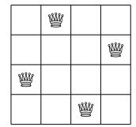

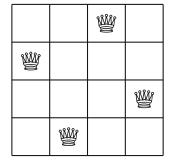

**Hình 2.2** Các cách có thể để đặt 4 quân hậu trên bàn cờ $4 \times 4$

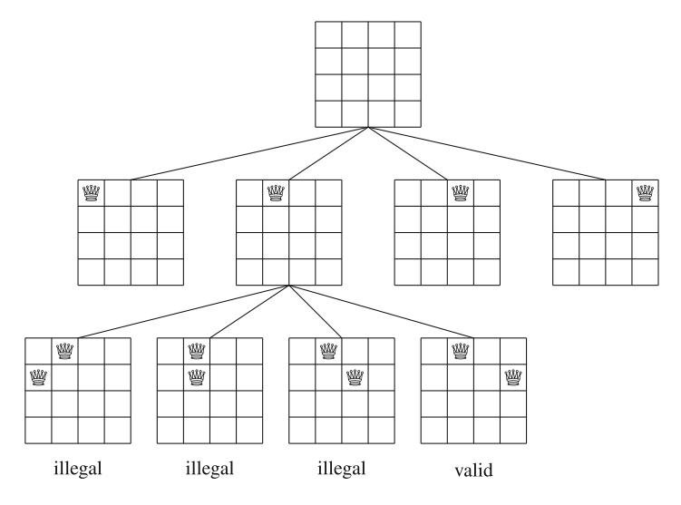

**Hình 2.3** Các nghiệm một phần cho bài toán quân hậu sử dụng quay lui

Thuật toán có thể được cài đặt như sau:

```cpp
void search(int y) {
 if (y == n) {
 count++;
 return;
 }
 for (int x = 0; x < n; x++) {
 if (col[x] || diag1[x+y] || diag2[x-y+n-1]) continue;
 col[x] = diag1[x+y] = diag2[x-y+n-1] = 1;
 search(y+1);
 col[x] = diag1[x+y] = diag2[x-y+n-1] = 0;
 }
}
```

Tìm kiếm bắt đầu bằng cách gọi `search(0)`. Kích thước của bàn cờ là n, và code tính số nghiệm vào biến `count`. Code giả sử rằng các hàng và cột của bàn cờ được đánh số từ 0 đến n-1. Khi `search` được gọi với tham số y, nó đặt một quân hậu lên hàng y và sau đó gọi chính nó với tham số y+1. Sau đó, nếu y=n, một nghiệm đã được tìm thấy, và giá trị của `count` được tăng lên một.

Mảng `col` theo dõi các cột chứa một quân hậu, và các mảng `diag1` và `diag2` theo dõi các đường chéo. Không được phép thêm một quân hậu khác vào cột hoặc đường chéo đã chứa một quân hậu. Ví dụ, Hình 2.4 cho thấy đánh số của các cột và đường chéo của bàn cờ $4 \times 4$.

Thuật toán quay lui trên cho chúng ta biết có 92 cách để đặt 8 quân hậu trên bàn cờ $8 \times 8$. Khi n tăng, tìm kiếm nhanh chóng trở nên chậm, vì số nghiệm tăng theo cấp số nhân. Ví dụ, mất khoảng một phút trên máy tính hiện đại để tính rằng có 14772512 cách để đặt 16 quân hậu trên bàn cờ $16 \times 16$.

Thực tế, không ai biết một cách *hiệu quả* để đếm số tổ hợp quân hậu cho các giá trị lớn hơn của n. Hiện tại, giá trị lớn nhất của n mà kết quả được biết là 27: có 234907967154122528 tổ hợp trong trường hợp này. Điều này được phát hiện vào năm 2016 bởi một nhóm nghiên cứu sử dụng một cụm máy tính để tính kết quả [25].

**Hình 2.4** Đánh số của các mảng khi đếm tổ hợp trên bàn cờ $4 \times 4$


### 2.3 Thao tác Bit

Trong lập trình, một số nguyên n-bit được lưu trữ nội bộ dưới dạng số nhị phân gồm n bit. Ví dụ, kiểu C++ `int` là kiểu 32-bit, điều này có nghĩa là mỗi số `int` gồm 32 bit. Ví dụ, biểu diễn bit của số `int` 43 là

```
00000000000000000000000000101011
```

Các bit trong biểu diễn được đánh chỉ số từ phải sang trái. Để chuyển đổi biểu diễn bit $b_k \ldots b_2 b_1 b_0$ thành số, công thức

$$b_k 2^k + \dots + b_2 2^2 + b_1 2^1 + b_0 2^0$$

có thể được sử dụng. Ví dụ,

$$1 \cdot 2^5 + 1 \cdot 2^3 + 1 \cdot 2^1 + 1 \cdot 2^0 = 43.$$

Biểu diễn bit của một số hoặc là *có dấu* hoặc *không dấu*. Thường sử dụng biểu diễn có dấu, điều này có nghĩa là cả số âm và số dương đều có thể được biểu diễn. Một biến có dấu n-bit có thể chứa bất kỳ số nguyên nào giữa $-2^{n-1}$ và $2^{n-1} - 1$. Ví dụ, kiểu `int` trong C++ là kiểu có dấu, nên một biến `int` có thể chứa bất kỳ số nguyên nào giữa $-2^{31}$ và $2^{31} - 1$.

Bit đầu tiên trong biểu diễn có dấu là dấu của số (0 cho số không âm và 1 cho số âm), và n-1 bit còn lại chứa độ lớn của số. *Bù hai* được sử dụng, điều này có nghĩa là số đối của một số được tính bằng cách đầu tiên đảo ngược tất cả các bit trong số và sau đó tăng số lên một. Ví dụ, biểu diễn bit của số `int` -43 là

```
11111111111111111111111111010101
```

Trong biểu diễn không dấu, chỉ có thể sử dụng số không âm, nhưng giới hạn trên cho các giá trị lớn hơn. Một biến không dấu n-bit có thể chứa bất kỳ số nguyên nào giữa 0 và $2^n - 1$. Ví dụ, trong C++, một biến `unsigned int` có thể chứa bất kỳ số nguyên nào giữa 0 và $2^{32} - 1$.

Có một mối liên hệ giữa các biểu diễn: một số có dấu -x bằng một số không dấu $2^n - x$. Ví dụ, code sau cho thấy rằng số có dấu x = -43 bằng số không dấu $y = 2^{32} - 43$:

```cpp
int x = -43;
unsigned int y = x;
cout << x << "\n"; // -43
cout << y << "\n"; // 4294967253
```

Nếu một số lớn hơn giới hạn trên của biểu diễn bit, số sẽ bị tràn. Trong biểu diễn có dấu, số tiếp theo sau $2^{n-1} - 1$ là $-2^{n-1}$, và trong biểu diễn không dấu, số tiếp theo sau $2^n - 1$ là 0. Ví dụ, xem xét code sau:

```cpp
int x = 2147483647;
cout << x << "\n"; // 2147483647
x++;
cout << x << "\n"; // -2147483648
```

Ban đầu, giá trị của x là $2^{31} - 1$. Đây là giá trị lớn nhất có thể được lưu trữ trong một biến `int`, nên số tiếp theo sau $2^{31} - 1$ là $-2^{31}$.

#### 2.3.1 Các phép toán Bit

**Phép AND** Phép toán *and* `x & y` tạo ra một số có các bit 1 ở các vị trí mà cả x và y đều có bit 1. Ví dụ, 22 & 26 = 18, vì

$$\begin{array}{c}
10110 \ (22) \\
\& \ 11010 \ (26) \\
\hline
= 10010 \ (18)
\end{array}$$

Sử dụng phép and, chúng ta có thể kiểm tra xem một số x có chẵn hay không vì `x & 1 = 0` nếu x chẵn, và `x & 1 = 1` nếu x lẻ. Tổng quát hơn, x chia hết cho $2^k$ chính xác khi $x \& (2^k - 1) = 0$.

**Phép OR** Phép toán *or* `x | y` tạo ra một số có các bit 1 ở các vị trí mà ít nhất một trong x và y có bit 1. Ví dụ, $22 | 26 = 30$, vì

$$\begin{array}{r}
10110 \ (22) \\
|\ 11010 \ (26) \\
\hline
= 11110 \ (30)
\end{array}$$

**Phép XOR** Phép toán *xor* `x ^ y` tạo ra một số có các bit 1 ở các vị trí mà chính xác một trong x và y có bit 1. Ví dụ, $22 \oplus 26 = 12$, vì

$$\begin{array}{c}
10110 \ (22) \\
\oplus\ 11010 \ (26) \\
\hline
= 01100 \ (12)
\end{array}$$

**Phép NOT** Phép toán *not* `~x` tạo ra một số mà tất cả các bit của x đã bị đảo ngược. Công thức $\tilde{x} = -x - 1$ đúng, ví dụ, $\tilde{29} = -30$. Kết quả của phép not ở cấp bit phụ thuộc vào độ dài của biểu diễn bit, vì phép toán đảo ngược tất cả các bit. Ví dụ, nếu các số là số `int` 32-bit, kết quả như sau:

```
x = 29: 00000000000000000000000000011101
~x = -30: 11111111111111111111111111100011
```

**Dịch bit** *Dịch bit trái* `x << k` thêm k bit 0 vào số, và *Dịch bit phải* `x >> k` bỏ k bit cuối cùng khỏi số. Ví dụ, `14 << 2 = 56`, vì 14 và 56 tương ứng với 1110 và 111000. Tương tự, `49 >> 3 = 6`, vì 49 và 6 tương ứng với 110001 và 110. Lưu ý rằng `x << k` tương ứng với nhân x với $2^k$, và `x >> k` tương ứng với chia x cho $2^k$ làm tròn xuống số nguyên.

**Bit mask** *Bit mask* dạng `1 << k` có một bit 1 ở vị trí k, và tất cả các bit khác bằng 0, nên chúng ta có thể sử dụng các mask như vậy để truy cập các bit đơn lẻ của số. Đặc biệt, bit thứ k của số bằng 1 chính xác khi `x & (1 << k)` khác 0. Code sau in biểu diễn bit của một số `int` x:

```cpp
for (int k = 31; k >= 0; k--) {
 if (x&(1<<k)) cout << "1";
 else cout << "0";
}
```

Cũng có thể sửa đổi các bit đơn lẻ của số sử dụng các ý tưởng tương tự. Công thức `x | (1 << k)` đặt bit thứ k của x thành 1, công thức `x & ~(1 << k)` đặt bit thứ k của x thành 0, và công thức `x ^ (1 << k)` đảo ngược bit thứ k của x. Sau đó, công thức `x & (x-1)` đặt bit 1 cuối cùng của x thành 0, và công thức `x & -x` đặt tất cả các bit 1 thành 0, trừ bit 1 cuối cùng. Công thức `x | (x-1)` đảo ngược tất cả các bit sau bit 1 cuối cùng. Cuối cùng, một số dương x là lũy thừa của 2 chính xác khi `x & (x-1) = 0`.

Một cạm bẫy khi sử dụng bit mask là `1<<k` luôn là bit mask kiểu `int`. Một cách dễ dàng để tạo bit mask kiểu `long long` là `1LL<<k`.

**Các hàm bổ sung** Trình biên dịch g++ cũng cung cấp các hàm sau để đếm bit:

- `__builtin_clz(x)`: số lượng số 0 ở đầu biểu diễn bit
- `__builtin_ctz(x)`: số lượng số 0 ở cuối biểu diễn bit
- `__builtin_popcount(x)`: số lượng bit 1 trong biểu diễn bit
- `__builtin_parity(x): tính chẵn lẻ (chẵn hoặc lẻ) của số lượng bit 1 trong biểu diễn bit

Các hàm có thể được sử dụng như sau:

```cpp
int x = 5328; // 00000000000000000001010011010000
cout << __builtin_clz(x) << "\n"; // 19
cout << __builtin_ctz(x) << "\n"; // 4
cout << __builtin_popcount(x) << "\n"; // 5
cout << __builtin_parity(x) << "\n"; // 1
```

Lưu ý rằng các hàm trên chỉ hỗ trợ số `int`, nhưng cũng có các phiên bản `long long` của các hàm với hậu tố `ll`.

#### 2.3.2 Biểu diễn Tập hợp

Mọi tập con của tập hợp $\{0, 1, 2, ..., n-1\}$ có thể được biểu diễn dưới dạng một số nguyên n-bit mà các bit 1 cho biếtnhững nào phần tử thuộc tập con. Đây là một cách hiệu quả để biểu diễn tập hợp, vì mỗi phần tử chỉ yêu cầu một bit bộ nhớ, và các phép toán tập hợp có thể được cài đặt dưới dạng phép toán bit.

Ví dụ, vì `int` là kiểu 32-bit, một số `int` có thể biểu diễn bất kỳ tập con nào của tập hợp $\{0, 1, 2, ..., 31\}$. Biểu diễn bit của tập hợp $\{1, 3, 4, 8\}$ là

```
00000000000000000000000100011010
```

tương ứng với số $2^8 + 2^4 + 2^3 + 2^1 = 282$.

Code sau khai báo một biến `int` x có thể chứa một tập con của $\{0, 1, 2, \ldots, 31\}$. Sau đó, code thêm các phần tử 1, 3, 4, và 8 vào tập hợp và in kích thước của tập hợp.

```cpp
int x = 0;
x |= (1<<1);
x |= (1<<3);
x |= (1<<4);
x |= (1<<8);
cout << __builtin_popcount(x) << "\n"; // 4
```

Sau đó, code sau in tất cả các phần tử thuộc tập hợp:

```cpp
for (int i = 0; i < 32; i++) {
 if (x&(1<<i)) cout << i << " ";
}
// in: 1 3 4 8
```

Các phép toán tập hợp hoạt động như sau:

| Phép toán | Code | Giải thích |
|-----------|------|------------|
| Thêm phần tử k | `x \|= (1<<k)` | Bit thứ k được đặt thành 1 |
| Xóa phần tử k | `x &= ~(1<<k)` | Bit thứ k được đặt thành 0 |
| Kiểm tra phần tử k | `x & (1<<k)` | Bit thứ k khác 0 |
| Đảo ngược phần tử k | `x ^= (1<<k)` | Bit thứ k bị đảo ngược |
| Giao hai tập hợp | `x & y` | Phép AND |
| Hợp hai tập hợp | `x \| y` | Phép OR |
| Hiệu hai tập hợp | `x & ~y` | AND với NOT |
| Bổ sung | `~x` | Đảo ngược tất cả bit |
| Đếm kích thước | `__builtin_popcount(x)` | Số bit 1 |
| Kiểm tra rỗng | `x == 0` | Không có bit 1 |

Lưu ý rằng trong C++, `~x` không phải là $-x$, mà là $-x-1$. Do đó, khi làm việc với tập hợp, nên sử dụng `x & ~y` thay vì `x & (-y-1)`.

Một ưu điểm lớn của việc biểu diễn tập hợp dưới dạng bit là các phép toán tập hợp (giao, hợp, hiệu) có thể được thực hiện trong thời gian $O(1)$. Ngoài ra, duyệt qua tất cả các phần tử của tập hợp có thể được thực hiện trong thời gian $O(n)$.

Tuy nhiên, có một giới hạn: kích thước của tập hợp bị giới hạn bởi số bit trong kiểu số nguyên. Đối với kiểu `int`, tập hợpnhiều nhấtchứa 32 phần tử, và đối với kiểu `long long`, tập hợpnhiều nhấtchứa 64 phần tử. Nếu cần tập hợp lớn hơn, có thể sử dụng mảng bit.

```
for (int i = 0; i < 32; i++) {
 if (x&(1<<i)) cout << i << " ";
}
// output: 1 3 4 8
```

**Set Operations** Table 2.1 shows how set operations can be implemented as bit operations. For example, the following code first constructs the sets $x = \{1, 3, 4, 8\}$ and $y = \{3, 6, 8, 9\}$ and then constructs the set $z = x \cup y = \{1, 3, 4, 6, 8, 9\}$ :


**Table 2.1** Implementing set operations as bit operations

```
int x = (1<<1) | (1<<3) | (1<<4) | (1<<8);\nint y = (1<<3) | (1<<6) | (1<<8) | (1<<9);\nint z = x|y;
cout << __builtin_popcount(z) << "\n"; // 6
```

Code sau đi qua các tập con của $\{0, 1, \dots, n-1\}$:

```
for (int b = 0; b < (1<<n); b++) {
 // process subset b
}
```

Then, the following code goes through the subsets with exactly *k* elements:

```
for (int b = 0; b < (1<<n); b++) {
 if (__builtin_popcount(b) == k) {
 // process subset b
 }
}
```

Finally, the following code goes through the subsets of a set x:

```
int b = 0;
do {
 // process subset b
} while (b=(b-x)&x);
```

**C++ Bitsets** The C++ standard library also provides the bitset structure, which corresponds to an array whose each value is either 0 or 1. For example, the following code creates a bitset of 10 elements:


```
bitset<10> s;
s[1] = 1;
s[3] = 1;
s[4] = 1;
s[7] = 1;
cout << s[4] << "\n"; // 1
cout << s[5] << "\n"; // 0
```

Hàm `count` trả về số bit 1 trong bitset:

```
cout << s.count() << "\n"; // 4
```

Also bit operations can be directly used to manipulate bitsets:

```
bitset<10> a, b;
// ...
bitset<10> c = a&b;
bitset<10> d = a|b;
bitset<10> e = a^b;
```


## Chương 3: Hiệu suất

Hiệu suất của thuật toán đóng vai trò trung tâm trong lập trình thi đấu. Trong chương này, chúng ta học các công cụ giúp dễ dàng hơn trong việc thiết kế các thuật toán hiệu quả.

Phần 3.1 giới thiệu khái niệm về độ phức tạp thời gian, cho phép chúng ta ước tính thời gian chạy của thuật toán mà không cần cài đặt chúng. Độ phức tạp thời gian của thuật toán cho thấy thời gian chạy tăng nhanh như thế nào khi kích thước đầu vào tăng.

Phần 3.2 trình bày hai bài toán ví dụ có thể được giải bằng nhiều cách. Trong cả hai bài toán, chúng ta có thể dễ dàng thiết kế một giải pháp brute force chậm, nhưng hóa ra chúng ta cũng có thể tạo ra các thuật toán hiệu quả hơn nhiều.

### 3.1 Độ phức tạp Thời gian

*Độ phức tạp thời gian* của thuật toán ước tính lượng thời gian thuật toán sẽ sử dụng cho một đầu vào cho trước. Bằng cách tính độ phức tạp thời gian, chúng ta thường có thể tìm ra liệu thuật toán có đủ nhanh để giải bài toán hay không—mà không cần cài đặt nó.

Độ phức tạp thời gian được ký hiệu $O(\cdots)$ trong đó ba dấu chấm đại diện cho một hàm nào đó. Thường thì biến n biểu thị kích thước đầu vào. Ví dụ, nếu đầu vào là một mảng số, n sẽ là kích thước của mảng, và nếu đầu vào là một xâu, n sẽ là độ dài của xâu.

#### 3.1.1 Quy tắc Tính toán

Nếu một code gồm các lệnh đơn lẻ, độ phức tạp thời gian của nó là O(1). Ví dụ, độ phức tạp thời gian của code sau là O(1).

```cpp
a++;
b++;
c = a+b;
```

Độ phức tạp thời gian của một vòng lặp ước tính số lần code bên trong vòng lặp được thực thi. Ví dụ, độ phức tạp thời gian của code sau là O(n), vì code bên trong vòng lặp được thực thi n lần. Chúng ta giả sử rằng "..." biểu thị một code có độ phức tạp thời gian là O(1).

```cpp
for (int i = 1; i <= n; i++) {
 ...
}
```
}
```

Sau đó, độ phức tạp thời gian của code sau là $O(n^2)$:

```cpp
for (int i = 1; i <= n; i++) {
 for (int j = 1; j <= n; j++) {
 ...
 }
}
```

Tổng quát, nếu có k vòng lặp lồng nhau và mỗi vòng lặp đi qua n giá trị, độ phức tạp thời gian là $O(n^k)$.

Độ phức tạp thời gian không cho chúng ta biết chính xác số lần code bên trong vòng lặp được thực thi,vì nó chỉ cho thấy thứ tự tăng trưởng và bỏ qua các hệ số hằng số. Trong các ví dụ sau, code bên trong vòng lặp được thực thi 3n, n + 5, và $\lceil n/2 \rceil$ lần, nhưng độ phức tạp thời gian của mỗi code là O(n).

```cpp
for (int i = 1; i <= 3*n; i++) {
 ...
}
```

```cpp
for (int i = 1; i <= n+5; i++) {
 ...
}
```

```cpp
for (int i = 1; i <= n; i += 2) {
 ...
}
```

Một ví dụ khác, độ phức tạp thời gian của code sau là $O(n^2)$, vì code bên trong vòng lặp được thực thi $1 + 2 + ... + n = \frac{1}{2}(n^2 + n)$ lần.

```cpp
for (int i = 1; i <= n; i++) {
 for (int j = 1; j <= i; j++) {
 ...
 }
}
```

Nếu thuật toán gồm các giai đoạn liên tiếp, tổng độ phức tạp thời gian là độ phức tạp thời gian lớn nhất của một giai đoạn. Lý do cho điều này là giai đoạn chậm nhất là nút thắt cổ chai của thuật toán. Ví dụ, code sau gồm ba giai đoạn với độ phức tạp thời gian O(n), $O(n^2)$, và O(n). Do đó, tổng độ phức tạp thời gian là $O(n^2)$.

```cpp
for (int i = 1; i <= n; i++) {
 ...
}
for (int i = 1; i <= n; i++) {
 for (int j = 1; j <= n; j++) {
 ...
 }
}
for (int i = 1; i <= n; i++) {
 ...
}
```

Đôi khi độ phức tạp thời gian phụ thuộc vào nhiều yếu tố, và công thức độ phức tạp thời gian chứa nhiều biến. Ví dụ, độ phức tạp thời gian của code sau là O(nm):

```cpp
for (int i = 1; i <= n; i++) {
 for (int j = 1; j <= m; j++) {
 ...
 }
}
```

Độ phức tạp thời gian của hàm đệ quy phụ thuộc vào số lần hàm được gọi và độ phức tạp thời gian của một lần gọi. Tổng độ phức tạp thời gian là tích của các giá trị này. Ví dụ, xem xét hàm sau:

```cpp
void f(int n) {
 if (n == 1) return;
 f(n-1);
}
```

Lời gọi `f(n)` gây ra n lần gọi hàm, và độ phức tạp thời gian của mỗi lần gọi là O(1), nên tổng độ phức tạp thời gian là O(n).

Một ví dụ khác, xem xét hàm sau:

```cpp
void g(int n) {
 if (n == 1) return;
 g(n-1);
 g(n-1);
}
```

Điều gì xảy ra khi hàm được gọi với tham số n? Đầu tiên, có hai lời gọi với tham số n-1, sau đó bốn lời gọi với tham số n-2, sau đó tám lời gọi với tham số n-3, và cứ thế. Tổng quát, sẽ có $2^k$ lời gọi với tham số n-k trong đó $k=0,1,\ldots,n-1$. Do đó, độ phức tạp thời gian là

$$1 + 2 + 4 + \dots + 2^{n-1} = 2^n - 1 = O(2^n).$$

#### 3.1.2 Các độ phức tạp Thời gian Phổ biến

Danh sách sau chứa các độ phức tạp thời gian phổ biến của thuật toán:

- **O(1)** Thời gian chạy của thuật toán *hằng số* không phụ thuộc vào kích thước đầu vào. Một thuật toán hằng số điển hình là công thức trực tiếp tính câu trả lời.
- **$O(\log n)$** Thuật toán logarithm thường chia đôi kích thước đầu vào tại mỗi bước. Thời gian chạy của thuật toán như vậy là logarithm, vì $\log_2 n$ bằng số lần n phải được chia cho 2 để được 1. Lưu ý rằng cơ số của logarithm không được hiển thị trong độ phức tạp thời gian.
- **$O(\sqrt{n})$** Thuật toán căn bậc hai chậm hơn $O(\log n)$ nhưng nhanh hơn O(n). Một tính chất đặc biệt của căn bậc hai là $\sqrt{n} = n/\sqrt{n}$, nên n phần tử có thể được chia thành $O(\sqrt{n})$ khối mỗi khối $O(\sqrt{n})$ phần tử.
- **O(n)** Thuật toán *tuyến tính* đi qua đầu vào một số lần hằng số. Đây thường là độ phức tạp thời gian tốt nhất có thể,vìthường cần truy cập mỗi phần tử đầu vào ít nhất một lần trước khi báo cáo câu trả lời.
- **$O(n \log n)$** Độ phức tạp thời gian này thường cho thấy thuật toán sắp xếp đầu vào,vì độ phức tạp thời gian của các thuật toán sắp xếp hiệu quả là $O(n \log n)$. Một khả năng khác là thuật toán sử dụng cấu trúc dữ liệu mà mỗi phép toán mất $O(\log n)$ thời gian.
- **$O(n^2)$** Thuật toán bậc hai thường chứa hai vòng lặp lồng nhau. Có thể đi qua tất cả các cặp của phần tử đầu vào trong $O(n^2)$ thời gian.
- **$O(n^3)$** Thuật toán *bậc ba* thường chứa ba vòng lặp lồng nhau. Có thể đi qua tất cả các bộ ba của phần tử đầu vào trong $O(n^3)$ thời gian.
- **$O(2^n)$** Độ phức tạp thời gian này thường cho thấy thuật toán duyệt qua tất cả tập con của phần tử đầu vào. Ví dụ, các tập con của $\{1, 2, 3\}$ là $\emptyset$, $\{1\}$, $\{2\}$, $\{3\}$, $\{1, 2\}$, $\{1, 3\}$, $\{2, 3\}$, và $\{1, 2, 3\}$.
- **O(n!)** Độ phức tạp thời gian này thường cho thấy thuật toán duyệt qua tất cả hoán vị của phần tử đầu vào. Ví dụ, các hoán vị của $\{1, 2, 3\}$ là (1, 2, 3), (1, 3, 2), (2, 1, 3), (2, 3, 1), (3, 1, 2), và (3, 2, 1).

Thuật toán là *đa thức* nếu độ phức tạp thời gian của nó nhiều nhất là $O(n^k)$ trong đó k là hằng số. Tất cả các độ phức tạp thời gian trên trừ $O(2^n)$ và O(n!) là đa thức. Trong thực tế, hằng số k thường nhỏ,do đó độ phức tạp thời gian đa thứcđại khái có nghĩa là thuật toán có thể xử lý đầu vào lớn.

Hầu hết các thuật toán trong cuốn sách này là đa thức. Tuy nhiên, có nhiều bài toán quan trọng mà không biết thuật toán đa thức nào, tức là không ai biết cách giải chúng một cách hiệu quả. Các bài toán *NP-hard* là một tập hợp quan trọng các bài toán, mà không biết thuật toán đa thức nào.

Bằng cách tính độ phức tạp thời gian của thuật toán, có thể kiểm tra, trước khi cài đặt thuật toán, rằng nó đủ hiệu quả để giải bài toán. Điểm khởi đầu cho các ước tính là thực tế rằng một máy tính hiện đại có thể thực hiện vài trăm triệu phép toán đơn giản trong một giây.

Ví dụ, giả sử rằng giới hạn thời gian cho bài toán là một giây và kích thước đầu vào là $n=10^5$. Nếu độ phức tạp thời gian là $O(n^2)$, thuật toán sẽ thực hiện khoảng $(10^5)^2=10^{10}$ phép toán. Điều nàynên mất ít nhất vài chục giây, nên thuật toán có vẻ quá chậm để giải bài toán. Tuy nhiên, nếu độ phức tạp thời gian là $O(n \log n)$, sẽ chỉ có khoảng $10^5 \log 10^5 \approx 1.6 \cdot 10^6$ phép toán, và thuật toán chắc chắn sẽ nằm trong giới hạn thời gian.

Mặt khác, cho kích thước đầu vào, chúng ta có thể thử *đoán* độ phức tạp thời gian yêu cầu của thuật toán giải bài toán. Bảng 3.1 chứa một số ước tính hữu ích giả sử giới hạn thời gian là một giây.

Ví dụ, nếu kích thước đầu vào là $n = 10^5$, có thểmong đợi rằng độ phức tạp thời gian của thuật toán là O(n) hoặc $O(n \log n)$. Thông tin này giúp dễ dàng hơn trong việc thiết kế thuật toán,vì nó loại trừ các phương pháp sẽ cho ra thuật toán có độ phức tạp thời gian tệ hơn.

Tuy nhiên, điều quan trọng là nhớ rằng độ phức tạp thời gian chỉ là một ước tính của hiệu suất,vì nó che giấu các hệ số hằng số. Ví dụ, một thuật toán chạy trong thời gian O(n) có thể thực hiện n/2 hoặc 5n phép toán, điều này có ảnh hưởng quan trọng đến thời gian chạy thực tế của thuật toán.

| Kích thước đầu vào | Độ phức tạp thời gianmong đợi |
|--------------------|---------------------------|
| $n \le 10$ | O(n!) |
| $n \le 20$ | $O(2^n)$ |
| $n \le 500$ | $O(n^3)$ |
| $n \le 5000$ | $O(n^2)$ |
| $n \le 10^6$ | $O(n \log n)$ hoặc O(n) |
| n lớn | $O(1)$ hoặc $O(\log n)$ |

**Bảng 3.1** Ước tính độ phức tạp thời gian từ kích thước đầu vào

#### 3.1.4 Định nghĩa Chính thức

Điều gì *chính xác* có nghĩa là thuật toán hoạt động trong thời gian O(f(n))? Điều đó có nghĩa là có các hằng số c và $n_0$ sao cho thuật toán thực hiện nhiều nhất cf(n) phép toán cho tất cả đầu vào mà $n \ge n_0$. Do đó, ký hiệu O cho một *giới hạn trên* cho thời gian chạy của thuật toán đối với đầu vào đủ lớn.

Ví dụ, về mặt kỹ thuật là đúng khi nói rằng độ phức tạp thời gian của thuật toán sau là $O(n^2)$.

```cpp
for (int i = 1; i <= n; i++) {
 ...
}
```

Tuy nhiên, giới hạn tốt hơn là O(n), và sẽ rấtgây hiểu lầm khi đưa ra giới hạn $O(n^2}$,vì thực tế mọi người đều giả sử rằng ký hiệu O được sử dụng để đưa ra một ước tính chính xác về độ phức tạp thời gian.

Cũng có hai ký hiệu phổ biến khác. Ký hiệu $\Omega$ cho một *giới hạn dưới* cho thời gian chạy của thuật toán. Độ phức tạp thời gian của thuật toán là $\Omega(f(n))$, nếu có các hằng số c và $n_0$ sao cho thuật toán thực hiện ít nhất cf(n) phép toán cho tất cả đầu vào mà $n \ge n_0$. Cuối cùng, ký hiệu $\Theta$ cho một *giới hạn chính xác*: độ phức tạp thời gian của thuật toán là $\Theta(f(n))$ nếu nóvừa là O(f(n)) vừa là $\Omega(f(n))$. Ví dụ,vì độ phức tạp thời gian của thuật toán trênvừa là O(n) vừa là $\Omega(n)$, nó cũng là $\Theta(n)$.

Chúng ta có thể sử dụng các ký hiệu trên trongnhiều tình huống, không chỉđược dùng cho tham chiếu đến độ phức tạp thời gian của thuật toán. Ví dụ, chúng ta có thể nói rằng một mảng chứa O(n) giá trị, hoặc rằng một thuật toán gồm $O(\log n)$ vòng.

### 3.2 Các ví dụ

Trong phần này chúng ta thảo luận hai bài toán thiết kế thuật toán có thể được giải bằngmột vài cách khác nhau. Chúng ta bắt đầu với các thuật toán brute force đơn giản, và sau đó tạo ra các giải pháp hiệu quả hơn bằng cách sử dụng các ý tưởng thiết kế thuật toán khác nhau.

#### 3.2.1 Tổng Mảng con Lớn nhất

Cho một mảng gồm n số, nhiệm vụ đầu tiên của chúng ta là tính *tổng mảng con lớn nhất*, tức là tổng lớn nhất có thể của một dãy các giá trị liên tiếp trong mảng. Bài toán thú vị khi có thể có giá trị âm trong mảng. Ví dụ, Hình 3.1 cho thấy một mảng và mảng con có tổng lớn nhất của nó.

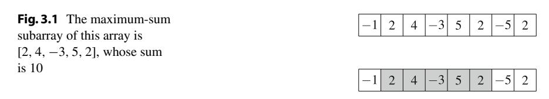

**Giải pháp $O(n^3)$** Một cách trực tiếp để giải bài toán là đi qua tất cả các mảng con có thể, tính tổng giá trị trong mỗi mảng con và duy trì tổng lớn nhất. Code sau cài đặt thuật toán này:

```cpp
int best = 0;
for (int a = 0; a < n; a++) {
 for (int b = a; b < n; b++) {
 int sum = 0;
 for (int k = a; k <= b; k++) {
 sum += array[k];
 }
 best = max(best,sum);
 }
}
cout << best << "\n";
```

Các biến a và b cố định chỉ số đầu tiên và cuối cùng của mảng con, và tổng giá trị được tính vào biến `sum`. Biến `best` chứa tổng lớn nhất tìm thấy trong quá trình tìm kiếm. Độ phức tạp thời gian của thuật toán là $O(n^3)$,vì nó gồm ba vòng lặp lồng nhau đi qua đầu vào.

**Giải pháp $O(n^2)$** Dễ dàng làm cho thuật toán hiệu quả hơn bằng cách loại bỏ một vòng lặp. Điều này có thể bằng cách tính tổng đồng thời khi đầu cuối bên phải của mảng con di chuyển. Kết quả là code sau:

```cpp
int best = 0;
for (int a = 0; a < n; a++) {
 int sum = 0;
 for (int b = a; b < n; b++) {
 sum += array[b];
 best = max(best,sum);
 }
}
cout << best << "\n";
```

Sau thay đổi này, độ phức tạp thời gian là $O(n^2)$.

**Giải pháp O(n)** Hóa ra có thể giải bài toán trong thời gian O(n), điều này có nghĩa là chỉ một vòng lặp là đủ. Ý tưởng là tính, cho mỗi vị trí mảng, tổng lớn nhất của mảng con kết thúc tại vị trí đó. Sau đó, câu trả lời cho bài toán là tổng lớn nhất trong số đó.

Xem xét bài toán con tìm mảng con có tổng lớn nhất kết thúc tại vị trí *k*. Có hai khả năng:

1. Mảng con chỉ chứa phần tử tại vị trí k.
2. Mảng con gồm một mảng con kết thúc tại vị trí k-1, theo sau là phần tử tại vị trí k.

Trong trường hợp sau,vì chúng ta muốn tìm mảng con có tổng lớn nhất, mảng con kết thúc tại vị trí k-1cũngnên có tổng lớn nhất. Do đó, chúng ta có thể giải bài toán hiệu quả bằng cách tính tổng mảng con lớn nhất cho mỗi vị trí kết thúc từ trái sang phải.

Code sau cài đặt thuật toán:

```cpp
int best = 0, sum = 0;
for (int k = 0; k < n; k++) {
 sum = max(array[k], sum+array[k]);
 best = max(best, sum);
}
cout << best << "\n";
```

Thuật toán chỉ chứa một vòng lặp đi qua đầu vào, nên độ phức tạp thời gian là O(n). Đây cũng là độ phức tạp thời gian tốt nhất có thể,vì bất kỳ thuật toán nào cho bài toán đều phải kiểm tra tất cả các phần tử mảng ít nhất một lần.

**So sánh Hiệu suất** Các thuật toán trên hiệu quả như thế nào trong thực tế? Bảng 3.2 cho thấy thời gian chạy của các thuật toán trên cho các giá trị khác nhau của n trên máy tính hiện đại. Trong mỗi kiểm tra, đầu vào được tạo ngẫu nhiên, và thời gian cần để đọc đầu vào không được đo.

So sánh cho thấy tất cả các thuật toán hoạt động nhanh khi kích thước đầu vào nhỏ, nhưng đầu vào lớn hơnmang lại ra sự khác biệt đáng kể trong thời gian chạy. Thuật toán $O(n^3)$ trở nên chậm khi $n = 10^4$, và thuật toán $O(n^2)$ trở nên chậm khi $n = 10^5$. Chỉ có thuật toán O(n) có thể xử lý ngay cả đầu vào lớn nhất ngay lập tức.

| Kích thước mảng n | $O(n^3)$ (s) | $O(n^2)$ (s) | O(n) (s) |
|-------------------|--------------|--------------|----------|
| $10^{2}$ | 0.0 | 0.0 | 0.0 |
| $10^{3}$ | 0.1 | 0.0 | 0.0 |
| $10^{4}$ | >10.0 | 0.1 | 0.0 |
| $10^{5}$ | >10.0 | 5.3 | 0.0 |
| $10^{6}$ | >10.0 | >10.0 | 0.0 |
| $10^{7}$ | >10.0 | >10.0 | 0.0 |

**Bảng 3.2** So sánh thời gian chạy của các thuật toán tổng mảng con lớn nhất

#### 3.2.2 Bài toán Hai Quân hậu

Cho một bàn cờ $n \times n$, bài toán tiếp theo của chúng ta là đếm số cách chúng ta có thể đặt *hai* quân hậu lên bàn cờ sao cho chúng không tấn công nhau. Ví dụ, như Hình 3.2 cho thấy, có tám cách để đặt hai quân hậu lên bàn cờ $3 \times 3$. Ký hiệu q(n) là số tổ hợp hợp lệ cho bàn cờ $n \times n$. Ví dụ, q(3) = 8, và Bảng 3.3 cho thấy các giá trị của q(n) cho $1 \le n \le 10$.

Để bắt đầu, một cách đơn giản để giải bài toán là đi qua tất cả các cách có thể để đặt hai quân hậu lên bàn cờ và đếm các tổ hợp mà quân hậu không tấn công nhau. Thuật toán như vậy hoạt động trong $O(n^4)$ thời gian,vì có $n^2$ cách để chọn vị trí của quân hậu đầu tiên, và cho mỗi vị trí đó, có $n^2 - 1$ cách để chọn vị trí của quân hậu thứ hai.

Vì số tổ hợp tăng nhanh, một thuật toán đếm tổ hợp từng cái một chắc chắn sẽ quá chậm để xử lý các giá trị lớn hơn của n. Do đó, để tạo ra thuật toán hiệu quả, chúng ta cần tìm cách đếm tổ hợp theo nhóm. Một quan sát hữu ích là khá dễ dàng để tính số ô mà một quân hậu tấn công (Hình 3.3). Đầu tiên, nó luôn tấn công n-1 ô theo chiều ngang và n-1 ô theo chiều dọc. Sau đó, cho cả hai đường chéo, nó tấn công d-1 ô trong đó d là số ô trên đường chéo. Sử dụng thông tin này, chúng ta có thể tính trong thời gian O(1) số ô mà quân hậu kia có thể được đặt, cho ra thuật toán thời gian $O(n^2)$.

**Hình 3.2** Tất cả các cách có thể để đặt hai quân hậu không tấn công nhau trên bàn cờ $3 \times 3$

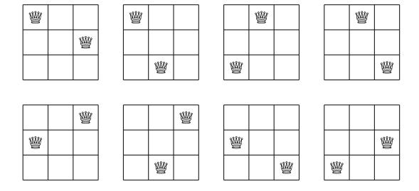

**Bảng 3.3** Các giá trị đầu tiên của hàm q(n): số cách để đặt hai quân hậu không tấn công nhau trên bàn cờ $n \times n$

| Kích thước bàn cờ n | Số cách q(n) |
|---------------------|--------------|
| 1 | 0 |
| 2 | 0 |
| 3 | 8 |
| 4 | 44 |
| 5 | 140 |
| 6 | 340 |
| 7 | 700 |
| 8 | 1288 |
| 9 | 2184 |
| 10 | 3480 |

**Hình 3.3** Quân hậu tấn công tất cả các ô được đánh dấu "\*" trên bàn cờ

**Hình 3.4** Các vị trí có thể cho quân hậu trên hàng và cột cuối cùng

Một cách tiếp cận khác cho bài toán là cố gắng xây dựng một hàm đệ quy đếm số tổ hợp. Câu hỏi là: nếu chúng ta biết giá trị của q(n), làm thế nào chúng ta có thể sử dụng nó để tính giá trị của q(n+1)?

Để có giải pháp đệ quy, chúng ta có thể tập trung vào hàng cuối và cột cuối của bàn cờ $n \times n$ (Hình 3.4). Đầu tiên, nếu không có quân hậu nào trên hàng cuối hoặc cột cuối, số tổ hợp đơn giản là q(n-1). Sau đó, có 2n-1 vị trí cho một quân hậu trên hàng cuối hoặc cột cuối. Nó tấn công 3(n-1) ô, nên có $n^2-3(n-1)-1$ vị trí cho quân hậu kia. Cuối cùng, có (n-1)(n-2) tổ hợp mà cả hai quân hậuđều ở hàng cuối hoặc cột cuối. Vì chúng ta đã đếm những tổ hợp đó hai lần, chúng ta phải loại bỏ số này khỏi kết quả. Bằng cách kết hợp tất cả điều này, chúng ta có được công thức đệ quy

$$q(n) = q(n-1) + (2n-1)(n^2 - 3(n-1) - 1) - (n-1)(n-2)$$

$$= q(n-1) + 2(n-1)^2(n-2),$$

cung cấp giải pháp O(n) cho bài toán.

Cuối cùng, hóa ra cũng có một công thức dạng đóng

$$q(n) = \frac{n^4}{2} - \frac{5n^3}{3} + \frac{3n^2}{2} - \frac{n}{3},$$

có thể được chứng minh bằng cách sử dụng quy nạp và công thức đệ quy. Sử dụng công thức này, chúng ta có thể giải bài toán trong thời gian O(1).

## Chương 4: Sắp xếp và Tìm kiếm

Nhiều thuật toán hiệu quả dựa trên việc sắp xếp dữ liệu đầu vào,vì sắp xếp thường làm cho việc giải bài toán dễ dàng hơn. Chương này thảo luận lý thuyết và thực hành về sắp xếp như một công cụ thiết kế thuật toán.

Phần 4.1 đầu tiên thảo luận ba thuật toán sắp xếp quan trọng: sắp xếp nổi bọt, sắp xếp trộn, và sắp xếp đếm. Sau đó, chúng ta sẽ học cách sử dụng thuật toán sắp xếp có sẵn trong thư viện chuẩn C++.

Phần 4.2 cho thấy cách sắp xếp có thể được sử dụng như một thuật toán con để tạo ra các thuật toán hiệu quả. Ví dụ, để nhanh chóng xác định xem tất cả phần tử mảng có duy nhất hay không, chúng ta có thể đầu tiên sắp xếp mảng và sau đó đơn giản kiểm tra tất cả các cặp phần tử liên tiếp.

Phần 4.3 trình bày thuật toán tìm kiếm nhị phân, là một khối xây dựng quan trọng khác của các thuật toán hiệu quả.

### 4.1 Thuật toán Sắp xếp

Bài toán cơ bản trong sắp xếp như sau: Cho một mảng chứa n phần tử, sắp xếp các phần tử theo thứ tự tăng dần. Ví dụ, Hình 4.1 cho thấy một mảng trước và sau khi sắp xếp.

Trong phần này chúng ta sẽ đi qua một số thuật toán sắp xếp cơ bản và kiểm tra các tính chất của chúng. Dễ dàng thiết kế thuật toán sắp xếp thời gian $O(n^2)$, nhưng cũng có các thuật toán hiệu quả hơn. Sau khi thảo luận lý thuyết về sắp xếp, chúng ta sẽ tập trung vào việc sử dụng sắp xếp trong thực tế trong C++.

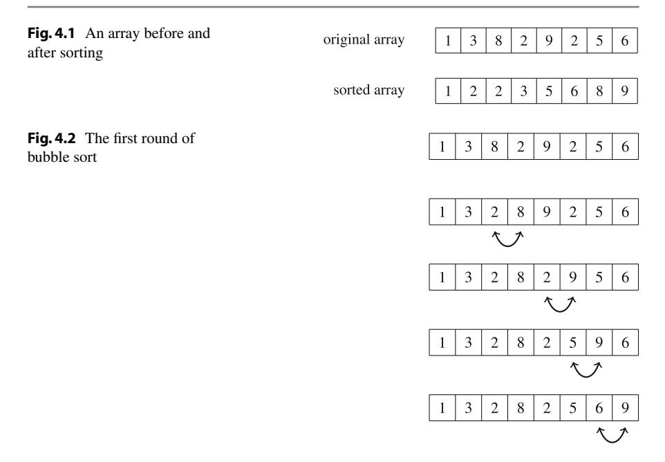

#### 4.1.1 Sắp xếp Nổi bọt

Sắp xếp nổi bọt là một thuật toán sắp xếp đơn giản hoạt động trong thời gian $O(n^2)$. Thuật toán gồm n vòng, và trên mỗi vòng, nó duyệt qua các phần tử của mảng.khi phát hiện hai phần tử liên tiếp sai thứ tự, thuật toán hoán đổi chúng. Thuật toán có thể được cài đặt như sau:

```cpp
for (int i = 0; i < n; i++) {
 for (int j = 0; j < n-1; j++) {
 if (array[j] > array[j+1]) {
 swap(array[j], array[j+1]);
 }
 }
}
```

Sau vòng đầu tiên của sắp xếp nổi bọt, phần tử lớn nhất sẽ ở đúng vị trí, và tổng quát hơn, sau k vòng, k phần tử lớn nhất sẽ ở đúng vị trí. Do đó, sau n vòng, toàn bộ mảng sẽ được sắp xếp.

Ví dụ, Hình 4.2 cho thấy vòng hoán đổi đầu tiên khi sắp xếp nổi bọt được sử dụng để sắp xếp một mảng.

Sắp xếp nổi bọt là một ví dụ về thuật toán sắp xếp luôn hoán đổi các phần tử *liên tiếp* trong mảng. Hóa ra rằng độ phức tạp thời gian của thuật toán như vậy *luôn* ít nhất là $O(n^2}$,vìở trường hợp xấu nhất, $O(n^2)$ hoán đổi được yêu cầu để sắp xếp mảng.

**Đảo ngược** Một khái niệm hữu ích khi phân tích thuật toán sắp xếp là *đảo ngược*: một cặp chỉ số mảng (a, b) sao cho a < b và array[a] > array[b], tức là các phần tử sai thứ tự. Ví dụ, mảng trong Hình 4.3 có ba đảo ngược: (3, 4), (3, 5), và (6, 7).

Số đảo ngược cho biết cần bao nhiêu công việc để sắp xếp mảng. Mảng được sắp xếp hoàn toàn khi không có đảo ngược. Mặt khác, nếu các phần tử mảng đảo ngược thứ tự, số đảo ngược là

$$1 + 2 + \dots + (n-1) = \frac{n(n-1)}{2} = O(n^2),$$

là lớn nhất có thể.

Hoán đổi một cặp phần tử liên tiếp sai thứ tự loại bỏ chính xác một đảo ngược khỏi mảng. Do đó, nếu thuật toán sắp xếp chỉ có thể hoán đổi các phần tử liên tiếp, mỗi hoán đổi loại bỏnhiều nhất một đảo ngược, và độ phức tạp thời gian của thuật toán ít nhất là $O(n^2)$.

#### 4.1.2 Sắp xếp Trộn

Nếu chúng ta muốn tạo ra thuật toán sắp xếp hiệu quả,chúng ta phải có thể sắp xếp lại các phần tử nằm ở các phần khác nhau của mảng. Có một số thuật toán sắp xếp như vậy hoạt động trong $O(n \log n)$ thời gian. Một trong số đó là *sắp xếp trộn*, dựa trên đệ quy. Sắp xếp trộn sắp xếp mảng con $array[a \dots b]$ như sau:

1. Nếu a = b, không làm gì, vì mảng con chỉ chứa một phần tử đã được sắp xếp.
2. Tính vị trí của phần tử giữa: $k = \lfloor (a+b)/2 \rfloor$.
3. Đệ quy sắp xếp mảng con array[a...k].
4. Đệ quy sắp xếp mảng con array[k+1...b].
5. *Trộn* các mảng con đã được sắp xếp array[a...k] và array[k+1...b] thành mảng con đã được sắp xếp array[a...b].

Ví dụ, Hình 4.4 cho thấy cách sắp xếp trộn sắp xếp một mảng gồm tám phần tử. Đầu tiên, thuật toán chia mảng thành hai mảng con bốn phần tử. Sau đó, nó sắp xếp các mảng con này đệ quy bằng cách gọi chính nó. Cuối cùng, nó trộn các mảng con đã được sắp xếp thành một mảng đã được sắp xếp gồm tám phần tử.

Sắp xếp trộn là một thuật toán hiệu quả,vì nó chia đôi kích thước mảng con tại mỗi bước. Sau đó, việc trộn các mảng con đã được sắp xếp có thể thực hiện trong thời gian tuyến tính,vì chúng ta đã được sắp xếp. Vì có $O(\log n)$ cấp đệ quy, và xử lý mỗi cấp mất tổng cộng O(n) thời gian, thuật toán hoạt động trong $O(n \log n)$ thời gian.

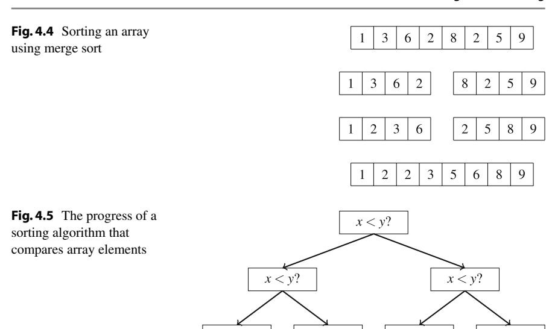

#### 4.1.3 Giới hạn dưới Sắp xếp

Có thể sắp xếp mảng nhanh hơn $O(n \log n)$ thời gian không? Hóa ra điều này *không* possible khichúng ta giới hạn bản thân trong các thuật toán sắp xếp dựa trên so sánh các phần tử mảng.

Giới hạn dưới cho độ phức tạp thời gian có thể được chứng minh bằng cách xem xét sắp xếp như một quá trình mà mỗi so sánh hai phần tử cho thêm thông tin về nội dung của mảng. Hình 4.5 minh họa cây được tạo ra trong quá trình này.

Ở đây "x < y?" có nghĩa làmột số phần tử x và y được so sánh. Nếu x < y, quá trình tiếp tục sang trái, và nếu không sang phải. Kết quả của quá trình là các cách có thể để sắp xếp mảng, tổng cộng n! cách. Vì lý do này, chiều cao của cây phải ít nhất

$$\log_2(n!) = \log_2(1) + \log_2(2) + \dots + \log_2(n).$$

Chúng ta có được giới hạn dưới cho tổng này bằng cách chọn n/2 phần tử cuối và thay đổi giá trị của mỗi phần tử thành $\log_2(n/2)$. Điều này cho ra ước tính

$$\log_2(n!) \ge (n/2) \cdot \log_2(n/2),$$

nên chiều cao của cây và số bước trong trường hợp xấu nhất của thuật toán sắp xếp là $\Omega(n \log n)$.

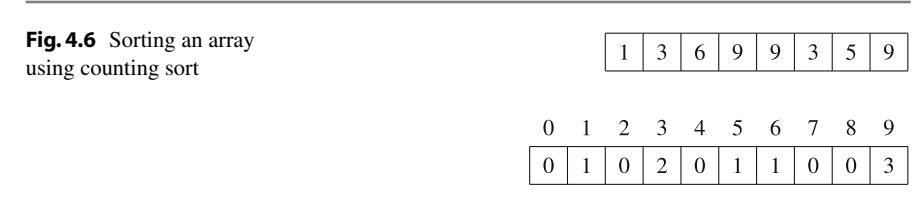

#### 4.1.4 Sắp xếp Đếm

Giới hạn dưới $\Omega(n \log n)$ không áp dụng cho các thuật toán không so sánh các phần tử mảng mà sử dụng một số thông tin khác. Một ví dụ về thuật toán như vậy là *sắp xếp đếm* sắp xếp mảng trong O(n) thời gian giả sử rằng mỗi phần tử trong mảng là một số nguyên giữa $0 \dots c$ và c = O(n).

Thuật toán tạo ra một mảng sổ sách, mà các chỉ số là các phần tử của mảng gốc. Thuật toán duyệt qua mảng gốc và tính số lần mỗi phần tử xuất hiện trong mảng. Ví dụ, Hình 4.6 cho thấy một mảng và mảng sổ sách tương ứng. Ví dụ, giá trị tại vị trí 3 là 2, vì giá trị 3 xuất hiện 2 lần trong mảng gốc.

Việc xây dựng mảng sổ sách mất O(n) thời gian. Sau đó, mảng đã được sắp xếp có thể được tạo ra trong O(n) thời gian,vì số lần xuất hiện của mỗi phần tử có thể được truy xuất từ mảng sổ sách. Do đó, tổng độ phức tạp thời gian của sắp xếp đếm là O(n).

Sắp xếp đếm là một thuật toán rất hiệu quả nhưng nó chỉ có thể được sử dụng khi hằng số c đủ nhỏ, sao cho các phần tử mảng có thể được sử dụng làm chỉ số trong mảng sổ sách.

#### 4.1.5 Sắp xếp trong Thực tế

Trong thực tế,gần như không bao giờ là ý tưởng tốt để cài đặt thuật toán sắp xếp tự làm,vì tất cả các ngôn ngữ lập trình hiện đại đều có các thuật toán sắp xếp tốt trong thư viện chuẩn. Có nhiều lý do để sử dụng hàm thư viện: nó chắc chắn đúng và hiệu quả, và cũng dễ sử dụng.

Trong C++, hàm `sort` sắp xếp<sup>1</sup> nội dung của cấu trúc dữ liệu một cách hiệu quả. Ví dụ, code sau sắp xếp các phần tử của vector theo thứ tự tăng dần:

```cpp
vector<int> v = {4,2,5,3,5,8,3};
sort(v.begin(),v.end());
```

Sau khi sắp xếp, nội dung của vector sẽ là [2, 3, 3, 4, 5, 5, 8]. Thứ tự sắp xếp mặc định là tăng dần, nhưng thứ tự giảm dần có thể như sau:

<sup>1</sup>Chuẩn C++11 yêu cầu rằng hàm sort hoạt động trong $O(n \log n)$ thời gian; cách cài đặt chính xác phụ thuộc vào trình biên dịch.

```cpp
sort(v.rbegin(),v.rend());
```

Một mảng thông thường có thể được sắp xếp như sau:

```cpp
int n = 7; // kích thước mảng
int a[] = {4,2,5,3,5,8,3};
sort(a,a+n);
```

Sau đó, code sau sắp xếp xâu s:

```cpp
string s = "monkey";
sort(s.begin(), s.end());
```

Sắp xếp xâu có nghĩa là các ký tự của xâu được sắp xếp. Ví dụ, xâu "monkey" trở thành "ekmnoy".

**Toán tử so sánh** Hàm `sort` yêu cầu một *toán tử so sánh* được định nghĩa cho kiểu dữ liệu của các phần tử cần sắp xếp. Khi sắp xếp, toán tử này sẽ được sử dụngmỗi khi cần tìm thứ tự của hai phần tử.

Hầu hết các kiểu dữ liệu C++ có toán tử so sánh tích hợp, và các phần tử củanhững kiểu có thể được sắp xếp tự động. Số được sắp xếp theo giá trị của chúng, và xâu được sắp xếp theo thứ tự bảng chữ cái. Cặp được sắp xếp chủ yếu theo phần tử đầu tiên và thứ yếu theo phần tử thứ hai:

```cpp
vector<pair<int,int>> v;
v.push_back({1,5});
v.push_back({2,3});
v.push_back({1,2});
sort(v.begin(), v.end());
// kết quả: [(1,2),(1,5),(2,3)]
```

Tương tự, tuple được sắp xếp chủ yếu bởi phần tử đầu tiên, thứ yếu bởi phần tử thứ hai, v.v.<sup>2</sup>:

```cpp
vector<tuple<int,int,int>> v;
v.push_back({2,1,4});
v.push_back({1,5,3});
v.push_back({2,1,3});
sort(v.begin(), v.end());
// kết quả: [(1,5,3),(2,1,3),(2,1,4)]
```

Các struct do người dùng tự định nghĩa không có toán tử so sánh tự động. Toán tửnên được định nghĩa bên trong struct dưới dạng hàm `operator<`, mà tham số

<sup>2</sup>Lưu ý rằng trong một số trình biên dịch cũ hơn, hàm `make_tuple` phải được sử dụng để tạo tuple thay vì dấu ngoặc nhọn (ví dụ, `make_tuple(2,1,4)` thay vì `{2,1,4}`).

là một phần tử khác của cùng kiểu. Toán tửnên trả về `true` nếu phần tử nhỏ hơn tham số, và `false` nếu không.

Ví dụ, struct `point` sau chứa tọa độ x và y của một điểm. Toán tử so sánh được định nghĩa sao cho các điểm được sắp xếp chủ yếu theo tọa độ x và thứ yếu theo tọa độ y.

```cpp
struct point {
 int x, y;
 bool operator<(const point &p) {
 if (x == p.x) return y < p.y;
 else return x < p.x;
 }
};
```

**Hàm so sánh** Cũng có thể đưa một *hàm so sánh* bên ngoài cho hàm `sort` dưới dạng hàm callback. Ví dụ, hàm so sánh `comp` sau sắp xếp xâu chủ yếu theo độ dài và thứ yếu theo thứ tự bảng chữ cái:

```cpp
bool comp(string a, string b) {
 if (a.size() == b.size()) return a < b;
 else return a.size() < b.size();
}
```

Bây giờ một vector xâu có thể được sắp xếp như sau:

```cpp
sort(v.begin(), v.end(), comp);
```

### 4.2 Giải bài toán bằng Sắp xếp

Thường thì, chúng ta có thể dễ dàng giải bài toán trong $O(n^2)$ thời gian sử dụng thuật toán brute force, nhưng thuật toán như vậy quá chậm nếu kích thước đầu vào lớn. Thực tế, một mục tiêu thường xuyên trong thiết kế thuật toán là tìm thuật toán O(n) hoặc $O(n \log n)$ thời gian cho các bài toán có thể được giải tầm thường trong $O(n^2)$ thời gian. Sắp xếp là một cách để đạt được mục tiêu này.

Ví dụ, giả sử chúng ta muốn kiểm tra xem tất cả phần tử trong mảng có duy nhất hay không. Một thuật toán brute force đi qua tất cả các cặp phần tử trong $O(n^2)$ thời gian:

```cpp
bool ok = true;
for (int i = 0; i < n; i++) {
 for (int j = i+1; j < n; j++) {
 if (array[i] == array[j]) ok = false;
 }
}
```

Tuy nhiên, chúng ta có thể giải bài toán trong $O(n \log n)$ thời gian bằng cách đầu tiên sắp xếp mảng. Sau đó, nếu có các phần tử bằng nhau, chúng nằm cạnh nhau trong mảng đã được sắp xếp, nên dễ tìm trong O(n) thời gian:

```cpp
bool ok = true;
sort(array, array+n);
for (int i = 0; i < n-1; i++) {
 if (array[i] == array[i+1]) ok = false;
}
```

Một số bài toán khác có thể được giải theo cách tương tự trong $O(n \log n)$ thời gian, chẳng hạn như đếm số phần tử khác nhau, tìm phần tử xuất hiện nhiều nhất, và tìm hai phần tử có hiệu nhỏ nhất.

#### 4.2.1 Thuật toán Đường quét

Thuật toán *đường quét* mô hình hóa bài toán dưới dạng một tập hợp các sự kiện được xử lý theo thứ tự đã sắp xếp. Ví dụ, giả sử có một nhà hàng và chúng ta biết thời gian đến và rời đi của tất cả khách hàng vào một ngày nhất định. Nhiệm vụ của chúng ta là tìm ra số lượng khách hàng tối đacùng lúc visited nhà hàng cùng một lúc.

Ví dụ, Hình 4.7 cho thấy một instance của bài toán mà có bốn khách hàng A, B, C, và D. Trong trường hợp này, số lượng khách hàngcùng lúc tối đa là ba giữa thời điểm A đến và B rời đi.

Để giải bài toán, chúng ta tạo hai sự kiện cho mỗi khách hàng: một sự kiện cho đến và một sự kiện cho rời đi. Sau đó, chúng ta sắp xếp các sự kiện và đi qua chúng theo thời gian. Để tìm số lượng khách hàng tối đa, chúng ta duy trì một bộ đếm mà giá trị tăng khi khách hàng đến và giảm khi khách hàng rời đi. Giá trị lớn nhất của bộ đếm là câu trả lời cho bài toán.

Hình 4.8 cho thấy các sự kiện trong ví dụ của chúng ta. Mỗi khách hàng được gán hai sự kiện: "+" biểu thị khách hàng đến và "-" biểu thị khách hàng rời đi. Thuật toán kết quả hoạt động trong $O(n \log n)$ thời gian,vì sắp xếp các sự kiện mất $O(n \log n)$ thời gian và phần đường quét mất O(n) thời gian.

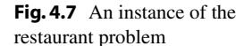

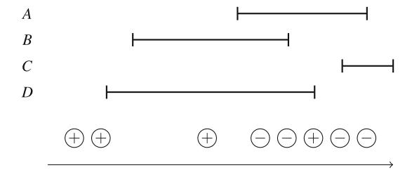

**Hình 4.8** Giải bài toán nhà hàng sử dụng thuật toán đường quét

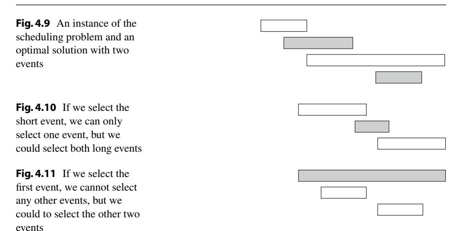

#### 4.2.2 Lập lịch Sự kiện

Nhiều bài toán lập lịch có thể được giải bằng cách sắp xếp dữ liệu đầu vào và sau đó sử dụng chiến lược *tham lam* để xây dựng giải pháp. Thuật toán tham lam luôn đưa ra lựa chọntrông tốt nhất tại thời điểm đó và không bao giờ rút lại lựa chọn của mình.

Ví dụ, xem xét bài toán sau: Cho *n* sự kiện với thời gian bắt đầu và kết thúc, tìm một lịch trìnhchứa càng nhiều sự kiện càng tốt. Ví dụ, Hình 4.9 cho thấy một instance của bài toán mà giải pháp tối ưu là chọn hai sự kiện.

Trong bài toán này, có several cách chúng ta có thể sắp xếp dữ liệu đầu vào. Một chiến lược là sắp xếp các sự kiện theo *độ dài* của chúng và chọn các sự kiện *ngắn* nhất có thể. Tuy nhiên, chiến lược này không phải lúc nào cũng hoạt động, như được chỉ ra trong Hình 4.10. Sau đó, một ý tưởng khác là sắp xếp các sự kiện theo *thời gian bắt đầu* của chúng và luôn chọn sự kiện tiếp theo có thể *bắt đầu* *sớm* nhất. Tuy nhiên, chúng ta có thể tìm thấy phảnví dụ cho chiến lược này, được chỉ ra trong Hình 4.11.

Ý tưởng thứ ba là sắp xếp các sự kiện theo *thời gian kết thúc* của chúng và luôn chọn sự kiện tiếp theo có thể *kết thúc* *sớm* nhất. Hóa ra thuật toán này *luôn* tạo ra giải pháp tối ưu. Đểchứng minh điều này, xem xét điều gì xảy ra nếu chúng ta đầu tiên chọn một sự kiện kết thúc muộn hơn sự kiện kết thúc sớm nhất. Bây giờ, chúng ta sẽ cónhiều nhất cùng số lượng lựa chọn còn lại làm thế nào chúng ta có thể chọn sự kiện tiếp theo. Do đó, chọn một sự kiện kết thúc muộn không bao giờ có thể cho ra giải pháp tốt hơn, và thuật toán tham lam là đúng.

#### 4.2.3 Công việc và Thời hạn

Cuối cùng, xem xét bài toán mà chúng ta được cho n công việc với thời lượng và thời hạn và nhiệm vụ của chúng ta là chọn thứ tự thực hiện công việc. Đối với mỗi công việc, chúng tađạt được d-x điểm trong đó d là thời hạn của công việc và x là thời điểm chúng ta hoàn thành công việc. Tổng điểm lớn nhất có thể mà chúng ta có thể đạt được là gì?

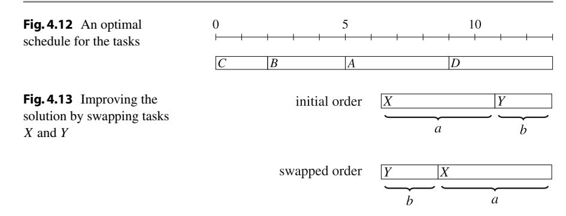

Ví dụ, giả sử các công việc như sau:

| Công việc | Thời lượng | Thời hạn |
|-----------|-----------|----------|
| A | 4 | 2 |
| B | 3 | 10 |
| C | 2 | 8 |
| D | 4 | 15 |

Hình 4.12 cho thấy một lịch trình tối ưu cho các công việc trong ví dụ của chúng ta. Sử dụng lịch trình này, C cho 6 điểm, B cho 5 điểm, A cho -7 điểm, và D cho 2 điểm, nên tổng điểm là 6.

Hóa ra rằng giải pháp tối ưu cho bài toán không phụ thuộc vào thời hạn, nhưng chiến lược tham lam đúng là đơn giản thực hiện các công việc *đã sắp xếp* theo thời lượng tăng dần. Lý do cho điều này lànếu chúng ta ever thực hiện hai công việc liên tiếp mà công việc đầu tiên mất nhiều thời gian hơn công việc thứ hai, chúng ta có thể có được giải pháp tốt hơn nếu chúng ta hoán đổi các công việc.

Ví dụ, trong Hình 4.13, có hai công việc X và Y với thời lượng a và b. Ban đầu, X được lên lịch trước Y. Tuy nhiên, vì a > b, các công việcnên được hoán đổi. Bây giờ X cho ít hơn b điểm và Y cho nhiều hơn a điểm, nên tổng điểm tăng a - b > 0. Do đó, trong giải pháp tối ưu, công việc ngắn hơn phải luôn đến trước công việc dài hơn, và các công việc phải được sắp xếp theo thời lượng của chúng.

### 4.3 Tìm kiếm Nhị phân

Tìm kiếm nhị phân là thuật toán thời gian $O(\log n)$ có thể được sử dụng, ví dụ, để kiểm tra hiệu quả xem mảng đã sắp xếp có chứa một phần tử cho trước hay không. Trong phần này, chúng ta đầu tiên tập trung vào cài đặt tìm kiếm nhị phân, và sau đó, chúng ta sẽ thấy cách tìm kiếm nhị phân có thể được sử dụng để tìm giải pháp tối ưu cho bài toán.

**Hình 4.14** Cách truyền thống để cài đặt tìm kiếm nhị phân. Tại mỗi bước chúng ta kiểm tra phần tử giữa của mảng con đang hoạt động và tiến đến phần trái hoặc phải

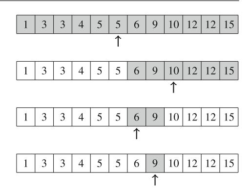

#### 4.3.1 Cài đặt Tìm kiếm

Giả sử chúng ta được cho một mảng đã sắp xếp gồm n phần tử và chúng ta muốn kiểm tra xem mảng có chứa phần tử với giá trị mục tiêu x hay không. Tiếp theo chúng ta thảo luận hai cách để cài đặt thuật toán tìm kiếm nhị phân cho bài toán này.

**Phương pháp thứ nhất** Cách phổ biến nhất để cài đặt tìm kiếm nhị phân giống như tìm kiếm một từ trong từ điển.<sup>3</sup> Tìm kiếm duy trì một mảng con đang hoạt động trong mảng, ban đầu chứa tất cả các phần tử mảng. Sau đó, một số bước được thực hiện, mỗi bước chia đôi phạm vi tìm kiếm. Tại mỗi bước, tìm kiếm kiểm tra phần tử giữa của mảng con đang hoạt động. Nếu phần tử giữa có giá trị mục tiêu, tìm kiếm kết thúc. Nếu không, tìm kiếm đệ quy tiếp tục đến nửa trái hoặc phải của mảng con, tùy thuộc vào giá trị của phần tử giữa. Ví dụ, Hình 4.14 cho thấy cách một phần tử có giá trị 9 được tìm thấy trong mảng.

Tìm kiếm có thể được cài đặt như sau:

```cpp
int a = 0, b = n-1;
while (a <= b) {
 int k = (a+b)/2;
 if (array[k] == x) {
 // x được tìm thấy tại chỉ số k
 }
 if (array[k] < x) a = k+1;
 else b = k-1;
}
```

Trong cài đặt này, phạm vi của mảng con đang hoạt động là $a \dots b$, và phạm vi ban đầu là $0 \dots n-1$. Thuật toán chia đôi kích thước mảng con tại mỗi bước, nên độ phức tạp thời gian là $O(\log n)$.

<sup>3</sup>Một số người, bao gồm cả tác giả của cuốn sách này, vẫn sử dụng từ điển in. Một ví dụ khác là tìm số điện thoại trong danh bạ điện thoại in, điều này còn lỗi thời hơn.

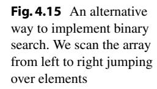

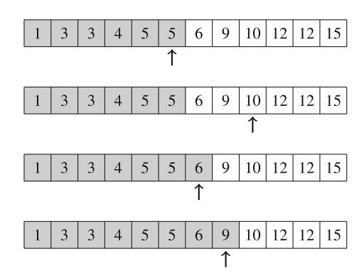

**Phương pháp thứ hai** Một cách khác để cài đặt tìm kiếm nhị phân là đi qua mảng từ trái sang phải thực hiện *các bước nhảy*. Độ dài bước nhảy ban đầu là n/2, và độ dài bước nhảy được chia đôi trên mỗi vòng: đầu tiên n/4, sau đó n/8, sau đó n/16, v.v., cho đến cuối cùng độ dài là 1. Trên mỗi vòng, chúng ta thực hiện các bước nhảy cho đến khichúng ta sẽ kết thúc bên ngoài mảng hoặc trong một phần tử mà giá trị vượt quá giá trị mục tiêu. Sau các bước nhảy,hoặc phần tử mong muốn đã được tìm thấy hoặc chúng ta biết rằng nó không xuất hiện trong mảng. Hình 4.15 minh họa kỹ thuật trong ví dụ của chúng ta.

Code sau cài đặt tìm kiếm:

```cpp
int k = 0;
for (int b = n/2; b >= 1; b /= 2) {
 while (k+b < n && array[k+b] <= x) k += b;
}
if (array[k] == x) {
 // x được tìm thấy tại chỉ số k
}
```

Trong quá trình tìm kiếm, biến b chứa độ dài bước nhảy hiện tại. Độ phức tạp thời gian của thuật toán là $O(\log n)$, vì code trong vòng lặp while được thực hiệnnhiều nhất hai lần cho mỗi độ dài bước nhảy.

#### 4.3.2 Tìm Nghiệm Tối ưu

Giả sử chúng ta đang giải bài toán và có hàm `valid(x)` trả về `true` nếu x là nghiệm hợp lệ và `false` nếu không. Ngoài ra, chúng ta biết rằng `valid(x)` là `false` khi x < k và `true` khi $x \ge k$. Trong tình huống này, chúng ta có thể sử dụng tìm kiếm nhị phân để tìm hiệu quả giá trị của k.

Ý tưởng là tìm kiếm nhị phân cho giá trị lớn nhất của x mà `valid(x)` là `false`. Do đó, giá trị tiếp theo k = x + 1 là giá trị nhỏ nhất có thể mà `valid(k)` là `true`. Tìm kiếm có thể được cài đặt như sau:


4.3 Binary Search 49

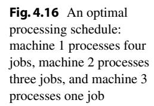

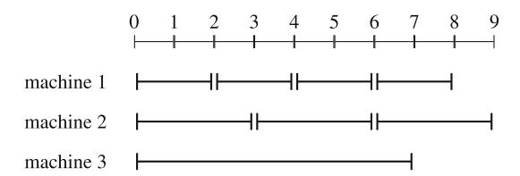

```cpp
int x = -1;
for (int b = z; b >= 1; b /= 2) {
 while (!valid(x+b)) x += b;
}
int k = x+1;
```

Độ dài bước nhảy ban đầu z phải là một giới hạn trên cho câu trả lời, tức là bất kỳ giá trị nào màchúng ta chắc chắn biết rằng `valid(z)` là `true`. Thuật toán gọi hàm `valid` $O(\log z)$ lần, nên thời gian chạy phụ thuộc vào hàm `valid`. Ví dụ, nếu hàm hoạt động trong O(n) thời gian, thời gian chạy là $O(n \log z)$.

**Ví dụ** Xem xét bài toán mà nhiệm vụ của chúng ta là xử lý k công việc sử dụng n máy. Mỗi máy i được gán một số nguyên $p_i$: thời gian để xử lý một công việc. Thời gian tối thiểu để xử lý tất cả công việc là gì?

Ví dụ, giả sử k = 8, n = 3 và thời gian xử lý là $p_1 = 2$, $p_2 = 3$, và $p_3 = 7$. Trong trường hợp này, tổng thời gian xử lý tối thiểu là 9, bằng cách theo lịch trình trong Hình 4.16.

Đặt `valid(x)` là hàm tìm ra xem có thể xử lý tất cả công việc sử dụngnhiều nhất x đơn vị thời gian hay không. Trong ví dụ của chúng ta, rõ ràng `valid(9)` là `true`,vì chúng ta có thể theo lịch trình trong Hình 4.16. Mặt khác, `valid(8)` phải là `false`,vì thời gian xử lý tối thiểu là 9.

Tính giá trị của `valid(x)` dễ dàng,vì mỗi máy i có thể xử lýnhiều nhất $\lfloor x/p_i \rfloor$ công việc trong x đơn vị thời gian. Do đó, nếu tổng tất cả giá trị $\lfloor x/p_i \rfloor$ là k hoặc nhiều hơn, x là nghiệm hợp lệ. Sau đó, chúng ta có thể sử dụng tìm kiếm nhị phân để tìm giá trị tối thiểu của x mà `valid(x)` là `true`.

Thuật toán kết quả hiệu quả như thế nào? Hàm `valid` mất O(n) thời gian, nên thuật toán hoạt động trong $O(n \log z)$ thời gian, trong đó z là giới hạn trên cho câu trả lời. Một giá trị có thể cho z là $kp_1$ tương ứng với giải pháp mà chỉ máy đầu tiên được sử dụng để xử lý tất cả công việc. Đây chắc chắn là giới hạn trên hợp lệ.

## Chương 5: Cấu trúc Dữ liệu

Chương này giới thiệu các cấu trúc dữ liệu quan trọng nhất của thư viện chuẩn C++. Trong lập trình thi đấu, điều crucial là biếtnhững nào cấu trúc dữ liệu có sẵn trong thư viện chuẩn và cách sử dụng chúng. Điều này thường tiết kiệm một lượng lớn thời gian khi cài đặt thuật toán.

Phần 5.1 đầu tiên mô tả cấu trúc vector là một mảng động hiệu quả. Sau đó, chúng ta sẽ tập trung vào việc sử dụng iterator và range với cấu trúc dữ liệu, và thảo luận ngắn gọn về deque, stack, và queue.

Phần 5.2 thảo luận set, map và priority queue. Các cấu trúc dữ liệu đó thường được sử dụng như khối xây dựng của thuật toán hiệu quả,vì chúng ta cho phép chúng ta duy trì các cấu trúc động hỗ trợ cả tìm kiếm hiệu quả và cập nhật.

Phần 5.3 cho thấy một số kết quả về hiệu suất của cấu trúc dữ liệu trong thực tế. Như chúng ta sẽ thấy, có những khác biệt hiệu suất quan trọng không thể được phát hiện chỉ bằng cách nhìn vào độ phức tạp thời gian.

### 5.1 Mảng Động

Trong C++, mảng thông thường là cấu trúc kích thước cố định, và không thể thay đổi kích thước của mảng sau khi tạo nó. Ví dụ, code sau tạo một mảng chứa n giá trị nguyên:

```cpp
int array[n];
```

*Mảng động* là một mảng mà kích thước có thể được thay đổi trong quá trình thực thi chương trình. Thư viện chuẩn C++ cung cấp several mảng động, hữu ích nhất trong số đó là cấu trúc vector.

#### 5.1.1 Vector

*Vector* là một mảng động cho phép chúng ta thêm và xóa hiệu quả các phần tử ở cuối cấu trúc. Ví dụ, code sau tạo một vector rỗng và thêm ba phần tử vào nó:

```cpp
vector<int> v;
v.push_back(3); // [3]
v.push_back(2); // [3,2]
v.push_back(5); // [3,2,5]
```

Sau đó, các phần tử có thể được truy cập như trong mảng thông thường:

```cpp
cout << v[0] << "\n"; // 3
cout << v[1] << "\n"; // 2
cout << v[2] << "\n"; // 5
```

Một cách khác để tạo vector là đưa ra danh sách các phần tử của nó:

```cpp
vector<int> v = {2,4,2,5,1};
```

Chúng ta cũng có thể đưa ra số lượng phần tử và giá trị ban đầu của chúng:

```cpp
vector<int> a(8); // kích thước 8, giá trị ban đầu 0
vector<int> b(8,2); // kích thước 8, giá trị ban đầu 2
```

Hàm `size` trả về số lượng phần tử trong vector. Ví dụ, code sau duyệt qua vector và in các phần tử của nó:

```cpp
for (int i = 0; i < v.size(); i++) {
 cout << v[i] << "\n";
}
```

M cách ngắn hơn để duyệt qua vector là như sau:

```cpp
for (auto x : v) {
 cout << x << "\n";
}
```

Hàm `back` trả về phần tử cuối cùng của vector, và hàm `pop_back` xóa phần tử cuối cùng:

```cpp
vector<int> v = {2,4,2,5,1};
cout << v.back() << "\n"; // 1
v.pop_back();
cout << v.back() << "\n"; // 5
```

Vector được cài đặt sao cho các phép toán `push_back` và `pop_back` hoạt động trong O(1) thời gian trung bình. Trong thực tế, sử dụng vectorgần như nhanh như sử dụng mảng thông thường.

#### 5.1.2 Iterator và Range

*Iterator* là một biến trỏ đến một phần tử của cấu trúc dữ liệu. Iterator `begin` trỏ đến phần tử đầu tiên của cấu trúc dữ liệu, và iterator `end` trỏ đến vị trí *sau* phần tử cuối cùng. Ví dụ, tình huống có thể trông như sau trong vector v gồm tám phần tử:

```
[5,2,3,1,2,5,7,1]
 begin() end()
```

Lưu ý sự bất đối xứng trong các iterator: `begin()` trỏ đến một phần tử trong cấu trúc dữ liệu, trong khi `end()` trỏ *ra ngoài* cấu trúc dữ liệu.

*Range* là một chuỗi các phần tử liên tiếp trong cấu trúc dữ liệu. Cách thông thường để chỉ định range là đưa ra iterator cho phần tử đầu tiên và vị trí sau phần tử cuối cùng. Đặc biệt, các iterator `begin()` và `end()` định nghĩa một range chứa tất cả phần tử trong cấu trúc dữ liệu.

Các hàm thư viện chuẩn C++ thường hoạt động với range. Ví dụ, code sau đầu tiên sắp xếp vector, sau đó đảo ngược thứ tự các phần tử, và cuối cùng xáo trộn các phần tử.

```cpp
sort(v.begin(),v.end());
reverse(v.begin(),v.end());
random_shuffle(v.begin(),v.end());
```

Phần tử mà iterator trỏ đến có thể được truy cập sử dụng cú pháp `*`. Ví dụ, code sau in phần tử đầu tiên của vector:

```cpp
cout << *v.begin() << "\n";
```

Để đưa ra một ví dụ hữu ích hơn, `lower_bound` cho một iterator đến phần tử đầu tiên trong range đã sắp xếp mà giá trị *ít nhất* x, và `upper_bound` cho một iterator đến phần tử đầu tiên mà giá trị *lớn hơn* x:

```cpp
vector<int> v = {2,3,3,5,7,8,8,8};
auto a = lower_bound(v.begin(),v.end(),5);
auto b = upper_bound(v.begin(),v.end(),5);
cout << *a << " " << *b << "\n"; // 5 7
```

Lưu ý rằng các hàm trên chỉ hoạt động đúng khi range cho trước được sắp xếp. Các hàm sử dụng tìm kiếm nhị phân và tìm phần tử được yêu cầu trong thời gian logarithm.


Nếu không có phần tử như vậy, các hàm trả về một iterator đến phần tử sau phần tử cuối cùng trong range.

Thư viện chuẩn C++ chứa một số lượng lớn các hàm hữu íchđáng khám phá. Ví dụ, code sau tạo một vector chứa các phần tử duy nhất của vector gốc theo thứ tự đã sắp xếp:

```cpp
sort(v.begin(),v.end());
v.erase(unique(v.begin(),v.end()),v.end());
```

#### 5.1.3 Các cấu trúc khác

*Deque* là một mảng động có thể được thao tác hiệu quả ở cả hai đầu của cấu trúc. Giống như vector, deque cung cấp các hàm `push_back` và `pop_back`, nhưng nó cũng cung cấp các hàm `push_front` và `pop_front` mà không có sẵn trong vector. Deque có thể được sử dụng như sau:

```cpp
deque<int> d;
d.push_back(5); // [5]
d.push_back(2); // [5,2]
d.push_front(3); // [3,5,2]
d.pop_back(); // [3,5]
d.pop_front(); // [5]
```

Các phép toán của deque cũng hoạt động trong O(1) thời gian trung bình. Tuy nhiên, deque có các hệ số hằng số lớn hơn vector, nên deque chỉ nên được sử dụng nếu có nhu cầu thao tác cả hai đầu của mảng.

C++ cũng cung cấp hai cấu trúc dữ liệu chuyên biệt mà, theo mặc định, dựa trên deque. *Stack* có các hàm `push` và `pop` để chèn và xóa phần tử ở cuối cấu trúc và hàm `top` truy xuất phần tử cuối cùng:

```cpp
stack<int> s;
s.push(2); // [2]
s.push(5); // [2,5]
cout << s.top() << "\n"; // 5
s.pop(); // [2]
cout << s.top() << "\n"; // 2
```

Sau đó, trong *queue*, các phần tử được chèn vào cuối cấu trúc và xóa khỏi đầu cấu trúc. Cả hai hàm `front` và `back` được cung cấp để truy cập phần tử đầu tiên và cuối cùng.

```cpp
queue<int> q;
q.push(2); // [2]
q.push(5); // [2,5]
cout << q.front() << "\n"; // 2
q.pop(); // [5]
cout << q.back() << "\n"; // 5
```

### 5.2 Cấu trúc Tập hợp

*Set* là một cấu trúc dữ liệu duy trì một bộ sưu tập phần tử. Các phép toán cơ bản của set là chèn phần tử, tìm kiếm, và xóa. Set được cài đặt sao cho tất cả các phép toán trên đều hiệu quả, điều này thường cho phép chúng ta cải thiện thời gian chạy của thuật toán sử dụng set.

#### 5.2.1 Set và Multiset

Thư viện chuẩn C++ chứa hai cấu trúc set:

- `set` dựa trên cây tìm kiếm nhị phân cân bằng và các phép toán hoạt động trong O(log n) thời gian.
- `unordered_set` dựa trên bảng băm và các phép toán hoạt động, trung bình,<sup>1</sup> trong O(1) thời gian.

Cả hai cấu trúc đều hiệu quả, và thường có thể sử dụng một trong hai. Vì chúng được sử dụng theo cùng cách, chúng ta tập trung vào cấu trúc `set` trong các ví dụ sau.

Code sau tạo một `set` chứa số nguyên và cho thấy một số phép toán của nó. Hàm `insert` thêm một phần tử vào set, hàm `count` trả về số lần xuất hiện của phần tử trong set, và hàm `erase` xóa một phần tử khỏi set.

<sup>1</sup>Độ phức tạp thời gian trường hợp xấu nhất của các phép toán là O(n), nhưng điều này rất khó xảy ra.


```cpp
set<int> s;
s.insert(3);
s.insert(2);
s.insert(5);
cout << s.count(3) << "\n"; // 1
cout << s.count(4) << "\n"; // 0
s.erase(3);
s.insert(4);
cout << s.count(3) << "\n"; // 0
cout << s.count(4) << "\n"; // 1
```

Một tính chất quan trọng của set là tất cả các phần tử của chúng là *phân biệt*. Do đó, hàm `count` luôn trả vềhoặc 0 (phần tử không có trong set) hoặc 1 (phần tử có trong set), và hàm `insert` không bao giờ thêm phần tử vào set nếu nó đã ở đó. Code sau minh họa điều này:

```cpp
set<int> s;
s.insert(3);
s.insert(3);
s.insert(3);
cout << s.count(3) << "\n"; // 1
```

Set có thể được sử dụngphần lớn giống như vector, nhưng không thể truy cập các phần tử sử dụng ký hiệu `[]`. Code sau in số lượng phần tử trong set và sau đó duyệt qua các phần tử:

```cpp
cout << s.size() << "\n";
for (auto x : s) {
 cout << x << "\n";
}
```

Hàm `find(x)` trả về một iterator trỏ đến phần tử mà giá trị là x. Tuy nhiên, nếu set không chứa x, iterator sẽ là `end()`.

```cpp
auto it = s.find(x);
if (it == s.end()) {
 // x không được tìm thấy
}
```

**Set có thứ tự** Sự khác biệt chính giữa hai cấu trúc set C++ là `set` là *có thứ tự*, trong khi `unordered_set` thì không. Do đó, nếu chúng ta muốn duy trì thứ tự của các phần tử,chúng ta phải sử dụng cấu trúc `set`.

Ví dụ, xem xét bài toán tìm giá trị nhỏ nhất và lớn nhất trong set. Để làm điều này hiệu quả, chúng ta cần sử dụng cấu trúc `set`. Vì các phần tử được sắp xếp, chúng ta có thể tìm giá trị nhỏ nhất và lớn nhất như sau:

```cpp
auto first = s.begin();
auto last = s.end(); last--;
cout << *first << " " << *last << "\n";
```

Lưu ý rằng vì `end()` trỏ đến phần tử sau phần tử cuối cùng,chúng ta phải giảm iterator đi một.

Cấu trúc `set` cũng cung cấp các hàm `lower_bound(x)` và `upper_bound(x)` trả về iterator đến phần tử nhỏ nhất trong set mà giá trị *ít nhất* hoặc *lớn hơn* x, tương ứng. Trong cả hai hàm, nếu phần tử được yêu cầu không tồn tại, giá trị trả về là `end()`.

```cpp
cout << *s.lower_bound(x) << "\n";
cout << *s.upper_bound(x) << "\n";
```

**Multiset** *Multiset* là một set có thể có several bản sao của cùng giá trị. C++ có các cấu trúc `multiset` và `unordered_multiset` tương tự như `set` và `unordered_set`. Ví dụ, code sau thêm ba bản sao của giá trị 5 vào multiset.

```cpp
multiset<int> s;
s.insert(5);
s.insert(5);
s.insert(5);
cout << s.count(5) << "\n"; // 3
```

Hàm `erase` xóa tất cả các bản sao của giá trị khỏi multiset:

```cpp
s.erase(5);
cout << s.count(5) << "\n"; // 0
```

Thường chỉ một giá trịnên được xóa, có thể thực hiện như sau:

```cpp
s.erase(s.find(5));
cout << s.count(5) << "\n"; // 2
```

Lưu ý rằng các hàm `count` và `erase` có thêm hệ số O(k) trong đó k là số phần tử được đếm/xóa. Đặc biệt, *không* hiệu quả để đếm số bản sao của giá trị trong multiset sử dụng hàm `count`.

#### 5.2.2 Map

*Map* là một set gồm các cặp key-value. Map cũng có thể được xem như một mảng tổng quát. Trong khi các key trong mảng thông thường luôn là các số nguyên liên tiếp $0, 1, \ldots, n-1$, trong đó n là kích thước mảng, thì các key trong map có thể thuộc bất kỳ kiểu dữ liệu nào và chúng không phải là các giá trị liên tiếp.

Thư viện chuẩn C++ chứa hai cấu trúc map tương ứng với các cấu trúc set: `map` dựa trên cây tìm kiếm nhị phân cân bằng và truy cập phần tử mất $O(\log n)$ thời gian, trong khi `unordered_map` sử dụng băm và truy cập phần tử mất O(1) thời gian trung bình.

Code sau tạo một map mà key là xâu và value là số nguyên:

```cpp
map<string,int> m;
m["monkey"] = 4;
m["banana"] = 3;
m["harpsichord"] = 9;
cout << m["banana"] << "\n"; // 3
```

Nếu giá trị của key được yêu cầu nhưng map không chứa nó, key tự động được thêm vào map với giá trị mặc định. Ví dụ, trong code sau, key "aybabtu" với giá trị 0 được thêm vào map.

```cpp
map<string,int> m;
cout << m["aybabtu"] << "\n"; // 0
```

Hàm `count` kiểm tra xem key có tồn tại trong map hay không:

```cpp
if (m.count("aybabtu")) {
 // key tồn tại
}
```

Sau đó, code sau in tất cả key và value trong map:

```cpp
for (auto x : m) {
 cout << x.first << " " << x.second << "\n";
}
```

#### 5.2.3 Hàng đợi Ưu tiên

*Hàng đợi Ưu tiên* là một multiset hỗ trợ chèn phần tử và, tùy thuộc vào loại hàng đợi, truy xuất và xóa phần tử nhỏ nhất hoặc lớn nhất. Chèn và xóa mất $O(\log n)$ thời gian, và truy xuất mất O(1) thời gian.

Hàng đợi Ưu tiên thường dựa trên cấu trúc heap, là một cây nhị phân đặc biệt. Trong khi multiset cung cấp tất cả các phép toán của Hàng đợi Ưu tiên và nhiều hơn nữa, lợi ích của việc sử dụng Hàng đợi Ưu tiên là nó có các hệ số hằng số nhỏ hơn. Do đó, nếu chúng ta chỉ cần tìm hiệu quả phần tử nhỏ nhất hoặc lớn nhất, đó là ý tưởng tốt để sử dụng Hàng đợi Ưu tiên thay vì set hoặc multiset.

Theo mặc định, các phần tử trong Hàng đợi Ưu tiên C++ được sắp xếp theo thứ tự giảm dần, và có thể tìm và xóa phần tử lớn nhất trong hàng đợi. Code sau minh họa điều này:

```cpp
priority_queue<int> q;
q.push(3);
q.push(5);
q.push(7);
q.push(2);
cout << q.top() << "\n"; // 7
q.pop();
cout << q.top() << "\n"; // 5
q.pop();
q.push(6);
cout << q.top() << "\n"; // 6
q.pop();
```

Nếu chúng ta muốn tạo Hàng đợi Ưu tiên hỗ trợ tìm và xóa phần tử nhỏ nhất, chúng ta có thể thực hiện như sau:

```cpp
priority_queue<int, vector<int>, greater<int>> q;
```

#### 5.2.4 Policy-Based Sets

Trình biên dịch g++ cũng cung cấp một số cấu trúc dữ liệu không thuộc thư viện chuẩn C++. Các cấu trúc như vậy được gọi là cấu trúc *policy-based*. Để sử dụng các cấu trúc này, các dòng sau phải được thêm vào code:

```cpp
#include <ext/pb_ds/assoc_container.hpp>
using namespace __gnu_pbds;
```

Sau đó, chúng ta có thể định nghĩa cấu trúc dữ liệu `indexed_set` giống như `set` nhưng có thể được đánh chỉ số như mảng. Định nghĩa cho giá trị `int` như sau:

```cpp
typedef tree<int,null_type,less<int>,rb_tree_tag,
 tree_order_statistics_node_update> indexed_set;
```

Sau đó, chúng ta có thể tạo một set như sau:

```cpp
indexed_set s;
s.insert(2);
s.insert(3);
s.insert(7);
s.insert(9);
```

Đặc biệt của set này là chúng ta có quyền truy cập vào các chỉ số mà các phần tử sẽ có trong mảng đã sắp xếp. Hàm `find_by_order` trả về iterator đến phần tử tại vị trí cho trước:

```cpp
auto x = s.find_by_order(2);
cout << *x << "\n"; // 7
```

Sau đó, hàm `order_of_key` trả về vị trí của phần tử cho trước:

```cpp
cout << s.order_of_key(7) << "\n"; // 2
```

Nếu phần tử không xuất hiện trong set, chúng ta có được vị trí mà phần tử sẽ có trong set:

```cpp
cout << s.order_of_key(6) << "\n"; // 2
cout << s.order_of_key(8) << "\n"; // 3
```

Cả hai hàm hoạt động trong thời gian logarithm.

### 5.3 Thí nghiệm

Trong phần này, chúng ta trình bày một số kết quả liên quan đến hiệu suất *thực tế* của các cấu trúc dữ liệu được trình bày trong chương này. Trong khi độ phức tạp thời gian là công cụ tuyệt vời, chúng không phải lúc nào cũng nói lên toàn bộ sự thật về hiệu suất, nênđáng cũng thực hiện thí nghiệm với các cài đặt và tập dữ liệu thực.

#### 5.3.1 Set so với Sắp xếp

Nhiều bài toán có thể được giải sử dụng set hoặc sắp xếp. Điều quan trọng là nhận ra rằng thuật toán sử dụng sắp xếp thường nhanh hơn nhiều, ngay cả khi điều này không evident chỉ bằng cách nhìn vào độ phức tạp thời gian.

Ví dụ, xem xét bài toán tính số phần tử duy nhất trong vector. Một cách để giải bài toán là thêm tất cả phần tử vào set và trả về kích thước của set. Vì không cần duy trì thứ tự của các phần tử, chúng ta có thể sử dụng set hoặc `unordered_set`. Sau đó, một cách khác để giải bài toán là đầu tiên sắp xếp vector và sau đó đi qua các phần tử của nó. Dễ dàng đếm số phần tử duy nhất sau khi sắp xếp vector.

Bảng 5.1 cho thấy kết quả của thí nghiệm mà các thuật toán trên được kiểm tra sử dụng vector ngẫu nhiên của giá trị int. Hóa ra `unordered_set`

**Bảng 5.1** Kết quả của thí nghiệm mà số phần tử duy nhất trong vector được tính. Hai thuật toán đầu tiên chèn các phần tử vào cấu trúc set, trong khi thuật toán cuối cùng sắp xếp vector và kiểm tra các phần tử liên tiếp

| Kích thước đầu vào n | set (s) | unordered_set (s) | Sắp xếp (s) |
|----------------------|---------|-------------------|--------------|
| $10^{6}$ | 0.65 | 0.34 | 0.11 |
| $2 \cdot 10^6$ | 1.50 | 0.76 | 0.18 |
| $4 \cdot 10^6$ | 3.38 | 1.63 | 0.33 |
| $8 \cdot 10^{6}$ | 7.57 | 3.45 | 0.68 |
| $16 \cdot 10^6$ | 17.35 | 7.18 | 1.38 |

**Bảng 5.2** Kết quả của thí nghiệm mà giá trị xuất hiện nhiều nhất trong vector được xác định. Hai thuật toán đầu tiên sử dụng cấu trúc map, và thuật toán cuối cùng sử dụng mảng thông thường

| Kích thước đầu vào n | map (s) | unordered_map (s) | Mảng (s) |
|----------------------|---------|-------------------|----------|
| $10^{6}$ | 0.55 | 0.23 | 0.01 |
| $2 \cdot 10^{6}$ | 1.14 | 0.39 | 0.02 |
| $4 \cdot 10^{6}$ | 2.34 | 0.73 | 0.03 |
| $8 \cdot 10^{6}$ | 4.68 | 1.46 | 0.06 |
| $16 \cdot 10^6$ | 9.57 | 2.83 | 0.11 |

thuật toán nhanh hơn khoảng hai lần so với thuật toán set, và thuật toán sắp xếp nhanh hơn hơn mười lần so với thuật toán set. Lưu ý rằng cả thuật toán set và thuật toán sắp xếp đều hoạt động trong $O(n \log n)$ thời gian; nhưngcái sau nhanh hơn nhiều. Lý do cho điều này là sắp xếp là phép toán đơn giản, trong khi cây tìm kiếm nhị phân cân bằng được sử dụng trong set là cấu trúc dữ liệu phức tạp.

#### 5.3.2 Map so với Mảng

Map là cấu trúc tiện lợi so với mảng,vì bất kỳ chỉ số nào cũng có thể được sử dụng, nhưng chúng cũng có các hệ số hằng số lớn. Trong thí nghiệm tiếp theo, chúng ta tạo một vector gồm n số nguyên ngẫu nhiên giữa 1 và $10^6$ và sau đó xác định giá trị xuất hiện nhiều nhất bằng cách đếm số lần xuất hiện của mỗi phần tử. Đầu tiên chúng ta sử dụng map, nhưng vì giới hạn trên $10^6$ khá nhỏ,chúng ta cũng có thể sử dụng mảng.

Bảng 5.2 cho thấy kết quả của thí nghiệm. Trong khi `unordered_map` nhanh hơn khoảng ba lần so với `map`, thì mảng nhanh hơn gần một trăm lần. Do đó, mảngnên được sử dụng whenever có thể thay vì map. Đặc biệt, lưu ý rằng trong khi `unordered_map` cung cấp các phép toán O(1) thời gian, có các hệ số hằng số lớn bị ẩn trong cấu trúc dữ liệu.

| Kích thước đầu vào n | multiset (s) | priority_queue (s) |
|----------------------|--------------|-------------------|
| $10^{6}$ | 1.17 | 0.19 |
| $2 \cdot 10^{6}$ | 2.77 | 0.41 |
| $4 \cdot 10^{6}$ | 6.10 | 1.05 |
| $8 \cdot 10^{6}$ | 13.96 | 2.52 |
| $16 \cdot 10^6$ | 30.93 | 5.95 |

**Bảng 5.3** Kết quả của thí nghiệm mà các phần tử được thêm và xóa sử dụng multiset và priority queue

#### 5.3.3 Hàng đợi Ưu tiên so với Multiset

Hàng đợi Ưu tiên có thực sự nhanh hơn multiset không? Để tìm hiểu, chúng ta thực hiện thí nghiệm khác mà chúng ta tạo hai vector gồm n số int ngẫu nhiên. Đầu tiên, chúng ta thêm tất cả phần tử của vector đầu tiên vào cấu trúc dữ liệu. Sau đó,chúng ta đi qua vector thứ hai vàliên tục xóa phần tử nhỏ nhất khỏi cấu trúc dữ liệu và thêm phần tử mới vào nó.

Bảng 5.3 cho thấy kết quả của thí nghiệm. Hóa ra trong bài toán này Hàng đợi Ưu tiên nhanh hơn khoảng năm lần so với multiset.

## Chương 6: Quy hoạch Động

Quy hoạch động là kỹ thuật thiết kế thuật toán có thể được sử dụng để tìm giải pháp tối ưu cho bài toán và để đếm số nghiệm. Chương này là giới thiệu về quy hoạch động, và kỹ thuật sẽ được sử dụng nhiều lần sau này trong cuốn sách khi thiết kế thuật toán.

Phần 6.1 thảo luận các yếu tố cơ bản của quy hoạch động trong ngữ cảnh bài toán đổi tiền. Trong bài toán này chúng ta được cho một tập hợp giá trị tiền và nhiệm vụ của chúng ta làxây dựng một số tiền sử dụng ít tiền nhất có thể. Có một thuật toán tham lam đơn giản cho bài toán, nhưng như chúng ta sẽ thấy, nó không phải lúc nào cũng tạo ra giải pháp tối ưu. Tuy nhiên, sử dụng quy hoạch động, chúng ta có thể tạo ra thuật toán hiệu quả luôn tìm thấy giải pháp tối ưu.

Phần 6.2 trình bày một lựa chọn bài toán cho thấy một số khả năng của quy hoạch động. Các bài toán bao gồm xác định dãy con tăng dài nhất trong mảng, tìm đường đi tối ưu trong lưới hai chiều, và tạo tất cả các tổng trọng số có thể trong bài toán cái túi.

### 6.1 Khái niệm Cơ bản

Trong phần này, chúng ta đi qua các khái niệm cơ bản của quy hoạch động trong ngữ cảnh bài toán đổi tiền. Đầu tiên chúng ta trình bày thuật toán tham lam cho bài toán, không phải lúc nào cũng tạo ra giải pháp tối ưu. Sau đó, chúng ta cho thấy cách bài toán có thể được giải hiệu quả sử dụng quy hoạch động.

#### 6.1.1 Khi Tham lam Thất bại

Giả sử chúng ta được cho một tập hợp giá trị tiền coins = $\{c_1, c_2, \dots, c_k\}$ và một số tiền mục tiêu n, và chúng ta được yêu cầu xây dựng số tiền n sử dụng ít tiền nhất có thể. Không cógiới hạn về số lần chúng ta có thể sử dụng mỗi giá trị tiền. Ví dụ, nếu $coins = \{1, 2, 5\}$ và n = 12, giải pháp tối ưu là 5 + 5 + 2 = 12, yêu cầu ba đồng tiền.

Có một thuật toán tham lam tự nhiên để giải bài toán: luôn chọn đồng tiền lớn nhất có thể sao cho tổng giá trị tiền không vượt quá số tiền mục tiêu. Ví dụ, nếu n = 12, chúng ta đầu tiên chọn hai đồng tiền giá trị 5, và sau đó một đồng tiền giá trị 2, hoàn thành giải pháp. Đâytrông như một chiến lược hợp lý, nhưng nó có luôn tối ưu không?

Hóa ra chiến lược này *không* phải lúc nào cũng hoạt động. Ví dụ, nếu coins = $\{1, 3, 4\}$ và n = 6, giải pháp tối ưu chỉ có hai đồng tiền (3 + 3 = 6) nhưng chiến lược tham lam tạo ra giải pháp với ba đồng tiền (4 + 1 + 1 = 6). Phảnví dụ đơn giản này cho thấy thuật toán tham lam là không đúng.<sup>1</sup>

Làm thế nào chúng ta có thể giải bài toán, sau đó? Tất nhiên, chúng ta có thể thử tìm thuật toán tham lam khác, nhưng không có chiến lược rõ ràng nào khác mà chúng ta có thể xem xét. Một khả năng khác là tạo ra thuật toán brute force đi qua tất cả các cách có thể để chọn tiền. Thuật toán như vậy chắc chắn sẽ cho kết quả đúng, nhưng nó sẽ rất chậm trên đầu vào lớn.

Tuy nhiên, sử dụng quy hoạch động, chúng ta có thể tạo ra thuật toángần như giống như thuật toán brute force nhưng nó cũng *hiệu quả*. Do đó, chúng ta có thể cả chắc chắn rằng thuật toán đúng và sử dụng nó để xử lý đầu vào lớn. Hơn nữa, chúng ta có thể sử dụng cùng kỹ thuật để giải quyết một số lượng lớn các bài toán khác.

#### 6.1.2 Tìm Nghiệm Tối ưu

Để sử dụng quy hoạch động,chúng ta nên xây dựng bài toán đệ quy sao cho nghiệm của bài toán có thể được tính từ nghiệm của các bài toán con nhỏ hơn. Trong bài toán tiền, một bài toán đệ quy tự nhiên là tính giá trị của hàm `solve(x)`: số tiền tối thiểu cần thiết để tạo thành tổng x? Rõ ràng, giá trị của hàm phụ thuộc vào giá trị của các đồng tiền. Ví dụ, nếu $coins = \{1, 3, 4\}$, các giá trị đầu tiên của hàm như sau:

```cpp
solve(0) = 0
solve(1) = 1
solve(2) = 2
solve(3) = 1
solve(4) = 1
solve(5) = 2
solve(6) = 2
solve(7) = 2
solve(8) = 2
solve(9) = 3
solve(10) = 3
```

<sup>1</sup>Đây là một câu hỏi thú vị khi nào chính xác thuật toán tham lam hoạt động. Pearson [24] mô tả một thuật toán hiệu quả để kiểm tra điều này.

Ví dụ, solve(10) = 3, vì ít nhất 3 đồng tiền cần thiết để tạo thành tổng 10. Giải pháp tối ưu là 3 + 3 + 4 = 10.

Tính chất thiết yếu của `solve` là giá trị của nó có thể được tính đệ quy từ các giá trị nhỏ hơn. Ý tưởng là tập trung vào *đồng tiền đầu tiên* mà chúng ta chọn cho tổng. Ví dụ, trong kịch bản trên, đồng tiền đầu tiên có thể là 1, 3 hoặc 4. Nếu chúng ta đầu tiên chọn đồng tiền 1, nhiệm vụ còn lại là tạo thành tổng 9 sử dụng số tiền tối thiểu, là bài toán con của bài toán gốc. Tất nhiên, điều tương tự áp dụng cho đồng tiền 3 và 4. Do đó, chúng ta có thể sử dụng công thức đệ quy sau để tính số tiền tối thiểu:

```cpp
solve(x) = min(solve(x - 1) + 1, solve(x - 3) + 1, solve(x - 4) + 1).
```

Trường hợp cơ sở của đệ quy là solve(0) = 0, vì không cần đồng tiền nào để tạo thành tổng rỗng. Ví dụ,

```
solve(10) = solve(7) + 1 = solve(4) + 2 = solve(0) + 3 = 3.
```

Bây giờ chúng ta sẵn sàng đưa ra một hàm đệ quy tổng quát tính số tiền tối thiểu cần thiết để tạo thành tổng x:

$$solve(x) = \begin{cases} \infty & x < 0 \\ 0 & x = 0 \\ \min_{c \in coins} solve(x - c) + 1 & x > 0 \end{cases}$$

Đầu tiên, nếu x < 0, giá trị là vô cực,vì không thể tạo thành tổng âm. Sau đó, nếu x = 0, giá trị là0, vì không cần đồng tiền nào để tạo thành tổng rỗng. Cuối cùng, nếu x > 0, biến c đi qua tất cả các khả năngnhư thế nào chọn đồng tiền đầu tiên của tổng.

Khi đã tìm thấy hàm đệ quy giải bài toán, chúng ta có thể trực tiếp cài đặt giải pháp trong C++ (hằng số INF biểu thị vô cực):

```cpp
int solve(int x) {
 if (x < 0) return INF;
 if (x == 0) return 0;
 int best = INF;
 for (auto c : coins) {
 best = min(best, solve(x-c)+1);
 }
 return best;
}
```

Tuy nhiên, hàm này không hiệu quả, vì có thể có một số lượng lớn cách đểxây dựng tổng và hàm kiểm tra tất cả chúng. May mắn thay, hóa ra có một cách đơn giản để làm cho hàm hiệu quả.

**Ghi nhớ** Ý tưởng chính trong quy hoạch động là *ghi nhớ*, có nghĩa là chúng ta lưu trữ mỗi giá trị hàm trong mảng ngay sau khi tính nó. Sau đó, khi giá trị được cần lại, nó có thể được truy xuất từ mảng mà không cần gọi đệ quy. Để làm điều này, chúng ta tạo mảng

```cpp
bool ready[N];
int value[N];
```

trong đó `ready[x]` cho biết giá trị của `solve(x)` đã được tính chưa, và nếu có, `value[x]` chứa giá trị này. Hằng số N được chọn sao cho tất cả giá trị yêu cầu vừa trong mảng.

Sau đó, hàm có thể được cài đặt hiệu quả như sau:

```cpp
int solve(int x) {
 if (x < 0) return INF;
 if (x == 0) return 0;
 if (ready[x]) return value[x];
 int best = INF;
 for (auto c : coins) {
 best = min(best, solve(x-c)+1);
 }
 ready[x] = true;
 value[x] = best;
 return best;
}
```

Hàm xử lý các trường hợp cơ sở x < 0 và x = 0 như trước. Sau đó nó kiểm tra từ `ready[x]` xem `solve(x)` đã được lưu trữ trong `value[x]` chưa, và nếu có, hàm trực tiếp trả về nó. Nếu không hàm tính giá trị của `solve(x)` đệ quy và lưu trữ nó trong `value[x]`.

Hàm này hoạt động hiệu quả,vì câu trả lời cho mỗi tham số x chỉ được tính đệ quy một lần. Sau khi giá trị của `solve(x)` đã được lưu trữ trong `value[x]`,nó có thể được truy xuất hiệu quảmỗi khi hàm sẽ được gọi lại với tham số x. Độ phức tạp thời gian của thuật toán là O(nk), trong đó n là số tiền mục tiêu và k là số đồng tiền.

**Cài đặt lặp** Lưu ý rằngchúng ta cũng có thể *lặp* xây dựng mảng `value` sử dụng vòng lặp như sau:

```cpp
value[0] = 0;
for (int x = 1; x <= n; x++) {
 value[x] = INF;
 for (auto c : coins) {
 if (x-c >= 0) {
 value[x] = min(value[x], value[x-c]+1);
 }
 }
}
```

Thực tế,hầu hết lập trình viên thi đấu thích cài đặt này,vì nó ngắn hơn và có các hệ số hằng số nhỏ hơn. Từ bây giờ,chúng ta cũng sử dụng cài đặt lặp trong các ví dụ. Tuy nhiên, thường dễ dàng hơn để nghĩ về giải pháp quy hoạch động theo các hàm đệ quy.

**Xây dựng Giải pháp** Đôi khichúng ta được yêu cầu cả tìm giá trị của giải pháp tối ưu và đưa ra ví dụ làm thế nào giải pháp như vậy có thể được xây dựng. Để xây dựng giải pháp tối ưu trong bài toán tiền,chúng ta có thể khai báo một mảng mới cho biết cho mỗi số tiền đồng tiền đầu tiên trong giải pháp tối ưu:

```cpp
int first[N];
```

Sau đó,chúng ta có thể sửa đổi thuật toán như sau:

```cpp
value[0] = 0;
for (int x = 1; x <= n; x++) {
 value[x] = INF;
 for (auto c : coins) {
 if (x-c >= 0 && value[x-c]+1 < value[x]) {
 value[x] = value[x-c]+1;
 first[x] = c;
 }
 }
}
```
}
```cpp
}
```

Sau đó, code sau in các đồng tiền xuất hiện trong giải pháp tối ưu cho tổng n:

```cpp
while (n > 0) {
 cout << first[n] << "\n";
 n -= first[n];
}
```

#### 6.1.3 Đếm Nghiệm

Bây giờ chúng ta xem xét một biến thể khác của bài toán tiền mà nhiệm vụ của chúng ta là tính tổng số cách để tạo ra tổng x sử dụng các đồng tiền. Ví dụ, nếu $coins = \{1, 3, 4\}$ và x = 5, có tổng cộng 6 cách.

Một lần nữa, chúng ta có thể giải bài toán đệ quy. Đặt `solve(x)` là số cách chúng ta có thể tạo thành tổng x. Ví dụ, nếu $coins = \{1, 3, 4\}$, thì solve(5) = 6 và công thức đệ quy là

$$solve(x) = solve(x - 1) + solve(x - 3) + solve(x - 4).$$

Sau đó, hàm đệ quy tổng quát như sau:

$$\operatorname{solve}(x) = \begin{cases} 0 & x < 0 \\ 1 & x = 0 \\ \sum_{c \in \operatorname{coins}} \operatorname{solve}(x - c) & x > 0 \end{cases}$$

Nếu x < 0, giá trị là0, vì không có nghiệm. Nếu x = 0, giá trị là một, vì chỉ có một cách để tạo thành tổng rỗng. Nếu không chúng ta tính tổng tất cả giá trị dạng solve(x - c) trong đó c thuộc coins.

Code sau xây dựng mảng `count` sao cho `count[x]` bằng giá trị của `solve(x)` cho $0 \le x \le n$:

```cpp
count[0] = 1;
for (int x = 1; x <= n; x++) {
 for (auto c : coins) {
 if (x-c >= 0) {
 count[x] += count[x-c];
 }
 }
}
```

Thường số nghiệm quá lớnđến mức không cần tính chính xác số mà chỉ cần đưa ra câu trả lời modulo m trong đó, ví dụ, $m = 10^9 + 7$. Điều này có thể được thực hiện bằng cách thay đổi code sao cho tất cả tính toán được thực hiện modulo m. Trong code trên, chỉ cần thêm dòng

```cpp
count[x] %= m;
```

sau dòng

```cpp
count[x] += count[x-c];
```

### 6.2 Các ví dụ thêm

Sau khi đã thảo luận các khái niệm cơ bản của quy hoạch động,chúng ta bây giờ sẵn sàng đi qua một tập hợp bài toán có thể được giải hiệu quả sử dụng quy hoạch động. Như chúng ta sẽ thấy, quy hoạch động là kỹ thuật linh hoạt cónhiều ứng dụng trong thiết kế thuật toán.

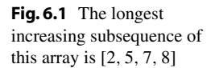

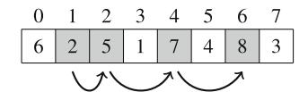

#### 6.2.1 Dãy con Tăng Dài nhất

*Dãy con tăng dài nhất* trong mảng gồm *n* phần tử là một chuỗi có độ dài tối đa các phần tử mảng đi từ trái sang phải, và mỗi phần tử trong chuỗi lớn hơn phần tử trước đó. Ví dụ, Hình 6.1 cho thấy dãy con tăng dài nhất trong mảng gồm tám phần tử.

Chúng ta có thể tìm hiệu quả dãy con tăng dài nhất trong mảng sử dụng quy hoạch động. Đặt `length(k)` là độ dài của dãy con tăng dài nhất kết thúc tại vị trí k. Sau đó,nếu chúng ta tính tất cả giá trị của `length(k)` trong đó $0 \le k \le n-1$,chúng ta sẽphát hiện độ dài của dãy con tăng dài nhất. Giá trị của hàm cho mảng ví dụ của chúng ta như sau:

```
length(0) = 1
length(1) = 1
length(2) = 2
length(3) = 1
length(4) = 3
length(5) = 2
length(6) = 4
length(7) = 2
```

Ví dụ, length(6) = 4,vì dãy con tăng dài nhất kết thúc tại vị trí 6 gồm 4 phần tử.

Để tính giá trị của length(k),chúng ta nên tìm vị trí i < k sao cho array[i] < array[k] và length(i) lớn nhất có thể. Sau đó chúng ta biết rằng length(k) = length(i) + 1,vì đây là cách tối ưu để thêm array[k] vào dãy con. Tuy nhiên, nếu không có vị trí i như vậy, thì length(k) = 1, có nghĩa là dãy con chỉ chứa array[k].

Vì tất cả giá trị của hàm có thể được tính từ các giá trị nhỏ hơn,chúng ta có thể sử dụng quy hoạch động để tính các giá trị. Trong code sau, giá trị của hàm sẽ được lưu trữ trong mảng `length`.

```cpp
for (int k = 0; k < n; k++) {
 length[k] = 1;
 for (int i = 0; i < k; i++) {
 if (array[i] < array[k]) {
 length[k] = max(length[k],length[i]+1);
 }
 }
}
```

Thuật toán kết quả rõ ràng hoạt động trong $O(n^2)$ thời gian.<sup>2</sup>

#### 6.2.2 Đường đi trong Lưới

Bài toán tiếp theo của chúng ta là tìm đường đi từ góc trên bên trái đến góc dưới bên phải của lưới $n \times n$, vớigiới hạn rằngchúng ta chỉ có thể di chuyển xuống và phải. Mỗi ô chứa một số nguyên, và đường đinên được xây dựng sao cho tổng các giá trị dọc theo đường đi lớn nhất có thể.

Ví dụ, Hình 6.2 cho thấy đường đi tối ưu trong lưới $5 \times 5$. Tổng các giá trị trên đường đi là 67, và đây là tổng lớn nhất có thể trên đường đi từ góc trên bên trái đến góc dưới bên phải.

Giả sử rằng các hàng và cột của lưới được đánh số từ 1 đến n, và value[y][x] bằng giá trị của ô (y, x). Đặt sum(y, x) là tổng tối đa trên đường đi từ góc trên bên trái đến ô (y, x). Sau đó, sum(n, n) cho chúng ta biết tổng tối đa từ góc trên bên trái đến góc dưới bên phải. Ví dụ, trong lưới trên, sum(5, 5) = 67. Bây giờchúng ta có thể sử dụng công thức

$$sum(y, x) = \max(sum(y, x - 1), sum(y - 1, x)) + value[y][x],$$

which is based on the observation that a path that ends at square (y, x) can come either from square (y, x - 1) or from square (y - 1, x) (Fig. 6.3). Thus, we select the direction that maximizes the sum. We assume that sum(y, x) = 0 if y = 0 or x = 0, so the recursive formula also works for leftmost and topmost squares.

Vì hàm `sum` có hai tham số, mảng quy hoạch động cũng có hai chiều. Ví dụ,chúng tacó thể sử dụng mảng

<sup>2</sup>Trong bài toán này, cũng có thể tính các giá trị quy hoạch động hiệu quả hơn trong $O(n \log n)$ thời gian. Bạn có thể tìm cách làm điều này không?

```cpp
int sum[N][N];
```

và tính các tổng như sau:

```cpp
for (int y = 1; y <= n; y++) {
 for (int x = 1; x <= n; x++) {
 sum[y][x] = max(sum[y][x-1], sum[y-1][x])+value[y][x];
 }
}
```

Độ phức tạp thời gian của thuật toán là $O(n^2)$.

#### 6.2.3 Bài toán Cái túi

Thuật ngữ *cái túi* đề cập đến các bài toán mà một tập hợp đối tượng được cho, và các tập con với một số tính chất phải được tìm thấy. Bài toán cái túi thường có thể được giải sử dụng quy hoạch động.

Trong phần này, chúng ta tập trung vào bài toán sau: Cho một danh sách trọng số $[w_1, w_2, ..., w_n]$, xác định tất cả các tổng có thể được xây dựng sử dụng các trọng số. Ví dụ, Hình 6.4 cho thấy các tổng có thể cho trọng số [1, 3, 3, 5]. Trong trường hợp này, tất cả các tổng giữa 0...12 đều có thể, trừ 2 và 10. Ví dụ, tổng 7 có thểvì chúng ta có thể chọn trọng số [1, 3, 3].

Để giải bài toán, chúng ta tập trung vào các bài toán con màchúng ta chỉ sử dụng k trọng số đầu tiên để xây dựng tổng. Đặt possible(x,k) = true nếuchúng ta có thể xây dựng tổng x sử dụng k trọng số đầu tiên, và nếu không possible(x,k) = false. Giá trị của hàm có thể được tính đệ quy sử dụng công thức

```
possible(x, k) = possible(x - w_k, k - 1) or possible(x, k - 1),
```

dựa trên thực tế rằngchúng ta có thểhoặc sử dụng hoặc không sử dụng trọng số $w_k$ trong tổng. Nếu chúng ta sử dụng $w_k$, nhiệm vụ còn lại là tạo thành tổng $x - w_k$ sử dụng k - 1 trọng số đầu tiên, vànếu chúng ta không sử dụng $w_k$, nhiệm vụ còn lại là tạo thành tổng x sử dụng k - 1 trọng số đầu tiên. Trường hợp cơ sở là

$$possible(x, 0) = \begin{cases} true & x = 0\\ false & x \neq 0, \end{cases}$$

vì nếu không sử dụng trọng số nào,chúng ta chỉ có thể tạo thành tổng 0. Cuối cùng, possible(x, n) cho chúng ta biết whetherchúng ta có thể xây dựng tổng x sử dụng tất cả trọng số.

**Hình 6.4** Xây dựng tổng sử dụng trọng số [1, 3, 3, 5]


**Hình 6.5** Giải bài toán cái túi cho trọng số [1, 3, 3, 5] sử dụng quy hoạch động

| | 0 | 1 | 2 | 3 | 4 | 5 | 6 | 7 | 8 | 9 | 10 | 11 | 12 |
|---|---|---|---|---|---|---|---|---|---|---|----|----|-----|
| k = 0 | ✓ | | | | | | | | | | | | |
| k = 1 | ✓ | ✓ | | | | | | | | | | | |
| k = 2 | ✓ | ✓ | | ✓ | ✓ | | | | | | | | |
| k = 3 | ✓ | ✓ | | ✓ | ✓ | | ✓ | ✓ | | | | | |
| k = 4 | ✓ | ✓ | | ✓ | ✓ | ✓ | ✓ | ✓ | ✓ | ✓ | | ✓ | ✓ |

Hình 6.5 cho thấy tất cả giá trị của hàm cho trọng số [1, 3, 3, 5] (ký hiệu "✓" biểu thị giá trị true). Ví dụ, hàng k = 2 cho chúng ta biết rằngchúng ta có thể xây dựng các tổng [0, 1, 3, 4] sử dụng trọng số [1, 3].

Đặt m là tổng tất cả trọng số. Giải pháp quy hoạch động thời gian O(nm) sau tương ứng với hàm đệ quy:

```cpp
possible[0][0] = true;
for (int k = 1; k <= n; k++) {
 for (int x = 0; x <= m; x++) {
 if (x-w[k] >= 0) {
 possible[x][k] |= possible[x-w[k]][k-1];
 }
 possible[x][k] |= possible[x][k-1];
 }
}
```

Hóa ra cũng có một cách compact hơn để cài đặt tính toán quy hoạch động, sử dụng chỉ một mảng một chiều `possible[x]` cho biết whetherchúng ta có thể xây dựng tập con với tổng x. Thủ thuật là cập nhật mảng từ phải sang trái cho mỗi trọng số mới:

```cpp
possible[0] = true;
for (int k = 1; k <= n; k++) {
 for (int x = m-w[k]; x >= 0; x--) {
 possible[x+w[k]] |= possible[x];
 }
}
```

Lưu ý rằng ý tưởng quy hoạch động tổng quát trình bày trong phần này cũng có thể được sử dụng trong các bài toán cái túi khác, chẳng hạn như trong tình huống mà đối tượng có trọng số và giá trị vàchúng ta phải tìm tập con giá trị tối đa mà trọng số không vượt quá giới hạn cho trước.

#### 6.2.4 Từ Hoán vị đến Tập con

Sử dụng quy hoạch động, thường có thể thay đổi vòng lặp trên hoán vị thành vòng lặp trên tập con. Lợi ích của điều này là n!, số lượng

hoán vị, lớn hơn nhiều so với $2^n$, số lượng tập con. Ví dụ, nếu n = 20, $n! \approx 2.4 \cdot 10^{18}$ và $2^n \approx 10^6$. Do đó, cho certain giá trị của n,chúng ta có thể hiệu quả đi qua các tập con nhưng không đi qua các hoán vị.

Ví dụ, xem xét bài toán sau: Có một thang máy với trọng lượng tối đa x, và n người muốn đi từ tầng trệt đến tầng trên cùng. Các người được đánh số $0, 1, \ldots, n-1$, và trọng lượng của người i là weight[i]. Số chuyến đi tối thiểu cần thiết để đưa tất cả mọi người đến tầng trên cùng là gì?

Ví dụ, giả sử x = 12, n = 5, và trọng lượng như sau:

- weight[0] = 2
- weight[1] = 3
- weight[2] = 4
- weight[3] = 5
- weight[4] = 9

Trong kịch bản này, số chuyến đi tối thiểu là hai. Một giải pháp tối ưu như sau: đầu tiên, người 0, 2, và 3 đi thang máy (tổng trọng lượng 11), và sau đó, người 1 và 4 đi thang máy (tổng trọng lượng 12).

Bài toán có thể được giải dễ dàng trong O(n!n) thời gian bằng cách kiểm tra tất cả hoán vị có thể của n người. Tuy nhiên,chúng ta có thể sử dụng quy hoạch động để tạo thuật toán thời gian $O(2^n n)$ hiệu quả hơn. Ý tưởng là tính cho mỗi tập hợp người hai giá trị: số chuyến đi tối thiểu cần thiết và trọng lượng tối thiểu của người đi trong nhóm cuối cùng.

Đặt rides(S) là số chuyến đi tối thiểu cho tập hợp S, và đặt last(S) là trọng lượng tối thiểu của chuyến đi cuối cùng trong giải pháp mà số chuyến đi là tối thiểu. Ví dụ, trong kịch bản trên

$$rides(\{3,4\}) = 2 \text{ và } last(\{3,4\}) = 5,$$

vì cách tối ưu cho người 3 và 4 đến tầng trên cùng làhọ đi hai chuyến riêng biệt và người 4 đi trước, điều nàytối thiểu hóa trọng lượng của chuyến đi thứ hai. Tất nhiên, mục tiêu cuối cùng của chúng ta là tính giá trị của $rides(\{0...n-1\})$.

Chúng ta có thể tính giá trị của các hàm đệ quy và sau đó áp dụng quy hoạch động. Để tính giá trị cho tập hợp S,chúng ta đi qua tất cả người thuộc S và tối ưu chọn người cuối cùng p vào thang máy. Mỗi lựa chọn như vậy cho ra bài toán con cho tập hợp người nhỏ hơn. Nếu $\texttt{last}(S \setminus p) + \texttt{weight}[p] \leq x$,chúng ta có thể thêm p vào chuyến đi cuối cùng. Nếu không,chúng ta phải đặt một chuyến đi mới chỉ chứa p.

Một cách tiện lợi để cài đặt tính toán quy hoạch động là sử dụng thao tác bit. Đầu tiên,chúng ta khai báo mảng

```cpp
pair<int,int> best[1<<N];
```

chứa cho mỗi tập hợp S một cặp (rides(S), last(S)). Cho tập hợp rỗng, không cần chuyến đi nào:
**Hình 6.6** Một cách đểđiền vào lưới $4 \times 7$ sử dụng gạch $1 \times 2$ và $2 \times 1$

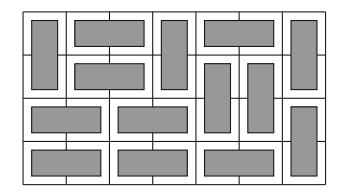

```cpp
best[0] = {0,0};
```

Sau đó,chúng ta có thểđiền vào mảng như sau:

```cpp
for (int s = 1; s < (1<<n); s++) {
 // giá trị ban đầu: cần n+1 chuyến đi
 best[s] = {n+1,0};
 for (int p = 0; p < n; p++) {
 if (s&(1<<p)) {
 auto option = best[s^(1<<p)];
 if (option.second+weight[p] <= x) {
 best[s] = min(best[s], {option.first, option.second+weight[p]});
 } else {
 best[s] = min(best[s], {option.first+1, weight[p]});
 }
 }
 }
}
```

Lưu ý rằng vòng lặp trên đảm bảo rằng cho bất kỳ hai tập hợp $S_1$ và $S_2$ sao cho $S_1 \subset S_2$,chúng ta xử lý $S_1$ trước $S_2$. Do đó, các giá trị quy hoạch động được tính theo thứ tự đúng.

#### 6.2.5 Đếm Cách lát gạch

Đôi khi các trạng thái của giải pháp quy hoạch động phức tạp hơn các tổ hợp giá trị cố định. Ví dụ, xem xét bài toán tính số cách khác nhau đểđiền vào lưới $n \times m$ sử dụng gạch kích thước $1 \times 2$ và $2 \times 1$. Ví dụ, có tổng cộng 781 cách đểđiền vào lưới $4 \times 7$,trong số đó là giải pháp được chỉ ra trong Hình 6.6.

Bài toán có thể được giải sử dụng quy hoạch động bằng cách đi qua lưới theo hàng. Mỗi hàng trong giải pháp có thể được biểu diễn dưới dạng xâu chứa

*m* ký tự từ tập hợp $\{ \sqcap, \sqcup, \sqsubset, \supseteq \}$. Ví dụ, giải pháp trong Hình 6.6 gồm bốn hàng tương ứng với các xâu sau:

- nc=nc=n
- 🗆 🗀 🗆 🗆 🗆
- [][] | | |
- [7[7]

Giả sử rằng các hàng của lưới được đánh chỉ số từ 1 đến n. Đặt count(k, x) là số cách để xây dựng giải pháp cho các hàng $1 \dots k$ sao cho xâu x tương ứng với hàng k. Có thể sử dụng quy hoạch động ở đây,vì trạng thái của hàng bịgiới hạn chỉ bởi trạng thái của hàng trước đó.

Giải pháp hợp lệ nếu hàng 1 không chứa ký tự $\square$, hàng n không chứa ký tự $\square$, và tất cả các hàng liên tiếp tương thích. Ví dụ, các hàng $\square \square \square \square \square \square \square \square \square \square \square \square \square \square \square \square \square \square \square$ 

Vì một hàng gồm m ký tự và có bốn lựa chọn cho mỗi ký tự, số hàng khác nhau nhiều nhất là $4^m$.chúng ta có thể đi qua $O(4^m)$ trạng thái có thể cho mỗi hàng, và cho mỗi trạng thái, có $O(4^m)$ trạng thái có thể cho hàng trước, nên độ phức tạp thời gian của giải pháp là $O(n4^{2m})$. Trong thực tế, đó là ý tưởng tốt để xoay lưới sao cho cạnh ngắn hơn có độ dài m,vì hệ số $4^{2m}$chi phối độ phức tạp thời gian.

Có thể làm cho giải pháp hiệu quả hơn bằng cách sử dụng biểu diễn compact hơn cho các hàng. Hóa ra chỉ cần biếtnhững nào cột của hàng trước chứa ô trên của gạch dọc. Do đó,chúng ta có thể biểu diễn hàng sử dụng chỉ các ký tự $\sqcap$ và $\square$, trong đó $\square$ là sự kết hợp của các ký tự $\sqcup$, $\square$, và $\square$. Sử dụng biểu diễn này, chỉ có $2^m$ hàng khác nhau, và độ phức tạp thời gian là $O(n2^{2m})$.

Lưu ý cuối cùng, cũng có một công thức trực tiếp để tính số cách lát gạch:

$$\prod_{a=1}^{\lceil n/2 \rceil} \prod_{b=1}^{\lceil m/2 \rceil} 4 \cdot \left( \cos^2 \frac{\pi a}{n+1} + \cos^2 \frac{\pi b}{m+1} \right)$$

Công thức này rất hiệu quả,vì nó tính số cách lát gạch trong O(nm) thời gian, nhưng vì câu trả lời là tích của các số thực, vấn đề khi sử dụng công thức là làm thế nào để lưu trữ chính xác các kết quả trung gian.

## Chương 7: Thuật toán Đồ thị

Nhiều bài toán lập trình có thể được giải bằng cách xem xét tình huống dưới dạng đồ thị và sử dụng thuật toán đồ thị phù hợp. Trong chương này, chúng ta sẽ học những kiến thức cơ bản về đồ thị và một lựa chọn các thuật toán đồ thị quan trọng.

Phần 7.1 thảo luận thuật ngữ đồ thị và cấu trúc dữ liệu có thể được sử dụng để biểu diễn đồ thị trong thuật toán.

Phần 7.2 giới thiệu hai thuật toán duyệt đồ thị cơ bản. DFS là một cách đơn giản để thăm tất cả các nút có thể đạt được từ nút bắt đầu, và BFS thăm các nút theo thứ tự tăng dần khoảng cách từ nút bắt đầu.

Phần 7.3 trình bày thuật toán tìm đường đi ngắn nhất trong đồ thị có trọng số. Thuật toán Bellman-Ford là thuật toán đơn giản tìm đường đi ngắn nhất từ nút bắt đầu đến tất cả nút khác. Thuật toán Dijkstra là thuật toán hiệu quả hơn yêu cầu tất cả trọng số cạnh không âm. Thuật toán Floyd-Warshall xác định đường đi ngắn nhất giữa tất cả cặp nút của đồ thị.

Phần 7.4 khám phá các tính chất đặc biệt của đồ thị có hướng không chu trình (DAG). Chúng ta sẽ học cách xây dựng sắp xếp tô-pô và cách sử dụng quy hoạch động để xử lý hiệu quả các đồ thị như vậy.

Phần 7.5 tập trung vào đồ thị kế thừa mà mỗi nút có một người kế thừa duy nhất. Chúng ta sẽ thảo luận cách hiệu quả để tìm người kế thừa của nút và thuật toán Floyd để phát hiện chu trình.

Phần 7.6 trình bày thuật toán Kruskal và Prim để xây dựng cây khung nhỏ nhất. Thuật toán Kruskal dựa trên cấu trúc union-find hiệu quả cũng có cáccông dụng khác trong thiết kế thuật toán.

### 7.1 Kiến thức Cơ bản về Đồ thị

Trong phần này, chúng ta đầu tiên đi qua thuật ngữ được sử dụng khi thảo luận đồ thị và tính chất của chúng. Sau đó, chúng ta tập trung vào cấu trúc dữ liệu có thể được sử dụng để biểu diễn đồ thị trong lập trình thuật toán.

#### 7.1.1 Thuật ngữ Đồ thị

Đồ thị gồm các nút (còn gọi là đỉnh) được kết nối bằng các cạnh. Trong cuốn sách này, biến n biểu thị số nút trong đồ thị, và biến m biểu thị số cạnh. Các nút được đánh số sử dụng các số nguyên $1, 2, \ldots, n$. Ví dụ, Hình 7.1 cho thấy đồ thị với 5 nút và 7 cạnh.

*Đường đi* dẫn từ nút này đến nút khác thông qua các cạnh của đồ thị. *Độ dài* của đường đi là số cạnh trong đó. Ví dụ, Hình 7.2 cho thấy đường đi $1 \rightarrow 3 \rightarrow 4 \rightarrow 5$ độ dài 3 từ nút 1 đến nút 5. *Chu trình* là đường đi mà nút đầu và nút cuối giống nhau. Ví dụ, Hình 7.3 cho thấy chu trình $1 \rightarrow 3 \rightarrow 4 \rightarrow 1$.

Đồ thị là *liên thông* nếu có đường đi giữa bất kỳ hai nút nào. Trong Hình 7.4, đồ thị bên trái liên thông, nhưng đồ thị bên phải không liên thông,vì không thể đi từ nút 4 đến bất kỳ nút nào khác.

Các phần liên thông của đồ thị được gọi là *thành phần*. Ví dụ, đồ thị trong Hình 7.5 có ba thành phần: {1, 2, 3}, {4, 5, 6, 7}, và {8}.

*Cây* là đồ thị liên thông không chứa chu trình. Hình 7.6 cho thấy ví dụ về đồ thị là cây.

Trong đồ thị *có hướng*, các cạnh chỉ có thể được duyệt theo một hướng. Hình 7.7 cho thấy ví dụ về đồ thị có hướng. Đồ thị này chứa đường đi $3 \rightarrow 1 \rightarrow 2 \rightarrow 5$ từ nút 3 đến nút 5, nhưng không có đường đi từ nút 5 đến nút 3.

Trong đồ thị *có trọng số*, mỗi cạnh được gán một *trọng số*. Trọng số thường được hiểu là độ dài cạnh, và độ dài của đường đi là tổng trọng số cạnh. Ví dụ, đồ thị trong Hình 7.8 có trọng số, và độ dài của đường đi $1 \rightarrow 3 \rightarrow 4 \rightarrow 5$ là 1+7+3=11. Đây là đường đi *ngắn nhất* từ nút 1 đến nút 5.

Hai nút là *láng giềng* hoặc *kề nhau* nếu có cạnh giữa chúng. *Bậc* của nút là số láng giềng của nó. Hình 7.9 cho thấy bậc của mỗi nút

**Hình 7.1** Đồ thị với 5 nút và 7 cạnh

**Hình 7.2** Đường đi từ nút 1 đến nút 5

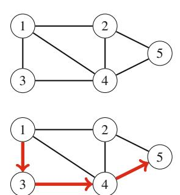

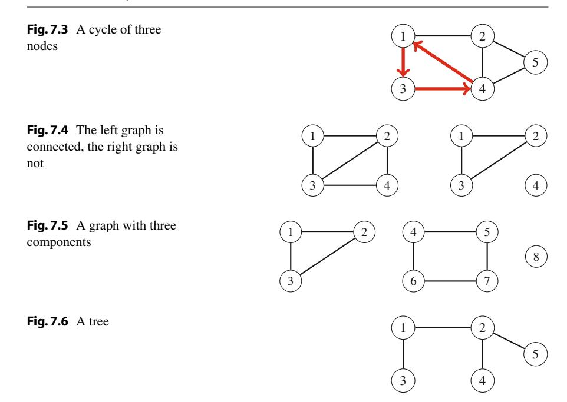

của đồ thị. Ví dụ, bậc của nút 2 là 3, vì láng giềng của nó là 1, 4, và 5.

Tổng bậc trong đồ thị luôn là 2m, trong đó m là số cạnh, vì mỗi cạnh tăng bậc của chính xác hai nút lên một. Vì lý do này, tổng bậc luôn chẵn. Đồ thị là *đều* nếu bậc của mỗi nút là hằng số d. Đồ thị là *hoàn chỉnh* nếu bậc của mỗi nút là n-1, tức là đồ thị chứa tất cả cạnh có thể giữa các nút.

Trong đồ thị có hướng, *bậc vào* của nút là số cạnh kết thúc tại nút, và *bậc ra* của nút là số cạnh bắt đầu từ nút.

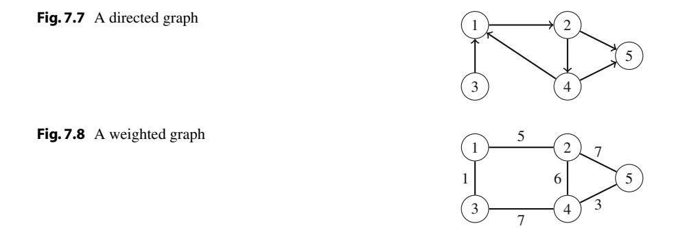

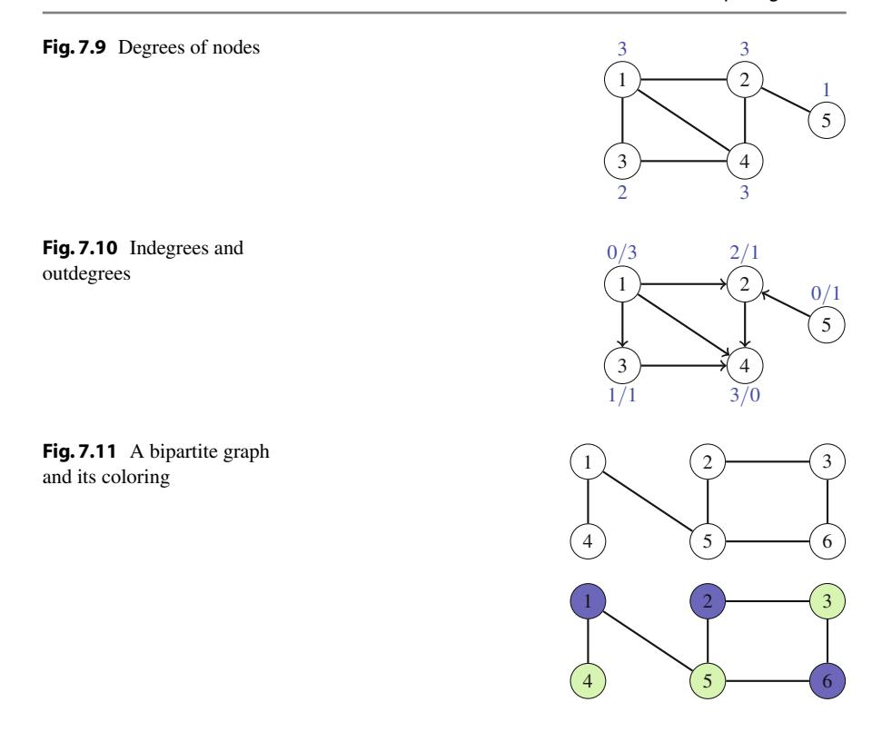

Hình 7.10 cho thấy bậc vào và bậc ra của mỗi nút của đồ thị. Ví dụ, nút 2 có bậc vào 2 và bậc ra 1.

Đồ thị là *hai phần* nếu có thể tô màu các nút sử dụng hai màu sao cho không có nút kề nào cùng màu. Hóa ra đồ thị là hai phần chính xác khi nó không có chu trình với số lẻ cạnh. Ví dụ, Hình 7.11 cho thấy đồ thị hai phần và cách tô màu.

#### 7.1.2 Biểu diễn Đồ thị

Có several cách để biểu diễn đồ thị trong thuật toán. Lựa chọn cấu trúc dữ liệu phụ thuộc vào kích thước đồ thị và cách thuật toán xử lý nó. Tiếp theochúng ta sẽ đi qua ba biểu diễn phổ biến.

**Danh sách kề** Trong biểu diễn danh sách kề, mỗi nút x của đồ thị được gán một *danh sách kề* gồm các nút mà có cạnh từ x. Danh sách kề là cách phổ biến nhất để biểu diễn đồ thị, vàhầu hết thuật toán có thể được cài đặt hiệu quả sử dụng chúng.

Một cách tiện lợi để lưu trữ danh sách kề là khai báo mảng vector như sau:

**Hình 7.12** Các đồ thị ví dụ

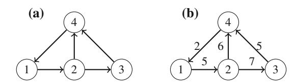

```cpp
vector<int> adj[N];
```

Hằng số N được chọn sao cho tất cả danh sách kề có thể được lưu trữ. Ví dụ, đồ thị trong Hình 7.12a có thể được lưu trữ như sau:

```cpp
adj[1].push_back(2);
adj[2].push_back(3);
adj[2].push_back(4);
adj[3].push_back(4);
adj[4].push_back(1);
```

Nếu đồ thị vô hướng, nó có thể được lưu trữ theo cách tương tự, nhưng mỗi cạnh được thêm vào cả hai hướng.

Cho đồ thị có trọng số, cấu trúc có thể được mở rộng như sau:

```cpp
vector<pair<int,int>> adj[N];
```

Trong trường hợp này, danh sách kề của nút a chứa cặp (b, w) whenever có cạnh từ nút a đến nút b với trọng số w. Ví dụ, đồ thị trong Hình 7.12b có thể được lưu trữ như sau:

```cpp
adj[1].push_back({2,5});
adj[2].push_back({3,7});
adj[2].push_back({4,6});
adj[3].push_back({4,5});
adj[4].push_back({1,2});
```

Sử dụng danh sách kề,chúng ta có thể hiệu quả tìm các nút màchúng ta có thể di chuyển từ nút cho trước thông qua cạnh. Ví dụ, vòng lặp sau đi qua tất cả nút màchúng ta có thể di chuyển từ nút s:

```cpp
for (auto u : adj[s]) {
 // xử lý nút u
}
```

**Ma trận kề** *Ma trận kề* cho biết các cạnh mà đồ thị chứa.chúng ta có thể hiệu quả kiểm tra từ ma trận kề xem có cạnh giữa hai nút hay không. Ma trận có thể được lưu trữ dưới dạng mảng

```cpp
int adj[N][N];
```

trong đó mỗi giá trị adj[a][b] cho biết whether đồ thị chứa cạnh từ nút a đến nút b. Nếu cạnh được bao gồm trong đồ thị, thì adj[a][b] = 1, và nếu không adj[a][b] = 0. Ví dụ, ma trận kề cho đồ thị trong Hình 7.12a là

$$\begin{bmatrix} 0 & 1 & 0 & 0 \\ 0 & 0 & 1 & 1 \\ 0 & 0 & 0 & 1 \\ 1 & 0 & 0 & 0 \end{bmatrix}.$$

Nếu đồ thị có trọng số, biểu diễn ma trận kề có thể được mở rộng sao cho ma trận chứa trọng số của cạnh nếu cạnh tồn tại. Sử dụng biểu diễn này, đồ thị trong Hình 7.12b tương ứng với ma trận sau:

$$\begin{bmatrix} 0 & 5 & 0 & 0 \\ 0 & 0 & 7 & 6 \\ 0 & 0 & 0 & 5 \\ 2 & 0 & 0 & 0 \end{bmatrix}$$

Nhược điểm của biểu diễn ma trận kề là ma trận kề chứa $n^2$ phần tử, và thường hầu hết chúng bằng 0. Vì lý do này, biểu diễn không thể được sử dụng nếu đồ thị lớn.

**Danh sách cạnh** *Danh sách cạnh* chứa tất cả cạnh của đồ thị theo một thứ tự nào đó. Đây là cách tiện lợi để biểu diễn đồ thị nếu thuật toán xử lý tất cả các cạnh, và không cần tìm các cạnh bắt đầu từ nút cho trước.

Danh sách cạnh có thể được lưu trữ trong vector

```cpp
vector<pair<int,int>> edges;
```

trong đó mỗi cặp (a, b) biểu thị rằng có cạnh từ nút a đến nút b. Do đó, đồ thị trong Hình 7.12a có thể được biểu diễn như sau:

```cpp
edges.push_back({1,2});
edges.push_back({2,3});
edges.push_back({2,4});
edges.push_back({3,4});
edges.push_back({4,1});
```

Nếu đồ thị có trọng số, cấu trúc có thể được mở rộng như sau:

```cpp
vector<tuple<int,int,int>> edges;
```

Mỗi phần tử trong danh sách này có dạng (a, b, w), có nghĩa là có cạnh từ nút a đến nút b với trọng số w. Ví dụ, đồ thị trong Hình 7.12b có thể được biểu diễn như sau<sup>1</sup>:

```cpp
edges.push_back({1,2,5});
edges.push_back({2,3,7});
edges.push_back({2,4,6});
edges.push_back({3,4,5});
edges.push_back({4,1,2});
```

### 7.2 Duyệt Đồ thị

Phần này thảo luận hai thuật toán đồ thị cơ bản: DFS và BFS. Cả hai thuật toán được cho một nút bắt đầu trong đồ thị, vàchúng thăm tất cả nút có thể đạt được từ nút bắt đầu. Sự khác biệt trong thuật toán là thứ tự chúng thăm các nút.

#### 7.2.1 DFS (Tìm kiếm theo Chiều sâu)

DFS là kỹ thuật duyệt đồ thị đơn giản. Thuật toán bắt đầu tại nút bắt đầu và tiến đến tất cả nút khác có thể đạt được từ nút bắt đầu sử dụng các cạnh của đồ thị.

DFS luôn theo một đường đi đơn trong đồ thị càng lâu càng tốt cho đến khi nó tìm thấy nút mới. Sau đó,nó quay lại các nút trước và bắt đầu khám phá các phần khác của đồ thị. Thuật toán theo dõi các nút đã thăm, sao cho nó xử lý mỗi nút chỉ một lần.

Hình 7.13 cho thấy cách DFS xử lý đồ thị. Tìm kiếm có thể bắt đầu tại bất kỳ nút nào của đồ thị; trong ví dụ nàychúng ta bắt đầu tìm kiếm tại nút 1. Đầu tiên tìm kiếm khám phá đường đi $1 \rightarrow 2 \rightarrow 3 \rightarrow 5$, sau đó quay lại nút 1 và thăm nút còn lại 4.

**Cài đặt** DFS có thể được cài đặt tiện lợi sử dụng đệ quy. Hàm `dfs` sau bắt đầu DFS tại nút cho trước. Hàm giả sử rằng đồ thị được lưu trữ dưới dạng danh sách kề trong mảng

```cpp
vector<int> adj[N];
```

và cũng duy trì mảng

<sup>1</sup>Trong một số trình biên dịch cũ hơn, hàm `make_tuple` phải được sử dụng thay vì dấu ngoặc nhọn (ví dụ, `make_tuple(1,2,5)` thay vì `{1,2,5}`).

**Hình 7.13** DFS

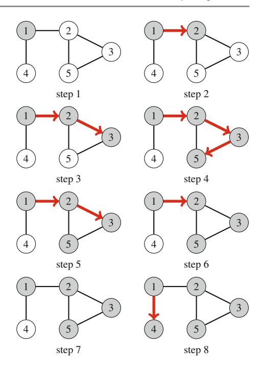

```cpp
bool visited[N];
```

theo dõi các nút đã thăm. Ban đầu, mỗi giá trị mảng là false, và khi tìm kiếm đến nút s, giá trị của visited[s] trở thành true. Hàm có thể được cài đặt như sau:

```cpp
void dfs(int s) {
 if (visited[s]) return;
 visited[s] = true;
 // xử lý nút s
 for (auto u: adj[s]) {
 dfs(u);
 }
}
```

Độ phức tạp thời gian của DFS là O(n + m) trong đó n là số nút và m là số cạnh, vì thuật toán xử lý mỗi nút và cạnh một lần.

**Hình 7.14** BFS

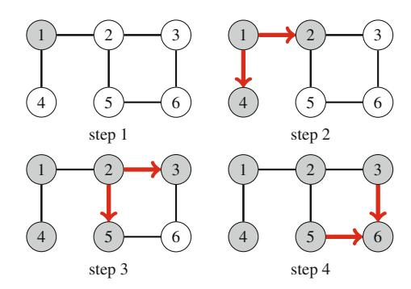

#### 7.2.2 BFS (Tìm kiếm theo Chiều rộng)

*BFS* thăm các nút của đồ thị theo thứ tự tăng dần khoảng cách từ nút bắt đầu. Do đó,chúng ta có thể tính khoảng cách từ nút bắt đầu đến tất cả nút khác sử dụng BFS. Tuy nhiên, BFS khó cài đặt hơn DFS.

BFS đi qua các nút từng cấp một. Đầu tiên tìm kiếm khám phá các nút mà khoảng cách từ nút bắt đầu là 1, sau đó các nút mà khoảng cách là 2, và cứ thế. Quá trình này tiếp tục cho đến khi tất cả nút đã được thăm.

Hình 7.14 cho thấy cách BFS xử lý đồ thị. Giả sử tìm kiếm bắt đầu tại nút 1. Đầu tiên tìm kiếm thăm nút 2 và 4 với khoảng cách 1, sau đó nút 3 và 5 với khoảng cách 2, và cuối cùng nút 6 với khoảng cách 3.

**Cài đặt** BFS khó cài đặt hơn DFS,vì thuật toán thăm các nút ở các phần khác nhau của đồ thị. Cài đặt điển hình dựa trên hàng đợi chứa các nút. Tại mỗi bước, nút tiếp theo trong hàng đợi sẽ được xử lý.

Code sau giả sử rằng đồ thị được lưu trữ dưới dạng danh sách kề và duy trì các cấu trúc dữ liệu sau:

```cpp
queue<int> q;
bool visited[N];
int distance[N];
```

Hàng đợi q chứa các nút cần xử lý theo thứ tự tăng dần khoảng cách. Các nút mới luôn được thêm vào cuối hàng đợi, và nút ở đầu hàng đợi là nút tiếp theo cần xử lý. Mảng `visited` cho biếtnhững nào nút tìm kiếm đã thăm, và mảng `distance` sẽ chứa khoảng cách từ nút bắt đầu đến tất cả nút của đồ thị.

Tìm kiếm có thể được cài đặt như sau, bắt đầu tại nút x:

**Hình 7.15** Kiểm tra tính liên thông của đồ thị

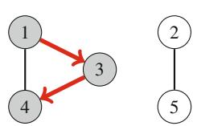

```cpp
visited[x] = true;
distance[x] = 0;
q.push(x);
while (!q.empty()) {
 int s = q.front(); q.pop();
 // xử lý nút s
 for (auto u : adj[s]) {
 if (visited[u]) continue;
 visited[u] = true;
 distance[u] = distance[s]+1;
 q.push(u);
 }
}
```

Giống như DFS, độ phức tạp thời gian của BFS là O(n+m), trong đó n là số nút và m là số cạnh.

#### 7.2.3 Ứng dụng

Sử dụng các thuật toán duyệt đồ thị,chúng ta có thể kiểm tranhiều tính chất của đồ thị. Thường thì cả DFS và BFS đều có thể được sử dụng, nhưng trong thực tế, DFS là lựa chọn tốt hơn,vì nó dễ cài đặt hơn. Trong các ứng dụng được mô tả dưới đâychúng ta sẽ giả sử rằng đồ thị vô hướng.

**Kiểm tra Liên thông** Đồ thị liên thông nếu có đường đi giữa bất kỳ hai nút nào của đồ thị. Do đó,chúng ta có thể kiểm tra xem đồ thị có liên thông bằng cách bắt đầu tại nútbất kỳ và tìm hiểu xemchúng ta có thể đạt được tất cả nút khác.

Ví dụ, trong Hình 7.15, vì DFS từ nút 1 không thăm tất cả nút,chúng ta có thể kết luận rằng đồ thị không liên thông. Tương tự,chúng ta cũng có thể tìm tất cả thành phần liên thông của đồ thị bằng cách duyệt qua các nút và luôn bắt đầu DFS mới nếu nút hiện tại chưa thuộc thành phần nào.

**Phát hiện Chu trình** Đồ thị chứa chu trình nếu trong quá trình duyệt đồ thị, chúng taphát hiện nút mà láng giềng (khác với nút trước trong đường đi hiện tại) đã được thăm. Ví dụ, trong Hình 7.16, DFS từ nút 1cho thấy rằng đồ thị chứa chu trình. Sau khi di chuyển từ nút 2 đến nút 5chúng ta nhận thấy láng giềng 3 của nút 5 đã được thăm. Do đó, đồ thị chứa chu trình đi qua nút 3, ví dụ, $3 \rightarrow 2 \rightarrow 5 \rightarrow 3$.

**Hình 7.16** Tìm chu trình trong đồ thị

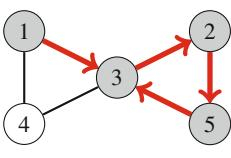

**Hình 7.17** Xung đột khi kiểm tra tính hai phần

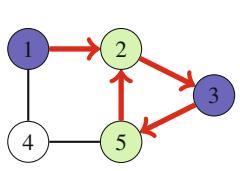

Một cách khác để xác định xem đồ thị có chứa chu trình là đơn giản tính số nút và số cạnh trong mỗi thành phần. Nếu thành phần chứa c nút và không có chu trình,nó phải chứa chính xác c-1 cạnh (nênnó phải là cây). Nếu có c hoặc nhiều cạnh hơn, thành phần chắc chắn chứa chu trình.

**Kiểm tra Tính hai phần** Đồ thị là hai phần nếu các nút của nó có thể được tô màu sử dụng hai màu sao cho không có nút kề nhau cùng màu. Thật surprising dễ dàng để kiểm tra xem đồ thị có phải hai phần sử dụng thuật toán duyệt đồ thị.

Ý tưởng là chọn hai màu X và Y, tô màu nút bắt đầu X, tất cả láng giềng Y, tất cả láng giềng của chúng X, và cứ thế. Nếu tại một thời điểm nào đó của tìm kiếmchúng ta nhận thấy hai nút kề nhau cùng màu, điều này có nghĩa là đồ thị không phải hai phần. Nếu không đồ thị là hai phần và một cách tô màu đã được tìm thấy.

Ví dụ, trong Hình 7.17, DFS từ nút 1 cho thấy đồ thị không phải hai phần,vìchúng ta nhận thấy cả nút 2 và 5đều nên có cùng màu, trong khi chúng là nút kề nhau trong đồ thị.

Thuật toán này luôn hoạt động,vì khi chỉ có hai màu có sẵn, màu của nút bắt đầu trong thành phần xác định màu của tất cả nút khác trong thành phần. Không có sự khác biệt nào về màu sắc.

Lưu ý rằng trong trường hợp tổng quátrất khó tìm ra whether các nút trong đồ thị có thể được tô màu sử dụng k màu sao cho không nút kề nhau cùng màu. Bài toán là NP-hard ngay từ k=3.

### 7.3 Đường đi Ngắn nhất

Tìm đường đi ngắn nhất giữa hai nút của đồ thị là bài toán quan trọng cónhiều ứng dụng thực tế. Ví dụ, bài toán tự nhiên liên quan đến mạng lưới đường bộ là tính độ dài ngắn nhất có thể của tuyến đường giữa hai thành phố, cho trước độ dài của các con đường.

Trong đồ thị vô hướng, độ dài của đường đi bằng số cạnh, vàchúng ta có thể đơn giản sử dụng BFS để tìm đường đi ngắn nhất. Tuy nhiên, trong phần này

**Hình 7.18** Thuật toán Bellman-Ford

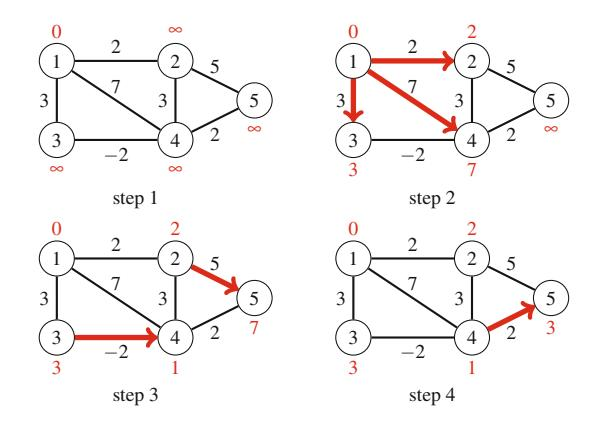

chúng ta tập trung vào đồ thị có trọng số mà các thuật toán tinh vi hơn cần thiết để tìm đường đi ngắn nhất.

#### 7.3.1 Bellman-Ford

*Thuật toán Bellman-Ford* tìm đường đi ngắn nhất từ nút bắt đầu đến tất cả nút của đồ thị. Thuật toán có thể xử lý tất cả loại đồ thị, với điều kiện đồ thị không chứa chu trình có độ dài âm. Nếu đồ thị chứa chu trình âm, thuật toán có thể phát hiện điều này.

Thuật toán theo dõi khoảng cách từ nút bắt đầu đến tất cả nút của đồ thị. Ban đầu, khoảng cách đến nút bắt đầu là 0 và khoảng cách đến bất kỳ nút nào khác là vô cực. Sau đó thuật toán giảm khoảng cách bằng cách tìm các cạnhrút ngắn đường đi cho đến khi không thể giảm khoảng cách nào.

Hình 7.18 cho thấy cách thuật toán Bellman-Ford xử lý đồ thị. Đầu tiên, thuật toán giảm khoảng cách sử dụng các cạnh $1 \rightarrow 2$, $1 \rightarrow 3$ và $1 \rightarrow 4$, sau đó sử dụng các cạnh $2 \rightarrow 5$ và $3 \rightarrow 4$, và cuối cùng sử dụng cạnh $4 \rightarrow 5$. Sau đó, không cạnh nào có thể được sử dụng để giảm khoảng cách, có nghĩa là khoảng cách là cuối cùng.

**Cài đặt** Cài đặt thuật toán Bellman-Ford dưới đây xác định khoảng cách ngắn nhất từ nút x đến tất cả nút của đồ thị. Code giả sử rằng đồ thị được lưu trữ dưới dạng danh sách cạnh `edges` gồm các tuple dạng (a, b, w), có nghĩa là có cạnh từ nút a đến nút b với trọng số w.

Thuật toán gồm n-1 vòng, và trên mỗi vòng thuật toán đi qua tất cả cạnh của đồ thị và cố gắng giảm khoảng cách. Thuật toán xây dựng mảng `distance` sẽ chứa khoảng cách từ nút x đến tất cả nút. Hằng số INF biểu thị khoảng cách vô cực.

**Hình 7.19** Đồ thị có chu trình âm

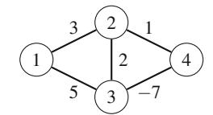

```cpp
for (int i = 1; i <= n; i++) {
 distance[i] = INF;
}
distance[x] = 0;
for (int i = 1; i <= n-1; i++) {
 for (auto e : edges) {
 int a, b, w;
 tie(a, b, w) = e;
 distance[b] = min(distance[b], distance[a]+w);
 }
}
```

Độ phức tạp thời gian của thuật toán là O(nm),vì thuật toán gồm n-1 vòng và duyệt qua tất cả m cạnh trong vòng. Nếu không có chu trình âm trong đồ thị, tất cả khoảng cách là cuối cùng sau n-1 vòng,vì mỗi đường đi ngắn nhất có thể chứanhiều nhất n-1 cạnh.

Có several cách để tối ưu thuật toán trong thực tế. Đầu tiên, khoảng cách cuối cùng thường có thể được tìm thấy sớm hơn sau n-1 vòng, nênchúng ta có thể đơn giản dừng thuật toán nếu không khoảng cách nào có thể được giảm trong vòng. Biến thể nâng cao hơn là *thuật toán SPFA* ("Shortest Path Faster Algorithm" [8]) duy trì hàng đợi nút có thể được sử dụng để giảm khoảng cách. Chỉ các nút trong hàng đợi sẽ được xử lý, điều này thường cho ra tìm kiếm hiệu quả hơn.

**Chu trình Âm** Thuật toán Bellman-Ford cũng có thể được sử dụng để kiểm tra xem đồ thị có chứa chu trình có độ dài âm hay không. Trong trường hợp này, bất kỳ đường đi nào chứa chu trình có thể đượcrút ngắnvô hạn lần, nên khái niệm đường đi ngắn nhất không có ý nghĩa. Ví dụ, đồ thị trong Hình 7.19 chứa chu trình âm $2 \rightarrow 3 \rightarrow 4 \rightarrow 2$ với độ dài -4.

Chu trình âm có thể được phát hiện sử dụng thuật toán Bellman-Ford bằng cách chạy thuật toán cho n vòng. Nếu vòng cuối giảm bất kỳ khoảng cách nào, đồ thị chứa chu trình âm. Lưu ý rằng thuật toán này có thể được sử dụng để tìm kiếm chu trình âm trong toàn bộ đồ thị bất kể nút bắt đầu.

### 7.3.2 Thuật toán Dijkstra

Thuật toán Dijkstra tìm đường đi ngắn nhất từ nút bắt đầu đến tất cả nút của đồ thị, giống như thuật toán Bellman-Ford. Ưu điểm của thuật toán Dijkstra là nó


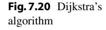

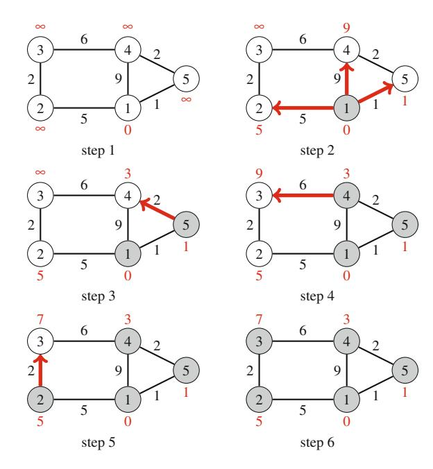

hiệu quả hơn và có thể được sử dụng để xử lý đồ thị lớn. Tuy nhiên, thuật toán yêu cầu không có cạnh trọng số âm trong đồ thị.

Giống như thuật toán Bellman-Ford, thuật toán Dijkstra duy trì khoảng cách đến các nút và giảm chúng trong quá trình tìm kiếm. Tại mỗi bước, thuật toán Dijkstra chọn nút chưa được xử lý mà khoảng cách nhỏ nhất có thể. Sau đó, thuật toán đi qua tất cả cạnh bắt đầu từ nút và giảm khoảng cách sử dụng chúng. Thuật toán Dijkstra hiệu quả,vì nó chỉ xử lý mỗi cạnh trong đồ thị một lần, sử dụng thực tế rằng không có cạnh âm.

Hình 7.20 cho thấy cách thuật toán Dijkstra xử lý đồ thị. Giống như trong thuật toán Bellman-Ford, khoảng cách ban đầu đến tất cả nút, trừ nút bắt đầu, là vô cực. Thuật toán xử lý các nút theo thứ tự 1, 5, 4, 2, 3, và tại mỗi nút giảm khoảng cách sử dụng các cạnh bắt đầu từ nút. Lưu ý rằng khoảng cách đến nút không bao giờ thay đổi sau khi xử lý nút.

**Cài đặt** Cài đặt hiệu quả của thuật toán Dijkstra yêu cầuchúng ta có thể hiệu quả tìm nút khoảng cách tối thiểu chưa được xử lý. Cấu trúc dữ liệu phù hợp cho điều này là priority queue chứa các nút còn lại sắp xếp theo khoảng cách. Sử dụng priority queue, nút tiếp theo cần xử lý có thể được truy xuất trong thời gian logarithm.

Cài đặt sách giáo khoa điển hình của thuật toán Dijkstra sử dụng priority queue có phép toán để sửa đổi giá trị trong hàng đợi. Điều này cho phép chúng ta có một instance duy nhất của mỗi nút trong hàng đợi và cập nhật khoảng cách khi cần. Tuy nhiên, priority queue thư viện chuẩn không cung cấp phép toán như vậy, và một cài đặt hơi khác thường được sử dụng trong lập trình thi đấu.

**7.3 Đường đi Ngắn nhất 91**

Ý tưởng là thêm instance mới của nút vào priority queue whenever khoảng cách thay đổi.

Cài đặt thuật toán Dijkstra của chúng ta tính khoảng cách tối thiểu từ nút x đến tất cả nút khác của đồ thị. Đồ thị được lưu trữ dưới dạng danh sách kề sao cho adj[a] chứa cặp (b, w) whenever có cạnh từ nút a đến nút b với trọng số w. Priority queue

```cpp
priority_queue<pair<int,int>> q;
```

chứa cặp dạng (-d, x), có nghĩa là khoảng cách hiện tại đến nút x là d. Mảng `distance` chứa khoảng cách đến mỗi nút, và mảng `processed` cho biết whether nút đã được xử lý.

Lưu ý rằng priority queue chứa khoảng cách *âm* đến nút. Lý do cho điều này là phiên bản mặc định của priority queue C++ tìm phần tửtối đa, trong khi chúng ta muốn tìm phần tửtối thiểu. Bằng cáchsử dụng khoảng cách âm,chúng ta có thể trực tiếp sử dụng priority queue mặc định.<sup>2</sup> Cũng lưu ý rằng trong khi có thể có several instance của nút trong priority queue, chỉ instance với khoảng cáchtối thiểu sẽ được xử lý.

Cài đặt như sau:

```cpp
for (int i = 1; i <= n; i++) {
 distance[i] = INF;
}
distance[x] = 0;
q.push({0,x});
while (!q.empty()) {
 int a = q.top().second; q.pop();
 if (processed[a]) continue;
 processed[a] = true;
 for (auto u : adj[a]) {
 int b = u.first, w = u.second;
 if (distance[a]+w < distance[b]) {
 distance[b] = distance[a]+w;
 q.push({-distance[b],b});
 }
 }
}
```

Độ phức tạp thời gian của cài đặt trên là $O(n + m \log m)$,vì thuật toán đi qua tất cả nút của đồ thị và thêm cho mỗi cạnhnhiều nhất một khoảng cách vào priority queue.

**Cạnh Âm** Hiệu suất của thuật toán Dijkstra dựa trên thực tế rằng đồ thị không có cạnh âm. Tuy nhiên, nếu đồ thị có cạnh âm, thuật toán có thể cho kết quả không chính xác. Ví dụ, xem xét đồ thị trong Hình 7.21. Đường đi ngắn nhất từ nút 1 đến nút 4 là $1 \rightarrow 3 \rightarrow 4$ và độ dài của nó là 1. Tuy nhiên, thuật toán Dijkstra không chính xác tìm đường đi $1 \rightarrow 2 \rightarrow 4$ bằng cách tham lam theo các cạnh trọng sốtối thiểu.

<sup>2</sup>Tất nhiên, chúng ta cũng có thể khai báo priority queue như trong Phần 5.2.3 và sử dụng khoảng cách dương, nhưng cài đặt sẽ dài hơn.

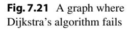

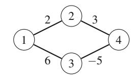

**Hình 7.22** Đầu vào cho thuật toán Floyd-Warshall

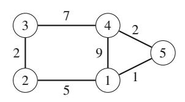

#### 7.3.3 Thuật toán Floyd-Warshall

*Thuật toán Floyd-Warshall* cung cấp một cách tiếp cận thay thế để giải bài toán tìm đường đi ngắn nhất. Không giống như các thuật toán khác trong chương này, nó tìm đường đi ngắn nhất giữa tất cả cặp nút của đồ thị trong một lần chạy.

Thuật toán duy trì ma trận chứa khoảng cách giữa các nút. Ma trận ban đầu được xây dựng trực tiếp dựa trên ma trận kề của đồ thị. Sau đó, thuật toán gồm các vòng liên tiếp, và trên mỗi vòng,nó chọn nút mới có thể đóng vai trò trung gian trong đường đi từ bây giờ, và giảm khoảng cách sử dụng nút này.

Hãy mô phỏng thuật toán Floyd-Warshall cho đồ thị trong Hình 7.22. Trong trường hợp này, ma trận ban đầu như sau:

$$\begin{bmatrix} 0 & 5 & \infty & 9 & 1 \\ 5 & 0 & 2 & \infty & \infty \\ \infty & 2 & 0 & 7 & \infty \\ 9 & \infty & 7 & 0 & 2 \\ 1 & \infty & \infty & 2 & 0 \end{bmatrix}$$

Trên vòng đầu tiên, nút 1 là nút trung gian mới. Có đường đi mới giữa nút 2 và 4 với độ dài 14, vì nút 1 kết nối chúng. Cũng có đường đi mới giữa nút 2 và 5 với độ dài 6.

$$\begin{bmatrix} 0 & 5 & \infty & 9 & 1 \\ 5 & 0 & 2 & \mathbf{14} & \mathbf{6} \\ \infty & 2 & 0 & 7 & \infty \\ 9 & \mathbf{14} & 7 & 0 & 2 \\ 1 & \mathbf{6} & \infty & 2 & 0 \end{bmatrix}$$

**7.3 Đường đi Ngắn nhất 93**

**Hình 7.23** Đường đi ngắn nhất từ nút 2 đến nút 4

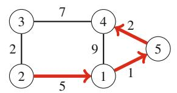

Trên vòng thứ hai, nút 2 là nút trung gian mới. Điều này tạo ra đường đi mới giữa nút 1 và 3 và giữa nút 3 và 5:

Thuật toán tiếp tục như thế này, cho đến khi tất cả nút đã được chỉ định làm nút trung gian. Sau khi thuật toán hoàn thành, ma trận chứa khoảng cách ngắn nhất giữa bất kỳ hai nút nào:

$$\begin{bmatrix}
0 & 5 & 7 & 3 & 1 \\
5 & 0 & 2 & 8 & 6 \\
7 & 2 & 0 & 7 & 8 \\
3 & 8 & 7 & 0 & 2 \\
1 & 6 & 8 & 2 & 0
\end{bmatrix}$$

Ví dụ, ma trận cho chúng ta biết rằng khoảng cách ngắn nhất giữa nút 2 và 4 là 8. Điều này tương ứng với đường đi trong Hình 7.23.

**Cài đặt** Thuật toán Floyd-Warshallđặc biệt dễ cài đặt. Cài đặt dưới đây xây dựng ma trận khoảng cách trong đó $\mathtt{dist}[a][b]$ biểu thị khoảng cách ngắn nhất giữa nút a và b. Đầu tiên, thuật toán khởi tạo $\mathtt{dist}$ sử dụng ma trận kề $\mathtt{adj}$ của đồ thị:

```cpp
for (int i = 1; i <= n; i++) {
 for (int j = 1; j <= n; j++) {
 if (i == j) dist[i][j] = 0;
 else if (adj[i][j]) dist[i][j] = adj[i][j];
 else dist[i][j] = INF;
 }
}
```

Sau đó, khoảng cách ngắn nhất có thể được tìm thấy như sau:

**Hình 7.24** Đồ thị và sắp xếp tô-pô

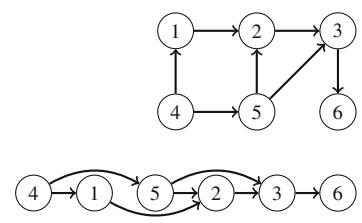

```cpp
for (int k = 1; k <= n; k++) {
 for (int i = 1; i <= n; i++) {
 for (int j = 1; j <= n; j++) {
 dist[i][j] = min(dist[i][j],dist[i][k]+dist[k][j]);
 }
 }
}
```

Độ phức tạp thời gian của thuật toán là $O(n^3)$,vì nó chứa ba vòng lặp lồng nhau đi qua các nút của đồ thị.

Vì cài đặt của thuật toán Floyd-Warshall đơn giản, thuật toán có thể là lựa chọn tốt ngay cả khi chỉ cần tìm *một* đường đi ngắn nhất trong đồ thị. Tuy nhiên, thuật toán chỉ có thể được sử dụng khi đồ thị nhỏ đủ sao cho độ phức tạp thời gian bậc ba đủ nhanh.

### 7.4 Đồ thị Có hướng Không chu trình (DAG)

Một lớp quan trọng của đồ thị là *đồ thị có hướng không chu trình*, còn gọi là *DAG*. Các đồ thị như vậy không chứa chu trình, vànhiều bài toán dễ giải hơnnếu chúng ta có thể giả sử rằng đây là trường hợp. Đặc biệt,chúng ta có thể luôn xây dựng sắp xếp tô-pô cho đồ thị và sau đó áp dụng quy hoạch động.

#### 7.4.1 Sắp xếp Tô-pô

*Sắp xếp tô-pô* là một thứ tự của các nút trong đồ thị có hướng sao cho nếu có đường đi từ nút a đến nút b, thì nút a xuất hiện trước nút b trong thứ tự. Ví dụ, trong Hình 7.24, một sắp xếp tô-pô có thể là [4, 1, 5, 2, 3, 6].

Đồ thị có hướng có sắp xếp tô-pô chính xác khi nó không chu trình. Nếu đồ thị chứa chu trình, không thể hình thành sắp xếp tô-pô,vì không nút nào của chu trình có thể xuất hiện trước các nút khác của chu trình trong thứ tự. Hóa ra DFS có thể được sử dụng để cả kiểm tra xem đồ thị có hướng có chứa chu trình và, nếu không, để xây dựng sắp xếp tô-pô.

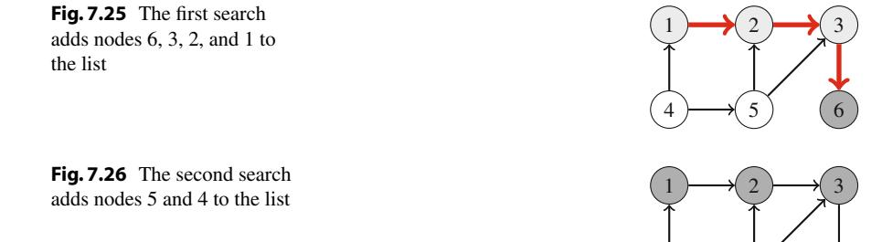

**Hình 7.27** Sắp xếp tô-pô cuối cùng

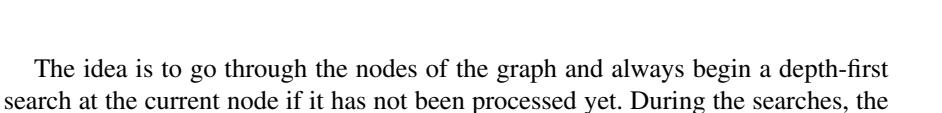

• state 0: the node has not been processed (white)

- trạng thái 1: nút đang được xử lý (xám nhạt)
- trạng thái 2: nút đã được xử lý (xám đậm)

Ban đầu, trạng thái của mỗi nút là 0. Khi tìm kiếm đến nút lần đầu tiên, trạng thái trở thành 1. Cuối cùng, sau khi tất cả cạnh từ nút đã được xử lý, trạng thái trở thành 2.

Nếu đồ thị chứa chu trình,chúng ta sẽphát hiện điều này trong quá trình tìm kiếm, vì sớm hay muộnchúng ta sẽ đến nút mà trạng thái là 1. Trong trường hợp này, không thể xây dựng sắp xếp tô-pô. Nếu đồ thị không chứa chu trình,chúng ta có thể xây dựng sắp xếp tô-pô bằng cách thêm mỗi nút vào danh sách khi trạng thái trở thành 2. Cuối cùng, chúng ta đảo ngược danh sách và có sắp xếp tô-pô cho đồ thị.

Bây giờ chúng ta sẵn sàng xây dựng sắp xếp tô-pô cho đồ thị ví dụ. Tìm kiếm đầu tiên (Hình 7.25) tiến hành từ nút 1 đến nút 6, và thêm nút 6, 3, 2, và 1 vào danh sách. Sau đó, tìm kiếm thứ hai (Hình 7.26) tiến hành từ nút 4 đến nút 5 và thêm nút 5 và 4 vào danh sách. Danh sách đảo ngược cuối cùng là [4, 5, 1, 2, 3, 6], tương ứng với sắp xếp tô-pô (Hình 7.27). Lưu ý rằng sắp xếp tô-pô không duy nhất; có thể có several sắp xếp tô-pô cho đồ thị.

Hình 7.28 cho thấy đồ thị không có sắp xếp tô-pô. Trong quá trình tìm kiếm,chúng ta đến nút 2 mà trạng thái là 1, có nghĩa là đồ thị chứa chu trình. Thực tế, có chu trình $2 \to 3 \to 5 \to 2$.

**Hình 7.28** Đồ thị này không có sắp xếp tô-pô,vì nó chứa chu trình

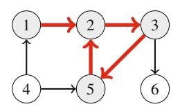

#### 7.4.2 Quy hoạch Động

Sử dụng quy hoạch động,chúng ta có thể hiệu quả trả lờinhiều câu hỏi liên quan đến đường đi trong đồ thị có hướng không chu trình. Ví dụ về các câu hỏi như vậy:

- Đường đi ngắn nhất/dài nhất từ nút a đến nút b là gì?
- Có bao nhiêu đường đi khác nhau?
- Số cạnh tối thiểu/tối đa trong đường đi là gì?
- Nút nào xuất hiện trong mọi đường đi có thể?

Lưu ý rằngnhiều bài toán trên khó giải hoặc không được xác định tốt cho đồ thị tổng quát.

Ví dụ, xem xét bài toán tính số đường đi từ nút a đến nút b. Đặt paths(x) là số đường đi từ nút a đến nút x. Trường hợp cơ sở, paths(a) = 1. Sau đó, để tính giá trị khác của paths(x),chúng ta có thể sử dụng công thức đệ quy

$$paths(x) = paths(s_1) + paths(s_2) + \cdots + paths(s_k),$$

trong đó $s_1, s_2, \ldots, s_k$ là các nút mà có cạnh đến x. Vì đồ thị không chu trình, giá trị của paths có thể được tính theo thứ tự sắp xếp tô-pô.

Hình 7.29 cho thấy giá trị của paths trong kịch bản ví dụ mà chúng ta muốn tính số đường đi từ nút 1 đến nút 6. Ví dụ,

$$paths(6) = paths(2) + paths(3),$$

because the edges that end at node 6 are $2 \to 6$ and $3 \to 6$ . Since paths(2) = 2 and paths(3) = 2, we conclude that paths(6) = 4. The paths are as follows:

- $1 \rightarrow 2 \rightarrow 3 \rightarrow 6$
- $1 \rightarrow 2 \rightarrow 3 \rightarrow 6$
- $1 \rightarrow 2 \rightarrow 6$
- $1 \rightarrow 4 \rightarrow 5 \rightarrow 2 \rightarrow 3 \rightarrow 6$
- $1 \rightarrow 4 \rightarrow 5 \rightarrow 2 \rightarrow 6$

**Xử lý Đường đi Ngắn nhất** Quy hoạch động cũng có thể được sử dụng để trả lời câu hỏi liên quan đến đường đi *ngắn nhất* trong đồ thị tổng quát (không nhất thiết không chu trình). Cụ thể,nếu chúng ta biết khoảng cách tối thiểu từ nút bắt đầu đến các nút khác (ví dụ, sau khi sử dụng thuật toán Dijkstra),chúng ta có thể dễ dàng tạo đồ thị có hướng *đường đi ngắn nhất*

**Hình 7.29** Tính số đường đi từ nút 1 đến nút 6

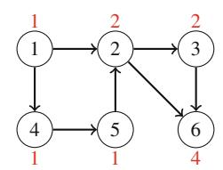

**Hình 7.30** Đồ thị và đồ thị đường đi ngắn nhất tương ứng

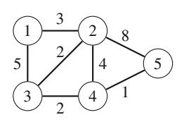

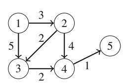

**Hình 7.31** Bài toán tiền dưới dạng đồ thị có hướng không chu trình

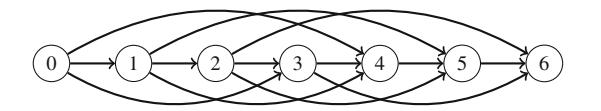

cho biết cho mỗi nút các cách có thể để đạt được nút sử dụng đường đi ngắn nhất từ nút bắt đầu. Ví dụ, Hình 7.30 cho thấy đồ thị và đồ thị đường đi ngắn nhất tương ứng.

**Bài toán Tiền Xem xét Lại** Thực tế, *bất kỳ* bài toán quy hoạch động nào cũng có thể được biểu diễn dưới dạng đồ thị có hướng không chu trình mà mỗi nút tương ứng với trạng thái quy hoạch động và các cạnh cho biết cách các trạng thái phụ thuộc lẫn nhau.

Ví dụ, xem xét bài toán tạo thành số tiền n sử dụng tiền $\{c_1, c_2, \ldots, c_k\}$ (Phần 6.1.1). Trong kịch bản này,chúng ta có thể xây dựng đồ thị mà mỗi nút tương ứng với số tiền, và các cạnh cho thấy cách tiền có thể được chọn. Ví dụ, Hình 7.31 cho thấy đồ thị cho tiền $\{1, 3, 4\}$ và n = 6. Sử dụng biểu diễn này, đường đi ngắn nhất từ nút 0 đến nút n tương ứng với giải pháp có số tiền tối thiểu, và tổng số đường đi từ nút 0 đến nút n bằng tổng số nghiệm.

### 7.5 Đồ thị Kế thừa

Một lớp đặc biệt khác của đồ thị có hướng là *đồ thị kế thừa*. Trong các đồ thị đó, bậc ra của mỗi nút là 1, tức là mỗi nút có một *người kế thừa* duy nhất. Đồ thị kế thừa

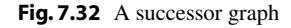

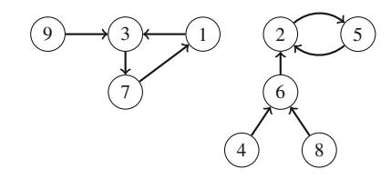

**Hình 7.33** Đi trong đồ thị kế thừa

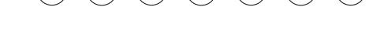

graph consists of one or more components, each of which contains one cycle and some paths that lead to it.

Đồ thị kế thừa đôi khi được gọi là *đồ thị hàm*,vì bất kỳ đồ thị kế thừa nào cũng tương ứng với hàm succ(x) định nghĩa các cạnh của đồ thị. Tham số x là nút của đồ thị, và hàm cho biết người kế thừa của nút. Ví dụ, hàm

định nghĩa đồ thị trong Hình 7.32.

#### 7.5.1 Tìm Điểm kế thừa

Vì mỗi nút của đồ thị kế thừa có người kế thừa duy nhất,chúng ta cũng có thể định nghĩa hàm succ(x, k) cho biết nút màchúng ta sẽ đạt đượcnếu chúng ta bắt đầu tại nút x và đi k bước về phía trước. Ví dụ, trong đồ thị ví dụ succ(4, 6) = 2,vì chúng ta sẽ đạt được nút 2 bằng cách đi 6 bước từ nút 4 (Hình 7.33).

Một cách trực tiếp để tính giá trị của succ(x, k) là bắt đầu tại nút x và đi k bước về phía trước, mất O(k) thời gian. Tuy nhiên, sử dụng tiền xử lý, bất kỳ giá trị nào của succ(x, k) có thể được tính chỉ trong $O(\log k)$ thời gian.

Đặt u là số bước tối đa chúng ta sẽ ever đi. Ý tưởng là tính trước tất cả giá trị của succ(x, k) trong đó k là lũy thừa của hai và nhiều nhất u. Điều này có thể được thực hiện hiệu quả,vì chúng ta có thể sử dụng đệ quy sau:

$$succ(x,k) = \begin{cases} succ(x) & k = 1\\ succ(succ(x,k/2),k/2) & k > 1 \end{cases}$$

Ý tưởng là đường đi độ dài k bắt đầu tại nút x có thể được chia thành hai đường đi độ dài k/2. Tính trước tất cả giá trị của succ(x, k) trong đó k là lũy thừa của hai và nhiều nhất u mất $O(n \log u)$ thời gian,vì $O(\log u)$ giá trị được tính cho mỗi nút. Trong đồ thị ví dụ, các giá trị đầu tiên như sau:

| | 1 | 2 | 3 | 4 | 5 | 6 | 7 | 8 | 9 |
|---|---|---|---|---|---|---|---|---|---|
| succ(x, 1) | 3 | 5 | 7 | 6 | 2 | 2 | 1 | 6 | 3 |
| succ(x, 2) | | | | | | | | | |
| succ(x, 4) | 3 | 2 | 7 | 2 | 5 | 5 | 1 | 2 | 3 |
| succ(x, 8) | 7 | 2 | 1 | 2 | 5 | 5 | 3 | 2 | 7 |

**Hình 7.34** Chu trình trong đồ thị kế thừa


Sau khi tiền xử lý, bất kỳ giá trị nào của succ(x, k) có thể được tính bằng cách biểu diễn k dưới dạng tổng các lũy thừa của hai. Biểu diễn như vậy luôn gồm $O(\log k)$ phần, nên tính giá trị của succ(x, k) mất $O(\log k)$ thời gian. Ví dụ,nếu chúng ta muốn tính giá trị của succ(x, 11), chúng ta sử dụng công thức

$$succ(x, 11) = succ(succ(succ(x, 8), 2), 1).$$

Trong đồ thị ví dụ,

$$succ(4, 11) = succ(succ(succ(4, 8), 2), 1) = 5.$$

#### 7.5.2 Phát hiện Chu trình

Xem xét đồ thị kế thừa chỉ chứa đường đi kết thúc trong chu trình. Chúng ta có thể hỏi các câu hỏi sau:nếu chúng ta bắt đầu đi tại nút bắt đầu, nút đầu tiên trong chu trình là gì và chu trình chứa bao nhiêu nút? Ví dụ, trong Hình 7.34, chúng ta bắt đầu đi tại nút 1, nút đầu tiên thuộc chu trình là nút 4, và chu trình gồm ba nút (4, 5, và 6).

Một cách đơn giản để phát hiện chu trình là đi trong đồ thị và theo dõi tất cả nút đã được thăm. Khi nút được thăm lần thứ hai,chúng ta có thể kết luận rằng nút là nút đầu tiên trong chu trình. Phương pháp này hoạt động trong O(n) thời gian và cũng sử dụng O(n) bộ nhớ. Tuy nhiên, có thuật toán tốt hơn cho phát hiện chu trình. Độ phức tạp thời gian của thuật toán như vậy vẫn là O(n), nhưng chúng chỉ sử dụng O(1) bộ nhớ, điều này có thể là cải thiện quan trọng nếu n lớn.

Một thuật toán như vậy là thuật toán Floyd, đi trong đồ thị sử dụng hai con trỏ a và b. Cả hai con trỏ bắt đầu tại nút bắt đầu x. Sau đó, trên mỗi lượt, con trỏ a đi một bước về phía trước và con trỏ b đi hai bước về phía trước. Quá trình tiếp tục cho đến khi các con trỏ gặp nhau:


```cpp
a = succ(x);
b = succ(succ(x));
while (a != b) {
 a = succ(a);
 b = succ(succ(b));
}
```

Tại thời điểm này, con trỏ a đã đi k bước và con trỏ b đã đi 2k bước, nên độ dài của chu trình chia hết k. Do đó, nút đầu tiên thuộc chu trình có thể được tìm thấy bằng cách di chuyển con trỏ a đến nút x và tiến các con trỏ từng bước một cho đến khi chúng gặp lại nhau.

```cpp
a = x;
while (a != b) {
 a = succ(a);
 b = succ(b);
}
first = a;
```

Sau đó, độ dài của chu trình có thể được tính như sau:

```cpp
b = succ(a);
length = 1;
while (a != b) {
 b = succ(b);
 length++;
}
```

### 7.6 Cây Khung Nhỏ nhất

Cây khung chứa tất cả nút của đồ thị và một số cạnh sao cho có đường đi giữa bất kỳ hai nút nào. Giống như cây nói chung, cây khung liên thông và không chu trình. Trọng số của cây khung là tổng trọng số cạnh. Ví dụ, Hình 7.35 cho thấy đồ thị và một trong những cây khung của nó. Trọng số của cây khung này là 3 + 5 + 9 + 3 + 2 = 22.

*Cây khung nhỏ nhất* là cây khung mà trọng số nhỏ nhất có thể. Hình 7.36 cho thấy cây khung nhỏ nhất cho đồ thị ví dụ với trọng số 20. Tương tự, *cây khung lớn nhất* là cây khung mà trọng số lớn nhất có thể. Hình 7.37 cho thấy cây khung lớn nhất cho đồ thị ví dụ với trọng số 32. Lưu ý rằng đồ thị có thể có several cây khung nhỏ nhất và lớn nhất, nên các cây không duy nhất.


Hóa ra several phương pháp tham lam có thể được sử dụng để xây dựng cây khung nhỏ nhất và lớn nhất. Phần này thảo luận hai thuật toán xử lý các cạnh của đồ thị sắp xếp theo trọng số. Chúng ta tập trung vào tìm cây khung nhỏ nhất, nhưng các thuật toán tương tự cũng có thể tìm cây khung lớn nhất bằng cách xử lý các cạnh theo thứ tự đảo ngược.

#### 7.6.1 Thuật toán Kruskal

*Thuật toán Kruskal* xây dựng cây khung nhỏ nhất bằng cách tham lam thêm cạnh vào đồ thị. Cây khung ban đầu chỉ chứa các nút của đồ thị và không chứa cạnh nào. Sau đó thuật toán đi qua các cạnh sắp xếp theo trọng số và luôn thêm cạnh vào đồ thị nếu nó không tạo ra chu trình.

Thuật toán duy trì các thành phần của đồ thị. Ban đầu, mỗi nút của đồ thị thuộc một thành phần riêng biệt. Whenever cạnh được thêm vào đồ thị, hai thành phần được nối lại. Cuối cùng, tất cả nút thuộc cùng thành phần, và cây khung nhỏ nhất đã được tìm thấy.

Ví dụ, hãy xây dựng cây khung nhỏ nhất cho đồ thị ví dụ (Hình 7.35). Bước đầu tiên là sắp xếp các cạnh theo thứ tự tăng dần trọng số:


Sau đó,chúng ta đi qua danh sách và thêm mỗi cạnh vào đồ thị nếu nó nối hai thành phần riêng biệt. Hình 7.38 cho thấy các bước của thuật toán. Ban đầu, mỗi nút thuộc thành phần riêng. Sau đó, các cạnh đầu tiên trong danh sách (5–6, 1–2, 3–6, và 1–5) được thêm vào đồ thị. Sau đó, cạnh tiếp theo sẽ là 2–3, nhưng cạnh này không được thêm,vì nó sẽ tạo ra chu trình. Điều tương tự áp dụng cho cạnh 2–5. Cuối cùng, cạnh 4–6 được thêm, và cây khung nhỏ nhất hoàn thành.

**Tại sao Hoạt động?** Câu hỏi tốt *tại sao* thuật toán Kruskal hoạt động. Tại sao chiến lược tham lam đảm bảo rằngchúng ta sẽ tìm thấy cây khung nhỏ nhất?

Hãy xem điều gì xảy ra nếu cạnh trọng số nhỏ nhất của đồ thị *không* được bao gồm trong cây khung. Ví dụ, giả sử rằng cây khung nhỏ nhất của đồ thị ví dụ sẽ không chứa cạnh trọng số nhỏ nhất 5–6. Chúng ta không biết cấu trúc chính xác của cây khung như vậy, nhưng trong bất kỳ trường hợp nào nó phải chứa một số cạnh. Giả sử rằng cây sẽ trông như cây trong Hình 7.39.

Tuy nhiên, không thể rằng cây trong Hình 7.39 sẽ là cây khung nhỏ nhất,vì chúng ta có thể loại bỏ cạnh khỏi cây và thay thế nó bằng cạnh trọng số

**Hình 7.39** Cây khung nhỏ nhất giả thuyết


**Hình 7.40** Bao gồm cạnh 5–6 giảm trọng số của cây khung


nhỏ nhất 5–6. Điều này tạo ra cây khung mà trọng số *nhỏ hơn*, được chỉ ra trong Hình 7.40.

Vì lý do này, luôn tối ưu để bao gồm cạnh trọng số nhỏ nhất trong cây để tạo ra cây khung nhỏ nhất. Sử dụng lập luận tương tự,chúng ta có thể cho thấy rằng cũng tối ưu để thêm cạnh tiếp theo theo thứ tự trọng số vào cây, và cứ thế. Do đó, thuật toán Kruskal luôn tạo ra cây khung nhỏ nhất.

**Cài đặt** Khi cài đặt thuật toán Kruskal, tiện lợi để sử dụng biểu diễn danh sách cạnh của đồ thị. Giai đoạn đầu tiên của thuật toán sắp xếp các cạnh trong danh sách trong $O(m \log m)$ thời gian. Sau đó, giai đoạn thứ hai của thuật toán xây dựng cây khung nhỏ nhất như sau:

```
for (...) {
```cpp
for (auto e : edges) {
 int a, b, w;
 tie(a, b, w) = e;
 if (!same(a,b)) unite(a,b);
}
```

Vòng lặp đi qua các cạnh trong danh sách và luôn xử lý cạnh (a, b) trong đó a và b là hai nút. Cần hai hàm: hàm `same` xác định xem a và b có trong cùng thành phần không, và hàm `unite` nối các thành phần chứa a và b.

Vấn đề là làm thế nào để cài đặt hiệu quả hàm `same` và `unite`. Một khả năng là cài đặt hàm `same` dưới dạng duyệt đồ thị và kiểm tra xemchúng ta có thể đi từ nút a đến nút b. Tuy nhiên, độ phức tạp thời gian của hàm như vậy sẽ là O(n+m) và thuật toán kết quả sẽ chậm,vì hàm `same` sẽ được gọi cho mỗi cạnh trong đồ thị.

Chúng ta sẽ giải bài toán sử dụng cấu trúc union-find cài đặt cả hai hàm trong $O(\log n)$ thời gian. Do đó, độ phức tạp thời gian của thuật toán Kruskal sẽ là $O(m \log n)$ sau khi sắp xếp danh sách cạnh.

#### 7.6.2 Cấu trúc Union-Find

Cấu trúc union-find duy trì một bộ sưu tập tập hợp. Các tập hợp rời nhau, nên không phần tử nào thuộc hơn một tập hợp. Hai phép toán thời gian $O(\log n)$ được hỗ trợ:


**Hình 7.42** Nối hai tập hợp thành một tập hợp


phép toán `unite` nối hai tập hợp, và phép toán `find` tìm đại diện của tập hợp chứa phần tử cho trước.

Trong cấu trúc union-find, một phần tử trong mỗi tập hợp là đại diện của tập hợp, và có đường đi từ bất kỳ phần tử nào khác của tập hợp đến đại diện. Ví dụ, giả sử rằng các tập hợp là $\{1, 4, 7\}$, $\{5\}$ và $\{2, 3, 6, 8\}$. Hình 7.41 cho thấy một cách để biểu diễn các tập hợp này.

Trong trường hợp này đại diện của các tập hợp là 4, 5, và 2.chúng ta có thể tìm đại diện của bất kỳ phần tử nào bằng cách theo đường đi bắt đầu tại phần tử. Ví dụ, phần tử 2 là đại diện cho phần tử 6,vì chúng ta theo đường đi $6 \rightarrow 3 \rightarrow 2$. Hai phần tử thuộc cùng tập hợp chính xác khi đại diện của chúng giống nhau.

Để nối hai tập hợp, đại diện của tập hợp này được kết nối đến đại diện của tập hợp kia. Ví dụ, Hình 7.42 cho thấy cách có thể để nối tập hợp $\{1, 4, 7\}$ và $\{2, 3, 6, 8\}$. Từ đây, phần tử 2 là đại diện cho toàn bộ tập hợp và đại diện cũ 4 trỏ đến phần tử 2.

Hiệu suất của cấu trúc union-find phụ thuộc vào cách các tập hợp được nối. Hóa rachúng ta có thể theo chiến lược đơn giản: luôn kết nối đại diện của tập hợp *nhỏ hơn* đến đại diện của tập hợp *lớn hơn* (hoặc nếu các tập hợp cùng kích thước,chúng ta có thể đưa ra lựa chọnbất kỳ). Sử dụng chiến lược này, độ dài của bất kỳ đường đi nào sẽ là $O(\log n)$, nênchúng ta có thể tìm đại diện của bất kỳ phần tử nào hiệu quả bằng cách theo đường đi tương ứng.

**Cài đặt** Cấu trúc union-find có thể được cài đặt tiện lợi sử dụng mảng. Trong cài đặt sau, mảng `link` cho biết cho mỗi phần tử phần tử tiếp theo trong đường đi, hoặc chính phần tử nếu nó là đại diện, và mảng `size` cho biết cho mỗi đại diện kích thước của tập hợp tương ứng.

Ban đầu, mỗi phần tử thuộc một tập hợp riêng biệt:

```cpp
for (int i = 1; i <= n; i++) link[i] = i;
for (int i = 1; i <= n; i++) size[i] = 1;
```

Hàm `find` trả về đại diện cho phần tử x. Đại diện có thể được tìm thấy bằng cách theo đường đi bắt đầu tại x.

```cpp
int find(int x) {
 while (x != link[x]) x = link[x];
 return x;
}
```

Hàm `same` kiểm tra xem phần tử a và b có thuộc cùng tập hợp không. Điều này có thể dễ dàng thực hiện bằng cách sử dụng hàm `find`:

```cpp
bool same(int a, int b) {
 return find(a) == find(b);
}
```

Hàm `unite` nối các tập hợp chứa phần tử a và b (các phần tử phải ở các tập hợp khác nhau). Hàm đầu tiên tìm đại diện của các tập hợp và sau đó kết nối tập hợp nhỏ hơn đến tập hợp lớn hơn.

```cpp
void unite(int a, int b) {
 a = find(a);
 b = find(b);
 if (size[a] < size[b]) swap(a,b);
 size[a] += size[b];
 link[b] = a;
}
```

Độ phức tạp thời gian của hàm `find` là $O(\log n)$ giả sử rằng độ dài của mỗi đường đi là $O(\log n)$. Trong trường hợp này, các hàm `same` và `unite` cũng hoạt động trong $O(\log n)$ thời gian. Hàm `unite` đảm bảo rằng độ dài của mỗi đường đi là $O(\log n)$ bằng cách kết nối tập hợp nhỏ hơn đến tập hợp lớn hơn.

**Nén Đường đi** Đây là cách thay thế để cài đặt phép toán `find`:

```cpp
int find(int x) {
 if (x == link[x]) return x;
 return link[x] = find(link[x]);
}
```

Hàm này sử dụng *nén đường đi*: mỗi phần tử trong đường đi sẽ trực tiếp trỏ đến đại diện của nó sau phép toán. Có thể chứng minh rằng sử dụng hàm này, các phép toán union-find hoạt động trong thời gian amortized $O(\alpha(n))$, trong đó $\alpha(n)$ là hàm nghịch đảo Ackermann tăng rất chậm (gần như hằng số). Tuy nhiên, nén đường đi không thể được sử dụng trong một số ứng dụng của cấu trúc union-find, chẳng hạn như trong thuật toán kết nối động (Phần 15.5.4).


#### 7.6.3 Thuật toán Prim

*Thuật toán Prim* là phương pháp thay thế để xây dựng cây khung nhỏ nhất. Thuật toán đầu tiên thêm một nútbất kỳ vào cây, và sau đó luôn chọn cạnh trọng số nhỏ nhất thêm nút mới vào cây. Cuối cùng, tất cả nút đã được thêm và cây khung nhỏ nhất đã được tìm thấy.

Thuật toán Prim giống thuật toán Dijkstra. Sự khác biệt là thuật toán Dijkstra luôn chọn nút mà khoảng cách từ nút bắt đầu là tối thiểu, nhưng thuật toán Prim đơn giản chọn nút có thể được thêm vào cây sử dụng cạnh trọng số nhỏ nhất.

Ví dụ, Hình 7.43 cho thấy cách thuật toán Prim xây dựng cây khung nhỏ nhất cho đồ thị ví dụ, giả sử rằng nút bắt đầu là nút 1.

Giống như thuật toán Dijkstra, thuật toán Prim có thể được cài đặt hiệu quả sử dụng priority queue. Priority queue nên chứa tất cả nút có thể được kết nối đến thành phần hiện tại sử dụng một cạnh duy nhất, theo thứ tự tăng dần trọng số của các cạnh tương ứng.

Độ phức tạp thời gian của thuật toán Prim là $O(n + m \log m)$ bằng độ phức tạp thời gian của thuật toán Dijkstra. Trong thực tế, thuật toán Prim và Kruskal đều hiệu quả, và lựa chọn thuật toán là vấn đề sở thích. Tuy nhiên,hầu hết lập trình viên thi đấu sử dụng thuật toán Kruskal.

## Chương 8: Chủ đề Thiết kế Thuật toán

Chương này thảo luận một lựa chọn các chủ đề thiết kế thuật toán.

Phần 8.1 tập trung vào thuật toán song song bit sử dụng thao tác bit để xử lý dữ liệu hiệu quả. Thông thường,chúng ta có thể thay thế vòng lặp for bằng thao tác bit, điều này có thể cải thiện đáng kể thời gian chạy của thuật toán.

Phần 8.2 trình bày kỹ thuật phân tích amortized, có thể được sử dụng để ước tính thời gian cần cho chuỗi phép toán trong thuật toán. Sử dụng kỹ thuật,chúng ta có thể phân tích thuật toán xác định phần tử nhỏ hơn gần nhất và trượt cửa sổ tối thiểu.

Phần 8.3 thảo luận tìm kiếm tam phân và các kỹ thuật khác để tính hiệu quả giá trị tối thiểu của certain hàm.

### 8.1 Thuật toán Song song Bit

Thuật toán song song bit dựa trên thực tế rằng các bit riêng lẻ của số có thể được thao tác song song sử dụng thao tác bit. Do đó, cách để thiết kế thuật toán hiệu quả là biểu diễn các bước của thuật toán sao cho chúng có thể được cài đặt hiệu quả sử dụng thao tác bit.

#### 8.1.1 Khoảng cách Hamming

*Khoảng cách Hamming* hamming(a, b) giữa hai xâu a và b có độ dài bằng nhau là số vị trí mà hai xâu khác nhau. Ví dụ,

hamming(01101, 11001) = 2.

Xem xét bài toán sau: Cho n xâu bit, mỗi xâu độ dài k, tính khoảng cách Hammingtối thiểu giữa hai xâu. Ví dụ, câu trả lời cho [00111, 01101, 11110] là 2,vì

- hamming(00111, 01101) = 2,
- hamming(00111, 11110) = 3, và
- hamming(01101, 11110) = 3.

Một cách trực tiếp để giải bài toán là đi qua tất cả cặp xâu và tính khoảng cách Hamming của chúng, cho ra thuật toán thời gian $O(n^2k)$. Hàm sau tính khoảng cách giữa xâu a và b:

```cpp
int hamming(string a, string b) {
 int d = 0;
 for (int i = 0; i < k; i++) {
 if (a[i] != b[i]) d++;
 }
 return d;
}
```

Tuy nhiên, vì các xâu gồm bit,chúng ta có thể tối ưu giải pháp bằng cách lưu trữ xâu dưới dạng số nguyên và tính khoảng cách sử dụng thao tác bit. Đặc biệt, nếu $k \le 32$,chúng ta có thể chỉ lưu trữ xâu dưới dạng giá trị int và sử dụng hàm sau để tính khoảng cách:

```cpp
int hamming(int a, int b) {
 return __builtin_popcount(a^b);
}
```

Trong hàm trên, phép toán *xor* xây dựng xâu mà có bit 1 ở các vị trí mà *a* và *b* khác nhau. Sau đó, số bit 1 được tính sử dụng hàm `__builtin_popcount`.

Bảng 8.1 cho thấy so sánh thời gian chạy của thuật toán ban đầu và thuật toán song song bit trên máy tính hiện đại. Trong bài toán này, thuật toán song song bit nhanh hơn khoảng 20 lần so với thuật toán ban đầu.

#### 8.1.2 Đếm Lưới con

Ví dụ khác, xem xét bài toán sau: Cho lưới $n \times n$ mà mỗi ôhoặc đen (1)hoặc trắng (0), tính số lưới con mà tất cả góc đều đen. Ví dụ, Hình 8.1 cho thấy hai lưới con như vậy trong lưới.

| Kích thước n | Thuật toán ban đầu (s) | Thuật toán song song bit (s) |
|--------------|------------------------|------------------------------|
| 5000 | 0.84 | 0.06 |
| 10000 | 3.24 | 0.18 |
| 15000 | 7.23 | 0.37 |
| 20000 | 12.79 | 0.63 |
| 25000 | 19.99 | 0.97 |

**Bảng 8.1** Thời gian chạy của thuật toán khi tính khoảng cách Hammingtối thiểu của n xâu bit độ dài k = 30

**Hình 8.1** Lưới này chứa hai lưới con với góc đen


Có thuật toán thời gian $O(n^3)$ để giải bài toán: đi qua tất cả $O(n^2)$ cặp hàng, và cho mỗi cặp (a, b) tính, trong O(n) thời gian, số cột chứa ô đen trong cả hàng a và b. Code sau giả sử rằng color[y][x] biểu thị màu trong hàng y và cột x:

```cpp
int count = 0;
for (int i = 0; i < n; i++) {
 if (color[a][i] == 1 && color[b][i] == 1) {
 count++;
 }
}
```

Sau đó, sau khiphát hiện có count cột mà cả hai ô đều đen,chúng ta có thể sử dụng công thức count(count - 1)/2 để tính số lưới con mà hàng đầu tiên là a và hàng cuối cùng là b.

Để tạo thuật toán song song bit,chúng ta biểu diễn mỗi hàng k dưới dạng bitset n-bit row[k] trong đó bit 1 biểu thị ô đen. Sau đó,chúng ta có thể tính số cột mà hàng a và b đều có ô đen sử dụng phép and và đếm số bit 1. Điều này có thể được thực hiện tiện lợi như sau sử dụng cấu trúc bitset:

```cpp
int count = (row[a]&row[b]).count();
```

Bảng 8.2 cho thấy so sánh thuật toán ban đầu và thuật toán song song bit cho các kích thước lưới khác nhau. So sánh cho thấy thuật toán song song bit có thể nhanh hơn đến 30 lần so với thuật toán ban đầu.

| Kích thước lưới n | Thuật toán ban đầu (s) | Thuật toán song song bit (s) |
|-------------------|------------------------|------------------------------|
| 1000 | 0.65 | 0.05 |
| 1500 | 2.17 | 0.14 |
| 2000 | 5.51 | 0.30 |
| 2500 | 12.67 | 0.52 |
| 3000 | 26.36 | 0.87 |

**Bảng 8.2** Thời gian chạy của thuật toán đếm lưới con


#### 8.1.3 Đạt được trong Đồ thị

Cho đồ thị có hướng không chu trình gồm n nút, xem xét bài toán tính cho mỗi nút x giá trị reach(x): số nút có thể đạt được từ nút x. Ví dụ, Hình 8.2 cho thấy đồ thị và các giá trị reach.

Bài toán có thể được giải sử dụng quy hoạch động trong $O(n^2)$ thời gian bằng cách xây dựng cho mỗi nút danh sách nút có thể đạt được từ nó. Sau đó, để tạo thuật toán song song bit,chúng ta biểu diễn mỗi danh sách dưới dạng bitset n bit. Điều này cho phépchúng ta hiệu quả tính hợp của hai danh sách như vậy sử dụng phép or. Giả sử rằng reach là mảng cấu trúc bitset và đồ thị được lưu trữ dưới dạng danh sách kề trong adj, tính toán cho nút x có thể thực hiện như sau:

```cpp
reach[x][x] = 1;
for (auto u : adj[x]) {
 reach[x] |= reach[u];
}
```

Bảng 8.3 cho thấy một số thời gian chạy cho thuật toán song song bit. Trong mỗi kiểm tra, đồ thị có n nút và 2n cạnh ngẫu nhiên $a \rightarrow b$ trong đó a < b. Lưu ý rằng

**Bảng 8.3** Thời gian chạy của thuật toán khi đếm nút đạt được trong đồ thị

| Kích thước đồ thị n | Thời gian chạy (s) | Sử dụng bộ nhớ (MB) |
|---------------------|-------------------|---------------------|
| $2 \cdot 10^4$ | 0.06 | 50 |
| $4 \cdot 10^4$ | 0.17 | 200 |
| $6 \cdot 10^4$ | 0.32 | 450 |
| $8 \cdot 10^4$ | 0.51 | 800 |
| $10^5$ | 0.78 | 1250 |

thuật toán sử dụng lượng bộ nhớ lớn cho các giá trị lớn của n. Trongnhiều cuộc thi, giới hạn bộ nhớ có thể là $512\,\mathrm{MB}$ hoặc thấp hơn.

### 8.2 Phân tích Amortized

Cấu trúc của thuật toán thường trực tiếp cho chúng ta biết độ phức tạp thời gian, nhưng đôi khi phân tích trực tiếp không cho bức tranh thực sự về hiệu suất. *Phân tích amortized* có thể được sử dụng để phân tích chuỗi phép toán mà độ phức tạp thời gian thay đổi. Ý tưởng là ước tính tổng thời gian sử dụng cho tất cả phép toán như vậy trong thuật toán, thay vì tập trung vào các phép toán riêng lẻ.

#### 8.2.1 Kỹ thuật Hai con trỏ

Trong *kỹ thuật hai con trỏ*, hai con trỏ đi qua mảng. Cả hai con trỏ chỉ di chuyển theo một hướng, đảm bảo rằng thuật toán hoạt động hiệu quả. Ví dụ đầu tiên về cách áp dụng kỹ thuật, xem xét bài toán mà chúng ta được cho mảng gồm n số nguyên dương và tổng mục tiêu x, và chúng ta muốn tìm mảng con có tổng là x hoặc báo cáo rằng không có mảng con như vậy.

Bài toán có thể được giải trong O(n) thời gian bằng cách sử dụng kỹ thuật hai con trỏ. Ý tưởng là duy trì con trỏ trỏ đến giá trị đầu tiên và cuối cùng của mảng con. Trên mỗi lượt, con trỏ trái di chuyển một bước sang phải, và con trỏ phải di chuyển sang phải càng lâucàng tốt cho đến khi tổng mảng con kết quảnhiều nhất là x. Nếu tổng trở thành chính xác x, giải pháp đã được tìm thấy.

Ví dụ, Hình 8.3 cho thấy cách thuật toán xử lý mảng khi tổng mục tiêu là x = 8. Mảng con ban đầu chứa giá trị 1, 3, và 2, có tổng là 6. Sau đó, con trỏ trái di chuyển một bước sang phải, và con trỏ phải không di chuyển,vì nếu không tổng sẽ vượt quá x. Cuối cùng, con trỏ trái di chuyển một bước sang phải, và con trỏ phải di chuyển hai bước sang phải. Tổng của mảng con là 2 + 5 + 1 = 8, nên mảng con mong muốn đã được tìm thấy.

Thời gian chạy của thuật toán phụ thuộc vào số bước con trỏ phải di chuyển. Trong khi không có giới hạn trên hữu ích về số bước con trỏ có thể di chuyển

**Hình 8.3** Tìm mảng con có tổng 8 sử dụng kỹ thuật hai con trỏ


trên *một* lượt, chúng ta biết rằng con trỏ di chuyển tổng cộng O(n) bước trong thuật toán,vì nó chỉ di chuyển sang phải. Vì cả con trỏ trái và phải đều di chuyển O(n) bước, thuật toán hoạt động trong O(n) thời gian.

**Bài toán 2SUM** Bài toán khác có thể được giải sử dụng kỹ thuật hai con trỏ là *bài toán 2SUM*: cho mảng gồm n số và tổng mục tiêu x, tìm hai giá trị mảng sao cho tổng của chúng là x, hoặc báo cáo rằng không có giá trị như vậy.

Để giải bài toán, đầu tiênchúng ta sắp xếp giá trị mảng theo thứ tự tăng dần. Sau đó,chúng ta duyệt qua mảng sử dụng hai con trỏ. Con trỏ trái bắt đầu tại giá trị đầu tiên và di chuyển một bước sang phải trên mỗi lượt. Con trỏ phải bắt đầu tại giá trị cuối cùng và luôn di chuyển sang trái cho đến khi tổng của giá trị trái và phảinhiều nhất là x. Nếu tổng là chính xác x, giải pháp đã được tìm thấy.

Ví dụ, Hình 8.4 cho thấy cách thuật toán xử lý mảng khi tổng mục tiêu là x = 12. Ở vị trí ban đầu, tổng của giá trị là 1 + 10 = 11 nhỏ hơn x. Sau đó con trỏ trái di chuyển một bước sang phải, và con trỏ phải di chuyển ba bước sang trái, và tổng trở thành 4 + 7 = 11. Sau đó, con trỏ trái di chuyển một bước sang phải. Con trỏ phải không di chuyển, và giải pháp 5 + 7 = 12 đã được tìm thấy.

Thời gian chạy của thuật toán là $O(n \log n)$,vì nó đầu tiên sắp xếp mảng trong $O(n \log n)$ thời gian, và sau đó cả hai con trỏ di chuyển O(n) bước.

Lưu ý rằng cũng có thể giải bài toán theo cách khác trong $O(n \log n)$ thời gian sử dụng tìm kiếm nhị phân. Trong giải pháp như vậy, đầu tiênchúng ta sắp xếp mảng và sau đó duyệt qua các giá trị mảng và cho mỗi giá trị tìm kiếm nhị phân cho giá trị khác cho ra tổng x. Thực tế,nhiều bài toán có thể được giải sử dụng kỹ thuật hai con trỏ cũng có thể được giải sử dụng sắp xếp hoặc cấu trúc set, đôi khi với hệ số logarithm bổ sung.

Bài toán kSUM tổng quát hơn cũng thú vị. Trong bài toán nàychúng ta phải tìm k phần tử sao cho tổng của chúng là x. Hóa rachúng ta có thể giải bài toán 3SUM trong $O(n^2)$ thời gian bằng cách mở rộng thuật toán 2SUM trên. Bạn có thể thấy làm thế nào chúng ta có thể làm điều này? Trong thời gian dài, thực tếmọi người nghĩ rằng $O(n^2)$ sẽ là độ phức tạp thời gian tốt nhất có thể cho bài toán 3SUM. Tuy nhiên, năm 2014, Grønlund và Pettie [12] cho thấy rằng đây không phải là trường hợp.

#### 8.2.2 Phần tử Nhỏ hơn Gần nhất

Phân tích amortized thường được sử dụng để ước tính số phép toán thực hiện trên cấu trúc dữ liệu. Các phép toán có thể được phân phối không đều sao chohầu hết phép toán xảy ra trong certain giai đoạn của thuật toán, nhưng tổng số phép toán bị giới hạn.

Ví dụ, giả sử chúng ta muốn tìm cho mỗi phần tử mảng *phần tử nhỏ hơn gần nhất*, tức là phần tử nhỏ hơn đầu tiên đi trước phần tử trong mảng. Có thể không có phần tử như vậy, trong trường hợp đó thuật toánnên báo cáo điều này. Tiếp theochúng ta sẽ giải hiệu quả bài toán sử dụng cấu trúc stack.

Chúng ta đi qua mảng từ trái sang phải và duy trì stack các phần tử mảng. Tại mỗi vị trí mảng,chúng ta loại bỏ phần tử khỏi stack cho đến khi phần tử trên cùng nhỏ hơn phần tử hiện tại, hoặc stack rỗng. Sau đó,chúng ta báo cáo rằng phần tử trên cùng là phần tử nhỏ hơn gần nhất của phần tử hiện tại, hoặc nếu stack rỗng, không có phần tử như vậy. Cuối cùng,chúng ta thêm phần tử hiện tại vào stack.

Hình 8.5 cho thấy cách thuật toán xử lý mảng. Đầu tiên, phần tử 1 được thêm vào stack. Vì nó là phần tử đầu tiên trong mảng, nó rõ ràng không có phần tử nhỏ hơn gần nhất. Sau đó, các phần tử 3 và 4 được thêm vào stack. Phần tử nhỏ hơn gần nhất của 4 là 3, và phần tử nhỏ hơn gần nhất của 3 là 1. Sau đó, phần tử tiếp theo 2 nhỏ hơn hai phần tử trên cùng trong stack, nên các phần tử 3 và 4 bị loại bỏ khỏi stack. Do đó, phần tử nhỏ hơn gần nhất của 2 là 1. Sau đó, phần tử 2 được thêm vào stack. Thuật toán tiếp tục như thế này, cho đến khi toàn bộ mảng đã được xử lý.


**Hình 8.5** Tìm phần tử nhỏ hơn gần nhất trong thời gian tuyến tính sử dụng stack

Hiệu suất của thuật toán phụ thuộc vào tổng số phép toán stack. Nếu phần tử hiện tại lớn hơn phần tử trên cùng trong stack,nó trực tiếp được thêm vào stack, điều này hiệu quả. Tuy nhiên, đôi khi stack có thể chứa several phần tử lớn hơn và mất thời gian để loại bỏ chúng. Tuy nhiên, mỗi phần tử được thêm *chính xác một lần* vào stack và loại bỏ *nhiều nhất một lần* khỏi stack. Do đó, mỗi phần tử gây ra O(1) phép toán stack, và thuật toán hoạt động trong O(n) thời gian.

#### 8.2.3 Trượt Cửa sổ Tối thiểu

*Trượt cửa sổ* là mảng con kích thước hằng số di chuyển từ trái sang phải qua mảng. Tại mỗi vị trí cửa sổ, chúng ta muốn tính một số thông tin về các phần tử bên trong cửa sổ. Tiếp theochúng ta sẽ tập trung vào bài toán duy trì *trượt cửa sổ tối thiểu*, có nghĩa là chúng ta muốn báo cáo giá trị nhỏ nhất bên trong mỗi cửa sổ.

Các cực tiểu trượt cửa sổ có thể được tính sử dụng ý tưởng tương tự mà chúng ta đã sử dụng để tính phần tử nhỏ hơn gần nhất. Lần nàychúng ta duy trì hàng đợi mà mỗi phần tử lớn hơn phần tử trước, và phần tử đầu tiên luôn tương ứng với phần tử tối thiểu bên trong cửa sổ. Sau mỗi lần di chuyển cửa sổ,chúng ta loại bỏ phần tử khỏi cuối hàng đợi cho đến khi phần tử cuối hàng đợi nhỏ hơn phần tử cửa sổ mới, hoặc hàng đợi trở thành rỗng. Chúng tôi cũng loại bỏ phần tử đầu hàng đợi nếu nó không còn bên trong cửa sổ. Cuối cùng, chúng tôi thêm phần tử cửa sổ mới vào hàng đợi.

Hình 8.6 cho thấy cách thuật toán xử lý mảng khi kích thước trượt cửa sổ là 4. Tại vị trí cửa sổ đầu tiên, giá trị nhỏ nhất là 1. Sau đó cửa sổ di chuyển một bước sang phải. Phần tử mới 3 nhỏ hơn các phần tử 4 và 5 trong hàng đợi, nên các phần tử 4 và 5 bị loại bỏ khỏi hàng đợi và phần tử 3

**Hình 8.6** Tìm cực tiểu trượt cửa sổ trong thời gian tuyến tính.


được thêm vào hàng đợi. Giá trị nhỏ nhất vẫn là 1. Sau đó, cửa sổ di chuyển again, và phần tử nhỏ nhất 1 không còn thuộc cửa sổ. Do đó,nó bị loại bỏ khỏi hàng đợi, và giá trị nhỏ nhất bây giờ là 3. Cũng phần tử mới 4 được thêm vào hàng đợi. Phần tử mới tiếp theo 1 nhỏ hơn tất cả phần tử trong hàng đợi, nên tất cả phần tử bị loại bỏ khỏi hàng đợi, và nó chỉ chứa phần tử 1. Cuối cùng, cửa sổđạt đến vị trí cuối cùng. Phần tử 2 được thêm vào hàng đợi, nhưng giá trị nhỏ nhất bên trong cửa sổ vẫn là 1.

Vì mỗi phần tử mảng được thêm vào hàng đợi chính xác một lần và loại bỏ khỏi hàng đợi nhiều nhất một lần, thuật toán hoạt động trong O(n) thời gian.

### 8.3 Tìm Giá trị Tối thiểu

Giả sử có hàm f(x) mà đầu tiên chỉ giảm, sau đóđạt đến giá trị tối thiểu, và sau đó chỉ tăng. Ví dụ, Hình 8.7 cho thấy hàm như vậy mà giá trị tối thiểu được đánh dấu bằng mũi tên. Nếu chúng ta biết rằng hàm của chúng ta có tính chất này, chúng ta có thể tìm hiệu quả giá trị tối thiểu của nó.

#### 8.3.1 Tìm kiếm Tam phân

Tìm kiếm tam phân cung cấp cách hiệu quả để tìm giá trị tối thiểu của hàm mà đầu tiên giảm và sau đó tăng. Giả sử chúng ta biết rằng giá trị của x màtối thiểu hóa f(x) nằm trong khoảng $[x_L, x_R]$. Ý tưởng là chia khoảng thành ba phần bằng nhau $[x_L, a]$, [a, b], và $[b, x_R]$ bằng cách chọn

$$a = \frac{2x_L + x_R}{3}$$ và $b = \frac{x_L + 2x_R}{3}$.

Sau đó, nếu f(a) < f(b), chúng ta kết luận rằng tối thiểu phải nằm trong khoảng $[x_L, b]$, và nếu không nó phải nằm trong khoảng $[a, x_R]$. Sau đó, chúng ta đệ quy tiếp tục tìm kiếm, cho đến khi kích thước của khoảng hoạt động đủ nhỏ.

Ví dụ, Hình 8.8 cho thấy bước đầu tiên của tìm kiếm tam phân trong kịch bản ví dụ. Vì f(a) > f(b), khoảng mới trở thành $[a, x_R]$.

**Fig. 8.7** A function and its minimum value


**Hình 8.9** Ví dụ về hàm lồi: $f(x) = x^2$

Trong thực tế,chúng ta thường xem xét hàm mà tham số là số nguyên, và tìm kiếm kết thúc khi khoảng chỉ chứa một phần tử. Vì kích thước của khoảng mới luôn bằng 2/3 của khoảng trước, thuật toán hoạt động trong $O(\log n)$ thời gian, trong đó n là số phần tử trong khoảng ban đầu.

Lưu ý rằng khi làm việc với tham số nguyên,chúng ta cũng có thể sử dụng *tìm kiếm nhị phân* thay vì tìm kiếm tam phân,vì nó chỉ cần tìm vị trí đầu tiên x mà f(x) < f(x+1).

#### 8.3.2 Hàm Lồi

Hàm là *lồi* nếu đoạn thẳng giữa bất kỳ hai điểm nào trên đồ thị của hàm luôn nằm trên hoặc trên đồ thị. Ví dụ, Hình 8.9 cho thấy đồ thị của $f(x) = x^2$, là hàm lồi. Thực tế, đoạn thẳng giữa điểm a và b nằm trên đồ thị.

Nếu chúng ta biết rằng giá trị tối thiểu của hàm lồi nằm trong khoảng $[x_L, x_R]$,chúng ta có thể sử dụng tìm kiếm tam phân để tìm nó. Tuy nhiên, lưu ý rằng several điểm của hàm lồi có thể có giá trị tối thiểu. Ví dụ, f(x) = 0 là lồi và giá trị tối thiểu là 0.

Hàm lồi có một số tính chất hữu ích: nếu f(x) và g(x) là hàm lồi, thì cũng f(x)+g(x) và $\max(f(x),g(x))$ là hàm lồi. Ví dụ,

nếu chúng ta có n hàm lồi $f_1, f_2, \ldots, f_n$, chúng ta ngay lập tức biết rằng cũng hàm $f_1 + f_2 + \ldots + f_n$ phải lồi vàchúng ta có thể sử dụng tìm kiếm tam phân để tìm giá trị tối thiểu của nó.

#### 8.3.3 Tổng Tối thiểu

Cho n số $a_1, a_2, \ldots, a_n$, xem xét bài toán tìm giá trị của x màtối thiểu hóa tổng

$$|a_1 - x| + |a_2 - x| + \cdots + |a_n - x|$$.

Ví dụ, nếu các số là [1, 2, 9, 2, 6], giải pháp tối ưu là chọn x = 2, tạo ra tổng

$$|1-2|+|2-2|+|9-2|+|2-2|+|6-2|=12.$$

Vì mỗi hàm $|a_k - x|$ là lồi, tổng cũng lồi, nênchúng ta có thể sử dụng tìm kiếm tam phân để tìm giá trị tối ưu của x. Tuy nhiên, cũng có giải pháp dễ dàng hơn. Hóa ra lựa chọn tối ưu cho x luôn là *trung vị* của các số, tức là phần tử giữa sau khi sắp xếp. Ví dụ, danh sách [1, 2, 9, 2, 6] trở thành [1, 2, 2, 6, 9] sau khi sắp xếp, nên trung vị là 2.

Trung vị luôn tối ưu,vì nếu x nhỏ hơn trung vị, tổng trở nên nhỏ hơn bằng cách tăng x, và nếu x lớn hơn trung vị, tổng trở nên nhỏ hơn bằng cách giảm x. Nếu n chẵn và có hai trung vị, cả hai trung vị và tất cả giá trị giữa chúng là lựa chọn tối ưu.

Sau đó, xem xét bài toántối thiểu hóa hàm

$$(a_1 - x)^2 + (a_2 - x)^2 + \dots + (a_n - x)^2$$
.

Ví dụ, nếu các số là [1, 2, 9, 2, 6], giải pháp tốt nhất là chọn x = 4, tạo ra tổng

$$(1-4)^2 + (2-4)^2 + (9-4)^2 + (2-4)^2 + (6-4)^2 = 46.$$

Một lần nữa, hàm này lồi vàchúng ta có thể sử dụng tìm kiếm tam phân để giải bài toán, nhưng cũng có giải pháp đơn giản: lựa chọn tối ưu cho x là *trung bình* của các số. Trong ví dụ trung bình là (1 + 2 + 9 + 2 + 6)/5 = 4. Điều này có thể được chứng minh bằng cách biểu diễn tổng như sau:

$$nx^2 - 2x(a_1 + a_2 + \dots + a_n) + (a_1^2 + a_2^2 + \dots + a_n^2)$$

Phần cuối cùng không phụ thuộc vào x, nênchúng ta có thể bỏ qua nó. Các phần còn lại tạo thành hàm $nx^2 - 2xs$ trong đó $s = a_1 + a_2 + \cdots + a_n$. Đây là parabol mở lên với nghiệm x = 0 và x = 2s/n, và giá trị tối thiểu là trung bình của các nghiệm x = s/n, tức là trung bình của các số $a_1, a_2, \ldots, a_n$.

## Chương 9: Truy vấn Đoạn

Trong chương này, chúng ta thảo luận cấu trúc dữ liệu để xử lý hiệu quả truy vấn đoạn trên mảng. Các truy vấn điển hình là truy vấn tổng đoạn (tính tổng giá trị) và truy vấn tối thiểu đoạn (tìm giá trị nhỏ nhất).

Phần 9.1 tập trung vào tình huống đơn giản mà giá trị mảng không được sửa đổi giữa các truy vấn. Trong trường hợp này chỉ cần tiền xử lý mảng sao chochúng ta có thể hiệu quả xác định câu trả lời cho bất kỳ truy vấn có thể nào. Chúng ta sẽ đầu tiên học cách xử lý truy vấn tổng sử dụng mảng tổng tiền tố, và sau đóchúng ta sẽ thảo luận thuật toán bảng thưa cho xử lý truy vấn tối thiểu.

Phần 9.2 trình bày hai cấu trúc cây cho phép chúng ta cả xử lý truy vấn và cập nhật giá trị mảng hiệu quả. Cây chỉ số nhị phân hỗ trợ truy vấn tổng và có thể được xem như phiên bản động của mảng tổng tiền tố. Cây phân đoạn là cấu trúc linh hoạt hơn hỗ trợ truy vấn tổng, truy vấn tối thiểu, và several truy vấn khác. Các phép toán của cả hai cấu trúc hoạt động trong thời gian logarithm.

### 9.1 Truy vấn trên Mảng Tĩnh

Trong phần này, chúng ta tập trung vào tình huống mà mảng là *tĩnh*, tức là giá trị mảng không bao giờ được cập nhật giữa các truy vấn. Trong trường hợp này, chỉ cần tiền xử lý mảng sao cho chúng ta có thể trả lời hiệu quả truy vấn đoạn.

Đầu tiênchúng ta sẽ thảo luận cách đơn giản để xử lý truy vấn tổng sử dụng mảng tổng tiền tố, có thể được tổng quát hóa lên các chiều cao hơn. Sau đó,chúng ta sẽ học thuật toán bảng thưa cho xử lý truy vấn tối thiểu, khó hơn một chút. Lưu ý rằng trong khi chúng ta tập trung vào xử lý truy vấn tối thiểu, chúng ta luôn cũng có thể xử lý truy vấn tối đa sử dụng phương pháp tương tự.

#### 9.1.1 Truy vấn Tổng

Đặt $sum_q(a, b)$ ("truy vấn tổng đoạn") biểu thị tổng giá trị mảng trong đoạn [a, b]. Chúng ta có thể xử lý hiệu quả bất kỳ truy vấn tổng nào bằng cách đầu tiên xây dựng *mảng tổng tiền tố*. Mỗi giá trị trong mảng tổng tiền tố bằng tổng giá trị trong mảng gốc đến vị trí tương ứng, tức là giá trị tại vị trí k là $sum_q(0, k)$. Ví dụ, Hình 9.1 cho thấy mảng và mảng tổng tiền tố tương ứng.

Mảng tổng tiền tố có thể được xây dựng trong O(n) thời gian. Sau đó, vì mảng tổng tiền tố chứa tất cả giá trị của $\operatorname{sum}_q(0,k)$,chúng ta có thể tính bất kỳ giá trị nào của $\operatorname{sum}_q(a,b)$ trong O(1) thời gian sử dụng công thức

$$sum_a(a, b) = sum_a(0, b) - sum_a(0, a - 1).$$

Bằng cách định nghĩa $sum_q(0, -1) = 0$, công thức trên cũng đúng khi a = 0.

Ví dụ, Hình 9.2 cho thấy cách tính tổng giá trị trong đoạn [3, 6] sử dụng mảng tổng tiền tố. Chúng ta có thể thấy trong mảng gốc rằng $sum_q(3, 6) = 8 + 6 + 1 + 4 = 19$. Sử dụng mảng tổng tiền tố, chúng ta chỉ cần kiểm tra hai giá trị: $sum_q(3, 6) = sum_q(0, 6) - sum_q(0, 2) = 27 - 8 = 19$.

**Chiều cao hơn** Cũng có thể tổng quát hóa ý tưởng này lên các chiều cao hơn. Ví dụ, Hình 9.3 cho thấy mảng tổng tiền tố hai chiều có thể được sử dụng để tính tổng bất kỳ mảng con hình chữ nhật nào trong O(1) thời gian. Mỗi tổng trong mảng này


| **Hình 9.4** Tiền xử lý cho truy vấn tối thiểu | mảng gốc | | | | | | | | |
|---|---|---|---|---|---|---|---|---|---|
| | | 0 | 1 | 2 | 3 | 4 | 5 | 6 | 7 |
| | kích thước đoạn 2 | 1 | 3 | 4 | 6 | 1 | 1 | 2 | |
| | kích thước đoạn 4 | 0 | 3 | 1 | 1 | | | | |
| | kích thước đoạn 8 | 0 | | | | | | | |

tương ứng với mảng con bắt đầu ở góc trên bên trái của mảng. Tổng của mảng con xám có thể được tính sử dụng công thức

$$S(A) - S(B) - S(C) + S(D)$$.

trong đó S(X) biểu thị tổng giá trị trong mảng con hình chữ nhật từ góc trên bên trái đến vị trí của X.

#### 9.1.2 Truy vấn Tối thiểu

Đặt $\min_q(a, b)$ ("truy vấn tối thiểu đoạn") biểu thị giá trị mảng tối thiểu trong đoạn [a, b]. Tiếp theochúng ta sẽ thảo luận kỹ thuật sử dụng đó chúng ta có thể xử lý bất kỳ truy vấn tối thiểu nào trong O(1) thời gian sau $O(n \log n)$ thời gian tiền xử lý. Phương pháp là do Bender và Farach-Colton [3] và thường được gọi là *thuật toán bảng thưa*.

Ý tưởng là tính trước tất cả giá trị của $\min_q(a, b)$ trong đó b - a + 1 (độ dài đoạn) là lũy thừa của hai. Ví dụ, Hình 9.4 cho thấy các giá trị được tính trước cho mảng gồm tám phần tử.

Số giá trị được tính trước là $O(n \log n)$,vì có $O(\log n)$ độ dài đoạn là lũy thừa của hai. Các giá trị có thể được tính hiệu quả sử dụng công thức đệ quy

$$\min_{a}(a, b) = \min(\min_{a}(a, a + w - 1), \min_{a}(a + w, b)),$$

trong đó b-a+1 là lũy thừa của hai và w=(b-a+1)/2. Tính tất cả giá trị đó mất $O(n \log n)$ thời gian.

Sau đó, bất kỳ giá trị nào của $\min_q(a, b)$ có thể được tính trong O(1) thời gian dưới dạngtối thiểu của hai giá trị được tính trước. Đặt k là lũy thừa của hai lớn nhất không vượt quá b-a+1. Chúng ta có thể tính giá trị của $\min_q(a, b)$ sử dụng công thức

$$\min_{q}(a, b) = \min(\min_{q}(a, a + k - 1), \min_{q}(b - k + 1, b)).$$


Trong công thức trên, đoạn [a, b] được biểu diễn dưới dạng hợp của các đoạn [a, a + k - 1] và [b - k + 1, b], cả hai độ dài k.

Ví dụ, xem xét đoạn [1, 6] trong Hình 9.5. Độ dài của đoạn là 6, và lũy thừa của hai lớn nhất không vượt quá 6 là 4. Do đó đoạn [1, 6] là hợp của các đoạn [1, 4] và [3, 6]. Vì $\min_q(1, 4) = 3$ và $\min_q(3, 6) = 1$, chúng ta kết luận rằng $\min_q(1, 6) = 1$.

Lưu ý rằng cũng có các kỹ thuật tinh vi sử dụng đó chúng ta có thể xử lý truy vấn tối thiểu đoạn trong O(1) thời gian sau chỉ O(n) thời gian tiền xử lý (xem, ví dụ, Fischer và Heun [10]), nhưng chúng nằm ngoài phạm vi cuốn sách này.

### 9.2 Cấu trúc Cây

Phần này trình bày hai cấu trúc cây, sử dụng đó chúng ta có thể cả xử lý truy vấn đoạn và cập nhật giá trị mảng trong thời gian logarithm. Đầu tiên, chúng ta thảo luận cây chỉ số nhị phân hỗ trợ truy vấn tổng, và sau đó, chúng ta tập trung vào cây phân đoạn cũng hỗ trợ several truy vấn khác.

#### 9.2.1 Cây Nhị phân Chỉ mục (BIT)

Cây chỉ số nhị phân (hay Fenwick tree) [9] có thể được xem như biến thể động của mảng tổng tiền tố. Nó cung cấp hai phép toán thời gian $O(\log n)$: xử lý truy vấn tổng đoạn và cập nhật giá trị. Ngay cả khi tên của cấu trúc là cây chỉ số nhị phân, cấu trúc thường được biểu diễn dưới dạng mảng. Khi thảo luận cây chỉ số nhị phân, chúng ta giả sử rằng tất cả mảng được đánh chỉ số từ 1,vì nó làm cho cài đặt cấu trúc dễ dàng hơn.

Đặt p(k) biểu thị lũy thừa của hai lớn nhất chia hết k. Chúng ta lưu trữ cây chỉ số nhị phân dưới dạng mảng tree sao cho

$$tree[k] = sum_a(k - p(k) + 1, k),$$

tức là mỗi vị trí k chứa tổng giá trị trong đoạn của mảng gốc mà độ dài là p(k) và kết thúc tại vị trí k. Ví dụ, vì p(6) = 2, tree[6]

**9.2 Cấu trúc Cây 123**


chứa giá trị của $sum_q(5,6)$. Hình 9.6 cho thấy mảng và cây chỉ số nhị phân tương ứng. Hình 9.7 cho thấy rõ ràng hơn cách mỗi giá trị trong cây chỉ số nhị phân tương ứng với đoạn trong mảng gốc.

Sử dụng cây chỉ số nhị phân, bất kỳ giá trị nào của $\operatorname{sum}_q(1,k)$ có thể được tính trong $O(\log n)$ thời gian,vì đoạn [1,k] luôn có thể được chia thành $O(\log n)$ đoạn con mà tổng đã được lưu trữ trong cây. Ví dụ, để tính giá trị của $\operatorname{sum}_q(1,7)$, chúng ta chia đoạn [1,7] thành ba đoạn con [1,4], [5,6], và [7,7] (Hình 9.8). Vì tổng của các đoạn con có sẵn trong cây, chúng ta có thể tính tổng của toàn bộ đoạn sử dụng công thức

$$sum_q(1,7) = sum_q(1,4) + sum_q(5,6) + sum_q(7,7) = 16 + 7 + 4 = 27.$$

Sau đó, để tính giá trị của $sum_q(a, b)$ trong đó a > 1,chúng ta có thể sử dụng thủ thuật tương tự mà chúng ta đã sử dụng với mảng tổng tiền tố:

$$sum_a(a, b) = sum_a(1, b) - sum_a(1, a - 1)$$

Chúng ta có thể tính cả $sum_q(1, b)$ và $sum_q(1, a - 1)$ trong $O(\log n)$ thời gian, nên tổng độ phức tạp thời gian là $O(\log n)$.

Sau khi cập nhật giá trị mảng, several giá trị trong cây chỉ số nhị phânnên được cập nhật. Ví dụ, khi giá trị tại vị trí 3 thay đổi,chúng ta nên cập nhật

**Hình 9.9** Cập nhật giá trị trong cây chỉ số nhị phân


các đoạn con [3, 3], [1, 4], và [1, 8] (Hình 9.9). Vì mỗi phần tử mảng thuộc $O(\log n)$ đoạn con, chỉ cần cập nhật $O(\log n)$ giá trị cây.

**Cài đặt** Các phép toán của cây chỉ số nhị phân có thể được cài đặt hiệu quả sử dụng thao tác bit. Thực tế chính cần là chúng ta có thể dễ dàng tính bất kỳ giá trị nào của p(k) sử dụng công thức bit

$$p(k) = k \& - k$$
,

cô lập bit 1 có nghĩa nhất của k.

Đầu tiên, hàm sau tính giá trị của $sum_a(1, k)$:

```cpp
int sum(int k) {
 int s = 0;
 while (k >= 1) {
 s += tree[k];
 k -= k&-k;
 }
 return s;
}
```

Sau đó, hàm sau tăng giá trị mảng tại vị trí k lên x (x có thể dương hoặc âm):

```cpp
void add(int k, int x) {
 while (k <= n) {
 tree[k] += x;
 k += k&-k;
 }
}
```

Độ phức tạp thời gian của cả hai hàm là $O(\log n)$,vì các hàm truy cập $O(\log n)$ giá trị trong cây chỉ số nhị phân, và mỗi di chuyển đến vị trí tiếp theo mất O(1) thời gian.

**9.2 Cấu trúc Cây 125**

**Hình 9.10** Mảng và cây phân đoạn tương ứng cho truy vấn tổng

| 0 | 1 | 2 | 3 | 4 | 5 | 6 | 7 | |
|---|---|---|---|---|---|---|---|---|
| 5 | 8 | 6 | 3 | 2 | 7 | 2 | 6 | 1 |


#### 9.2.2 Cây Phân đoạn

Cây phân đoạn là cấu trúc dữ liệu cung cấp hai phép toán thời gian $O(\log n)$: xử lý truy vấn đoạn và cập nhật giá trị mảng. Cây phân đoạn hỗ trợ truy vấn tổng, truy vấn tối thiểu, vànhiều truy vấn khác. Cây phân đoạn có nguồn gốc trong thuật toán hình học (xem, ví dụ, Bentley và Wood [4]), và cài đặt bottom-up thanh lịch trình bày trong phần này theo sách giáo khoa của Stańczyk [30].

Cây phân đoạn là cây nhị phân mà các nút cấp dưới cùng tương ứng với các phần tử mảng, và các nút khác chứa thông tin cần thiết để xử lý truy vấn đoạn. Khi thảo luận cây phân đoạn, chúng ta giả sử rằng kích thước của mảng là lũy thừa của hai, và đánh chỉ số từ 0 được sử dụng,vì nó tiện lợi để xây dựng cây phân đoạn cho mảng như vậy. Nếu kích thước của mảng không phải lũy thừa của hai,chúng ta luôn có thể thêm phần tử_extra vào nó.

Chúng ta sẽ đầu tiên thảo luận cây phân đoạn hỗ trợ truy vấn tổng. Ví dụ, Hình 9.10 cho thấy mảng và cây phân đoạn tương ứng cho truy vấn tổng. Mỗi nút cây bên trong tương ứng với đoạn mảng mà kích thước là lũy thừa của hai. Khi cây phân đoạn hỗ trợ truy vấn tổng, giá trị của mỗi nút bên trong là tổng các giá trị mảng tương ứng, và nó có thể được tính dưới dạng tổng giá trị của nút con trái và phải.

Hóa ra bất kỳ đoạn [a, b] nào cũng có thể được chia thành $O(\log n)$ đoạn con mà giá trị được lưu trữ trong nút cây. Ví dụ, Hình 9.11 cho thấy đoạn [2, 7] trong mảng gốc và trong cây phân đoạn. Trong trường hợp này, hai nút cây tương ứng với đoạn, và $\sup_q (2, 7) = 9 + 17 = 26$. Khi tổng được tính sử dụng các nút nằm càng cao càng tốt trong cây, nhiều nhất hai nút trên mỗi cấp cây là cần thiết. Do đó, tổng số nút là $O(\log n)$.

Sau khi cập nhật mảng,chúng ta nên cập nhật tất cả nút mà giá trị phụ thuộc vào giá trị đã cập nhật. Điều này có thể được thực hiện bằng cách duyệt đường đi từ phần tử mảng đã cập nhật đến nút trên cùng và cập nhật các nút dọc theo đường đi. Ví dụ, Hình 9.12 cho thấy các nút thay đổi khi giá trị tại vị trí 5 thay đổi. Đường đi từ dưới lên luôn gồm $O(\log n)$ nút, nên mỗi cập nhật thay đổi $O(\log n)$ nút trong cây.


**Hình 9.12** Cập nhật giá trị mảng trong cây phân đoạn


**Hình 9.13** Nội dung cây phân đoạn trong mảng

| - | 2 | | | | | | | | - 0 | | | | | | |
|---|---|---|---|---|---|---|---|---|---|---|---|---|---|---|---|
| 39 | 22 | 17 | 13 | 9 | 9 | 8 | 5 | 8 | 6 | 3 | 2 | 7 | 2 | 6 | |

**Cài đặt** Cách tiện lợi để lưu trữ nội dung cây phân đoạn là sử dụng mảng 2n phần tử trong đó n là kích thước mảng gốc. Các nút cây được lưu trữ từ trên xuống: tree[1] là nút trên cùng, tree[2] và tree[3] là con của nó, và cứ thế. Cuối cùng, các giá trị từ tree[n] đến tree[2n-1] tương ứng với cấp dưới cùng của cây, chứa các giá trị của mảng gốc. Lưu ý rằng phần tử tree[0] không được sử dụng.

Ví dụ, Hình 9.13 cho thấy cách cây ví dụ được lưu trữ. Lưu ý rằng cha của tree[k] là $\texttt{tree}[\lfloor k/2 \rfloor]$, con trái là tree[2k], và con phải là tree[2k+1]. Ngoài ra, vị trí của nút (khác nút trên cùng) là chẵn nếu nó là con trái và lẻ nếu nó là con phải.

**9.2 Cấu trúc Cây 127**

Hàm sau tính giá trị của $sum_q(a, b)$:

```cpp
int sum(int a, int b) {
 a += n; b += n;
 int s = 0;
 while (a <= b) {
 if (a%2 == 1) s += tree[a++];
 if (b%2 == 0) s += tree[b--];
 a /= 2; b /= 2;
 }
 return s;
}
```

Hàm duy trì đoạn trong mảng cây phân đoạn. Ban đầu, đoạn là [a+n,b+n]. Tại mỗi bước, đoạn được di chuyển lên một cấp cao hơn trong cây, và giá trị của các nút không thuộc đoạn cao hơn được thêm vào tổng.

Hàm sau tăng giá trị mảng tại vị trí k lên x:

```cpp
void add(int k, int x) {
 k += n;
 tree[k] += x;
 for (k /= 2; k >= 1; k /= 2) {
 tree[k] = tree[2*k]+tree[2*k+1];
 }
}
```

Đầu tiên giá trị tại cấp dưới cùng của cây được cập nhật. Sau đó, giá trị của tất cả nút cây bên trong được cập nhật, cho đến khi nút trên cùng của cây được đạt.

Cả hai hàm trên hoạt động trong $O(\log n)$ thời gian,vì cây phân đoạn gồm n phần tử gồm $O(\log n)$ cấp và các hàm di chuyển lên một cấp cao hơn trong cây tại mỗi bước.

**Truy vấn khác** Cây phân đoạn có thể hỗ trợ bất kỳ truy vấn đoạn nào mà chúng ta có thể chia đoạn thành hai phần, tính câu trả lời riêng cho cả hai phần, và sau đó hiệu quả kết hợp các câu trả lời. Ví dụ về các truy vấn như vậy là tối thiểu và tối đa, ước chung lớn nhất, và thao tác bit and, or, và xor.

Ví dụ, cây phân đoạn trong Hình 9.14 hỗ trợ truy vấn tối thiểu. Trong cây này, mỗi nút chứa giá trị nhỏ nhất trong đoạn mảng tương ứng. Nút trên cùng của cây chứa giá trị nhỏ nhất trong toàn bộ mảng. Các phép toán có thể được cài đặt như trước, nhưng thay vì tổng, cực tiểu được tính.

Cấu trúc cây phân đoạn cũng cho phép chúng ta sử dụng phương pháp tìm kiếm nhị phân để định vị phần tử mảng. Ví dụ, nếu cây hỗ trợ truy vấn tối thiểu,chúng ta có thể tìm vị trí của phần tử có giá trị nhỏ nhất trong $O(\log n)$ thời gian. Ví dụ, Hình 9.15 cho thấy cách phần tử có giá trị nhỏ nhất 1 có thể được tìm thấy bằng cách duyệt đường đi xuống từ nút trên cùng.


#### 9.2.3 Kỹ thuật Bổ sung

**Nén Chỉ mục** Một giới hạn trong cấu trúc dữ liệu được xây dựng trên mảng là các phần tử được đánh chỉ số sử dụng các số nguyên liên tiếp. Khó khăn phát sinh khi chỉ số lớn cần thiết. Ví dụ,nếu chúng ta muốn sử dụng chỉ số $10^9$, mảng nên chứa $10^9$ phần tử sẽ yêu cầu quá nhiều bộ nhớ.

Tuy nhiên,nếu chúng ta biết tất cả chỉ số cần thiết trong thuật toán trước,chúng ta có thể bypass giới hạn này bằng cách sử dụng *nén chỉ mục*. Ý tưởng là thay thế các chỉ số gốc bằng các số nguyên liên tiếp 0, 1, 2, và cứ thế. Để làm điều này, chúng ta định nghĩa hàm c nén các chỉ mục. Hàm cho mỗi chỉ số gốc i chỉ số nén c(i) sao cho nếu a và b là hai chỉ số và a < b, thì c(a) < c(b). Sau khi nén chỉ mục, chúng ta có thể thực hiện tiện lợi truy vấn sử dụng chúng.

Hình 9.16 cho thấy ví dụ đơn giản về nén chỉ mục. Ở đây chỉ chỉ số 2, 5, và 7 thực sự được sử dụng, và tất cả giá trị mảng khác bằng 0. Các chỉ số nén là c(2) = 0, c(5) = 1, và c(7) = 2, cho phép chúng ta tạo mảng nén chỉ chứa ba phần tử.


**9.2 Cấu trúc Cây 129**


Sau khi nén chỉ mục,chúng ta có thể, ví dụ, xây dựng cây phân đoạn cho mảng nén và thực hiện truy vấn. Sự sửa đổiduy nhất cần làchúng ta phải nén chỉ mục trước truy vấn: đoạn [a, b] trong mảng gốc tương ứng với đoạn [c(a), c(b)] trong mảng nén.

**Cập nhật Đoạn** Cho đến nay,chúng ta đã cài đặt cấu trúc dữ liệu hỗ trợ truy vấn đoạn và cập nhật giá trị đơn. Hãy bây giờ xem xét tình huống đối diện, màchúng ta nên cập nhật đoạn và truy xuất giá trị đơn. Chúng ta tập trung vào phép toán tăng tất cả phần tử trong đoạn [a, b] lên x.

Hóa rachúng ta có thể sử dụng cấu trúc dữ liệu trình bày trong chương này cũng trong tình huống này. Để làm điều này, chúng ta xây dựng *mảng hiệu* mà giá trị cho biết sự khác biệt giữa các giá trị liên tiếp trong mảng gốc. Mảng gốc là mảng tổng tiền tố của mảng hiệu. Hình 9.17 cho thấy mảng và mảng hiệu tương ứng. Ví dụ, giá trị 2 tại vị trí 6 trong mảng gốc tương ứng với tổng 3-2+4-3=2 trong mảng hiệu.

Lợi thế của mảng hiệu làchúng ta có thể cập nhật đoạn trong mảng gốc bằng cách thay đổi chỉ hai phần tử trong mảng hiệu. Chính xác hơn, để tăng giá trị trong đoạn [a, b] lên x, chúng ta tăng giá trị tại vị trí a lên x và giảm giá trị tại vị trí b+1 xuống x. Ví dụ, để tăng giá trị mảng gốc giữa vị trí 1 và 4 lên 3, chúng ta tăng giá trị mảng hiệu tại vị trí 1 lên 3 và giảm giá trị tại vị trí 5 xuống 3 (Hình 9.18).

Do đó, chúng ta chỉ cập nhật giá trị đơn và xử lý truy vấn tổng trong mảng hiệu, nênchúng ta có thể sử dụng cây chỉ số nhị phân hoặc cây phân đoạn. Nhiệm vụ khó hơn là tạo cấu trúc dữ liệu hỗ trợ *cả* truy vấn đoạn và cập nhật đoạn. Trong Phần 15.2.1,chúng ta sẽ thấy rằng cũng điều này có thể sử dụng cây phân đoạn lazy.

## Chương 10: Thuật toán Cây

Các tính chất đặc biệt của cây cho phép chúng ta tạo thuật toán chuyên biệt cho cây và hoạt động hiệu quả hơn thuật toán đồ thị tổng quát. Chương này trình bày một lựa chọn các thuật toán như vậy.

Phần 10.1 giới thiệu các khái niệm và thuật toán cơ bản liên quan đến cây. Bài toán trung tâm là tìm đường kính của cây, tức là khoảng cáchtối đa giữa hai nút. Chúng ta sẽ học hai thuật toán tuyến tính để giải bài toán.

Phần 10.2 tập trung vào xử lý truy vấn trên cây. Chúng ta sẽ học cách sử dụng mảng duyệt cây để xử lý various truy vấn liên quan đến cây con và đường đi. Sau đó,chúng ta sẽ thảo luận phương pháp xác định tổ tiên chung thấp nhất, và thuật toán offline dựa trên gộp cấu trúc dữ liệu.

Phần 10.3 trình bày hai kỹ thuật xử lý cây nâng cao: phân tích trọng tâm và phân tích nhẹ-nặng.

### 10.1 Các kỹ thuật Cơ bản

*Cây* là đồ thị liên thông không chu trình gồm n nút và n-1 cạnh. Loại bỏ bất kỳ cạnh nào khỏi cây chia nó thành hai thành phần, và thêm bất kỳ cạnh nào tạo ra chu trình. Luôn có đường đi duy nhất giữa bất kỳ hai nút nào của cây. *Lá* của cây là các nút chỉ có một láng giềng.

Ví dụ, xem xét cây trong Hình 10.1. Cây này gồm 8 nút và 7 cạnh, và lá của nó là nút 3, 5, 7, và 8.

Trong cây *gốc*, một trong các nút được chỉ định là *gốc* của cây, và tất cả nút khác được đặt bên dưới gốc. Các láng giềng dưới của nút được gọi là *con*, và láng giềng trên của nút được gọi là *cha*. Mỗi nút có đúng một cha, trừ gốc không có cha. Cấu trúc của cây gốc

**Hình 10.1** Cây gồm 8 nút và 7 cạnh

**Hình 10.2** Cây gốc mà nút 1 là nút gốc


tree is recursive: each node of the tree acts as the root of a *subtree* that contains the node itself and all nodes that are in the subtrees of its children.

Ví dụ, Hình 10.2 cho thấy cây gốc mà nút 1 là gốc của cây. Con của nút 2 là nút 5 và 6, và cha của nút 2 là nút 1. Cây con của nút 2 gồm nút 2, 5, 6, và 8.

#### 10.1.1 Các phép duyệt Cây

Thuật toán duyệt đồ thị tổng quát có thể được sử dụng để duyệt các nút của cây. Tuy nhiên, việc duyệt cây dễ cài đặt hơn so với đồ thị tổng quát, vì không có chu trình trong cây, và không thể đạt được nút từ hơn một hướng.

Cách điển hình để duyệt cây là bắt đầu DFS tại nútbất kỳ. Hàm đệ quy sau có thể được sử dụng:

```cpp
void dfs(int s, int e) {
 // xử lý nút s
 for (auto u : adj[s]) {
 if (u != e) dfs(u, s);
 }
}
```

Hàm được cho hai tham số: nút hiện tại s và nút trước e. Mục đích của tham số e là đảm bảo rằng tìm kiếm chỉ di chuyển đến nút chưa được thăm.

Lời gọi hàm sau bắt đầu tìm kiếm tại nút x:

```cpp
dfs(x, 0);
```

Trong lời gọi đầu tiên e=0, vì không có nút trước, và được phép tiến theo bất kỳ hướng nào trong cây.

**Quy hoạch Động** Quy hoạch động có thể được sử dụng để tính một số thông tin trong quá trình duyệt cây. Ví dụ, code sau tính cho mỗi nút s giá trị count[s]: số nút trong cây con của nó. Cây con chứa chính nút và tất cả nút trong cây con của con nó, nênchúng ta có thể tính số nút đệ quy như sau:

```cpp
void dfs(int s, int e) {
 count[s] = 1;
 for (auto u : adj[s]) {
 if (u == e) continue;
 dfs(u, s);
 count[s] += count[u];
 }
}
```
```

**Duyệt Cây Nhị phân** Trong cây nhị phân, mỗi nút có cây con trái và phải (có thể rỗng), và có ba thứ tự duyệt cây phổ biến:

- *tiền thứ tự*: đầu tiên xử lý nút gốc, sau đó duyệt cây con trái, sau đó duyệt cây con phải
- *trung thứ tự*: đầu tiên duyệt cây con trái, sau đó xử lý nút gốc, sau đó duyệt cây con phải
- *hậu thứ tự*: đầu tiên duyệt cây con trái, sau đó duyệt cây con phải, sau đó xử lý nút gốc

Ví dụ, trong Hình 10.3, tiền thứ tự là [1, 2, 4, 5, 6, 3, 7], trung thứ tự là [4, 2, 6, 5, 1, 3, 7], và hậu thứ tự là [4, 6, 5, 2, 7, 3, 1].

Nếu chúng ta biết tiền thứ tự và trung thứ tự của cây,chúng ta có thể tái tạo cấu trúc chính xác của nó. Ví dụ, câyduy nhất có thể với tiền thứ tự [1, 2, 4, 5, 6, 3, 7] và

**Hình 10.3** Cây nhị phân


trung thứ tự [4, 2, 6, 5, 1, 3, 7] được chỉ ra trong Hình 10.3. Hậu thứ tự và trung thứ tự cũng duy nhất xác định cấu trúc của cây. Tuy nhiên,nếu chúng ta chỉ biết tiền thứ tự và hậu thứ tự, có thể có nhiều hơn một cây phù hợp với các thứ tự.

#### 10.1.2 Tính Đường kính

*Đường kính* của cây là độ dàitối đa của đường đi giữa hai nút. Ví dụ, Hình 10.4 cho thấy cây mà đường kính là 4 tương ứng với đường đi độ dài 4 giữa nút 6 và 7. Lưu ý rằng cây cũng có đường đi độ dài 4 khác giữa nút 5 và 7.

Tiếp theochúng ta sẽ thảo luận hai thuật toán O(n) thời gian để tính đường kính của cây. Thuật toán đầu tiên dựa trên quy hoạch động, và thuật toán thứ hai sử dụng DFS.

**Thuật toán Đầu tiên** Cách tổng quát để tiếp cận bài toán cây là đầu tiên gốc câybất kỳ và sau đó giải bài toán riêng cho mỗi cây con. Thuật toán đầu tiên của chúng ta để tính đường kính dựa trên ý tưởng này.

Một quan sát quan trọng là mỗi đường đi trong cây gốc có *điểm cao nhất*: nút cao nhất thuộc đường đi. Do đó,chúng ta có thể tính cho mỗi nút x độ dài của đường đi dài nhất mà điểm cao nhất là x. Một trong số các đường đi đó tương ứng với đường kính của cây. Ví dụ, trong Hình 10.5, nút 1 là điểm cao nhất trên đường đi tương ứng với đường kính.

Chúng ta tính cho mỗi nút *x* hai giá trị:

- toLeaf(x): độ dàitối đa của đường đi từ x đến bất kỳ lá nào
- maxLength(x): độ dàitối đa của đường đi mà điểm cao nhất là x

Ví dụ, trong Hình 10.5, toLeaf(1) = 2, vì có đường đi $1 \to 2 \to 6$, và maxLength(1) = 4, vì có đường đi $6 \to 2 \to 1 \to 4 \to 7$. Trong trường hợp này, maxLength(1) bằng đường kính.


**Hình 10.6** Nút a, b, và c khi tính đường kính


Quy hoạch động có thể được sử dụng để tính các giá trị trên cho tất cả nút trong O(n) thời gian. Đầu tiên, để tính toLeaf(x),chúng ta đi qua con của x, chọn con c có toLeaf(c)tối đa, và cộng thêm một vào giá trị này. Sau đó, để tính maxLength(x),chúng ta chọn hai con khác nhau a và b sao cho tổng toLeaf(a) + toLeaf(b)tối đa và cộng thêm hai vào tổng này. (Các trường hợp mà x có ít hơn hai con là trường hợp đặc biệt dễ.)

**Thuật toán Thứ hai** Cách hiệu quả khác để tính đường kính của cây dựa trên hai lần DFS. Đầu tiên,chúng ta chọn nútbất kỳ a trong cây và tìm nút xa nhất b từ a. Sau đó,chúng ta tìm nút xa nhất c từ b. Đường kính của cây là khoảng cách giữa b và c.

Ví dụ, Hình 10.6 cho thấy cách có thể để chọn nút a, b, và c khi tính đường kính cho cây ví dụ.

Đây là phương pháp thanh lịch, nhưng tại sao nó hoạt động? Nó giúp vẽ cây sao cho đường đi tương ứng với đường kính nằm ngang và tất cả nút khác treo từ nó (Hình 10.7). Nút x biểu thị nơi đường đi từ nút a nối vào đường đi tương ứng với đường kính. Nút xa nhất từ a là nút b, nút c, hoặc một số nút khác mà ít nhất cũng xa từ nút x. Do đó, nút này luôn là lựa chọn hợp lệ cho điểm cuối của đường đi tương ứng với đường kính.

#### 10.1.3 Tất cả Đường đi Dài nhất

Bài toán tiếp theo của chúng ta là tính cho mỗi nút cây x giá trị maxLength(x): độ dàitối đa của đường đi bắt đầu tại nút x. Ví dụ, Hình 10.8 cho thấy cây và các giá trị maxLength. Điều này có thể được xem như tổng quát hóa của bài toán đường kính cây, vì độ dài lớn nhất trong số đó bằng đường kính của cây. Cũng, bài toán này có thể được giải trong O(n) thời gian.

Một lần nữa, điểm khởi đầu tốt là gốc câybất kỳ. Phần đầu tiên của bài toán là tính cho mỗi nút x độ dàitối đa của đường đi đi xuống thông qua con của x. Ví dụ, đường đi dài nhất từ nút 1 đi


maxLength(1) = 2, maxLength(2) = 2

${\tt maxLength}(3) = 3$

maxLength(4) = 3

maxLength(5) = 3, maxLength(6) = 3

**Hình 10.9** Đường đi dài nhất bắt đầu tại nút 1


**Hình 10.10** Đường đi dài nhất từ nút 3 đi qua cha của nó


**Hình 10.11** Trong trường hợp này, đường đi dài thứ hai từ chanên được chọn


thông qua con 2 của nó (Hình 10.9). Phần này dễ giải trong O(n) thời gian,vì chúng ta có thể sử dụng quy hoạch động như chúng ta đã làm trước đó.

Sau đó, phần thứ hai của bài toán là tính cho mỗi nút x độ dàitối đa của đường đi lên trên thông qua cha p. Ví dụ, đường đi dài nhất từ nút 3 đi thông qua cha 1 (Hình 10.10). Cái nhìn đầu tiên, có vẻ nhưchúng ta nên đầu tiên di chuyển đến p và sau đó chọn đường đi dài nhất (lên hoặc xuống) từ p. Tuy nhiên, điều này không phải lúc nào cũng hoạt động,vì đường đi như vậy có thể đi thông qua x (Hình 10.11). Tuy nhiên,chúng ta có thể giải phần thứ hai trong O(n) thời gian bằng cách lưu trữ độ dàitối đa của hai đường đi cho mỗi nút x:

- $maxLength_1(x)$: độ dàitối đa của đường đi từ x đến lá
- $maxLength_2(x)$: độ dàitối đa của đường đi từ x đến lá, theo hướng khác với đường đi đầu tiên

Ví dụ, trong Hình 10.11, maxLength<sub>1</sub>(1) = 2 sử dụng đường đi $1 \to 2 \to 5$, và maxLength<sub>2</sub>(1) = 1 sử dụng đường đi $1 \to 3$.

Cuối cùng, để xác định đường đi độ dàitối đa từ nút x lên trên thông qua cha p, chúng ta xem xét hai trường hợp: nếu đường đi tương ứng với $\mathtt{maxLength}_1(p)$ đi thông qua x, độ dàitối đa là $\mathtt{maxLength}_2(p) + 1$ và nếu không độ dàitối đa là $\mathtt{maxLength}_1(p) + 1$.

### 10.2 Truy vấn trên Cây

Trong phần này chúng ta tập trung vào xử lý *truy vấn* trên cây gốc. Các truy vấn như vậy thường liên quan đến cây con và đường đi của cây, và chúng có thể được xử lý trong thời gian hằng số hoặc logarithm.

#### 10.2.1 Tìm Tổ tiên

Tổ tiên thứ k của nút x trong cây gốc là nút màchúng ta sẽ đạt đượcnếu chúng ta di chuyển k cấp lên từ x. Đặt ancestor(x, k) là tổ tiên thứ k của nút x (hoặc 0 nếu không có tổ tiên như vậy). Ví dụ, trong Hình 10.12, ancestor(2, 1) = 1 và ancestor(8, 2) = 4.

Một cách dễ dàng để tính bất kỳ giá trị nào của ancestor(x, k) là thực hiện chuỗi k di chuyển trong cây. Tuy nhiên, độ phức tạp thời gian của phương pháp này là O(k), có thể chậm,vì cây gồm n nút có thể có đường đi gồm n nút.

May mắn thay, chúng ta có thể tính hiệu quả bất kỳ giá trị nào của ancestor(x, k) trong $O(\log k)$ thời gian sau tiền xử lý. Như trong Phần 7.5.1, ý tưởng là đầu tiên tính trước tất cả giá trị của ancestor(x, k) trong đó k là lũy thừa của hai. Ví dụ, giá trị cho cây trong Hình 10.12 như sau:

**Hình 10.12** Tìm tổ tiên của nút


| x | 1 | 2 | 3 | 4 | 5 | 6 | 7 | 8 |
|---|---|---|---|---|---|---|---|---|
| ancestor(x, 1) | 0 | 1 | 4 | 1 | 1 | 2 | 4 | 7 |
| ancestor(x, 2) | 0 | 0 | 1 | 0 | 0 | 1 | 1 | 4 |
| ancestor(x, 4) | 0 | 0 | 0 | 0 | 0 | 0 | 0 | 0 |

Vì chúng ta biết rằng nút luôn có ít hơn n tổ tiên, chỉ cần tính $O(\log n)$ giá trị cho mỗi nút và tiền xử lý mất $O(n \log n)$ thời gian. Sau đó, bất kỳ giá trị nào của ancestor(x, k) có thể được tính trong $O(\log k)$ thời gian bằng cách biểu diễn k dưới dạng tổng mà mỗi hạng tử là lũy thừa của hai.

#### 10.2.2 Cây con và Đường đi

*Mảng duyệt cây* chứa các nút của cây gốc theo thứ tự mà DFS từ nút gốc thăm chúng. Ví dụ, Hình 10.13 cho thấy cây và mảng duyệt cây tương ứng.

Một tính chất quan trọng của mảng duyệt cây là mỗi cây con của cây tương ứng với mảng con trong mảng duyệt cây sao cho phần tử đầu tiên của mảng con là nút gốc. Ví dụ, Hình 10.14 cho thấy mảng con tương ứng với cây con của nút 4.

**Truy vấn Cây con** Giả sử rằng mỗi nút trong cây được gán giá trị và nhiệm vụ của chúng ta là xử lý hai loại truy vấn: cập nhật giá trị nút và tính tổng giá trị trong cây con của nút. Để giải bài toán, chúng ta xây dựng mảng duyệt cây chứa ba giá trị cho mỗi nút: định danh nút, kích thước cây con, và giá trị nút. Ví dụ, Hình 10.15 cho thấy cây và mảng tương ứng.


**Hình 10.13** Cây và mảng duyệt cây tương ứng

| 1 | 2 | 6 | 3 | 4 | 7 | 8 | 9 | 5 |
|---|---|---|---|---|---|---|---|---|

**Hình 10.14** Cây con của nút 4 trong mảng duyệt cây

**10.2 Truy vấn trên Cây 139**


| id nút | kích thước cây con | giá trị nút |
|--------|-------------------|-------------|
| 1 | 2 | 6 | 3 | 4 | 7 | 8 | 9 | 5 |
| 9 | 2 | 1 | 1 | 4 | 1 | 1 | 1 | 1 |
| 2 | 3 | 4 | 5 | 3 | 4 | 3 | 1 | 1 |

**Hình 10.16** Tính tổng giá trị trong cây con của nút 4

| id nút | kích thước cây con | giá trị nút |
|--------|-------------------|-------------|
| 1 | 2 | 6 | 3 | 4 | 7 | 8 | 9 | 5 |
| 9 | 2 | 1 | 1 | 4 | 1 | 1 | 1 | 1 |
| 2 | 3 | 4 | 5 | 3 | 4 | 3 | 1 | 1 |

Sử dụng mảng này,chúng ta có thể tính tổng giá trị trong bất kỳ cây con nào bằng cách đầu tiên xác định kích thước cây con và sau đó tổng hợp giá trị của các nút tương ứng. Ví dụ, Hình 10.16 cho thấy giá trị mà chúng ta truy cập khi tính tổng giá trị trong cây con của nút 4. Hàng cuối cùng của mảng cho chúng ta biết rằng tổng giá trị là 3 + 4 + 3 + 1 = 11.

Để trả lời truy vấn hiệu quả, chỉ cần lưu trữ hàng cuối cùng của mảng trong cây chỉ số nhị phân hoặc cây phân đoạn. Sau đó,chúng ta có thể cả cập nhật giá trị và tính tổng giá trị trong $O(\log n)$ thời gian.

**Truy vấn Đường đi** Sử dụng mảng duyệt cây,chúng ta cũng có thể tính hiệu quả tổng giá trị trên đường đi từ nút gốc đến bất kỳ nút nào của cây. Ví dụ, xem xét bài toán mà nhiệm vụ của chúng ta là xử lý hai loại truy vấn: cập nhật giá trị nút và tính tổng giá trị trên đường đi từ gốc đến nút.

Để giải bài toán, chúng ta xây dựng mảng duyệt cây chứa cho mỗi nút định danh, kích thước cây con, và tổng giá trị trên đường đi từ gốc đến nút (Hình 10.17). Khi giá trị của nút tăng lên x, tổng của tất cả nút trong cây con tăng lên x. Ví dụ, Hình 10.18 cho thấy mảng sau khi tăng giá trị nút 4 lên 1.

Để hỗ trợ cả hai phép toán,chúng ta cần có thể tăng tất cả giá trị trong đoạn và truy xuất giá trị đơn. Điều này có thể được thực hiện trong $O(\log n)$ thời gian sử dụng cây chỉ số nhị phân hoặc cây phân đoạn và mảng hiệu (xem Phần 9.2.3).


| id nút | kích thước cây con | tổng đường đi |
|--------|-------------------|--------------|
| 1 | 2 | 6 | 3 | 4 | 7 | 8 | 9 | 5 |
| 9 | 2 | 1 | 1 | 4 | 1 | 1 | 1 | 1 |
| 4 | 9 | 12 | 7 | 9 | 14 | 12 | 10 | 6 |

**Hình 10.18** Tăng giá trị nút 4 lên 1

| id nút | kích thước cây con | tổng đường đi |
|--------|-------------------|--------------|
| 1 | 2 | 6 | 3 | 4 | 7 | 8 | 9 | 5 |
| 9 | 2 | 1 | 1 | 4 | 1 | 1 | 1 | 1 |
| 4 | 9 | 12 | 7 | 10 | 15 | 13 | 11 | 6 |

**Hình 10.19** Tổ tiên chung thấp nhất của nút 5 và 8 là nút 2


#### 10.2.3 Tổ tiên Chung Thấp nhất (LCA)

*Tổ tiên chung thấp nhất* của hai nút trong cây gốc là nút thấp nhất mà cây con chứa cả hai nút. Ví dụ, trong Hình 10.19 tổ tiên chung thấp nhất của nút 5 và 8 là nút 2.

Bài toán điển hình là xử lý hiệu quả truy vấn yêu cầu chúng ta tìm tổ tiên chung thấp nhất của hai nút. Tiếp theochúng ta sẽ thảo luận hai kỹ thuật hiệu quả để xử lý truy vấn như vậy.

**Phương pháp Thứ nhất** Vìchúng ta có thể hiệu quả tìm tổ tiên thứ *k* của bất kỳ nút nào trong cây,chúng ta có thể sử dụng thực tế này để chia bài toán thành hai phần. Chúng ta sử dụng hai con trỏ ban đầu trỏ đến hai nút mà tổ tiên chung thấp nhấtchúng ta nên tìm.

Đầu tiên,chúng ta đảm bảo rằng các con trỏ trỏ đến nút cùng cấp trong cây. Nếu đây không phải trường hợp ban đầu,chúng ta di chuyển một con trỏ lên trên. Sau đó,chúng ta

**Hình 10.20** Hai bước để tìm tổ tiên chung thấp nhất của nút 5 và 8


| | 0 | 1 | 2 | 3 | 4 | 5 | 6 | 7 | 8 | 9 | 10 | 11 | 12 | 13 | 14 |
|---|---|---|---|---|---|---|---|---|---|---|----|----|----|----|-----|
| id nút | 1 | 2 | 5 | 2 | 6 | 8 | 6 | 2 | 1 | 3 | 1 | 4 | 7 | 4 | 1 |
| độ sâu | 1 | 2 | 3 | 2 | 3 | 4 | 3 | 2 | 1 | 2 | 1 | 2 | 3 | 2 | 1 |

**Hình 10.21** Mảng duyệt cây mở rộng để xử lý truy vấn tổ tiên chung thấp nhất

xác định số bước tối thiểu cần thiết để di chuyển cả hai con trỏ lên trên sao cho chúng sẽ trỏ đến cùng nút. Nút mà con trỏ trỏ sau đó là tổ tiên chung thấp nhất. Vì cả hai phần của thuật toán có thể được thực hiện trong $O(\log n)$ thời gian sử dụng thông tin đã tính trước,chúng ta có thể tìm tổ tiên chung thấp nhất của bất kỳ hai nút nào trong $O(\log n)$ thời gian.

Hình 10.20 cho thấy cách chúng ta có thể tìm tổ tiên chung thấp nhất của nút 5 và 8 trong kịch bản ví dụ. Đầu tiên,chúng ta di chuyển con trỏ thứ hai lên một cấp sao cho nó trỏ đến nút 6 mà cùng cấp với nút 5. Sau đó,chúng ta di chuyển cả hai con trỏ một bước lên nút 2, là tổ tiên chung thấp nhất.

**Phương pháp Thứ hai** Cách khác để giải bài toán, đề xuất bởi Bender và Farach-Colton [3], dựa trên mảng duyệt cây mở rộng, đôi khi được gọi là *cây Euler tour*. Để xây dựng mảng,chúng ta đi qua các nút cây sử dụng DFS và thêm mỗi nút vào mảng *luôn* khi DFS đi qua nút (không chỉ lần thăm đầu tiên). Do đó, nút có k con xuất hiện k+1 lần trong mảng, và có tổng cộng 2n-1 nút trong mảng. Chúng ta lưu trữ hai giá trị trong mảng: định danh nút và độ sâu của nút trong cây. Hình 10.21 cho thấy mảng kết quả trong kịch bản ví dụ.

Bây giờ chúng ta có thể tìm tổ tiên chung thấp nhất của nút a và b bằng cách tìm nút có độ sâu *tối thiểu* giữa nút a và b trong mảng. Ví dụ, Hình 10.22 cho thấy cách tìm tổ tiên chung thấp nhất của nút 5 và 8. Nút độ sâu tối thiểu giữa chúng là nút 2 mà độ sâu là 2, nên tổ tiên chung thấp nhất của nút 5 và 8 là nút 2.

Lưu ý rằngvì nút có thể xuất hiện several lần trong mảng, có thể có nhiều cách để chọn vị trí của nút a và b. Tuy nhiên, bất kỳ lựa chọn nào cũng xác định đúng tổ tiên chung thấp nhất của nút.

| | 0 | 1 | 2 | 3 | 4 | 5 | 6 | 7 | 8 | 9 | 10 | 11 | 12 | 13 | 14 |
|---|---|---|---|---|---|---|---|---|---|---|----|----|----|----|-----|
| id nút | 1 | 2 | 5 | 2 | 6 | 8 | 6 | 2 | 1 | 3 | 1 | 4 | 7 | 4 | 1 |
| độ sâu | 1 | 2 | 3 | 2 | 3 | 4 | 3 | 2 | 1 | 2 | 1 | 2 | 3 | 2 | 1 |

**Hình 10.22** Tìm tổ tiên chung thấp nhất của nút 5 và 8

**Hình 10.23** Tính khoảng cách giữa nút 5 và 8


Sử dụng kỹ thuật này, để tìm tổ tiên chung thấp nhất của hai nút, chỉ cần xử lý truy vấn tối thiểu đoạn. Cách thông thường là sử dụng cây phân đoạn để xử lý truy vấn như vậy trong $O(\log n)$ thời gian. Tuy nhiên,vì mảng là tĩnh,chúng ta cũng có thể xử lý truy vấn trong O(1) thời gian sau $O(n \log n)$ thời gian tiền xử lý.

**Tính Khoảng cách** Cuối cùng, xem xét bài toán xử lý truy vấn mà chúng ta cần tính khoảng cách giữa nút a và b (tức là độ dài đường đi giữa a và b). Hóa ra bài toán này giảm xuống tìm tổ tiên chung thấp nhất của nút. Đầu tiên,chúng ta gốc câybất kỳ. Sau đó, khoảng cách của nút a và b có thể được tính sử dụng công thức

$$depth(a) + depth(b) - 2 \cdot depth(c)$$,

trong đó c là tổ tiên chung thấp nhất của a và b.

Ví dụ, để tính khoảng cách giữa nút 5 và 8 trong Hình 10.23, đầu tiênchúng ta xác định rằng tổ tiên chung thấp nhất của nút là nút 2. Sau đó, vì độ sâu của nút là depth(5) = 3, depth(8) = 4, và depth(2) = 2, chúng ta kết luận rằng khoảng cách giữa nút 5 và 8 là $3 + 4 - 2 \cdot 2 = 3$.

#### 10.2.4 Gộp Cấu trúc Dữ liệu

Cho đến nay, chúng ta đã thảo luận thuật toán *online* cho truy vấn cây. Các thuật toán đó có thể xử lý truy vấn lần lượt sao cho mỗi truy vấn được trả lời trước khi nhận truy vấn tiếp theo. Tuy nhiên, trongnhiều bài toán, tính chất online không cần thiết, vàchúng ta có thể sử dụng thuật toán *offline* để giải chúng. Các thuật toán như vậy

**10.2 Truy vấn trên Cây 143**


được cho bộ truy vấn hoàn chỉnh có thể được trả lời theo bất kỳ thứ tự nào. Thuật toán offline thường dễ thiết kế hơn thuật toán online.

Một phương pháp để xây dựng thuật toán offline là thực hiện duyệt cây DFS và duy trì cấu trúc dữ liệu trong nút. Tại mỗi nút s, chúng ta tạo cấu trúc dữ liệu d[s] dựa trên cấu trúc dữ liệu của con s. Sau đó, sử dụng cấu trúc dữ liệu này, tất cả truy vấn liên quan đến s được xử lý.

Ví dụ, xem xét bài toán sau: Chúng ta được cho cây gốc mà mỗi nút có một giá trị. Nhiệm vụ của chúng ta là xử lý truy vấn hỏi tính số nút có giá trị x trong cây con của nút s. Ví dụ, trong Hình 10.24, cây con của nút 4 chứa hai nút mà giá trị là 3.

Trong bài toán này,chúng ta có thể sử dụng cấu trúc map để trả lời truy vấn. Ví dụ, Hình 10.25 cho thấy map cho nút 4 và con của nó.nếu chúng ta tạo cấu trúc dữ liệu như vậy cho mỗi nút,chúng ta có thể dễ dàng xử lý tất cả truy vấn đã cho,vì chúng ta có thể xử lý tất cả truy vấn liên quan đến nút ngay sau khi tạo cấu trúc dữ liệu.

Tuy nhiên, sẽ quá chậm để tạo tất cả cấu trúc dữ liệu từ đầu. Thay vào đó, tại mỗi nút s, chúng ta tạo cấu trúc dữ liệu ban đầu d[s] chỉ chứa giá trị của s. Sau đó,chúng ta đi qua con của s và $merge\ d[s]$ và tất cả cấu trúc dữ liệu d[u] mà u là con của s. Ví dụ, trong cây trên, map cho nút 4 được tạo bằng cách gộp map trong Hình 10.26. Ở đây map đầu tiên là cấu trúc dữ liệu ban đầu cho nút 4, và ba map khác tương ứng với nút 7, 8, và 9.

Việc gộp tại nút s có thể thực hiện như sau: Chúng ta đi qua con của s và tại mỗi con u gộp d[s] và d[u]. Chúng ta luôn sao chép nội dung từ d[u] sang d[s]. Tuy nhiên, trước đó, chúng ta *swap* nội dung của d[s] và d[u] nếu d[s] nhỏ hơn

d[u]. Bằng cách làm điều này, mỗi giá trị chỉ được sao chép $O(\log n)$ lần trong quá trình duyệt cây, đảm bảo rằng thuật toán hiệu quả.

Để swap nội dung của hai cấu trúc dữ liệu a và b hiệu quả,chúng ta có thể chỉ sử dụng code sau:

```cpp
swap(a,b);
```

Được đảm bảo rằng code trên hoạt động trong thời gian hằng số khi a và b là cấu trúc dữ liệu thư viện chuẩn C++.

### 10.3 Kỹ thuật Nâng cao

Trong phần này, chúng ta thảo luận hai kỹ thuật xử lý cây nâng cao. Phân tích trọng tâm chia cây thành các cây con nhỏ hơn và xử lý chúng đệ quy. Phân tích nhẹ-nặng biểu diễn cây dưới dạng tập hợp đường đi đặc biệt, cho phép chúng ta xử lý hiệu quả truy vấn đường đi.

#### 10.3.1 Phân tích Trọng tâm

A *centroid* of a tree of n nodes is a node whose removal divides the tree into subtrees each of which contains at most $\lfloor n/2 \rfloor$ nodes. Every tree has a centroid, and it can be found by rooting the tree arbitrarily and always moving to the subtree that has the maximum number of nodes, until the current node is a centroid.

Trong kỹ thuật *phân tích trọng tâm*, đầu tiênchúng ta xác định trọng tâm của cây và xử lý tất cả đường đi đi thông qua trọng tâm. Sau đó,chúng ta loại bỏ trọng tâm khỏi cây và xử lý các cây con còn lại đệ quy. Vì loại bỏ trọng tâm luôn tạo ra cây con mà kích thướcnhiều nhất bằng một nửa kích thước của cây gốc, độ phức tạp thời gian của thuật toán như vậy là $O(n \log n)$, với điều kiện chúng ta có thể xử lý mỗi cây con trong thời gian tuyến tính.

Ví dụ, Hình 10.27 cho thấy bước đầu tiên của thuật toán phân tích trọng tâm. Trong cây này, nút 5 là trọng tâmduy nhất, nên đầu tiên chúng ta xử lý tất cả đường đi đi thông qua

**Hình 10.27** Phân tích trọng tâm


**Hình 10.28** Phân tích nhẹ-nặng


nút 5. Sau đó, nút 5 bị loại bỏ khỏi cây, và chúng ta xử lý ba cây con $\{1, 2\}$, $\{3, 4\}$, và $\{6, 7, 8\}$ đệ quy.

Sử dụng phân tích trọng tâm,chúng ta có thể, ví dụ, tính hiệu quả số đường đi độ dài x trong cây. Khi xử lý cây, đầu tiên chúng ta tìm trọng tâm và tính số đường đi đi thông qua nó, có thể được thực hiện trong thời gian tuyến tính. Sau đó,chúng ta loại bỏ trọng tâm và đệ quy xử lý các cây nhỏ hơn. Thuật toán kết quả hoạt động trong $O(n \log n)$ thời gian.

#### 10.3.2 Phân tích Nhẹ-Nặng (Heavy-Light)

Phân tích nhẹ-nặng<sup>1</sup> chia các nút của cây thành tập hợp đường đi được gọi là đường đi nặng. Các đường đi nặng được tạo sao cho đường đi giữa bất kỳ hai nút cây nào có thể được biểu diễn dưới dạng $O(\log n)$ đường đi con của đường đi nặng. Sử dụng kỹ thuật,chúng ta có thể thao tác nút trên đường đi giữa nút câygần như như phần tử trong mảng, chỉ với hệ số bổ sung $O(\log n)$.

Để xây dựng đường đi nặng, đầu tiênchúng ta gốc câybất kỳ. Sau đó,chúng ta bắt đầu đường đi nặng đầu tiên tại gốc cây và luôn di chuyển đến nút có cây con kích thướctối đa. Sau đó,chúng ta đệ quy xử lý các cây con còn lại. Ví dụ, trong Hình 10.28, có bốn đường đi nặng: 1–2–6–8, 3, 4–7, và 5 (lưu ý rằng hai đường đi chỉ có một nút).

Bây giờ, xem xét bất kỳ đường đi nào giữa hai nút trong cây. Vì chúng ta luôn chọn cây con kích thướctối đa khi tạo đường đi nặng, điều này đảm bảo rằngchúng ta có thể chia đường đi thành $O(\log n)$ đường đi con sao cho mỗi đường đi là đường đi con của một đường đi nặng duy nhất. Ví dụ, trong Hình 10.28, đường đi giữa nút 7 và 8 có thể được chia thành hai đường đi con nặng: đầu tiên 7–4, sau đó 1–2–6–8.

Lợi ích của phân tích nhẹ-nặng là mỗi đường đi nặng có thể được xử lý như mảng nút. Ví dụ,chúng ta có thể gán cây phân đoạn cho mỗi đường đi nặng và hỗ trợ truy vấn đường đi tinh vi, chẳng hạn như tính giá trị nút tối thiểu trong đường đi hoặc tăng giá trị của mỗi nút trong đường đi. Các truy vấn như vậy có thể được

<sup>1</sup>Sleator và Tarjan [29] giới thiệu ý tưởng trong ngữ cảnh cấu trúc dữ liệu link/cut tree.

xử lý trong $O(\log^2 n)$ thời gian,<sup>2</sup>vì mỗi đường đi gồm $O(\log n)$ đường đi nặng và mỗi đường đi nặng có thể được xử lý trong $O(\log n)$ thời gian.

Trong khinhiều bài toán có thể được giải sử dụng phân tích nhẹ-nặng, thật tốt khi nhớ rằng thường có giải pháp khác dễ cài đặt hơn. Đặc biệt, các kỹ thuật trình bày trong Phần 10.2.2 thường có thể được sử dụng thay vì phân tích nhẹ-nặng.

<sup>2</sup>Ký hiệu $\log^k n$ tương ứng với $(\log n)^k$.

## Chương 11: Toán học

Chương này đề cập đến các chủ đề toán học thường xuyên trong lập trình thi đấu. Chúng ta sẽ cả thảo luận kết quả lý thuyết và học cách sử dụng chúng trong thực tế trong thuật toán.

Phần 11.1 thảo luận các chủ đề lý thuyết số. Chúng ta sẽ học thuật toán tìm thừa số nguyên tố của số, các kỹ thuật liên quan đến số học modular, và các phương pháp hiệu quả để giải phương trình nguyên.

Phần 11.2 khám phá cách tiếp cận bài toán tổ hợp: làm thế nào để đếm hiệu quả tất cả tổ hợp hợp lệ của đối tượng. Các chủ đề của phần này bao gồm hệ số nhị thức, số Catalan, và bao hàm-loại trừ.

Phần 11.3 cho thấy cách sử dụng ma trận trong lập trình thuật toán. Ví dụ, chúng ta sẽ học cách làm cho thuật toán quy hoạch động hiệu quả hơn bằng cáchsử dụng cách hiệu quả để tính lũy thừa ma trận.

Phần 11.4 đầu tiên thảo luận kỹ thuật cơ bản để tính xác suất của sự kiện và khái niệm chuỗi Markov. Sau đó,chúng ta sẽ thấy ví dụ về thuật toán dựa trên ngẫu nhiên.

Phần 11.5 tập trung vào lý thuyết trò chơi. Đầu tiên, chúng ta sẽ học cách chơi tối ưu trò chơi gậy đơn giản sử dụng lý thuyết nim, và sau đó,chúng ta sẽ tổng quát hóa chiến lược cho phạm vi rộng các trò chơi khác.

### 11.1 Lý thuyết Số

Lý thuyết số là nhánh toán học nghiên cứu số nguyên. Trong phần này,chúng ta sẽ thảo luận một lựa chọn các chủ đề và thuật toán lý thuyết số, chẳng hạn như tìm số nguyên tố và ước, và giải phương trình nguyên.

#### 11.1.1 Số nguyên tố và Ước

Số nguyên a được gọi là *ước* hoặc *ước số* của số nguyên b nếu a chia hết b. Nếu a là ước của b, chúng ta viết $a \mid b$, và nếu không chúng ta viết $a \nmid b$. Ví dụ, các ước của 24 là 1, 2, 3, 4, 6, 8, 12, và 24.

Số nguyên n > 1 là *số nguyên tố* nếu các ước dươngduy nhất của nó là 1 và n. Ví dụ, 7, 19, và 41 là số nguyên tố, nhưng 35 không phải số nguyên tố,vì $5 \cdot 7 = 35$. Với mọi số nguyên n > 1, có một *phân tích thừa số nguyên tố* duy nhất

$$n=p_1^{\alpha_1}p_2^{\alpha_2}\cdots p_k^{\alpha_k},$$

trong đó $p_1, p_2, ..., p_k$ là các số nguyên tố khác nhau và $\alpha_1, \alpha_2, ..., \alpha_k$ là các số nguyên dương. Ví dụ, phân tích thừa số nguyên tố cho 84 là

$$84 = 2^2 \cdot 3^1 \cdot 7^1.$$

Đặt $\tau(n)$ biểu thị số ước của số nguyên n. Ví dụ, $\tau(12) = 6$,vì các ước của 12 là 1, 2, 3, 4, 6, và 12. Để tính giá trị của $\tau(n)$,chúng ta có thể sử dụng công thức

$$\tau(n) = \prod_{i=1}^{k} (\alpha_i + 1),$$

vì cho mỗi số nguyên tố $p_i$, có $\alpha_i + 1$ cách để chọn số lần nó xuất hiện trong ước. Ví dụ, vì $12 = 2^2 \cdot 3$, $\tau(12) = 3 \cdot 2 = 6$.

Sau đó, đặt $\sigma(n)$ biểu thị tổng các ước của số nguyên n. Ví dụ, $\sigma(12) = 28$, vì 1 + 2 + 3 + 4 + 6 + 12 = 28. Để tính giá trị của $\sigma(n)$,chúng ta có thể sử dụng công thức

$$\sigma(n) = \prod_{i=1}^{k} (1 + p_i + \dots + p_i^{\alpha_i}) = \prod_{i=1}^{k} \frac{p_i^{\alpha_i+1} - 1}{p_i - 1},$$

trong đó dạng sau dựa trên công thức cấp số cộng. Ví dụ, $\sigma(12) = (2^3 - 1)/(2 - 1) \cdot (3^2 - 1)/(3 - 1) = 28$.

**Thuật toán Cơ bản** Nếu số nguyên n không phải số nguyên tố, nó có thể được biểu diễn dưới dạng tích $a \cdot b$, trong đó $a \leq \sqrt{n}$ hoặc $b \leq \sqrt{n}$, nên nó chắc chắn có ước giữa 2 và $\lfloor \sqrt{n} \rfloor$. Sử dụng quan sát này,chúng ta có thể cả kiểm tra xem số nguyên có phải số nguyên tố và tìm phân tích thừa số nguyên tố của nó trong $O(\sqrt{n})$ thời gian.

Hàm `prime` sau kiểm tra xem số nguyên n cho trước có phải số nguyên tố. Hàm cố gắng chia n cho tất cả số nguyên giữa 2 và $\lfloor \sqrt{n} \rfloor$, và nếu không có số nào chia hết n, thì n là số nguyên tố.


```cpp
bool prime(int n) {
 if (n < 2) return false;
 for (int x = 2; x*x <= n; x++) {
 if (n%x == 0) return false;
 }
 return true;
}
```

Sau đó, hàm `factors` sau xây dựng vector chứa phân tích thừa số nguyên tố của n. Hàm chia n cho các thừa số nguyên tố và thêm chúng vào vector. Quá trình kết thúc khi số còn lại n không có ước giữa 2 và $\lfloor \sqrt{n} \rfloor$. Nếu n > 1, nó là số nguyên tố và thừa số cuối cùng.

```cpp
vector<int> factors(int n) {
 vector<int> f;
 for (int x = 2; x*x <= n; x++) {
 while (n%x == 0) {
 f.push_back(x);
 n /= x;
 }
 }
 if (n > 1) f.push_back(n);
 return f;
}
```

Lưu ý rằng mỗi thừa số nguyên tố xuất hiện trong vector nhiều lần như nó chia hết số. Ví dụ, $12 = 2^2 \cdot 3$, nên kết quả của hàm là [2, 2, 3].

**Tính chất của Số nguyên tố** Dễ dàng chứng minh rằng có vô số số nguyên tố. Nếu số lượng số nguyên tố là hữu hạn,chúng ta có thể xây dựng tập hợp $P = \{p_1, p_2, \dots, p_n\}$ sẽ chứa tất cả số nguyên tố. Ví dụ, $p_1 = 2$, $p_2 = 3$, $p_3 = 5$, và cứ thế. Tuy nhiên, sử dụng tập hợp P như vậy,chúng ta có thể tạo số nguyên tố mới

$$p_1 p_2 \cdots p_n + 1$$

sẽ lớn hơn tất cả phần tử trong P. Đây là mâu thuẫn, và số lượng số nguyên tố phải vô hạn.

*Hàm đếm số nguyên tố* $\pi(n)$ cho biết số nguyên tố đến n. Ví dụ, $\pi(10) = 4$, vì các số nguyên tố đến 10 là 2, 3, 5, và 7. Có thể chứng minh rằng

$$\pi(n) \approx \frac{n}{\ln n}$$

có nghĩa là số nguyên tố khá phổ biến. Ví dụ, xấp xỉ cho $\pi(10^6)$ là $10^6/\ln 10^6 \approx 72382$, và giá trị chính xác là 78498.


| 2 | 3 | 4 | 5 | 6 | 7 | 8 | 9 | 10 | 11 | 12 | 13 | 14 | 15 | 16 | 17 | 18 | 19 | 20 |
|---|---|---|---|---|---|---|---|----|----|----|----|----|----|----|----|----|----|----|
| 0 | 0 | 1 | 0 | 1 | 0 | 1 | 1 | 1 | 0 | 1 | 0 | 1 | 1 | 1 | 0 | 1 | 0 | 1 |

**Hình 11.1** Kết quả của sàng Eratosthenes cho n = 20

| | | | | | | | | | | | | | | | | | | 20 | |
|---|---|---|---|---|---|---|---|---|---|---|---|---|---|---|---|---|---|---|---|
| 2 | 3 | 2 | 5 | 2 | 7 | 2 | 3 | 2 | 11 | 2 | 13 | 2 | 3 | 2 | 17 | 2 | 19 | 2 | |

**Hình 11.2** Sàng Eratosthenes mở rộng chứa thừa số nguyên tố nhỏ nhất của mỗi số

#### 11.1.2 Sàng Eratosthenes

*Sàng Eratosthenes* là thuật toán tiền xử lý xây dựng mảng sàng từ đóchúng ta có thể hiệu quả kiểm tra xem bất kỳ số nguyên x nào giữa $2 \dots n$ có phải số nguyên tố. Nếu x là số nguyên tố, thì sieve[x] = 0, và nếu không sieve[x] = 1. Ví dụ, Hình 11.1 cho thấy nội dung của sàng cho n = 20.

Để xây dựng mảng, thuật toán duyệt qua các số nguyên $2 \dots n$ từng cái một. Whenever số nguyên tố mới x được tìm thấy, thuật toán ghi lại rằng các số 2x, 3x, 4x, v.v., không phải số nguyên tố. Thuật toán có thể được cài đặt như sau, giả sử rằng mỗi phần tử của sàng ban đầu bằng 0:

```cpp
for (int x = 2; x <= n; x++) {
 if (sieve[x]) continue;
 for (int u = 2*x; u <= n; u += x) {
 sieve[u] = 1;
 }
}
```

Vòng lặp bên trong của thuật toán được thực thi $\lfloor n/x \rfloor$ lần cho mỗi giá trị của x. Do đó, giới hạn trên cho thời gian chạy của thuật toán là tổng điều hòa

$$\sum_{x=2}^{n} \lfloor n/x \rfloor = \lfloor n/2 \rfloor + \lfloor n/3 \rfloor + \lfloor n/4 \rfloor + \dots = O(n \log n).$$

Thực tế, thuật toán hiệu quả hơn,vì vòng lặp bên trong sẽ chỉ được thực thi nếu số x là số nguyên tố. Có thể chứng minh rằng thời gian chạy của thuật toán chỉ là $O(n \log \log n)$, độ phức tạp rất gần O(n). Trong thực tế, sàng Eratosthenes rất hiệu quả; Bảng 11.1 cho thấy một số thời gian chạy thực tế.

Có several cách để mở rộng sàng Eratosthenes. Ví dụ,chúng ta có thể tính cho mỗi số k thừa số nguyên tố nhỏ nhất (Hình 11.2). Sau đó,chúng ta có thể hiệu quả phân tích thừa số bất kỳ số nào giữa $2 \dots n$ sử dụng sàng. (Lưu ý rằng số n có $O(\log n)$ thừa số nguyên tố.)

**Bảng 11.1** Thời gian chạy của sàng Eratosthenes

| Giới hạn trên n | Thời gian chạy (s) |
|-----------------|-------------------|
| $10^{6}$ | 0.01 |
| $2 \cdot 10^{6}$ | 0.03 |
| $4 \cdot 10^{6}$ | 0.07 |
| $8 \cdot 10^{6}$ | 0.14 |
| $16 \cdot 10^6$ | 0.28 |
| $32 \cdot 10^6$ | 0.57 |
| $64 \cdot 10^6$ | 1.16 |
| $128 \cdot 10^6$ | 2.35 |

Ước chung lớn nhất của số nguyên a và b, ký hiệu gcd(a, b), là số nguyên lớn nhất chia hết cả a và b. Ví dụ, gcd(30, 12) = 6. Khái niệm liên quan là bội chung nhỏ nhất, ký hiệu lcm(a, b), là số nguyên nhỏ nhất chia hết cho cả a và b. Công thức

$$lcm(a, b) = \frac{ab}{\gcd(a, b)}$$

có thể được sử dụng để tính bội chung nhỏ nhất. Ví dụ, lcm(30, 12) = 360/gcd(30, 12) = 60.

Một cách để tìm gcd(a, b) là chia a và b thành thừa số nguyên tố, và sau đó chọn cho mỗi số nguyên tố lũy thừa lớn nhất xuất hiện trong cả hai phân tích. Ví dụ, để tính gcd(30, 12),chúng ta có thể xây dựng phân tích $30 = 2 \cdot 3 \cdot 5$ và $12 = 2^2 \cdot 3$, và kết luận rằng $gcd(30, 12) = 2 \cdot 3 = 6$. Tuy nhiên, kỹ thuật này không hiệu quả nếu a và b là số lớn.

*Thuật toán Euclid* cung cấp cách hiệu quả để tính giá trị của gcd(a, b). Thuật toán dựa trên công thức

$$\gcd(a, b) = \begin{cases} a & b = 0\\ \gcd(b, a \bmod b) & b \neq 0. \end{cases}$$

Ví dụ,

$$gcd(30, 12) = gcd(12, 6) = gcd(6, 0) = 6.$$

Thuật toán có thể được cài đặt như sau:

```cpp
int gcd(int a, int b) {
 if (b == 0) return a;
 return gcd(b, a%b);
}
```

**Hình 11.3** Tại sao thuật toán Euclid hoạt động?


Tại sao thuật toán hoạt động? Để hiểu điều này, xem xét Hình 11.3. trong đó $x = \gcd(a, b)$. Vì x chia hết cả a và b, nó cũng phải chia hết $a \mod b$, cho thấy tại sao công thức đệ quy đúng.

Có thể chứng minh rằng thuật toán Euclid hoạt động trong $O(\log n)$ thời gian, trong đó $n = \min(a, b)$.

**Thuật toán Euclid Mở rộng** Thuật toán Euclid cũng có thể được mở rộng sao cho nó cho số nguyên *x* và *y* mà

$$ax + by = \gcd(a, b).$$

Ví dụ, khi a = 30 và b = 12,

$$30 \cdot 1 + 12 \cdot (-2) = 6$$.

Chúng ta cũng có thể giải bài toán này sử dụng công thức $gcd(a, b) = gcd(b, a \mod b)$. Giả sử rằng chúng ta đã giải bài toán cho $gcd(b, a \mod b)$, và chúng ta biết giá trị x' và y' mà

$$bx' + (a \mod b)y' = gcd(a, b)$$.

Sau đó, vì $a \mod b = a - \lfloor a/b \rfloor \cdot b$,

$$bx' + (a - \lfloor a/b \rfloor \cdot b)y' = \gcd(a, b),$$

bằng

$$ay' + b(x' - \lfloor a/b \rfloor \cdot y') = gcd(a, b).$$

Do đó,chúng ta có thể chọn x = y' và $y = x' - \lfloor a/b \rfloor \cdot y'$. Sử dụng ý tưởng này, hàm sau trả về tuple $(x, y, \gcd(a, b))$ thỏa mãn phương trình.

```cpp
tuple<int,int,int> gcd(int a, int b) {
 if (b == 0) {
 return {1,0,a};
 } else {
 int x,y,g;
 tie(x,y,g) = gcd(b,a%b);
 return {y,x-(a/b)*y,g};
 }
}
```


We can use the function as follows:

```cpp
int x,y,g;
tie(x,y,g) = gcd(30,12);
cout << x << " " << y << " " << g << "\n"; // 1 -2 6
```

#### 11.1.4 Lũy thừa Modular

Thường có nhu cầu tính hiệu quả giá trị của $x^n \mod m$. Điều này có thể được thực hiện trong $O(\log n)$ thời gian sử dụng công thức đệ quy sau:

$$x^{n} = \begin{cases} 1 & n = 0\\ x^{n/2} \cdot x^{n/2} & n \text{ chẵn}\\ x^{n-1} \cdot x & n \text{ lẻ} \end{cases}$$

Ví dụ, để tính giá trị của $x^{100}$, đầu tiênchúng ta tính giá trị của $x^{50}$ và sau đó sử dụng công thức $x^{100} = x^{50} \cdot x^{50}$. Sau đó, để tính giá trị của $x^{50}$, đầu tiên chúng ta tính giá trị của $x^{25}$ và cứ thế. Vì n luôn chia đôi khi nó chẵn, tính toán chỉ mất $O(\log n)$ thời gian.

Thuật toán có thể được cài đặt như sau:

```cpp
int modpow(int x, int n, int m) {
 if (n == 0) return 1%m;
 long long u = modpow(x,n/2,m);
 u = (u*u)%m;
 if (n%2 == 1) u = (u*x)%m;
 return u;
}
```

#### 11.1.5 Định lý Euler

Hai số nguyên a và b được gọi là *nguyên tố cùng nhau* nếu gcd(a, b) = 1. Hàm Euler $\varphi(n)$ cho biết số nguyên giữa $1 \dots n$ nguyên tố cùng nhau với n. Ví dụ, $\varphi(10) = 4$, vì 1, 3, 7, và 9 nguyên tố cùng nhau với 10.

Bất kỳ giá trị nào của $\varphi(n)$ có thể được tính từ phân tích thừa số nguyên tố của n sử dụng công thức

$$\varphi(n) = \prod_{i=1}^k p_i^{\alpha_i - 1} (p_i - 1).$$

Ví dụ, vì $10 = 2 \cdot 5$, $\varphi(10) = 2^0 \cdot (2 - 1) \cdot 5^0 \cdot (5 - 1) = 4$.

Định lý Euler phát biểu rằng

$$x^{\varphi(m)} \mod m = 1$$

cho tất cả số nguyên dương nguyên tố cùng nhau x và m. Ví dụ, định lý Eulercho chúng ta biết rằng $7^4 \mod 10 = 1$,vì 7 và 10 nguyên tố cùng nhau và $\varphi(10) = 4$.

Nếu m là số nguyên tố, $\varphi(m) = m - 1$, nên công thức trở thành

$$x^{m-1} \mod m = 1$$.

được gọi là định lý Fermat nhỏ. Điều này cũng ngụ ý rằng

$$x^n \mod m = x^{n \mod (m-1)} \mod m$$.

có thể được sử dụng để tính giá trị của $x^n$ nếu n rất lớn.

**Nghịch đảo Modular** *Nghịch đảo modular* của x đối với m là giá trị $inv_m(x)$ sao cho

$$x \cdot \operatorname{inv}_m(x) \mod m = 1.$$

Ví dụ, $inv_{17}(6) = 3$,vì $6 \cdot 3 \mod 17 = 1$.

Sử dụng nghịch đảo modular,chúng ta có thể chia số modulo m,vì chia cho x tương ứng với nhân với $\operatorname{inv}_m(x)$. Ví dụ,vì chúng ta biết rằng $\operatorname{inv}_{17}(6) = 3$,chúng ta có thể tính giá trị của $36/6 \mod 17$ theo cách khác sử dụng công thức $36 \cdot 3 \mod 17$.

Nghịch đảo modular tồn tại chính xác khi x và m nguyên tố cùng nhau. Trong trường hợp này, nó có thể được tính sử dụng công thức

$$\operatorname{inv}_m(x) = x^{\varphi(m)-1}$$.

dựa trên định lý Euler. Đặc biệt, nếu m là số nguyên tố, $\varphi(m)=m-1$ và công thức trở thành

$$inv_m(x) = x^{m-2}.$$

Ví dụ,

$$inv_{17}(6) \mod 17 = 6^{17-2} \mod 17 = 3.$$

Công thức trên cho phép chúng ta tính hiệu quả nghịch đảo modular sử dụng thuật toán lũy thừa modular (Phần 11.1.4).

#### 11.1.6 Giải Phương trình

**Phương trình Diophantine** *Phương trình Diophantine* là phương trình dạng

$$ax + by = c$$,

trong đó a, b, và c là hằng số và giá trị của x và y phải được tìm thấy. Mỗi số trong phương trình phải là số nguyên. Ví dụ, một nghiệm cho phương trình

$$5x + 2y = 11$$

là x = 3 và y = -2.

Chúng ta có thể giải hiệu quả phương trình Diophantine bằng cách sử dụng thuật toán Euclid mở rộng (Phần 11.1.3) cho số nguyên x và y thỏa mãn phương trình

$$ax + by = \gcd(a, b).$$

Phương trình Diophantine có thể được giải chính xác khi c chia hết cho gcd(a, b). Ví dụ, hãy tìm số nguyên x và y thỏa mãn phương trình

$$39x + 15y = 12$$.

Phương trình có thể được giải, vì gcd(39, 15) = 3 và $3 \mid 12$. Thuật toán Euclid mở rộng cho chúng ta

$$39 \cdot 2 + 15 \cdot (-5) = 3$$

và bằng cách nhân điều này với 4, phương trình trở thành

$$39 \cdot 8 + 15 \cdot (-20) = 12$$

nên nghiệm cho phương trình là x = 8 và y = -20.

Nghiệm cho phương trình Diophantine không duy nhất,vì chúng ta có thể tạo số lượng nghiệm vô hạnnếu chúng ta biết một nghiệm. Nếu cặp (x, y) là nghiệm, thì tất cả các cặp

$$\left(x + \frac{kb}{\gcd(a,b)}, y - \frac{ka}{\gcd(a,b)}\right)$$

cũng là nghiệm, trong đó k là bất kỳ số nguyên nào.

**Định lý Thặng dư Trung Hoa** *Định lý thặng dư Trung Hoa* giảimột nhóm phương trình dạng

$$\begin{array}{rcl}
x &= a_1 \bmod m_1 \\
x &= a_2 \bmod m_2
\end{array}$$

$x = a_n \mod m_n$

trong đó tất cả các cặp $m_1, m_2, \ldots, m_n$ nguyên tố cùng nhau.

Hóa ra nghiệm cho phương trình là

$$x = a_1 X_1 \text{inv}_{m_1}(X_1) + a_2 X_2 \text{inv}_{m_2}(X_2) + \dots + a_n X_n \text{inv}_{m_n}(X_n),$$

trong đó

$$X_k = \frac{m_1 m_2 \cdots m_n}{m_k}.$$

Trong nghiệm này, cho mỗi k = 1, 2, ..., n,

$$a_k X_k \operatorname{inv}_{m_k}(X_k) \mod m_k = a_k$$

vì

$$X_k \operatorname{inv}_{m_k}(X_k) \mod m_k = 1.$$

Vì tất cả các hạng tử khác trong tổng chia hết cho $m_k$, chúng không ảnh hưởng đến số dư và $x \mod m_k = a_k$.

Ví dụ, nghiệm cho

$$x = 3 \mod 5$$

$$x = 4 \mod 7$$

$$x = 2 \mod 3$$

là

$$3 \cdot 21 \cdot 1 + 4 \cdot 15 \cdot 1 + 2 \cdot 35 \cdot 2 = 263$$

Khi chúng ta đã tìm thấy nghiệm x, chúng ta có thể tạo số lượng nghiệm vô hạn khác, vì tất cả số dạng

$$x + m_1 m_2 \cdots m_n$$

đều là nghiệm.

### 11.2 Tổ hợp

Tổ hợp nghiên cứu phương pháp đếm các tổ hợp của đối tượng. Thường thì mục tiêu là tìm cách đếm tổ hợp hiệu quả mà không tạo ra từng tổ hợp riêng biệt. Trong phần này, chúng ta thảo luận một lựa chọn các kỹ thuật tổ hợp có thể được áp dụng cho số lượng lớn bài toán.

**11.2 Tổ hợp 157**

#### 11.2.1 Hệ số Nhị thức

Hệ số nhị thức $\binom{n}{k}$ cho biết số cách chúng ta có thể chọn tập con gồm k phần tử từ tập hợp gồm n phần tử. Ví dụ, $\binom{5}{3} = 10$,vì tập hợp $\{1, 2, 3, 4, 5\}$ có 10 tập con gồm 3 phần tử:

$$\{1, 2, 3\}, \{1, 2, 4\}, \{1, 2, 5\}, \{1, 3, 4\}, \{1, 3, 5\},$$

$$\{1, 4, 5\}, \{2, 3, 4\}, \{2, 3, 5\}, \{2, 4, 5\}, \{3, 4, 5\}$$

Hệ số nhị thức có thể được tính đệ quy sử dụng công thức

$$\binom{n}{k} = \binom{n-1}{k-1} + \binom{n-1}{k}.$$

với trường hợp cơ sở

$$\binom{n}{0} = \binom{n}{n} = 1.$$

Để xem tại sao công thức này hoạt động, xem xét phần tử tùy ý x trong tập hợp. Nếu chúng ta quyết định bao gồm x trong tập con, nhiệm vụ còn lại là chọn k-1 phần tử từ n-1 phần tử. Sau đó,nếu chúng ta không bao gồm x trong tập con,chúng ta phải chọn k phần tử từ n-1 phần tử.

Một cách khác để tính hệ số nhị thức là sử dụng công thức

$$\binom{n}{k} = \frac{n!}{k!(n-k)!}$$

dựa trên lập luận sau: Có n! hoán vị của n phần tử. Chúng ta đi qua tất cả hoán vị và luôn bao gồm k phần tử đầu tiên của hoán vị trong tập con. Vì thứ tự của phần tử trong tập con và ngoài tập con không quan trọng, kết quả được chia cho k! và (n - k)!

Đối với hệ số nhị thức,

$$\binom{n}{k} = \binom{n}{n-k},$$

vì chúng ta thực sự chia tập hợp gồm n phần tử thành hai tập con: đầu tiên chứa k phần tử và thứ hai chứa n - k phần tử.

Tổng các hệ số nhị thức là

$$\binom{n}{0} + \binom{n}{1} + \binom{n}{2} + \dots + \binom{n}{n} = 2^n.$$

Lý do cho tên "hệ số nhị thức" có thể được thấy khi nhị thức (a + b) được nâng lên lũy thừa *n*:

$$(a+b)^n = \binom{n}{0} a^n b^0 + \binom{n}{1} a^{n-1} b^1 + \dots + \binom{n}{n-1} a^1 b^{n-1} + \binom{n}{n} a^0 b^n.$$


Hệ số nhị thức cũng xuất hiện trong *tam giác Pascal* (Hình 11.4) mà mỗi giá trị bằng tổng hai giá trị phía trên.

**Hệ số Đa thức** Hệ số đa thức

$$\binom{n}{k_1, k_2, \dots, k_m} = \frac{n!}{k_1! k_2! \cdots k_m!},$$

cho biết số cách tập hợp gồm n phần tử có thể được chia thành tập con kích thước $k_1, k_2, \ldots, k_m$, trong đó $k_1 + k_2 + \cdots + k_m = n$. Hệ số đa thức có thể được xem như tổng quát hóa của hệ số nhị thức; nếu m = 2, công thức trên tương ứng với công thức hệ số nhị thức.

**Hộp và Quả bóng** "Hộp và quả bóng" là mô hình hữu ích, trong đó chúng ta đếm cách đặt k quả bóng vào n hộp. Hãy xem xét ba kịch bản:

Kịch bản 1: Mỗi hộp có thể chứanhiều nhất một quả bóng. Ví dụ, khi n = 5 và k = 2, có 10 tổ hợp (Hình 11.5). Trong kịch bản này, số tổ hợp trực tiếp là hệ số nhị thức $\binom{n}{k}$.

Kịch bản 2: Hộp có thể chứa nhiều quả bóng. Ví dụ, khi n=5 và k=2, có 15 tổ hợp (Hình 11.6). Trong kịch bản này, quá trình đặt quả bóng vào hộp có thể được biểu diễn dưới dạng xâu gồm ký tự "o" và "$\rightarrow$". Ban đầu, giả sử rằng chúng ta đang đứng ở hộp ngoài cùng bên trái. Ký tự "o" có nghĩa là chúng ta đặt quả bóng vào hộp hiện tại, và ký tự "$\rightarrow$" có nghĩa là chúng ta di chuyển sang hộp tiếp theo bên phải. Bây giờ mỗi nghiệm là xâu độ dài k+n-1 chứa k ký tự "o" và n-1 ký tự "$\rightarrow$". Ví dụ, nghiệm góc trên bên phải trong Hình 11.6 tương ứng với xâu "$\rightarrow$ 0 $\rightarrow$ 0 o $\rightarrow$". Do đó,chúng ta có thể kết luận rằng số tổ hợp là $\binom{k+n-1}{k}$.

Kịch bản 3: Mỗi hộp có thể chứanhiều nhất một quả bóng, và ngoài ra, không hai hộp kề nhau có thể cả hai chứa quả bóng. Ví dụ, khi n=5 và k=2, có 6 tổ hợp (Hình 11.7). Trong kịch bản này,chúng ta có thể giả sử rằng k quả bóng ban đầu được đặt trong hộp và có hộp trống giữa mỗi hai hộp kề nhau. Nhiệm vụ còn lại là chọn vị trí cho các hộp trống còn lại. Có n-2k+1 hộp như vậy và k+1 vị trí cho chúng. Do đó, sử dụng công thức của Kịch bản 2, số nghiệm là $\binom{n-k+1}{n-2k+1}$.

**11.2 Tổ hợp 159**


#### 11.2.2 Số Catalan

Số Catalan $C_n$ cho biết số biểu thức ngoặc hợp lệ gồm n ngoặc trái và n ngoặc phải. Ví dụ, $C_3 = 5$,vì chúng ta có thể tạo tổng cộng năm biểu thức ngoặc sử dụng ba ngoặc trái và ba ngoặc phải:

- ()()()
- (())()
- ()(())
- ((()))
- (()())

Chính xác *biểu thức ngoặc hợp lệ* là gì? Các quy tắc sau định nghĩa chính xác tất cả biểu thức ngoặc hợp lệ:

- Biểu thức ngoặc rỗng là hợp lệ.
- Nếu biểu thức A hợp lệ, thì cũng biểu thức (A) hợp lệ.
- Nếu biểu thức A và B hợp lệ, thì cũng biểu thức AB hợp lệ.

Một cách khác để đặc tả biểu thức ngoặc hợp lệ lànếu chúng ta chọn bất kỳ tiền tố nào của biểu thức như vậy, nó phải chứa ít nhất nhiều ngoặc trái như ngoặc phải, và biểu thức hoàn chỉnh phải chứa số lượng ngoặc trái và phải bằng nhau.


$$C_n = \sum_{i=0}^{n-1} C_i C_{n-i-1}$$

where we consider the ways to divide the parenthesis expression into two parts that are both valid parenthesis expressions, and the first part is as short as possible but not empty. For each i, the first part contains i+1 pairs of parentheses and the number of valid expressions is the product of the following values:

- $C_i$: số cách để xây dựng biểu thức ngoặc sử dụng ngoặc của phần đầu tiên, không đếm ngoặc ngoài cùng
- $C_{n-i-1}$: số cách để xây dựng biểu thức ngoặc sử dụng ngoặc của phần thứ hai

Trường hợp cơ sở là $C_0 = 1$,vì chúng ta có thể tạo biểu thức ngoặc rỗng sử dụng không cặp ngoặc.

Số Catalan cũng có thể được tính sử dụng công thức

$$C_n = \frac{1}{n+1} \binom{2n}{n},$$

có thể được giải thích như sau:

Có tổng cộng $\binom{2n}{n}$ cách để tạo biểu thức ngoặc (không nhất thiết hợp lệ) chứa n ngoặc trái và n ngoặc phải. Hãy tính số biểu thức như vậy *không* hợp lệ.

Nếu biểu thức ngoặc không hợp lệ, nó phải chứa tiền tố mà số ngoặc phải vượt quá số ngoặc trái. Ý tưởng là chọn tiền tố ngắn nhất như vậy và đảo ngược mỗi ngoặc trong tiền tố. Ví dụ, biểu thức ())() ( có tiền tố ()), và sau khi đảo ngược ngoặc, biểu thức trở thành)((()) (. Biểu thức kết quả gồm n+1 ngoặc trái và n-1 ngoặc phải. Thực tế, có cách duy nhất để tạo bất kỳ biểu thức nào của n+1 ngoặc trái và n-1 ngoặc phải theo cách trên. Số biểu thức như vậy là $\binom{2n}{n+1}$, bằng số biểu thức ngoặc không hợp lệ. Do đó, số biểu thức ngoặc hợp lệ có thể được tính sử dụng công thức

$$\binom{2n}{n} - \binom{2n}{n+1} = \binom{2n}{n} - \frac{n}{n+1} \binom{2n}{n} = \frac{1}{n+1} \binom{2n}{n}.$$

**Đếm Cây** Chúng ta cũng có thể đếm certain cấu trúc cây sử dụng số Catalan. Đầu tiên, $C_n$ bằng số cây nhị phân gồm n nút, giả sử rằng con trái và phải được phân biệt. Ví dụ, vì $C_3 = 5$, có 5 cây nhị phân gồm 3 nút (Hình 11.8). Sau đó, $C_n$ cũng bằng số cây gốc tổng quát gồm n + 1 nút. Ví dụ, có 5 cây gốc gồm 4 nút (Hình 11.9).

**11.2 Tổ hợp 161**

**Hình 11.8** Có 5 cây nhị phân gồm 3 nút


**Hình 11.9** Có 5 cây gốc gồm 4 nút


**Hình 11.10** Nguyên lý bao hàm-loại trừ cho hai tập hợp


**Hình 11.11** Nguyên lý bao hàm-loại trừ cho ba tập hợp


#### 11.2.3 Bao hàm - Loại trừ

*Bao hàm-loại trừ* là kỹ thuật có thể được sử dụng để đếm kích thước hợp của tập hợp khi kích thước giao đã biết, và ngược lại. Ví dụ đơn giản về kỹ thuật là công thức

$$|A \cup B| = |A| + |B| - |A \cap B|,$$

trong đó A và B là tập hợp và |X| biểu thị kích thước của X. Hình 11.10 minh họa công thức. Trong trường hợp này, chúng ta muốn tính kích thước hợp $A \cup B$ tương ứng với diện tích vùng thuộc ít nhất một hình tròn trong Hình 11.10. Chúng ta có thể tính diện tích của $A \cup B$ bằng cách đầu tiên tổng hợp diện tích của A và B và sau đó trừ diện tích của $A \cap B$ khỏi kết quả.

Cùng ý tưởng có thể được áp dụng khi số tập hợp lớn hơn. Khi có ba tập hợp, công thức bao hàm-loại trừ là

$$|A \cup B \cup C| = |A| + |B| + |C| - |A \cap B| - |A \cap C| - |B \cap C| + |A \cap B \cap C|,$$

tương ứng với Hình 11.11.

Trong trường hợp tổng quát, kích thước hợp $X_1 \cup X_2 \cup \cdots \cup X_n$ có thể được tính bằng cách đi qua tất cả giao có thể chứa một số tập hợp $X_1, X_2, \ldots, X_n$.

Nếu giao chứa số lẻ tập hợp, kích thước của nó được thêm vào câu trả lời, và nếu không kích thước của nó bị trừ khỏi câu trả lời.

Lưu ý rằng có công thức tương tự để tính kích thước giao từ kích thước hợp. Ví dụ,

$$|A \cap B| = |A| + |B| - |A \cup B|$$

và

$$|A \cap B \cap C| = |A| + |B| + |C| - |A \cup B| - |A \cup C| - |B \cup C| + |A \cup B \cup C|$$

**Đếm Hoán vị có Chỗ đúng** Ví dụ, hãy đếm số *hoán vị có chỗ đúng* của $\{1, 2, ..., n\}$, tức là hoán vị mà không phần tử nào ở vị trí gốc. Ví dụ, khi n = 3, có hai hoán vị có chỗ đúng: (2, 3, 1) và (3, 1, 2).

Một phương pháp để giải bài toán là sử dụng bao hàm-loại trừ. Đặt $X_k$ là tập hợp hoán vị chứa phần tử k tại vị trí k. Ví dụ, khi n = 3, các tập hợp như sau:

$$X_1 = \{(1, 2, 3), (1, 3, 2)\}$$

$$X_2 = \{(1, 2, 3), (3, 2, 1)\}$$

$$X_3 = \{(1, 2, 3), (2, 1, 3)\}$$

Số hoán vị có chỗ đúng bằng

$$n! - |X_1 \cup X_2 \cup \cdots \cup X_n|$$.

nên chỉ cần tính $|X_1 \cup X_2 \cup \cdots \cup X_n|$. Sử dụng bao hàm-loại trừ, điều này giảm xuống tính kích thước giao. Hơn nữa, giao của c tập hợp khác nhau $X_k$ có (n-c)! phần tử,vì giao như vậy gồm tất cả hoán vị chứa c phần tử ở vị trí gốc. Do đó,chúng ta có thể hiệu quả tính kích thước giao. Ví dụ, khi n=3,

$$|X_1 \cup X_2 \cup X_3| = |X_1| + |X_2| + |X_3| -|X_1 \cap X_2| - |X_1 \cap X_3| - |X_2 \cap X_3| +|X_1 \cap X_2 \cap X_3| = 2 + 2 + 2 - 1 - 1 - 1 + 1 = 4,$$

nên số hoán vị có chỗ đúng là 3! - 4 = 2.

Hóa ra bài toán cũng có thể được giải *không* sử dụng bao hàm-loại trừ. Đặt f(n) là số hoán vị có chỗ đúng cho $\{1, 2, ..., n\}$. Chúng ta có thể sử dụng công thức đệ quy sau:

$$f(n) = \begin{cases} 0 & n = 1\\ 1 & n = 2\\ (n-1)(f(n-2) + f(n-1)) & n > 2 \end{cases}$$

**11.2 Tổ hợp 163**

**Hình 11.12** Bốn vòng cổ đối xứng


Công thức có thể được chứng minh bằng cách xem xét các khả năng làm thế nào phần tử 1 thay đổi trong hoán vị có chỗ đúng. Có n-1 cách để chọn phần tử x thay thế phần tử 1. Trong mỗi lựa chọn như vậy, có hai tùy chọn:

Tùy chọn 1: Chúng ta cũng thay thế phần tử x bằng phần tử 1. Sau đó, nhiệm vụ còn lại là tạo hoán vị có chỗ đúng của n-2 phần tử.

Tùy chọn 2: Chúng ta thay thế phần tử x bằng phần tử khác 1. Bây giờchúng ta phải tạo hoán vị có chỗ đúng của n-1 phần tử,vì chúng ta không thể thay thế phần tử x bằng phần tử 1, và tất cả phần tử khác phải được thay đổi.

#### 11.2.4 Burnside

*Burnside* có thể được sử dụng để đếm số tổ hợp khác nhau sao cho các tổ hợp đối xứng chỉ được đếm một lần. Burnside phát biểu rằng số tổ hợp là

$$\frac{1}{n}\sum_{k=1}^{n}c(k),$$

trong đó có n cách để thay đổi vị trí của tổ hợp, và có c(k) tổ hợp không thay đổi khi cách thứ k được áp dụng.

Ví dụ, hãy tính số vòng cổ gồm n hạt, trong đó mỗi hạt có m màu có thể. Hai vòng cổ đối xứng nếu chúng giống nhau sau khi xoay. Ví dụ, Hình 11.12 cho thấy bốn vòng cổ đối xứng, nên được đếm là một tổ hợp duy nhất.

Có n cách để thay đổi vị trí của vòng cổ,vì nó có thể được xoay $k=0,1,\ldots,n-1$ bước theo chiều kim đồng hồ. Ví dụ, nếu k=0, tất cả $m^n$ vòng cổgiữ nguyên nguyên, và nếu k=1, chỉ m vòng cổ mà mỗi hạt có cùng màugiữ nguyên nguyên. Trong trường hợp tổng quát, tổng cộng $m^{\gcd(k,n)}$ vòng cổgiữ nguyên nguyên,vì các khối hạt kích thước $\gcd(k,n)}$ sẽ thay thế lẫn nhau. Do đó, theo Burnside, số vòng cổ khác nhau là

$$\frac{1}{n}\sum_{k=0}^{n-1}m^{\gcd(k,n)}.$$

Ví dụ, số vòng cổ khác nhau gồm 4 hạt và 3 màu là

$$\frac{3^4 + 3 + 3^2 + 3}{4} = 24.$$


**Fig. 11.13** There are 16 distinct labeled trees of 4 nodes


**Hình 11.14** Mã Prüfer của cây này là [4, 4, 2]


#### 11.2.5 Công thức Cayley

Công thức Cayley phát biểu rằng có tổng cộng $n^{n-2}$ cây có nhãn khác nhau gồm n nút. Các nút được đánh nhãn 1, 2, ..., n, và hai cây được coi là khác nhau nếu cấu trúc hoặc đánh nhãn khác nhau. Ví dụ, khi n = 4, có $4^{4-2} = 16$ cây có nhãn, được chỉ ra trong Hình 11.13.

Công thức Cayley có thể được chứng minh sử dụng mã Prüfer. *Mã Prüfer* là chuỗi gồm n-2 số mô tả cây có nhãn. Mã được xây dựng bằng cách theo quá trình loại bỏ n-2 lá khỏi cây. Tại mỗi bước, lá có nhãn nhỏ nhất bị loại bỏ, và nhãn của láng giềngduy nhất của nó được thêm vào mã. Ví dụ, mã Prüfer của cây trong Hình 11.14 là [4, 4, 2],vì chúng ta loại bỏ lá 1, 3, và 4.

Chúng ta có thể tạo mã Prüfer cho bất kỳ cây nào, và quan trọng hơn, cây gốc có thể được tái tạo từ mã Prüfer. Do đó, số cây có nhãn gồm n nút bằng $n^{n-2}$, số mã Prüfer độ dài n.

### 11.3 Ma trận

*Ma trận* là khái niệm toán học tương ứng với mảng hai chiều trong lập trình. Ví dụ,

$$A = \begin{bmatrix} 6 & 13 & 7 & 4 \\ 7 & 0 & 8 & 2 \\ 9 & 5 & 4 & 18 \end{bmatrix}$$

**11.3 Ma trận 165**

là ma trận kích thước $3 \times 4$, tức là nó có 3 hàng và 4 cột. Ký hiệu [i, j] đề cập đến phần tử trong hàng i và cột j trong ma trận. Ví dụ, trong ma trận trên, A[2, 3] = 8 và A[3, 1] = 9.

Trường hợp đặc biệt của ma trận là *vector* là ma trận một chiều kích thước $n \times 1$. Ví dụ,

$$V = \begin{bmatrix} 4 \\ 7 \\ 5 \end{bmatrix}$$

là vector chứa ba phần tử.

*Chuyển vị* $A^T$ của ma trận A thu được khi hàng và cột của A được hoán đổi, tức là $A^T[i, j] = A[j, i]$:

$$A^T = \begin{bmatrix} 6 & 7 & 9 \\ 13 & 0 & 5 \\ 7 & 8 & 4 \\ 4 & 2 & 18 \end{bmatrix}$$

Ma trận là *ma trận vuông* nếu nó có cùng số hàng và cột. Ví dụ, ma trận sau là ma trận vuông:

$$S = \begin{bmatrix} 3 & 12 & 4 \\ 5 & 9 & 15 \\ 0 & 2 & 4 \end{bmatrix}$$

#### 11.3.1 Phép toán Ma trận

Tổng A + B của ma trận A và B được xác định nếu ma trận cùng kích thước. Kết quả là ma trận mà mỗi phần tử có tổng các phần tử tương ứng trong A và B. Ví dụ,

$$\begin{bmatrix} 6 & 1 & 4 \\ 3 & 9 & 2 \end{bmatrix} + \begin{bmatrix} 4 & 9 & 3 \\ 8 & 1 & 3 \end{bmatrix} = \begin{bmatrix} 6 + 4 & 1 + 9 & 4 + 3 \\ 3 + 8 & 9 + 1 & 2 + 3 \end{bmatrix} = \begin{bmatrix} 10 & 10 & 7 \\ 11 & 10 & 5 \end{bmatrix}.$$

Nhân ma trận A với giá trị x có nghĩa là mỗi phần tử của A được nhân với x. Ví dụ,

$$2 \cdot \begin{bmatrix} 6 & 1 & 4 \\ 3 & 9 & 2 \end{bmatrix} = \begin{bmatrix} 2 \cdot 6 & 2 \cdot 1 & 2 \cdot 4 \\ 2 \cdot 3 & 2 \cdot 9 & 2 \cdot 2 \end{bmatrix} = \begin{bmatrix} 12 & 2 & 8 \\ 6 & 18 & 4 \end{bmatrix}.$$

Tích AB của ma trận A và B được xác định nếu A kích thước $a \times n$ và B kích thước $n \times b$, tức là chiều rộng của A bằng chiều cao của B. Kết quả là ma trận kích thước $a \times b$ mà các phần tử được tính sử dụng công thức

$$AB[i, j] = \sum_{k=1}^{n} (A[i, k] \cdot B[k, j]).$$

**Hình 11.15** Trực giác đằng sau công thức nhân ma trận


Ý tưởng là mỗi phần tử của AB là tổng tích các phần tử của A và B theo Hình 11.15. Ví dụ,

$$\begin{bmatrix} 1 & 4 \\ 3 & 9 \\ 8 & 6 \end{bmatrix} \cdot \begin{bmatrix} 1 & 6 \\ 2 & 9 \end{bmatrix} = \begin{bmatrix} 1 \cdot 1 + 4 \cdot 2 & 1 \cdot 6 + 4 \cdot 9 \\ 3 \cdot 1 + 9 \cdot 2 & 3 \cdot 6 + 9 \cdot 9 \\ 8 \cdot 1 + 6 \cdot 2 & 8 \cdot 6 + 6 \cdot 9 \end{bmatrix} = \begin{bmatrix} 9 & 42 \\ 21 & 99 \\ 20 & 102 \end{bmatrix}.$$

Chúng ta có thể trực tiếp sử dụng công thức trên để tính tích C của hai ma trận $n \times n$ A và B trong $O(n^3)$ thời gian<sup>1</sup>:

```cpp
for (int i = 1; i <= n; i++) {
 for (int j = 1; j <= n; j++) {
 for (int k = 1; k <= n; k++) {
 C[i][j] += A[i][k]*B[k][j];
 }
 }
}
```

Nhân ma trận có tính kết hợp, nên A(BC) = (AB)C đúng, nhưng nó không có tính giao hoán, nên thường $AB \neq BA$.

*Ma trận đơn vị* là ma trận vuông mà mỗi phần tử trên đường chéo là 1 và tất cả phần tử khác là 0. Ví dụ, ma trận sau là ma trận đơn vị $3 \times 3$:

$$I = \begin{bmatrix} 1 & 0 & 0 \\ 0 & 1 & 0 \\ 0 & 0 & 1 \end{bmatrix}$$

Multiplying a matrix by an identity matrix does not change it. For example,

$$\begin{bmatrix} 1 & 0 & 0 \\ 0 & 1 & 0 \\ 0 & 0 & 1 \end{bmatrix} \cdot \begin{bmatrix} 1 & 4 \\ 3 & 9 \\ 8 & 6 \end{bmatrix} = \begin{bmatrix} 1 & 4 \\ 3 & 9 \\ 8 & 6 \end{bmatrix} \quad \text{và} \quad \begin{bmatrix} 1 & 4 \\ 3 & 9 \\ 8 & 6 \end{bmatrix} \cdot \begin{bmatrix} 1 & 0 \\ 0 & 1 \end{bmatrix} = \begin{bmatrix} 1 & 4 \\ 3 & 9 \\ 8 & 6 \end{bmatrix}.$$

<sup>1</sup>Trong khi thuật toán thời gian $O(n^3)$ trực tiếp đủ trong lập trình thi đấu, có các thuật toán *lý thuyết* hiệu quả hơn. Năm 1969, Strassen [31] phát hiện thuật toán đầu tiên như vậy, bây giờ được gọi là *thuật toán Strassen*, có độ phức tạp thời gian $O(n^{2.81})$. Thuật toán tốt nhất hiện tại, đề xuất bởi Le Gall [11] năm 2014, hoạt động trong $O(n^{2.37})$ thời gian.

**11.3 Ma trận 167**

Lũy thừa $A^k$ của ma trận A được xác định nếu A là ma trận vuông. Định nghĩa dựa trên nhân ma trận:

$$A^k = \underbrace{A \cdot A \cdot A \cdots A}_{k \text{ lần}}$$

Ví dụ,

$$\begin{bmatrix} 2 & 5 \\ 1 & 4 \end{bmatrix}^3 = \begin{bmatrix} 2 & 5 \\ 1 & 4 \end{bmatrix} \cdot \begin{bmatrix} 2 & 5 \\ 1 & 4 \end{bmatrix} \cdot \begin{bmatrix} 2 & 5 \\ 1 & 4 \end{bmatrix} = \begin{bmatrix} 48 & 165 \\ 33 & 114 \end{bmatrix}.$$

Ngoài ra, $A^0$ là ma trận đơn vị. Ví dụ,

$$\begin{bmatrix} 2 & 5 \\ 1 & 4 \end{bmatrix}^0 = \begin{bmatrix} 1 & 0 \\ 0 & 1 \end{bmatrix}.$$

Ma trận $A^k$ có thể được tính hiệu quả trong $O(n^3 \log k)$ thời gian sử dụng thuật toán trong Phần 11.1.4. Ví dụ,

$$\begin{bmatrix} 2 & 5 \\ 1 & 4 \end{bmatrix}^8 = \begin{bmatrix} 2 & 5 \\ 1 & 4 \end{bmatrix}^4 \cdot \begin{bmatrix} 2 & 5 \\ 1 & 4 \end{bmatrix}^4.$$

#### 11.3.2 Dãy Tuyến tính

Dãy tuyến tính là hàm f(n) mà giá trị ban đầu là f(0), f(1), ..., f(k-1) và giá trị lớn hơn được tính đệ quy sử dụng công thức

$$f(n) = c_1 f(n-1) + c_2 f(n-2) + \dots + c_k f(n-k),$$

trong đó $c_1, c_2, \ldots, c_k$ là các hệ số hằng số.

Quy hoạch động có thể được sử dụng để tính bất kỳ giá trị nào của f(n) trong O(kn) thời gian bằng cách tính tất cả giá trị của f(0), f(1), ..., f(n) lần lượt. Tuy nhiên, như chúng ta sẽ thấy tiếp theo,chúng ta cũng có thể tính giá trị của f(n) trong $O(k^3 \log n)$ thời gian sử dụng phép toán ma trận. Đây là cải thiện quan trọng nếu k nhỏ và n lớn.

**Số Fibonacci** Ví dụ đơn giản về dãy tuyến tính là hàm sau định nghĩa số Fibonacci:

$$f(0) = 0$$

$$f(1) = 1$$
 
 
$$f(n) = f(n-1) + f(n-2)$$

Trong trường hợp này, k = 2 và $c_1 = c_2 = 1$.

Để tính hiệu quả số Fibonacci,chúng ta biểu diễn công thức Fibonacci dưới dạng ma trận vuông X kích thước $2 \times 2$, mà điều sau đúng:

$$X \cdot \begin{bmatrix} f(i) \\ f(i+1) \end{bmatrix} = \begin{bmatrix} f(i+1) \\ f(i+2) \end{bmatrix}$$

Do đó, giá trị f(i) và f(i + 1) được cho làm "đầu vào" cho X, và X tính giá trị f(i + 1) và f(i + 2) từ chúng. Hóa ra ma trận như vậy là

$$X = \begin{bmatrix} 0 & 1 \\ 1 & 1 \end{bmatrix}.$$

Ví dụ,

$$\begin{bmatrix} 0 & 1 \\ 1 & 1 \end{bmatrix} \cdot \begin{bmatrix} f(5) \\ f(6) \end{bmatrix} = \begin{bmatrix} 0 & 1 \\ 1 & 1 \end{bmatrix} \cdot \begin{bmatrix} 5 \\ 8 \end{bmatrix} = \begin{bmatrix} 8 \\ 13 \end{bmatrix} = \begin{bmatrix} f(6) \\ f(7) \end{bmatrix}.$$

Do đó,chúng ta có thể tính f(n) sử dụng công thức

$$\begin{bmatrix} f(n) \\ f(n+1) \end{bmatrix} = X^n \cdot \begin{bmatrix} f(0) \\ f(1) \end{bmatrix} = \begin{bmatrix} 0 & 1 \\ 1 & 1 \end{bmatrix}^n \cdot \begin{bmatrix} 0 \\ 1 \end{bmatrix}.$$

Giá trị của $X^n$ có thể được tính trong $O(\log n)$ thời gian, nên giá trị của f(n) cũng có thể được tính trong $O(\log n)$ thời gian.

**Trường hợp Tổng quát** Hãy bây giờ xem xét trường hợp tổng quát mà f(n) là bất kỳ dãy tuyến tính nào. Một lần nữa, mục tiêu của chúng ta là xây dựng ma trận X mà

$$X \cdot \begin{bmatrix} f(i) \\ f(i+1) \\ \vdots \\ f(i+k-1) \end{bmatrix} = \begin{bmatrix} f(i+1) \\ f(i+2) \\ \vdots \\ f(i+k) \end{bmatrix}.$$

Ma trận như vậy là

$$X = \begin{bmatrix} 0 & 1 & 0 & \cdots & 0 \\ 0 & 0 & 1 & \cdots & 0 \\ \vdots & \vdots & \vdots & \ddots & \vdots \\ 0 & 0 & 0 & \cdots & 1 \\ c_k & c_{k-1} & c_{k-2} & \cdots & c_1 \end{bmatrix}.$$

Trong k-1 hàng đầu, mỗi phần tử là 0 trừ một phần tử là 1. Các hàng này thay thế f(i) bằng f(i+1), f(i+1) bằng f(i+2), và cứ thế. Sau đó, hàng cuối cùng chứa các hệ số của dãy để tính giá trị mới f(i+k).

**11.3 Ma trận 169**

**Hình 11.16** Đồ thị ví dụ cho phép toán ma trận


Now, f(n) can be calculated in $O(k^3 \log n)$ time using the formula

$$\begin{bmatrix} f(n) \\ f(n+1) \\ \vdots \\ f(n+k-1) \end{bmatrix} = X^n \cdot \begin{bmatrix} f(0) \\ f(1) \\ \vdots \\ f(k-1) \end{bmatrix}.$$

#### 11.3.3 Đồ thị và Ma trận

Lũy thừa của ma trận kề của đồ thị có tính chất thú vị. Khi M là ma trận kề của đồ thị vô hướng, ma trận $M^n$ cho mỗi cặp nút (a, b) số đường đi bắt đầu tại nút a, kết thúc tại nút b, và chứa chính xác n cạnh. Được phép nút xuất hiện trên đường đi several lần.

Ví dụ, xem xét đồ thị trong Hình 11.16a. Ma trận kề của đồ thị này là

$$M = \begin{bmatrix} 0 & 0 & 0 & 1 & 0 & 0 \\ 1 & 0 & 0 & 0 & 1 & 1 \\ 0 & 1 & 0 & 0 & 0 & 0 \\ 0 & 1 & 0 & 0 & 0 & 0 \\ 0 & 0 & 0 & 0 & 0 & 0 \end{bmatrix}$$

Sau đó, ma trận

$$M^4 = \begin{bmatrix} 0 & 0 & 1 & 1 & 1 & 0 \\ 2 & 0 & 0 & 0 & 2 & 2 \\ 0 & 2 & 0 & 0 & 0 & 0 \\ 0 & 2 & 0 & 0 & 0 & 0 \\ 0 & 0 & 0 & 0 & 0 & 0 \end{bmatrix}$$

cho số đường đi chứa chính xác 4 cạnh. Ví dụ, $M^4[2, 5] = 2$,vì có hai đường đi 4 cạnh từ nút 2 đến nút 5: $2 \to 1 \to 4 \to 2 \to 5$ và $2 \to 6 \to 3 \to 2 \to 5$.

Sử dụng ý tưởng tương tự trong đồ thị có trọng số,chúng ta có thể tính cho mỗi cặp nút (a, b) độ dài ngắn nhất của đường đi từ a đến b và chứa chính xác n

cạnh. Để tính điều này, chúng ta định nghĩa nhân ma trận theo cách mới, sao cho chúng ta không tính số đường đi màtối thiểu hóa độ dài đường đi.

Ví dụ, xem xét đồ thị trong Hình 11.16b. Hãy xây dựng ma trận kề mà $\infty$ có nghĩa là cạnh không tồn tại, và các giá trị khác tương ứng với trọng số cạnh. Ma trận là

$$M = \begin{bmatrix} \infty & \infty & \infty & 4 & \infty & \infty \\ 2 & \infty & \infty & \infty & 1 & 2 \\ \infty & 4 & \infty & \infty & \infty & \infty \\ \infty & 1 & \infty & \infty & \infty & \infty \\ \infty & \infty & \infty & \infty & \infty & \infty \end{bmatrix}$$

Thay vì công thức

$$AB[i, j] = \sum_{k=1}^{n} (A[i, k] \cdot B[k, j])$$

bây giờ chúng ta sử dụng công thức

$$AB[i, j] = \min_{k=1}^{n} (A[i, k] + B[k, j])$$

cho nhân ma trận, nên chúng ta tính cực tiểu thay vì tổng, và tổng các phần tử thay vì tích. Sau sửa đổi này, lũy thừa ma trậntối thiểu hóa độ dài đường đi trong đồ thị. Ví dụ, vì

$$M^{4} = \begin{bmatrix} \infty & \infty & 10 & 11 & 9 & \infty \\ 9 & \infty & \infty & \infty & 8 & 9 \\ \infty & 11 & \infty & \infty & \infty & \infty \\ \infty & 8 & \infty & \infty & \infty & \infty \\ \infty & \infty & \infty & \infty & \infty & \infty \end{bmatrix}$$

chúng ta có thể kết luận rằng độ dài tối thiểu của đường đi 4 cạnh từ nút 2 đến nút 5 là 8. Đường đi như vậy là $2 \to 1 \to 4 \to 2 \to 5$.

#### 11.3.4 Khử Gauss

Khử Gauss là cách có hệ thống để giảimột nhóm phương trình tuyến tính. Ý tưởng là biểu diễn phương trình dưới dạng ma trận và sau đó áp dụng chuỗi phép toán hàng ma trận đơn giản vừa bảo toàn thông tin phương trình vừa xác định giá trị cho mỗi biến.

**11.3 Ma trận 171**

Giả sử rằng chúng ta được chomột nhóm n phương trình tuyến tính, mỗi phương trình chứa n biến:

$$a_{1,1}x_1 + a_{1,2}x_2 + \dots + a_{1,n}x_n = b_1$$

$$a_{2,1}x_1 + a_{2,2}x_2 + \dots + a_{2,n}x_n = b_2$$

$$\dots$$

$$a_{n,1}x_1 + a_{n,2}x_2 + \dots + a_{n,n}x_n = b_n$$

Chúng ta biểu diễn phương trình dưới dạng ma trận như sau:

$$\begin{bmatrix} a_{1,1} & a_{1,2} & \cdots & a_{1,n} & b_1 \\ a_{2,1} & a_{2,2} & \cdots & a_{2,n} & b_2 \\ \vdots & \vdots & \ddots & \vdots & \vdots \\ a_{n,1} & a_{n,2} & \cdots & a_{n,n} & b_n \end{bmatrix}$$

Để giải phương trình,chúng ta muốn chuyển đổi ma trận thành

$$\begin{bmatrix} 1 & 0 & \cdots & 0 & c_1 \\ 0 & 1 & \cdots & 0 & c_2 \\ \vdots & \vdots & \ddots & \vdots & \vdots \\ 0 & 0 & \cdots & 1 & c_n \end{bmatrix},$$

cho chúng ta biết rằng nghiệm là $x_1 = c_1, x_2 = c_2, \dots, x_n = c_n$. Để làm điều này, chúng ta sử dụng ba loại phép toán hàng ma trận:

1. Hoán đổi giá trị hai hàng.
2. Nhân mỗi giá trị trong hàng với hằng số không âm.
3. Thêm hàng, nhân với hằng số, vào hàng khác.

Mỗi phép toán trên bảo toàn thông tin phương trình, đảm bảo rằng nghiệm cuối cùng đồng ý với phương trình gốc. Chúng ta có thể xử lý có hệ thống mỗi cột ma trận sao cho thuật toán kết quả hoạt động trong $O(n^3)$ thời gian.

Ví dụ, xem xétmột nhóm phương trình sau:

$$2x_1 + 4x_2 + x_3 = 16$$

$$x_1 + 2x_2 + 5x_3 = 17$$

$$3x_1 + x_2 + x_3 = 8$$

Trong trường hợp này ma trận như sau:

$$\begin{bmatrix} 2 & 4 & 1 & 16 \\ 1 & 2 & 5 & 17 \\ 3 & 1 & 1 & 8 \end{bmatrix}$$

Chúng ta xử lý ma trận theo cột. Tại mỗi bước,chúng ta đảm bảo rằng cột hiện tại có số một ở vị trí đúng và tất cả giá trị khác bằng 0. Để xử lý cột đầu tiên, đầu tiênchúng ta nhân hàng đầu tiên với $\frac{1}{2}$:

$$\begin{bmatrix} 1 & 2 & \frac{1}{2} & 8 \\ 1 & 2 & 5 & 17 \\ 3 & 1 & 1 & 8 \end{bmatrix}$$

Sau đó chúng ta thêm hàng đầu tiên vào hàng thứ hai (nhân với -1) và hàng đầu tiên vào hàng thứ ba (nhân với -3):

$$\begin{bmatrix} 1 & 2 & \frac{1}{2} & 8 \\ 0 & 0 & \frac{9}{2} & 9 \\ 0 & -5 & -\frac{1}{2} & -16 \end{bmatrix}$$

Sau đó, chúng ta xử lý cột thứ hai. Vì giá trị thứ hai trong hàng thứ hai bằng 0, đầu tiên chúng ta hoán đổi hàng thứ hai và thứ ba:

$$\begin{bmatrix} 1 & 2 & \frac{1}{2} & 8 \\ 0 & -5 & -\frac{1}{2} & -16 \\ 0 & 0 & \frac{9}{2} & 9 \end{bmatrix}$$

Sau đó chúng ta nhân hàng thứ hai với $-\frac{1}{5}$ và thêm nó vào hàng đầu tiên (nhân với -2):

$$\begin{bmatrix} 1 & 0 & \frac{3}{10} & \frac{8}{5} \\ 0 & 1 & \frac{1}{10} & \frac{16}{5} \\ 0 & 0 & \frac{9}{2} & 9 \end{bmatrix}$$

Cuối cùng, chúng ta xử lý cột thứ ba bằng cách đầu tiên nhân nó với $\frac{2}{9}$ và sau đó thêm nó vào hàng đầu tiên (nhân với $-\frac{3}{10}$) và vào hàng thứ hai (nhân với $-\frac{1}{10}$):

$$\begin{bmatrix} 1 & 0 & 0 & 1 \\ 0 & 1 & 0 & 3 \\ 0 & 0 & 1 & 2 \end{bmatrix}$$

Bây giờ cột cuối cùng của ma trận cho chúng ta biết rằng nghiệm chomột nhóm phương trình gốc là $x_1 = 1$, $x_2 = 3$, $x_3 = 2$.

Lưu ý rằng khử Gauss chỉ hoạt động nếumột nhóm phương trình có nghiệm *duy nhất*. Ví dụ, nhóm

$$\begin{aligned}
 x_1 + x_2 &= 2 \\
 2x_1 + 2x_2 &= 4 
 \end{aligned}$$

**11.3 Ma trận 173**

có số lượng nghiệm vô hạn, vì cả hai phương trình chứa cùng thông tin. Mặt khác, nhóm

$$x_1 + x_2 = 5$$

$x_1 + x_2 = 7$ 

cannot be solved, because the equations are contradictory. If there is no unique solution, we will notice this during the algorithm, because at some point we will not be able to successfully process a column.

không thể giải,vì phương trình mâu thuẫn. Nếu không có nghiệm duy nhất,chúng ta sẽnhận thấy điều này trong thuật toán,vìở một thời điểm nào đóchúng ta sẽ không thể xử lý thành công cột.

### 11.4 Xác suất

*Xác suất* là số thực giữa 0 và 1 cho biết sự kiện có thể xảy ra như thế nào. Nếu sự kiện chắc chắn xảy ra, xác suất là 1, và nếu sự kiệnkhông thể, xác suất là 0. Xác suất của sự kiện được ký hiệu $P(\cdots)$ trong đó ba dấu chấmmô tả sự kiện. Ví dụ, khi tung xúc xắc, có sáu kết quả có thể $1, 2, \ldots, 6$, và P("kết quả là chẵn") = 1/2.

Để tính xác suất của sự kiện,chúng ta có thểhoặc sử dụng tổ hợp hoặc mô phỏng quá trình tạo sự kiện. Ví dụ, xem xét thí nghiệm chúng ta rút ba lá bài trên cùng từ bộ bài đã xáo trộn.<sup>2</sup> Xác suất mỗi lá bài có cùng giá trị (ví dụ, $\clubsuit 8$, $\clubsuit 8$, và $\diamondsuit 8$) là gì?

Một cách để tính xác suất là sử dụng công thức

số kết quả mong muốn / tổng số kết quả.

Trong ví dụ của chúng ta, kết quả mong muốn lànhững mà giá trị mỗi lá bài giống nhau. Có $13\binom{4}{3}$ kết quả như vậy,vì có 13 khả năng cho giá trị lá bài và $\binom{4}{3}$ cách để chọn 3 chất từ 4 chất có thể. Sau đó, có tổng cộng $\binom{52}{3}$ kết quả,vì chúng ta chọn 3 lá từ 52 lá. Do đó, xác suất sự kiện là

$$\frac{13\binom{4}{3}}{\binom{52}{3}} = \frac{1}{425}.$$

Một cách khác để tính xác suất là mô phỏng quá trình tạo sự kiện. Trong ví dụ của chúng ta, chúng ta rút ba lá bài, nên quá trình gồm ba bước. Chúng ta yêu cầu rằng mỗi bước của quá trình thành công.

Rút lá bài đầu tiên chắc chắn thành công, vì bất kỳ lá nào cũng được. Bước thứ hai thành công với xác suất 3/51,vì còn 51 lá bài và 3 lá trong số đó

<sup>2</sup>Bộ bài gồm 52 lá. Mỗi lá có chất (bích $\spadesuit$, rô $\diamondsuit$, tép $\clubsuit$, hoặc cơ $\heartsuit$) và giá trị (số nguyên từ 1 đến 13).

có cùng giá trị với lá bài đầu tiên. Tương tự, bước thứ ba thành công với xác suất 2/50. Do đó, xác suất toàn bộ quá trình thành công là

$$1 \cdot \frac{3}{51} \cdot \frac{2}{50} = \frac{1}{425}.$$

#### 11.4.1 Xác suất và Sự kiện

Cách tiện lợi để biểu diễn sự kiện là sử dụng tập hợp. Ví dụ, kết quả có thể khi tung xúc xắc là $\{1, 2, 3, 4, 5, 6\}$, và bất kỳ tập con nào của tập hợp này là sự kiện. Sự kiện "kết quả là chẵn" tương ứng với tập hợp $\{2, 4, 6\}$.

Mỗi kết quả x được gán xác suất p(x), và xác suất P(X) của sự kiện X có thể được tính sử dụng công thức

$$P(X) = \sum_{x \in X} p(x).$$

Ví dụ, khi tung xúc xắc, p(x) = 1/6 cho mỗi kết quả x, nên xác suất sự kiện "kết quả là chẵn" là

$$p(2) + p(4) + p(6) = 1/2.$$

Vì sự kiện được biểu diễn dưới dạng tập hợp,chúng ta có thể thao tác chúng sử dụng phép toán tập hợp tiêu chuẩn:

- *Bổ sung* $\bar{A}$ có nghĩa là "A không xảy ra." Ví dụ, khi tung xúc xắc, bổ sung của $A = \{2, 4, 6\}$ là $\bar{A} = \{1, 3, 5\}$.
- *Hợp* $A \cup B$ có nghĩa là "A hoặc B xảy ra." Ví dụ, hợp của $A = \{2, 5\}$ và $B = \{4, 5, 6\}$ là $A \cup B = \{2, 4, 5, 6\}$.
- *Giao* $A \cap B$ có nghĩa là "A và B xảy ra." Ví dụ, giao của $A = \{2, 5\}$ và $B = \{4, 5, 6\}$ là $A \cap B = \{5\}$.

**Bổ sung** Xác suất của $\bar{A}$ được tính sử dụng công thức

$$P(\bar{A}) = 1 - P(A).$$

Đôi khi,chúng ta có thể giải bài toán dễ dàng sử dụng bổ sung bằng cách giải bài toán ngược lại. Ví dụ, xác suấtđạt được ít nhất một sáu khi tung xúc xắc mười lần là

$$1 - (5/6)^{10}$$.

Ở đây 5/6 là xác suất kết quả của một lần tung không phải sáu, và $(5/6)^{10}$ là xác suất không lần nào trong mười lần tung là sáu. Bổ sung của điều này là câu trả lời cho bài toán.

**11.4 Xác suất 175**

**Hợp** Xác suất của $A \cup B$ được tính sử dụng công thức

$$P(A \cup B) = P(A) + P(B) - P(A \cap B).$$

Ví dụ, xem xét sự kiện A = "kết quả là chẵn" và B = "kết quả nhỏ hơn 4" khi tung xúc xắc. Trong trường hợp này, sự kiện $A \cup B$ có nghĩa là "kết quả là chẵn hoặc nhỏ hơn 4", và xác suất là

$$P(A \cup B) = P(A) + P(B) - P(A \cap B) = 1/2 + 1/2 - 1/6 = 5/6.$$

Nếu sự kiện *A* và *B* là *rời nhau*, tức là $A \cap B$ rỗng, xác suất sự kiện $A \cup B$ đơn giản là

$$P(A \cup B) = P(A) + P(B).$$

**Giao** Xác suất của $A \cap B$ có thể được tính sử dụng công thức

$$P(A \cap B) = P(A)P(B|A)$$.

trong đó P(B|A) là *xác suất có điều kiện* B xảy ra giả sử rằng chúng ta biết A xảy ra. Ví dụ, sử dụng sự kiện của ví dụ trước, P(B|A) = 1/3,vì chúng ta biết rằng kết quả thuộc tập hợp $\{2, 4, 6\}$, và một trong các kết quả nhỏ hơn 4. Do đó,

$$P(A \cap B) = P(A)P(B|A) = 1/2 \cdot 1/3 = 1/6.$$

Events A and B are independent if

$$P(A|B) = P(A)$$
và $P(B|A) = P(B)$,

có nghĩa là thực tế B xảy ra không thay đổi xác suất của A, và ngược lại. Trong trường hợp này, xác suất giao là

$$P(A \cap B) = P(A)P(B)$$.

#### 11.4.2 Biến ngẫu nhiên

*Biến ngẫu nhiên* là giá trị được tạo ra bởi quá trình ngẫu nhiên. Ví dụ, khi tung hai xúc xắc, biến ngẫu nhiên có thể là

$$X =$$ "tổng các kết quả".

Ví dụ, nếu kết quả là [4, 6] (có nghĩa là đầu tiên chúng ta tung bốn và sau đó sáu), thì giá trị của X là 10.

Chúng ta ký hiệu P(X = x) là xác suất giá trị của biến ngẫu nhiên X là x. Ví dụ, khi tung hai xúc xắc, P(X = 10) = 3/36, vì tổng

**Hình 11.17** Các cách có thể để đặt hai quả bóng vào bốn hộp


số kết quả là 36 và có ba cách có thể để đạt được tổng 10: [4, 6], [5, 5], và [6, 4].

**Giá trị Kỳ vọng** *Giá trị kỳ vọng* E[X] cho biết giá trị trung bình của biến ngẫu nhiên X. Giá trị kỳ vọng có thể được tính dưới dạng tổng

$$\sum_{x} P(X = x)x,$$

trong đó x đi qua tất cả giá trị có thể của X.

Ví dụ, khi tung xúc xắc, kết quả kỳ vọng là

$$1/6 \cdot 1 + 1/6 \cdot 2 + 1/6 \cdot 3 + 1/6 \cdot 4 + 1/6 \cdot 5 + 1/6 \cdot 6 = 7/2$$.

Tính chất hữu ích của giá trị kỳ vọng là *tuyến tính*. Điều này có nghĩa là tổng $E[X_1 + X_2 + \cdots + X_n]$ luôn bằng tổng $E[X_1] + E[X_2] + \cdots + E[X_n]$. Điều này đúng ngay cả khi biến ngẫu nhiên phụ thuộc lẫn nhau. Ví dụ, khi tung hai xúc xắc, tổng giá trị kỳ vọng là

$$E[X_1 + X_2] = E[X_1] + E[X_2] = 7/2 + 7/2 = 7.$$

Hãy bây giờ xem xét bài toán mà n quả bóng được đặt ngẫu nhiên vào n hộp, và nhiệm vụ của chúng ta là tính số hộp trống kỳ vọng. Mỗi quả bóng có xác suất bằng nhau để được đặt vào bất kỳ hộp nào.

Ví dụ, Hình 11.17 cho thấy các khả năng khi n = 2. Trong trường hợp này, số hộp trống kỳ vọng là

$$\frac{0+0+1+1}{4} = \frac{1}{2}.$$

Sau đó, trong trường hợp tổng quát, xác suất một hộp trống là

$$\left(\frac{n-1}{n}\right)^n$$

vì không quả bóng nàonên được đặt vào nó. Do đó, sử dụng tính tuyến tính, số hộp trống kỳ vọng là

$$n \cdot \left(\frac{n-1}{n}\right)^n$$.

**11.4 Xác suất 177**

**Phân phối** *Phân phối* của biến ngẫu nhiên X cho thấy xác suất của mỗi giá trị mà X có thể có. Phân phối gồm các giá trị P(X = x). Ví dụ, khi tung hai xúc xắc, phân phối cho tổng là:

$$\begin{array}{c|ccccccccccccccccccccccccccccccccccc$$

Trong *phân phối đều*, biến ngẫu nhiên X có n giá trị có thể $a, a + 1, \ldots, b$ và xác suất của mỗi giá trị là 1/n. Ví dụ, khi tung xúc xắc, a = 1, b = 6, và P(X = x) = 1/6 cho mỗi giá trị x.

Giá trị kỳ vọng của X trong phân phối đều là

$$E[X] = \frac{a+b}{2}.$$

Trong phân phối nhị thức, n lần thử được thực hiện và xác suất một lần thử thành công là p. Biến ngẫu nhiên X đếm số lần thử thành công, và xác suất của giá trị x là

$$P(X = x) = p^{x} (1 - p)^{n - x} \binom{n}{x},$$

trong đó $p^x$ và $(1-p)^{n-x}$ tương ứng với lần thử thành công và không thành công, và $\binom{n}{x}$ là số cách chúng ta có thể chọn thứ tự các lần thử.

Ví dụ, khi tung xúc xắc mười lần, xác suất tung sáu đúng ba lần là $(1/6)^3(5/6)^7\binom{10}{3}$.

Giá trị kỳ vọng của X trong phân phối nhị thức là

$$E[X] = pn$$.

Trong *phân phối hình học*, xác suất một lần thử thành công là p, và chúng ta tiếp tục cho đến khi lần thành công đầu tiên xảy ra. Biến ngẫu nhiên X đếm số lần thử cần thiết, và xác suất của giá trị x là

$$P(X = x) = (1 - p)^{x-1}p,$$

where $(1 - p)^{x-1}$ corresponds to the unsuccessful attempts and p corresponds to the first successful attempt.

Ví dụ,nếu chúng ta tung xúc xắc cho đến khiđạt được sáu, xác suất số lần tung chính xác 4 là $(5/6)^3 \cdot 1/6$.

Giá trị kỳ vọng của *X* trong phân phối hình học là

$$E[X] = \frac{1}{p}.$$

**Hình 11.18** Chuỗi Markov cho tòa nhà gồm năm tầng


#### 11.4.3 Chuỗi Markov

*Chuỗi Markov* là quá trình ngẫu nhiên gồm các trạng thái và chuyển đổi giữa chúng. Đối với mỗi trạng thái, chúng ta biết xác suất di chuyển đến trạng thái khác. Chuỗi Markov có thể được biểu diễn dưới dạng đồ thị mà nút tương ứng với trạng thái và cạnhmô tả các chuyển đổi.

Ví dụ, xem xét bài toán mà chúng ta ở tầng 1 trong tòa nhà n tầng. Tại mỗi bước,chúng tangẫu nhiên đi bộhoặc lên một tầng hoặc xuống một tầng, trừ rằng chúng ta luôn đi lên một tầng từ tầng 1 và đi xuống một tầng từ tầng n. Xác suất ở tầng m sau k bước là gì?

Trong bài toán này, mỗi tầng của tòa nhà tương ứng với trạng thái trong chuỗi Markov. Ví dụ, Hình 11.18 cho thấy chuỗi khi n = 5.

Phân phối xác suất của chuỗi Markov là vector $[p_1, p_2, ..., p_n]$, trong đó $p_k$ là xác suất trạng thái hiện tại là k. Công thức $p_1 + p_2 + \cdots + p_n = 1$ luôn đúng.

Trong kịch bản trên, phân phối ban đầu là [1, 0, 0, 0, 0],vì chúng ta luôn bắt đầu ở tầng 1. Phân phối tiếp theo là [0, 1, 0, 0, 0],vì chúng ta chỉ có thể di chuyển từ tầng 1 đến tầng 2. Sau đó,chúng ta có thểhoặc đi lên một tầng hoặc đi xuống một tầng, nên phân phối tiếp theo là [1/2, 0, 1/2, 0, 0], và cứ thế.

Cách hiệu quả để mô phỏng đi bộ trong chuỗi Markov là sử dụng quy hoạch động. Ý tưởng là duy trì phân phối xác suất, và tại mỗi bước đi qua tất cả khả năngchúng ta có thể di chuyển. Sử dụng phương pháp này,chúng ta có thể mô phỏng đi bộ m bước trong $O(n^2m)$ thời gian.

Các chuyển đổi của chuỗi Markov cũng có thể được biểu diễn dưới dạng ma trận cập nhật phân phối xác suất. Trong kịch bản trên, ma trận là

$$\begin{bmatrix} 0 & 1/2 & 0 & 0 & 0 \\ 1 & 0 & 1/2 & 0 & 0 \\ 0 & 1/2 & 0 & 1/2 & 0 \\ 0 & 0 & 1/2 & 0 & 1 \\ 0 & 0 & 0 & 1/2 & 0 \end{bmatrix}.$$

Khi chúng ta nhân phân phối xác suất với ma trận này, chúng ta có được phân phối mới sau một bước di chuyển. Ví dụ,chúng ta có thể di chuyển từ phân phối

**11.4 Xác suất 179**

[1, 0, 0, 0, 0] đến phân phối [0, 1, 0, 0, 0] như sau:

$$\begin{bmatrix} 0 & 1/2 & 0 & 0 & 0 \\ 1 & 0 & 1/2 & 0 & 0 \\ 0 & 1/2 & 0 & 1/2 & 0 \\ 0 & 0 & 1/2 & 0 & 1 \\ 0 & 0 & 0 & 1/2 & 0 \end{bmatrix} \begin{bmatrix} 1 \\ 0 \\ 0 \\ 0 \end{bmatrix} = \begin{bmatrix} 0 \\ 1 \\ 0 \\ 0 \\ 0 \end{bmatrix}.$$

Bằng cách tính lũy thừa ma trận hiệu quả,chúng ta có thể tính phân phối sau m bước trong $O(n^3 \log m)$ thời gian.

#### 11.4.4 Thuật toán Ngẫu nhiên

Đôi khichúng ta có thể sử dụng tính ngẫu nhiên để giải bài toán, ngay cả khi bài toán không liên quan đến xác suất. *Thuật toán ngẫu nhiên* là thuật toán dựa trên tính ngẫu nhiên. Có hai loại thuật toán ngẫu nhiên phổ biến:

- Thuật toán Monte Carlo là thuật toán đôi khi có thể cho câu trả lời sai. Để thuật toán như vậy hữu ích, xác suất câu trả lời sainên nhỏ.
- *Thuật toán Las Vegas* là thuật toán luôn cho câu trả lời đúng, nhưng thời gian chạy thay đổi ngẫu nhiên. Mục tiêu là thiết kế thuật toán hiệu quả với xác suất cao.

Tiếp theochúng ta sẽ đi qua ba ví dụ bài toán có thể được giải sử dụng các thuật toán như vậy.

**Thống kê Thứ tự** Thống kê thứ tự k của mảng là phần tử tại vị trí k sau khi sắp xếp mảng theo thứ tự tăng dần. Dễ dàng tính bất kỳ thống kê thứ tự nào trong $O(n \log n)$ thời gian bằng cách đầu tiên sắp xếp mảng, nhưng có thực sự cần sắp xếp toàn bộ mảng chỉ để tìm một phần tử không?

Hóa ra chúng ta có thể tìm thống kê thứ tự sử dụng thuật toán Las Vegas, mà thời gian chạy kỳ vọng là O(n). Thuật toán chọn phần tử ngẫu nhiên x từ mảng và di chuyển phần tử nhỏ hơn x sang phần trái mảng, và tất cả phần tử khác sang phần phải mảng. Điều này mất O(n) thời gian khi có n phần tử.

Giả sử phần trái chứa a phần tử và phần phải chứa b phần tử. Nếu a = k, phần tử x là thống kê thứ tự k. Nếu không, nếu a > k, chúng ta đệ quy tìm thống kê thứ tự k cho phần trái, và nếu a < k, chúng ta đệ quy tìm thống kê thứ tự r cho phần phải trong đó r = k - a - 1. Tìm kiếm tiếp tục theo cách tương tự, cho đến khi phần tử mong muốn được tìm thấy.

Khi mỗi phần tử x được chọn ngẫu nhiên, kích thước mảngkhoảng chia đôi tại mỗi bước, nên độ phức tạp thời gian để tìm thống kê thứ tự kkhoảng là

$$n + n/2 + n/4 + n/8 + \cdots = O(n)$$.

**Hình 11.19** Tô màu hợp lệ của đồ thị


Lưu ý rằng trường hợp xấu nhất của thuật toán yêu cầu $O(n^2)$ thời gian,vì có thể x luôn được chọn sao cho nó là một trong những phần tử nhỏ nhất hoặc lớn nhất trong mảng và O(n) bước cần thiết. Tuy nhiên, xác suất điều nàyrất nhỏđến mức chúng ta có thể giả sử rằng điều này không bao giờ xảy ra trong thực tế.

**Xác minh Nhân Ma trận** Cho ma trận A, B, và C, mỗi ma trận kích thước $n \times n$, bài toán tiếp theo của chúng ta là *xác minh* xem AB = C có đúng không. Tất nhiên, chúng ta có thể giải bài toán bằng cách chỉ tính tích AB trong $O(n^3)$ thời gian, nhưngmọi người có thể hy vọng rằng xác minh câu trả lời sẽ dễ hơn so với tính từ đầu.

Hóa ra chúng ta có thể giải bài toán sử dụng thuật toán Monte Carlo mà độ phức tạp thời gian chỉ là $O(n^2)$. Ý tưởng đơn giản: chúng ta chọn vector ngẫu nhiên X gồm n phần tử và tính ma trận ABX và CX. Nếu ABX = CX, chúng ta báo cáo rằng AB = C, và nếu không chúng ta báo cáo rằng $AB \neq C$.

Độ phức tạp thời gian của thuật toán là $O(n^2)$,vì chúng ta có thể tính ma trận ABX và CX trong $O(n^2)$ thời gian. Chúng ta có thể tính ma trận ABX hiệu quả bằng cách sử dụng biểu diễn A(BX), nên chỉ hai phép nhân ma trận kích thước $n \times n$ và $n \times 1$ cần thiết.

Nhược điểm của thuật toán là có cơ hội nhỏ rằng thuật toánphạm lỗi khi nó báo cáo rằng AB = C. Ví dụ,

$$\begin{bmatrix} 6 & 8 \\ 1 & 3 \end{bmatrix} \neq \begin{bmatrix} 8 & 7 \\ 3 & 2 \end{bmatrix},$$

nhưng

$$\begin{bmatrix} 6 & 8 \\ 1 & 3 \end{bmatrix} \begin{bmatrix} 3 \\ 6 \end{bmatrix} = \begin{bmatrix} 8 & 7 \\ 3 & 2 \end{bmatrix} \begin{bmatrix} 3 \\ 6 \end{bmatrix}.$$

Tuy nhiên, trong thực tế, xác suất thuật toánphạm lỗi rất nhỏ, vàchúng ta có thể giảm xác suất bằng cách xác minh kết quả sử dụngnhiều vector ngẫu nhiên X trước khi báo cáo rằng AB = C.

**Graph Coloring** Given a graph that contains n nodes and m edges, our final problem is to find a way to color the nodes using two colors so that for at least m/2 edges, the endpoints have different colors. For example, Fig. 11.19 shows a valid coloring of a graph. In this case the graph contains seven edges, and the endpoints of five of them have different colors in the coloring.

Bài toán có thể được giải sử dụng thuật toán Las Vegas tạo ra các cách tô màu ngẫu nhiên cho đến khi cách tô màu hợp lệ được tìm thấy. Trong cách tô màu ngẫu nhiên, màu của mỗi nút được chọn độc lập sao cho xác suất cả hai màu là 1/2. Do đó, số cạnh kỳ vọng mà các điểm cuối có màu khác nhau là m/2.

**11.4 Xác suất 181**

Vì expected rằng cách tô màu ngẫu nhiên là hợp lệ,chúng ta sẽ nhanh chóng tìm thấy cách tô màu hợp lệ trong thực tế.

### 11.5 Lý thuyết Trò chơi

Trong phần này, chúng ta tập trung vào trò chơi hai người chơi mà người chơi di chuyển xen kẽ và có cùng tập hợp nước đi có sẵn, và không có yếu tố ngẫu nhiên. Mục tiêu của chúng ta là tìm chiến lược mà chúng ta có thể theo để thắng trò chơi bất kể đối thủ làm gì, nếu chiến lược như vậy tồn tại.

Hóa ra có chiến lược tổng quát cho các trò chơi như vậy, và chúng ta có thể phân tích trò chơi sử dụng *lý thuyết nim*. Đầu tiên, chúng ta sẽ phân tích trò chơi đơn giản mà người chơi loại bỏ gậy khỏi đống, và sau đó,chúng ta sẽ tổng quát hóa chiến lược sử dụng trong các trò chơi đó cho trò chơi khác.

#### 11.5.1 Trạng thái Trò chơi

Hãy xem xét trò chơi bắt đầu với đống gồm n gậy. Hai người chơi di chuyển xen kẽ, và trên mỗi nước đi, người chơi phải loại bỏ 1, 2, hoặc 3 gậy khỏi đống. Cuối cùng, người chơi loại bỏ gậy cuối cùng thắng trò chơi.

Ví dụ, nếu n = 10, trò chơi có thể tiến hành như sau:

- Người chơi A loại bỏ 2 gậy (còn 8 gậy).
- Người chơi B loại bỏ 3 gậy (còn 5 gậy).
- Người chơi A loại bỏ 1 gậy (còn 4 gậy).
- Người chơi B loại bỏ 2 gậy (còn 2 gậy).
- Người chơi A loại bỏ 2 gậy và thắng.

Trò chơi này gồm các trạng thái $0, 1, 2, \ldots, n$, trong đó số trạng thái tương ứng với số gậy còn lại.

Trạng thái thắng là trạng thái mà người chơi sẽ thắng trò chơi nếu họ chơi tối ưu, và *trạng thái thua* là trạng thái mà người chơi sẽ thua trò chơi nếu đối thủ chơi tối ưu. Hóa ra chúng ta có thể phân loại tất cả trạng thái của trò chơi sao cho mỗi trạng tháihoặc là trạng thái thắng hoặc trạng thái thua.

Trong trò chơi trên, trạng thái 0 rõ ràng là trạng thái thua, vì người chơi không thể thực hiện nước đi nào. Trạng thái 1, 2, và 3 là trạng thái thắng, vì người chơi có thể loại bỏ 1, 2, hoặc 3 gậy và thắng trò chơi. Trạng thái 4, lần lượt, là trạng thái thua, vì bất kỳ nước đi nào dẫn đến trạng thái thắng cho đối thủ.

Tổng quát hơn, nếu có nước đi dẫn từ trạng thái hiện tại đến trạng thái thua, nó là trạng thái thắng, và nếu không nó là trạng thái thua. Sử dụng quan sát này,chúng ta có thể phân loại tất cả trạng thái của trò chơi bắt đầu với trạng thái thua mà không có nước đi có thể. Hình 11.20 cho thấy phân loại trạng thái $0 \dots 15$ (W biểu thị trạng thái thắng và L biểu thị trạng thái thua).

| 0 | 1 | 2 | 3 | 4 | 5 | 6 | 7 | 8 | 9 | 10 | 11 | 12 | 13 | 14 | 15 |
|---|---|---|---|---|---|---|---|---|---|----|----|----|----|----|----|
| L | W | W | W | L | W | W | W | L | W | W | W | L | W | W | W |

**Hình 11.20** Phân loại trạng thái 0...15 trong trò chơi gậy

**Hình 11.21** Đồ thị trạng thái của trò chơi chia hết


**Hình 11.22** Phân loại trạng thái 1...9 trong trò chơi chia hết

| 1 | 2 | 3 | 4 | 5 | 6 | 7 | 8 | 9 |
|---|---|---|---|---|---|---|---|---|
| L | W | L | W | L | W | L | W | L |

Dễ dàng phân tích trò chơi này: trạng thái *k* là trạng thái thua nếu *k* chia hết cho 4, và nếu không nó là trạng thái thắng. Cách tối ưu để chơi trò chơi là luôn chọn nước đi sau đó số gậy trong đống chia hết cho 4. Cuối cùng, không còn gậy nào và đối thủ đã thua. Tất nhiên, chiến lược này yêu cầu rằng số gậy *không* chia hết cho 4 khi đến lượt chúng ta. Nếu có, không có gì chúng ta có thể làm, và đối thủ sẽ thắng trò chơi nếu họ chơi tối ưu.

Hãy xem xét trò chơi gậy khác, trong đó tại mỗi trạng thái k, được phép loại bỏ bất kỳ số lượng x gậy nào sao cho x nhỏ hơn k và chia hết k. Ví dụ, trong trạng thái 8chúng ta có thể loại bỏ 1, 2, hoặc 4 gậy, nhưng trong trạng thái 7 nước điduy nhất được phép là loại bỏ 1 gậy. Hình 11.21 cho thấy trạng thái 1...9 của trò chơi dưới dạng *đồ thị trạng thái*, mà nút là trạng thái và cạnh là nước đi giữa chúng:

Trạng thái cuối cùng trong trò chơi này luôn là trạng thái 1, là trạng thái thua, vì không có nước đi hợp lệ. Hình 11.22 cho thấy phân loại trạng thái 1...9. Hóa ra trong trò chơi này, tất cả trạng thái số chẵn là trạng thái thắng, và tất cả trạng thái số lẻ là trạng thái thua.

#### 11.5.2 Trò chơi Nim

*Trò chơi nim* là trò chơi đơn giản có vai trò quan trọng trong lý thuyết trò chơi, vìnhiều trò chơi khác có thể được chơi sử dụng cùng chiến lược. Đầu tiên, chúng ta tập trung vào nim, và sau đó, chúng ta tổng quát hóa chiến lược cho trò chơi khác.

Có n đống trong nim, và mỗi đống chứa một số gậy. Người chơi di chuyển xen kẽ, và trên mỗi lượt, người chơi chọn đống vẫn còn chứa gậy và loại bỏ bất kỳ số lượng gậy nào khỏi nó. Người thắng là người chơi loại bỏ gậy cuối cùng.

**11.5 Lý thuyết Trò chơi 183**

Các trạng thái trong nim có dạng $[x_1, x_2, ..., x_n]$, trong đó $x_i$ biểu thị số gậy trong đống i. Ví dụ, [10, 12, 5] là trạng thái mà có ba đống với 10, 12, và 5 gậy. Trạng thái [0, 0, ..., 0] là trạng thái thua, vì không thể loại bỏ gậy nào, và đây luôn là trạng thái cuối cùng.

**Phân tích** Hóa ra chúng ta có thể dễ dàng phân loại bất kỳ trạng thái nim nào bằng cách tính *tổng nim* $s = x_1 \oplus x_2 \oplus \cdots \oplus x_n$, trong đó $\oplus$ biểu thị phép toán xor. Các trạng thái mà tổng nim bằng 0 là trạng thái thua, và tất cả trạng thái khác là trạng thái thắng. Ví dụ, tổng nim của [10, 12, 5] là $10 \oplus 12 \oplus 5 = 3$, nên trạng thái là trạng thái thắng.

Nhưng tổng nim liên quan đến trò chơi nim như thế nào? Chúng ta có thể giải thích điều này bằng cách nhìn vào cách tổng nim thay đổi khi trạng thái nim thay đổi.

Trạng thái thua: Trạng thái cuối cùng [0, 0, ..., 0] là trạng thái thua, và tổng nim là 0, như expected. Trong các trạng thái thua khác, bất kỳ nước đi nào dẫn đến trạng thái thắng, vì khi một giá trị $x_i$ thay đổi, tổng nim cũng thay đổi, nên tổng nim khác 0 sau nước đi.

Trạng thái thắng: Chúng ta có thể di chuyển đến trạng thái thua nếu có bất kỳ đống i nào mà $x_i \oplus s < x_i$. Trong trường hợp này,chúng ta có thể loại bỏ gậy khỏi đống i sao cho nó sẽ chứa $x_i \oplus s$ gậy, sẽ dẫn đến trạng thái thua. Luôn có đống như vậy, mà $x_i$ có bit 1 tại vị trí bit 1 ngoài cùng bên trái của s.

**Ví dụ** Ví dụ, xem xét trạng thái [10, 12, 5]. Trạng thái này là trạng thái thắng, vì tổng nim là 3. Do đó, phải có nước đi dẫn đến trạng thái thua. Tiếp theo chúng ta sẽ tìm hiểu nước đi như vậy.

Tổng nim của trạng thái là như sau:

Trong trường hợp này, đống với 10 gậy làduy nhất đống có bit 1 tại vị trí bit 1 ngoài cùng bên trái của tổng nim:

$$\begin{array}{c|cccc}
10 & 10 & \underline{1} & 0 \\
12 & 11 & 0 & 0 \\
5 & 01 & 0 & 1 \\
\hline
3 & 00 & \underline{1} & 1
\end{array}$$

Kích thước mới của đống phải là $10 \oplus 3 = 9$, nên chúng ta sẽ loại bỏ chỉ một gậy. Sau đó, trạng thái sẽ là [9, 12, 5], là trạng thái thua:

**Trò chơi Misère** Trong trò chơi nim *misère*, mục tiêu của trò chơi ngược lại, nên người chơi loại bỏ gậy cuối cùng thua trò chơi. Hóa ra trò chơi nim misère có thể được chơi tối ưugần như giống như trò chơi nim tiêu chuẩn.

**Hình 11.23** Số Grundy của trạng thái trò chơi


Ý tưởng là đầu tiên chơi trò chơi misère giống trò chơi tiêu chuẩn, nhưng thay đổi chiến lược ở cuối trò chơi. Chiến lược mới sẽ được giới thiệu trong tình huống mà mỗi đống sẽ chứanhiều nhất một gậy sau nước đi tiếp theo. Trong trò chơi tiêu chuẩn,chúng ta nên chọn nước đi sau đó có số đống chẵn với một gậy. Tuy nhiên, trong trò chơi misère, chúng ta chọn nước đi sao cho có số đống lẻ với một gậy.

Chiến lược này hoạt động vì trạng thái mà chiến lược thay đổi luôn xuất hiện trong trò chơi, và trạng thái này là trạng thái thắng,vì nó chứa đúng một đống có nhiều hơn một gậy nên tổng nim không phải 0.

#### 11.5.3 Định lý Sprague-Grundy

*Định lý Sprague-Grundy* tổng quát hóa chiến lược sử dụng trong nim cho tất cả trò chơithỏa mãn các yêu cầu sau:

- Có hai người chơi di chuyển xen kẽ.
- Trò chơi gồm trạng thái, và các nước đi có thể trong trạng thái không phụ thuộc vào lượt của ai.
- Trò chơi kết thúc khi người chơi không thể thực hiện nước đi.
- Trò chơi chắc chắn kết thúc sớm hay muộn.
- Người chơi có thông tin hoàn chỉnh về trạng thái và nước đi được phép, và không có tính ngẫu nhiên trong trò chơi.

**Số Grundy** Ý tưởng là tính cho mỗi trạng thái trò chơi *số Grundy* tương ứng với số gậy trong đống nim. Khi chúng ta biết số Grundy của tất cả trạng thái,chúng ta có thể chơi trò chơi giống trò chơi nim.

Số Grundy của trạng thái trò chơi được tính sử dụng công thức

$$mex(\{g_1, g_2, \ldots, g_n\}),$$

trong đó $g_1, g_2, \ldots, g_n$ là số Grundy của trạng thái màchúng ta có thể di chuyển từ trạng thái, và hàm mex cho biết số không âm nhỏ nhất không có trong tập hợp. Ví dụ, $mex(\{0, 1, 3\}) = 2$. Nếu trạng thái không có nước đi có thể, số Grundy là 0, vì $mex(\emptyset) = 0$.

Ví dụ, Hình 11.23 cho thấy đồ thị trạng thái của trò chơi mà mỗi trạng thái được gán số Grundy. Số Grundy của trạng thái thua là 0, và số Grundy của trạng thái thắng là số dương.


**11.5 Lý thuyết Trò chơi 185**

**Hình 11.24** Các nước đi có thể trên lượt đầu tiên


**Hình 11.25** Số Grundy của trạng thái trò chơi


Xem xét trạng thái mà số Grundy là x. Chúng ta có thể nghĩ rằng nó tương ứng với đống nim có x gậy. Đặc biệt, nếu x > 0,chúng ta có thể di chuyển đến trạng thái mà số Grundy là $0, 1, \ldots, x - 1$, mô phỏng việc loại bỏ gậy khỏi đống nim. Có một sự khác biệt, tuy nhiên có thể di chuyển đến trạng thái mà số Grundy lớn hơn x và "thêm" gậy vào đống. Tuy nhiên, đối thủ luôn có thể hủy bất kỳ nước đi như vậy, nên điều này không thay đổi chiến lược.

Ví dụ, xem xét trò chơi mà người chơi di chuyển hình trong mê cung. Mỗi ô của mê cunghoặc là sàn hoặc tường. Trên mỗi lượt, người chơi phải di chuyển hình một số bước sang trái hoặc lên. Người thắng trò chơi là người chơi thực hiện nước đi cuối cùng. Hình 11.24 cho thấy cấu hình ban đầu có thể của trò chơi, trong đó @ biểu thị hình và \* biểu thị ô mà nó có thể di chuyển. Các trạng thái của trò chơi là tất cả ô sàn của mê cung. Hình 11.25 cho thấy số Grundy của trạng thái trong cấu hình này.

Theo định lý Sprague-Grundy, mỗi trạng thái của trò chơi mê cung tương ứng với đống trong trò chơi nim. Ví dụ, số Grundy của ô góc dưới bên phải là 2, nên nó là trạng thái thắng. Chúng ta có thể đạt trạng thái thua và thắng trò chơi bằng cách di chuyển bốn bước sang trái hoặc hai bước lên.

**Trò chơi con** Giả sử rằng trò chơi của chúng ta gồm các trò chơi con, và trên mỗi lượt, người chơi đầu tiên chọn trò chơi con và sau đó nước đi trong trò chơi con. Trò chơi kết thúc khi không thể thực hiện nước đi trong bất kỳ trò chơi con nào. Trong trường hợp này, số Grundy của trò chơi bằng tổng nim của số Grundy của các trò chơi con. Trò chơi sau đó có thể được chơi giống trò chơi nim bằng cách tính tất cả số Grundy cho trò chơi con và sau đó tổng nim.

Ví dụ, xem xét trò chơi gồm ba mê cung. Trên mỗi lượt, người chơi chọn một trong các mê cung và sau đó di chuyển hình trong mê cung. Hình 11.26 cho thấy cấu hình ban đầu của trò chơi, và Hình 11.27 cho thấy số Grundy tương ứng. Trong cấu hình này, tổng nim của số Grundy là $2 \oplus 3 \oplus 3 = 2$, nên người chơi đầu tiên có thể thắng trò chơi. Một nước đi tối ưu là di chuyển hai bước lên trong mê cung đầu tiên, tạo tổng nim $0 \oplus 3 \oplus 3 = 0$.

**Hình 11.26** Trò chơi gồm ba trò chơi con


**Hình 11.27** Số Grundy trong trò chơi con


**Trò chơi Grundy** Đôi khi nước đi trong trò chơi chia trò chơi thành các trò chơi con độc lập với nhau. Trong trường hợp này, số Grundy của trạng thái trò chơi là

$$mex(\{g_1, g_2, \ldots, g_n\}),$$

trong đó có n nước đi có thể và

$$g_k = a_{k,1} \oplus a_{k,2} \oplus \ldots \oplus a_{k,m}$$

có nghĩa là nước đi k chia trò chơi thành m trò chơi con mà số Grundy là $a_{k,1}, a_{k,2}, \ldots, a_{k,m}$.

Ví dụ về trò chơi như vậy là *trò chơi Grundy*. Ban đầu, có một đống duy nhất có *n* gậy. Trên mỗi lượt, người chơi chọn đống và chia nó thành hai đống không rỗng sao cho các đống kích thước khác nhau. Người chơi thực hiện nước đi cuối cùng thắng trò chơi.

Đặt g(n) là số Grundy của đống kích thước n. Số Grundy có thể được tính bằng cách đi qua tất cả cách chia đống thành hai đống. Ví dụ, khi n = 8, các khả năng là 1 + 7, 2 + 6, và 3 + 5, nên

$$g(8) = \max(\{g(1) \oplus g(7), g(2) \oplus g(6), g(3) \oplus g(5)\}).$$

Trong trò chơi này, giá trị của g(n) dựa trên giá trị của $g(1), \ldots, g(n-1)$. Trường hợp cơ sở là g(1) = g(2) = 0,vì không thể chia đống 1 và 2 gậy thành đống nhỏ hơn. Các số Grundy đầu tiên là:

$$g(1) = 0$$

$g(2) = 0$

$g(3) = 1$

$g(4) = 0$

**11.5 Lý thuyết Trò chơi 187**

$$g(5) = 2$$

$g(6) = 1$

$g(7) = 0$

$g(8) = 2$

Số Grundy cho n=8 là 2, nên có thể thắng trò chơi. Nước đi thắng là tạo đống 1+7, vì $g(1) \oplus g(7) = 0$.

## Chương 12: Kỹ thuật Đồ thị Nâng cao

Chương này thảo luận một lựa chọn các thuật toán đồ thị nâng cao.

Phần 12.1 trình bày thuật toán tìm các thành phần liên thông mạnh của đồ thị. Sau đó, chúng ta sẽ học cách giải hiệu quả bài toán 2SAT sử dụng thuật toán.

Phần 12.2 tập trung vào đường đi Euler và Hamilton. Đường đi Euler đi qua mỗi cạnh của đồ thị chính xác một lần, và đường đi Hamilton thăm mỗi nút chính xác một lần. Trong khi các khái niệmtrông khátương tự ở cái nhìn đầu tiên, các bài toán tính toán liên quan đến chúng rất khác nhau.

Phần 12.3 đầu tiên cho thấy cách chúng ta có thể xác định luồng cực đại từ nguồn đến đích trong đồ thị. Sau đó,chúng ta sẽ thấy cách giảm several bài toán đồ thị khác sang bài toán luồng cực đại.

Phần 12.4 thảo luận tính chất của DFS và bài toán liên quan đến đồ thị liên thông kép.

### 12.1 Liên thông Mạnh

Đồ thị có hướng được gọi là *liên thông mạnh* nếu có đường đi từ bất kỳ nút nào đến tất cả nút khác trong đồ thị. Ví dụ, đồ thị bên trái trong Hình 12.1 liên thông mạnh trong khi đồ thị bên phải thì không. Đồ thị bên phải không liên thông mạnh, vì, ví dụ, không có đường đi từ nút 2 đến nút 1.

Đồ thị có hướng luôn có thể được chia thành các thành phần liên thông mạnh. Mỗi thành phần chứa tập hợp tối đa nút sao cho có đường đi từ bất kỳ nút nào đến tất cả nút khác, và các thành phần tạo thành *đồ thị thành phần* không chu trình biểu diễn cấu trúc sâu của đồ thị gốc. Ví dụ, Hình 12.2 cho thấy đồ thị, các thành phần liên thông mạnh và đồ thị thành phần tương ứng. Các thành phần là $A = \{1, 2\}$, $B = \{3, 6, 7\}$, $C = \{4\}$, và $D = \{5\}$.


**Hình 12.1** Đồ thị bên trái liên thông mạnh, đồ thị bên phải thì không

**Hình 12.2** Đồ thị, các thành phần liên thông mạnh và đồ thị thành phần


Đồ thị thành phần là đồ thị có hướng không chu trình, nên dễ xử lý hơn đồ thị gốc. Vì đồ thị không chứa chu trình, chúng ta luôn có thể xây dựng sắp xếp tô-pô và sử dụng quy hoạch động để xử lý nó.

#### 12.1.1 Thuật toán Kosaraju

Thuật toán Kosaraju là phương pháp hiệu quả để tìm các thành phần liên thông mạnh của đồ thị. Thuật toán thực hiện hai lần DFS: tìm kiếm đầu tiên xây dựng danh sách nút theo cấu trúc đồ thị, và tìm kiếm thứ hai tạo thành các thành phần liên thông mạnh.

Giai đoạn đầu tiên của thuật toán Kosaraju xây dựng danh sách nút theo thứ tự mà DFS xử lý chúng. Thuật toán đi qua các nút và bắt đầu DFS tại mỗi nút chưa được xử lý. Mỗi nút sẽ được thêm vào danh sách sau khi nó đã được xử lý.

Ví dụ, Hình 12.3 cho thấy thứ tự xử lý của nút trong đồ thị ví dụ. Ký hiệu x/y có nghĩa là xử lý nút bắt đầu tại thời gian x và kết thúc tại thời gian y. Danh sách kết quả là [4, 5, 2, 1, 6, 7, 3]

Giai đoạn thứ hai của thuật toán Kosaraju tạo thành các thành phần liên thông mạnh. Đầu tiên, thuật toán đảo ngược mọi cạnh của đồ thị. Điều này đảm bảo rằng trong quá trình tìm kiếm thứ hai, chúng ta sẽ luôn tìm thấy các thành phần liên thông mạnh hợp lệ. Hình 12.4 cho thấy đồ thị trong ví dụ sau khi đảo ngược cạnh.


**Hình 12.3** Thứ tự xử lý của nút


**Hình 12.5** Xây dựng các thành phần liên thông mạnh

Sau đó, thuật toán đi qua danh sách nút được tạo bởi tìm kiếm đầu tiên, theo thứ tự *đảo ngược*. Nếu nút chưa thuộc thành phần nào, thuật toán tạo thành phần mới bằng cách bắt đầu DFS thêm tất cả nút mới tìm thấy trong quá trình tìm kiếm vào thành phần mới. Lưu ý rằng vì tất cả cạnh bị đảo ngược, các thành phần không "rò rỉ" sang phần khác của đồ thị.

Hình 12.5 cho thấy cách thuật toán xử lý đồ thị ví dụ. Thứ tự xử lý của nút là [3, 7, 6, 1, 2, 5, 4]. Đầu tiên, nút 3 tạo thành phần $\{3, 6, 7\}$. Sau đó, nút 7 và 6 bị bỏ qua,vì chúng ta đã thuộc thành phần nào. Sau đó, nút 1 tạo thành phần $\{1, 2\}$, và nút 2 bị bỏ qua. Cuối cùng, nút 5 và 4 tạo thành phần $\{5\}$ và $\{4\}$.

Độ phức tạp thời gian của thuật toán là O(n+m), vì thuật toán thực hiện hai lần DFS.

#### 12.1.2 Bài toán 2SAT

In the 2SAT problem, we are given a logical formula

$$(a_1 \vee b_1) \wedge (a_2 \vee b_2) \wedge \cdots \wedge (a_m \vee b_m),$$

trong đó mỗi $a_i$ và $b_i$hoặc là biến logic $(x_1, x_2, \ldots, x_n)$ hoặc phủ định của biến logic $(\neg x_1, \neg x_2, \ldots, \neg x_n)$. Ký hiệu "$\land$" và "$\lor$" biểu thị toán tử logic "và" và "hoặc." Nhiệm vụ của chúng ta là gán mỗi biến giá trị sao cho công thức đúng, hoặc phát biểu rằng điều này không thể.

Ví dụ, công thức

$$L_1 = (x_2 \vee \neg x_1) \wedge (\neg x_1 \vee \neg x_2) \wedge (x_1 \vee x_3) \wedge (\neg x_2 \vee \neg x_3) \wedge (x_1 \vee x_4)$$

đúng khi các biến được gán như sau:

$$\begin{cases} x_1 = \text{false} \\ x_2 = \text{false} \\ x_3 = \text{true} \\ x_4 = \text{true} \end{cases}$$

Tuy nhiên, công thức

$$L_2 = (x_1 \lor x_2) \land (x_1 \lor \neg x_2) \land (\neg x_1 \lor x_3) \land (\neg x_1 \lor \neg x_3)$$

luôn sai, bất kể chúng ta gán giá trị như thế nào. Lý do cho điều này là chúng ta không thể chọn giá trị cho $x_1$ mà không tạo ra mâu thuẫn. Nếu $x_1$ là false, cả $x_2$ và $\neg x_2$đều nên đúng điều nàykhông thể, và nếu $x_1$ là true, cả $x_3$ và $\neg x_3$đều nên đúng điều này cũngkhông thể.

Instance của bài toán 2SAT có thể được biểu diễn dưới dạng *đồ thị hàm ý* mà nút tương ứng với biến $x_i$ và phủ định $\neg x_i$, và cạnh xác định kết nối giữa các biến. Mỗi cặp $(a_i \lor b_i)$ tạo ra hai cạnh: $\neg a_i \to b_i$ và $\neg b_i \to a_i$. Điều này có nghĩa là nếu $a_i$ không giữ, $b_i$ phải giữ, và ngược lại. Ví dụ, Hình 12.6 cho thấy đồ thị hàm ý của $L_1$, và Hình 12.7 cho thấy đồ thị hàm ý của $L_2$.

Cấu trúc của đồ thị hàm ý cho chúng ta biết whether có thể gán giá trị biến sao cho công thức đúng. Điều này có thể được thực hiện chính xác khi không có nút $x_i$ và $\neg x_i$ mà cả hai nút thuộc cùng thành phần liên thông

**Hình 12.6** Đồ thị hàm ý của $L_1$


**Hình 12.7** Đồ thị hàm ý của $L_2$


**Hình 12.8** Đồ thị thành phần của $L_1$

mạnh. Nếu có nút như vậy, đồ thị chứa đường đi từ $x_i$ đến $\neg x_i$ và cũng đường đi từ $\neg x_i$ đến $x_i$, nên cả $x_i$ và $\neg x_i$đều nên đúng điều này không thể. Ví dụ, đồ thị hàm ý của $L_1$ không có nút $x_i$ và $\neg x_i$ mà cả hai nút thuộc cùng thành phần liên thông mạnh, nên có nghiệm. Sau đó, trong đồ thị hàm ý của $L_2$ tất cả nút thuộc cùng thành phần liên thông mạnh, nên không có nghiệm.

Nếu nghiệm tồn tại, giá trị cho biến có thể được tìm thấy bằng cách đi qua nút của đồ thị thành phần theo thứ tự sắp xếp tô-pô đảo ngược. Tại mỗi bước, chúng ta xử lý thành phần không chứa cạnh dẫn đến thành phần chưa được xử lý. Nếu biến trong thành phần chưa được gán giá trị, giá trị sẽ được xác định theo giá trị trong thành phần, và nếu chúng đã có giá trị, giá trịgiữ nguyên nguyên. Quá trình tiếp tục cho đến khi mỗi biến được gán giá trị.

Hình 12.8 cho thấy đồ thị thành phần của $L_1$. Các thành phần là $A = \{\neg x_4\}$, $B = \{x_1, x_2, \neg x_3\}$, $C = \{\neg x_1, \neg x_2, x_3\}$, và $D = \{x_4\}$. Khi xây dựng nghiệm, đầu tiên chúng ta xử lý thành phần D mà $x_4$ trở thành true. Sau đó, chúng ta xử lý thành phần C mà $x_1$ và $x_2$ trở thành false và $x_3$ trở thành true. Tất cả biến đã được gán giá trị, nên các thành phần còn lại A và B không thay đổi giá trị biến.

Lưu ý rằng phương pháp này hoạt động, vì đồ thị hàm ý có cấu trúc đặc biệt: nếu có đường đi từ nút $x_i$ đến nút $x_j$ và từ nút $x_j$ đến nút $x_j$, thì nút $x_i$ không bao giờ trở thành đúng. Lý do cho điều này là cũng có đường đi từ nút $x_i$ đến nút $x_i$, và cả $x_i$ và $x_j$ đều trở thành sai.

Bài toán khó hơn là *bài toán 3SAT*, trong đó mỗi phần của công thức có dạng $(a_i \lor b_i \lor c_i)$. Bài toán này là NP-hard, nên không biết thuật toán hiệu quả để giải bài toán.

### 12.2 Đường đi Hamilton

Trong phần này chúng ta thảo luận hai loại đường đi đặc biệt trong đồ thị: đường đi Euler là đường đi đi qua mỗi cạnh chính xác một lần, và đường đi Hamilton là đường đi thăm mỗi nút chính xác một lần. Trong khi các đường đitrông khátương tự ở cái nhìn đầu tiên, các bài toán tính toán liên quan đến chúng rất khác nhau.


#### 12.2.1 Đường đi Euler

*Đường đi Euler* là đường đi đi qua chính xác một lần mỗi cạnh của đồ thị. Hơn nữa, nếu đường đi bắt đầu và kết thúc tại cùng nút, nó được gọi là *chu trình Euler*. Hình 12.9 cho thấy đường đi Euler từ nút 2 đến nút 5, và Hình 12.10 cho thấy chu trình Euler bắt đầu và kết thúc tại nút 1.

Sự tồn tại của đường đi Euler và chu trình Euler phụ thuộc vào bậc của nút. Đầu tiên, đồ thị vô hướng có đường đi Euler chính xác khi tất cả cạnh thuộc cùng thành phần liên thông và

- bậc của mỗi nút là chẵn, hoặc
- bậc của chính xác hai nút là lẻ, và bậc của tất cả nút khác là chẵn.

Trong trường hợp đầu tiên, mỗi đường đi Euler cũng là chu trình Euler. Trong trường hợp thứ hai, nút bậc lẻ là điểm cuối của đường đi Euler, không phải chu trình Euler. Trong Hình 12.9, nút 1, 3, và 4 có bậc 2, và nút 2 và 5 có bậc 3. Chính xác hai nút có bậc lẻ, nên có đường đi Euler giữa nút 2 và 5, nhưng đồ thị không có chu trình Euler. Trong Hình 12.10, tất cả nút có bậc chẵn, nên đồ thị có chu trình Euler.

Để xác định whether đồ thị có hướng có đường đi Euler, chúng ta tập trung vào bậc vào và bậc ra của nút. Đồ thị có hướng chứa đường đi Euler chính xác khi tất cả cạnh thuộc cùng thành phần liên thông mạnh và

- tại mỗi nút, bậc vào bằng bậc ra, hoặc
- tại một nút, bậc vào lớn hơn bậc ra một, tại nút khác, bậc ra lớn hơn bậc vào một, và tại tất cả nút khác, bậc vào bằng bậc ra.

Trong trường hợp đầu tiên, mỗi đường đi Euler cũng là chu trình Euler, và trong trường hợp thứ hai, đồ thị có đường đi Euler bắt đầu tại nút mà bậc ra lớn hơn và kết thúc tại nút mà bậc vào lớn hơn. Ví dụ, trong Hình 12.11, nút 1, 3, và 4 có cả bậc vào 1 và bậc ra 1, nút 2 có bậc vào 1 và bậc ra

**Hình 12.11** Đồ thị có hướng và đường đi Euler


2, và nút 5 có bậc vào 2 và bậc ra 1. Do đó, đồ thị chứa đường đi Euler từ nút 2 đến nút 5.

**Xây dựng** *Thuật toán Hierholzer* là phương pháp hiệu quả để xây dựng chu trình Euler cho đồ thị. Thuật toán gồm several vòng, mỗi vòng thêm cạnh mới vào chu trình. Tất nhiên, chúng ta giả sử rằng đồ thị chứa chu trình Euler; nếu không thuật toán Hierholzer không thể tìm thấy nó.

Thuật toán bắt đầu với chu trình rỗng chỉ chứa một nút duy nhất và sau đó mở rộng chu trình từng bước bằng cách thêm chu trình con vào nó. Quá trình tiếp tục cho đến khi tất cả cạnh đã được thêm vào chu trình. Chu trình được mở rộng bằng cách tìm nút x thuộc chu trình nhưng có cạnh đi ra không được bao gồm trong chu trình. Sau đó, đường đi mới từ nút x chỉ chứa cạnh chưa có trong chu trình được xây dựng. Sớm hay muộn, đường đi sẽ quay lại nút x, tạo ra chu trình con.

Nếu đồ thị không có chu trình Euler nhưng có đường đi Euler, chúng ta vẫn có thể sử dụng thuật toán Hierholzer để tìm đường đi bằng cách thêm cạnh extra vào đồ thị và loại bỏ cạnh sau khi chu trình đã được xây dựng. Ví dụ, trong đồ thị vô hướng, chúng ta thêm cạnh extra giữa hai nút bậc lẻ.

Ví dụ, Hình 12.12 cho thấy cách thuật toán Hierholzer xây dựng chu trình Euler trong đồ thị vô hướng. Đầu tiên, thuật toán thêm chu trình con $1 \rightarrow 2 \rightarrow 3 \rightarrow 1$, sau đó chu trình con $2 \rightarrow 5 \rightarrow 6 \rightarrow 2$, và cuối cùng chu trình con $6 \rightarrow 3 \rightarrow 4 \rightarrow 7 \rightarrow 6$. Sau đó, vì tất cả cạnh đã được thêm vào chu trình, chúng ta đã xây dựng thành công chu trình Euler.

#### 12.2.2 Đường đi Hamilton

*Đường đi Hamilton* là đường đi thăm mỗi nút của đồ thị chính xác một lần. Hơn nữa, nếu đường đi bắt đầu và kết thúc tại cùng nút, nó được gọi là *chu trình Hamilton*. Ví dụ, Hình 12.13 cho thấy đồ thị có cả đường đi Hamilton và chu trình Hamilton.

Bài toán liên quan đến đường đi Hamilton là NP-hard: không ai biết cách tổng quát để kiểm tra hiệu quả xem đồ thị có đường đi Hamilton hoặc chu trình Hamilton. Tất nhiên, trong một số trường hợp đặc biệt chúng ta có thể chắc chắn rằng đồ thị chứa đường đi Hamilton. Ví dụ, nếu đồ thị hoàn chỉnh, tức là có cạnh giữa tất cả cặp nút, nó chắc chắn chứa đường đi Hamilton.

Cách đơn giản để tìm đường đi Hamilton là sử dụng thuật toán quay lui đi qua tất cả cách có thể để xây dựng đường đi. Độ phức tạp thời gian của thuật toán như vậy


**Hình 12.12** Thuật toán Hierholzer


**Hình 12.13** Đồ thị, đường đi Hamilton và chu trình Hamilton

ít nhất O(n!),vì có n! cách khác nhau để chọn thứ tự n nút. Sau đó, sử dụng quy hoạch động,chúng ta có thể tạo giải pháp thời gian $O(2^n n^2)$ hiệu quả hơn, xác định cho mỗi tập hợp nút S và mỗi nút $x \in S$ xem có đường đi thăm tất cả nút của S chính xác một lần và kết thúc tại nút x.

#### 12.2.3 Ứng dụng

**Dãy De Bruijn** *Dãy De Bruijn* là xâu chứa mọi xâu độ dài n chính xác một lần như xâu con, cho bảng chữ cái cố định gồm k ký tự. Độ dài của xâu như vậy là $k^n + n - 1$ ký tự. Ví dụ, khi n = 3 và k = 2, ví dụ về dãy De Bruijn là

```
0001011100
```

Các xâu con của xâu này là tất cả tổ hợp ba bit: 000, 001, 010, 011, 100, 101, 110, và 111.

**Hình 12.14** Xây dựng dãy De Bruijn từ đường đi Euler


**Hình 12.15** Lượt đi ngựa mở trên bàn cờ $5 \times 5$

| | | | | |
|---|---|---|---|---|
| 1 | 4 | 11 | 16 | 25 |
| 12 | 17 | 2 | 5 | 10 |
| 3 | 20 | 7 | 24 | 15 |
| 18 | 13 | 22 | 9 | 6 |
| 21 | 8 | 19 | 14 | 23 |

Dãy De Bruijn luôn tương ứng với đường đi Euler trong đồ thị mà mỗi nút chứa xâu n-1 ký tự, và mỗi cạnh thêm một ký tự vào xâu. Ví dụ, đồ thị trong Hình 12.14 tương ứng với kịch bản n=3 và k=2. Để tạo dãy De Bruijn, chúng ta bắt đầu tại nútbất kỳ và theo đường đi Euler thăm mỗi cạnh chính xác một lần. Khi các ký tự trong nút bắt đầu và trên cạnh được thêm lại, xâu kết quả có $k^n+n-1$ ký tự và là dãy De Bruijn hợp lệ.

**Lượt đi Ngựa** *Lượt đi ngựa* là chuỗi di chuyển của quân mã trên bàn cờ $n \times n$ theo luật cờ vua sao cho quân mã thăm mỗi ô chính xác một lần. Lượt đi ngựa được gọi là *đóng* nếu quân mã cuối cùng quay lại ô bắt đầu và nếu không nó được gọi là *mở*. Ví dụ, Hình 12.15 cho thấy lượt đi ngựa mở trên bàn cờ $5 \times 5$.

Lượt đi ngựa tương ứng với đường đi Hamilton trong đồ thị mà nút đại diện cho ô của bàn cờ, và hai nút được kết nối bằng cạnh nếu quân mã có thể di chuyển giữa các ô theo luật cờ vua. Cách tự nhiên để xây dựng lượt đi ngựa là sử dụng quay lui. Vì có số lượng lớn nước đi có thể, tìm kiếm có thể được thực hiện hiệu quả hơn bằng cách sử dụng *heuristic* cố gắng hướng dẫn quân mã sao cho lượt đi hoàn chỉnh sẽ được tìm thấy nhanh chóng.

Quy tắc Warnsdorf là heuristic đơn giản và hiệu quả để tìm lượt đi ngựa. Sử dụng quy tắc, có thể xây dựng hiệu quả lượt đi ngay cả trên bàn cờ lớn. Ý tưởng là luôn di chuyển quân mã sao cho nó kết thúc ở ô mà số nước đi tiếp theo có thể *ít* nhất. Ví dụ, trong Hình 12.16, có năm ô có thể mà quân mã có thể di chuyển (ô $a \dots e$). Trong tình huống này, quy tắc Warnsdorf di chuyển quân mã đến ô a, vì sau lựa chọn này, chỉ có một nước đi có thể. Các lựa chọn khác sẽ di chuyển quân mã đến ô mà sẽ có ba nước đi có sẵn.

**Hình 12.16** Sử dụng quy tắc Warnsdorf để xây dựng lượt đi ngựa

| 1 | | | | а |
|---|---|---|---|---|
| | | 2 | | |
| b | | | | e |
| | С | | d | |
| | | | | |

### 12.3 Luồng Cực đại

Trong bài toán *luồng cực đại*, chúng ta được cho đồ thị có hướng có trọng số chứa hai nút đặc biệt: *nguồn* là nút không có cạnh đi vào, và *đích* là nút không có cạnh đi ra. Nhiệm vụ của chúng ta là gửi nhiều luồng nhất có thể từ nguồn đến đích. Mỗi cạnh có dung lượnggiới hạn luồng có thể đi qua cạnh, và tại mỗi nút trung gian, luồng đi vào và đi ra phải bằng nhau.

Ví dụ, xem xét đồ thị trong Hình 12.17, trong đó nút 1 là nguồn và nút 6 là đích. Luồng cực đại trong đồ thị này là 7, được chỉ ra trong Hình 12.18. Ký hiệu v/k có nghĩa là luồng v đơn vị được định tuyến qua cạnh mà dung lượng là k đơn vị. Kích thước luồng là 7, vì nguồn gửi 3+4 đơn vị luồng và đích nhận 5+2 đơn vị luồng. Dễ dàng thấy rằng luồng này là cực đại, vì tổng dung lượng của cạnh dẫn đến đích là 7.

Hóa ra bài toán luồng cực đại liên quan đến bài toán đồ thị khác, bài toán *cắt tối thiểu*, trong đó nhiệm vụ của chúng ta là loại bỏ tập hợp cạnh khỏi đồ thị sao cho sẽ không có đường đi từ nguồn đến đích sau khi loại bỏ và tổng trọng số của cạnh bị loại bỏ là tối thiểu.

Ví dụ, xem xét lại đồ thị trong Hình 12.17. Kích thước cắt tối thiểu là 7, vì chỉ cần loại bỏ cạnh $2 \rightarrow 3$ và $4 \rightarrow 5$, như được chỉ ra trong Hình 12.19. Sau khi loại bỏ cạnh, sẽ không có đường đi từ nguồn đến đích. Kích thước cắt là 6+1=7, và cắt là tối thiểu, vì không có cắt hợp lệ nào mà trọng số nhỏ hơn 7.

**Hình 12.17** Đồ thị với nguồn 1 và đích 6


**12.3 Luồng Cực đại 199**

**Hình 12.19** Cắt tối thiểu của đồ thị là 7


**Hình 12.20** Biểu diễn đồ thị trong thuật toán Ford-Fulkerson


Không phải trùng hợp mà luồng cực đại và cắt tối thiểu bằng nhau trong đồ thị ví dụ. Thay vào đó, hóa ra chúng *luôn* bằng nhau, nên các khái niệm là hai mặt của cùng đồng xu. Tiếp theochúng ta sẽ thảo luận thuật toán Ford-Fulkerson có thể được sử dụng để tìm luồng cực đại và cắt tối thiểu của đồ thị. Thuật toán cũng giúp chúng ta hiểu *tại sao* chúng bằng nhau.

#### 12.3.1 Thuật toán Ford-Fulkerson

Thuật toán Ford-Fulkerson tìm luồng cực đại trong đồ thị. Thuật toán bắt đầu với luồng rỗng, và tại mỗi bước tìm đường đi từ nguồn đến đích tạo ra nhiều luồng hơn. Cuối cùng, khi thuật toán không thể tăng luồng nữa, luồng cực đại đã được tìm thấy.

Thuật toán sử dụng biểu diễn đồ thị đặc biệt mà mỗi cạnh gốc có cạnh đảo ngược theo hướng khác. Trọng số của mỗi cạnh cho biết thêm bao nhiêu luồng chúng ta có thể định tuyến qua nó. Tại đầu thuật toán, trọng số của mỗi cạnh gốc bằng dung lượng cạnh, và trọng số của mỗi cạnh đảo ngược là 0. Hình 12.20 cho thấy biểu diễn mới cho đồ thị ví dụ.

Thuật toán Ford-Fulkerson gồm several vòng. Trên mỗi vòng, thuật toán tìm đường đi từ nguồn đến đích sao cho mỗi cạnh trên đường đi có trọng số dương. Nếu có nhiều hơn một đường đi có sẵn, bất kỳ đường đi nào có thể được chọn. Sau khi chọn đường đi, luồng tăng x đơn vị, trong đó x là trọng số cạnh nhỏ nhất trên đường đi. Ngoài ra, trọng số của mỗi cạnh trên đường đi giảm x, và trọng số của mỗi cạnh đảo ngược tăng x.

Ý tưởng là tăng luồng giảm lượng luồng có thể đi qua cạnh trong tương lai. Mặt khác, có thể hủy luồng sau sử dụng cạnh đảo ngược nếu hóa ra sẽ có lợi khi định tuyến luồng theo cách khác. Thuật toán tăng luồng miễn là có đường đi từ nguồn đến đích qua cạnh trọng số dương. Sau đó, nếu không có đường đi như vậy, thuật toán kết thúc và luồng cực đại đã được tìm thấy.

Hình 12.21 cho thấy cách thuật toán Ford-Fulkerson tìm luồng cực đại cho đồ thị ví dụ. Trong trường hợp này, có bốn vòng. Trên vòng đầu tiên,


**Hình 12.21** Thuật toán Ford-Fulkerson

thuật toán chọn đường đi $1 \rightarrow 2 \rightarrow 3 \rightarrow 5 \rightarrow 6$. Trọng số cạnh tối thiểu trên đường đi này là 2, nên luồng tăng 2 đơn vị. Sau đó, thuật toán chọn ba đường đi khác tăng luồng 3, 1, và 1 đơn vị. Sau đó, không có đường đi với cạnh trọng số dương, nên luồng cực đại là 2 + 3 + 1 + 1 = 7.

**Tìm Đường đi** Thuật toán Ford-Fulkerson không chỉ định cáchchúng ta nên chọn đường đi tăng luồng. Trong bất kỳ trường hợp nào, thuật toán sẽ kết thúc sớm hay muộn và đúng tìm luồng cực đại. Tuy nhiên, hiệu suất của thuật toán phụ thuộc vào cách đường đi được chọn. Cách đơn giản để tìm đường đi là sử dụng DFS. Thường thì điều này hoạt động tốt, nhưng trong trường hợp xấu nhất, mỗi đường đi chỉ tăng luồng một đơn vị, và thuật toán chậm. May mắn thay, chúng ta có thể tránh tình huống này bằng cách sử dụng một trong các kỹ thuật sau:

*Thuật toán Edmonds-Karp* chọn mỗi đường đi sao cho số cạnh trên đường đi ít nhất có thể. Điều này có thể được thực hiện bằng cách sử dụng BFS thay vì

**12.3 Luồng Cực đại 201**

**Hình 12.22** Nút 1, 2, và 4 thuộc tập hợp A


of depth-first search for finding paths. It can be proved that this guarantees that the flow increases quickly, and the time complexity of the algorithm is $O(m^2n)$ .

*Thuật toán chia dung lượng*<sup>1</sup> sử dụng DFS để tìm đường đi mà mỗi trọng số cạnh ít nhất là giá trị ngưỡng số nguyên. Ban đầu, giá trị ngưỡng là số lớn nào đó, ví dụ, tổng tất cả trọng số cạnh của đồ thị. Whenever đường đi không thể được tìm thấy, giá trị ngưỡng được chia cho 2. Thuật toán kết thúc khi giá trị ngưỡng trở thành 0. Độ phức tạp thời gian của thuật toán là $O(m^2 \log c)$, trong đó c là giá trị ngưỡng ban đầu.

Trong thực tế, thuật toán chia dung lượng dễ cài đặt hơn, vì DFS có thể được sử dụng để tìm đường đi. Cả hai thuật toán đều đủ hiệu quả cho các bài toán thường xuất hiện trong cuộc thi lập trình.

**Cắt Tối thiểu** Hóa ra khi thuật toán Ford-Fulkerson đã tìm thấy luồng cực đại, nó cũng đã xác định cắt tối thiểu. Xem xét đồ thị được tạo ra bởi thuật toán, và đặt A là tập hợp nút có thể đạt được từ nguồn sử dụng cạnh trọng số dương. Bây giờ cắt tối thiểu gồm các cạnh của đồ thị gốc bắt đầu tại nút nào đó trong A, kết thúc tại nút nào đó ngoài A, và dung lượng được sử dụnghoàn toàn trong luồng cực đại. Ví dụ, trong Hình 12.22, A gồm nút 1, 2, và 4, và các cạnh cắt tối thiểu là $2 \rightarrow 3$ và $4 \rightarrow 5$, trọng số là 6 + 1 = 7.

Tại sao luồng được tạo ra bởi thuật toán là cực đại và tại sao cắt là tối thiểu? Lý do là đồ thị không thể chứa luồng mà kích thước lớn hơn trọng số của bất kỳ cắt nào của đồ thị. Do đó, whenever luồng và cắt bằng nhau, chúng là luồng cực đại và cắt tối thiểu.

Để xem tại sao điều trên đúng, xem xét bất kỳ cắt nào của đồ thị mà nguồn thuộc A, đích thuộc B, và có một số cạnh giữa các tập hợp (Hình 12.23). Kích thước cắt là tổng trọng số của các cạnh đi từ A đến B. Đây là giới hạn trên cho luồng trong đồ thị,vì luồng phải tiến hành từ A đến B. Do đó, kích thước luồng cực đại nhỏ hơn hoặc bằng kích thước bất kỳ cắt nào trong đồ thị. Mặt khác, thuật toán Ford-Fulkerson tạo ra luồng mà kích thước *chính xác* bằng kích thước cắt trong đồ thị. Do đó, luồng phải là luồng cực đại, và cắt phải là cắt tối thiểu.

<sup>1</sup>Thuật toán thanh lịch này không được biết đến nhiều; mô tả chi tiết có thể tìm thấy trong sách giáo khoa của Ahuja, Magnanti, và Orlin [1].


#### 12.3.2 Các đường đi Không giao nhau

Nhiều bài toán đồ thị có thể được giải bằng cách giảm chúng sang bài toán luồng cực đại. Ví dụ đầu tiên về bài toán như vậy như sau: chúng ta được cho đồ thị có hướng với nguồn và đích, và nhiệm vụ của chúng ta là tìm số đường đi không giao nhautối đa từ nguồn đến đích.

**Đường đi Không giao cạnh** Đầu tiên chúng ta tập trung vào bài toán tìm số *đường đi không giao cạnh*tối đa từ nguồn đến đích. Điều này có nghĩa là mỗi cạnh có thể xuất hiện trongnhiều nhất một đường đi. Ví dụ, trong Hình 12.24, số đường đi không giao cạnhtối đa là $2 (1 \rightarrow 2 \rightarrow 4 \rightarrow 3 \rightarrow 6 \text{ và } 1 \rightarrow 4 \rightarrow 5 \rightarrow 6)$.

Hóa ra số đường đi không giao cạnhtối đa luôn bằng luồng cực đại của đồ thị mà dung lượng mỗi cạnh là một. Sau khi luồng cực đại đã được xây dựng, các đường đi không giao cạnh có thể được tìm thấy tham lam bằng cách theo đường đi từ nguồn đến đích.

**Đường đi Không giao nút** Sau đó, xem xét bài toán tìm số *đường đi không giao nút*tối đa từ nguồn đến đích. Trong trường hợp này, mỗi nút, trừ nguồn và đích, có thể xuất hiện trongnhiều nhất một đường đi, có thể giảm số đường đi không giao nhautối đa. Thực tế, trong đồ thị ví dụ, số đường đi không giao núttối đa là 1 (Hình 12.25).

Chúng ta cũng có thể giảm bài toán này sang bài toán luồng cực đại. Vì mỗi nút có thể xuất hiện trongnhiều nhất một đường đi,chúng ta phải giới hạn luồng đi qua nút. Cấu trúc tiêu chuẩn cho điều này là chia mỗi nút thành hai nút sao cho

**12.3 Luồng Cực đại 203**

**Hình 12.26** Cấu trúc giới hạn luồng qua nút

**Hình 12.27** Ghép đôi cực đại


nút đầu tiên có cạnh đi vào của nút gốc, nút thứ hai có cạnh đi ra của nút gốc, và có cạnh mới từ nút đầu tiên đến nút thứ hai. Hình 12.26 cho thấy đồ thị kết quả và luồng cực đại trong ví dụ.

#### 12.3.3 Ghép đôi Cực đại

A *maximum matching* of a graph is a maximum-size set of node pairs where each pair is connected with an edge and each node belongs to at most one pair. While solving the maximum matching problem in a general graph requires tricky algorithms, the problem is much easier to solve if we assume that the graph is bipartite. In this case we can reduce the problem to the maximum flow problem.

Các nút của đồ thị hai phần luôn có thể được chia thành hai nhóm sao cho tất cả cạnh của đồ thị đi từ nhóm trái sang nhóm phải. Ví dụ, Hình 12.27 cho thấy ghép đôi cực đại của đồ thị hai phần mà nhóm trái là $\{1, 2, 3, 4\}$ và nhóm phải là $\{5, 6, 7, 8\}$.

Chúng ta có thể giảm bài toán ghép đôi cực đại hai phần sang bài toán luồng cực đại bằng cách thêm hai nút mới vào đồ thị: nguồn và đích. Chúng ta cũng thêm cạnh từ nguồn đến mỗi nút trái và từ mỗi nút phải đến đích. Sau đó, kích thước luồng cực đại trong đồ thị kết quả bằng kích thước ghép đôi cực đại trong đồ thị gốc. Ví dụ, Hình 12.28 cho thấy sự giảm và luồng cực đại cho đồ thị ví dụ.

**Định lý Hall** *Định lý Hall* có thể được sử dụng để tìm out whether đồ thị hai phần có ghép đôi chứa tất cả nút trái hoặc phải. Nếu số nút trái và phải bằng nhau, định lý Hallcho chúng ta biết whether có thể xây dựng *ghép đôi hoàn hảo* chứa tất cả nút của đồ thị.

Giả sử chúng ta muốn tìm ghép đôi chứa tất cả nút trái. Đặt X là bất kỳ tập hợp nút trái nào và đặt f(X) là tập hợp láng giềng của chúng. Theo định lý Hall,


ghép đôi chứa tất cả nút trái tồn tại chính xác khi cho mọi tập hợp X có thể, điều kiện $|X| \le |f(X)|$ đúng.

Hãy nghiên cứu định lý Hall trong đồ thị ví dụ. Đầu tiên, đặt $X = \{1, 3\}$ cho $f(X) = \{5, 6, 8\}$ (Hình 12.29). Điều kiện định lý Hall đúng, vì |X| = 2 và |f(X)| = 3. Sau đó, đặt $X = \{2, 4\}$ cho $f(X) = \{7\}$ (Hình 12.30). Trong trường hợp này, |X| = 2 và |f(X)| = 1, nên điều kiện định lý Hall không đúng. Điều này có nghĩa là không thể hình thành ghép đôi hoàn hảo cho đồ thị. Kết quả này không surprising,vì chúng ta đã biết rằng ghép đôi cực đại của đồ thị là 3 và không phải 4.

Nếu điều kiện định lý Hall không đúng, tập hợp X giải thích tại sao chúng ta không thể hình thành ghép đôi như vậy. Vì X chứa nhiều nút hơn f(X), không có cặp cho tất cả nút trong X. Ví dụ, trong Hình 12.30, cả nút 2 và 4đều nên kết nối với nút 7, điều này không thể.

**Định lý Kőnig** *Phủ nút tối thiểu* của đồ thị là tập hợp nút tối thiểu sao cho mỗi cạnh của đồ thị có ít nhất một điểm cuối trong tập hợp. Trong đồ thị tổng quát, tìm phủ nút tối thiểu là bài toán NP-hard. Tuy nhiên, nếu đồ thị là hai phần, *định lý Kőnig*cho chúng ta biết rằng kích thước phủ nút tối thiểu luôn bằng kích thước ghép đôi cực đại. Do đó, chúng ta có thể tính kích thước phủ nút tối thiểu sử dụng thuật toán luồng cực đại.

**12.3 Luồng Cực đại 205**


Ví dụ, vì ghép đôi cực đại của đồ thị ví dụ là 3, định lý Kőnigcho chúng ta biết rằng kích thước phủ nút tối thiểu cũng là 3. Hình 12.31 cho thấy cách phủ như vậy có thể được xây dựng.

Các nút *không* thuộc phủ nút tối thiểu tạo thành *tập độc lập cực đại*. Đây là tập hợp nút lớn nhất có thể sao cho không hai nút trong tập hợp được kết nối bằng cạnh. Một lần nữa, tìm tập độc lập cực đại trong đồ thị tổng quát là bài toán NP-hard, nhưng trong đồ thị hai phầnchúng ta có thể sử dụng định lý Kőnig để giải bài toán hiệu quả. Hình 12.32 cho thấy tập độc lập cực đại cho đồ thị ví dụ.

#### 12.3.4 Phủ Đường đi

*Phủ đường đi* là tập hợp đường đi trong đồ thị sao cho mỗi nút của đồ thị thuộc ít nhất một đường đi. Hóa ra trong đồ thị có hướng không chu trình, chúng ta có thể giảm bài toán tìm phủ đường đi tối thiểu sang bài toán tìm luồng cực đại trong đồ thị khác.

**Phủ đường đi Không giao nút** Trong phủ đường đi *không giao nút*, mỗi nút thuộc chính xác một đường đi. Ví dụ, xem xét đồ thị trong Hình 12.33. Phủ đường đi không giao nút tối thiểu của đồ thị này gồm ba đường đi (Hình 12.34).

Chúng ta có thể tìm phủ đường đi không giao nút tối thiểu bằng cách xây dựng *đồ thị ghép đôi* mà mỗi nút của đồ thị gốc được biểu diễn bởi hai nút: nút trái và


nút phải. Có cạnh từ nút trái đến nút phải nếu có cạnh như vậy trong đồ thị gốc. Ngoài ra, đồ thị ghép đôi chứa nguồn và đích, và có cạnh từ nguồn đến tất cả nút trái và từ tất cả nút phải đến đích. Mỗi cạnh trong ghép đôi cực đại của đồ thị ghép đôi tương ứng với cạnh trong phủ đường đi không giao nút tối thiểu của đồ thị gốc. Do đó, kích thước phủ đường đi không giao nút tối thiểu là n-c, trong đó n là số nút trong đồ thị gốc, và c là kích thước ghép đôi cực đại.

Ví dụ, Hình 12.35 cho thấy đồ thị ghép đôi cho đồ thị trong Hình 12.33. Ghép đôi cực đại là 4, nên phủ đường đi không giao nút tối thiểu gồm 7-4=3 đường đi.

**Phủ đường đi Tổng quát** *Phủ đường đi tổng quát* là phủ đường đi mà nút có thể thuộc nhiều hơn một đường đi. Phủ đường đi tổng quát tối thiểu có thể nhỏ hơn phủ đường đi không giao nút tối thiểu,vì nút có thể được sử dụngnhiều lần trong đường đi. Xem xét lại đồ thị trong Hình 12.33. Phủ đường đi tổng quát tối thiểu của đồ thị này gồm hai đường đi (Hình 12.36).

Phủ đường đi tổng quát tối thiểu có thể được tìm thấygần như giống như phủ đường đi không giao nút tối thiểu. Chỉ cần thêm một số cạnh mới vào đồ thị ghép đôi sao cho có cạnh $a \rightarrow b$ whenever có đường đi từ a đến b trong đồ thị gốc (có thể qua several nút). Hình 12.37 cho thấy đồ thị ghép đôi kết quả cho đồ thị ví dụ.

**12.3 Luồng Cực đại 207**

**Hình 12.37** Đồ thị ghép đôi để tìm phủ đường đi tổng quát tối thiểu


**Hình 12.38** Nút 3 và 7 tạo thành antichain cực đại


**Định lý Dilworth** *Antichain* là tập hợp nút trong đồ thị sao cho không có đường đi từ nút này đến nút khác sử dụng cạnh của đồ thị. *Định lý Dilworth* phát biểu rằng trong đồ thị có hướng không chu trình, kích thước phủ đường đi tổng quát tối thiểu bằng kích thước antichain cực đại. Ví dụ, trong Hình 12.38, nút 3 và 7 tạo thành antichain gồm hai nút. Đây là antichain cực đại,vì phủ đường đi tổng quát tối thiểu của đồ thị này có hai đường đi (Hình 12.36).

### 12.4 Cây DFS

Khi DFS xử lý đồ thị liên thông, nó cũng tạo *cây khung* có hướng gốc có thể được gọi là *cây DFS*. Sau đó, các cạnh của đồ thị có thể được phân loại theo vai trò của chúng trong quá trình tìm kiếm. Trong đồ thị vô hướng, sẽ có hai loại cạnh: *cạnh cây* thuộc cây DFS và *cạnh ngược* trỏ đến nút đã được thăm. Lưu ý rằng cạnh ngược luôn trỏ đến tổ tiên của nút.

Ví dụ, Hình 12.39 cho thấy đồ thị và cây DFS tương ứng. Các cạnh liền nét là cạnh cây, và các cạnh nét đứt là cạnh ngược.

Trong phần này,chúng ta sẽ thảo luận một số ứng dụng cho cây DFS trong xử lý đồ thị.

#### 12.4.1 Tính Liên thông Kép

Đồ thị liên thông được gọi là *liên thông kép* nếu nógiữ nguyên liên thông sau khi loại bỏ bất kỳ nút đơn lẻ nào (và các cạnh của nó) khỏi đồ thị. Ví dụ, trong Hình 12.40, bên trái


**Hình 12.39** Đồ thị và cây DFS

**Hình 12.40** Đồ thị bên trái liên thông kép, đồ thị bên phải thì không


**Hình 12.41** Đồ thị với ba điểm khuyết và hai cầu


**Hình 12.42** Tìm cầu và điểm khuyết sử dụng DFS


đồ thị liên thông kép, nhưng đồ thị bên phải thì không. Đồ thị bên phải không liên thông kép, vì loại bỏ nút 3 khỏi đồ thị ngắt kết nối đồ thị bằng cách chia nó thành hai thành phần $\{1, 4\}$ và $\{2, 5\}$.

Nút được gọi là *điểm khuyết* nếu loại bỏ nút khỏi đồ thị ngắt kết nối đồ thị. Do đó, đồ thị liên thông kép không có điểm khuyết. Tương tự, cạnh được gọi là *cầu* nếu loại bỏ cạnh khỏi đồ thị ngắt kết nối đồ thị. Ví dụ, trong Hình 12.41, nút 4, 5, và 7 là điểm khuyết, và cạnh 4–5 và 7–8 là cầu.

Chúng ta có thể sử dụng DFS để hiệu quả tìm tất cả điểm khuyết và cầu trong đồ thị. Đầu tiên, để tìm cầu, chúng ta bắt đầu DFS tại nútbất kỳ, xây dựng cây DFS. Ví dụ, Hình 12.42 cho thấy cây DFS cho đồ thị ví dụ.

Cạnh $a \to b$ tương ứng với cầu chính xác khi nó là cạnh cây, và không có cạnh ngược từ cây con của b đến a hoặc bất kỳ tổ tiên nào của a. Ví dụ, trong Hình 12.42, cạnh $5 \to 4$ là cầu, vì không có cạnh ngược từ nút

**Hình 12.43** Đồ thị và đồ thị con Euler


$\{1, 2, 3, 4\}$ đến nút 5. Tuy nhiên, cạnh $6 \rightarrow 7$ không phải cầu, vì có cạnh ngược $7 \rightarrow 5$, và nút 5 là tổ tiên của nút 6.

Tìm điểm khuyết khó hơn một chút, nhưng chúng ta có thể sử dụng lại cây DFS. Đầu tiên, nếu nút x là gốc cây, nó là điểm khuyết chính xác khi nó có hai hoặc nhiều con hơn. Sau đó, nếu x không phải gốc, nó là điểm khuyết chính xác khi nó có con mà cây con không chứa cạnh ngược đến tổ tiên của x.

Ví dụ, trong Hình 12.42, nút 5 là điểm khuyết, vìnó là gốc và có hai con, và nút 7 là điểm khuyết, vì cây con của con 8 không chứa cạnh ngược đến tổ tiên của 7. Tuy nhiên, nút 2 không phải điểm khuyết, vì có cạnh ngược $3 \rightarrow 4$, và nút 8 không phải điểm khuyết,vì nó không có con nào.

#### 12.4.2 Đồ thị con Euler

*Đồ thị con Euler* của đồ thị chứa các nút của đồ thị và tập con cạnh sao cho bậc của mỗi nút là *chẵn*. Ví dụ, Hình 12.43 cho thấy đồ thị và đồ thị con Euler.

Xem xét bài toán tính tổng số đồ thị con Euler cho đồ thị liên thông. Hóa ra có công thức đơn giản cho điều này: luôn có $2^k$ đồ thị con Euler trong đó k là số cạnh ngược trong cây DFS của đồ thị. Lưu ý rằng k = m - (n - 1) trong đó n là số nút và m là số cạnh.

Cây DFS giúp hiểu tại sao công thức này đúng. Xem xét bất kỳ tập con cố định nào của cạnh ngược trong cây DFS. Để tạo đồ thị con Euler chứa các cạnh này,chúng ta cần chọn tập con cạnh cây sao cho mỗi nút có bậc chẵn. Để làm điều này, chúng ta xử lý cây từ dưới lên và luôn bao gồm cạnh cây trong đồ thị con chính xác khinó trỏ đến nút mà bậc chẵn với cạnh. Sau đó, vì tổng bậc chẵn, bậc của nút gốc cũng sẽ chẵn.

## Chương 13: Hình học

Chương này thảo luận kỹ thuật thuật toán liên quan đến hình học. Mục tiêu tổng quát của chương là tìm cách *tiện lợi* giải quyết bài toán hình học, tránh các trường hợp đặc biệt và cài đặt phức tạp.

Phần 13.1 giới thiệu lớp số phức C++ có công cụ hữu ích cho bài toán hình học. Sau đó, chúng ta sẽ học cách sử dụng tích có hướng để giải quyết các bài toán khác nhau, chẳng hạn như kiểm tra xem hai đoạn thẳng có cắt nhau không và tính khoảng cách từ điểm đến đường thẳng. Cuối cùng, chúng ta thảo luận cách tính diện tích đa giác và khám phá tính chất đặc biệt của khoảng cách Manhattan.

Phần 13.2 tập trung vào thuật toán đường quét đóng vai trò quan trọng trong hình học tính toán. Chúng ta sẽ thấy cách sử dụng các thuật toán như vậy để đếm điểm giao, tìm điểm gần nhất, và xây dựng bao lồi.

### 13.1 Kỹ thuật Hình học

Thách thức khi giải bài toán hình học là làm thế nào tiếp cận bài toán sao cho số trường hợp đặc biệt ít nhất có thể và có cách tiện lợi để cài đặt giải pháp. Trong phần này,chúng ta sẽ đi qua một tập hợp công cụ làm cho việc giải bài toán hình học dễ dàng hơn.

#### 13.1.1 Số Phức

*Số phức* là số dạng x + yi, trong đó $i = \sqrt{-1}$ là *đơn vị ảo*. Giải thích hình học của số phức là nó biểu diễn điểm hai chiều (x, y) hoặc vector từ gốc đến điểm (x, y). Ví dụ, Hình 13.1 minh họa số phức 4 + 2i.

**Hình 13.1** Số phức 4 + 2i được hiểu là điểm và vector


Lớp số phức C++ `complex` hữu ích khi giải bài toán hình học. Sử dụng lớp chúng ta có thể biểu diễn điểm và vector dưới dạng số phức, và sử dụng tính năng của lớp để thao tác chúng. Để làm điều này,để chúng ta đầu tiên định nghĩa kiểu tọa độ C. Tùy thuộc vào tình huống, kiểu phù hợp là `long long` hoặc `long double`. Quy tắc tổng quát, nên sử dụng tọa độ nguyên whenever có thể, vì tính toán với số nguyên là chính xác.

Đây là định nghĩa kiểu tọa độ có thể:

```cpp
typedef long long C;
```

```cpp
typedef long double C;
```

Sau đó,chúng ta có thể định nghĩa kiểu phức P biểu diễn điểm hoặc vector:

```cpp
typedef complex<C> P;
```

Cuối cùng, các macro sau đề cập đến tọa độ x và y:

```cpp
#define X real()
#define Y imag()
```

Ví dụ, code sau tạo điểm p = (4, 2) và in tọa độ x và y:

```cpp
P p = {4,2};
cout << p.X << "" << p.Y << "\n"; // 4 2
```cpp
cout << p.X << " " << p.Y << "\n"; // 4 2
```

Sau đó, code sau tạo vector v = (3, 1) và u = (2, 2), và sau đó tính tổng s = v + u.

```cpp
P v = {3,1};
P u = {2,2};
P s = v+u;
cout << s.X << " " << s.Y << "\n"; // 5 3
```

**Hàm** Lớp complex cũng có hàm hữu ích trong bài toán hình học. Các hàm sau chỉ nên được sử dụng khi kiểu tọa độ là `long double` (hoặc kiểu dấu phẩy động khác).

Hàm `abs(v)` tính độ dài |v| của vector v = (x, y) sử dụng công thức $\sqrt{x^2 + y^2}$. Hàm cũng có thể được sử dụng để tính khoảng cách giữa điểm $(x_1, y_1)$ và $(x_2, y_2)$, vì khoảng cách đó bằng độ dài vector $(x_2 - x_1, y_2 - y_1)$. Ví dụ, code sau tính khoảng cách giữa điểm (4, 2) và (3, -1)

```cpp
P a = {4,2};
P b = {3,-1};
cout << abs(b-a) << "\n"; // 3.16228
```

Hàm `arg(v)` tính góc của vector v = (x, y) so với trục x. Hàm cho góc bằng radian, trong đó r radian bằng $180r/\pi$ độ. Góc của vector trỏ sang phải là 0, và góc giảm theo chiều kim đồng hồ và tăng ngược chiều kim đồng hồ.

Hàm `polar(s, a)` xây dựng vector có độ dài s và trỏ đến góc a, cho bằng radian. Vector có thể được xoay góc a bằng cách nhân nó với vector có độ dài 1 và góc a.

Code sau tính góc của vector (4, 2), xoay nó 1/2 radian ngược chiều kim đồng hồ, và sau đó tính góc lại:

```cpp
P v = {4,2};
cout << arg(v) << "\n"; // 0.463648
v *= polar(1.0,0.5);
cout << arg(v) << "\n"; // 0.963648
```

#### 13.1.2 Điểm và Đường thẳng

Tích có hướng $a \times b$ của vector $a = (x_1, y_1)$ và $b = (x_2, y_2)$ được định nghĩa là $x_1y_2 - x_2y_1$. Nó cho biết hướng mà b quay khi nó được đặt ngay sau a. Có ba trường hợp được minh họa trong Hình 13.2:

**Hình 13.2** Giải thích tích có hướng


**Hình 13.3** Kiểm tra vị trí điểm


- $a \times b > 0$: b quay trái
- $a \times b = 0$: b không quay (hoặc quay 180 độ)
- $a \times b < 0$: b quay phải

Ví dụ, tích có hướng của vector a = (4, 2) và b = (1, 2) là $4 \cdot 2 - 2 \cdot 1 = 6$, tương ứng với kịch bản đầu tiên của Hình 13.2. Tích có hướng có thể được tính sử dụng code sau:

```cpp
P a = {4,2};
P b = {1,2};
C p = (conj(a)*b).Y; // 6
```

Code trên hoạt động, vì hàm `conj` đảo ngược tọa độ y của vector, và khi vector $(x_1, -y_1)$ và $(x_2, y_2)$ được nhân lại, tọa độ y của kết quả là $x_1y_2 - x_2y_1$.

Tiếp theochúng ta sẽ đi qua một số ứng dụng của tích có hướng.

**Kiểm tra Vị trí Điểm** Tích có hướng có thể được sử dụng để kiểm tra xem điểm nằm bên trái hay bên phải đường thẳng. Giả sử đường thẳng đi qua điểm $s_1$ và $s_2$, chúng ta nhìn từ $s_1$ đến $s_2$ và điểm là p. Ví dụ, trong Hình 13.3, p nằm bên trái đường thẳng.

Tích có hướng $(p - s_1) \times (p - s_2)$ cho chúng ta biết vị trí của điểm p. Nếu tích có hướng dương, p nằm bên trái, và nếu tích có hướng âm, p nằm bên phải. Cuối cùng, nếu tích có hướng bằng 0, các điểm $s_1$, $s_2$, và p trên cùng đường thẳng.

**Giao Đoạn thẳng** Tiếp theo, xem xét bài toán kiểm tra xem hai đoạn thẳng *ab* và *cd* có cắt nhau không. Hóa ra nếu đoạn thẳng cắt nhau, có ba trường hợp có thể:

Trường hợp 1: Các đoạn thẳng trên cùng đường thẳng và chúng chồng lên nhau. Trong trường hợp này, có vô số điểm giao. Ví dụ, trong Hình 13.4, tất cả điểm giữa c và b là điểm giao. Để phát hiện trường hợp này,chúng ta có thể sử dụng tích có hướng để kiểm tra xem tất cả điểm trên cùng đường thẳng. Nếu có, chúng ta có thể sắp xếp chúng và kiểm tra xem các đoạn thẳng chồng lên nhau.

Trường hợp 2: Các đoạn thẳng có đỉnh chung là điểm giaoduy nhất. Ví dụ, trong Hình 13.5 điểm giao là b = c. Trường hợp này dễ kiểm tra, vì chỉ có bốn khả năng cho điểm giao: a = c, a = d, b = c, và b = d.

**Hình 13.4** Trường hợp 1: các đoạn thẳng trên cùng đường thẳng và chồng lên nhau

**Hình 13.5** Trường hợp 2: các đoạn thẳng có đỉnh chung


**Fig. 13.6** Trường hợp 3: các đoạn thẳng có điểm giao không phải đỉnh


**Hình 13.7** Tính khoảng cách từ p đến đường thẳng


Trường hợp 3: Có đúng một điểm giao không phải đỉnh của bất kỳ đoạn thẳng nào. Trong Hình 13.6, điểm p là điểm giao. Trong trường hợp này, các đoạn thẳng cắt nhau chính xác khi cả hai điểm c và d ở các phía khác nhau của đường thẳng đi qua a và b, và điểm a và b ở các phía khác nhau của đường thẳng đi qua c và d. Chúng ta có thể sử dụng tích có hướng để kiểm tra điều này.

**Khoảng cách từ Điểm đến Đường thẳng** Tính chất khác của tích có hướng là diện tích tam giác có thể được tính sử dụng công thức

$$\frac{|(a-c)\times(b-c)|}{2},$$

trong đó a, b, và c là các đỉnh của tam giác. Sử dụng thực tế này,chúng ta có thể suy ra công thức tính khoảng cách ngắn nhất giữa điểm và đường thẳng. Ví dụ, trong Hình 13.7, d là khoảng cách ngắn nhất giữa điểm p và đường thẳng được định nghĩa bởi điểm $s_1$ và $s_2$.

**Hình 13.8** Điểm a bên trong và điểm b bên ngoài đa giác


**Hình 13.9** Gửi tia từ điểm a và b


Diện tích tam giác có đỉnh là $s_1$, $s_2$, và p có thể được tính theo hai cách: nóvừa là $\frac{1}{2}|s_2 - s_1|d$ (công thức tiêu chuẩn dạy trong trường) và $\frac{1}{2}((s_1 - p) \times (s_2 - p))$ (công thức tích có hướng). Do đó, khoảng cách ngắn nhất là

$$d = \frac{(s_1 - p) \times (s_2 - p)}{|s_2 - s_1|}.$$

**Điểm trong Đa giác** Cuối cùng, xem xét bài toán kiểm tra xem điểm nằm trong hay ngoài đa giác. Ví dụ, trong Hình 13.8, điểm a bên trong đa giác và điểm b bên ngoài đa giác.

Cách tiện lợi để giải bài toán là gửi *tia* từ điểm theo hướngbất kỳ và tính số lần nó chạm ranh giới đa giác. Nếu số lẻ, điểm bên trong đa giác, và nếu số chẵn, điểm bên ngoài đa giác.

Ví dụ, trong Hình 13.9, tia từ a chạm 1 và 3 lần ranh giới đa giác, nên a bên trong đa giác. Tương tự, tia từ b chạm 0 và 2 lần ranh giới đa giác, nên b bên ngoài đa giác.

#### 13.1.3 Diện tích Đa giác

Công thức tổng quát tính diện tích đa giác, đôi khi được gọi là *công thức dây giày*, như sau:

$$\frac{1}{2} \left| \sum_{i=1}^{n-1} (p_i \times p_{i+1}) \right| = \frac{1}{2} \left| \sum_{i=1}^{n-1} (x_i y_{i+1} - x_{i+1} y_i) \right|.$$


**Fig. 13.10** A polygon whose area is 17/2


**Hình 13.11** Tính diện tích đa giác sử dụng hình thang


Ở đây các đỉnh là $p_1 = (x_1, y_1)$, $p_2 = (x_2, y_2)$, ..., $p_n = (x_n, y_n)$ theo thứ tự sao cho $p_i$ và $p_{i+1}$ là đỉnh kề nhau trên ranh giới đa giác, và đỉnh đầu tiên và cuối cùng giống nhau, tức là $p_1 = p_n$.

Ví dụ, diện tích đa giác trong Hình 13.10 là

$$\frac{|(2\cdot 5 - 5\cdot 4) + (5\cdot 3 - 7\cdot 5) + (7\cdot 1 - 4\cdot 3) + (4\cdot 3 - 4\cdot 1) + (4\cdot 4 - 2\cdot 3)|}{2} = 17/2.$$

Ý tưởng đằng sau công thức là đi qua các hình thang mà một cạnh là cạnh đa giác, và cạnh khác nằm trên đường ngang y = 0. Ví dụ, Hình 13.11 cho thấy một hình thang như vậy. Diện tích mỗi hình thang là

$$(x_{i+1}-x_i)\frac{y_i+y_{i+1}}{2},$$

trong đó các đỉnh đa giác là $p_i$ và $p_{i+1}$. Nếu $x_{i+1} > x_i$, diện tích dương, và nếu $x_{i+1} < x_i$, diện tích âm. Sau đó, diện tích đa giác là tổng diện tích tất cả hình thang như vậy, cho ra công thức

$$\left| \sum_{i=1}^{n-1} (x_{i+1} - x_i) \frac{y_i + y_{i+1}}{2} \right| = \frac{1}{2} \left| \sum_{i=1}^{n-1} (x_i y_{i+1} - x_{i+1} y_i) \right|.$$

Lưu ý rằng giá trị tuyệt đối của tổng được lấy, vì giá trị của tổng có thể dương hoặc âm, tùy thuộc vào whether chúng ta đi theo chiều kim đồng hồ hay ngược chiều kim đồng hồ dọc theo ranh giới đa giác.

**Hình 13.12** Tính diện tích đa giác sử dụng định lý Pick


**Định lý Pick** *Định lý Pick* cung cấp cách khác để tính diện tích đa giác, giả sử rằng tất cả đỉnh đa giác có tọa độ nguyên. Định lý Pickcho chúng ta biết rằng diện tích đa giác là

$$a + b/2 - 1$$,

trong đó a là số điểm nguyên bên trong đa giác và b là số điểm nguyên trên ranh giới đa giác. Ví dụ, diện tích đa giác trong Hình 13.12 là

$$6 + 7/2 - 1 = 17/2$$.

#### 13.1.4 Hàm Khoảng cách

Hàm khoảng cách định nghĩa khoảng cách giữa hai điểm. Hàm khoảng cách thông thường là khoảng cách Euclid mà khoảng cách giữa điểm $(x_1, y_1)$ và $(x_2, y_2)$ là

$$\sqrt{(x_2-x_1)^2+(y_2-y_1)^2}$$
.

Hàm khoảng cách thay thế là *khoảng cách Manhattan* mà khoảng cách giữa điểm $(x_1, y_1)$ và $(x_2, y_2)$ là

$$|x_1 - x_2| + |y_1 - y_2|$$.

Ví dụ, trong Hình 13.13, khoảng cách Euclid giữa các điểm là

$$\sqrt{(5-2)^2 + (2-1)^2} = \sqrt{10}$$

và khoảng cách Manhattan là

$$|5-2|+|2-1|=4$$.


**Hình 13.13** Hai hàm khoảng cách

**Hình 13.14** Vùng trong khoảng cách 1


**Hình 13.15** Điểm *B* và *C* có khoảng cách Manhattantối đa

**Hình 13.16** Khoảng cách Manhattantối đa sau khi chuyển đổi tọa độ


Hình 13.14 cho thấy các vùng trong khoảng cách 1 từ điểm trung tâm, sử dụng khoảng cách Euclid và Manhattan.

Một số bài toán dễ giải hơn nếu khoảng cách Manhattan được sử dụng thay vì khoảng cách Euclid. Ví dụ, cho tập hợp điểm trong mặt phẳng hai chiều, xem xét bài toán tìm hai điểm mà khoảng cách Manhattan làtối đa. Ví dụ, trong Hình 13.15,chúng ta nên chọn điểm B và C đểđạt được khoảng cách Manhattantối đa 5.

Kỹ thuật hữu ích liên quan đến khoảng cách Manhattan là chuyển đổi tọa độ sao cho điểm (x, y) trở thành (x + y, y - x). Điều này xoay tập điểm $45^{\circ}$ và tỷ lệ nó. Ví dụ, Hình 13.16 cho thấy kết quả chuyển đổi trong kịch bản ví dụ.


Sau đó, xem xét hai điểm $p_1 = (x_1, y_1)$ và $p_2 = (x_2, y_2)$ mà tọa độ chuyển đổi là $p'_1 = (x'_1, y'_1)$ và $p'_2 = (x'_2, y'_2)$. Bây giờ có hai cách để biểu diễn khoảng cách Manhattan giữa $p_1$ và $p_2$:

$$|x_1 - x_2| + |y_1 - y_2| = \max(|x_1' - x_2'|, |y_1' - y_2'|)$$

Ví dụ, nếu $p_1 = (1, 0)$ và $p_2 = (3, 3)$, tọa độ chuyển đổi là $p'_1 = (1, -1)$ và $p'_2 = (6, 0)$ và khoảng cách Manhattan là

$$|1-3|+|0-3| = \max(|1-6|, |-1-0|) = 5.$$

Tọa độ chuyển đổi cung cấp cách đơn giản để thao tác với khoảng cách Manhattan,vì chúng ta có thể xem xét tọa độ x và y riêng biệt. Đặc biệt, để tối đa khoảng cách Manhattan,chúng ta nên tìm hai điểm mà tọa độ chuyển đổi tối đa giá trị

$$\max(|x_1'-x_2'|, |y_1'-y_2'|).$$

Điều này dễ dàng, vì either sự khác biệt ngang hoặc dọc của tọa độ chuyển đổi phảitối đa.

### 13.2 Thuật toán Đường quét

Nhiều bài toán hình học có thể được giải sử dụng thuật toán *đường quét*. Ý tưởng trong các thuật toán như vậy là biểu diễn instance bài toán dưới dạng tập hợp sự kiện tương ứng với điểm trong mặt phẳng. Sau đó, các sự kiện được xử lý theo thứ tự tăng dần theo tọa độ x hoặc y.

#### 13.2.1 Điểm Giao nhau

Cho tập hợp n đoạn thẳng, mỗi đoạnhoặc ngang hoặc dọc, xem xét bài toán đếm tổng số điểm giao. Ví dụ, trong Hình 13.17, có năm đoạn thẳng và ba điểm giao.

**Hình 13.17** Năm đoạn thẳng với ba điểm giao


**Hình 13.18** Sự kiện tương ứng với các đoạn thẳng


Dễ dàng giải bài toán trong $O(n^2)$ thời gian,vì chúng ta có thể đi qua tất cả cặp đoạn thẳng có thể và kiểm tra xem chúng có cắt nhau. Tuy nhiên,chúng ta có thể giải bài toán hiệu quả hơn trong $O(n \log n)$ thời gian sử dụng thuật toán đường quét và cấu trúc dữ liệu truy vấn đoạn. Ý tưởng là xử lý các điểm cuối của đoạn thẳng từ trái sang phải và tập trung vào ba loại sự kiện:

- (1) đoạn ngang bắt đầu
- (2) đoạn ngang kết thúc
- (3) đoạn dọc

Hình 13.18 cho thấy các sự kiện trong kịch bản ví dụ.

Sau khi tạo sự kiện,chúng ta đi qua chúng từ trái sang phải và sử dụng cấu trúc dữ liệu duy trì tọa độ y của các đoạn ngang đang hoạt động. Tại sự kiện 1, chúng ta thêm tọa độ y của đoạn vào cấu trúc, và tại sự kiện 2, chúng ta xóa tọa độ y khỏi cấu trúc. Điểm giao được tính tại sự kiện 3: khi xử lý đoạn dọc giữa điểm $y_1$ và $y_2$, chúng ta đếm số đoạn ngang hoạt động mà tọa độ y nằm giữa $y_1$ và $y_2$, và thêm số này vào tổng số điểm giao.

Để lưu trữ tọa độ y của đoạn ngang,chúng ta có thể sử dụng cây chỉ số nhị phân hoặc cây phân đoạn, có thể với nén chỉ mục. Xử lý mỗi sự kiện mất $O(\log n)$ thời gian, nên thuật toán hoạt động trong $O(n \log n)$ thời gian.

#### 13.2.2 Bài toán Cặp điểm Gần nhất

Cho một tập hợp n điểm, bài toán tiếp theo của chúng ta là tìm hai điểm mà khoảng cách Euclid là nhỏ nhất. Ví dụ, Hình 13.19 cho thấy tập hợp điểm, trong đó cặp điểm gần nhất được tô đen.

Đây là ví dụ khác về bài toán có thể được giải trong $O(n \log n)$ thời gian sử dụng thuật toán đường quét.<sup>1</sup> Chúng ta đi qua các điểm từ trái sang phải và duy trì

<sup>1</sup>Tạo thuật toán hiệu quả cho bài toán cặp điểm gần nhất từng là bài toán mở quan trọng trong hình học tính toán. Cuối cùng, Shamos và Hoey [26] phát hiện thuật toán chia để trị hoạt động trong $O(n \log n)$ thời gian. Thuật toán đường quét trình bày ở đây có yếu tố chung với thuật toán của họ, nhưng dễ cài đặt hơn.


**Hình 13.19** Instance của bài toán cặp điểm gần nhất


**Hình 13.20** Vùng mà điểm gần nhất phải nằm

**Hình 13.21** Vùng điểm gần nhất chứa O(1) điểm


giá trị d: khoảng cáchtối thiểu giữa hai điểm đã thấy cho đến nay. Tại mỗi điểm, chúng ta tìm điểm gần nhất bên trái. Nếu khoảng cách nhỏ hơn d, nó là khoảng cáchtối thiểu mới và chúng ta cập nhật giá trị d.

Nếu điểm hiện tại là (x, y) và có điểm bên trái trong khoảng cách nhỏ hơn d, tọa độ x của điểm như vậy phải nằm giữa [x - d, x] và tọa độ y phải nằm giữa [y - d, y + d]. Do đó, chỉ cần xem xét điểm nằm trong các phạm vi đó, làm cho thuật toán hiệu quả. Ví dụ, trong Hình 13.20, vùng được đánh dấu bằng nét đứt chứa các điểm có thể trong khoảng cách d từ điểm hoạt động.

Hiệu suất của thuật toán dựa trên thực tế rằng vùng luôn chỉ chứa O(1) điểm. Để xem tại sao điều này đúng, xem xét Hình 13.21. Vì khoảng cáchtối thiểu hiện tại giữa hai điểm là d, mỗi ô $d/2 \times d/2$ có thể chứanhiều nhất một điểm. Do đó, cónhiều nhất tám điểm trong vùng.


**Hình 13.22** Bao lồi của tập hợp điểm


**Hình 13.23** Xây dựng phần trên bao lồi sử dụng thuật toán Andrew

Chúng ta có thể đi qua các điểm trong vùng trong $O(\log n)$ thời gian bằng cách duy trì tập hợp điểm mà tọa độ x nằm giữa [x-d,x] sao cho các điểm được sắp xếp theo thứ tự tăng dần tọa độ y. Độ phức tạp thời gian của thuật toán là $O(n \log n)$,vì chúng ta đi qua n điểm và xác định cho mỗi điểm điểm gần nhất bên trái trong $O(\log n)$ thời gian.

#### 13.2.3 Bài toán Bao lồi

*Bao lồi* là đa giác lồi nhỏ nhất chứa tất cả điểm của tập hợp điểm cho trước. Ở đây tính lồi có nghĩa là đoạn thẳng giữa bất kỳ hai đỉnh nào của đa giác hoàn toàn bên trong đa giác. Ví dụ, Hình 13.22 cho thấy bao lồi của tập hợp điểm.

Có nhiều thuật toán hiệu quả để xây dựng bao lồi. Có lẽ đơn giản nhất trong số đó là *thuật toán Andrew* [2], mà chúng ta sẽ mô tả tiếp theo. Thuật toán đầu tiên xác định điểm ngoài cùng bên trái và phải trong tập hợp, và sau đó xây dựng bao lồi thành hai phần: đầu tiên bao lồi trên và sau đó bao lồi dưới. Cả hai phần tương tự nhau, nên chúng ta có thể tập trung vào xây dựng bao lồi trên.

Đầu tiên, chúng ta sắp xếp các điểm chủ yếu theo tọa độ x và thứ yếu theo tọa độ y. Sau đó, chúng ta đi qua các điểm và thêm mỗi điểm vào bao lồi. Luôn sau khi thêm điểm vào bao lồi, chúng ta đảm bảo rằng đoạn thẳng cuối cùng trong bao lồi không quay trái. Miễn là nó quay trái, chúng ta liên tục loại bỏ điểm áp cuối khỏi bao lồi. Hình 13.23 cho thấy cách thuật toán Andrew tạo bao lồi trên cho tập hợp điểm ví dụ.
## Chương 14: Thuật toán Xâu

Chương này đề cập đến các chủ đề liên quan đến xử lý xâu.

Phần 14.1 trình bày cấu trúc trie duy trì tập hợp xâu. Sau đó, các thuật toán quy hoạch động để xác định dãy con chung dài nhất và khoảng cách chỉnh sửa được thảo luận.

Phần 14.2 thảo luận kỹ thuật băm xâu là công cụ tổng quát để tạo thuật toán xâu hiệu quả. Ý tưởng là so sánh giá trị băm của xâu thay vì các ký tự, cho phép chúng ta so sánh xâu trong thời gian hằng số.

Phần 14.3 giới thiệu thuật toán Z xác định cho mỗi vị trí xâu xâu con dài nhất cũng là tiền tố của xâu. Thuật toán Z là lựa chọn thay thế cho nhiều bài toán xâu có thể cũng được giải sử dụng băm.

Phần 14.4 thảo luận cấu trúc mảng hậu tố, có thể được sử dụng để giải một số bài toán xâu nâng cao hơn.

### 14.1 Chủ đề Cơ bản

Xuyên suốt chương, chúng ta giả sử rằng tất cả xâu được đánh chỉ số từ 0. Ví dụ, xâu s độ dài n gồm các ký tự $s[0], s[1], \ldots, s[n-1]$.

*Xâu con* là chuỗi các ký tự liên tiếp trong xâu. Chúng ta sử dụng ký hiệu $s[a \dots b]$ để đề cập đến xâu con của s bắt đầu tại vị trí a và kết thúc tại vị trí b. *Tiền tố* là xâu con chứa ký tự đầu tiên của xâu, và *hậu tố* là xâu con chứa ký tự cuối cùng của xâu.

*Dãy con* là bất kỳ chuỗi ký tự nào trong xâu theo thứ tự gốc. Tất cả xâu con là dãy con, nhưng điều ngược lại không đúng (Hình 14.1).


#### 14.1.1 Cấu trúc Trie

*Trie* là cây gốc duy trì tập hợp xâu. Mỗi xâu trong tập hợp được lưu trữ dưới dạng chuỗi ký tự bắt đầu tại nút gốc. Nếu hai xâu có tiền tố chung, chúng cũng có chuỗi chung trong cây. Ví dụ, trie trong Hình 14.2 tương ứng với tập hợp {CANAL, CANDY, THE, THERE}. Vòng tròn trong nút có nghĩa là xâu trong tập hợp kết thúc tại nút.

Sau khi xây dựng trie,chúng ta có thể dễ dàng kiểm tra xem nó có chứa xâu cho trước bằng cách theo chuỗi bắt đầu tại nút gốc. Chúng ta cũng có thể thêm xâu mới vào trie bằng cách đầu tiên theo chuỗi và sau đó thêm nút mới nếu cần. Cả hai phép toán hoạt động trong O(n) thời gian trong đó n là độ dài xâu.

Trie có thể được lưu trữ trong mảng

```cpp
int trie[N][A];
```

trong đó N là số nút tối đa (tổng độ dài tối đa của xâu trong tập hợp) và A là kích thước bảng chữ cái. Các nút trie được đánh số $0, 1, 2, \ldots$ sao cho số của nút gốc là 0, và trie[s][c] chỉ định nút tiếp theo trong chuỗi khi chúng ta di chuyển từ nút s sử dụng ký tự c.

Có several cách để mở rộng cấu trúc trie. Ví dụ, giả sử chúng ta được cho truy vấn yêu cầu tính số xâu trong tập hợp có tiền tố nhất định. Chúng ta có thể làm điều này hiệu quả bằng cách lưu trữ cho mỗi nút trie số xâu mà chuỗi đi qua nút.


14.1 Basic Topics 227

**Hình 14.3** Giá trị hàm lcs để xác định dãy con chung dài nhất của TOUR và OPERA

| | 0 | P | E | R | A |
|---|---|---|---|---|---|
| T | 0 | 0 | 0 | 0 | 0 |
| O | 0 | 0 | 0 | 0 | 0 |
| U | 0 | 0 | 0 | 0 | 0 |
| R | 0 | 0 | 0 | 1 | 1 |

#### 14.1.2 Quy hoạch Động

Quy hoạch động có thể được sử dụng để giải nhiều bài toán xâu. Tiếp theo chúng ta sẽ thảo luận hai ví dụ về bài toán như vậy.

**Dãy con Chung Dài nhất** *Dãy con chung dài nhất* của hai xâu là xâu dài nhất xuất hiện như dãy con trong cả hai xâu. Ví dụ, dãy con chung dài nhất của TOUR và OPERA là OR.

Sử dụng quy hoạch động,chúng ta có thể xác định dãy con chung dài nhất của hai xâu x và y trong O(nm) thời gian, trong đó n và m biểu thị độ dài xâu. Để làm điều này, chúng ta định nghĩa hàm lcs(i, j) cho biết độ dài dãy con chung dài nhất của tiền tố x[0...i] và y[0...j]. Sau đó,chúng ta có thể sử dụng đệ quy

$$lcs(i,j) = \begin{cases} lcs(i-1,j-1) + 1 & \text{nếu } x[i] = y[j] \\ \max(lcs(i,j-1), lcs(i-1,j)) & \text{ngược lại.} \end{cases}$$

Ý tưởng là nếu ký tự x[i] và y[j] bằng nhau, chúng ta khớp chúng và tăng độ dài dãy con chung dài nhất lên một. Nếu không, chúng ta loại bỏ ký tự cuối cùng từ x hoặc y, tùy thuộc vào lựa chọn nào tối ưu.

Ví dụ, Hình 14.3 cho thấy giá trị hàm lcs trong kịch bản ví dụ.

**Khoảng cách Chỉnh sửa** *Khoảng cách chỉnh sửa* (hay *khoảng cách Levenshtein*) giữa hai xâu biểu thị số phép toán chỉnh sửa tối thiểu chuyển đổi xâu thứ nhất thành xâu thứ hai. Các phép toán chỉnh sửa được phép như sau:

- chèn ký tự (ví dụ, ABC → ABCA)
- xóa ký tự (ví dụ, ABC → AC)
- sửa ký tự (ví dụ, ABC → ADC)

Ví dụ, khoảng cách chỉnh sửa giữa LOVE và MOVIE là 2,vì chúng ta có thể đầu tiên thực hiện phép LOVE → MOVE (sửa) và sau đó phép MOVE → MOVIE (chèn).

Chúng ta có thể tính khoảng cách chỉnh sửa giữa hai xâu x và y trong O(nm) thời gian, trong đó n và m là độ dài xâu. Đặt edit(i, j) là khoảng cách chỉnh sửa giữa tiền tố $x[0 \dots i]$ và $y[0 \dots j]$. Giá trị hàm có thể được tính sử dụng đệ quy

**Hình 14.4** Giá trị hàm edit để xác định khoảng cách chỉnh sửa giữa LOVE và MOVIE

| | M | O | V | I | E |
|---|---|---|---|---|---|
| L | 1 | 2 | 3 | 4 | 5 |
| O | 2 | 1 | 2 | 3 | 4 |
| V | 3 | 2 | 1 | 2 | 3 |
| E | 4 | 3 | 2 | 2 | 2 |

$$edit(a, b) = \min(edit(a, b - 1) + 1,$$

$edit(a - 1, b) + 1,$

$edit(a - 1, b - 1) + cost(a, b)),$

trong đó cost(a, b) = 0 nếu x[a] = y[b], và nếu không cost(a, b) = 1. Công thức xem xét ba cách để chỉnh sửa xâu x: chèn ký tự vào cuối x, xóa ký tự cuối cùng khỏi x, hoặc khớp/sửa ký tự cuối cùng của x. Trong trường hợp cuối, nếu x[a] = y[b],chúng ta có thể khớp ký tự cuối cùng mà không cần chỉnh sửa.

Ví dụ, Hình 14.4 cho thấy giá trị hàm edit trong kịch bản ví dụ.

### 14.2 Băm Xâu

Sử dụng *băm xâu*chúng ta có thể hiệu quả kiểm tra xem hai xâu có bằng nhau bằng cách so sánh giá trị băm. *Giá trị băm* là số nguyên được tính từ các ký tự của xâu. Nếu hai xâu bằng nhau, giá trị băm cũng bằng nhau, làm cho có thể so sánh xâu dựa trên giá trị băm.

#### 14.2.1 Băm Đa thức

Cách thông thường để cài đặt băm xâu là *băm đa thức*, có nghĩa là giá trị băm của xâu s độ dài n là

$$(s[0]A^{n-1} + s[1]A^{n-2} + \dots + s[n-1]A^0) \bmod B,$$

trong đó $s[0], s[1], \ldots, s[n-1]$ được hiểu là mã ký tự, và A và B là hằng số được chọn trước.

Ví dụ, hãy tính giá trị băm của xâu ABACB. Mã ký tự của A, B, và C là 65, 66, và 67. Sau đó, chúng ta cần cố định hằng số; giả sử A = 3 và B = 97. Do đó, giá trị băm là

$$(65 \cdot 3^4 + 66 \cdot 3^3 + 65 \cdot 3^2 + 66 \cdot 3^1 + 67 \cdot 3^0) \mod 97 = 40$$

Khi băm đa thức được sử dụng,chúng ta có thể tính giá trị băm của bất kỳ xâu con nào của xâu s trong O(1) thời gian sau O(n) thời gian tiền xử lý. Ý tưởng là xây dựng mảng h sao cho h[k] chứa giá trị băm của tiền tố s[0...k]. Các giá trị mảng có thể được tính đệ quy như sau:

$$h[0] = s[0]$$

$h[k] = (h[k-1]A + s[k]) \mod B$

Ngoài ra, chúng ta xây dựng mảng p mà $p[k] = A^k \mod B$:

$$p[0] = 1$$

$p[k] = (p[k-1] \cdot A) \mod B$
Xây dựng các mảng trên mất O(n) thời gian. Sau đó, giá trị băm của bất kỳ xâu con nào $s[a \dots b]$ có thể được tính trong O(1) thời gian sử dụng công thức

$$(h[b] - h[a - 1]p[b - a + 1]) \mod B$$

giả sử rằng a > 0. Nếu a = 0, giá trị băm đơn giản là h[b].

#### 14.2.2 Ứng dụng

Chúng ta có thể giải hiệu quảnhiều bài toán xâu sử dụng băm,vì nó cho phép chúng ta so sánhbất kỳ xâu con của xâu trong O(1) thời gian. Thực tế,chúng ta thường có thể chỉ lấy thuật toán brute force và làm cho nó hiệu quả bằng cách sử dụng băm.

**Khớp Mẫu** Bài toán xâu cơ bản là bài toán *khớp mẫu*: cho xâu s và mẫu p, tìm vị trí mà p xuất hiện trong s. Ví dụ, mẫu ABC xuất hiện tại vị trí 0 và 5 trong xâu ABCABABCA (Hình 14.5).

Chúng ta có thể giải bài toán khớp mẫu trong $O(n^2)$ thời gian sử dụng thuật toán brute force đi qua tất cả vị trí mà p có thể xuất hiện trong s và so sánh xâu theo ký tự. Sau đó,chúng ta có thể làm cho thuật toán brute force hiệu quả sử dụng băm, vì mỗi so sánh xâu chỉ mất O(1) thời gian. Điều này cho ra thuật toán O(n) thời gian.

**Xâu con Khác nhau** Xem xét bài toán đếm số xâu con *khác nhau* độ dài k trong xâu. Ví dụ, xâu ABABAB có hai xâu con khác nhau độ dài 3: ABA và BAB. Sử dụng băm,chúng ta có thể tính giá trị băm của mỗi xâu con và giảm bài toán xuống đếm số nguyên khác nhau trong danh sách, có thể được thực hiện trong $O(n \log n)$ thời gian.

**Hình 14.5** Mẫu ABC xuất hiện hai lần trong xâu ABCABABCA

| 0 | 1 | 2 | 3 | 4 | 5 | 6 | 7 | 8 |
|---|---|---|---|---|---|---|---|---|
| A | B | C | A | B | A | B | C | A |

**Xoay Tối thiểu** *Xoay* của xâu có thể được tạo bằng cáchliên tục di chuyển ký tự đầu tiên của xâu đến cuối xâu. Ví dụ, các xoay của ATLAS là ATLAS, TLASA, LASAT, ASATL, và SATLA. Tiếp theochúng ta sẽ xem xét bài toán tìm xoay *tối thiểu* theo thứ tự từ điển của xâu. Ví dụ, xoay tối thiểu của ATLAS là ASATL.

Chúng ta có thể giải hiệu quả bài toán bằng cách kết hợp băm xâu và tìm kiếm nhị phân. Ý tưởng chính là chúng ta có thể tìm ra thứ tự từ điển của hai xâu trong thời gian logarithm. Đầu tiên, chúng ta tính độ dài tiền tố chung của xâu sử dụng tìm kiếm nhị phân. Ở đây băm cho phép chúng ta kiểm tra trong O(1) thời gian whether hai tiền tố độ dài nhất định khớp. Sau đó, chúng ta kiểm tra ký tự tiếp theo sau tiền tố chung, xác định thứ tự xâu.

Sau đó, để giải bài toán, chúng ta xây dựng xâu chứa hai bản sao của xâu gốc (ví dụ, ATLASATLAS) và đi qua các xâu con độ dài n duy trì xâu con tối thiểu. Vì mỗi so sánh có thể được thực hiện trong $O(\log n)$ thời gian, thuật toán hoạt động trong $O(n \log n)$ thời gian.

#### 14.2.3 Xung đột và Tham số

Rủi rorõ ràng khi so sánh giá trị băm là *xung đột*, có nghĩa là hai xâu có nội dung khác nhau nhưng giá trị băm bằng nhau. Trong trường hợp này, thuật toán dựa trên giá trị băm kết luận rằng xâu bằng nhau, nhưng trong thực tế chúng không bằng, và thuật toán có thể cho kết quả không chính xác.

Xung đột luôn có thể, vì số xâu khác nhau lớn hơn số giá trị băm khác nhau. Tuy nhiên, xác suất xung đột nhỏ nếu hằng số A và B được chọn cẩn thận. Cách thông thường là chọn hằng số ngẫu nhiên gần $10^9$, ví dụ, như sau:

$$A = 911382323$$

$B = 972663749$

Sử dụng các hằng số như vậy, kiểu `long long` có thể được sử dụng khi tính giá trị băm, vì tích AB và BB sẽ vừa trong `long long`. Nhưng có đủ để có khoảng $10^9$ giá trị băm khác nhau không?

Hãy xem xét ba kịch bản mà băm có thể được sử dụng:

Kịch bản 1: Xâu x và y được so sánh với nhau. Xác suất xung đột là 1/B giả sử rằng tất cả giá trị băm có xác suất bằng nhau.

Kịch bản 2: Xâu x được so sánh với xâu $y_1, y_2, ..., y_n$. X xác suất một hoặc nhiều xung đột là

$$1 - (1 - 1/B)^n$$.

Kịch bản 3: Tất cả cặp xâu $x_1, x_2, \dots, x_n$ được so sánh với nhau. Xác suất một hoặc nhiều xung đột là

$$1 - \frac{B \cdot (B-1) \cdot (B-2) \cdots (B-n+1)}{B^n}.$$

| Hằng số B | Kịch bản 1 | Kịch bản 2 | Kịch bản 3 |
|-----------|-----------|-----------|-----------|
| $10^{3}$ | 0.00 | 1.00 | 1.00 |
| $10^{6}$ | 0.00 | 0.63 | 1.00 |
| $10^{9}$ | 0.00 | 0.00 | 1.00 |
| $10^{12}$ | 0.00 | 0.00 | 0.39 |
| $10^{15}$ | 0.00 | 0.00 | 0.00 |
| $10^{18}$ | 0.00 | 0.00 | 0.00 |

**Bảng 14.1** Xác suất xung đột trong kịch bản băm khi $n = 10^6$

Bảng 14.1 cho thấy xác suất xung đột cho các giá trị B khác nhau khi $n = 10^6$. Bảng cho thấy trong Kịch bản 1 và 2, xác suất xung đột có thể bỏ qua khi $B \approx 10^9$. Tuy nhiên, trong Kịch bản 3 tình huống rất khác: xung độtgần như luôn xảy ra khi $B \approx 10^9$.

Hiện tượng trong Kịch bản 3 được gọi là *nghịch lý sinh nhật*: nếu có n người trong phòng, xác suất mà *hai* người nào đó có cùng ngày sinh lớn ngay cả khi n khá nhỏ. Trong băm, tương ứng, khi tất cả giá trị băm được so sánh với nhau, xác suất mà hai giá trị băm bằng nhau lớn.

Chúng ta có thể làm xác suất xung đột nhỏ hơn bằng cách tính *nhiều* giá trị băm sử dụng tham số khác nhau. Không chắc rằng xung đột sẽ xảy ra trong tất cả giá trị băm cùng lúc. Ví dụ, hai giá trị băm với tham số $B \approx 10^9$ tương ứng với một giá trị băm với tham số $B \approx 10^{18}$, làm cho xác suất xung đột rất nhỏ.

Một số người sử dụng hằng số $B = 2^{32}$ và $B = 2^{64}$, điều này tiện lợi, vì phép toán với số nguyên 32- và 64-bit được tính modulo $2^{32}$ và $2^{64}$. Tuy nhiên, đây *không* phải lựa chọn tốt,vì có thể tạo đầu vào luôn tạo ra xung đột khi hằng số dạng $2^x$ được sử dụng [23].

### 14.3 Thuật toán Z

*Mảng Z* z của xâu s độ dài n chứa cho mỗi $k=0,1,\ldots,n-1$ độ dài xâu con dài nhất của s bắt đầu tại vị trí k và là tiền tố của s. Do đó, z[k] = pcho chúng ta biết rằng $s[0 \ldots p-1]$ bằng $s[k \ldots k+p-1]$, nhưng s[p] và s[k+p] là ký tự khác nhau (hoặc độ dài xâu là k+p).

Ví dụ, Hình 14.6 cho thấy mảng Z của ABCABCABAB. Trong mảng, ví dụ, z[3] = 5, vì xâu con ABCAB độ dài 5 là tiền tố của s, nhưng xâu con ABCABA độ dài 6 không phải là tiền tố của s.


#### 14.3.1 Xây dựng Mảng Z

Tiếp theochúng ta mô tả thuật toán, gọi là thuật toán Z xây dựng hiệu quả mảng Z trong O(n) thời gian. Thuật toán tính giá trị mảng Z từ trái sang phải bằng cách cả sử dụng thông tin đã lưu trữ trong mảng và so sánh xâu con theo ký tự.

Để tính hiệu quả giá trị mảng Z, thuật toán duy trì khoảng [x, y] sao cho $s[x \dots y]$ là tiền tố của s, giá trị z[x] đã được xác định, và y lớn nhất có thể. Vì chúng ta biết rằng $s[0 \dots y - x]$ và $s[x \dots y]$ bằng nhau,chúng ta có thể sử dụng thông tin này khi tính các giá trị mảng tiếp theo. Giả sử rằng chúng ta đã tính giá trị z[0], z[1], ..., z[k-1] và chúng ta muốn tính giá trị z[k]. Có ba kịch bản có thể:

Kịch bản 1: y < k. Trong trường hợp này, chúng ta không có thông tin về vị trí k, nên chúng ta tính giá trị z[k] bằng cách so sánh xâu con theo ký tự. Ví dụ, trong Hình 14.7, chưa có khoảng [x, y], nên chúng ta so sánh xâu con bắt đầu tại vị trí 0 và 3 theo ký tự. Vì z[3] = 5, khoảng [x, y] mới trở thành [3, 7].

Kịch bản 2: $y \ge k$ và $k + z[k - x] \le y$. Trong trường hợp này chúng ta biết rằng z[k] = z[k - x], vì s[0 ... y - x] và s[x ... y] bằng nhau và chúng ta nằm trong khoảng [x, y]. Ví dụ, trong Hình 14.8, chúng ta kết luận rằng z[4] = z[1] = 0.

Kịch bản 3: $y \ge k$ và k + z[k - x] > y. Trong trường hợp này chúng ta biết rằng $z[k] \ge y - k + 1$. Tuy nhiên, vì chúng ta không có thông tin sau vị trí y,chúng ta phải so sánh xâu con theo ký tự bắt đầu tại vị trí y - k + 1 và y + 1. Ví dụ, trong Hình 14.9, chúng ta biết rằng $z[6] \ge 2$. Sau đó, vì $s[2] \ne s[8]$, hóa ra rằng, thực tế, z[6] = 2.

<sup>1</sup>Gusfield [13] trình bày thuật toán Z như phương pháp đơn giản nhất đã biết cho khớp mẫu tuyến tính và gán ý tưởng gốc cho Main và Lorentz [22].

**14.3 Thuật toán Z 233**

**Hình 14.8** Kịch bản 2: Tính giá trị z[4]


**Hình 14.9** Kịch bản 3: Tính giá trị z[6]


Thuật toán kết quả hoạt động trong O(n) thời gian, vì always khi hai ký tự khớp khi so sánh xâu con theo ký tự, giá trị y tăng. Do đó, tổng công việc cần thiết để so sánh xâu con chỉ là O(n).

#### 14.3.2 Ứng dụng

Thuật toán Z cung cấp cách thay thế để giải nhiều bài toán xâu có thể cũng được giải sử dụng băm. Tuy nhiên, không giống băm, thuật toán Z luôn hoạt động và không có rủi ro xung đột. Trong thực tế, thường là vấn đề sở thích whether sử dụng băm hay thuật toán Z.

**Khớp Mẫu** Xem xét lại bài toán khớp mẫu, trong đó nhiệm vụ của chúng ta là tìm các xuất hiện của mẫu p trong xâu s. Chúng ta đã giải bài toán sử dụng băm, nhưng bây giờchúng ta sẽ thấy thuật toán Z xử lý bài toán như thế nào.

Ý tưởng thường xuyên trong xử lý xâu là xây dựng xâu gồm nhiều phần riêng biệt được phân tách bằng ký tự đặc biệt. Trong bài toán này,chúng ta có thể xây dựng xâu p # s, trong đó p và s được phân tách bằng ký tự đặc biệt # không xuất hiện trong xâu. Sau đó, mảng Z của p # s cho chúng ta biết vị trí mà p xuất hiện trong s, vì các vị trí đó chứa độ dài của p.


Hình 14.10 cho thấy mảng Z cho s = ABCABABCA và p = ABC. Vị trí 4 và 9 chứa giá trị 3, có nghĩa là p xuất hiện tại vị trí 0 và 5 trong s.

**Finding Borders** A *border* is a string that is both a prefix and a suffix of a string, but not the entire string. For example, the borders of ABACABA are A, ABA, and ABACABA. All borders of a string can be efficiently found using the Z-algorithm, because a suffix at position k is a border exactly when k + z[k] = n where n is the length of the string. For example, in Fig. 14.11, 4 + z[4] = 11, which means that ABACABA is a border of the string.

### 14.4 Mảng Hậu tố

*Mảng hậu tố* của xâumô tả thứ tự từ điển của hậu tố. Mỗi giá trị trong mảng hậu tố là vị trí bắt đầu của hậu tố. Ví dụ, Hình 14.12 cho thấy mảng hậu tố của xâu ABAACBAB.

Thường tiện lợi để biểu diễn mảng hậu tố theo chiều dọc và cũng hiển thị các hậu tố tương ứng (Hình 14.13). Tuy nhiên, lưu ý rằng mảng hậu tốbản thân chỉ chứa vị trí bắt đầu của hậu tố và không chứa ký tự.

**14.4 Mảng Hậu tố 235**


**Hình 14.14** Xây dựng nhãn cho xâu ABAACBAB

#### 14.4.1 Phương pháp Gấp đôi Tiền tố

Cách đơn giản và hiệu quả để tạo mảng hậu tố của xâu là sử dụng cấu trúc gấp đôi tiền tố, hoạt động trong $O(n \log^2 n)$ hoặc $O(n \log n)$ thời gian, tùy thuộc vào cài đặt. Thuật toán gồm các vòng đánh số $0, 1, \ldots, \lceil \log_2 n \rceil$, và vòng i đi qua xâu con có độ dài $2^i$. Trong vòng, mỗi xâu con x độ dài $2^i$ được gán nhãn nguyên l(x) sao cho l(a) = l(b) chính xác khi a = b và l(a) < l(b) chính xác khi a < b.

Trên vòng 0, mỗi xâu con chỉ gồm một ký tự, và chúng ta có thể, ví dụ, sử dụng nhãn A=1, B=2, và cứ thế. Sau đó, trên vòng i, trong đó i>0, chúng ta sử dụng nhãn cho xâu con độ dài $2^{i-1}$ để xây dựng nhãn cho xâu con độ dài $2^{i}$. Để gán nhãn l(x) cho xâu con x độ dài $2^{i}$, chúng ta chia x thành hai nửa a và b độ dài $2^{i-1}$ mà nhãn là l(a) và l(b). (Nếu nửa thứ hai bắt đầu ngoài xâu, chúng ta giả sử rằng nhãn là 0.) Đầu tiên, chúng ta gán x *nhãn ban đầu* là cặp (l(a), l(b)). Sau đó, sau khi tất cả xâu con độ dài $2^{i}$ đã được gán nhãn ban đầu, chúng ta sắp xếp nhãn ban đầu và gán *nhãn cuối* là các số nguyên liên tiếp 1, 2, 3, v.v. Mục đích gán nhãn là sau vòng cuối, mỗi xâu con có nhãn *duy nhất*, và nhãn cho thấy thứ tự từ điển của xâu con. Sau đó,chúng ta có thể dễ dàng xây dựng mảng hậu tố dựa trên nhãn.

Hình 14.14 cho thấy việc xây dựng nhãn cho ABAACBAB. Ví dụ, sau vòng 1, chúng ta biết rằng l(AB) = 2 và l(AA) = 1. Sau đó, trên vòng 2, nhãn ban đầu cho ABAA là (2, 1). Vì có hai nhãn ban đầu nhỏ hơn ((1, 6) và (2, 0)), nhãn cuối là l(ABAA) = 3. Lưu ý rằng trong ví dụ này, mỗi nhãn là duy nhất sau

<sup>2</sup>Ý tưởng gấp đôi tiền tố là do Karp, Miller, và Rosenberg [17]. Cũng có thuật toán O(n) thời gian nâng cao hơn cho xây dựng mảng hậu tố; Kärkkäinen và Sanders [16] cung cấp thuật toán khá đơn giản như vậy.

| | | | | | | | | |
|---|---|---|---|---|---|---|---|---|
| 0 | 2 | AACBAB | 0 | 2 | AACBAB | 0 | 2 | AACBAB |
| 1 | 6 | AB | 1 | 6 | AB | 1 | 6 | AB |
| 2 | 0 | ABAACBAB | 2 | 0 | ABAACBAB | 2 | 0 | ABAACBAB |
| 3 | 3 | ACBAB | 3 | 3 | ACBAB | 3 | 3 | ACBAB |
| 4 | 7 | B | 4 | 7 | B | 4 | 7 | B |
| 5 | 1 | BAACBAB | 5 | 1 | **B**AACBAB | 5 | 1 | **BA**ACBAB |
| 6 | 5 | BAB | 6 | 5 | **B**AB | 6 | 5 | **BA**B |
| 7 | 4 | CBAB | 7 | 4 | CBAB | 7 | 4 | CBAB |

**Hình 14.15** Tìm các xuất hiện của BA trong ABAACBAB sử dụng mảng hậu tố

sau vòng 2, vì bốn ký tự đầu tiên của xâu con xác địnhhoàn toàn thứ tự từ điển.

Thuật toán kết quả hoạt động trong $O(n \log^2 n)$ thời gian,vì có $O(\log n)$ vòng và chúng ta sắp xếp danh sách n cặp trên mỗi vòng. Thực tế, cài đặt $O(n \log n)$ cũng có thể,vì chúng ta có thể sử dụng thuật toán sắp xếp tuyến tính để sắp xếp cặp. Tuy nhiên, cài đặt $O(n \log^2 n)$ trực tiếp chỉ sử dụng hàm `sort` C++ thường đủ hiệu quả.

#### 14.4.2 Tìm Mẫu

Sau khi xây dựng mảng hậu tố,chúng ta có thể hiệu quả tìm các xuất hiện của bất kỳ mẫu nào trong xâu. Điều này có thể được thực hiện trong $O(k \log n)$ thời gian, trong đó n là độ dài xâu và k là độ dài mẫu. Ý tưởng là xử lý mẫu theo ký tự và duy trì khoảng trong mảng hậu tố tương ứng với tiền tố của mẫu đã xử lý cho đến nay. Sử dụng tìm kiếm nhị phân,chúng ta có thể hiệu quả cập nhật khoảng sau mỗi ký tự mới.

Ví dụ, xem xét tìm các xuất hiện của mẫu BA trong xâu ABAACBAB (Hình 14.15). Đầu tiên, phạm vi tìm kiếm là [0,7],bao phủ toàn bộ mảng hậu tố. Sau đó, sau khi xử lý ký tự B, khoảng trở thành [4,6]. Cuối cùng, sau khi xử lý ký tự A, khoảng trở thành [5,6]. Do đó, chúng ta kết luận rằng BA có hai xuất hiện trong ABAACBAB tại vị trí 1 và 5.

So với băm xâu và thuật toán Z đã thảo luận trước, ưu điểm của mảng hậu tố là chúng ta có thể hiệu quả xử lý *nhiều* truy vấn liên quan đến mẫu khác nhau, và không cần biết mẫu trước khi xây dựng mảng hậu tố.

#### 14.4.3 Mảng LCP

*Mảng LCP* của xâu cho biết cho mỗi hậu tố *giá trị LCP*: độ dài *tiền tố chung dài nhất* của hậu tố và hậu tố tiếp theo trong mảng hậu tố. Hình 14.16

**14.4 Mảng Hậu tố 237**

**Hình 14.16** Mảng LCP của xâu ABAACBAB

| | | |
|---|---|---|
| 0 | 1 | AACBAB |
| 1 | 2 | AB |
| 2 | 1 | ABAACBAB |
| 3 | 0 | ACBAB |
| 4 | 1 | B |
| 5 | 2 | BAACBAB |
| 6 | 0 | BAB |
| 7 | - | CBAB |

cho thấy mảng LCP cho xâu ABAACBAB. Ví dụ, giá trị LCP của hậu tố BAACBAB là 2, vì tiền tố chung dài nhất của BAACBAB và BAB là BA. Lưu ý rằng hậu tố cuối cùng trong mảng hậu tố không có giá trị LCP.

Tiếp theo chúng tôi trình bày thuật toán hiệu quả, do Kasai et al. [18], để xây dựng mảng LCP của xâu, với điều kiện chúng ta đã xây dựng mảng hậu tố. Thuật toán dựa trên quan sát sau: Xem xét hậu tố mà giá trị LCP là x. Nếu chúng ta loại bỏ ký tự đầu tiên khỏi hậu tố và có hậu tố khác, chúng ta ngay lập tức biết rằng giá trị LCP phải ít nhất x-1. Ví dụ, trong Hình 14.16, giá trị LCP của hậu tố BAACBAB là 2, nên chúng ta biết rằng giá trị LCP của hậu tố AACBAB phải ít nhất 1. Thực tế, nóchính xác là 1.

Chúng ta có thể sử dụng quan sát trên để xây dựng hiệu quả mảng LCP bằng cách tính giá trị LCP theo thứ tự giảm dần độ dài hậu tố. Tại mỗi hậu tố, chúng ta tính giá trị LCP bằng cách so sánh hậu tố và hậu tố tiếp theo trong mảng hậu tố theo ký tự. Bây giờchúng ta có thể sử dụng thực tế rằng chúng ta biết giá trị LCP của hậu tố có thêm một ký tự. Do đó, giá trị LCP hiện tại phải ít nhất x-1, trong đó x là giá trị LCP trước, và chúng ta không cần so sánh x-1 ký tự đầu tiên của hậu tố. Thuật toán kết quả hoạt động trong O(n) thời gian,vì chỉ O(n) so sánh được thực hiện trong thuật toán.

Sử dụng mảng LCP, chúng ta có thể giải hiệu quả một số bài toán xâu nâng cao. Ví dụ, để tính số xâu con khác nhau trong xâu,chúng ta có thể chỉ trừ tổng tất cả giá trị trong mảng LCP từ tổng số xâu con, tức là câu trả lời cho bài toán là

$$\frac{n(n+1)}{2}-c,$$

trong đó n là độ dài xâu và c là tổng tất cả giá trị trong mảng LCP. Ví dụ, xâu ABAACBAB có

$$\frac{8 \cdot 9}{2} - 7 = 29$$

xâu con khác nhau.

## Chương 15: Các Chủ đề Bổ sung

Chương cuối cùng này trình bày một lựa chọn các thuật toán và cấu trúc dữ liệu nâng cao. Nắm vững các kỹ thuật của chương này đôi khi có thể giúp bạn giải bài toán khó nhất trong cuộc thi lập trình.

Phần 15.1 thảo luận kỹ thuật căn bậc hai để tạo cấu trúc dữ liệu và thuật toán. Các giải pháp như vậy thường dựa trên ý tưởng chia chuỗi n phần tử thành $O(\sqrt{n})$ khối, mỗi khối gồm $O(\sqrt{n})$ phần tử.

Phần 15.2 khám phá thêm khả năng của cây phân đoạn. Ví dụ,chúng ta sẽ thấy cách tạo cây phân đoạn hỗ trợ cả truy vấn đoạn và cập nhật đoạn cùng lúc.

Phần 15.3 trình bày cấu trúc dữ liệu treap cho phép chúng ta hiệu quả tách mảng thành hai phần và gộp hai mảng thành mảng duy nhất.

Phần 15.4 tập trung vào tối ưu giải pháp quy hoạch động. Đầu tiênchúng ta sẽ học kỹ thuật bao lồi được sử dụng với hàm tuyến tính, và sau đóchúng ta sẽ thảo luận tối ưu chia để trị và tối ưu Knuth.

Phần 15.5 đề cập đến các kỹ thuật thiết kế thuật toán linh tinh, chẳng hạn như meet in the middle và tìm kiếm nhị phân song song.

### 15.1 Kỹ thuật Căn bậc hai

Căn bậc hai có thể được xem như "logarithm của người nghèo": độ phức tạp $O(\sqrt{n})$ tốt hơn O(n) nhưng tệ hơn $O(\log n)$. Trong bất kỳ trường hợp nào,nhiều cấu trúc dữ liệu và thuật toán liên quan đến căn bậc hai nhanh và có thể sử dụng trong thực tế. Phần này cho thấy một số ví dụ về cách căn bậc hai có thể được sử dụng trong thiết kế thuật toán.

#### 15.1.1 Cấu trúc Dữ liệu

Đôi khichúng ta có thể tạo cấu trúc dữ liệu hiệu quả bằng cách chia mảng thành *khối* kích thước $\sqrt{n}$ và duy trì thông tin về giá trị mảng bên trong mỗi khối. Ví dụ, giả sửchúng ta nên xử lý hai loại truy vấn: sửa đổi giá trị mảng và tìm giá trị tối thiểu trong đoạn. Chúng ta đã thấy trước đó rằng cây phân đoạn có thể hỗ trợ cả hai phép toán trong $O(\log n)$ thời gian, nhưng tiếp theochúng ta sẽ giải bài toán theo cách khác đơn giản hơn mà các phép toán mất $O(\sqrt{n})$ thời gian.

Chúng ta chia mảng thành khối $\sqrt{n}$ phần tử, và duy trì cho mỗi khối giá trị tối thiểu bên trong. Ví dụ, Hình 15.1 cho thấy mảng 16 phần tử được chia thành khối 4 phần tử. Khi giá trị mảng thay đổi, khối tương ứng cần được cập nhật. Điều này có thể được thực hiện trong $O(\sqrt{n})$ thời gian bằng cách đi qua các giá trị bên trong khối, như được chỉ ra trong Hình 15.2. Sau đó, để tính giá trị tối thiểu trong đoạn, chúng ta chia đoạn thành ba phần sao cho đoạn gồm giá trị đơn lẻ và các khối giữa chúng. Hình 15.3 cho thấy ví dụ về cách chia như vậy. Câu trả lời cho truy vấnhoặc là giá trị đơn lẻ hoặc giá trị tối thiểu bên trong khối. Vì số phần tử đơn lẻ là $O(\sqrt{n})$ và số khối cũng là $O(\sqrt{n})$, truy vấn mất $O(\sqrt{n})$ thời gian.

Hiệu suất cấu trúc kết quả trong thực tế như thế nào? Để tìm hiểu, chúng ta thực hiện thí nghiệm tạo mảng n giá trị int ngẫu nhiên và sau đó xử lý n truy vấn tối thiểu ngẫu nhiên. Chúng ta cài đặt ba cấu trúc dữ liệu: cây phân đoạn với truy vấn $O(\log n)$ thời gian, cấu trúc căn bậc haimô tả trên với truy vấn $O(\sqrt{n})$ thời gian, và mảng thông thường với truy vấn O(n) thời gian. Bảng 15.1 cho thấy kết quả thí nghiệm. Hóa ra trong bài toán này, cấu trúc căn bậc hai khá hiệu quả đến $n=2^{18}$; tuy nhiên, sau đó, nó yêu cầu rõ ràng nhiều thời gian hơn cây phân đoạn.

**Hình 15.1** Cấu trúc căn bậc hai để tìm giá trị tối thiểu trong đoạn

**Hình 15.2** Khi giá trị mảng được cập nhật, giá trị trong khối tương ứng cũng phải được cập nhật

**Hình 15.3** Để xác định giá trị tối thiểu trong đoạn, đoạn được chia thành giá trị đơn lẻ và khối


**Table 15.1** The running times of three data structures for range minimum queries: a segment tree $(O(\log n))$ , a square root structure $(O(\sqrt{n}))$ , and a plain array (O(n))

**Fig. 15.4** An instance of the letter distance problem

| A | C | E | A |
|---|---|---|---|
| B | D | F | D |
| E | A | B | C |
| C | F | E | A |

#### 15.1.2 Thuật toán con

Tiếp theo chúng ta thảo luận hai bài toán có thể được giải hiệu quả bằng cách tạo hai *thuật toán con* chuyên biệt cho các tình huống khác nhau trong thuật toán. Trong khi bất kỳ thuật toán con nào có thể được sử dụng để giải bài toán mà không cần cái kia, chúng ta có được thuật toán hiệu quả bằng cách kết hợp chúng.

**Khoảng cách Chữ cái** Bài toán đầu tiên như sau: Chúng ta được cho lưới $n \times n$ mà mỗi ô được gán một chữ cái. Khoảng cách Manhattan tối thiểu giữa hai ô có cùng chữ cái là gì? Ví dụ, trong Hình 15.4 khoảng cách tối thiểu là 2 giữa hai ô có chữ cái "D."

Để giải bài toán,chúng ta có thể đi qua tất cả chữ cái xuất hiện trong lưới, và cho mỗi chữ cái c, xác định khoảng cách tối thiểu giữa hai ô có chữ cái c. Xem xét hai thuật toán để xử lý chữ cái c cố định:

Thuật toán 1: Đi qua tất cả cặp ô chứa chữ cái c và xác định cặp khoảng cách tối thiểu. Thuật toán này hoạt động trong $O(k^2)$ thời gian, trong đó k là số ô có chữ cái c.

Thuật toán 2: Thực hiện BFS đồng thời bắt đầu tại mỗi ô có chữ cái c. Tìm kiếm mất $O(n^2)$ thời gian.

Cả hai thuật toán có certain tình huống xấu nhất. Trường hợp xấu nhất cho Thuật toán 1 là lưới mà mỗi ô có cùng màu, trong trường hợp đó $k=n^2$ và thuật toán mất $O(n^4)$ thời gian. Sau đó, trường hợp xấu nhất cho Thuật toán 2 là lưới mà mỗi ô có màu khác nhau. Trong trường hợp này, thuật toán được thực hiện $O(n^2)$ lần, mất $O(n^4)$ thời gian.

**Hình 15.5** Một lượt trong trò chơi ô đen. Khoảng cách tối thiểu từ *X* đến ô đen là 3


Tuy nhiên,chúng ta có thể *kết hợp* các thuật toán sao cho chúng hoạt động như thuật toán con của thuật toán duy nhất. Ý tưởng là quyết định cho mỗi màu c riêng biệt thuật toán nào sử dụng. Rõ ràng, Thuật toán 1 hoạt động tốt nếu k nhỏ, và Thuật toán 2 phù hợp nhất cho trường hợp k lớn. Do đó,chúng ta có thể cố định hằng số k và sử dụng Thuật toán 1 nếu k nhiều nhất k, và nếu không sử dụng Thuật toán 2.

Đặc biệt, bằng cách chọn $x = \sqrt{n^2} = n$, chúng ta có thuật toán hoạt động trong $O(n^3)$ thời gian. Đầu tiên, mỗi ô được xử lý sử dụng Thuật toán 1 được so sánh với nhiều nhất n ô khác, nên xử lý các ô đó mất $O(n^3)$ thời gian. Sau đó, vì có nhiều nhất n màu xuất hiện trong nhiều hơn n ô, Thuật toán 2 được thực hiện nhiều nhất n lần, và tổng thời gian chạy cũng là $O(n^3)$.

**Ô Đen** Ví dụ khác, xem xét trò chơi sau: Chúng ta được cho lưới $n \times n$ mà chính xác một ô đen và tất cả ô khác trắng. Trên mỗi lượt, một ô trắng được chọn, vàchúng ta nên tính khoảng cách Manhattan tối thiểu giữa ô này và ô đen. Sau đó, ô trắng được sơn đen. Quá trình này tiếp tục cho $n^2 - 1$ lượt, sau đó tất cả ô đã được sơn đen.

Ví dụ, Hình 15.5 cho thấy một lượt trong trò chơi. Khoảng cách tối thiểu từ ô được chọn *X* đến ô đen là 3 (bằng cách đi hai bước xuống và một bước phải). Sau đó, ô được sơn đen.

Chúng ta có thể giải bài toán bằng cách xử lý lượt theo *lô* k lượt. Trước mỗi lô, chúng ta tính cho mỗi ô lưới khoảng cách tối thiểu đến ô đen. Điều này có thể được thực hiện trong $O(n^2)$ thời gian sử dụng BFS. Sau đó, khi xử lý lô, chúng ta giữ danh sách tất cả ô đã được sơn đen trong lô hiện tại. Do đó, khoảng cách tối thiểu đến ô đenhoặc là khoảng cách đã tính trước hoặc khoảng cách đến một trong các ô trên danh sách. Vì danh sách chứa nhiều nhất k giá trị, mất O(k) thời gian để đi qua danh sách.

Sau đó, bằng cách chọn $k = \sqrt{n^2} = n$, chúng ta có thuật toán hoạt động trong $O(n^3)$ thời gian. Đầu tiên, có O(n) lô, nên tổng thời gian sử dụng cho BFS là $O(n^3)$. Sau đó, danh sách ô trong lô chứa O(n) giá trị, nên tính khoảng cách tối thiểu cho $O(n^2)$ ô cũng mất $O(n^3)$ thời gian.

**Tinh chỉnh Tham số** Trong thực tế, không cần sử dụng chính xác giá trị căn bậc hai làm tham số, mà ratherchúng ta có thể tinh chỉnh hiệu suất thuật toán bằng cách thử nghiệm với các tham số khác nhau và chọn tham số hoạt động tốt nhất. Tất nhiên, tham số tối ưu phụ thuộc vào thuật toán và cũng vào tính chất của dữ liệu kiểm tra.

| Tham số k | Thời gian chạy (s) |
|-----------|-------------------|
| 200 | 5.74 |
| 500 | 2.41 |
| 1000 | 1.32 |
| 2000 | 1.02 |
| 5000 | 1.28 |
| 10000 | 2.13 |
| 20000 | 3.97 |

**Bảng 15.2** Tối ưu giá trị tham số k trong thuật toán ô đen

**Hình 15.6** Một số phân hoạch nguyên của gậy độ dài 7


Bảng 15.2 cho thấy kết quả thí nghiệm mà thuật toán $O(n^3)$ thời gian cho trò chơi ô đen được thực hiện cho các giá trị k khác nhau khi n = 500. Thứ tự ô được sơn đen được chọn ngẫu nhiên. Trong trường hợp này, tham số tối ưu có vẻkhoảng k = 2000.

#### 15.1.3 Phân hoạch Số nguyên

Giả sử có gậy có độ dài n, và nó được chia thành một số phần mà độ dài là số nguyên. Ví dụ, Hình 15.6 cho thấy một số phân hoạch có thể cho n = 7. Số *khác nhau* lớn nhất trong phân hoạch như vậy là bao nhiêu?

Hóa ra cónhiều nhất $O(\sqrt{n})$ độ dài khác nhau. Cụ thể cách tối ưu để tạo ra nhiều độ dài khác nhau nhất là bao gồm độ dài $1, 2, \ldots, k$. Sau đó, vì

$$1+2+\cdots+k=\frac{k(k+1)}{2}$$,

chúng ta có thể kết luận rằng k có thểnhiều nhất $O(\sqrt{n})$. Tiếp theo,chúng ta sẽ thấy cách quan sát này có thể được sử dụng khi thiết kế thuật toán.

**Bài toán Cái túi** Xem xét bài toán cái túi mà chúng ta được cho danh sách trọng số nguyên $[w_1, w_2, ..., w_k]$ sao cho $w_1 + w_2 + \cdots + w_k = n$, và nhiệm vụ của chúng ta là xác định tất cả tổng trọng số có thể. Ví dụ, Hình 15.7 cho thấy các tổng có thể sử dụng trọng số [3, 3, 4].

**Hình 15.7** Các tổng có thể sử dụng trọng số [3, 3, 4]

| 0 | 1 | 2 | 3 | 4 | 5 | 6 | 7 | 8 | 9 | 10 |
|---|---|---|---|---|---|---|---|---|---|----|
| ✓ | | | ✓ | ✓ | | ✓ | ✓ | | | ✓ |

Sử dụng thuật toán cái túi tiêu chuẩn (Phần 6.2.3),chúng ta có thể giải bài toán trong O(nk) thời gian, nên nếu k = O(n), độ phức tạp thời gian trở thành $O(n^2)$. Tuy nhiên, vì cónhiều nhất $O(\sqrt{n})$ trọng số khác nhau,thực tế chúng ta có thể giải bài toán hiệu quả hơn bằng cách đồng thời xử lý tất cả trọng số có giá trị nhất định. Ví dụ, nếu trọng số là [3, 3, 4], đầu tiên chúng ta xử lý hai trọng số giá trị 3 và sau đó trọng số giá trị 4. Không khó để sửa đổi thuật toán cái túi tiêu chuẩn sao cho xử lý mỗi nhóm trọng số bằng nhau chỉ mất O(n) thời gian, cho ra thuật toán $O(n\sqrt{n})$ thời gian.

**Tạo Xâu** Ví dụ khác, giả sử chúng ta được cho xâu độ dài n và từ điển từ có tổng độ dài m. Nhiệm vụ của chúng ta là đếm số cách chúng ta có thể tạo xâu sử dụng các từ. Ví dụ, có bốn cách để tạo xâu ABAB sử dụng từ $\{A, B, AB\}$:

- A + B + A + B
- AB + A + B
- A + B + AB
- AB + AB

Sử dụng quy hoạch động,chúng ta có thể tính cho mỗi $k=0,1,\ldots,n$ số cách tạo tiền tố độ dài k của xâu. Một cách để làm điều này là sử dụng trie chứa đảo ngược của tất cả từ trong từ điển, cho ra thuật toán $O(n^2+m)$ thời gian. Tuy nhiên, phương pháp khác là sử dụng băm xâu và thực tế rằng cónhiều nhất $O(\sqrt{m})$ độ dài từ khác nhau. Do đó,chúng ta có thể giới hạn bản thân trong độ dài từ thực sự tồn tại. Điều này có thể được thực hiện bằng cách tạo tập hợp chứa tất cả giá trị băm của từ, cho ra thuật toán mà thời gian chạy là $O(n\sqrt{m}+m)$ (sử dụng `unordered_set`).

#### 15.1.4 Thuật toán Mo

Thuật toán Mo xử lý tập hợp truy vấn đoạn trên mảng tĩnh (tức là giá trị mảng không thay đổi giữa các truy vấn). Mỗi truy vấn yêu cầu chúng ta tính gì đó dựa trên giá trị mảng trong đoạn [a, b]. Vì mảng là tĩnh, các truy vấn có thể được xử lý theo bất kỳ thứ tự nào, và thủ thuật trong thuật toán Mo là sử dụng thứ tự đặc biệt đảm bảo rằng thuật toán hoạt động hiệu quả.

Thuật toán duy trì *đoạn hoạt động* trong mảng, và câu trả lời cho truy vấn liên quan đến đoạn hoạt động được biết tại mỗi thời điểm. Thuật toán xử lý

<sup>1</sup>Theo [5], thuật toán Mo được đặt tên theo Mo Tao, lập trình viên thi đấu Trung Quốc.

**Hình 15.8** Di chuyển giữa hai đoạn trong thuật toán Mo


các truy vấn lần lượt và luôn di chuyển điểm cuối của đoạn hoạt động bằng cách chèn và xóa phần tử. Mảng được chia thành khối $k = O(\sqrt{n})$ phần tử, và truy vấn $[a_1, b_1]$ luôn được xử lý trước truy vấn $[a_2, b_2]$ nếu

- $\lfloor a_1/k \rfloor < \lfloor a_2/k \rfloor$ hoặc
- $\lfloor a_1/k \rfloor = \lfloor a_2/k \rfloor$ và $b_1 < b_2$.

Do đó, tất cả truy vấn mà điểm cuối bên trái nằm trong khối nhất định được xử lý lần lượt sắp xếp theo điểm cuối bên phải. Sử dụng thứ tự này, thuật toán chỉ thực hiện $O(n\sqrt{n})$ phép toán, vì điểm cuối bên trái di chuyển O(n) lần $O(\sqrt{n})$ bước, và điểm cuối bên phải di chuyển $O(\sqrt{n})$ lần O(n) bước. Do đó, cả hai điểm cuối di chuyển tổng cộng $O(n\sqrt{n})$ bước trong thuật toán.

**Ví dụ** Xem xét bài toán mà chúng ta được cho tập hợp đoạn mảng, và chúng ta được yêu cầu tính số giá trị *khác nhau* trong mỗi đoạn. Trong thuật toán Mo, các truy vấn luôn được sắp xếp theo cùng cách, nhưng cách câu trả lời cho truy vấn được duy trì phụ thuộc vào bài toán.

Để giải bài toán, chúng ta duy trì mảng `count` mà `count[x]` cho biết số lần phần tử x xuất hiện trong đoạn hoạt động. Khi chúng ta di chuyển từ truy vấn này sang truy vấn khác, đoạn hoạt động thay đổi. Ví dụ, xem xét hai đoạn trong Hình 15.8. Khi chúng ta di chuyển từ đoạn thứ nhất sang đoạn thứ hai, sẽ có ba bước: điểm cuối bên trái di chuyển một bước sang phải, và điểm cuối bên phải di chuyển hai bước sang phải.

Sau mỗi bước, mảng `count` cần được cập nhật. Sau khi thêm phần tử x, chúng ta tăng giá trị $\mathtt{count}[x]$ lên 1, và nếu $\mathtt{count}[x] = 1$ sau đó,chúng ta cũng tăng câu trả lời cho truy vấn lên 1. Tương tự, sau khi xóa phần tử x, chúng ta giảm giá trị $\mathtt{count}[x]$ xuống 1, và nếu $\mathtt{count}[x] = 0$ sau đó,chúng ta cũng giảm câu trả lời cho truy vấn xuống 1. Vì mỗi bước yêu cầu O(1) thời gian, thuật toán hoạt động trong $O(n\sqrt{n})$ thời gian.

### 15.2 Cây Phân đoạn Nâng cao

Cây phân đoạn là cấu trúc dữ liệu linh hoạt có thể được sử dụng để giải số lượng lớn bài toán. Tuy nhiên, cho đến nay chúng ta chỉ thấy một phần nhỏ khả năng của cây phân đoạn. Bây giờ là lúc thảo luận một số biến thể nâng cao hơn của cây phân đoạn cho phép chúng ta giải bài toán nâng cao hơn.

Cho đến nay, chúng ta đã cài đặt các phép toán của cây phân đoạn bằng cách đi *từ dưới lên* trong cây. Ví dụ, chúng ta đã sử dụng hàm sau (Phần 9.2.2) để tính tổng giá trị trong đoạn [a, b]:

```cpp
int sum(int a, int b) {
 a += n; b += n;
 int s = 0;
 while (a <= b) {
 if (a%2 == 1) s += tree[a++];
 if (b%2 == 0) s += tree[b--];
 a /= 2; b /= 2;
 }
 return s;
}
```

Tuy nhiên, trong cây phân đoạn nâng cao, thường cần thiết phải cài đặt các phép toán *từ trên xuống* như sau:

```cpp
int sum(int a, int b, int k, int x, int y) {
 if (b < x || a > y) return 0;
 if (a <= x && y <= b) return tree[k];
 int d = (x+y)/2;
 return sum(a,b,2*k,x,d) + sum(a,b,2*k+1,d+1,y);
}
```

Sử dụng hàm này,chúng ta có thể tính tổng trong đoạn [a, b] như sau:

```cpp
int s = sum(a,b,1,0,n-1);
```

Tham số k chỉ ra vị trí hiện tại trong cây. Ban đầu k bằng 1,vì chúng ta bắt đầu tại gốc cây. Đoạn [x,y] tương ứng với k và ban đầu là [0,n-1]. Khi tính tổng, nếu [x,y] nằm ngoài [a,b], tổng là 0, và nếu [x,y] hoàn toàn nằm trong [a,b], tổng có thể được tìm thấy trong tree. Nếu [x,y] một phần nằm trong [a,b], tìm kiếm tiếp tục đệ quy sang trái và phải của [x,y]. Nửa trái là [x,d], và nửa phải là [d+1,y], trong đó $d=\lfloor \frac{x+y}{2} \rfloor$.

Hình 15.9 cho thấy cách tìm kiếm tiến hành khi tính giá trị $sum_q(a, b)$. Các nút xám biểu thị nút mà đệ quy dừng và tổng có thể được tìm thấy trong tree. Cũng trong cài đặt này, các phép toán mất $O(\log n)$ thời gian, vì tổng số nút được truy cập là $O(\log n)$.

#### 15.2.1 Trì hoãn Lan truyền

Sử dụng trì hoãn lan truyền,chúng ta có thể xây dựng cây phân đoạn hỗ trợ cả cập nhật đoạn và truy vấn đoạn trong $O(\log n)$ thời gian. Ý tưởng là thực hiện cập nhật và truy vấn từ trên xuống và thực hiện cập nhật lười biếng sao cho chúng chỉ được lan truyền xuống cây khi cần thiết.


Fig. 15.9 Traversing a segment tree from top to bottom


**Hình 15.10** Cây phân đoạn lazy cho cập nhật và truy vấn đoạn

Các nút của cây phân đoạn lazy chứa hai loại thông tin. Giống như trong cây phân đoạn thông thường, mỗi nút chứa tổng, giá trị tối thiểu, hoặc một số giá trị khác liên quan đến mảng con tương ứng. Ngoài ra, nút có thể chứa thông tin về cập nhật lazy chưa được lan truyền đến con. Cây phân đoạn lazy có thể hỗ trợ hai loại cập nhật đoạn: mỗi giá trị mảng trong đoạnhoặc được *tăng* lên một giá trị nào đó hoặc *gán* một giá trị nào đó. Cả hai phép toán có thể được cài đặt sử dụng ý tưởng tương tự, và thậm chí có thể tạo cây hỗ trợ cả hai phép toán cùng lúc.

Hãy xem xét ví dụ mà mục tiêu là tạo cây phân đoạn hỗ trợ hai phép toán: tăng mỗi giá trị trong [a, b] lên hằng số và tính tổng giá trị trong [a, b]. Để đạt mục tiêu này, chúng ta tạo cây mà mỗi nút có hai giá trị s/z: s biểu thị tổng giá trị trong đoạn, và z biểu thị giá trị cập nhật lazy, có nghĩa là tất cả giá trị trong đoạn nên được tăng lên z. Hình 15.10 cho thấy ví dụ về cây như vậy, trong đó z = 0 trong tất cả nút, có nghĩa là không có cập nhật lazy đang diễn ra.


**Hình 15.11** Tăng giá trị trong đoạn [a, b] lên 2


**Hình 15.12** Tính tổng giá trị trong đoạn [a, b]

Chúng ta cài đặt các phép toán cây từ trên xuống. Để tăng giá trị trong đoạn [a, b] lên u, chúng ta sửa đổi nút như sau: Nếu đoạn [x, y] của nút hoàn toàn nằm trong [a, b], chúng ta tăng giá trị z của nút lên u và dừng. Sau đó, nếu [x, y] một phần thuộc [a, b], chúng ta tiếp tục đi bộ đệ quy trong cây, và sau đó tính giá trị s mới cho nút. Ví dụ, Hình 15.11 cho thấy cây sau khi tăng đoạn [a, b] lên 2.

Trong cả cập nhật và truy vấn, cập nhật lazy được lan truyền xuống khi chúng ta di chuyển trong cây. Luôn trước khi truy cập nút, chúng ta kiểm tra xem nó có cập nhật lazy đang diễn ra. Nếu có, chúng ta cập nhật giá trị s, lan truyền cập nhật đến con, và sau đó xóa giá trị s. Ví dụ, Hình 15.12 cho thấy cách cây thay đổi khi chúng ta tính giá trị $sum_a(a, b)$. Hình chữ nhật chứa các nút mà giá trị thay đổi khi cập nhật lazy được lan truyền xuống.

**Cập nhật Đa thức** Chúng ta có thể tổng quát hóa cây phân đoạn trên sao cho có thể cập nhật đoạn sử dụng đa thức dạng

$$p(u) = t_k u^k + t_{k-1} u^{k-1} + \dots + t_0.$$

Trong trường hợp này, cập nhật cho giá trị tại vị trí i trong [a, b] là p(i - a). Ví dụ, thêm đa thức p(u) = u + 1 vào [a, b] có nghĩa là giá trị tại vị trí a tăng lên 1, giá trị tại vị trí a + 1 tăng lên 2, và cứ thế.

Để hỗ trợ cập nhật đa thức, mỗi nút được gán k+2 giá trị, trong đó k bằng bậc đa thức. Giá trị s là tổng phần tử trong đoạn, và các giá trị $z_0, z_1, \ldots, z_k$ là hệ số đa thức tương ứng với cập nhật lazy. Bây giờ, tổng giá trị trong đoạn [x, y] bằng

$$s + \sum_{u=0}^{y-x} (z_k u^k + z_{k-1} u^{k-1} + \dots + z_1 u + z_0),$$

và giá trị tổng như vậy có thể được tính hiệu quả sử dụng công thức tổng. Ví dụ, hạng tử $z_0$ tương ứng với tổng $z_0(y-x+1)$, và hạng tử $z_1u$ tương ứng với tổng

$$z_1(0+1+\cdots+y-x)=z_1\frac{(y-x)(y-x+1)}{2}.$$

Khi lan truyền cập nhật trong cây, chỉ số của p(u) thay đổi, vì trong mỗi đoạn [x, y], các giá trị được tính cho u = 0, 1, ..., y - x. Tuy nhiên,chúng ta có thể dễ dàng xử lý điều này,vì p'(u) = p(u + h) là đa thức bậc bằng p(u). Ví dụ, nếu $p(u) = t_2u^2 + t_1u + t_0$, thì

$$p'(u) = t_2(u+h)^2 + t_1(u+h) + t_0 = t_2u^2 + (2ht_2 + t_1)u + t_2h^2 + t_1h + t_0.$$

#### 15.2.2 Cây Động

#### 15.2.2 Cây Động

Cây phân đoạn thông thường là tĩnh, có nghĩa là mỗi nút có vị trí cố định trong mảng cây phân đoạn và cấu trúc yêu cầu lượng bộ nhớ cố định. Trong *cây phân đoạn động*, bộ nhớ chỉ được cấp phát cho nút thực sự được truy cập trong thuật toán, có thể tiết kiệm lượng bộ nhớ lớn.

Các nút cây động có thể được biểu diễn dưới dạng struct:

```cpp
struct node {
 int value;
 int x, y;
 node *left, *right;
 node(int v, int x, int y) : value(v), x(x), y(y) {}
};
```

**Hình 15.13** Cây phân đoạn thưa mà phần tử tại vị trí 3 và 10 đã được sửa đổi


Ở đây `value` là giá trị nút, [x, y] là đoạn tương ứng, và `left` và `right` trỏ đến cây con trái và phải. Nút có thể được tạo như sau:

```cpp
// tạo nút giá trị 2 và đoạn [0,7]
node *x = new node(2,0,7);
// thay đổi giá trị
x->value = 5;
```

**Cây Phân đoạn Thưa** Cây phân đoạn động là cấu trúc hữu ích khi mảng cơ bản là *thưa*, tức là phạm vi [0, n-1] của chỉ số cho phép lớn, nhưng hầu hết giá trị mảng là 0. Trong khi cây phân đoạn thông thường sẽ sử dụng O(n) bộ nhớ, cây phân đoạn động chỉ sử dụng $O(k \log n)$ bộ nhớ, trong đó k là số phép toán được thực hiện.

Cây phân đoạn thưa ban đầu chỉ có một nút [0, n-1] giá trị 0, có nghĩa là mọi giá trị mảng là 0. Sau cập nhật, nút mới được thêm động vào cây. Bất kỳ đường đi nào từ gốc đến lá chứa $O(\log n)$ nút, nên mỗi phép toán cây phân đoạn thêmnhiều nhất $O(\log n)$ nút mới vào cây. Do đó, sau k phép toán, cây chứa $O(k \log n)$ nút. Ví dụ, Hình 15.13 cho thấy cây phân đoạn thưa n=16, và phần tử tại vị trí 3 và 10 đã được sửa đổi.

Lưu ý rằng nếu chúng ta biết tất cả phần tử sẽ được cập nhật trong thuật toán trước, cây phân đoạn động không cần thiết,vì chúng ta có thể sử dụng cây phân đoạn thông thường với nén chỉ mục (Phần 9.2.3). Tuy nhiên, điều này không thể khi chỉ số được tạo trong thuật toán.

**Cây Phân đoạn Bền vững** Sử dụng cài đặt động,chúng ta cũng có thể tạo *cây phân đoạn bền vững* lưu trữ *lịch sử sửa đổi* của cây. Trong cài đặt như vậy, chúng ta có thể hiệu quả truy cập tất cả phiên bản cây đã tồn tại trong thuật toán. Khi lịch sử sửa đổi có sẵn, chúng ta có thể thực hiện truy vấn trong bất kỳ cây trước đó như trong cây phân đoạn thông thường, vì cấu trúc đầy đủ


**Hình 15.14** Lịch sử sửa đổi của cây phân đoạn: cây ban đầu và hai cập nhật


**Hình 15.15** Cách compact lưu trữ lịch sử sửa đổi

của mỗi cây được lưu trữ. Chúng ta cũng có thể tạo cây mới dựa trên cây trước và sửa đổi chúng độc lập.

Xem xét chuỗi cập nhật trong Hình 15.14, trong đó nút được đánh dấu thay đổi và nút khácgiữ nguyên nguyên. Sau mỗi cập nhật,hầu hết nút của câygiữ nguyên nguyên, nên cách compact lưu trữ lịch sử sửa đổi là biểu diễn mỗi cây lịch sử dưới dạng tổ hợp nút mới và cây con của cây trước. Hình 15.15 cho thấy cách lịch sử sửa đổi có thể được lưu trữ. Cấu trúc mỗi cây trước có thể được tái tạo bằng cách theo con trỏ bắt đầu tại nút gốc tương ứng. Vì mỗi phép toán chỉ thêm $O(\log n)$ nút mới vào cây, có thể lưu trữ đầy đủ lịch sử sửa đổi của cây.

#### 15.2.3 Cấu trúc Dữ liệu trong Nút

Thay vì giá trị đơn lẻ, nút cây phân đoạn cũng có thể chứa *cấu trúc dữ liệu* duy trì thông tin về đoạn tương ứng. Ví dụ, giả sửchúng ta nên có thể hiệu quả đếm số lần xuất hiện của phần tử x trong đoạn [a, b]. Để làm điều này,chúng ta có thể tạo cây phân đoạn mà mỗi nút được gán cấu trúc dữ liệu có thể được hỏi bao nhiêu lần phần tử x xuất hiện trong đoạn tương ứng. Sau đó, câu trả lời cho truy vấn có thể được tính bằng cách kết hợp kết quả từ nút thuộc đoạn.

Nhiệm vụ còn lại là chọn cấu trúc dữ liệu phù hợp cho bài toán. Lựa chọn tốt là cấu trúc map mà key là phần tử mảng và value cho biết mỗi phần tử xuất hiện bao nhiêu lần trong đoạn. Hình 15.16 cho thấy mảng và cây phân đoạn tương ứng. Ví dụ, nút gốc câycho chúng ta biết rằng phần tử 1 xuất hiện 4 lần trong mảng.

| | | | | | | | | |
|---|---|---|---|---|---|---|---|---|
| 3 | 1 | 2 | 3 | | 1 | 1 | 1 | 2 |


**Hình 15.16** Cây phân đoạn để tính số lần xuất hiện của phần tử trong đoạn mảng


**Hình 15.17** Mảng hai chiều và cây phân đoạn tương ứng để tính tổng mảng con hình chữ nhật

Mỗi truy vấn trong cây phân đoạn trên hoạt động trong $O(\log^2 n)$ thời gian, vì mỗi nút có cấu trúc map mà các phép toán mất $O(\log n)$ thời gian. Cây sử dụng $O(n \log n)$ bộ nhớ,vì nó có $O(\log n)$ cấp, và mỗi cấp chứa n phần tử được phân phối trong cấu trúc map.

#### 15.2.4 Cây Hai chiều

*Cây phân đoạn hai chiều* cho phép chúng ta xử lý truy vấn liên quan đến mảng con hình chữ nhật trên mảng hai chiều. Ý tưởng là tạo cây phân đoạn tương ứng với cột mảng và sau đó gán mỗi nút cấu trúc này cây phân đoạn tương ứng với hàng mảng.

Ví dụ, Hình 15.17 cho thấy cây phân đoạn hai chiều hỗ trợ hai truy vấn: tính tổng giá trị trong mảng con và cập nhật giá trị mảng đơn lẻ. Cả hai truy vấn mất $O(\log^2 n)$ thời gian, vì $O(\log n)$ nút trong cây phân đoạn chính được truy cập, và xử lý mỗi nút mất $O(\log n)$ thời gian. Cấu trúc sử dụng tổng cộng $O(n^2)$ bộ nhớ, vì cây phân đoạn chính có O(n) nút, và mỗi nút có cây phân đoạn O(n) nút.

### 15.3 Treap

*Treap* là cây nhị phân có thể lưu trữ nội dung mảng sao cho chúng ta có thể hiệu quả tách mảng thành hai mảng và gộp hai mảng thành mảng. Mỗi nút trong treap có hai giá trị: *trọng số* và *giá trị*. Trọng số nút nhỏ hơn hoặc bằng trọng số con, và nút nằm trong mảng *sau* tất cả nút trong cây con trái và *trước* tất cả nút trong cây con phải.

Hình 15.18 cho thấy ví dụ về mảng và treap tương ứng. Ví dụ, nút gốc có trọng số 1 và giá trị D. Vì cây con trái chứa ba nút, điều này có nghĩa là phần tử mảng tại vị trí 3 có giá trị D.

#### 15.3.1 Tách và Gộp

Khi nút mới được thêm vào treap, nó được gán trọng số *ngẫu nhiên*. Điều này đảm bảo rằng cây cân bằng (chiều cao là $O(\log n)$) với xác suất cao, và các phép toán có thể được thực hiện hiệu quả.

**Tách** Phép toán tách của treap tạo hai treap chia mảng thành hai mảng sao cho k phần tử đầu tiên thuộc mảng đầu tiên và phần còn lại thuộc mảng thứ hai. Để làm điều này, chúng ta tạo hai treap mới ban đầu rỗng và duyệt treap gốc bắt đầu tại nút gốc. Tại mỗi


**Hình 15.19** Tách mảng thành hai mảng


bước, nếu nút hiện tại thuộc treap trái, nút và cây con trái được thêm vào treap trái và chúng ta đệ quy xử lý cây con phải. Tương tự, nếu nút hiện tại thuộc treap phải, nút và cây con phải được thêm vào treap phải và chúng ta đệ quy xử lý cây con trái. Vì chiều cao treap là $O(\log n)$, phép toán này hoạt động trong $O(\log n)$ thời gian.

Ví dụ, Hình 15.19 cho thấy cách chia mảng ví dụ thành hai mảng sao cho mảng đầu tiên chứa năm phần tử đầu tiên của mảng gốc và mảng thứ hai chứa ba phần tử cuối. Đầu tiên, nút D thuộc treap trái, nên chúng ta thêm nút D và cây con trái vào treap trái. Sau đó, nút C thuộc treap phải, và chúng ta thêm nút C và cây con phải vào treap phải. Cuối cùng, chúng ta thêm nút W vào treap trái và nút I vào treap phải.

**Gộp** Phép toán gộp hai treap tạo treap duy nhất nối các mảng. Hai treap được xử lý đồng thời, và tại mỗi bước, treap mà gốc có trọng số nhỏ nhất được chọn. Nếu gốc treap trái có trọng số nhỏ nhất, gốc và cây con trái được di chuyển sang treap mới và cây con phải trở thành gốc mới của treap trái. Tương tự, nếu gốc treap phải

**15.3 Treap 255**

**Hình 15.20** Gộp hai mảng thành mảng, trước khi gộp


**Hình 15.21** Gộp hai mảng thành mảng, sau khi gộp


có trọng số nhỏ nhất, gốc và cây con phải được di chuyển sang treap mới và cây con trái trở thành gốc mới của treap phải. Vì chiều cao treap là $O(\log n)$, phép toán này hoạt động trong $O(\log n)$ thời gian.

Ví dụ, chúng ta có thể bây giờ hoán đổi thứ tự hai mảng trong kịch bản ví dụ và sau đó nối mảng lại. Hình 15.20 cho thấy mảng trước khi gộp, và Hình 15.21 cho thấy kết quả cuối cùng. Đầu tiên, nút D và cây con phải được thêm vào treap mới. Sau đó, nút A và cây con phải trở thành cây con trái của nút D. Sau đó, nút C và cây con trái trở thành cây con trái của nút A. Cuối cùng, nút H và nút S được thêm vào treap mới.

#### 15.3.2 Cài đặt

Tiếp theo chúng ta sẽ học cách tiện lợi để cài đặt treap. Đầu tiên, đây là struct lưu trữ nút treap:

```cpp
struct node {
 node *left, *right;
 int weight, size, value;
 node(int v) {
 left = right = NULL;
 weight = rand();
 size = 1;
 value = v;
 }
};
```

Trường `size` chứa kích thước cây con của nút. Vì nút có thể là NULL, hàm sau hữu ích:

```cpp
int size(node *treap) {
 if (treap == NULL) return 0;
 return treap->size;
}
```

Hàm `split` sau cài đặt phép toán tách. Hàm đệ quy tách treap `treap` thành treap `left` và `right` sao cho treap trái chứa k nút đầu tiên và treap phải chứa nút còn lại.

```cpp
void split(node *treap, node *&left, node *&right, int k) {
 if (treap == NULL) {
 left = right = NULL;
 } else {
 if (size(treap->left) < k) {
 split(treap->right, treap->right, right,
 k - size(treap->left) - 1);
 left = treap;
 } else {
 split(treap->left, left, treap->left, k);
 right = treap;
 }
 treap->size = size(treap->left) + size(treap->right) + 1;
 }
}
```

Sau đó, hàm `merge` sau cài đặt phép toán gộp. Hàm này tạo treap `treap` chứa đầu tiên các nút của treap `left` và sau đó các nút của treap `right`.

```cpp
void merge(node *&treap, node *left, node *right) {
 if (left == NULL) treap = right;
 else if(right == NULL) treap = left;
 else {
 if (left->weight < right->weight) {
 merge(left->right, left->right, right);
 treap = left;
 } else {
 merge(right->left, left, right->left);
 treap = right;
 }
 treap->size = size(treap->left)+size(treap->right)+1;
 }
}
```

Ví dụ, code sau tạo treap tương ứng với mảng [1, 2, 3, 4]. Sau đó nó chia thành hai treap kích thước 2 và hoán đổi thứ tự để tạo treap mới tương ứng với mảng [3, 4, 1, 2].

```cpp
node *treap = NULL;
merge(treap, treap, new node(1));
merge(treap, treap, new node(2));
merge(treap, treap, new node(3));
merge(treap, treap, new node(4));
node *left, *right;
split(treap, left, right, 2);
merge(treap, right, left);
```

#### 15.3.3 Kỹ thuật Bổ sung

Phép toán tách và gộp của treap rất mạnh mẽ,vì chúng ta có thể tự do "cắt và dán" mảng trong thời gian logarithm sử dụng chúng. Treap cũng có thể được mở rộng sao cho chúng hoạt độnggần như giống cây phân đoạn. Ví dụ, ngoài duy trì kích thước mỗi cây con,chúng ta cũng có thể duy trì tổng giá trị, giá trị tối thiểu, v.v.


**Hình 15.23** Giá trị hàm tối thiểu tại điểm x = 4 là $f_2(4) = 16/3$


### 15.4 Tối ưu Quy hoạch Động

Phần này thảo luận các kỹ thuật tối ưu giải pháp quy hoạch động. Đầu tiên, chúng ta tập trung vào kỹ thuật bao lồi, có thể được sử dụng để hiệu quả tìm giá trị tối thiểu của hàm tuyến tính. Sau đó, chúng ta thảo luận hai kỹ thuật khác dựa trên tính chất của hàm chi phí.

#### 15.4.1 Kỹ thuật Bao lồi (Convex Hull Trick)

*Kỹ thuật bao lồi* cho phép chúng ta hiệu quả tìm giá trị hàm tối thiểu tại điểm x cho trước trong tập hợp n hàm tuyến tính dạng f(x) = ax + b. Ví dụ, Hình 15.23 cho thấy các hàm $f_1(x) = x + 2$, $f_2(x) = x/3 + 4$, $f_3(x) = x/6 + 5$, và $f_4(x) = -x/4 + 7$. Giá trị tối thiểu tại điểm x = 4 là $f_2(4) = 16/3$.

Ý tưởng là chia trục x thành các phạm vi mà một hàm nhất định có giá trị tối thiểu. Hóa ra mỗi hàm sẽ cónhiều nhất một phạm vi, và chúng ta có thể lưu trữ các phạm vi trong danh sách sắp xếp sẽ chứanhiều nhất n phạm vi. Ví dụ,


**Fig. 15.24** The ranges where $f_1$ , $f_2$ , and $f_4$ have the minimum value


Hình 15.24 cho thấy các phạm vi trong kịch bản ví dụ. Đầu tiên, $f_1$ có giá trị tối thiểu, sau đó $f_2$ có giá trị tối thiểu, và cuối cùng $f_4$ có giá trị tối thiểu. Lưu ý rằng $f_3$ không bao giờ có giá trị tối thiểu.

Cho danh sách phạm vi, chúng ta có thể tìm giá trị hàm tối thiểu tại điểm x trong $O(\log n)$ thời gian sử dụng tìm kiếm nhị phân. Ví dụ, vì điểm x=4 thuộc phạm vi của $f_2$ trong Hình 15.24, chúng ta ngay lập tức biết rằng giá trị hàm tối thiểu tại điểm x=4 là $f_2(4)=16/3$. Do đó, chúng ta có thể xử lý tập hợp k truy vấn trong $O(k \log n)$ thời gian. Hơn nữa, nếu các truy vấn được cho theo thứ tự tăng dần, chúng ta có thể xử lý chúng trong O(k) thời gian bằng cách chỉ duyệt qua các phạm vi từ trái sang phải.

Vậy làm thế nào để xác định các phạm vi? Nếu các hàm được cho theo thứ tự giảm dần độ dốc, chúng ta có thể dễ dàng tìm các phạm vi, vì chúng ta có thể duy trì stack chứa các phạm vi, và chi phí amortized cho việc xử lý mỗi hàm là O(1). Nếu các hàm được cho theo thứ tự bất kỳ, chúng ta cần sử dụng cấu trúc set tinh vi hơn và xử lý mỗi hàm mất $O(\log n)$ thời gian.

**Ví dụ** Giả sử có n buổi hòa nhạc liên tiếp. Vé cho buổi hòa nhạc i có giá $p_i$ euro, và nếu chúng ta tham dự buổi hòa nhạc, chúng ta nhận phiếu giảm giá trị giá $d_i$ ($0 < d_i < 1$). Chúng ta có thể sử dụng phiếu sau để mua vé với giá $d_i p$ euro trong đó p là giá gốc. Cũng được biết rằng $d_i \ge d_{i+1}$ cho tất cả buổi hòa nhạc liên tiếp i và i+1. Chúng ta chắc chắn muốn tham dự buổi hòa nhạc cuối cùng, và chúng ta cũng có thể tham dự các buổi hòa nhạc khác. Tổng giá tối thiểu cho điều này là gì?

Chúng ta có thể dễ dàng giải bài toán sử dụng quy hoạch động bằng cách tính cho mỗi buổi hòa nhạc i giá trị $u_i$: giá tối thiểu để tham dự buổi hòa nhạc i và có thể một số buổi hòa nhạc trước. Cách đơn giản để tìm lựa chọn tối ưu cho buổi hòa nhạc trước là đi qua tất cả buổi hòa nhạc trước trong O(n) thời gian, cho ra thuật toán $O(n^2)$ thời gian. Tuy nhiên, chúng ta có thể sử dụng kỹ thuật bao lồi để tìm lựa chọn tối ưu trong $O(\log n)$ thời gian và có thuật toán $O(n \log n)$ thời gian.

Ý tưởng là duy trì một tập hợp các hàm tuyến tính, ban đầu chỉ chứa hàm f(x) = x, nghĩa là chúng ta không có phiếu giảm giá. Để tính giá trị $u_i$ cho một buổi hòa nhạc, chúng ta tìm hàm f trong tập hợp mà tối thiểu hóa giá trị $f(p_i)$, có thể thực hiện trong $O(\log n)$ thời gian sử dụng kỹ thuật bao lồi. Sau đó, chúng ta thêm hàm $f(x) = d_i x + u_i$ vào tập hợp, và chúng ta có thể sử dụng nó để tham dự một buổi hòa nhạc khác sau. Thuật toán kết quả hoạt động trong $O(n \log n)$ thời gian.


**Fig. 15.25** An optimal way to divide a sequence into three blocks

| 1 | 2 | 3 | 4 | 5 | 6 | 7 | 8 |
|---|---|---|---|---|---|---|---|
| 2 | 3 | 1 | 2 | 2 | 3 | 4 | 1 |

Lưu ý rằng nếu additionally biết rằng $p_i \le p_{i+1}$ cho tất cả buổi hòa nhạc liên tiếp i và i+1,chúng ta có thể giải bài toán hiệu quả hơn trong O(n) thời gian,vì chúng ta có thể xử lý các đoạn từ trái sang phải và tìm mỗi lựa chọn tối ưu trong thời gian amortized hằng số thay vì sử dụng tìm kiếm nhị phân.

#### 15.4.2 Tối ưu Chia để trị

Tối ưu chia để trị có thể được áp dụng cho certain bài toán quy hoạch động mà chuỗi $s_1, s_2, \ldots, s_n$ gồm n phần tử phải được chia thành k dãy con các phần tử liên tiếp. Hàm chi phí cost(a, b) được cho, xác định chi phí tạo dãy con $s_a, s_{a+1}, \ldots, s_b$. Tổng chi phí chia là tổng chi phí riêng lẻ của các dãy con, và nhiệm vụ của chúng ta là tìm cách chia tối thiểu tổng chi phí.

Ví dụ, giả sử chúng ta có chuỗi số nguyên dương và $cost(a, b) = (s_a + s_{a+1} + \dots + s_b)^2$. Hình 15.25 cho thấy cách tối ưu chia chuỗi thành ba dãy con sử dụng hàm chi phí này. Tổng chi phí chia là $(2 + 3 + 1)^2 + (2 + 2 + 3)^2 + (4 + 1)^2 = 110$.

Chúng ta có thể giải bài toán bằng cách định nghĩa hàm solve(i, j) cho biết tổng chi phí tối thiểu chia i phần tử đầu tiên $s_1, s_2, \ldots, s_i$ thành j dãy con. Rõ ràng, solve(n, k) bằng câu trả lời cho bài toán. Để tính giá trị solve(i, j),chúng ta phải tìm vị trí $1 \le p \le i$ tối thiểu giá trị

$$solve(p-1, i-1) + cost(p, i)$$.

Ví dụ, trong Hình 15.25, lựa chọn tối ưu cho solve(8, 3) là p = 7. Cách đơn giản để tìm vị trí tối ưu là kiểm tra tất cả vị trí 1, 2, ..., i, mất O(n) thời gian. Bằng cách tính tất cả giá trị solve(i, j) như vậy,chúng ta có thuật toán quy hoạch động hoạt động trong $O(n^2k)$ thời gian. Tuy nhiên, sử dụng tối ưu chia để trị, chúng ta có thể cải thiện độ phức tạp thời gian thành $O(nk \log n)$.

Tối ưu chia để trị có thể được sử dụng nếu hàm chi phí thỏa mãn *bất đẳng thức tứ giác*

$$cost(a, c) + cost(b, d) \le cost(a, d) + cost(b, c)$$

cho tất cả $a \le b \le c \le d$. Đặt pos(i, j) biểu thị vị trí nhỏ nhất p tối thiểu chi phí chia cho solve(i, j). Nếu bất đẳng thức trên đúng, được đảm bảo rằng $pos(i, j) \le pos(i + 1, j)$ cho tất cả giá trị i và j, cho phép chúng ta tính giá trị solve(i, j) hiệu quả hơn.

Ý tưởng là tạo hàm calc(j, a, b, x, y) tính tất cả giá trị solve(i, j) cho $a \le i \le b$ và j cố định sử dụng thông tin $x \le pos(i, j) \le y$. Hàm đầu tiên tính giá trị solve(z, j) trong đó $z = \lfloor (a + b)/2 \rfloor$. Sau đó nó thực hiện gọi đệ quy calc(j, a, z - 1, x, p) và calc(j, z + 1, b, p, y) trong đó p = pos(z, j). Ở đây thực tế $pos(i, j) \le pos(i + 1, j)$ được sử dụng để giới hạn phạm vi tìm kiếm. Để tính tất cả giá trị solve(i, j), chúng ta thực hiện gọi hàm calc(j, 1, n, 1, n) cho mỗi $j = 1, 2, \ldots, k$. Vì mỗi gọi hàm như vậy mất $O(n \log n)$ thời gian, thuật toán kết quả hoạt động trong $O(nk \log n)$ thời gian.

Cuối cùng, hãy chứng minh rằng hàm chi phí bình phương tổng trong ví dụ thỏa mãn bất đẳng thức tứ giác. Đặt sum(a,b) biểu thị tổng giá trị trong đoạn [a,b], và đặt x = sum(b,c), y = sum(a,c) - sum(b,c), và z = sum(b,d) - sum(b,c). Sử dụng ký hiệu này, bất đẳng thức tứ giác trở thành

$$(x + y)^2 + (x + z)^2 \le (x + y + z)^2 + x^2$$,

bằng

$$0 < 2yz$$.

Vì y và z là giá trị không âm, điều này hoàn tất chứng minh.

#### 15.4.3 Tối ưu Knuth

*Knuth's optimization*<sup>2</sup> can be used in certain dynamic programming problems where we are asked to divide a sequence $s_1, s_2, \ldots, s_n$ of n elements into single elements using splitting operations. A cost function cost(a, b) gives the cost of processing a sequence $s_a, s_{a+1}, \ldots, s_b$ , and our task is to find a solution that minimizes the total sum of the splitting costs.

Ví dụ, giả sử $cost(a, b) = s_a + s_{a+1} + \cdots + s_b$. Hình 15.26 cho thấy cách tối ưu xử lý chuỗi trong trường hợp này. Tổng chi phí giải pháp là 19 + 9 + 10 + 5 = 43.

Chúng ta có thể giải bài toán bằng cách định nghĩa hàm solve(i, j) cho biết chi phí tối thiểu chia chuỗi $s_i, s_{i+1}, \ldots, s_j$ thành phần tử đơn lẻ. Sau đó, solve(1, n) cho câu trả lời cho bài toán. Để xác định giá trị solve(i, j),chúng ta phải tìm vị trí $i \le p < j$ tối thiểu giá trị

$$cost(i, j) + solve(i, p) + solve(p + 1, j).$$

Nếu chúng ta kiểm tra tất cả vị trí giữa i và j, chúng ta có thuật toán quy hoạch động hoạt động trong $O(n^3)$ thời gian. Tuy nhiên, sử dụng tối ưu Knuth, chúng ta có thể tính giá trị solve(i, j) hiệu quả hơn trong $O(n^2)$ thời gian.

<sup>2</sup>Knuth [20] sử dụng tối ưu để xây dựng cây tìm kiếm nhị phân tối ưu; sau đó, Yao [32] tổng quát hóa tối ưu cho các bài toán tương tự khác.


Tối ưu Knuth có thể áp dụng nếu

$$cost(b, c) \le cost(a, d)$$

và

$$cost(a, c) + cost(b, d) < cost(a, d) + cost(b, c)$$

cho tất cả giá trị $a \le b \le c \le d$. Lưu ý rằng bất đẳng thức sau là bất đẳng thức tứ giác cũng được sử dụng trong tối ưu chia để trị. Đặt pos(i, j) biểu thị vị trí nhỏ nhất p tối thiểu chi phí cho solve(i, j). Nếu các bất đẳng thức trên đúng, chúng ta biết rằng

$$pos(i, j-1) \le pos(i, j) \le pos(i+1, j).$$

Bây giờchúng ta có thể thực hiện n vòng $1, 2, \ldots, n$, và trên vòng k tính giá trị solve(i, j) trong đó j - i + 1 = k, tức là chúng ta xử lý dãy con theo thứ tự tăng dần độ dài. Vì chúng ta biết rằng pos(i, j) phải nằm giữa pos(i, j - 1) và pos(i + 1, j),chúng ta có thể thực hiện mỗi vòng trong O(n) thời gian, và tổng độ phức tạp thời gian của thuật toán trở thành $O(n^2)$.

### 15.5 Linh tinh

Phần này trình bày một lựa chọn các kỹ thuật thiết kế thuật toán linh tinh. Chúng ta thảo luận kỹ thuật meet in the middle, thuật toán quy hoạch động đếm tập con, kỹ thuật tìm kiếm nhị phân song song, và giải pháp offline cho bài toán kết nối động.

**15.5 Linh tinh 263**

#### 15.5.1 Meet in the Middle

Kỹ thuật *meet in the middle* chia không gian tìm kiếm thành hai phần kích thướckhoảng bằng nhau, thực hiện tìm kiếm riêng cho cả hai phần, và cuối cùng kết hợp kết quả tìm kiếm. Meet in the middle cho phép chúng ta tăng tốc certain thuật toán $O(2^n)$ thời gian sao cho chúng hoạt động trong chỉ $O(2^{n/2})$ thời gian. Lưu ý rằng $O(2^{n/2})$ nhanh hơn nhiều so với $O(2^n)$,vì $2^{n/2} = \sqrt{2^n}$. Sử dụng thuật toán $O(2^n)$chúng ta có thể xử lý đầu vào $n \approx 20$, nhưng sử dụng thuật toán $O(2^{n/2})$ giới hạn là $n \approx 40$.

Giả sử chúng ta được cho tập hợp n số nguyên và nhiệm vụ của chúng ta là xác định whether tập hợp có tập con với tổng x. Ví dụ, cho tập hợp $\{2, 4, 5, 9\}$ và x = 15,chúng ta có thể chọn tập con $\{2, 4, 9\}$,vì 2 + 4 + 9 = 15. Chúng ta có thể dễ dàng giải bài toán trong $O(2^n)$ thời gian bằng cách đi qua mọi tập con có thể, nhưng tiếp theochúng ta sẽ giải bài toán hiệu quả hơn trong $O(2^{n/2})$ thời gian sử dụng meet in the middle.

Ý tưởng là chia tập hợp thành hai tập A và B sao cho cả hai tập chứakhoảng một nửa số. Chúng ta thực hiện hai tìm kiếm: tìm kiếm đầu tiên tạo tất cả tập con của A và lưu tổng vào danh sách $S_A$, và tìm kiếm thứ hai tạo danh sách tương tự $S_B$ cho B. Sau đó, chỉ cần kiểm tra xemchúng tacó thể chọn một phần tử từ $S_A$ và phần tử khác từ $S_B$ sao cho tổng là x, có thể chính xác khi tập hợp gốc chứa tập con với tổng x.

Ví dụ, hãy xem cách tập hợp $\{2, 4, 5, 9\}$ được xử lý. Đầu tiên, chúng ta chia tập hợp thành $A = \{2, 4\}$ và $B = \{5, 9\}$. Sau đó, chúng ta tạo danh sách $S_A = [0, 2, 4, 6]$ và $S_B = [0, 5, 9, 14]$. Vì $S_A$ chứa tổng 6 và $S_B$ chứa tổng 9, chúng ta kết luận rằng tập hợp gốc có tập con với tổng 6 + 9 = 15.

Với cài đặt tốt,chúng ta có thể tạo danh sách $S_A$ và $S_B$ trong $O(2^{n/2})$ thời gian sao cho danh sách được sắp xếp. Sau đó,chúng ta có thể sử dụng thuật toán hai con trỏ để kiểm tra trong $O(2^{n/2})$ thời gian whether tổng x có thể được tạo từ $S_A$ và $S_B$. Do đó, tổng độ phức tạp thời gian của thuật toán là $O(2^{n/2})$.

#### 15.5.2 Đếm Tập con

Đặt $X = \{0 \dots n-1\}$, và mỗi tập con $S \subset X$ được gán giá trị value[S]. Nhiệm vụ của chúng ta là tính cho mỗi S

$$sum(S) = \sum_{A \subset S} value[A],$$

tức là tổng giá trị tập con của S.

Ví dụ, giả sử n = 3 và giá trị như sau:

- $value[\emptyset] = 3$
- $value[\{0\}] = 1$
- $value[\{1\}] = 4$
- $value[\{0, 1\}] = 5$
- $value[\{2\}] = 5$
- $value[\{0, 2\}] = 1$
- $value[\{1, 2\}] = 3$
- $value[\{0, 1, 2\}] = 3$

Trong trường hợp này, ví dụ,

$$sum(\{0, 2\}) = value[\emptyset] + value[\{0\}] + value[\{2\}] + value[\{0, 2\}]$$

= 3 + 1 + 5 + 1 = 10.

Tiếp theochúng ta sẽ thấy cách giải bài toán trong $O(2^n n)$ thời gian sử dụng quy hoạch động và thao tác bit. Ý tưởng là xem xét bài toán con màgiới hạnnhững nào phần tử có thể bị xóa khỏi S.

Đặt partial(S, k) biểu thị tổng giá trị tập con của S với hạn chế rằng chỉ phần tử $0 \dots k$ có thể bị xóa khỏi S. Ví dụ,

$$partial(\{0, 2\}, 1) = value[\{2\}] + value[\{0, 2\}],$$

vì chúng ta chỉ có thể xóa phần tử 0...1. Lưu ý rằng chúng ta có thể tính bất kỳ giá trị nào của sum(S) sử dụng partial, vì

$$sum(S) = partial(S, n - 1).$$

To use dynamic programming, we have to find a recurrence for partial. First, the base cases are

$$partial(S, -1) = value[S],$$

because no elements can be removed from S. Then, in the general case we can calculate the values as follows:

$$\mathsf{partial}(S,k) = \begin{cases} \mathsf{partial}(S,k-1) & k \notin S \\ \mathsf{partial}(S,k-1) + \mathsf{partial}(S \setminus \{k\},k-1) & k \in S \end{cases}$$

Ở đây chúng ta tập trung vào phần tử k. Nếu $k \in S$, có hai tùy chọn:chúng ta có thểhoặc giữ k trong tập con hoặc xóa nó khỏi tập con.

**Cài đặt** Có cáchđặc biệt thông minh để cài đặt giải pháp quy hoạch động sử dụng thao tác bit. Cụ thểchúng ta có thể khai báo mảng

```cpp
int sum[1<<N];
```

sẽ chứa tổng mỗi tập con. Mảng được khởi tạo như sau:

```cpp
for (int s = 0; s < (1<<n); s++) {
 sum[s] = value[s];
}
```

**15.5 Linh tinh 265**


Sau đó,chúng ta có thểđiền vào mảng như sau:

```cpp
for (int k = 0; k < n; k++) {
 for (int s = 0; s < (1<<n); s++) {
 if (s&(1<<k)) sum[s] += sum[s^(1<<k)];
 }
}
```

Code này tính giá trị partial(S, k) cho $k = 0 \dots n - 1$ vào mảng `sum`. Vì partial(S, k) luôn dựa trên partial(S, k - 1),chúng ta có thể tái sử dụng mảng `sum`, cho ra cài đặt rất hiệu quả.

#### 15.5.3 Tìm kiếm Nhị phân Song song

*Tìm kiếm nhị phân song song* là kỹ thuật cho phép chúng ta làm cho một số thuật toán dựa trên tìm kiếm nhị phân hiệu quả hơn. Ý tưởng tổng quát là thực hiện several tìm kiếm nhị phân đồng thời, thay vì thực hiện tìm kiếm riêng biệt.

Ví dụ, xem xét bài toán sau: Có n thành phố đánh số $1, 2, \ldots, n$. Ban đầu không có đường giữa các thành phố. Sau đó, trong m ngày, mỗi ngày đường mới được xây dựng giữa hai thành phố. Cuối cùng, chúng ta được cho k truy vấn dạng (a, b), và nhiệm vụ của chúng ta là xác định cho mỗi truy vấn thời điểm sớm nhất khi thành phố a và b được kết nối. Chúng ta có thể giả sử rằng tất cả cặp thành phố được yêu cầu được kết nối sau m ngày.

Hình 15.27 cho thấy kịch bản ví dụ có bốn thành phố. Giả sử truy vấn là $q_1 = (1, 4)$ và $q_2 = (2, 3)$. Câu trả lời cho $q_1$ là 2, vì thành phố 1 và 4 được kết nối sau ngày 2, và câu trả lời cho $q_2$ là 4, vì thành phố 2 và 3 được kết nối sau ngày 4.

Hãy đầu tiên xem xét bài toán dễ hơn mà chúng ta chỉ có một truy vấn (a, b). Trong trường hợp này,chúng ta có thể sử dụng cấu trúc union-find để mô phỏng quá trình thêm đường vào mạng. Sau mỗi đường mới, chúng ta kiểm tra whether thành phố a và b được kết nối và dừng tìm kiếm nếu có. Cả thêm đường và kiểm tra whether thành phố kết nối mất $O(\log n)$ thời gian, nên thuật toán hoạt động trong $O(m \log n)$ thời gian.

Làm thế nàochúng ta có thể tổng quát hóa giải pháp này cho k truy vấn? Tất nhiênchúng ta có thể xử lý mỗi truy vấn riêng biệt, nhưng thuật toán như vậy sẽ mất $O(km \log n)$ thời gian, sẽ chậm nếu cả k và m lớn. Tiếp theochúng ta sẽ thấy cách chúng ta có thể giải bài toán hiệu quả hơn sử dụng tìm kiếm nhị phân song song.

Ý tưởng là gán mỗi truy vấn khoảng [x, y] có nghĩa là thành phố được kết nối lần đầu tiên không sớm hơn x ngày và không muộn hơn y ngày. Ban đầu, mỗi khoảng là [1, m]. Sau đó, chúng ta mô phỏng $\log m$ lần quá trình thêm tất cả đường vào mạng sử dụng cấu trúc union-find. Cho mỗi truy vấn, chúng ta kiểm tra tại thời điểm $u = \lfloor (x + y)/2 \rfloor$ whether thành phố kết nối. Nếu có, khoảng mới trở thành [x, u], và nếu không khoảng trở thành [u + 1, y]. Sau $\log m)$ vòng, mỗi khoảng chỉ chứa một thời điểm duy nhất là câu trả lời cho truy vấn.

Trong mỗi vòng, chúng ta thêm m đường vào mạng trong $O(m \log n)$ thời gian và kiểm tra whether k cặp thành phố kết nối trong $O(k \log n)$ thời gian. Do đó, vì có $\log m$ vòng, thuật toán kết quả hoạt động trong $O((m + k) \log n \log m)$ thời gian.

#### 15.5.4 Kết nối Động

Giả sử có đồ thị gồm n nút và m cạnh. Sau đó, chúng ta được cho q truy vấn, mỗi truy vấnhoặc là "thêm cạnh giữa nút a và b" hoặc "xóa cạnh giữa nút a và b." Nhiệm vụ của chúng ta là hiệu quả báo cáo số thành phần liên thông trong đồ thị sau mỗi truy vấn.

Hình 15.28 cho thấy ví dụ về quá trình. Ban đầu, đồ thị có ba thành phần. Sau đó, cạnh 2–4 được thêm, nối hai thành phần. Sau đó, cạnh 4–5 được thêm và cạnh 2–5 bị xóa, nhưng số thành phầngiữ nguyên nguyên. Sau đó, cạnh 1–3 được thêm, nối hai thành phần, và cuối cùng, cạnh 2–4 bị xóa, chia thành phần thành hai thành phần.

Nếu cạnh chỉ được thêm vào đồ thị, bài toán sẽ dễ giải sử dụng cấu trúc union-find, nhưng phép xóa làm cho bài toán khó hơn nhiều. Tiếp theochúng ta sẽ thảo luận thuật toán chia để trị để giải phiên bản offline bài toán mà tất cả truy vấn được biết trước, và chúng ta được phép báo cáo kết quả theo bất kỳ thứ tự nào. Thuật toán trình bày ở đây dựa trên công trình của Kopeliovich [21].

Ý tưởng là tạo dòng thời gian mà mỗi cạnh được biểu diễn bằng khoảng cho thấy thời gian chèn và xóa của cạnh. Dòng thời gianbao phủ khoảng [0, q + 1], và cạnh được thêm tại bước a và xóa tại bước b được biểu diễn bằng khoảng [a, b]. Nếu cạnh thuộc đồ thị ban đầu, a = 0, và nếu cạnh không bao giờ bị xóa, b = q + 1. Hình 15.29 cho thấy dòng thời gian trong kịch bản ví dụ.

Để xử lý các khoảng, chúng ta tạo đồ thị có n nút và không cạnh, và sử dụng hàm đệ quy được gọi với khoảng [0, q + 1]. Hàm hoạt động như

**15.5 Linh tinh 267**


**Hình 15.29** Dòng thời gian chèn và xóa cạnh


follows for a range [a, b]: First, if [a, b] is completely inside the interval of an edge, and the edge does not belong to the graph, it is added to the graph. Then, if the size of [a, b] is 1, we report the number of connected components, and otherwise we recursively process ranges [a, k] and [k, b] where $k = \lfloor (a + b)/2 \rfloor$ . Finally, we remove all edges that were added at the beginning of processing the range [a, b].

Whenever cạnh được thêm hoặc xóa,chúng ta cũng cập nhật số thành phần. Điều này có thể được thực hiện sử dụng cấu trúc union-find,vì chúng ta luôn xóa cạnh được thêm cuối cùng. Do đó, chỉ cần cài đặt phép hoàn tác cho cấu trúc union-find, có thể thực hiện bằng cách lưu trữ thông tin về phép toán trong ngăn xếp. Vì mỗi cạnh được thêm và xóanhiều nhất $O(\log q)$ lần và mỗi phép toán hoạt động trong $O(\log n)$ thời gian, tổng thời gian chạy của thuật toán là $O((m+q)\log q\log n)$.

Lưu ý rằng ngoài đếm số thành phần, chúng ta có thể duy trì bất kỳ thông tin nào có thể kết hợp với cấu trúc union-find. Ví dụ, chúng ta có thể duy trì số nút trong thành phần lớn nhất hoặc tính hai phần của mỗi thành phần. Kỹ thuật cũng có thể được tổng quát hóa cho các cấu trúc dữ liệu khác hỗ trợ phép chèn và hoàn tác.

---

## Phụ lục: Nền tảng Toán học

### Công thức Tổng

Mỗi tổng dạng

$$\sum_{k=1}^{n} x^{k} = 1^{k} + 2^{k} + 3^{k} + \dots + n^{k},$$

trong đó k là số nguyên dương có công thức dạng đóng là đa thức bậc k + 1. Ví dụ,<sup>1</sup>

$$\sum_{r=1}^{n} x = 1 + 2 + 3 + \dots + n = \frac{n(n+1)}{2}$$

và

$$\sum_{n=1}^{n} x^2 = 1^2 + 2^2 + 3^2 + \dots + n^2 = \frac{n(n+1)(2n+1)}{6}.$$

*Cấp số cộng* là chuỗi số mà hiệu giữa hai số liên tiếp là hằng số. Ví dụ,

là cấp số cộng với hằng số 4. Tổng cấp số cộng có thể được tính sử dụng công thức

$$\underbrace{a + \dots + b}_{n \text{ số}} = \frac{n(a+b)}{2}$$

<sup>1</sup>Thậm chí có công thức tổng quát cho các tổng như vậy, gọi là *công thức Faulhaber*, nhưng nó quá phức tạp để trình bày ở đây.

trong đó a là số đầu tiên, b là số cuối cùng, và n là lượng số. Ví dụ,

$$3 + 7 + 11 + 15 = \frac{4 \cdot (3 + 15)}{2} = 36.$$

Công thức dựa trên thực tế rằng tổng gồm n số và giá trị mỗi số là (a + b)/2 trung bình.

A *geometric progression* is a sequence of numbers where the ratio between any two consecutive numbers is constant. For example,

is a geometric progression with constant 2. The sum of a geometric progression can be calculated using the formula

$$a + ak + ak^2 + \dots + b = \frac{bk - a}{k - 1}$$

trong đó a là số đầu tiên, b là số cuối cùng, và tỷ lệ giữa các số liên tiếp là k. Ví dụ,

$$3 + 6 + 12 + 24 = \frac{24 \cdot 2 - 3}{2 - 1} = 45.$$

Công thức này có thể được suy ra như sau. Đặt

$$S = a + ak + ak^2 + \dots + b.$$

Bằng cách nhân cả hai vế với k, chúng ta có

$$kS = ak + ak^2 + ak^3 + \dots + bk,$$

và giải phương trình

$$kS - S = bk - a$$

cho ra công thức.

Trường hợp đặc biệt của tổng cấp số nhân là công thức

$$1+2+4+8+\cdots+2^{n-1}=2^n-1$$.

Tổng điều hòa là tổng dạng

$$\sum_{x=1}^{n} \frac{1}{x} = 1 + \frac{1}{2} + \frac{1}{3} + \dots + \frac{1}{n}.$$

Giới hạn trên cho tổng điều hòa là $\log_2(n) + 1$. Cụ thể,chúng ta có thể sửa đổi mỗi hạng tử 1/k sao cho k trở thành lũy thừa hai gần nhất không vượt quá k. Ví dụ, khi n = 6,chúng ta có thể ước tính tổng như sau:

$$1 + \frac{1}{2} + \frac{1}{3} + \frac{1}{4} + \frac{1}{5} + \frac{1}{6} \le 1 + \frac{1}{2} + \frac{1}{2} + \frac{1}{4} + \frac{1}{4} + \frac{1}{4}.$$

Giới hạn trên này gồm $\log_2(n) + 1$ phần $(1, 2 \cdot 1/2, 4 \cdot 1/4, \text{ v.v.})$, và giá trị mỗi phầnnhiều nhất 1.

### Tập hợp

Tập hợp là bộ sưu tập phần tử. Ví dụ, tập hợp

$$X = \{2, 4, 7\}$$

chứa phần tử 2, 4, và 7. Ký hiệu $\emptyset$ biểu thị tập hợp rỗng, và |S| biểu thị kích thước tập hợp S, tức là số phần tử trong tập hợp. Ví dụ, trong tập hợp trên, |X| = 3. Nếu tập hợp S chứa phần tử X, chúng ta viết $X \in S$, và nếu không chúng ta viết $X \notin S$. Ví dụ, trong tập hợp trên, $2 \in S$ và $5 \notin S$.

Tập hợp mới có thể được tạo sử dụng phép toán tập hợp:

- *Giao* $A \cap B$ gồm phần tử trong cả A và B. Ví dụ, nếu $A = \{1, 2, 5\}$ và $B = \{2, 4\}$, thì $A \cap B = \{2\}$.
- *Hợp* $A \cup B$ gồm phần tử trong A hoặc B hoặc cả hai. Ví dụ, nếu $A = \{3, 7\}$ và $B = \{2, 3, 8\}$, thì $A \cup B = \{2, 3, 7, 8\}$.
- *Bổ sung* $\bar{A}$ gồm phần tử không trong A. Giải thích bổ sung phụ thuộc vào *tập hợp phổ quát*, chứa tất cả phần tử có thể. Ví dụ, nếu $A = \{1, 2, 5, 7\}$ và tập hợp phổ quát là $\{1, 2, ..., 10\}$, thì $\bar{A} = \{3, 4, 6, 8, 9, 10\}$.
- *Hiệu* $A \setminus B = A \cap \overline{B}$ gồm phần tử trong A nhưng không trong B. Lưu ý rằng B có thể chứa phần tử không trong A. Ví dụ, nếu $A = \{2, 3, 7, 8\}$ và $B = \{3, 5, 8\}$, thì $A \setminus B = \{2, 7\}$.

Nếu mỗi phần tử của A cũng thuộc S, chúng ta nói rằng A là *tập con* của S, ký hiệu $A \subset S$. Tập hợp S luôn có $2^{|S|}$ tập con, bao gồm tập hợp rỗng. Ví dụ, các tập con của tập hợp $\{2, 4, 7\}$ là

$$\emptyset$$, {2}, {4}, {7}, {2, 4}, {2, 7}, {4, 7} và {2, 4, 7}.

Một số tập hợp thường dùng là $\mathbb{N}$ (số tự nhiên), $\mathbb{Z}$ (số nguyên), $\mathbb{Q}$ (số hữu tỷ), và $\mathbb{R}$ (số thực). Tập hợp $\mathbb{N}$ có thể được định nghĩa theo hai cách, tùy thuộc vào tình huống:hoặc $\mathbb{N} = \{0, 1, 2, ...\}$ hoặc $\mathbb{N} = \{1, 2, 3, ...\}$.

| A | B | $\neg A$ | $\neg B$ | $A \wedge B$ | $A \vee B$ | $A \Rightarrow B$ | $A \Leftrightarrow B$ |
|---|---|---------|---------|------------|-----------|------------------|---------------------|
| 0 | 0 | 1 | 1 | 0 | 0 | 1 | 1 |
| 0 | 1 | 1 | 0 | 0 | 1 | 1 | 0 |
| 1 | 0 | 0 | 1 | 0 | 1 | 0 | 0 |
| 1 | 1 | 0 | 0 | 1 | 1 | 1 | 1 |

**Bảng A.1** Các toán tử logic

Có several ký hiệu để định nghĩa tập hợp. Ví dụ,

$$A = \{2n : n \in \mathbb{Z}\}$$

gồm tất cả số nguyên chẵn, và

$$B = \{x \in \mathbb{R} : x > 2\}$$

gồm tất cả số thực lớn hơn hai.

### Logic

Giá trị biểu thức logichoặc là *đúng* (1) hoặc *sai* (0). Các toán tử logic quan trọng nhất là $\neg$ (*phủ định*), $\wedge$ (*hội*), $\vee$ (*tuyển*), $\Rightarrow$ (*hàm ý*), và $\Leftrightarrow$ (*tương đương*). Bảng A.1 cho thấy ý nghĩa của các toán tử này.

Biểu thức $\neg A$ có giá trị ngược lại của A. Biểu thức $A \wedge B$ đúng nếu cả A và B đều đúng, và biểu thức $A \vee B$ đúng nếu A hoặc B hoặc cả hai đều đúng. Biểu thức $A \Rightarrow B$ đúng nếu whenever A đúng, cũng B đúng. Biểu thức $A \Leftrightarrow B$ đúng nếu A và B cả hai đều đúng hoặc cả hai đều sai.

$$\forall x (\exists y (y < x))$$

có nghĩa là với mỗi phần tử x trong tập hợp, có phần tử y trong tập hợp sao cho y nhỏ hơn x. Điều này đúng trong tập hợp số nguyên, nhưng sai trong tập hợp số tự nhiên.

Sử dụng ký hiệumô tả trên, chúng ta có thểbiểuđạt nhiều loại mệnh đề logic. Ví dụ,

$$\forall x ((x > 1 \land \neg P(x)) \Rightarrow (\exists a (\exists b (a > 1 \land b > 1 \land x = ab))))$$

có nghĩa là nếu số x lớn hơn 1 và không phải số nguyên tố, thì có số a và b lớn hơn 1 và tích bằng x. Mệnh đề này đúng trong tập hợp số nguyên.

### Hàm số

Hàm $\lfloor x \rfloor$ làm tròn số x xuống số nguyên, và hàm $\lceil x \rceil$ làm tròn số x lên số nguyên. Ví dụ,

$$\lfloor 3/2 \rfloor = 1$$ và $\lceil 3/2 \rceil = 2$.

Các hàm $\min(x_1, x_2, ..., x_n)$ và $\max(x_1, x_2, ..., x_n)$ cho giá trị nhỏ nhất và lớn nhất của $x_1, x_2, ..., x_n$. Ví dụ,

$$\min(1, 2, 3) = 1$$ và $\max(1, 2, 3) = 3$.

Giai thừa n! có thể được định nghĩa bằng

$$\prod_{x=1}^{n} x = 1 \cdot 2 \cdot 3 \cdot \dots \cdot n$$

hoặc đệ quy

$$0! = 1$$
$$n! = n \cdot (n-1)!$$

*Số Fibonacci* xuất hiện trongnhiều tình huống. Chúng có thể được định nghĩa đệ quy như sau:

$$f(0) = 0$$

$$f(1) = 1$$

$$f(n) = f(n-1) + f(n-2)$$
 
$$f(1) = 1$$
 
 
Các số Fibonacci đầu tiên là

0, 1, 1, 2, 3, 5, 8, 13, 21, 34, 55, 89, ...

Cũng có công thức dạng đóng để tính số Fibonacci, đôi khi được gọi là *công thức Binet*:

$$f(n) = \frac{(1+\sqrt{5})^n - (1-\sqrt{5})^n}{2^n\sqrt{5}}.$$

### Logarithm

Logarithm của số x được ký hiệu $\log_b(x)$, trong đó b là cơ số logarithm. Nó được định nghĩa sao cho $\log_b(x) = a$ chính xác khi $b^a = x$. *Logarithm tự nhiên* $\ln(x)$ của số x là logarithm có cơ số $e \approx 2.71828$.

Tính chất hữu ích của logarithm là $\log_b(x)$ bằng số lầnchúng ta phải chia x cho b trước khi đạt số 1. Ví dụ, $\log_2(32) = 5$ vì 5 phép chia cho 2 cần thiết:

$$32 \rightarrow 16 \rightarrow 8 \rightarrow 4 \rightarrow 2 \rightarrow 1$$

Logarithm của tích là

$$\log_b(xy) = \log_b(x) + \log_b(y),$$

và do đó,

$$\log_b(x^n) = n \cdot \log_b(x).$$

Ngoài ra, logarithm của thương là

$$\log_b\left(\frac{x}{y}\right) = \log_b(x) - \log_b(y).$$

Công thức hữu ích khác là

$$\log_u(x) = \frac{\log_b(x)}{\log_b(u)},$$

sử dụng đó có thể tính logarithm với bất kỳ cơ số nào nếu có cách tính logarithm với cơ số cố định.

### Hệ thống Số

Thường thì số được viết ở cơ số 10, có nghĩa là các chữ số $0, 1, \ldots, 9$ được sử dụng. Tuy nhiên, cũng có hệ thống số khác, như hệ nhị phân cơ số 2 chỉ có hai chữ số 0 và 1. Tổng quát, trong hệ cơ số b, các số nguyên $0, 1, \ldots, b-1$ được sử dụng làm chữ số.

Chúng ta có thể chuyển đổi số cơ số 10 sang cơ số b bằng cách chia số cho b cho đến khi nó trở thành 0. Các số dư theo thứ tự đảo ngược tương ứng với chữ số cơ số b. Ví dụ, hãy chuyển đổi số 17 sang cơ số 3:

- 17/3 = 5 (dư 2)
- 5/3 = 1 (dư 2)
- 1/3 = 0 (dư 1)

Do đó, số 17 ở cơ số 3 là 122. Sau đó, để chuyển đổi số cơ số b sang cơ số 10, chỉ cần nhân mỗi chữ số với $b^k$, trong đó k là vị trí bắt đầu từ 0 của chữ số tính từ phải, và tổng hợp kết quả. Ví dụ,chúng ta có thể chuyển đổi số cơ số 3 122 về cơ số 10 như sau:

$$1 \cdot 3^2 + 2 \cdot 3^1 + 2 \cdot 3^0 = 17$$

Số chữ số của số nguyên x ở cơ số b có thể được tính sử dụng công thức $\lfloor \log_b(x) + 1 \rfloor$. Ví dụ, $\lfloor \log_3(17) + 1 \rfloor = 3$.

---

## Tài liệu Tham khảo

1. R. K. Ahuja, T. L. Magnanti, and J. B. Orlin. Network Flows: Theory, Algorithms, and Applications. Pearson, 1993.
2. A. M. Andrew. Another efficient algorithm for convex hulls in two dimensions. *Information Processing Letters*, 9(5):216–219, 1979.
3. M. A. Bender and M. Farach-Colton. The LCA problem revisited. *Latin American Symposium on Theoretical Informatics*, 88–94, 2000.
4. J. Bentley and D. Wood. An optimal worst case algorithm for reporting intersections of rectangles. IEEE Transactions on Computers, C-29(7):571–577, 1980.
5. Codeforces: On "Mo's algorithm", http://codeforces.com/blog/entry/20032
6. T. H. Cormen, C. E. Leiserson, R. L. Rivest, and C. Stein. *Introduction to Algorithms*, MIT Press, 2009 (3rd edition).
7. K. Diks et al. Looking for a Challenge? The Ultimate Problem Set from the University of Warsaw Programming Competitions, University of Warsaw, 2012.
8. D. Fanding. A faster algorithm for shortest-path SPFA. *Journal of Southwest Jiaotong University*, 2, 1994.
9. P. M. Fenwick. A new data structure for cumulative frequency tables. *Software: Practice and Experience*, 24(3):327–336, 1994.
10. J. Fischer and V. Heun. Theoretical and practical improvements on the RMQ-problem, with applications to LCA and LCE. Annual Symposium on Combinatorial Pattern Matching, 36–48, 2006.
11. F. Le Gall. Powers of tensors and fast matrix multiplication. *International Symposium on Symbolic and Algebraic Computation*, 296–303, 2014.
12. A. Grønlund and S. Pettie. Threesomes, degenerates, and love triangles. *Annual Symposium on Foundations of Computer Science*, 621–630, 2014.
13. D. Gusfield. *Algorithms on Strings, Trees and Sequences: Computer Science and Computational Biology*, Cambridge University Press, 1997.
14. S. Halim and F. Halim. Competitive Programming 3: The New Lower Bound of Programming Contests, 2013.
15. The International Olympiad in Informatics Syllabus, https://people.ksp.sk/~misof/ioi-syllabus/
16. J. Kärkkäinen and P. Sanders. Simple linear work suffix array construction. *International Colloquium on Automata, Languages, and Programming*, 943–955, 2003.
17. R. M. Karp, R. E. Miller, and A. L. Rosenberg. Rapid identification of repeated patterns in strings, trees and arrays. *Annual ACM Symposium on Theory of Computing*, 125–135, 1972.
18. T. Kasai, G. Lee, H. Arimura, S. Arikawa, and K. Park. Linear-time longest-common-prefix computation in suffix arrays and its applications. *Annual Symposium on Combinatorial Pattern Matching*, 181–192, 2001.
19. J. Kleinberg and É. Tardos. *Algorithm Design*, Pearson, 2005.
20. D. E. Knuth. Optimum binary search trees. Acta Informatica 1(1):14-25, 1971.
21. S. Kopeliovich. Offline solution of connectivity and 2-edge-connectivity problems for fully dynamic graphs. MSc thesis, Saint Petersburg State University, 2012.
- 22. M. G. Main and R. J. Lorentz. An $O(n \log n)$ algorithm for finding all repetitions in a string. *Journal of Algorithms*, 5(3):422–432, 1984.
- 23. J. Pachocki and J. Radoszewski. Where to use and how not to use polynomial string hashing. *Olympiads in Informatics*, 7(1):90–100, 2013.
- 24. D. Pearson. A polynomial-time algorithm for the change-making problem. *Operations Research Letters*, 33(3):231–234, 2005.
- 25. 27-Queens Puzzle: Massively Parallel Enumeration and Solution Counting. https://github.com/ preusser/q27
- M. I. Shamos and D. Hoey. Closest-point problems. Annual Symposium on Foundations of Computer Science, 151–162, 1975.
- 27. S. S. Skiena. The Algorithm Design Manual, Springer, 2008 (2nd edition).
- 28. S. S. Skiena and M. A. Revilla. *Programming Challenges: The Programming Contest Training Manual*, Springer, 2003.
- 29. D. D. Sleator and R. E. Tarjan. A data structure for dynamic trees. *Journal of Computer and System Sciences*, 26(3):362–391, 1983.
- P. Stańczyk. Algorytmika praktyczna w konkursach Informatycznych. MSc thesis, University of Warsaw, 2006.
- V. Strassen. Gaussian elimination is not optimal. Numerische Mathematik, 13(4):354–356, 1969.
- F. F. Yao. Efficient dynamic programming using quadrangle inequalities. Annual ACM Symposium on Theory of Computing, 429–435, 1980.


© Springer International Publishing AG, part of Springer Nature 2017 A. Laaksonen, *Guide to Competitive Programming*, Undergraduate Topics in Computer Science, https://doi.org/10.1007/978-3-319-72547-5


