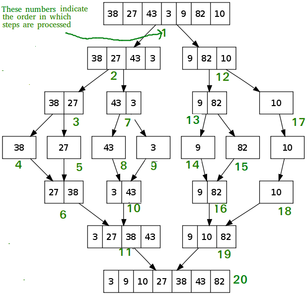

# Bài 2: Thuật Toán Sắp Xếp - Ai Là Vua Tốc Độ?

> **Tác giả:** Hà Trí Kiên
> **Nội dung tham khảo từ:** VNOI Wiki - Thuật toán sắp xếp

## 1. Chuyện gì đang xảy ra?

### Bài toán: Xếp hạng điểm thi

Giả sử trường bạn tổ chức kỳ thi, có **N** học sinh tham gia. Giáo viên cần xếp hạng từ điểm cao nhất đến thấp nhất.

- Nếu N = 10 → Dùng tay cũng sắp xếp được.
- Nếu N = 1.000 → Mất cả buổi!
- Nếu N = 1.000.000 → Không thể làm tay, cần **thuật toán**!

Vậy có những cách nào để sắp xếp? Và cách nào nhanh nhất? Đó chính là nội dung bài này!

---

## 2. Toán học bổ trợ: Giải ngố cấp tốc

### Swap (Đổi chỗ) là gì?

Swap = đổi chỗ 2 phần tử. Ví dụ: đổi chỗ a[3] và a[7].

```cpp
// Cách 1: dùng biến tạm
int temp = a[3];
a[3] = a[7];
a[7] = temp;

// Cách 2: dùng hàm có sẵn (C++)
swap(a[3], a[7]);
```
```python
# Cách 1: dùng biến tạm
temp = a[3]
a[3] = a[7]
a[7] = temp

# Cách 2: Pythonic - đổi chỗ trực tiếp
a[3], a[7] = a[7], a[3]
```

### Sắp xếp ổn định (Stable Sort) là gì?

Giả sử bạn có danh sách học sinh kèm điểm: (An, 8), (Bình, 7), (Chi, 8), (Dũng, 6).

Sắp xếp theo điểm tăng dần:
- **Ổn định:** (Dũng, 6), (Bình, 7), **(An, 8)**, **(Chi, 8)** → An vẫn đứng trước Chi (giữ nguyên thứ tự ban đầu).
- **Không ổn định:** (Dũng, 6), (Bình, 7), **(Chi, 8)**, **(An, 8)** → Chi "chen" lên trước An!

---

## 3. Thuật toán này hoạt động như thế nào?

### Bảng so sánh nhanh 5 thuật toán sắp xếp

| Thuật toán | Độ phức tạp | Ổn định? | Ghi chú |
|-----------|-------------|----------|---------|
| **Nổi bọt** (Bubble Sort) | O(N²) | Có | Đơn giản nhất, chỉ để học |
| **Chèn** (Insertion Sort) | O(N²) | Có | Nhanh khi dữ liệu gần đúng thứ tự |
| **Trộn** (Merge Sort) | O(N log N) | Có | Luôn nhanh, tốn thêm bộ nhớ |
| **Vun đống** (Heap Sort) | O(N log N) | Không | Không tốn bộ nhớ thêm |
| **Nhanh** (Quick Sort) | O(N log N) TB | Không | Nhanh nhất thực tế, worst O(N²) |

### 3.1. Sắp xếp nổi bọt (Bubble Sort) - Con rùa chậm chạp

**Ẩn dụ:** Tưởng tượng bạn đang lặn dưới bể bơi. Bong bóng khí nhỏ nhất sẽ **nổi lên** đầu tiên.

**Cách hoạt động:** So sánh từng cặp liền kề, nếu sai thứ tự thì đổi chỗ. Lặp lại cho đến khi xong.

**Minh họa:** Sắp xếp [5, 3, 8, 1]

```
Bước 1: [5,3,8,1] → so sánh 5,3 → đổi → [3,5,8,1]
         [3,5,8,1] → so sánh 5,8 → đúng → [3,5,8,1]
         [3,5,8,1] → so sánh 8,1 → đổi → [3,5,1,8]  ← 8 "nổi" lên cuối!

Bước 2: [3,5,1,8] → so sánh 3,5 → đúng → [3,5,1,8]
         [3,5,1,8] → so sánh 5,1 → đổi → [3,1,5,8]  ← 5 "nổi" lên!

Bước 3: [3,1,5,8] → so sánh 3,1 → đổi → [1,3,5,8]  ← Xong!
```

**Độ phức tạp:** O(N²) - Chậm, chỉ dùng để học!

### 3.2. Sắp xếp chèn (Insertion Sort) - Xếp bài trên tay

**Ẩn dụ:** Bạn đang chơi bài. Mỗi khi rút 1 lá mới, bạn **chèn** nó vào đúng vị trí trong bộ bài đang cầm trên tay.

**Cách hoạt động:** Xét từng phần tử từ trái sang phải, "chèn" nó vào đúng vị trí trong phần đã sắp xếp bên trái.

**Minh họa:** Sắp xếp [5, 3, 8, 1]

```
Start:  [5, 3, 8, 1]    → phần đã sắp xếp: [5]
Bước 1: [3, 5, 8, 1]    → chèn 3 vào trước 5
Bước 2: [3, 5, 8, 1]    → 8 đã đúng vị trí
Bước 3: [1, 3, 5, 8]    → chèn 1 vào đầu
```

**Độ phức tạp:** O(N²), nhưng **rất nhanh** khi dữ liệu gần đúng thứ tự (ví dụ: cập nhật bảng xếp hạng game khi chỉ có vài người thay đổi điểm).

### 3.3. Sắp xếp trộn (Merge Sort) - Chia để trị!

**Ẩn dụ:** Bạn có 2 bộ bài đã sắp xếp. Việc **trộn** 2 bộ này thành 1 bộ hoàn chỉnh rất dễ: chỉ cần so sánh lá đầu mỗi bộ, lấy lá nhỏ hơn!

**Cách hoạt động:**
1. **Chia** mảng thành 2 nửa
2. **Gọi đệ quy** sắp xếp từng nửa
3. **Trộn** 2 nửa đã sắp xếp lại

**Minh họa:** Sắp xếp [5, 3, 8, 1]



```
           [5, 3, 8, 1]
          /              \
     [5, 3]            [8, 1]
     /    \            /    \
   [5]   [3]        [8]   [1]
     \    /            \    /
     [3, 5]            [1, 8]
          \              /
         [1, 3, 5, 8]    ← Trộn 2 mảng đã sắp xếp!
```

**Tại sao O(N log N)?**
- Cây đệ quy có **log N** tầng (chia đôi mỗi tầng)
- Mỗi tầng tốn **O(N)** để trộn
- Tổng: O(N) × O(log N) = **O(N log N)**

### 3.4. Sắp xếp nhanh (Quick Sort) - Vua tốc độ!

**Ẩn dụ:** Bạn muốn chia lớp thành 2 nhóm: nhóm cao hơn 1m6 và nhóm thấp hơn 1m6. Bạn chọn 1m6 làm "mốc" (pivot), rồi phân loại.

**Cách hoạt động:**
1. **Chọn pivot** (phần tử mốc)
2. **Phân hoạch:** Đưa các phần tử < pivot sang trái, > pivot sang phải
3. **Gọi đệ quy** sắp xếp 2 bên

**Minh họa:**


```
[5, 3, 8, 1, 9, 2, 7]  pivot = 5
Phân hoạch: [3, 1, 2] [5] [8, 9, 7]
Đệ quy trái: [1, 2] [3]    → [1, 2, 3]
Đệ quy phải: [7] [8] [9]   → [7, 8, 9]
Gộp: [1, 2, 3] [5] [7, 8, 9] = [1, 2, 3, 5, 7, 8, 9]
```

**Độ phức tạp:**
- Trung bình: **O(N log N)** - rất nhanh!
- Xấu nhất: O(N²) (khi pivot luôn là max hoặc min) → khắc phục bằng cách **chọn pivot ngẫu nhiên**!

### 3.5. Sắp xếp cơ số (Radix Sort) - Không cần so sánh!

**Ẩn dụ:** Bạn phân loại thư bưu điện: đầu tiên xếp theo thành phố, sau đó xếp theo quận trong mỗi thành phố.

**Cách hoạt động:** Sắp xếp theo từng chữ số, từ chữ số hàng đơn vị → hàng chục → hàng trăm...

**Độ phức tạp:** O(N × K) với K = số chữ số. Nhanh hơn O(N log N) khi K nhỏ!

---

## 4. Bắt tay vào Code nào!

### Code C++: 3 thuật toán quan trọng nhất

```cpp
#include <bits/stdc++.h>
using namespace std;

// ===== 1. INSERTION SORT - O(N²) =====
void insertionSort(int a[], int n) {
    for (int i = 1; i < n; i++) {
        int key = a[i];       // Lá bài mới cần chèn
        int j = i - 1;
        // Dời các lá bài lớn hơn key sang phải
        while (j >= 0 && a[j] > key) {
            a[j + 1] = a[j];
            j--;
        }
        a[j + 1] = key;       // Chèn key vào đúng vị trí
    }
}

// ===== 2. MERGE SORT - O(N log N) =====
int temp[1000001]; // Mảng tạm để trộn

void merge(int a[], int left, int mid, int right) {
    int i = left, j = mid + 1, k = 0;
    
    // So sánh từng cặp, lấy phần tử nhỏ hơn
    while (i <= mid && j <= right) {
        if (a[i] <= a[j])
            temp[k++] = a[i++];
        else
            temp[k++] = a[j++];
    }
    
    // Copy phần còn lại (nếu có)
    while (i <= mid) temp[k++] = a[i++];
    while (j <= right) temp[k++] = a[j++];
    
    // Copy mảng tạm về mảng gốc
    for (int i = 0; i < k; i++)
        a[left + i] = temp[i];
}

void mergeSort(int a[], int left, int right) {
    if (left >= right) return;      // Mảng 1 phần tử → đã sắp xếp
    
    int mid = (left + right) / 2;   // Chia đôi
    mergeSort(a, left, mid);        // Sắp xếp nửa trái
    mergeSort(a, mid + 1, right);   // Sắp xếp nửa phải
    merge(a, left, mid, right);     // Trộn 2 nửa
}

// ===== 3. QUICK SORT - O(N log N) trung bình =====
void quickSort(int a[], int left, int right) {
    if (left >= right) return;
    
    // Chọn pivot ngẫu nhiên để tránh worst case
    int pivotIdx = left + rand() % (right - left + 1);
    swap(a[left], a[pivotIdx]);
    int pivot = a[left];
    
    int i = left + 1, j = right;
    while (i <= j) {
        while (i <= j && a[i] < pivot) i++;   // Tìm phần tử >= pivot
        while (i <= j && a[j] > pivot) j--;   // Tìm phần tử <= pivot
        if (i <= j) {
            swap(a[i], a[j]);
            i++; j--;
        }
    }
    swap(a[left], a[j]);  // Đặt pivot vào đúng vị trí
    
    quickSort(a, left, j - 1);   // Sắp xếp bên trái
    quickSort(a, j + 1, right);  // Sắp xếp bên phải
}

int main() {
    int n;
    cin >> n;
    int a[n];
    for (int i = 0; i < n; i++) cin >> a[i];
    
    // Chọn 1 trong 3 cách:
    // insertionSort(a, n);    // O(N²) - chỉ dùng khi N nhỏ
    // mergeSort(a, 0, n-1);   // O(N log N) - luôn ổn định
    quickSort(a, 0, n-1);     // O(N log N) - nhanh nhất thực tế
    
    for (int i = 0; i < n; i++) cout << a[i] << " ";
    return 0;
}
```

### Code C++: Dùng thư viện (đơn giản nhất!)

```cpp
#include <bits/stdc++.h>
using namespace std;

int main() {
    int n;
    cin >> n;
    int a[n];
    for (int i = 0; i < n; i++) cin >> a[i];
    
    // Sắp xếp tăng dần - O(N log N)
    sort(a, a + n);
    
    // Sắp xếp giảm dần
    sort(a, a + n, greater<int>());
    
    // Sắp xếp mảng vector
    vector<int> v = {5, 3, 8, 1, 9};
    sort(v.begin(), v.end());
    
    for (int x : a) cout << x << " ";
    return 0;
}
```

### Code Python

```python
# ===== Dùng thư viện - đơn giản nhất =====
n = int(input())
a = list(map(int, input().split()))
a.sort()                    # Tăng dần
a.sort(reverse=True)        # Giảm dần
print(*a)

# ===== Merge Sort tự cài =====
def merge_sort(a):
    if len(a) <= 1:
        return a
    
    mid = len(a) // 2
    left = merge_sort(a[:mid])       # Sắp xếp nửa trái
    right = merge_sort(a[mid:])      # Sắp xếp nửa phải
    
    # Trộn 2 nửa
    result = []
    i = j = 0
    while i < len(left) and j < len(right):
        if left[i] <= right[j]:
            result.append(left[i])
            i += 1
        else:
            result.append(right[j])
            j += 1
    
    result.extend(left[i:])    # Phần còn lại bên trái
    result.extend(right[j:])   # Phần còn lại bên phải
    return result

# ===== Quick Sort tự cài =====
import random

def quick_sort(a):
    if len(a) <= 1:
        return a
    
    pivot = random.choice(a)    # Chọn pivot ngẫu nhiên
    left = [x for x in a if x < pivot]
    middle = [x for x in a if x == pivot]
    right = [x for x in a if x > pivot]
    
    return quick_sort(left) + middle + quick_sort(right)
```

---

## 5. Lưu ý / Cạm bẫy hay gặp

### Bẫy 1: Dùng Insertion Sort khi N lớn

N = 100.000 mà dùng Insertion Sort (O(N²)) → 10¹⁰ phép tính → **TLE ngay!**

**Quy tắc:**
- N ≤ 1.000 → Insertion Sort OK
- N ≤ 10⁵ → Merge Sort / Quick Sort
- N ≤ 10⁶ → Dùng `sort()` thư viện

### Bẫy 2: Quick Sort worst case

Nếu pivot luôn chọn phần tử nhỏ nhất (hoặc lớn nhất), Quick Sort thoái hóa thành O(N²).

**Khắc phục:** Luôn chọn pivot **ngẫu nhiên**!

### Bẫy 3: Tràn bộ nhớ với Merge Sort

Merge Sort cần mảng tạm kích thước O(N). Nếu N = 10⁶ và mỗi số là 4 bytes → cần khoảng 4MB. Không quá nhiều, nhưng nếu N = 10⁸ thì cần 400MB → có thể **tràn bộ nhớ**!

### Bẫy 4: So sánh số thực (double) khi sắp xếp

```cpp
// SAI: so sánh double bằng == không chính xác
if (a[i] == a[j]) ...

// ĐÚNG: so sánh với sai số nhỏ (epsilon)
if (abs(a[i] - a[j]) < 1e-9) ...
```
```python
# SAI: so sánh float bằng == không chính xác
if a[i] == a[j]: ...

# ĐÚNG: so sánh với sai số nhỏ (epsilon)
if abs(a[i] - a[j]) < 1e-9: ...
```

### Mẹo thi cử: Khi nào dùng thuật toán nào?

| Tình huống | Nên dùng |
|-----------|----------|
| Chỉ cần sắp xếp mảng | `sort()` thư viện |
| N ≤ 1.000, code đơn giản | Insertion Sort |
| Cần ổn định + O(N log N) | Merge Sort |
| Nhanh nhất thực tế | Quick Sort (pivot ngẫu nhiên) |
| Sắp xếp số nguyên nhỏ | Radix Sort (O(N)) |

---

---

## Bài tập luyện tập

| Bài | Nền tảng | Độ khó | Chủ đề |
|-----|----------|--------|--------|
| [CSES - Distinct Numbers](https://cses.fi/problemset/task/1621) | CSES | ⭐ | Sắp xếp + đếm |
| [CSES - Apartments](https://cses.fi/problemset/task/1084) | CSES | ⭐⭐ | Sắp xếp + tham lam |
| [CSES - Ferris Wheel](https://cses.fi/problemset/task/1090) | CSES | ⭐⭐ | Sắp xếp + hai con trỏ |
| [LeetCode - Sort an Array](https://leetcode.com/problems/sort-an-array/) | LC | ⭐⭐ | Cài đặt sắp xếp |

## Bài viết liên quan

- [Bài 1: Độ phức tạp thời gian](01-do-phuc-tap-thoi-gian.md)
- [Bài 4: Kĩ thuật hai con trỏ](04-ky-thuat-hai-con-tro.md)
- [Bài 21: Greedy](21-greedy.md)

## Tài liệu tham khảo

- [VNOI Wiki - Thuật toán sắp xếp](https://wiki.vnoi.info/algo/basic/sorting)
- [VisuAlgo - Sorting](https://visualgo.net/sorting)
- [GeeksforGeeks - Sorting Algorithms](https://www.geeksforgeeks.org/dsa/sorting-algorithms/)
- [YouTube - Sorting Algorithms Visualized](https://www.youtube.com/watch?v=kPRA0W1kECg)
- [Toptal - Sorting Algorithms Animations](https://www.toptal.com/developers/sorting-algorithms)

**Bài tiếp theo:** [Tìm kiếm nhị phân →](03-tim-kiem-nhi-phan.md)
