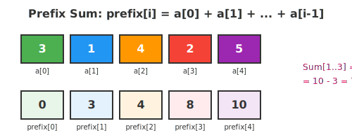

# Bài 7: Mảng, Danh Sách Liên Kết và Stack

> **Tác giả:** Hà Trí Kiên<br>
> **Nội dung tham khảo từ:** VNOI Wiki - Mảng và danh sách liên kết, Stack, Mảng cộng dồn và mảng hiệu

## 1. Mảng vs Danh sách liên kết

### Ẩn dụ: Dãy ghế trong rạp chiếu phim vs Xích đu nối đuôi

**Mảng (Array)** = Dãy ghế trong rạp: mỗi ghế có số thứ tự cố định. Muốn ngồi ghế số 5 → đi thẳng đến ghế 5. Nhưng muốn thêm 1 ghế vào giữa → phải dời cả dãy!

**Danh sách liên kết (Linked List)** = Xích đu nối đuôi nhau: mỗi xích đu biết "xích đu tiếp theo là ai". Muốn thêm 1 xích đu → chỉ cần nối lại. Nhưng muốn tìm xích đu số 5 → phải đu từ đầu!

| Thao tác | Mảng | Danh sách liên kết |
|----------|------|---------------------|
| Truy cập phần tử thứ i | **O(1)** | O(N) |
| Thêm/xóa ở đầu | O(N) | **O(1)** |
| Thêm/xóa ở cuối | O(1) | O(1) (nếu biết con trỏ cuối) |
| Thêm/xóa ở giữa | O(N) | O(1) (nếu đã có con trỏ đến node) |

### Code C++: Danh sách liên kết đơn giản

```cpp
struct Node {
    int data;        // Dữ liệu
    Node* next;      // Con trỏ trỏ đến node tiếp theo
};

// Thêm node mới vào đầu danh sách - O(1)
Node* addFirst(Node* head, int value) {
    Node* newNode = new Node();
    newNode->data = value;
    newNode->next = head;    // Trỏ đến node cũ
    return newNode;          // Node mới là head
}

// Duyệt toàn bộ danh sách - O(N)
void printList(Node* head) {
    Node* cur = head;
    while (cur != NULL) {
        cout << cur->data << " ";
        cur = cur->next;
    }
}
```

### Code Python

```python
class Node:
    def __init__(self, data):
        self.data = data
        self.next = None

# Thêm node vào đầu - O(1)
def add_first(head, value):
    new_node = Node(value)
    new_node.next = head
    return new_node
```

---

## 2. Stack (Ngăn xếp)

### Ẩn dụ: Chồng dĩa trong nhà hàng

Bạn đang rửa dĩa và xếp chồng lên nhau. Khi cần lấy dĩa → chỉ lấy được **dĩa trên cùng**! (= dĩa được xếp vào sau cùng)

**LIFO** = Last In, First Out (Vào sau, ra trước)

### Các thao tác cơ bản

| Thao tác | Ý nghĩa | Độ phức tạp |
|----------|----------|-------------|
| `push(x)` | Thêm x vào đỉnh stack | O(1) |
| `pop()` | Loại bỏ phần tử ở đỉnh | O(1) |
| `top()` | Xem phần tử ở đỉnh | O(1) |
| `empty()` | Kiểm tra stack rỗng | O(1) |

### Ứng dụng 1: Kiểm tra dãy ngoặc đúng

```cpp
bool isValid(string s) {
    stack<char> st;
    for (char c : s) {
        if (c == '(') {
            st.push(c);              // Thêm dấu mở ngoặc
        } else {
            if (st.empty()) return false;  // Không có dấu mở!
            st.pop();                // Ghép cặp
        }
    }
    return st.empty();  // Còn dấu mở → sai
}
```

### Ứng dụng 2: Stack đơn điệu - Tìm phần tử lớn hơn bên trái

**Bài toán:** Với mỗi phần tử a[i], tìm phần tử lớn hơn **gần nhất** ở bên trái của nó.

**Tại sao Stack đơn điệu hoạt động?**
- Ta duy trì stack luôn giảm dần từ dưới lên trên
- Khi xét `a[i]`, mọi phần tử trên stack nhỏ hơn `a[i]` **sẽ không bao giờ là đáp án** cho bất kỳ `a[j]` nào (j ≥ i), vì `a[i]` to hơn mà lại gần hơn → an tâm pop ra!
- Phần tử đầu stack sau khi pop là phần tử lớn hơn gần nhất
- Độ phức tạp: O(N) vì mỗi phần tử push/pop tối đa 1 lần!

```cpp
// Với mỗi phần tử, tìm phần tử lớn hơn gần nhất bên trái
vector<int> findGreater(vector<int>& a) {
    stack<int> st;
    vector<int> result(a.size(), -1);
    
    for (int i = 0; i < a.size(); i++) {
        // Loại bỏ các phần tử nhỏ hơn hoặc bằng
        while (!st.empty() && st.top() <= a[i])
            st.pop();
        
        if (!st.empty())
            result[i] = st.top();   // Phần tử lớn hơn gần nhất
        
        st.push(a[i]);              // Thêm phần tử hiện tại
    }
    return result;
}
// Độ phức tạp: O(N) - mỗi phần tử push/pop tối đa 1 lần!
```

### Code Python

```python
# Với mỗi phần tử, tìm phần tử lớn hơn gần nhất bên trái
def find_greater(a):
    st = []
    result = [-1] * len(a)
    
    for i in range(len(a)):
        # Loại bỏ các phần tử nhỏ hơn hoặc bằng
        while st and st[-1] <= a[i]:
            st.pop()
        
        if st:
            result[i] = st[-1]      # Phần tử lớn hơn gần nhất
        
        st.append(a[i])             # Thêm phần tử hiện tại
    return result
# Độ phức tạp: O(N) - mỗi phần tử push/pop tối đa 1 lần!
```

### Code Python: Kiểm tra dãy ngoặc đúng

```python
# Kiểm tra dãy ngoặc đúng
def is_valid(s):
    st = []
    for c in s:
        if c == '(':
            st.append(c)
        else:
            if not st: return False
            st.pop()
    return len(st) == 0
```

---

## 3. Mảng cộng dồn (Prefix Sum)



### Ẩn dụ: Tổng quãng đường

Bạn đi xe từ điểm A → B → C → D. Thay vì tính lại quãng đường mỗi lần, bạn **ghi nhớ tổng quãng đường từ đầu đến mỗi điểm**:

- Đến A: 5km
- Đến B: 5+3 = 8km  
- Đến C: 8+7 = 15km

Muốn biết quãng đường từ B đến C? → 15 - 8 = 7km!

### Công thức

```
prefix[0] = 0
prefix[i] = prefix[i-1] + a[i-1]

Tổng đoạn [l, r] = prefix[r+1] - prefix[l]
```

### Code C++

```cpp
// Dựng mảng cộng dồn
vector<int> buildPrefixSum(vector<int>& a) {
    int n = a.size();
    vector<int> prefix(n + 1, 0);
    for (int i = 0; i < n; i++)
        prefix[i + 1] = prefix[i] + a[i];
    return prefix;
}

// Tính tổng đoạn [l, r] - O(1)
int rangeSum(vector<int>& prefix, int l, int r) {
    return prefix[r + 1] - prefix[l];
}
```
```python
# Dựng mảng cộng dồn
def build_prefix_sum(a):
    prefix = [0] * (len(a) + 1)
    for i in range(len(a)):
        prefix[i + 1] = prefix[i] + a[i]
    return prefix

# Tính tổng đoạn [l, r] - O(1)
def range_sum(prefix, l, r):
    return prefix[r + 1] - prefix[l]
```

### Ứng dụng: Prefix Sum 2D (Tổng hình chữ nhật)

Ngoài mảng 1 chiều, prefix sum có thể mở rộng sang 2 chiều, giúp tính tổng bất kỳ hình chữ nhật con trong lưới trong O(1).

**Công thức:**
```
prefix2D[i][j] = tổng hình chữ nhật từ (0,0) đến (i-1, j-1)

prefix2D[i][j] = a[i-1][j-1]
              + prefix2D[i-1][j]
              + prefix2D[i][j-1]
              - prefix2D[i-1][j-1]  ← bắt đầu (i-1,j-1) bị đếm 2 lần

Tổng hình chữ nhật từ (r1,c1) đến (r2,c2):
= prefix2D[r2+1][c2+1] - prefix2D[r1][c2+1]
                       - prefix2D[r2+1][c1]
                       + prefix2D[r1][c1]
```

```cpp
// Xây dựng prefix sum 2D
int a[MAXN][MAXN], prefix[MAXN][MAXN];

void build2D(int n, int m) {
    for (int i = 1; i <= n; i++)
        for (int j = 1; j <= m; j++)
            // Công thức bao gồm - loại trừ (inclusion-exclusion)
            prefix[i][j] = a[i][j]
                         + prefix[i-1][j]
                         + prefix[i][j-1]
                         - prefix[i-1][j-1];
}

// Tổng hình chữ nhật (r1,c1) → (r2,c2) - O(1)
int query2D(int r1, int c1, int r2, int c2) {
    return prefix[r2][c2]
         - prefix[r1-1][c2]
         - prefix[r2][c1-1]
         + prefix[r1-1][c1-1];
}
```
```python
def build_2d(a, n, m):
    prefix = [[0] * (m + 1) for _ in range(n + 1)]
    for i in range(1, n + 1):
        for j in range(1, m + 1):
            prefix[i][j] = (a[i-1][j-1]
                           + prefix[i-1][j]
                           + prefix[i][j-1]
                           - prefix[i-1][j-1])
    return prefix

def query_2d(prefix, r1, c1, r2, c2):
    return (prefix[r2][c2]
          - prefix[r1-1][c2]
          - prefix[r2][c1-1]
          + prefix[r1-1][c1-1])
```

**Ứng dụng:** Đếm ô màu đen trong hình chữ nhật con của lưới, tính tổng pixel trong xử lý ảnh (integral image).

### Ứng dụng: Tìm đoạn con có tổng lớn nhất (Kadane's Algorithm)

**Ý tưởng:** Với mỗi vị trí i, hỏi "nếu buộc phải đến i, đoạn tốt nhất bắt đầu từ đâu?". Nếu `curSum < 0` thì bố mọi thứ trước, bắt đầu lại từ a[i].

```cpp
long long maxSubarraySum(vector<int>& a) {
    long long maxSum = a[0], curSum = a[0];
    for (int i = 1; i < a.size(); i++) {
        curSum = max((long long)a[i], curSum + a[i]);
        maxSum = max(maxSum, curSum);
    }
    return maxSum;
}
```
```python
def max_subarray_sum(a):
    max_sum = cur_sum = a[0]
    for i in range(1, len(a)):
        cur_sum = max(a[i], cur_sum + a[i])
        max_sum = max(max_sum, cur_sum)
    return max_sum
```

---

## 4. Mảng hiệu (Difference Array)

### Ẩn dụ: Cập nhật nhiệt độ

Bạn có nhiệt độ 7 ngày: [20, 22, 25, 23, 21, 24, 26]. Giả sử từ ngày 2 đến ngày 5, nhiệt độ tăng thêm 3 độ.

Thay vì cập nhật từng ngày, bạn chỉ cần ghi nhận: "Tại ngày 2: +3, Tại ngày 6: -3". Sau đó tính mảng cộng dồn lại!

### Code C++

```cpp
// Cập nhật đoạn [l, r] thêm k - O(1)
void update(vector<int>& diff, int l, int r, int k) {
    diff[l] += k;
    if (r + 1 < diff.size())
        diff[r + 1] -= k;
}

// Khôi phục mảng gốc từ mảng hiệu - O(N)
vector<int> restoreArray(vector<int>& diff) {
    vector<int> a(diff.size());
    a[0] = diff[0];
    for (int i = 1; i < diff.size(); i++)
        a[i] = a[i - 1] + diff[i];
    return a;
}
```
```python
# Cập nhật đoạn [l, r] thêm k - O(1)
def update(diff, l, r, k):
    diff[l] += k
    if r + 1 < len(diff):
        diff[r + 1] -= k

# Khôi phục mảng gốc từ mảng hiệu - O(N)
def restore_array(diff):
    a = [0] * len(diff)
    a[0] = diff[0]
    for i in range(1, len(diff)):
        a[i] = a[i - 1] + diff[i]
    return a
```

### Bài tập minh họa: Karen and Coffee (Codeforces 816B)

Có n truy vấn "tăng nhiệt độ đoạn [l,r] thêm 1". Sau đó hỏi: có bao nhiêu vị trí có giá trị ≥ k?

```cpp
int main() {
    int n, k, q;
    cin >> n >> k >> q;
    
    vector<int> diff(200002, 0);
    
    // Xử lý n truy vấn cập nhật - O(1) mỗi truy vấn
    for (int i = 0; i < n; i++) {
        int l, r; cin >> l >> r;
        diff[l]++;
        diff[r + 1]--;
    }
    
    // Khôi phục mảng và tính mảng cộng dồn
    vector<int> a(200002, 0), prefix(200002, 0);
    for (int i = 1; i <= 200000; i++) {
        a[i] = a[i - 1] + diff[i];
        prefix[i] = prefix[i - 1] + (a[i] >= k);
    }
    
    // Trả lời q câu hỏi - O(1) mỗi câu
    for (int i = 0; i < q; i++) {
        int l, r; cin >> l >> r;
        cout << prefix[r] - prefix[l - 1] << endl;
    }
}
```
```python
import sys
input = sys.stdin.readline

n, k, q = map(int, input().split())
diff = [0] * 200002

# Xử lý n truy vấn cập nhật - O(1) mỗi truy vấn
for _ in range(n):
    l, r = map(int, input().split())
    diff[l] += 1
    diff[r + 1] -= 1

# Khôi phục mảng và tính mảng cộng dồn
a = [0] * 200002
prefix = [0] * 200002
for i in range(1, 200001):
    a[i] = a[i - 1] + diff[i]
    prefix[i] = prefix[i - 1] + (1 if a[i] >= k else 0)

# Trả lời q câu hỏi - O(1) mỗi câu
for _ in range(q):
    l, r = map(int, input().split())
    print(prefix[r] - prefix[l - 1])
```

---

## 5. Lưu ý / Cạm bẫy

### 5.1. Prefix Sum: 1-indexed vs 0-indexed

```cpp
// CÁCH 1: prefix[0] = 0 (khuyến khích)
// prefix[i] = tổng a[0..i-1]
// Tổng [l, r] = prefix[r+1] - prefix[l]
vector<int> prefix(n + 1, 0);
for (int i = 0; i < n; i++)
    prefix[i + 1] = prefix[i] + a[i];
int sumLR = prefix[r + 1] - prefix[l];

// CÁCH 2: prefix[i] = tổng a[0..i]
// Tổng [l, r] = prefix[r] - (l > 0 ? prefix[l-1] : 0)
vector<int> prefix(n);
prefix[0] = a[0];
for (int i = 1; i < n; i++)
    prefix[i] = prefix[i - 1] + a[i];
int sumLR = prefix[r] - (l > 0 ? prefix[l - 1] : 0);
```

**Lỗi thường gặp:** Quên `l > 0` ở cách 2 → truy cập `prefix[-1]`!

### 5.2. Overflow khi tính Prefix Sum

```cpp
// SAI: tổng có thể vượt quá int
int prefix[MAXN];  // int chỉ đến ~2×10^9

// ĐÚNG: dùng long long
long long prefix[MAXN];
```

**Quy tắc:** Nếu `a[i]` có thể đến 10^9 và N đến 10^5 → tổng lớn nhất ~10^14 → PHẢI dùng `long long`!

### 5.3. Difference Array: Quên xét r+1 ra ngoài mảng

```cpp
// Cập nhật [l, r] += k
diff[l] += k;
if (r + 1 < n)      // PHẢI kiểm tra!
    diff[r + 1] -= k;
// Nếu quên kiểm tra → truy cập ngoài mảng → Runtime Error!
```

### 5.4. Difference Array: Quên khôi phục

```cpp
// Sau khi cập nhật diff[], PHẢI khôi phục mảng gốc:
a[0] = diff[0];
for (int i = 1; i < n; i++)
    a[i] = a[i - 1] + diff[i];
// Nếu quên khôi phục mà dùng diff[] trực tiếp → KẾT QUẢ SAI!
```

### 5.5. Stack: Quên kiểm tra rỗng

```cpp
// SAI: pop khi stack rỗng → Runtime Error!
st.pop();

// ĐÚNG: kiểm tra trước
if (!st.empty()) st.pop();
```

### 5.6. Kadane's Algorithm: Mảng toàn số âm

```cpp
// Nếu mảng toàn số âm, Kadane's trả về phần tử lớn nhất (vẫn âm)
// Nếu muốn "đoạn con rỗng có tổng = 0":
long long maxSubarraySum(vector<int>& a) {
    long long maxSum = 0, curSum = 0;
    for (int x : a) {
        curSum = max(0LL, curSum + x);  // Reset về 0 nếu âm
        maxSum = max(maxSum, curSum);
    }
    return maxSum;
}
```

---

## 6. Bài tập luyện tập

| Bài | Nền tảng | Độ khó | Chủ đề |
|-----|----------|--------|--------|
| [CSES - Static Range Sum Queries](https://cses.fi/problemset/task/1646) | CSES | ⭐ | Prefix Sum |
| [CSES - Static Range Minimum Queries](https://cses.fi/problemset/task/1647) | CSES | ⭐ | Sparse Table |
| [CSES - Dynamic Range Sum Queries](https://cses.fi/problemset/task/1648) | CSES | ⭐⭐ | BIT / Segment Tree |
| [CSES - Forest Queries](https://cses.fi/problemset/task/1652) | CSES | ⭐⭐ | Prefix Sum 2D |
| [CSES - Salary Queries](https://cses.fi/problemset/task/1144) | CSES | ⭐⭐⭐ | BIT + Coordinate Compression |
| [LeetCode - Range Sum Query](https://leetcode.com/problems/range-sum-query-immutable/) | LeetCode | ⭐ | Prefix Sum cơ bản |
| [LeetCode - Subarray Sum Equals K](https://leetcode.com/problems/subarray-sum-equals-k/) | LeetCode | ⭐⭐ | Prefix Sum + HashMap |
| [LeetCode - Product of Array Except Self](https://leetcode.com/problems/product-of-array-except-self/) | LeetCode | ⭐⭐ | Prefix/Suffix Sum |
| [Codeforces 816B - Karen and Coffee](https://codeforces.com/problemset/problem/816/B) | CF | ⭐⭐ | Difference Array |
| [VNOJ - QSUM](https://oj.vnoi.info/problem/qsum) | VNOJ | ⭐⭐ | Prefix Sum |

---

## Tài liệu tham khảo

- [VNOI Wiki - Mảng và danh sách liên kết](https://wiki.vnoi.info/algo/data-structures/array-vs-linked-lists)
- [VNOI Wiki - Stack](https://wiki.vnoi.info/algo/data-structures/Stack)
- [VNOI Wiki - Mảng cộng dồn và mảng hiệu](https://wiki.vnoi.info/algo/data-structures/prefix-sum-and-difference-array)
- [GeeksforGeeks - Prefix Sum Array](https://www.geeksforgeeks.org/dsa/prefix-sum-array-implementation-applications-competitive-programming/)
- [YouTube - Prefix Sum (takeuforward)](https://www.youtube.com/watch?v=7pYJ6mYCEQs)

**Bài tiếp theo:** [Heap, DSU, Segment Tree, BIT →](08-heap-dsu-segment-tree-bit.md)
