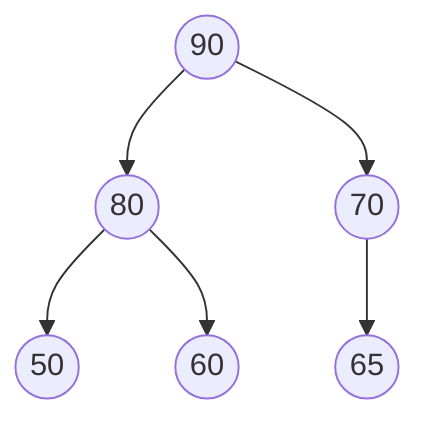
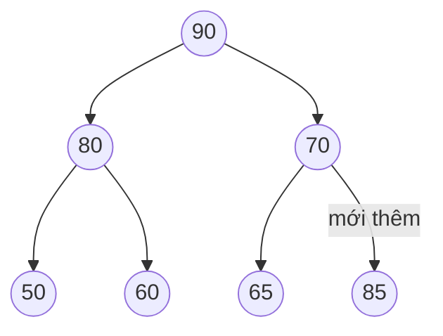
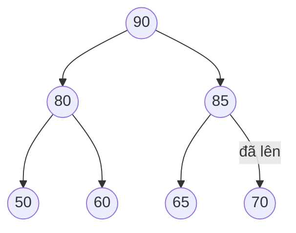
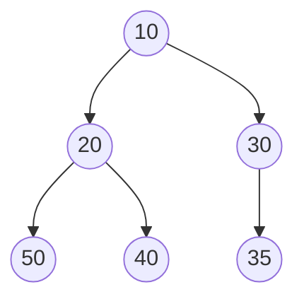

# Bài 8a: Heap (Đống) - Hàng Đợi Ưu Tiên

> **Tác giả:** Hà Trí Kiên<br>
> **Nội dung tham khảo từ:** VNOI Wiki - Binary Heap

---

## 1. Bài toán

Bạn có N bệnh nhân, mỗi người có mức độ nặng khác nhau. Ai nặng nhất → khám trước! Không phải FIFO (vào trước ra trước) mà là **ai ưu tiên nhất ra trước!**

Đây là mô hình **hàng đợi ưu tiên (Priority Queue)** — khác với hàng đợi thường (queue).

## 2. So sánh: Queue vs Priority Queue

| | Queue (hàng đợi thường) | Priority Queue (hàng đợi ưu tiên) |
|--|------------------------|-----------------------------------|
| Nguyên tắc | FIFO: Vào trước, ra trước | Ưu tiên nhất ra trước |
| Thao tác thêm | O(1) | O(log N) |
| Thao tác lấy | O(1) | O(log N) |
| Lấy min/max | O(N) | **O(1)** |
| Ví dụ | Hàng người xếp vé | Bệnh viện cấp cứu |

## 3. Binary Heap là gì?

Binary Heap là cách cài đặt Priority Queue bằng **cây nhị phân đầy đủ** lưu trong mảng.

**Hai tính chất quan trọng:**

1. **Cây nhị phân đầy đủ:** Mỗi nút có tối đa 2 con. Các tầng được lấp đầy từ trái sang phải.
2. **Tính chất đống:** Nút cha luôn lớn hơn (max-heap) hoặc nhỏ hơn (min-heap) cả 2 con.

## 4. Tại sao lưu trong mảng?

Thay vì dùng con trỏ (như cây nhị phân thường), Binary Heap lưu trực tiếp trong mảng:

```
Mảng: [90, 80, 70, 50, 60, 65]
Chỉ số: 0   1   2   3   4   5

Quy tắc: Với nút tại chỉ số i:
  - Con trái:  2*i + 1
  - Con phải:  2*i + 2
  - Cha:       (i - 1) / 2
```

Cây tương ứng:



**Tại sao hay?** Không cần con trỏ! Truy cập con/cha chỉ bằng phép tính chỉ số → O(1), tiết kiệm bộ nhớ.

<p align="center"><br><em>Minh họa thao tác trên Heap (Nguồn: VisuAlgo)</em></p>

## 5. Hai thao tác cốt lõi

### 5.1. Thao tác "đẩy lên" (sift-up / bubble-up) — khi thêm phần tử

**Bước 1:** Thêm phần tử vào cuối mảng (vị trí lá cuối cùng)

**Bước 2:** So sánh với cha. Nếu vi phạm tính chất đống → đổi chỗ với cha

**Lặp lại** bước 2 cho đến khi đúng vị trí

**Ví dụ: Thêm 85 vào max-heap [90, 80, 70, 50, 60, 65]:**



Mảng: `[90, 80, 70, 50, 60, 65, 85]`



Mảng: `[90, 80, 85, 50, 60, 65, 70]`

Bước 3: 85 > cha(90)? → Sai! Dừng.

Kết quả: `[90, 80, 85, 50, 60, 65, 70]`

**Độ phức tạp:** O(log N) — cao nhất bằng chiều cao cây = log₂(N)

### 5.2. Tại sao sift-up là O(log N)?

Mỗi lần sift-up, phần tử di chuyển lên **đúng 1 tầng**. Cây nhị phân đầy đủ N nút có chiều cao chính xác là **⌊log₂(N)⌋**.

- N = 7 → chiều cao 2 → sift-up tối đa 2 lần
- N = 15 → chiều cao 3 → sift-up tối đa 3 lần
- N = 10⁶ → chiều cao ~20 → sift-up tối đa 20 lần

Đây là lý do Heap rất nhanh trong thực tế: dù N lớn, số bước sift-up vẫn rất nhỏ.

### 5.3. Thao tác "đẩy xuống" (sift-down / heapify) — khi lấy phần tử lớn nhất

**Bước 1:** Lấy phần tử gốc (lớn nhất) ra

**Bước 2:** Đưa phần tử cuối cùng lên gốc

**Bước 3:** So sánh với 2 con. Đổi chỗ với con lớn hơn. Lặp lại cho đến khi đúng

**Ví dụ: Lấy max từ heap [90, 80, 85, 50, 60, 65, 70]:**

Bước 1: Lấy 90 ra. Đưa 70 lên gốc → `[70, 80, 85, 50, 60, 65]`


Mảng: `[85, 80, 70, 50, 60, 65]`

Bước 3: 70 < con lớn nhất(65)? → Sai! Dừng.

Kết quả: Heap = `[85, 80, 70, 50, 60, 65]`, trả về 90

## 6. Code: Heap

=== "C++ (thủ công)"

    ```cpp
    struct MaxHeap {
        vector<int> a;  // Mảng lưu heap, a[0] là phần tử lớn nhất

        // Tính chỉ số con trái, con phải, cha dựa trên công thức cây nhị phân
        int left(int i)  { return 2 * i + 1; }     // Con trái của nút i
        int right(int i) { return 2 * i + 2; }     // Con phải của nút i
        int parent(int i) { return (i - 1) / 2; }  // Cha của nút i

        // Thêm phần tử vào heap — O(log N)
        void push(int val) {
            a.push_back(val);          // Bước 1: Thêm vào cuối mảng (lá cuối cùng)
            // Bước 2: Sift-up — đẩy phần tử mới lên cho đến khi đúng vị trí
            int i = a.size() - 1;      // Chỉ số phần tử vừa thêm
            while (i > 0 && a[parent(i)] < a[i]) {  // Nếu cha nhỏ hơn con → vi phạm max-heap
                swap(a[parent(i)], a[i]);            // Đổi chỗ cha và con
                i = parent(i);                       // Di chuyển lên tầng trên
            }
        }

        // Lấy và xóa phần tử lớn nhất — O(log N)
        int pop() {
            int maxVal = a[0];         // Phần tử lớn nhất luôn ở gốc (a[0])
            a[0] = a.back();           // Đưa phần tử cuối lên thay thế gốc
            a.pop_back();              // Xóa phần tử cuối (đã chuyển lên gốc)

            // Bước 3: Sift-down — đẩy phần tử mới ở gốc xuống cho đến khi đúng vị trí
            heapify(0);
            return maxVal;             // Trả về giá trị lớn nhất đã lấy
        }

        // Đẩy xuống từ chỉ số i — khôi phục tính chất đống
        void heapify(int i) {
            int largest = i;           // Giả sử nút hiện tại là lớn nhất
            int l = left(i);           // Chỉ số con trái
            int r = right(i);          // Chỉ số con phải

            // So sánh với con trái (nếu tồn tại)
            if (l < (int)a.size() && a[l] > a[largest])
                largest = l;
            // So sánh với con phải (nếu tồn tại)
            if (r < (int)a.size() && a[r] > a[largest])
                largest = r;

            // Nếu con lớn hơn cha → đổi chỗ và tiếp tục đẩy xuống
            if (largest != i) {
                swap(a[i], a[largest]);    // Đổi chỗ với con lớn nhất
                heapify(largest);          // Đệ quy tiếp tục đẩy xuống
            }
        }

        int top() { return a[0]; }        // Xem phần tử lớn nhất — O(1), không xóa
        int size() { return a.size(); }   // Số phần tử trong heap
        bool empty() { return a.empty(); } // Kiểm tra heap rỗng
    };
    ```

=== "C++ (thư viện)"

    ```cpp
    #include <queue>
    #include <iostream>
    using namespace std;

    int main() {
        // Max-Heap (mặc định trong C++ — phần tử lớn nhất ở top)
        priority_queue<int> maxHeap;
        maxHeap.push(5);    // Thêm 5 — O(log N)
        maxHeap.push(10);   // Thêm 10
        maxHeap.push(3);    // Thêm 3
        cout << maxHeap.top();  // 10 (phần tử lớn nhất) — O(1)
        maxHeap.pop();          // Xóa phần tử lớn nhất — O(log N)

        // Min-Heap (dùng greater<> — phần tử nhỏ nhất ở top)
        priority_queue<int, vector<int>, greater<int>> minHeap;
        minHeap.push(5);
        minHeap.push(10);
        minHeap.push(3);
        cout << minHeap.top();  // 3 (phần tử nhỏ nhất)
    }
    ```

=== "Python"

    ```python
    import heapq

    # Python CHỈ có min-heap. Muốn max-heap → đảo dấu!

    # Min-Heap
    minHeap = []
    heapq.heappush(minHeap, 5)    # Thêm 5 — O(log N)
    heapq.heappush(minHeap, 10)   # Thêm 10
    heapq.heappush(minHeap, 3)    # Thêm 3
    print(minHeap[0])              # 3 (phần tử nhỏ nhất) — O(1)
    heapq.heappop(minHeap)         # Xóa phần tử nhỏ nhất — O(log N)

    # Max-Heap (mẹo: đảo dấu khi push, đảo dấu lại khi pop)
    maxHeap = []
    heapq.heappush(maxHeap, -5)    # Push -5 (thay vì 5)
    heapq.heappush(maxHeap, -10)   # Push -10 (thay vì 10)
    heapq.heappush(maxHeap, -3)    # Push -3 (thay vì 3)
    print(-maxHeap[0])              # 10 (phần tử lớn nhất) — nhớ đảo dấu lại!
    ```

## 9. Min-Heap vs Max-Heap: So sánh chi tiết

### 9.1. Định nghĩa

| | Max-Heap | Min-Heap |
|--|----------|----------|
| Tính chất đống | Cha **lớn hơn** con | Cha **nhỏ hơn** con |
| Phần tử ở gốc | **Lớn nhất** | **Nhỏ nhất** |
| Ứng dụng chính | Lấy phần tử lớn nhất | Lấy phần tử nhỏ nhất |

### 9.2. Minh họa

**Max-Heap** — cha luôn lớn hơn con:


**Min-Heap** — cha luôn nhỏ hơn con:



### 9.3. Khi nào dùng loại nào?

| Tình huống | Dùng loại nào | Lý do |
|-----------|---------------|-------|
| Tìm K phần tử **lớn nhất** | Min-Heap size K | Loại dần phần tử nhỏ → giữ lại K phần tử lớn |
| Tìm K phần tử **nhỏ nhất** | Max-Heap size K | Loại dần phần tử lớn → giữ lại K phần tử nhỏ |
| Hàng đợi ưu tiên: người nặng nhất đi trước | Max-Heap | Cần lấy phần tử lớn nhất |
| Hàng đợi ưu tiên: người nhẹ nhất đi trước | Min-Heap | Cần lấy phần tử nhỏ nhất |
| Sắp xếp tăng dần (Heap Sort) | Max-Heap | Lấy max ra đầu mảng, lặp lại |
| Dijkstra (tìm đường ngắn nhất) | Min-Heap | Cần lấy đỉnh có khoảng cách nhỏ nhất |

### 9.4. Chuyển đổi giữa Min-Heap và Max-Heap

```cpp
// Cách 1: Dùng comparator
priority_queue<int, vector<int>, greater<int>> minHeap;  // Min-Heap
priority_queue<int, vector<int>, less<int>> maxHeap;     // Max-Heap (mặc định)

// Cách 2: Đảo dấu (dùng cho Python hoặc khi không muốn dùng comparator)
// Push: nhân -1, Pop: nhân -1 lại
```

## 10. Ứng dụng: Tìm K phần tử lớn nhất

**Bài toán:** Cho mảng N phần tử, tìm K phần tử lớn nhất.

**Ý tưởng:** Dùng min-heap kích thước K. Khi thêm phần tử mới, nếu heap lớn hơn K → loại phần tử nhỏ nhất (vì nó "yếu nhất" trong K+1 phần tử).

=== "C++"

    ```cpp
    // O(N log K) — nhanh hơn sort O(N log N) khi K << N
    vector<int> findTopK(vector<int>& a, int k) {
        // Min-Heap: phần tử nhỏ nhất ở trên cùng
        priority_queue<int, vector<int>, greater<int>> minHeap;
    
        for (int x : a) {
            minHeap.push(x);                  // Thêm phần tử mới vào heap
            if ((int)minHeap.size() > k)
                minHeap.pop();                // Heap quá lớn → loại phần tử nhỏ nhất
        }
    
        // Heap hiện tại chứa đúng K phần tử lớn nhất
        vector<int> result;
        while (!minHeap.empty()) {
            result.push_back(minHeap.top());  // Lấy từng phần tử từ nhỏ đến lớn
            minHeap.pop();
        }
        return result;  // Kết quả: K phần tử lớn nhất (chưa sắp xếp)
    }
    ```

=== "Python"

    ```python
    import heapq
    
    def find_top_k(a, k):
        minHeap = []
        for x in a:
            heapq.heappush(minHeap, x)       # Thêm phần tử mới
            if len(minHeap) > k:
                heapq.heappop(minHeap)        # Loại phần tử nhỏ nhất
        return sorted(minHeap, reverse=True)  # Sắp xếp giảm dần để in ra
    ```

## 11. Heap Sort — Sắp xếp bằng Heap

### 11.1. Ý tưởng

Heap Sort là thuật toán sắp xếp **O(N log N)**, không cần thêm bộ nhớ (in-place), dựa trên 2 bước:

1. **Xây Max-Heap** từ mảng ban đầu — O(N)
2. **Lặp N lần:** Lấy phần tử lớn nhất (gốc) ra cuối mảng, giảm kích thước heap, heapify lại — O(N log N)

### 11.2. Minh họa

```
Mảng ban đầu: [4, 10, 3, 5, 1]

Bước 1: Xây Max-Heap → [10, 5, 3, 4, 1]

Bước 2: Lấy max ra cuối:
  Lần 1: swap(a[0], a[4]) → [1, 5, 3, 4, | 10]  // 10 đã đúng vị trí
         heapify(0, size=4) → [5, 4, 3, 1, | 10]

  Lần 2: swap(a[0], a[3]) → [1, 4, 3, | 5, 10]   // 5 đã đúng vị trí
         heapify(0, size=3) → [4, 1, 3, | 5, 10]

  Lần 3: swap(a[0], a[2]) → [3, 1, | 4, 5, 10]   // 4 đã đúng vị trí
         heapify(0, size=2) → [3, 1, | 4, 5, 10]

  Lần 4: swap(a[0], a[1]) → [1, | 3, 4, 5, 10]   // 3 đã đúng vị trí

Kết quả: [1, 3, 4, 5, 10] ✅
```

### 11.3. Code: Heap Sort

=== "C++"

    ```cpp
    void heapify(vector<int>& a, int n, int i) {
        int largest = i;          // Giả sử nút i là lớn nhất
        int l = 2 * i + 1;        // Con trái
        int r = 2 * i + 2;        // Con phải

        // So sánh với con trái
        if (l < n && a[l] > a[largest])
            largest = l;
        // So sánh với con phải
        if (r < n && a[r] > a[largest])
            largest = r;

        // Nếu cần đổi chỗ → đệ quy heapify tiếp
        if (largest != i) {
            swap(a[i], a[largest]);
            heapify(a, n, largest);  // Đảm bảo cây con cũng đúng tính chất đống
        }
    }

    void heapSort(vector<int>& a) {
        int n = a.size();

        // Bước 1: Xây Max-Heap — bắt đầu từ nút lá cuối cùng lên gốc
        // Chỉ cần heapify các nút có con (từ n/2 - 1 về 0)
        for (int i = n / 2 - 1; i >= 0; i--)
            heapify(a, n, i);

        // Bước 2: Trích xuất từng phần tử lớn nhất ra cuối mảng
        for (int i = n - 1; i > 0; i--) {
            swap(a[0], a[i]);     // Đưa phần tử lớn nhất (gốc) về vị trí đúng
            heapify(a, i, 0);     // Heapify lại phần còn lại (giảm kích thước đi 1)
        }
    }
    ```

=== "Python"

    ```python
    def heapify(a, n, i):
        largest = i              # Giả sử nút i là lớn nhất
        l = 2 * i + 1            # Con trái
        r = 2 * i + 2            # Con phải

        if l < n and a[l] > a[largest]:
            largest = l
        if r < n and a[r] > a[largest]:
            largest = r

        if largest != i:
            a[i], a[largest] = a[largest], a[i]  # Đổi chỗ
            heapify(a, n, largest)                # Đệ quy tiếp

    def heap_sort(a):
        n = len(a)

        # Bước 1: Xây Max-Heap
        for i in range(n // 2 - 1, -1, -1):
            heapify(a, n, i)

        # Bước 2: Trích xuất từng phần tử lớn nhất
        for i in range(n - 1, 0, -1):
            a[0], a[i] = a[i], a[0]  # Đưa max về cuối
            heapify(a, i, 0)          # Heapify phần còn lại
    ```

### 11.5. Độ phức tạp

| Bước | Độ phức tạp | Giải thích |
|------|-------------|-----------|
| Xây Max-Heap | O(N) | Tổng chi phí heapify tất cả nút = O(N) (không phải O(N log N)!) |
| Trích xuất N lần | O(N log N) | Mỗi lần heapify tốn O(log N), lặp N lần |
| **Tổng** | **O(N log N)** | Luôn luôn O(N log N), không phụ thuộc dữ liệu đầu vào |
| Bộ nhớ | O(1) | In-place, không cần mảng phụ |

**Ưu điểm:** O(N log N) ổn định, in-place, không cần thêm bộ nhớ.

**Nhược điểm:** Không ổn định (không giữ nguyên thứ tự phần tử bằng nhau), cache locality kém hơn Quick Sort.

## 12. `std::make_heap`, `std::push_heap`, `std::pop_heap` trong C++

C++ cung cấp các hàm thao tác trực tiếp trên mảng (không cần `priority_queue`):

```cpp
#include <algorithm>
#include <vector>
#include <iostream>
using namespace std;

int main() {
    vector<int> v = {3, 1, 4, 1, 5, 9};

    // make_heap: Chuyển mảng thành Max-Heap — O(N)
    make_heap(v.begin(), v.end());
    // v hiện tại: [9, 5, 4, 1, 1, 3] (max-heap)

    // push_heap: Thêm phần tử vào heap
    // Bước 1: Thêm vào cuối mảng
    v.push_back(10);
    // Bước 2: Đẩy lên đúng vị trí — O(log N)
    push_heap(v.begin(), v.end());
    // v hiện tại: [10, 9, 4, 5, 1, 3, 1] (max-heap)

    // pop_heap: Lấy phần tử lớn nhất ra cuối mảng
    // Bước 1: Đưa gốc ra cuối, phần tử cuối lên gốc — O(log N)
    pop_heap(v.begin(), v.end());
    // v hiện tại: [9, 5, 4, 1, 1, 3, 10] (phần tử lớn nhất ở cuối)
    // Bước 2: Xóa phần tử cuối
    v.pop_back();
    // v hiện tại: [9, 5, 4, 1, 1, 3] (max-heap hợp lệ)

    // Min-Heap với comparator
    vector<int> v2 = {3, 1, 4, 1, 5, 9};
    make_heap(v2.begin(), v2.end(), greater<int>());
    // v2: [1, 1, 4, 3, 5, 9] (min-heap)
}
```

**Lưu ý quan trọng:**

- `push_heap` và `pop_heap` **không tự thêm/xóa phần tử**. Bạn phải tự `push_back`/`pop_back` trước.
- `make_heap`, `push_heap`, `pop_heap` thao tác trực tiếp trên mảng → linh hoạt hơn `priority_queue` nhưng dễ sai hơn.
- Trong thi đấu, thường dùng `priority_queue` cho gọn.

## 13. Khi nào dùng Heap?

| Tình huống | Dùng Heap? |
|-----------|-----------|
| Cần lấy min/max liên tục | ✅ O(1) cho xem, O(log N) cho xóa |
| Tìm K phần tử lớn/nhỏ nhất | ✅ O(N log K) |
| Hàng đợi ưu tiên (mô phỏng sự kiện) | ✅ |
| Heap Sort | ✅ O(N log N), in-place |
| Dijkstra (tìm đường ngắn nhất) | ✅ Min-Heap |
| Cần tìm phần tử bất kỳ trong heap | ❌ Không hỗ trợ — phải dùng `set` |
| Cần xóa phần tử ở giữa | ❌ Không hỗ trợ — phải dùng `set` hoặc `multiset` |

## 14. Bài tập luyện tập

### Cơ bản

| Bài | Nền tảng | Độ khó | Ghi chú |
|-----|----------|--------|---------|
| [LeetCode - Kth Largest Element](https://leetcode.com/problems/kth-largest-element-in-an-array/) | LeetCode | ⭐⭐ | Min-Heap size K |
| [LeetCode - Last Stone Weight](https://leetcode.com/problems/last-stone-weight/) | LeetCode | ⭐⭐ | Max-Heap đơn giản |
| [LeetCode - Top K Frequent Elements](https://leetcode.com/problems/top-k-frequent-elements/) | LeetCode | ⭐⭐ | Min-Heap + Hash Map |

### Trung bình

| Bài | Nền tảng | Độ khó | Ghi chú |
|-----|----------|--------|---------|
| [CSES - Concert Tickets](https://cses.fi/problemset/task/1091) | CSES | ⭐⭐ | Multiset / Heap |
| [LeetCode - Find Median from Data Stream](https://leetcode.com/problems/find-median-from-data-stream/) | LeetCode | ⭐⭐⭐ | 2 Heap (max-heap + min-heap) |
| [LeetCode - Task Scheduler](https://leetcode.com/problems/task-scheduler/) | LeetCode | ⭐⭐⭐ | Greedy + Heap |

### Nâng cao

| Bài | Nền tảng | Độ khó | Ghi chú |
|-----|----------|--------|---------|
| [CSES - Sliding Median](https://cses.fi/problemset/task/1076) | CSES | ⭐⭐⭐ | 2 Heap (max-heap bên trái, min-heap bên phải) |
| [LeetCode - Merge K Sorted Lists](https://leetcode.com/problems/merge-k-sorted-lists/) | LeetCode | ⭐⭐⭐ | Min-Heap gộp K danh sách |
| [LeetCode - Smallest Range Covering Elements from K Lists](https://leetcode.com/problems/smallest-range-covering-elements-from-k-lists/) | LeetCode | ⭐⭐⭐⭐ | Min-Heap + Sliding Window |

---

## Tài liệu tham khảo

- [VNOI Wiki - Binary Heap](https://wiki.vnoi.info/algo/data-structures/binary-heap)
- [CP-Algorithms - Heap](https://cp-algorithms.com/data_structures/heap.html)
- [GeeksforGeeks - Heap Sort](https://www.geeksforgeeks.org/heap-sort/)
- [C++ Reference - make_heap](https://en.cppreference.com/w/cpp/algorithm/make_heap)
