# Bài 8b: DSU (Disjoint Set Union) - Gộp Tập Hợp

> **Tác giả:** Hà Trí Kiên<br>
> **Nội dung tham khảo từ:** VNOI Wiki - Disjoint Set Union

---

## 1. Bài toán thực tế

Bạn có N người. Các sự kiện xảy ra:

- "A kết bạn với B" → A và B cùng nhóm
- "C kết bạn với D" → C và D cùng nhóm  
- "A kết bạn với C" → {A, B} và {C, D} gộp thành {A, B, C, D}
- "Hỏi: A và D có cùng nhóm không?" → **Có!**

DSU giải quyết bài toán này với 2 thao tác gần như **O(1)**!

---

## 2. Ý tưởng: "Trưởng nhóm"

Mỗi tập hợp có 1 "trưởng nhóm" (đại diện). Muốn kiểm tra 2 phần tử cùng tập hợp → so sánh trưởng nhóm.

```
Ban đầu:  mỗi người là 1 nhóm riêng
          parent = [1, 2, 3, 4, 5]

union(1, 2):  parent[2] = 1  → {1, 2}
              parent = [1, 1, 3, 4, 5]

union(3, 4):  parent[4] = 3  → {3, 4}
              parent = [1, 1, 3, 3, 5]

union(1, 3):  parent[3] = 1  → {1, 2, 3, 4}
              parent = [1, 1, 1, 3, 5]
              Nhưng wait! parent[4] = 3, mà parent[3] = 1
              → find(4) đi: 4 → 3 → 1  (= trưởng nhóm)

same_group(2, 4)?
  find(2): 2 → 1
  find(4): 4 → 3 → 1
  Cả hai đều có trưởng nhóm = 1 → CÓ! ✅
```

Sau `union(1, 3)`, cấu trúc cây như sau:

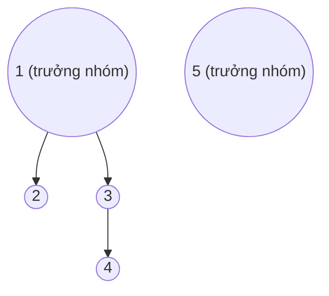

---

## 3. Tối ưu 1: Nén đường đi (Path Compression)

### 3.1. Vấn đề

Nếu cây dài (1→2→3→4→5), mỗi lần `find(5)` phải đi 4 bước!

### 3.2. Giải pháp

Khi tìm trưởng nhóm, gán **trực tiếp** cho tất cả nút trên đường đi trỏ đến trưởng nhóm.

```cpp
// KHÔNG nén: O(N) trong trường hợp xấu
int find_set(int v) {
    if (v == parent[v]) return v;           // Đã là gốc → trả về chính nó
    return find_set(parent[v]);             // Đệ quy nhưng KHÔNG lưu lại!
}

// CÓ nén: O(α(N)) ≈ O(1) trung bình
int find_set(int v) {
    if (v == parent[v]) return v;           // Đã là gốc → trả về chính nó
    return parent[v] = find_set(parent[v]); // Đệ quy VÀ gán lại! ← Đây là nén đường đi
}
```

### 3.3. Minh họa chi tiết: Trước và sau nén

Giả sử có cây sâu: 1 → 2 → 3 → 4 → 5 (node 5 là lá, node 1 là gốc).

**Trước khi nén** — `find(5)` duyệt qua 4 nút:

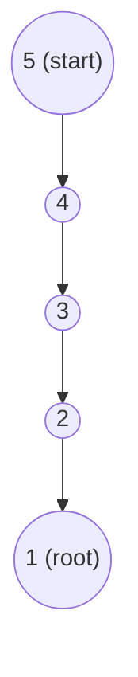

**Sau khi nén** — tất cả node trên đường đi trỏ thẳng đến gốc:

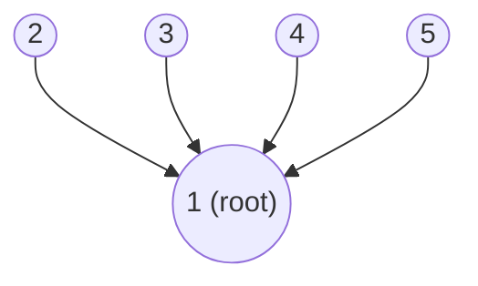

Bây giờ `find(5)` chỉ mất **1 bước**: 5 → 1!

### 3.4. Từng bước nén đường đi

```
Gọi find(5) trên cây: 5 → 4 → 3 → 2 → 1

Bước 1: find(5)
  parent[5] = 4 ≠ 5 → đệ quy find(4)
  Chờ kết quả...

Bước 2: find(4)
  parent[4] = 3 ≠ 4 → đệ quy find(3)
  Chờ kết quả...

Bước 3: find(3)
  parent[3] = 2 ≠ 3 → đệ quy find(2)
  Chờ kết quả...

Bước 4: find(2)
  parent[2] = 1 ≠ 2 → đệ quy find(1)
  Chờ kết quả...

Bước 5: find(1)
  parent[1] = 1 → trả về 1!

Quay lui (gán lại đường đi):
  parent[2] = 1  (từ find(2) trả về 1)
  parent[3] = 1  (từ find(3) trả về 1)
  parent[4] = 1  (từ find(4) trả về 1)
  parent[5] = 1  (từ find(5) trả về 1)

Kết quả: parent = [1, 1, 1, 1, 1]
Tất cả node 2,3,4,5 trỏ thẳng đến 1!
```

### 3.5. α(N) là gì?

Là hàm nghịch đảo Ackermann. Với N = 10^600, α(N) ≤ 5. Tức là thực tế **hằng số**!

Hàm Ackermann tăng cực kỳ nhanh, nên hàm nghịch đảo của nó gần như là hằng số. Đây là lý do DSU được coi là O(1) cho mỗi thao tác.

---

## 4. Tối ưu 2: Gộp theo kích thước (Union by Size)

### 4.1. Vấn đề

Nếu always gộp `parent[a] = b`, cây có thể cao O(N).

### 4.2. Giải pháp

Luôn gộp cây nhỏ vào cây lớn → chiều cao tối đa O(log N).

```
Gộp bừa (không tối ưu):  Cây có thể dài: 1 → 2 → 3 → 4 → 5 → ... → N

Gộp theo kích thước:      Cây luôn ngắn:
  size[1]=1, size[2]=1 → gộp: cây cao 1
  size[3]=1, size[4]=1 → gộp: cây cao 1
  Gộp {1,2} với {3,4}: cả hai cao 1 → cây mới cao 2
  Không bao giờ cao quá log₂(N)!
```

Minh họa Union by Size:

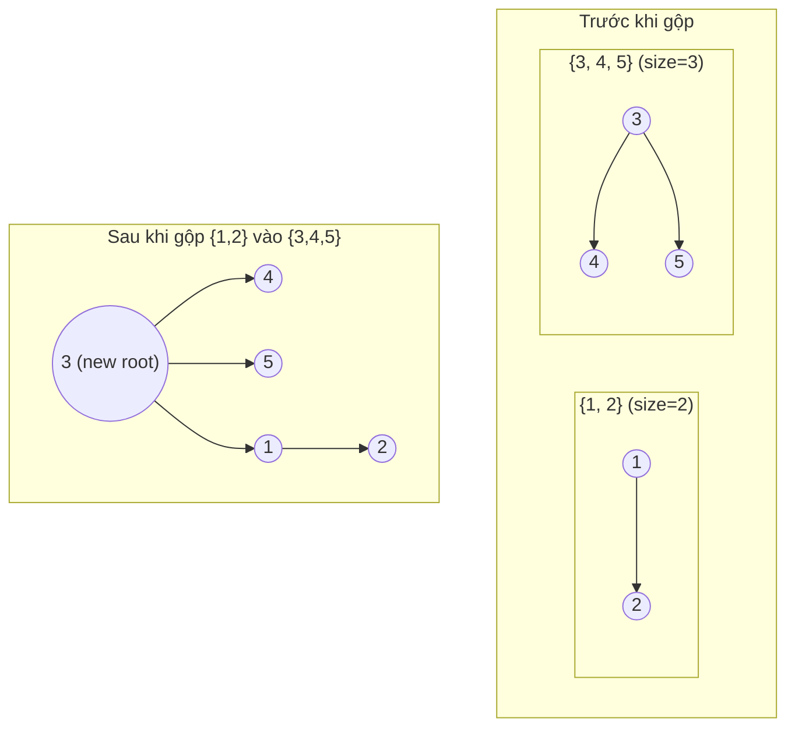

Cây lớn hơn (size=3, root=3) giữ nguyên làm gốc. Cây nhỏ hơn (size=2, root=1) được gộp vào.

---

## 5. Tối ưu 3: Gộp theo bậc (Union by Rank)

### 5.1. Khái niệm

Union by Rank là một biến thể của Union by Size. Thay vì theo dõi kích thước (số phần tử), ta theo dõi **bậc (rank)** — xấp xỉ chiều cao của cây.

**Quy tắc:** Gộp cây có bậc thấp vào cây có bậc cao. Nếu bậc bằng nhau → gộp một vào, bậc tăng 1.

### 5.2. So sánh: Union by Size vs Union by Rank

| | Union by Size | Union by Rank |
|--|--------------|---------------|
| Theo dõi | Số phần tử trong tập hợp | Chiều cao xấp xỉ của cây |
| Gộp cây nhỏ vào | Cây có size nhỏ hơn | Cây có rank thấp hơn |
| Cập nhật sau gộp | `size[a] += size[b]` | Nếu rank bằng nhau → `rank[a]++` |
| Hiệu quả | Tốt như nhau | Tốt như nhau |
| Ưu điểm | Biết kích thước tập hợp | Dễ chứng minh lý thuyết |

### 5.3. Code C++: DSU with Union by Rank

```cpp
struct DSU_Rank {
    vector<int> parent, rank_arr;  // rank_arr[i]: bậc xấp xỉ của cây có gốc i

    DSU_Rank(int n) {
        parent.resize(n + 1);
        rank_arr.resize(n + 1, 0);  // Ban đầu rank = 0 (mỗi node là 1 lá)
        for (int i = 1; i <= n; i++)
            parent[i] = i;          // Mỗi phần tử là 1 nhóm riêng
    }

    // Tìm trưởng nhóm với nén đường đi
    int find_set(int v) {
        if (v == parent[v]) return v;
        return parent[v] = find_set(parent[v]);  // Nén đường đi
    }

    // Gộp 2 nhóm theo bậc
    void union_sets(int a, int b) {
        a = find_set(a);  // Tìm gốc của a
        b = find_set(b);  // Tìm gốc của b
        if (a != b) {
            // Gộp cây bậc thấp vào cây bậc cao
            if (rank_arr[a] < rank_arr[b]) swap(a, b);
            parent[b] = a;                    // b → a
            if (rank_arr[a] == rank_arr[b])   // Nếu bậc bằng nhau
                rank_arr[a]++;                // Bậc của a tăng 1
        }
    }

    bool same_group(int a, int b) {
        return find_set(a) == find_set(b);
    }
};
```

### 5.4. Code Python: DSU with Union by Rank

```python
class DSU_Rank:
    def __init__(self, n):
        self.parent = list(range(n + 1))
        self.rank = [0] * (n + 1)  # Ban đầu rank = 0

    def find(self, v):
        if v == self.parent[v]:
            return v
        self.parent[v] = self.find(self.parent[v])  # Nén đường đi
        return self.parent[v]

    def union(self, a, b):
        a, b = self.find(a), self.find(b)
        if a != b:
            # Gộp cây rank thấp vào cây rank cao
            if self.rank[a] < self.rank[b]:
                a, b = b, a
            self.parent[b] = a
            if self.rank[a] == self.rank[b]:
                self.rank[a] += 1  # Rank tăng khi 2 cây cùng bậc

    def same_group(self, a, b):
        return self.find(a) == self.find(b)
```

### 5.5. Minh họa Union by Rank

```
union(1, 2): rank[1]=0, rank[2]=0 → bằng nhau
             parent[2] = 1, rank[1] = 1

union(3, 4): rank[3]=0, rank[4]=0 → bằng nhau
             parent[4] = 3, rank[3] = 1

union(1, 3): rank[1]=1, rank[3]=1 → bằng nhau
             parent[3] = 1, rank[1] = 2

Cây kết quả (rank = 2):
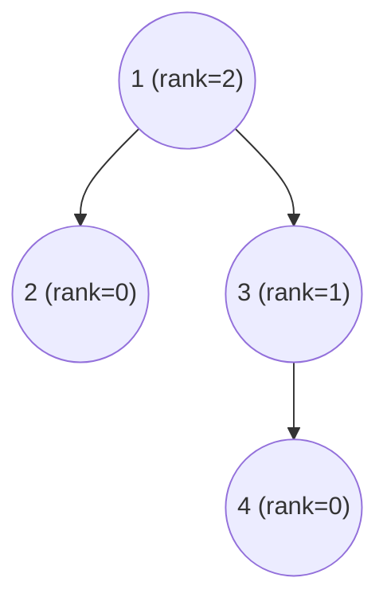

---

## 6. Code C++: DSU hoàn chỉnh (Union by Size)

```cpp
struct DSU {
    vector<int> parent;  // parent[i]: cha trực tiếp của node i
    vector<int> sz;      // sz[i]: kích thước tập hợp có gốc i (chỉ đúng ở gốc)

    // Khởi tạo: mỗi phần tử là 1 nhóm riêng, kích thước = 1
    DSU(int n) {
        parent.resize(n + 1);
        sz.resize(n + 1, 1);
        for (int i = 1; i <= n; i++)
            parent[i] = i;  // Mỗi phần tử là cha của chính nó
    }

    // Tìm trưởng nhóm (gốc) — O(α(N)) ≈ O(1)
    // Đường đi: 5 → 4 → 3 → 2 → 1 (gốc)
    // Sau nén: 5 → 1, 4 → 1, 3 → 1, 2 → 1
    int find_set(int v) {
        if (v == parent[v]) return v;               // Đã là gốc
        return parent[v] = find_set(parent[v]);      // Nén đường đi
    }

    // Gộp 2 nhóm — O(α(N)) ≈ O(1)
    void union_sets(int a, int b) {
        a = find_set(a);  // Tìm gốc của a
        b = find_set(b);  // Tìm gốc của b
        if (a != b) {
            // Gộp cây nhỏ vào cây lớn để giữ chiều cao thấp
            if (sz[a] < sz[b]) swap(a, b);
            parent[b] = a;    // Gốc b → con của a
            sz[a] += sz[b];   // Cập nhật kích thước
        }
    }

    // Kiểm tra 2 phần tử có cùng nhóm — O(α(N)) ≈ O(1)
    bool same_group(int a, int b) {
        return find_set(a) == find_set(b);
    }

    // Lấy kích thước nhóm chứa phần tử v — O(α(N)) ≈ O(1)
    int get_size(int v) {
        return sz[find_set(v)];
    }
};
```

---

## 7. Code Python: DSU hoàn chỉnh (Union by Size)

```python
class DSU:
    def __init__(self, n):
        # Ban đầu: mỗi phần tử là 1 nhóm riêng, kích thước = 1
        self.parent = list(range(n + 1))
        self.size = [1] * (n + 1)

    def find(self, v):
        """Tìm trưởng nhóm (gốc) với nén đường đi"""
        if v == self.parent[v]:
            return v                             # Đã là gốc
        self.parent[v] = self.find(self.parent[v])  # Nén đường đi
        return self.parent[v]

    def union(self, a, b):
        """Gộp 2 nhóm: cây nhỏ vào cây lớn"""
        a, b = self.find(a), self.find(b)        # Tìm gốc
        if a != b:
            if self.size[a] < self.size[b]:
                a, b = b, a                      # Đảm bảo a là cây lớn hơn
            self.parent[b] = a                   # Gốc b → con của a
            self.size[a] += self.size[b]          # Cập nhật kích thước

    def same_group(self, a, b):
        """Kiểm tra 2 phần tử có cùng nhóm"""
        return self.find(a) == self.find(b)

    def get_size(self, v):
        """Lấy kích thước nhóm chứa v"""
        return self.size[self.find(v)]
```

---

## 8. Minh họa chạy chi tiết

```
Cho 7 phần tử, thực hiện:
  union(1, 2), union(3, 4), union(5, 6), union(1, 3), union(5, 7), union(1, 5)

Ban đầu: parent = [_, 1, 2, 3, 4, 5, 6, 7], size = [_, 1, 1, 1, 1, 1, 1, 1]

union(1, 2):  find(1)=1, find(2)=2
              size[1] >= size[2] → parent[2] = 1, size[1] = 2
              parent = [_, 1, 1, 3, 4, 5, 6, 7], size = [_, 2, 1, 1, 1, 1, 1, 1]
```

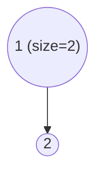

```
union(3, 4):  find(3)=3, find(4)=4
              parent[4] = 3, size[3] = 2
              parent = [_, 1, 1, 3, 3, 5, 6, 7], size = [_, 2, 1, 2, 1, 1, 1, 1]
```

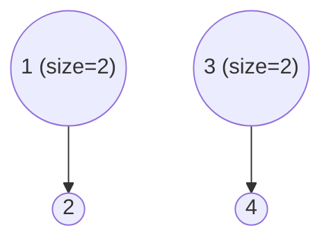

```
union(5, 6):  parent[6] = 5, size[5] = 2
              Cây: {1, 2}, {3, 4}, {5, 6}

union(1, 3):  find(1)=1, find(3)=3
              size[1] >= size[3] → parent[3] = 1, size[1] = 4
              parent = [_, 1, 1, 1, 3, 5, 6, 7], size = [_, 4, 1, 2, 1, 2, 1, 1]
              Lưu ý: parent[4] = 3, nhưng find(4) → 4→3→1 (nén: parent[4]=1)
```

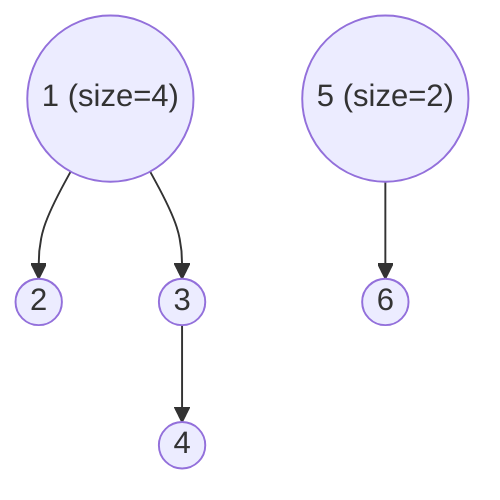

```
union(5, 7):  parent[7] = 5, size[5] = 3
              Cây: {1, 2, 3, 4}, {5, 6, 7}

union(1, 5):  find(1)=1, find(5)=5
              size[1]=4 >= size[5]=3 → parent[5] = 1, size[1] = 7
              Cây: {1, 2, 3, 4, 5, 6, 7} (tất cả cùng nhóm)
```

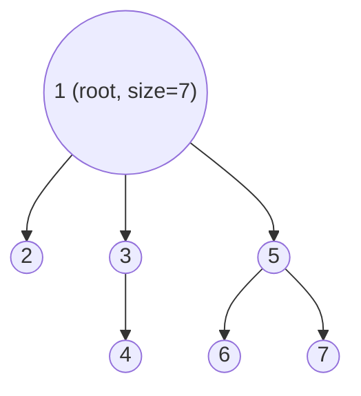

```
same_group(4, 7)?
  find(4): 4→1 (đã nén)
  find(7): 7→5→1 (nén: parent[7]=1)
  Cả hai = 1 → CÓ! ✅
```

---

## 9. DSU với Rollback (Hoàn tác)

### 9.1. Khái niệm

Trong một số bài toán, ta cần **hoàn tác (undo)** thao tác `union` gần nhất. DSU thường (với path compression) **không hỗ trợ** rollback vì nén đường đi làm mất thông tin cấu trúc cũ.

### 9.2. Giải pháp

- **Không dùng path compression** — chỉ dùng Union by Size/Rank.
- Dùng **stack** để lưu lại các thay đổi trước mỗi `union`.
- Khi rollback → khôi phục lại từ stack.

### 9.3. Code C++: DSU with Rollback

```cpp
struct DSU_Rollback {
    vector<int> parent, sz;
    // Stack lưu các thay đổi: (node bị thay đổi, giá trị cũ, gốc bị thay đổi size, size cũ)
    stack<tuple<int, int, int, int>> history;

    DSU_Rollback(int n) {
        parent.resize(n + 1);
        sz.resize(n + 1, 1);
        for (int i = 1; i <= n; i++)
            parent[i] = i;
    }

    // Find KHÔNG nén đường đi (để có thể rollback)
    int find_set(int v) {
        if (v == parent[v]) return v;
        return find_set(parent[v]);  // Không gán lại!
    }

    // Gộp 2 nhóm, lưu lại thay đổi vào stack
    void union_sets(int a, int b) {
        a = find_set(a);
        b = find_set(b);
        if (a != b) {
            // Đảm bảo a là cây lớn hơn
            if (sz[a] < sz[b]) swap(a, b);
            // Lưu thay đổi: (b, parent[b] cũ, a, size[a] cũ)
            history.push({b, parent[b], a, sz[a]});
            parent[b] = a;
            sz[a] += sz[b];
        } else {
            // Không có gì thay đổi → đánh dấu "empty"
            history.push({-1, -1, -1, -1});
        }
    }

    // Hoàn tác union gần nhất
    void rollback() {
        auto [node, old_parent, root, old_size] = history.top();
        history.pop();
        if (node != -1) {  // Nếu có thay đổi thực sự
            parent[node] = old_parent;
            sz[root] = old_size;
        }
    }

    bool same_group(int a, int b) {
        return find_set(a) == find_set(b);
    }
};
```

### 9.4. Lưu ý quan trọng

- **Không dùng path compression** → mỗi `find` là O(log N) thay vì O(α(N)).
- Nếu cần rollback + nhanh → dùng **Union by Rank** (không cần size rollback).
- Ứng dụng: Offline Dynamic Connectivity, Mo's algorithm trên cây, một số bài Segment Tree trên thời gian.

---

## 10. Ứng dụng của DSU

### 10.1. Đếm số thành phần liên thông

**Bài toán:** Cho đồ thị N đỉnh, M cạnh. Đếm số thành phần liên thông.

**Ý tưởng:** Ban đầu có N thành phần. Mỗi lần `union` thành công → giảm đi 1.

```cpp
int main() {
    int n, m;
    cin >> n >> m;

    DSU dsu(n);
    int components = n;  // Ban đầu: N đỉnh = N thành phần

    for (int i = 0; i < m; i++) {
        int u, v;
        cin >> u >> v;
        // Nếu u, v chưa cùng nhóm → gộp lại, giảm số thành phần
        if (!dsu.same_group(u, v)) {
            dsu.union_sets(u, v);
            components--;
        }
    }

    cout << "So thanh phan lien thong: " << components << "\n";
}
```

### 10.2. Phát hiện chu trình trong đồ thị vô hướng

**Bài toán:** Cho đồ thị vô hướng. Kiểm tra có chu trình hay không.

**Ý tưởng:** Khi xét cạnh (u, v), nếu `find(u) == find(v)` → u và v đã liên thông → thêm cạnh này tạo thành chu trình!

```cpp
bool hasCycle(int n, vector<pair<int,int>>& edges) {
    DSU dsu(n);

    for (auto [u, v] : edges) {
        if (dsu.same_group(u, v)) {
            // u và v đã cùng nhóm → thêm cạnh này tạo chu trình!
            return true;
        }
        dsu.union_sets(u, v);
    }
    return false;  // Không có chu trình
}
```

Minh họa phát hiện chu trình:

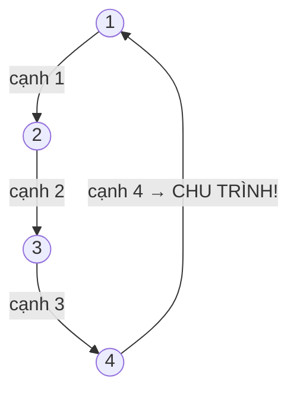

### 10.3. Kruskal — Tìm cây khung nhỏ nhất (MST)

**Bài toán:** Cho đồ thị có trọng số. Tìm cây khung nhỏ nhất (Minimum Spanning Tree).

**Ý tưởng Kruskal:**

1. **Sắp xếp** tất cả cạnh theo trọng số tăng dần.
2. **Duyệt** từng cạnh (u, v, w):
   - Nếu u và v **chưa cùng nhóm** → chọn cạnh này, `union(u, v)`.
   - Nếu u và v **đã cùng nhóm** → bỏ qua (chọn sẽ tạo chu trình).
3. Dừng khi đã chọn N-1 cạnh.

**Tại sao đúng?** Bỏ qua cạnh tạo chu trình đảm bảo không có chu trình. Chọn cạnh nhỏ nhất đảm bảo tổng trọng số nhỏ nhất (chứng minh bằng kỹ thuật "cut property").

```cpp
struct Edge {
    int u, v, w;  // Đỉnh đầu, đỉnh cuối, trọng số
};

// So sánh: ưu tiên cạnh có trọng số nhỏ hơn
bool cmp(Edge a, Edge b) {
    return a.w < b.w;
}

int kruskal(int n, vector<Edge>& edges) {
    // Bước 1: Sắp xếp cạnh theo trọng số tăng dần
    sort(edges.begin(), edges.end(), cmp);

    DSU dsu(n);
    int mst_weight = 0;  // Tổng trọng số MST
    int edges_used = 0;  // Số cạnh đã chọn

    // Bước 2: Duyệt từng cạnh
    for (auto [u, v, w] : edges) {
        // Nếu u, v chưa cùng thành phần → chọn cạnh này
        if (!dsu.same_group(u, v)) {
            dsu.union_sets(u, v);
            mst_weight += w;
            edges_used++;
            if (edges_used == n - 1) break;  // Đã đủ N-1 cạnh
        }
        // Nếu u, v đã cùng thành phần → bỏ qua (tạo chu trình)
    }

    return mst_weight;
}
```

Minh họa thuật toán Kruskal:

```
Đồ thị:       1 ---4--- 2
              |        / |
              2      6   5
              |    /     |
              3 --3--- 4

Cạnh đã sắp xếp: (3,4,3), (1,3,2), (1,2,4), (2,4,5), (2,3,6)

Bước 1: Cạnh (3,4) w=3 → find(3)≠find(4) → CHỌN, union(3,4)
         Cây: {3, 4}

Bước 2: Cạnh (1,3) w=2 → find(1)≠find(3) → CHỌN, union(1,3)
         Cây: {1, 3, 4}

Bước 3: Cạnh (1,2) w=4 → find(1)≠find(2) → CHỌN, union(1,2)
         Cây: {1, 2, 3, 4} → ĐÃ ĐỦ 3 cạnh (N-1=3)!

Kết quả: MST = {1-3, 3-4, 1-2}, trọng số = 2+3+4 = 9
```

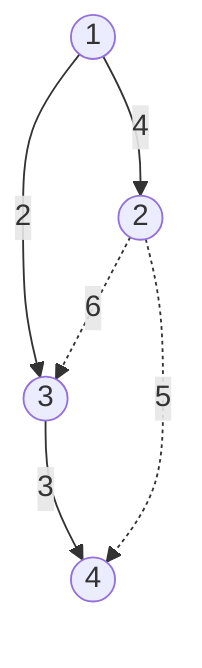

---

## 11. Khi nào dùng DSU?

| Tình huống | Dùng DSU? |
|-----------|----------|
| Kiểm tra 2 đỉnh có cùng thành phần liên thông | ✅ |
| Bài toán Kruskal (tìm MST) | ✅ |
| Phát hiện chu trình trong đồ thị vô hướng | ✅ |
| Gộp tập hợp, đếm số tập hợp | ✅ |
| Cần tách tập hợp (split) | ❌ DSU không hỗ trợ tách |
| Cần rollback (hoàn tác) | ✅ DSU with Rollback (không dùng path compression) |

---

## 12. Tóm tắt độ phức tạp

| Thao tác | Không tối ưu | Có tối ưu |
|----------|-------------|-----------|
| `find_set(v)` | O(N) | O(α(N)) ≈ O(1) |
| `union_sets(a, b)` | O(N) | O(α(N)) ≈ O(1) |
| `same_group(a, b)` | O(N) | O(α(N)) ≈ O(1) |
| Không gộp theo kích thước | Cây cao O(N) | — |
| Gộp theo kích thước/bậc | — | Cây cao O(log N) |

**Lưu ý:** Phải dùng **cả 2 tối ưu** (Path Compression + Union by Size/Rank) mới đạt O(α(N)).

---

## 13. Cạm bẫy thường gặp

### 13.1. Quên Path Compression

```cpp
// SAI: Không nén đường đi → O(N) mỗi find
int find_set(int v) {
    if (v == parent[v]) return v;
    return find_set(parent[v]);  // Không gán lại!
}

// ĐÚNG: Nén đường đi → O(α(N)) ≈ O(1)
int find_set(int v) {
    if (v == parent[v]) return v;
    return parent[v] = find_set(parent[v]);  // Gán lại!
}
```

**Hậu quả:** Không nén → DSU chạy O(N) mỗi find → TLE với N = 10⁶!

### 13.2. Quên Union by Size

```cpp
// SAI: Gộp bừa → cây có thể cao O(N)
parent[a] = b;

// ĐÚNG: Gộp cây nhỏ vào cây lớn
if (sz[a] < sz[b]) swap(a, b);
parent[b] = a;
sz[a] += sz[b];
```

### 13.3. find_set trong Python cần đệ quy có giới hạn

```python
# Python có giới hạn đệ quy mặc định ~1000
# Với N lớn, cần tăng giới hạn hoặc viết find_set không đệ quy:

def find(self, v):
    root = v
    while root != self.parent[root]:
        root = self.parent[root]
    # Nén đường đi (two-pass)
    while v != root:
        nxt = self.parent[v]
        self.parent[v] = root
        v = nxt
    return root
```

---

## 14. Bài tập luyện tập

| Bài | Nền tảng | Độ khó | Ghi chú |
|-----|----------|--------|---------|
| [CSES - Road Construction](https://cses.fi/problemset/task/1676) | CSES | ⭐⭐ | DSU cơ bản |
| [CSES - Road Reparation](https://cses.fi/problemset/task/1675) | CSES | ⭐⭐ | Kruskal + DSU |
| [CSES - Cycle Finding](https://cses.fi/problemset/task/1678) | CSES | ⭐⭐⭐ | DSU phát hiện chu trình |
| [LeetCode - Number of Provinces](https://leetcode.com/problems/number-of-provinces/) | LeetCode | ⭐⭐ | Đếm thành phần liên thông |

---

## Tài liệu tham khảo

- [CP-Algorithms - DSU](https://cp-algorithms.com/data_structures/disjoint-set-union.html)
- [VNOI Wiki - Disjoint Set Union](https://wiki.vnoi.info/algo/data-structures/disjoint-set-union)

**Bài trước:** [← Bài 8a: Heap](08a-heap.md) | **Bài tiếp theo:** [Bài 8c: Segment Tree →](08c-segment-tree.md)
