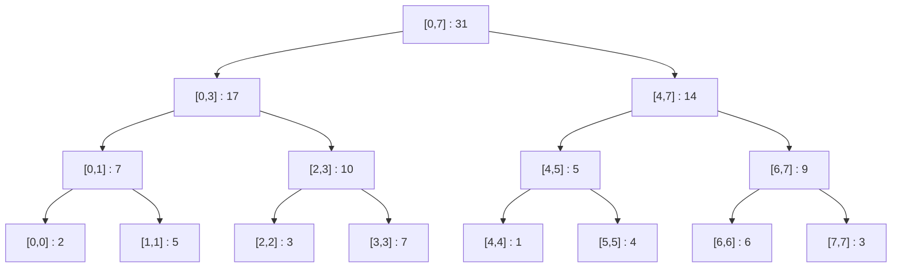

# Bài 8c: Segment Tree (Cây Phân Đoạn) - Truy Vấn Đoạn

> **Tác giả:** Hà Trí Kiên<br>
> **Nội dung tham khảo từ:** VNOI Wiki - Cây Phân Đoạn, CP-Algorithms

---

## 1. Bài toán

Bạn là lớp trưởng. Cả lớp có N học sinh, mỗi người có điểm số. Giáo viên hỏi:

- "Tổng điểm học sinh từ số 5 đến số 12 là bao nhiêu?"
- "Cập nhật điểm học sinh số 7 thành 10!"

Với mảng thường:

- Mỗi câu hỏi tổng đoạn: O(N) — phải duyệt từ 5 đến 12
- N câu hỏi: O(N²) — **quá chậm** khi N = 10⁵!

Segment Tree giải quyết: mỗi thao tác chỉ **O(log N)**!

---

## 2. Ý tưởng cốt lõi: "Chia để trị với cây"

Mấu chốt: **tính trước** kết quả cho các đoạn con, rồi **ghép lại** khi cần truy vấn.

```
Mảng: [2, 5, 3, 7, 1, 4, 6, 3]

Thay vì lưu từng phần tử, ta chia mảng thành các đoạn:
  - Đoạn [0,7]: tổng = 31
    - Đoạn [0,3]: tổng = 17
      - Đoạn [0,1]: tổng = 7
        - Đoạn [0,0]: tổng = 2  (lá)
        - Đoạn [1,1]: tổng = 5  (lá)
      - Đoạn [2,3]: tổng = 10
        - Đoạn [2,2]: tổng = 3  (lá)
        - Đoạn [3,3]: tổng = 7  (lá)
    - Đoạn [4,7]: tổng = 14
      - Đoạn [4,5]: tổng = 5
        - ...
      - Đoạn [6,7]: tổng = 9
        - ...
```

---

## 3. Cấu trúc cây

Segment Tree là **cây nhị phân đầy đủ**:

- **Nút lá:** Lưu giá trị của 1 phần tử (mảng gốc)
- **Nút trong:** Lưu kết quả gộp (tổng, min, max...) của 2 con
- **Nút gốc:** Lưu kết quả cho toàn mảng

```
Cây Segment Tree cho mảng [2, 5, 3, 7, 1, 4, 6, 3]:

                    31 [0,7]
                  /          \
            17 [0,3]        14 [4,7]
           /        \       /        \
        7 [0,1]  10 [2,3] 5 [4,5]  9 [6,7]
        /    \    /    \    /    \    /    \
      2[0] 5[1] 3[2] 7[3] 1[4] 4[5] 6[6] 3[7]

Mảng lưu cây (1-indexed): tree[1] = 31, tree[2] = 17, tree[3] = 14, ...
  - tree[i] → con trái: tree[2*i], con phải: tree[2*i+1]
```

### 3.1. Minh họa bằng Graphviz DOT



---

## 4. Truy vấn tổng đoạn [l, r] — Thế nào là "gộp"?

Khi hỏi "tổng đoạn [2, 5]", ta duyệt cây từ trên xuống:

```
Tại gốc [0, 7]: không nằm hoàn toàn trong [2, 5] → chia đôi
  Tại [0, 3]: giao với [2, 5] → tiếp tục chia
    Tại [0, 1]: KHÔNG giao với [2, 5] → trả về 0 (bỏ qua!)
    Tại [2, 3]: NẰM HOÀN TOÀN trong [2, 5] → trả về 10 (không cần chia thêm!)
  Tại [4, 7]: giao với [2, 5] → tiếp tục chia
    Tại [4, 5]: NẰM HOÀN TOÀN trong [2, 5] → trả về 5
    Tại [6, 7]: KHÔNG giao với [2, 5] → trả về 0

Kết quả: 10 + 5 = 15 = 3 + 7 + 1 + 4 ✅
```

**3 trường hợp tại mỗi nút:**

1. **Nằm ngoài hoàn toàn** → trả về giá trị "rỗng" (0 cho tổng, +∞ cho min)
2. **Nằm trong hoàn toàn** → trả về giá trị tại nút (không cần duyệt thêm!)
3. **Giao một phần** → chia đôi, gọi đệ quy 2 con, gộp kết quả

### 4.1. Bước trace chi tiết: query(2, 5) trên mảng [2, 5, 3, 7, 1, 4, 6, 3]

```
Mảng:  index:  0   1   2   3   4   5   6   7
       value:  2   5   3   7   1   4   6   3

Cây (1-indexed):
   tree[1]  = 31  quản lý [0,7]   ← gốc
   tree[2]  = 17  quản lý [0,3]
   tree[3]  = 14  quản lý [4,7]
   tree[4]  =  7  quản lý [0,1]
   tree[5]  = 10  quản lý [2,3]
   tree[6]  =  5  quản lý [4,5]
   tree[7]  =  9  quản lý [6,7]
   tree[8]  =  2  quản lý [0,0]   (lá)
   tree[9]  =  5  quản lý [1,1]   (lá)
   tree[10] =  3  quản lý [2,2]   (lá)
   tree[11] =  7  quản lý [3,3]   (lá)
   tree[12] =  1  quản lý [4,4]   (lá)
   tree[13] =  4  quản lý [5,5]   (lá)
   tree[14] =  6  quản lý [6,6]   (lá)
   tree[15] =  3  quản lý [7,7]   (lá)

═══════════════════════════════════════════════════════════
  Bước 1: query(node=1, start=0, end=7, l=2, r=5)
  ═══════════════════════════════════════════════════════
  [0,7] giao với [2,5]? → CÓ (không nằm ngoài)
  [0,7] nằm trong [2,5]? → KHÔNG (0 < 2 hoặc 7 > 5)
  → Trường hợp 3: Giao một phần → chia đôi
  mid = (0 + 7) / 2 = 3
  → Gọi query(2, 0, 3, 2, 5) cho con trái  [0,3]
  → Gọi query(3, 4, 7, 2, 5) cho con phải [4,7]

═══════════════════════════════════════════════════════════
  Bước 2a: query(node=2, start=0, end=3, l=2, r=5)
  ═══════════════════════════════════════════════════════
  [0,3] giao với [2,5]? → CÓ
  [0,3] nằm trong [2,5]? → KHÔNG (0 < 2)
  → Trường hợp 3: Giao một phần → chia đôi
  mid = (0 + 3) / 2 = 1
  → Gọi query(4, 0, 1, 2, 5) cho con trái  [0,1]
  → Gọi query(5, 2, 3, 2, 5) cho con phải [2,3]

  ════════════════════════════════════════════════════════
    Bước 3a: query(node=4, start=0, end=1, l=2, r=5)
    ════════════════════════════════════════════════════
    [0,1] giao với [2,5]? → KHÔNG (1 < 2)
    → Trường hợp 1: Nằm ngoài hoàn toàn → trả về 0
    Kết quả: 0

  ════════════════════════════════════════════════════════
    Bước 3b: query(node=5, start=2, end=3, l=2, r=5)
    ════════════════════════════════════════════════════
    [2,3] giao với [2,5]? → CÓ
    [2,3] nằm trong [2,5]? → CÓ (2 >= 2 và 3 <= 5)
    → Trường hợp 2: Nằm trong hoàn toàn → trả về tree[5] = 10
    Kết quả: 10

  ← Quay lại Bước 2a: leftSum = 0, rightSum = 10
  ← Kết quả Bước 2a: 0 + 10 = 10

═══════════════════════════════════════════════════════════
  Bước 2b: query(node=3, start=4, end=7, l=2, r=5)
  ═══════════════════════════════════════════════════════
  [4,7] giao với [2,5]? → CÓ
  [4,7] nằm trong [2,5]? → KHÔNG (7 > 5)
  → Trường hợp 3: Giao một phần → chia đôi
  mid = (4 + 7) / 2 = 5
  → Gọi query(6, 4, 5, 2, 5) cho con trái  [4,5]
  → Gọi query(7, 6, 7, 2, 5) cho con phải [6,7]

  ════════════════════════════════════════════════════════
    Bước 3c: query(node=6, start=4, end=5, l=2, r=5)
    ════════════════════════════════════════════════════
    [4,5] giao với [2,5]? → CÓ
    [4,5] nằm trong [2,5]? → CÓ (4 >= 2 và 5 <= 5)
    → Trường hợp 2: Nằm trong hoàn toàn → trả về tree[6] = 5
    Kết quả: 5

  ════════════════════════════════════════════════════════
    Bước 3d: query(node=7, start=6, end=7, l=2, r=5)
    ════════════════════════════════════════════════════
    [6,7] giao với [2,5]? → KHÔNG (6 > 5)
    → Trường hợp 1: Nằm ngoài hoàn toàn → trả về 0
    Kết quả: 0

  ← Quay lại Bước 2b: leftSum = 5, rightSum = 0
  ← Kết quả Bước 2b: 5 + 0 = 5

═══════════════════════════════════════════════════════════
  Quay lại Bước 1: leftSum = 10, rightSum = 5
  ═══════════════════════════════════════════════════════
  Kết quả CUỐI CÙNG: 10 + 5 = 15

  Kiểm tra: a[2] + a[3] + a[4] + a[5] = 3 + 7 + 1 + 4 = 15 ✅
═══════════════════════════════════════════════════════════

Tóm tắt đường đi:

           [0,7] → chia đôi
          /       \
     [0,3] → chia    [4,7] → chia
     /    \           /    \
  [0,1]  [2,3]✓    [4,5]✓  [6,7]
  → 0     → 10      → 5     → 0

  Tổng = 0 + 10 + 5 + 0 = 15 ✅
```

---

## 5. Cập nhật a[pos] = val

Thay đổi 1 phần tử → cần cập nhật tất cả nút "bao chứa" vị trí đó.

```
Cập nhật a[3] = 10 (từ 7 thành 10):

Từ lá tree[11] (a[3]): gán = 10
  → Cha tree[5] = tree[10] + tree[11] = 3 + 10 = 13
    → Cha tree[2] = tree[4] + tree[5] = 7 + 13 = 20
      → Gốc tree[1] = tree[2] + tree[3] = 20 + 14 = 34

Chỉ cập nhật log₂(N) = 3 nút! (thay vì toàn bộ mảng)
```

---

## 6. Code C++ — Segment Tree cho tổng đoạn

```cpp
#include <bits/stdc++.h>
using namespace std;

const int MAXN = 200005;
long long tree[4 * MAXN];  // Kích thước 4*N là đủ (xem phần giải thích bên dưới)

// Xây dựng cây từ mảng a[] - O(N)
// node: chỉ số nút hiện tại trong mảng tree
// [start, end]: đoạn mà nút này quản lý
void build(int node, int start, int end, int a[]) {
    if (start == end) {
        // Nút lá: đây là phần tử đơn lẻ a[start]
        // Gán trực tiếp giá trị từ mảng gốc
        tree[node] = a[start];
        return;
    }

    // Nút trong: chia đoạn [start, end] thành 2 nửa
    int mid = (start + end) / 2;

    // Xây cây con trái quản lý đoạn [start, mid]
    build(2 * node, start, mid, a);

    // Xây cây con phải quản lý đoạn [mid+1, end]
    build(2 * node + 1, mid + 1, end, a);

    // Gộp kết quả: tổng của 2 con
    // Đây là phép gộp (merge) — thay + bằng min/max cho biến thể khác
    tree[node] = tree[2 * node] + tree[2 * node + 1];
}

// Truy vấn tổng đoạn [l, r] - O(log N)
// node: nút hiện tại, [start, end]: đoạn nút này quản lý
// [l, r]: đoạn cần truy vấn
long long query(int node, int start, int end, int l, int r) {
    // Trường hợp 1: Đoạn [start, end] nằm HOÀN TOÀN NGOÀI [l, r]
    // → Không có phần tử nào giao nhau → trả về giá trị "rỗng" (0 cho tổng)
    if (r < start || end < l) return 0;

    // Trường hợp 2: Đoạn [start, end] nằm HOÀN TOÀN TRONG [l, r]
    // → Tất cả phần tử trong đoạn đều được tính → trả về giá trị nút
    // Đây là lúc "cắt nhánh", không cần duyệt thêm!
    if (l <= start && end <= r) return tree[node];

    // Trường hợp 3: Đoạn [start, end] GIAO MỘT PHẦN với [l, r]
    // → Chia đôi, gọi đệ quy 2 con, rồi gộp kết quả
    int mid = (start + end) / 2;
    long long leftSum  = query(2 * node,     start,   mid, l, r);  // Tổng từ con trái
    long long rightSum = query(2 * node + 1, mid + 1, end, l, r);  // Tổng từ con phải
    return leftSum + rightSum;  // Gộp: cộng tổng 2 nửa
}

// Cập nhật a[pos] = val - O(log N)
// node: nút hiện tại, [start, end]: đoạn nút này quản lý
// pos: vị trí cần cập nhật, val: giá trị mới
void update(int node, int start, int end, int pos, long long val) {
    if (start == end) {
        // Đến nút lá (quản lý đúng 1 phần tử a[pos])
        // → Gán giá trị mới
        tree[node] = val;
        return;
    }

    // Chưa đến lá → xác định pos nằm ở con trái hay con phải
    int mid = (start + end) / 2;
    if (pos <= mid)
        // pos nằm trong đoạn [start, mid] → đi sang con trái
        update(2 * node, start, mid, pos, val);
    else
        // pos nằm trong đoạn [mid+1, end] → đi sang con phải
        update(2 * node + 1, mid + 1, end, pos, val);

    // Quan trọng: cập nhật lại giá trị nút cha = gộp 2 con
    // Vì 1 trong 2 con đã thay đổi, nút cha cũng phải thay đổi theo
    tree[node] = tree[2 * node] + tree[2 * node + 1];
}

int main() {
    int n, q;
    cin >> n >> q;
    int a[n];
    for (int i = 0; i < n; i++) cin >> a[i];

    // Xây cây từ nút gốc (chỉ số 1), quản lý đoạn [0, n-1]
    build(1, 0, n - 1, a);

    while (q--) {
        int type, l, r;
        cin >> type >> l >> r;
        if (type == 1)          // Cập nhật: a[l] = r
            update(1, 0, n - 1, l - 1, r);
        else                    // Truy vấn: tổng [l, r]
            cout << query(1, 0, n - 1, l - 1, r - 1) << "\n";
    }
}
```

---

## 7. Code Python — Segment Tree

```python
import sys
input = sys.stdin.readline

class SegmentTree:
    def __init__(self, a):
        self.n = len(a)
        self.tree = [0] * (4 * self.n)  # Cấp phát 4*n phần tử
        self._build(1, 0, self.n - 1, a)  # Xây từ gốc (node 1)

    def _build(self, node, start, end, a):
        """Xây dựng cây đệ quy - O(N)"""
        if start == end:
            # Nút lá: gán giá trị trực tiếp từ mảng gốc
            self.tree[node] = a[start]
            return
        mid = (start + end) // 2
        self._build(2 * node, start, mid, a)          # Xây con trái
        self._build(2 * node + 1, mid + 1, end, a)    # Xây con phải
        self.tree[node] = self.tree[2 * node] + self.tree[2 * node + 1]  # Gộp

    def query(self, node, start, end, l, r):
        """Truy vấn tổng đoạn [l, r] - O(log N)"""
        if r < start or end < l:
            return 0  # Nằm ngoài → trả về 0
        if l <= start and end <= r:
            return self.tree[node]  # Nằm trong → trả về giá trị nút
        mid = (start + end) // 2
        # Gộp kết quả từ 2 con
        return (self.query(2 * node, start, mid, l, r) +
                self.query(2 * node + 1, mid + 1, end, l, r))

    def update(self, node, start, end, pos, val):
        """Cập nhật a[pos] = val - O(log N)"""
        if start == end:
            self.tree[node] = val  # Đến lá → gán giá trị mới
            return
        mid = (start + end) // 2
        if pos <= mid:
            self.update(2 * node, start, mid, pos, val)        # Đi sang trái
        else:
            self.update(2 * node + 1, mid + 1, end, pos, val)  # Đi sang phải
        self.tree[node] = self.tree[2 * node] + self.tree[2 * node + 1]  # Cập nhật cha
```

---

## 8. Biến thể: Segment Tree cho min/max

Chỉ cần thay phép gộp `+` thành `min()` hoặc `max()`:

```cpp
// Gộp: min 2 con (thay vì tổng)
tree[node] = min(tree[2 * node], tree[2 * node + 1]);

// Giá trị "rỗng" khi query ngoài đoạn: INT_MAX (thay vì 0)
if (r < start || end < l) return INT_MAX;
```

---

## 9. Tại sao 4*N là đủ cho kích thước mảng?

Đây là câu hỏi phổ biến. Ta sẽ phân tích:

### 9.1. Cây nhị phân đầy đủ hoàn hảo

Với N là lũy thừa của 2 (N = 2^k), cây nhị phân đầy đủ có:
- Số lá: N
- Số nút trong: N - 1
- Tổng số nút: 2N - 1

Nếu dùng 1-indexed (gốc tại tree[1]), chỉ số lớn nhất là 2N - 1 < 2N.

### 9.2. N không phải lũy thừa của 2

Khi N không phải lũy thừa của 2, cây có thể **lệch** (không hoàn hảo). Xét trường hợp xấu nhất:

```
N = 5 (không phải lũy thừa của 2):

Cây 1-indexed:
                    tree[1]  quản lý [0,4]
                   /                   \
          tree[2] [0,2]          tree[3] [3,4]
          /          \            /          \
    tree[4] [0,1]  tree[5] [2,2]  tree[6] [3,3]  tree[7] [4,4]
    /        \
tree[8][0,0]  tree[9][1,1]

Chỉ số lớn nhất = 7, nhưng 4*N = 20. Thừa nhiều!
```

### 9.3. Chứng minh chính xác 4*N là đủ

**Bài toán:** Cho cây nhị phân 1-indexed, gốc tại 1, mỗi nút i có con 2i và 2i+1. Cây quản lý N lá (từ chỉ số nào đến chỉ số nào?). Chứng minh **không nút nào có chỉ số > 4N**.

**Chứng minh:**

Gọi h là chiều cao nhỏ nhất sao cho 2^h >= N. Khi đó:
- Số lá thực tế: N, nằm trong khoảng [2^h, 2^(h+1) - 1]
- Các lá có chỉ số nằm trong [2^h, 2^h + N - 1]
- Chỉ số lá lớn nhất: 2^h + N - 1

Vì 2^h <= 2N (vì 2^(h-1) < N ≤ 2^h), nên:
- Chỉ số lá lớn nhất ≤ 2N + N - 1 = 3N - 1 < 3N

Con phải của lá có chỉ số lớn nhất: 2(3N) + 1 = 6N + 1 > 4N → **KHÔNG CÓ** (vì lá không có con).

Nút trong lớn nhất có chỉ số ≤ 2N (vì nút trong là cha của lá, và chỉ số cha = chỉ số con / 2).

→ **4N là đủ an toàn**, thực tế 2N + O(1) đã đủ, nhưng 4N cho đơn giản và an toàn.

### 9.4. Minh họa: Tại sao không dùng 2*N

```
N = 3:

Cây 1-indexed:
        tree[1] [0,2]
       /              \
  tree[2] [0,1]    tree[3] [2,2]
  /        \
tree[4][0,0]  tree[5][1,1]

Chỉ số lớn nhất = 5, 2*N = 6 → ĐỦ cho N=3.

Nhưng với N=6:
        tree[1] [0,5]
       /              \
  tree[2] [0,2]    tree[3] [3,5]
  /        \        /        \
tree[4][0,1] tree[5][2,2] tree[6][3,4] tree[7][5,5]
/       \
tree[8][0,0] tree[9][1,1]

Chỉ số lớn nhất = 9, 2*N = 12 → VỪA ĐỦ.

Nhưng khi N=7 (dồn về 1 bên):
tree[1][0,6]
  tree[2][0,3]
    tree[4][0,1]
      tree[8][0,0] ← chỉ số 8
    tree[5][2,3]
  tree[3][4,6]
    tree[6][4,5]
    tree[7][6,6]

Chỉ số lớn nhất = 8, 2*N = 14 → ĐỦ.

Thực tế 2N luôn đủ cho cây Segment Tree 1-indexed.
Nhưng 4N là "quy ước" để an toàn tuyệt đối, không cần suy nghĩ.
```

---

## 10. Lazy Propagation — Cập nhật đoạn

### 10.1. Bài toán

Giờ giáo viên hỏi: "Cộng thêm 5 điểm cho tất cả học sinh từ số 3 đến số 8!"

Với code hiện tại, ta phải gọi `update()` cho từng phần tử → O(N log N) cho N phần tử. **Quá chậm!**

Lazy Propagation cho phép cập nhật đoạn [l, r] chỉ trong **O(log N)**!

### 10.2. Ý tưởng: "Đánh dấu lười"

Thay vì cập nhật ngay tất cả con, ta **đánh dấu** tại nút: "này, các con của mày cần được cộng thêm X nhé!". Khi nào cần truy cập con thì mới **đẩy** (push) giá trị xuống.

```
Ví dụ: Cộng thêm 5 cho đoạn [2, 5]

Không có lazy: Phải cập nhật 4 lá → 4 * log(N) = 12 thao tác

Có lazy: Đánh dấu tại 1-2 nút → 2-3 thao tác
  - tree[5] quản lý [2,3]: lazy[5] += 5
  - tree[6] quản lý [4,5]: lazy[6] += 5
  → Khi query hoặc update liên quan → mới đẩy lazy xuống
```

### 10.3. Code C++ — Segment Tree với Lazy Propagation

```cpp
#include <bits/stdc++.h>
using namespace std;

const int MAXN = 200005;
long long tree[4 * MAXN];  // Giá trị tại mỗi nút
long long lazy[4 * MAXN];  // Giá trị "lười" chưa đẩy xuống

// Đẩy lazy từ nút cha xuống 2 con
void pushDown(int node, int start, int end) {
    if (lazy[node] == 0) return;  // Không có gì để đẩy

    // Cộng giá trị lazy vào nút hiện tại
    // (vì nút này cũng cần được cập nhật)
    tree[node] += lazy[node] * (end - start + 1);

    if (start != end) {
        // Chưa phải lá → đẩy lazy xuống 2 con
        lazy[2 * node]     += lazy[node];
        lazy[2 * node + 1] += lazy[node];
    }

    // Xóa lazy tại nút hiện tại (đã đẩy xong)
    lazy[node] = 0;
}

// Cập nhật: cộng thêm val cho tất cả phần tử trong [l, r] — O(log N)
void rangeUpdate(int node, int start, int end, int l, int r, long long val) {
    pushDown(node, start, end);  // Đảm bảo nút hiện tại đã được cập nhật

    if (r < start || end < l) return;  // Nằm ngoài → bỏ qua

    if (l <= start && end <= r) {
        // Nằm trong hoàn toàn → đánh dấu lazy
        lazy[node] += val;
        pushDown(node, start, end);  // Cập nhật nút hiện tại
        return;
    }

    // Giao một phần → chia đôi
    int mid = (start + end) / 2;
    rangeUpdate(2 * node, start, mid, l, r, val);
    rangeUpdate(2 * node + 1, mid + 1, end, l, r, val);

    // Gộp lại từ 2 con (sau khi 2 con đã được pushDown)
    tree[node] = tree[2 * node] + tree[2 * node + 1];
}

// Truy vấn tổng đoạn [l, r] — O(log N)
long long query(int node, int start, int end, int l, int r) {
    pushDown(node, start, end);  // Đẩy lazy trước khi truy vấn

    if (r < start || end < l) return 0;
    if (l <= start && end <= r) return tree[node];

    int mid = (start + end) / 2;
    return query(2 * node, start, mid, l, r) +
           query(2 * node + 1, mid + 1, end, l, r);
}

// Cập nhật điểm: a[pos] = val — O(log N)
void pointUpdate(int node, int start, int end, int pos, long long val) {
    pushDown(node, start, end);

    if (start == end) {
        tree[node] = val;
        return;
    }

    int mid = (start + end) / 2;
    if (pos <= mid)
        pointUpdate(2 * node, start, mid, pos, val);
    else
        pointUpdate(2 * node + 1, mid + 1, end, pos, val);

    tree[node] = tree[2 * node] + tree[2 * node + 1];
}

int main() {
    int n, q;
    cin >> n >> q;
    int a[n];
    for (int i = 0; i < n; i++) cin >> a[i];

    // Xây cây (không có lazy ban đầu)
    // ... (dùng hàm build ở trên)

    while (q--) {
        int type;
        cin >> type;
        if (type == 1) {
            // Cập nhật đoạn: cộng val cho [l, r]
            int l, r;
            long long val;
            cin >> l >> r >> val;
            rangeUpdate(1, 0, n - 1, l - 1, r - 1, val);
        } else if (type == 2) {
            // Cập nhật điểm: a[pos] = val
            int pos;
            long long val;
            cin >> pos >> val;
            pointUpdate(1, 0, n - 1, pos - 1, val);
        } else {
            // Truy vấn tổng đoạn [l, r]
            int l, r;
            cin >> l >> r;
            cout << query(1, 0, n - 1, l - 1, r - 1) << "\n";
        }
    }
}
```

### 10.4. Code Python — Lazy Propagation

```python
class LazySegmentTree:
    def __init__(self, a):
        self.n = len(a)
        self.tree = [0] * (4 * self.n)
        self.lazy = [0] * (4 * self.n)
        self._build(1, 0, self.n - 1, a)

    def _build(self, node, start, end, a):
        if start == end:
            self.tree[node] = a[start]
            return
        mid = (start + end) // 2
        self._build(2 * node, start, mid, a)
        self._build(2 * node + 1, mid + 1, end, a)
        self.tree[node] = self.tree[2 * node] + self.tree[2 * node + 1]

    def _pushDown(self, node, start, end):
        """Đẩy lazy từ nút cha xuống 2 con"""
        if self.lazy[node] == 0:
            return
        # Cập nhật nút hiện tại
        self.tree[node] += self.lazy[node] * (end - start + 1)
        if start != end:
            # Chưa phải lá → đẩy xuống 2 con
            self.lazy[2 * node] += self.lazy[node]
            self.lazy[2 * node + 1] += self.lazy[node]
        self.lazy[node] = 0  # Xóa lazy

    def rangeUpdate(self, node, start, end, l, r, val):
        """Cộng thêm val cho tất cả phần tử trong [l, r]"""
        self._pushDown(node, start, end)
        if r < start or end < l:
            return
        if l <= start and end <= r:
            self.lazy[node] += val
            self._pushDown(node, start, end)
            return
        mid = (start + end) // 2
        self.rangeUpdate(2 * node, start, mid, l, r, val)
        self.rangeUpdate(2 * node + 1, mid + 1, end, l, r, val)
        self.tree[node] = self.tree[2 * node] + self.tree[2 * node + 1]

    def query(self, node, start, end, l, r):
        """Truy vấn tổng đoạn [l, r]"""
        self._pushDown(node, start, end)
        if r < start or end < l:
            return 0
        if l <= start and end <= r:
            return self.tree[node]
        mid = (start + end) // 2
        return (self.query(2 * node, start, mid, l, r) +
                self.query(2 * node + 1, mid + 1, end, l, r))
```

### 10.5. Minh họa Lazy Propagation

```
Mảng ban đầu: [2, 5, 3, 7, 1, 4, 6, 3]
Cộng thêm 5 cho đoạn [2, 5]:

Bước 1: rangeUpdate(node=1, [0,7], [2,5], +5)
  pushDown(1): lazy[1]=0, bỏ qua
  [0,7] không nằm trong [2,5] → chia đôi

Bước 2: rangeUpdate(node=2, [0,3], [2,5], +5)
  pushDown(2): lazy[2]=0, bỏ qua
  [0,3] không nằm trong [2,5] → chia đôi

  Bước 3a: rangeUpdate(node=4, [0,1], [2,5], +5)
    pushDown(4): lazy[4]=0, bỏ qua
    [0,1] ngoài [2,5] → return

  Bước 3b: rangeUpdate(node=5, [2,3], [2,5], +5)
    pushDown(5): lazy[5]=0, bỏ qua
    [2,3] nằm trong [2,5] → ĐÁNH DẤU LAZY!
    lazy[5] = 5
    pushDown(5): tree[5] += 5 * 2 = 10 → tree[5] = 20
    (vì [2,3] có 2 phần tử, mỗi phần tử +5)

  tree[2] = tree[4] + tree[5] = 7 + 20 = 27

Bước 4: rangeUpdate(node=3, [4,7], [2,5], +5)
  pushDown(3): lazy[3]=0, bỏ qua
  [4,7] không nằm trong [2,5] → chia đôi

  Bước 5a: rangeUpdate(node=6, [4,5], [2,5], +5)
    pushDown(6): lazy[6]=0, bỏ qua
    [4,5] nằm trong [2,5] → ĐÁNH DẤU LAZY!
    lazy[6] = 5
    pushDown(6): tree[6] += 5 * 2 = 10 → tree[6] = 15

  Bước 5b: rangeUpdate(node=7, [6,7], [2,5], +5)
    pushDown(7): lazy[7]=0, bỏ qua
    [6,7] ngoài [2,5] → return

  tree[3] = tree[6] + tree[7] = 15 + 9 = 24

tree[1] = tree[2] + tree[3] = 27 + 24 = 51

Kết quả: Tổng mảng = 51 = (2+5) + (3+5) + (7+5) + (1+5) + (4+5) + 6 + 3
       = 7 + 8 + 12 + 6 + 9 + 6 + 3 = 51 ✅

Chỉ 5 nút được truy cập (thay vì 8 nút nếu update từng phần tử)!
```

---

## 11. Persistent Segment Tree (Nâng cao)

### 11.1. Bài toán

Cho mảng A, trả lời Q truy vấn: "Tổng đoạn [l, r] của mảng tại **phiên bản** nào đó?"

Ví dụ: Mảng ban đầu [1, 2, 3]. Sau đó:
- Phiên bản 0: [1, 2, 3]
- Phiên bản 1: a[1] = 5 → [1, 5, 3]
- Phiên bản 2: a[2] = 7 → [1, 5, 7]

Truy vấn: "Tổng [0, 2] tại phiên bản 0?" → 6. "Tổng [0, 2] tại phiên bản 2?" → 13.

### 11.2. Ý tưởng

Thay vì tạo N cây mới (tốn O(N²) bộ nhớ), Persistent Segment Tree chỉ tạo **các nút mới trên đường đi** từ lá đến gốc khi cập nhật. Các nút còn lại **chia sẻ** với cây cũ.

```
Phiên bản 0: tree[1] → tree[2] → tree[4] → tree[8] (lá a[0])

Cập nhật a[0] = 10 (tạo phiên bản 1):
  - Tạo nút mới tree'[8] = 10 (lá mới)
  - Tạo nút mới tree'[4] = tree'[8] + tree[9] (cha mới, chia sẻ con phải)
  - Tạo nút mới tree'[2] = tree'[4] + tree[5] (cha mới, chia share con phải)
  - Tạo nút mới tree'[1] = tree'[2] + tree[3] (gốc mới, chia sẻ con phải)

Chỉ tạo O(log N) nút mới cho mỗi cập nhật!
Bộ nhớ: O(N + Q log N)
```

### 11.3. Ứng dụng

- Truy vấn "số phần tử <= K trong đoạn [l, r]" → dùng trong bài "K-th number" (SPOJ MKTHNUM)
- Truy vấn "tổng đoạn [l, r] tại thời điểm T" → dùng trong bài "historical" queries

> **Lưu ý:** Persistent Segment Tree là chủ đề nâng cao, cần hiểu rõ Segment Tree cơ bản trước.

---

## 12. 2D Segment Tree (Nâng cao)

### 12.1. Bài toán

Cho ma trận N×M, truy vấn tổng trong hình chữ nhật (x1, y1) → (x2, y2).

### 12.2. Ý tưởng

Dùng "Segment Tree của Segment Tree":
- Mỗi nút trong Segment Tree theo chiều dọc quản lý 1 hàng
- Mỗi nút trong đó lại là 1 Segment Tree theo chiều ngang

```
2D Segment Tree cho ma trận 4×4:

Segment Tree theo hàng (dọc):
  node[1]: quản lý hàng [0,3] → chứa Segment Tree theo cột
    node[2]: quản lý hàng [0,1] → Segment Tree cột
      node[4]: hàng 0 → [g00, g01, g02, g03]
      node[5]: hàng 1 → [g10, g11, g12, g13]
    node[3]: quản lý hàng [2,3] → Segment Tree cột
      node[6]: hàng 2 → [g20, g21, g22, g23]
      node[7]: hàng 3 → [g30, g31, g32, g33]
```

### 12.3. Độ phức tạp

| Thao tác | Độ phức tạp |
|----------|-------------|
| Xây dựng | O(N × M × log N × log M) |
| Truy vấn | O(log N × log M) |
| Cập nhật điểm | O(log N × log M) |
| Bộ nhớ | O(4 × N × 4 × M) = O(16NM) |

> **Lưu ý:** 2D Segment Tree tốn nhiều bộ nhớ. Với N, M lớn (> 1000), nên dùng **2D BIT** hoặc **Square Root Decomposition**.

---

## 13. Tóm tắt độ phức tạp

| Thao tác | Độ phức tạp | Giải thích |
|----------|-------------|-----------|
| Xây dựng | O(N) | Duyệt qua N lá + N-1 nút trong |
| Truy vấn | O(log N) | Mỗi bước chia đôi → đi tối đa log₂(N) nút |
| Cập nhật điểm | O(log N) | Đi từ lá lên gốc → log₂(N) nút |
| Cập nhật đoạn (lazy) | O(log N) | Đánh dấu tại O(log N) nút |
| Bộ nhớ | O(4N) | Cây nhị phân đầy đủ cần ≤ 4N nút |

---

## 14. Khi nào dùng Segment Tree vs BIT?

| Tình huống | Nên dùng |
|-----------|----------|
| Chỉ cần tổng đoạn + cập nhật điểm | **BIT** (code ngắn, nhanh) |
| Cần min/max + cập nhật điểm | **Segment Tree** |
| Cần cập nhật đoạn (lazy propagation) | **Segment Tree** |
| Cần persistent (lịch sử phiên bản) | **Segment Tree** |
| Cần 2D truy vấn | Cả hai đều được |
| Code ngắn, dễ nhớ | **BIT** (chỉ 2 hàm!) |

---

## 15. Bài tập luyện tập

| Bài | Nền tảng | Độ khó | Ghi chú |
|-----|----------|--------|---------|
| [CSES - Dynamic Range Sum Queries](https://cses.fi/problemset/task/1648) | CSES | ⭐⭐ | Segment Tree cơ bản |
| [CSES - Dynamic Range Min Queries](https://cses.fi/problemset/task/1649) | CSES | ⭐⭐ | Segment Tree Min |
| [CSES - Range Update Queries](https://cses.fi/problemset/task/1651) | CSES | ⭐⭐⭐ | Lazy Propagation |
| [CSES - Distinct Values Queries](https://cses.fi/problemset/task/1734) | CSES | ⭐⭐⭐ | Segment Tree + Offline |
| [SPOJ - MKTHNUM](https://www.spoj.com/problems/MKTHNUM/) | SPOJ | ⭐⭐⭐⭐ | Persistent Segment Tree |
| [Codeforces - E. Beautiful Subarrays](https://codeforces.com/problemset/problem/665/E) | Codeforces | ⭐⭐⭐ | Segment Tree nâng cao |

---

## 16. Tài liệu tham khảo

- [CP-Algorithms - Segment Tree](https://cp-algorithms.com/data_structures/segment_tree.html)
- [VNOI Wiki - Cây Phân Đoạn](https://wiki.vnoi.info/algo/data-structures/segment-tree-basic)
- [Codeforces - Efficient Segment Trees](https://codeforces.com/blog/entry/18051)
- [YouTube - Segment Tree Playlist (takeuforward)](https://www.youtube.com/playlist?list=PLtfqa971vD5GTQjH9U0H6kiq9cQlFFa5k)

**Bài liên quan:**
- [Bài 8a: Heap](08a-heap.md) — Hàng đợi ưu tiên
- [Bài 8b: DSU](08b-dsu.md) — Gộp tập hợp
- [Bài 8d: Fenwick Tree](08d-fenwick-tree.md) — Cây chỉ số nhị phân
- [Bài 8d: Fenwick Tree (BIT)](08d-fenwick-tree.md) — Cây chỉ số nhị phân
