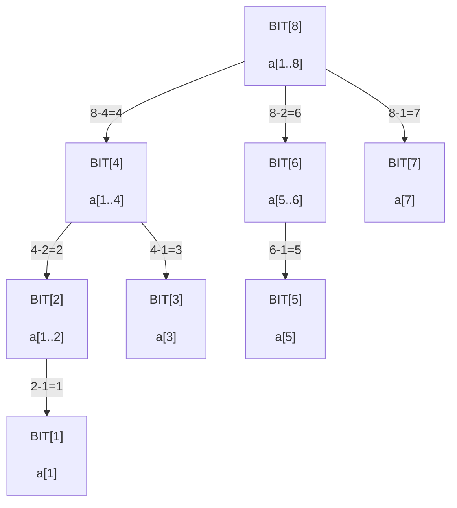
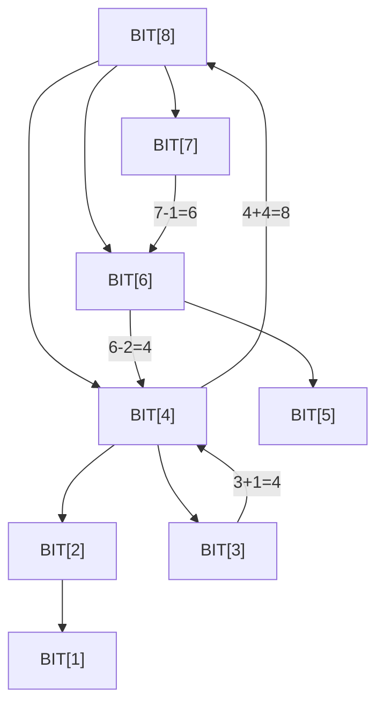

# Bài 8d: Fenwick Tree (BIT) - Cây Chỉ Số Nhị Phân

> **Tác giả:** Hà Trí Kiên<br>
> **Nội dung tham khảo từ:** VNOI Wiki - Fenwick Tree, CP-Algorithms

---

## 1. Bài toán

Bạn là quản lý kho. Có N sản phẩm, mỗi sản phẩm có số lượng tồn. Cần:

- **Truy vấn:** "Tổng số lượng từ sản phẩm 1 đến sản phẩm i là bao nhiêu?"
- **Cập nhật:** "Thêm 5 đơn vị vào sản phẩm 7!"

Với mảng thường: mỗi truy vấn tổng prefix mất **O(N)**. Nếu có Q truy vấn → **O(NQ)** — quá chậm!

**Fenwick Tree (BIT)** giải quyết cả 2 thao tác trong **O(log N)** với chỉ **~10 dòng code**!

<p align="center"><br><em>Minh họa Fenwick Tree (Nguồn: VisuAlgo)</em></p>

---

## 2. So sánh với Prefix Sum và Segment Tree

!!! tip "Thử tương tác"
    <iframe src="https://visualgo.net/en/fenwicktree" style="width: 100%; height: 500px; border: 1px solid #ccc; border-radius: 8px;"></iframe>

| | Prefix Sum | BIT | Segment Tree |
|--|-----------|-----|-------------|
| Tính tổng [1..p] | **O(1)** | O(log N) | O(log N) |
| Cập nhật a[i] | O(N) | **O(log N)** | O(log N) |
| Cập nhật đoạn | O(1) (diff array) | O(N log N) | O(log N) với lazy |
| Code ngắn? | ✅ | ✅ | ❌ Dài hơn |
| Linh hoạt? | ❌ Chỉ tổng | Trung bình | ✅ Rất linh hoạt |
| Bộ nhớ | O(N) | O(N) | O(4N) |
| Hỗ trợ min/max? | ❌ | ❌ (trừ cách đặc biệt) | ✅ |

---

## 3. Ý tưởng: "Đóng gói" bằng bit

BIT chia mảng thành các "block" có **độ dài là lũy thừa của 2**, dựa trên **bit thấp nhất** của chỉ số.

### 3.1. Phép toán `i & (-i)` — Bit thấp nhất

Trong máy tính, số âm được lưu dưới dạng **số bù 2** (Two's Complement):
1. Đảo tất cả các bit (NOT)
2. Cộng thêm 1

Khi thực hiện `i & (-i)`, phép AND chỉ giữ lại **duy nhất 1 bit** ở vị trí thấp nhất đang bật (lowest set bit).

```
Ví dụ chi tiết với i = 12:

Bước 1: Viết i ở dạng nhị phân
  i  = 12 = 1100₂

Bước 2: Tìm -i (số bù 2)
  Bước 2a: Đảo bit  → 0011₂
  Bước 2b: Cộng 1   → 0100₂
  -i = -12 = ...1111110100₂  (trong 32-bit: 11111111111111111111111111110100₂)

Bước 3: i & (-i)
    1100₂   (i = 12)
  & 0100₂   (-i = -12, chỉ lấy 4 bit cuối minh họa)
  ------
    0100₂   = 4

→ i & (-i) = 4, nghĩa là bit thấp nhất của 12 là bit thứ 2 (tính từ 0), giá trị 4.
→ BIT[12] quản lý block gồm 4 phần tử: a[9], a[10], a[11], a[12].

Bảng các giá trị i & (-i) thường dùng:
┌──────┬──────────┬────────────┬───────────────────────────────┐
│  i   │ Nhị phân │ i & (-i)   │ Ý nghĩa: block dài bao nhiêu │
├──────┼──────────┼────────────┼───────────────────────────────┤
│  1   │ 0001₂   │ 1  (0001₂) │ block dài 1: a[1]             │
│  2   │ 0010₂   │ 2  (0010₂) │ block dài 2: a[1..2]          │
│  3   │ 0011₂   │ 1  (0001₂) │ block dài 1: a[3]             │
│  4   │ 0100₂   │ 4  (0100₂) │ block dài 4: a[1..4]          │
│  5   │ 0101₂   │ 1  (0001₂) │ block dài 1: a[5]             │
│  6   │ 0110₂   │ 2  (0010₂) │ block dài 2: a[5..6]          │
│  7   │ 0111₂   │ 1  (0001₂) │ block dài 1: a[7]             │
│  8   │ 1000₂   │ 8  (1000₂) │ block dài 8: a[1..8]          │
│  9   │ 1001₂   │ 1  (0001₂) │ block dài 1: a[9]             │
│ 10   │ 1010₂   │ 2  (0010₂) │ block dài 2: a[9..10]         │
│ 11   │ 1011₂   │ 1  (0001₂) │ block dài 1: a[11]            │
│ 12   │ 1100₂   │ 4  (0100₂) │ block dài 4: a[9..12]         │
│ 13   │ 1101₂   │ 1  (0001₂) │ block dài 1: a[13]            │
│ 14   │ 1110₂   │ 2  (0010₂) │ block dài 2: a[13..14]        │
│ 15   │ 1111₂   │ 1  (0001₂) │ block dài 1: a[15]            │
│ 16   │10000₂   │ 16 (10000₂)│ block dài 16: a[1..16]        │
└──────┴──────────┴────────────┴───────────────────────────────┘

Quy luật:
  - Số lẻ → luôn có i & (-i) = 1 (block dài 1)
  - Số chẵn → block dài tùy thuộc vào số bit 0 ở cuối
```

### 3.2. BIT hoạt động như thế nào?

Mỗi vị trí `i` trong BIT lưu tổng của một đoạn con:

```
BIT[i] = tổng a[i - (i & (-i)) + 1] đến a[i]

Ví dụ với N = 8:
  BIT[1] = a[1]                           (block dài 1)
  BIT[2] = a[1] + a[2]                    (block dài 2)
  BIT[3] = a[3]                           (block dài 1)
  BIT[4] = a[1] + a[2] + a[3] + a[4]     (block dài 4)
  BIT[5] = a[5]                           (block dài 1)
  BIT[6] = a[5] + a[6]                    (block dài 2)
  BIT[7] = a[7]                           (block dài 1)
  BIT[8] = a[1] + a[2] + ... + a[8]       (block dài 8)
```

### 3.3. Cấu trúc cây của BIT (Graphviz DOT)



Minh họa đường đi khi truy vấn và cập nhật:



---

## 4. Truy vấn: Tổng từ 1 đến i

Để tính tổng a[1..i], ta **cộng các BIT** theo hướng **giảm dần** (xóa bit thấp nhất mỗi bước):

```
Tính prefix_sum(13) = a[1] + ... + a[13]:

i = 13 = 1101₂, lowbit = 1 (0001₂):
  → Lấy BIT[13] = a[13]
  → i = 13 - 1 = 12

i = 12 = 1100₂, lowbit = 4 (0100₂):
  → Lấy BIT[12] = a[9]+a[10]+a[11]+a[12]
  → i = 12 - 4 = 8

i = 8 = 1000₂, lowbit = 8 (1000₂):
  → Lấy BIT[8] = a[1]+a[2]+...+a[8]
  → i = 8 - 8 = 0

Dừng! (i = 0)

Kết quả = BIT[13] + BIT[12] + BIT[8]
        = a[13] + (a[9]+a[10]+a[11]+a[12]) + (a[1]+...+a[8])
        = a[1] + a[2] + ... + a[13] ✅

Tổng cộng chỉ 3 bước thay vì 13 phép cộng!
```

**Tại sao đi giảm dần?** Vì khi xóa bit thấp nhất của `i`, ta nhảy đến vị trí BIT quản lý đoạn trước đó. Cứ thế cho đến khi `i = 0`.

---

## 5. Cập nhật: Cộng thêm delta vào vị trí i

Khi cập nhật a[i], cần cập nhật **tất cả BIT "bao chứa" i** — đi theo hướng **tăng dần** (thêm bit thấp nhất mỗi bước):

```
Cập nhật a[5] += 3:

i = 5 = 101₂, lowbit = 1 (0001₂):
  → BIT[5] += 3    (BIT[5] quản lý a[5])
  → i = 5 + 1 = 6

i = 6 = 110₂, lowbit = 2 (0010₂):
  → BIT[6] += 3    (BIT[6] quản lý a[5]+a[6], có chứa a[5])
  → i = 6 + 2 = 8

i = 8 = 1000₂, lowbit = 8 (1000₂):
  → BIT[8] += 3    (BIT[8] quản lý a[1]+...+a[8], có chứa a[5])
  → i = 8 + 8 = 16

Dừng! (16 > N)

Cập nhật 3 bit: BIT[5], BIT[6], BIT[8] — chỉ O(log N) bước!
```

**Tại sao đi tăng dần?** Vì khi thêm bit thấp nhất của `i`, ta nhảy đến BIT cha (quản lý đoạn lớn hơn) có chứa vị trí `i`.

---

## 6. Code C++ — BIT cơ bản

```cpp
#include <bits/stdc++.h>
using namespace std;

const int MAXN = 200005;
int bit[MAXN];  // Fenwick Tree — LUÔN 1-indexed!
int n;          // Kích thước mảng

// Cập nhật: cộng thêm delta vào vị trí i — O(log N)
void update(int i, int delta) {
    // Đi TĂNG DẦN: thêm lowbit mỗi bước
    // Mỗi bước nhảy đến BIT cha (đoạn lớn hơn chứa i)
    for (; i <= n; i += i & (-i))
        bit[i] += delta;
}

// Truy vấn: tổng prefix a[1] + a[2] + ... + a[i] — O(log N)
int query(int i) {
    int sum = 0;
    // Đi GIẢM DẦN: xóa lowbit mỗi bước
    // Mỗi bước nhảy đến BIT quản lý đoạn trước đó
    for (; i > 0; i -= i & (-i))
        sum += bit[i];
    return sum;
}

// Tổng đoạn [l, r] = prefix(r) - prefix(l-1) — O(log N)
int rangeSum(int l, int r) {
    return query(r) - query(l - 1);
}

int main() {
    ios_base::sync_with_stdio(false);
    cin.tie(NULL);

    cin >> n;
    // Xây BIT từ mảng đầu vào
    for (int i = 1; i <= n; i++) {
        int val;
        cin >> val;
        update(i, val);  // Thêm giá trị vào BIT tại vị trí i
    }

    int q;
    cin >> q;
    while (q--) {
        int type, l, r;
        cin >> type >> l >> r;
        if (type == 1) {
            // Cập nhật: cộng thêm r vào vị trí l
            update(l, r);
        } else {
            // Truy vấn: tổng đoạn [l, r]
            cout << rangeSum(l, r) << "\n";
        }
    }
}
```

---

## 7. Code Python — BIT cơ bản

```python
class FenwickTree:
    def __init__(self, n):
        self.n = n
        self.bit = [0] * (n + 1)  # 1-indexed, index 0 không dùng

    def update(self, i, delta):
        """Cộng thêm delta vào a[i] — O(log N)
        Đi tăng dần: thêm lowbit mỗi bước → nhảy đến BIT cha
        """
        while i <= self.n:
            self.bit[i] += delta
            i += i & (-i)  # Thêm bit thấp nhất

    def query(self, i):
        """Tính tổng prefix a[1] + ... + a[i] — O(log N)
        Đi giảm dần: xóa lowbit mỗi bước → nhảy đến đoạn trước
        """
        s = 0
        while i > 0:
            s += self.bit[i]
            i -= i & (-i)  # Xóa bit thấp nhất
        return s

    def range_sum(self, l, r):
        """Tính tổng đoạn [l, r] — O(log N)"""
        return self.query(r) - self.query(l - 1)

# Sử dụng
n = int(input())
a = [0] + list(map(int, input().split()))  # 1-indexed

bit = FenwickTree(n)
for i in range(1, n + 1):
    bit.update(i, a[i])

q = int(input())
for _ in range(q):
    parts = list(map(int, input().split()))
    if parts[0] == 1:
        # Cập nhật: cộng thêm parts[2] vào vị trí parts[1]
        bit.update(parts[1], parts[2])
    else:
        # Truy vấn: tổng đoạn [parts[1], parts[2]]
        print(bit.range_sum(parts[1], parts[2]))
```

---

## 8. Minh họa xây dựng BIT

```
Mảng a: [_, 3, 1, 4, 1, 5, 9, 2] (1-indexed, a[0] bỏ qua)

Xây BIT bằng cách gọi update(i, a[i]) cho từng i:

update(1, 3):  BIT[1]+=3 → BIT[2]+=3 → BIT[4]+=3 → BIT[8]+=3
update(2, 1):  BIT[2]+=1 → BIT[4]+=1 → BIT[8]+=1
update(3, 4):  BIT[3]+=4 → BIT[4]+=4 → BIT[8]+=4
update(4, 1):  BIT[4]+=1 → BIT[8]+=1
update(5, 5):  BIT[5]+=5 → BIT[6]+=5 → BIT[8]+=5
update(6, 9):  BIT[6]+=9 → BIT[8]+=9
update(7, 2):  BIT[7]+=2 → BIT[8]+=2

Kết quả:
  BIT = [_, 3, 4, 4, 9, 5, 14, 2, 27]
         ^  ^  ^  ^  ^  ^   ^  ^
         |  |  |  |  |  |   |  |
         1  2  3  4  5  6   7  8

Kiểm tra:
  query(5) = BIT[5] + BIT[4] = 5 + 9 = 14
           = 3 + 1 + 4 + 1 + 5 = 14 ✅

  query(7) = BIT[7] + BIT[6] + BIT[4] = 2 + 14 + 9 = 25
           = 3 + 1 + 4 + 1 + 5 + 9 + 2 = 25 ✅

  range_sum(3, 6) = query(6) - query(2)
                  = (BIT[6] + BIT[4]) - (BIT[2])
                  = (14 + 9) - 4 = 19
                  = 4 + 1 + 5 + 9 = 19 ✅
```

---

## 9. BIT 2D (Fenwick Tree 2D)

BIT có thể mở rộng sang 2 chiều để truy vấn tổng trên hình chữ nhật.

### 9.1. Bài toán

Cho ma trận N×M, cần:
- Cập nhật: `a[r][c] += delta`
- Truy vấn: tổng các phần tử trong hình chữ nhật từ (1,1) đến (r,c)

### 9.2. Ý tưởng

Mở rộng BIT 1D: thay vì 1 vòng lặp, dùng **2 vòng lặp lồng nhau** cho 2 chiều.

### 9.3. Code C++

```cpp
const int MAXN = 1005;
int bit2d[MAXN][MAXN];  // BIT 2D — 1-indexed cả 2 chiều
int n, m;

// Cập nhật: a[r][c] += delta — O(log N * log M)
void update(int r, int c, int delta) {
    // Duyệt qua tất cả BIT "bao chứa" (r, c) ở CẢ 2 chiều
    for (int i = r; i <= n; i += i & (-i))
        for (int j = c; j <= m; j += j & (-j))
            bit2d[i][j] += delta;
}

// Truy vấn: tổng hình chữ nhật từ (1,1) đến (r,c) — O(log N * log M)
int query(int r, int c) {
    int sum = 0;
    // Duyệt qua tất cả BIT "bao chứa" đoạn (1,1)→(r,c) ở CẢ 2 chiều
    for (int i = r; i > 0; i -= i & (-i))
        for (int j = c; j > 0; j -= j & (-j))
            sum += bit2d[i][j];
    return sum;
}

// Tổng hình chữ nhật từ (r1,c1) đến (r2,c2) — O(log N * log M)
// Dùng nguyên lý bao hàm-xử trừ (inclusion-exclusion)
int rangeSum(int r1, int c1, int r2, int c2) {
    return query(r2, c2)
         - query(r1 - 1, c2)
         - query(r2, c1 - 1)
         + query(r1 - 1, c1 - 1);
}
```

```
Minh họa nguyên lý inclusion-exclusion cho rangeSum(r1,c1,r2,c2):

┌─────────────────────────┐
│ (1,1)    →    (r1-1,c2) │  ← query(r1-1, c2)
│         ┌───────┐       │
│         │ BỎ   │       │
│         │ (r1-1,│       │
│         │ c1-1) │       │
├─────────┼───────┼───────┤
│ (r1,1)  │ (r1,  │(r1,c2)│
│         │ c1)   │       │
│         │       │       │
│         │ LẤY  │       │
│         │ (r2,c2)│      │
│         └───────┘       │
│ (r2,1)    →    (r2,c2)  │
└─────────────────────────┘

rangeSum = query(r2,c2) - query(r1-1,c2) - query(r2,c1-1) + query(r1-1,c1-1)
```

### 9.4. Code Python

```python
class FenwickTree2D:
    def __init__(self, n, m):
        self.n = n
        self.m = m
        self.bit = [[0] * (m + 1) for _ in range(n + 1)]

    def update(self, r, c, delta):
        """a[r][c] += delta — O(log N * log M)"""
        i = r
        while i <= self.n:
            j = c
            while j <= self.m:
                self.bit[i][j] += delta
                j += j & (-j)
            i += i & (-i)

    def query(self, r, c):
        """Tổng từ (1,1) đến (r,c) — O(log N * log M)"""
        s = 0
        i = r
        while i > 0:
            j = c
            while j > 0:
                s += self.bit[i][j]
                j -= j & (-j)
            i -= i & (-i)
        return s

    def range_sum(self, r1, c1, r2, c2):
        """Tổng hình chữ nhật (r1,c1)→(r2,c2)"""
        return (self.query(r2, c2)
              - self.query(r1 - 1, c2)
              - self.query(r2, c1 - 1)
              + self.query(r1 - 1, c1 - 1))
```

---

## 10. BIT cho Range Update + Point Query (Cập nhật đoạn, truy vấn điểm)

### 10.1. Bài toán

- **Cập nhật:** Cộng thêm `val` cho **tất cả** phần tử từ `a[l]` đến `a[r]`
- **Truy vấn:** Giá trị của `a[i]` sau nhiều lần cập nhật

### 10.2. Ý tưởng: Dùng mảng hiệu (Difference Array)

Tạo mảng hiệu `d[]` sao cho `a[i] = d[1] + d[2] + ... + d[i]`.

Khi muốn cộng `val` cho `a[l]..a[r]`:
- `d[l] += val` (bắt đầu cộng từ l)
- `d[r+1] -= val` (dừng cộng từ r+1)

→ Truy vấn `a[i]` = tổng prefix `d[1..i]` → **dùng BIT trên mảng d!**

### 10.3. Code C++

```cpp
int bit[MAXN];  // BIT trên mảng hiệu
int n;

// Cập nhật: cộng thêm val cho a[l]..a[r] — O(log N)
void range_update(int l, int r, int val) {
    update(l, val);      // d[l] += val  (bắt đầu cộng)
    update(r + 1, -val); // d[r+1] -= val (dừng cộng)
}

// Truy vấn: giá trị a[i] — O(log N)
int point_query(int i) {
    return query(i);  // a[i] = d[1] + d[2] + ... + d[i]
}

// update và query là hàm BIT cơ bản như ở trên
```

### 10.4. Code Python

```python
class BITRangeUpdatePointQuery:
    def __init__(self, n):
        self.n = n
        self.bit = [0] * (n + 1)

    def _update(self, i, delta):
        while i <= self.n:
            self.bit[i] += delta
            i += i & (-i)

    def _query(self, i):
        s = 0
        while i > 0:
            s += self.bit[i]
            i -= i & (-i)
        return s

    def range_update(self, l, r, val):
        """Cộng thêm val cho a[l]..a[r]"""
        self._update(l, val)
        self._update(r + 1, -val)

    def point_query(self, i):
        """Lấy giá trị a[i]"""
        return self._query(i)
```

```
Ví dụ:
  a = [0, 0, 0, 0, 0, 0] (1-indexed, ban đầu = 0)
  d = [0, 0, 0, 0, 0, 0]

  range_update(2, 4, 3):  // Cộng 3 cho a[2]..a[4]
    d[2] += 3  → d = [0, 3, 0, 0, 0, 0]
    d[5] -= 3  → d = [0, 3, 0, 0, -3, 0]

  range_update(3, 5, 2):  // Cộng 2 cho a[3]..a[5]
    d[3] += 2  → d = [0, 3, 2, 0, -3, 0]
    d[6] -= 2  → d = [0, 3, 2, 0, -3, -2]

  point_query(1) = d[1] = 0
  point_query(2) = d[1]+d[2] = 0+3 = 3
  point_query(3) = d[1]+d[2]+d[3] = 0+3+2 = 5
  point_query(4) = d[1]+...+d[4] = 0+3+2+0 = 5
  point_query(5) = d[1]+...+d[5] = 0+3+2+0-3 = 2

  Kiểm tra: a = [0, 3, 5, 5, 2, 0] ✅
```

---

## 11. BIT cho Range Update + Range Query (Cập nhật đoạn, truy vấn đoạn)

### 11.1. Bài toán

- **Cập nhật:** Cộng thêm `val` cho **tất cả** phần tử từ `a[l]` đến `a[r]`
- **Truy vấn:** Tổng các phần tử từ `a[l]` đến `a[r]`

### 11.2. Ý tưởng

Đây là bài toán khó hơn. Ta cần **2 BIT** dựa trên công thức:

```
Nếu ta cộng val cho a[l]..a[r], thì tổng prefix [1..x] thay đổi:
  - Nếu x < l:  không thay đổi
  - If l ≤ x ≤ r:  tăng thêm val * (x - l + 1) = val*x - val*(l-1)
  - If x > r:  tăng thêm val * (r - l + 1) (hằng số)

Tổng prefix(x) = val*x * [l ≤ x ≤ r] - val*(l-1) * [l ≤ x ≤ r] + val*(r-l+1) * [x > r]

→ Dùng 2 BIT:
  BIT1: lưu hệ số nhân với x
  BIT2: lưu hằng số cộng thêm

Tổng prefix(x) = BIT1.query(x) * x + BIT2.query(x)
```

### 11.3. Code C++

```cpp
const int MAXN = 200005;
long long bit1[MAXN], bit2[MAXN];  // 2 BIT
int n;

// Hàm update cho 1 BIT
void _update(long long bit[], int i, long long delta) {
    for (; i <= n; i += i & (-i))
        bit[i] += delta;
}

// Hàm query cho 1 BIT
long long _query(long long bit[], int i) {
    long long sum = 0;
    for (; i > 0; i -= i & (-i))
        sum += bit[i];
    return sum;
}

// Cập nhật: cộng thêm val cho a[l]..a[r] — O(log N)
void range_update(int l, int r, long long val) {
    _update(bit1, l, val);
    _update(bit1, r + 1, -val);
    _update(bit2, l, val * (l - 1));
    _update(bit2, r + 1, -val * r);
}

// Tổng prefix a[1] + ... + a[i] — O(log N)
long long prefix_sum(int i) {
    return _query(bit1, i) * i - _query(bit2, i);
}

// Tổng đoạn [l, r] — O(log N)
long long range_sum(int l, int r) {
    return prefix_sum(r) - prefix_sum(l - 1);
}
```

### 11.4. Code Python

```python
class BITRangeUpdateRangeQuery:
    def __init__(self, n):
        self.n = n
        self.bit1 = [0] * (n + 1)  # Hệ số nhân
        self.bit2 = [0] * (n + 1)  # Hằng số

    def _update(self, bit, i, delta):
        while i <= self.n:
            bit[i] += delta
            i += i & (-i)

    def _query(self, bit, i):
        s = 0
        while i > 0:
            s += bit[i]
            i -= i & (-i)
        return s

    def range_update(self, l, r, val):
        """Cộng thêm val cho a[l]..a[r]"""
        self._update(self.bit1, l, val)
        self._update(self.bit1, r + 1, -val)
        self._update(self.bit2, l, val * (l - 1))
        self._update(self.bit2, r + 1, -val * r)

    def prefix_sum(self, i):
        """Tổng prefix a[1] + ... + a[i]"""
        return self._query(self.bit1, i) * i - self._query(self.bit2, i)

    def range_sum(self, l, r):
        """Tổng đoạn [l, r]"""
        return self.prefix_sum(r) - self.prefix_sum(l - 1)
```

```
Công thức kiểm tra:

prefix_sum(x) = BIT1.query(x) * x - BIT2.query(x)

Giải thích:
  Khi range_update(l, r, val):
    BIT1: += val tại l, -= val tại r+1
    BIT2: += val*(l-1) tại l, -= val*r tại r+1

  prefix_sum(x) với l ≤ x ≤ r:
    = val * x - val*(l-1)
    = val * (x - l + 1)  ← đúng! (tăng val cho mỗi phần tử từ l đến x)

  prefix_sum(x) với x > r:
    = val * (r - l + 1)  ← đúng! (tổng cộng tăng val cho đúng r-l+1 phần tử)
```

---

## 12. Khi nào dùng BIT vs Segment Tree?

| Tiêu chí | BIT (Fenwick Tree) | Segment Tree |
|-----------|-------------------|--------------|
| **Độ phức tạp** | O(log N) | O(log N) |
| **Bộ nhớ** | O(N) — chỉ 1 mảng | O(4N) — cây nhị phân |
| **Độ dài code** | ~10 dòng (2 hàm) | ~40-50 dòng |
| **Tốc độ thực tế** | Nhanh hơn (ít cache miss) | Chậm hơn (truy cập nhảy cóc) |
| **Tổng đoạn + cập nhật điểm** | ✅ Tốt nhất | ✅ Được nhưng phức tạp hơn |
| **Min/Max + cập nhật điểm** | ❌ Không trực tiếp | ✅ Tốt nhất |
| **Cập nhật đoạn (lazy)** | ✅ (với kỹ thuật đặc biệt) | ✅ (lazy propagation) |
| **Truy vấn min/max đoạn** | ❌ Không hỗ trợ | ✅ Tốt nhất |
| **Persistent (lịch sử)** | Khó | ✅ Dễ dàng |
| **2D** | ✅ Code đơn giản | ✅ nhưng phức tạp hơn |
| **Học và nhớ** | ✅ Dễ nhớ | ❌ Nhiều chi tiết |
| **Khi nào dùng?** | Chỉ cần tổng/count | Cần linh hoạt hơn |

**Tóm tắt lựa chọn:**

```
Cần tổng đoạn + cập nhật điểm?
  → Dùng BIT (ngắn, nhanh)

Cần min/max đoạn?
  → Dùng Segment Tree

Cần cập nhật đoạn + truy vấn đoạn?
  → Cả hai đều được, nhưng Segment Tree + lazy trực quan hơn

Cần code ngắn, thi đấu?
  → BIT (ít chỗ sai hơn)

Cần nhiều loại truy vấn khác nhau?
  → Segment Tree (linh hoạt nhất)
```

---

## 13. Lưu ý / Cạm bẫy

### 13.1. Luôn 1-indexed

```cpp
// SAI: Dùng BIT với index 0 → vòng lặp vô hạn!
update(0, delta);  // i += i & (-i) = 0 + 0 = 0 → lặp mãi!

// ĐÚNG: BIT luôn bắt đầu từ index 1
// Nếu mảng gốc 0-indexed: cập nhật BIT tại index i+1
update(i + 1, delta);
```

### 13.2. Quên cập nhật khi thay đổi giá trị

```cpp
// SAI: Gán giá trị mới mà không trừ giá trị cũ
bit_update(pos, newVal);  // Chỉ cộng thêm newVal → SAI!

// ĐÚNG: Phải trừ giá trị cũ
int oldVal = a[pos];
a[pos] = newVal;
bit_update(pos, newVal - oldVal);  // Cộng thêm hiệu
```

### 13.3. Integer Overflow

```cpp
// SAI: Dùng int khi giá trị hoặc tổng có thể lớn
int bit[MAXN];  // Tổng có thể vượt 2^31

// ĐÚNG: Dùng long long khi cần
long long bit[MAXN];
```

### 13.4. Quên `i > 0` trong query

```cpp
// SAI: Không kiểm tra i > 0
int query(int i) {
    int sum = 0;
    for (; i > 0; i -= i & (-i))  // i > 0, KHÔNG PHẢI i >= 0
        sum += bit[i];
    return sum;
}

// Nếu i = 0: i -= i & (-i) = 0 - 0 = 0 → lặp vô hạn!
```

---

## 14. Bài tập luyện tập

| Bài | Nền tảng | Độ khó | Ghi chú |
|-----|----------|--------|---------|
| [CSES - Dynamic Range Sum Queries](https://cses.fi/problemset/task/1648) | CSES | ⭐⭐ | BIT cơ bản |
| [CSES - Salary Queries](https://cses.fi/problemset/task/1144) | CSES | ⭐⭐⭐ | BIT + Coordinate Compression |
| [CSES - Prefix Sum Queries](https://cses.fi/problemset/task/2166) | CSES | ⭐⭐⭐ | BIT nâng cao |
| [CSES - Range Update Queries](https://cses.fi/problemset/task/1651) | CSES | ⭐⭐⭐ | BIT range update |
| [LeetCode - Count of Smaller Numbers After Self](https://leetcode.com/problems/count-of-smaller-numbers-after-self/) | LeetCode | ⭐⭐⭐ | BIT / Segment Tree |
| [SPOJ - UPDATEIT](https://www.spoj.com/problems/UPDATEIT/) | SPOJ | ⭐⭐ | Range Update + Point Query |
| [SPOJ - HORRIBLE](https://www.spoj.com/problems/HORRIBLE/) | SPOJ | ⭐⭐⭐ | Range Update + Range Query |

---

## Tài liệu tham khảo

- [CP-Algorithms - Fenwick Tree](https://cp-algorithms.com/data_structures/fenwick.html)
- [CP-Algorithms - Fenwick Tree 2D](https://cp-algorithms.com/data_structures/fenwick.html#finding-sum-in-two-dimensional-array)
- [Topcoder - Binary Indexed Trees](https://www.topcoder.com/community/competitive-programming/tutorials/binary-indexed-trees/)
- [VNOI Wiki - Fenwick Tree](https://wiki.vnoi.info/algo/data-structures/fenwick)
- [USACO Guide - Fenwick Tree](https://usaco.guide/plat/Fenwick?lang=cpp)
